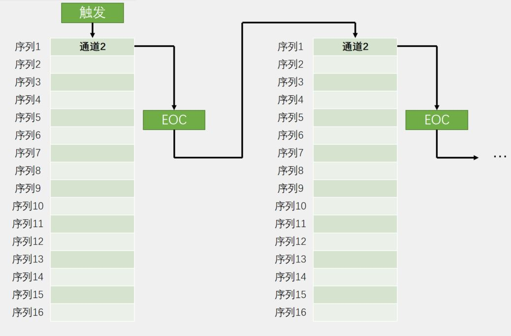

#  STM32 HAL 10_ADC

## 1. ADC 硬件原理

ADC全称Analog-to-Digital Converter，指模拟/数字转换器。ADC可以将引脚上连续变化的模拟电压转换为内存中存储的数字变量，建立模拟电路到数字电路的桥梁。

| ADC电路类型 | 优点             | 缺点                     |
| ----------- | ---------------- | ------------------------ |
| 并联比较型  | 转换速度最快     | 成本高、功耗高，分辨率低 |
| 逐次逼近型  | 结构简单，功耗低 | 转换速度较慢             |

**并联比较型**


**逐次逼近型**


### ADC 特性参数

**分辨率**：表示ADC能辨别的最小模拟量，用二进制位数表示，比如：8、10、12、16位等

**转换时间**：完成一次A/D转换所需要的时间，转换时间越短，采样率就可以越高

**精度**：最小刻度基础上叠加各种误差的参数，精度受ADC性能、温度和气压等影响

**量化误差**：用数字量近似表示模拟量，采用四舍五入原则，此过程产生的误差为量化误差

> 分辨率和采样速度相互矛盾，分辨率越高，采样速率越低.

- 电压输入

$V_{REF–}$ : 0V，$V_{REF+}$ : 一般为3.3V

$V_{REF–}≤V_{IN}≤V_{REF+}$

## 2. STM32 ADC控制器


### ADC 转换模式

**单次转换，非扫描模式**


**连续转换，非扫描模式**



**单次转换，扫描模式**


**连续转换，扫描模式**


### 校准

ADC有一个内置自校准模式。校准可大幅减小因内部电容器组的变化而造成的准精度误差。校准期间，在每个电容器上都会计算出一个误差修正码(数字值)，这个码用于消除在随后的转换中每个电容器上产生的误差。

建议在每次上电后执行一次校准。

启动校准前， ADC必须处于关电状态超过至少两个ADC时钟周期。

### 数据对齐

数据对齐一般采用右对齐。

### 注入通道，规则通道：

1. **注入通道：**
   程序正常运行的通道
2. **规则通道：**
   注入通道可以打断规则通道，如果在规则通道转换过程中，有注入通道进行转换，那么就要先转换完注入通道，等注入通道转换完成后，再回到规则通道的转换流程（类似于中断）。

## 3. ADC 的使用

### HAL 库函数

```c
/**
  * @brief  ADC校准函数，建议运行
  * @param  hadc ADC句柄 hadcx
  */
HAL_StatusTypeDef HAL_ADCEx_Calibration_Start(ADC_HandleTypeDef* hadc);

/**
  * @brief  ADC轮询方式启动函数，若为单次模式，应在循环中启动
  * @param  hadc ADC句柄 hadcx
  */
HAL_StatusTypeDef HAL_ADC_Start(ADC_HandleTypeDef* hadc);

/**
  * @brief  ADC轮询方式停止函数
  * @param  hadc ADC句柄 hadcx
  */
HAL_StatusTypeDef HAL_ADC_Stop(ADC_HandleTypeDef* hadc);

/**
  * @brief  等待转换完成（EOC标志）函数
  * @param  hadc ADC句柄 hadcx
  * @param  Timeout 超时时间
  */
HAL_StatusTypeDef HAL_ADC_PollForConversion(ADC_HandleTypeDef* hadc, uint32_t Timeout);

/**
  * @brief  ADC中断方式启动函数，若为单次模式，应在中断中启动
  * @param  hadc ADC句柄 hadcx
  */
HAL_StatusTypeDef HAL_ADC_Start_IT(ADC_HandleTypeDef* hadc);

/**
  * @brief  ADC中断方式停止函数
  * @param  hadc ADC句柄 hadcx
  */
HAL_StatusTypeDef HAL_ADC_Stop_IT(ADC_HandleTypeDef* hadc);

/**
  * @brief  ADC DMA方式启动函数
  * @param  hadc ADC句柄 hadcx
  * @param  pData 数据缓存区地址
  * @param  Length 数据缓存区字节数
  * @retval None
  */
HAL_StatusTypeDef HAL_ADC_Start_DMA(ADC_HandleTypeDef* hadc, uint32_t* pData, uint32_t Length);
    
/**
  * @brief  读取ADC值函数（0-4096）
  * @param  hadc ADC句柄 hadcx
  * @retval ADC数值
  */
uint32_t HAL_ADC_GetValue(ADC_HandleTypeDef* hadc);

/**
  * @brief  ADC转换完成中断回调函数
  */
void HAL_ADC_ConvCpltCallback(ADC_HandleTypeDef* hadc);
```

### ADC 单通道转换

> 1. ADC 校准；
> 2. 如果为非扫描模式，在循环中启动ADC，如果为扫描模式，在循环前启动ADC。
> 3. 等待转换完成；
> 4. 读取值（可用`HAL_IS_BIT_SET(HAL_ADC_GetState(&hadcx), HAL_ADC_STATE_REG_EOC)`条件辅助判断）
> 5. 进行结果转换。

### ADC 多通道转换

> 应打开连续和扫描模式，配合DMA使用。
