# 计算机网络基础

> 本节简单介绍一下计算机网络基础，详细内容将在 LwIP 内进行介绍。
>
> 参考链接：[链接](https://www.bilibili.com/video/BV1c4411d7jb?vd_source=2d2507d13250e2545de99f3c552af296&spm_id_from=333.788.videopod.episodes)

## 1. 概述

- 网络/互联网/因特网

  网络：网络(Network)由若干结点(Node)和连接结点的链路(Link)构成。

  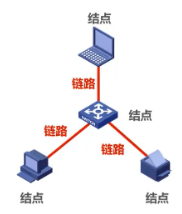

  互联网/互连网：由多个网络通过路由器互联起来构成。

  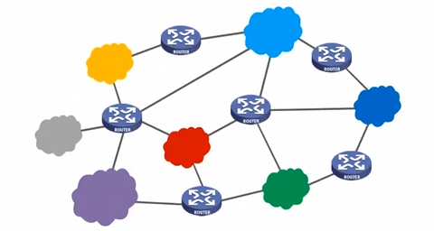

  因特网：世界上最大的互联网。

  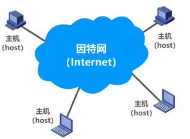

  > 普通用户通过因特网服务提供者(ISP)接入因特网，ISP 可以从因特网管理机构申请到成块的 IP 地址，同时拥有通信线路以及路由器等联网设备。任何机构和个人只需缴纳费用，就可从 ISP 的得到所需要的 IP 地址。
  >
  > 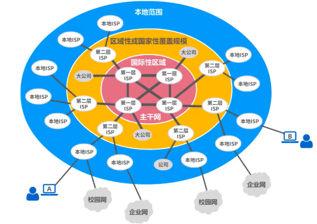

- 因特网的组成

  1. 边缘部分：由所有连接在因特网上的主机组成。这部分由用户直接使用，进行通信和资源共享。这部分主机又被称为端系统。

  2. 核心部分：由大量网络和连接这些网络的路由器组成。这部分为边缘部分提供服务（提供连通性和交换）。

     

- 端系统之间的通信方式

  端系统之间的通信指的是主机 A 的某个程序和主机 B 的某个程序之间进行通信。端之间的通信方式分为两类：**客户-服务器(C/S)方式**，**对等(P2P)方式**。

  客户-服务器方式中，客户是服务的请求方，服务器是服务的提供方。服务请求方和服务提供方都要使用网络核心部分所提供的服务。客户需要发起服务请求，服务器接收请求后提供服务。

  对等方式中，两个主机在通信时并不区分哪一个是服务请求方还是服务提供方。只要两个主机都运行了对等连接软件，就可以进行对等连接通信。

- 交换方式

  网络中的核心部分要向网络边缘中的大量主机提供连通性，使边缘部分中的任何一个主机都能够向其他主机通信（即传送或接收各种形式的数据）。

  1. 电路交换

     电路交换最开始使用传统两两相连的方式，当主机数量很多时，连接线相应增多。

     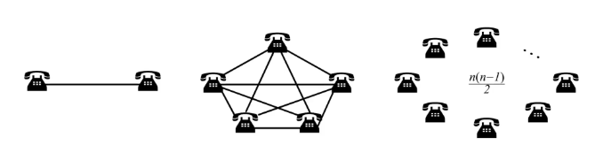

     此时需要中间设备将这些设备进行连接，称为交换机。

     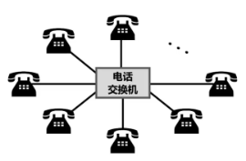

     电路交换的步骤：建立连接(分配通信资源) - 通信(占用通信资源) - 释放连接(归还通信资源)

     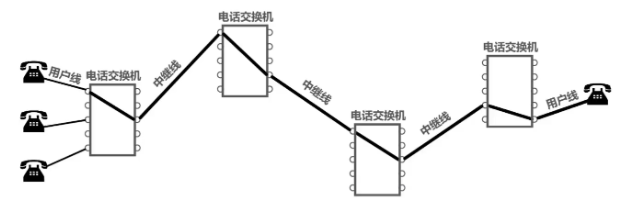

     当使用电路交换来传送计算机数据时，其线路的传输效率往往很低。这是因为计算机数据是突发式地出现在传输线路上的。

  2. 分组交换

     通常将表示消息的整块数据称为一个报文。

     在发送报文之前，先把较长的报文划分成一个个更小的等长数据段，在每一个数据段前加上一些由必要的控制信息组成的首部后，就构成一个分组，也可简称为包，相应的首部称为包头。

     包头包含了包的目的地址，包从源主机到目的主机可以走不同的传输路径。

     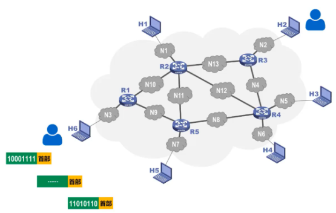

     路由器是实现分组交换的关键构件，进行分组(包)的缓存和分组(包)的转发。

     > 路由器的输入和输出端口之间没有直接连线；路由器把收到的分组先放入缓存，随后查找转发表，最后把分组送到适当的端口进行转发。
     >
     > 发送方进行分组的构造和发送；接收方进行分组的接收和报文还原。

  3. 报文交换

     报文交换中的交换结点也采用存储转发方式，但报文交换对报文的大小没有限制，这就要求交换结点需要较大的缓存空间。报文交换主要用于早期的电报通信网，现在较少使用。

  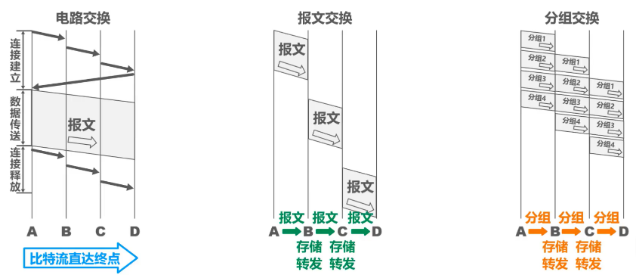

  > - 电路交换：通信之前首先要建立连接；连接建立好之后，就可以使用已建立好的连接进行数据传送；数据传送后，需释放连接，以归还之前建立连接所占用的通信线路资源。一旦建立连接，中间的各结点交换机就是直通形式的，比特流可以直达终点；
  >
  > - 报文交换：可以随时发送报文，而不需要事先建立连接；整个报文先传送到相邻结点交换机，全部存储下来后进行查表转发，转发到下一个结点交换机。整个报文需要在各结点交换机上进行存储转发，由于不限制报文大小，因此需要各结点交换机都具有较大的缓存空间。
  >
  > - 分组交换：可以随时发送分组，而不需要事先建立连接。构成原始报文的一个个分组，依次在各结点交换机上存储转发。各结点交换机在发送分组的同时，还缓存接收到的分组。构成原始报文的一个个分组，在各结点交换机上进行存储转发，相比报文交换，减少了转发时延，还可以避免过长的报文长时间占用链路，同时也有利于进行差错控制。

- 计算机网络分类

  1. 按传输介质分类：有线网络/无线网络；
  2. 按覆盖范围分类：广域网(WAN)(作用范围通常为几十到几千公里，通过长距离运送主机所发送的数据)/城域网(MAN)(作用范围一般是一个城市，可跨越几个街区甚至整个城市)/局域网(LAN)(一般用微型计算机或工作站通过高速通信线路相连，范围较小)/个域网(PAN)(把个人使用的电子设备用无线技术连接起来的网络)
  3. 按拓扑分类：总线型网络/星形网络/环形网络/网状网络。

- 计算机网络性能指标

  1. 速率：连接在计算机网络上的主机在数字信道上传输 Bit 的速率，单位 bit/s。
  2. 带宽：通信线路传送数据的能力，单位 bit/s。
  3. 吞吐量：单位时间通过某个网络的数据量，受到带宽限制。
  4. 时延：数据从网络的一端传送到另一端所需的时间。
  5. 利用率
  6. 丢包率：一定时间范围内，传输过程中丢失的分组数量和总分组数量的比例。

- 计算机网络体系结构

  当今最常见的是 TCP/IP 体系结构，现今规模最大的、覆盖全球的、基于 TCP/IP 的互联网并未使用 OSI 标准。TCP/IP 体系结构相当于将 OSI 体系结构的物理层和数据链路层合并为了网络接口层，并去掉了会话层和表示层。

  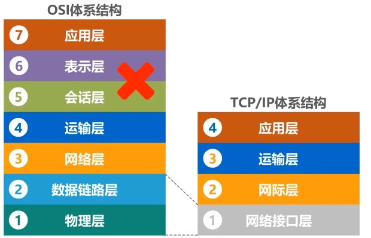

  在用户主机的操作系统中，通常都带有符合 TCP/IP 体系结构标准的 TCP/IP 协议族。而用于网络互连的路由器中，也带有符合 TCP/IP 体系结构标准的 TCP/IP 协议族。但路由器一般只包含网络接口层和网际层。

  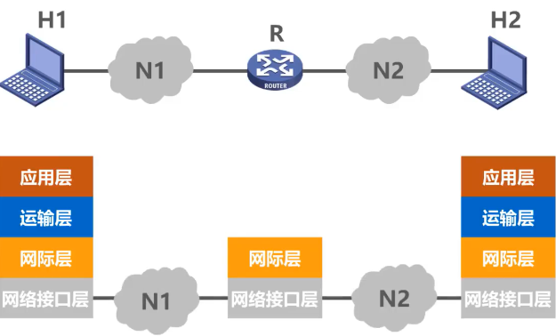

  > - **网络接口层**：并没有规定具体内容，目的是可以互连全世界各种不同的网络接口，如有线的以太网接口，无线局域网的 WIFI 接口等。
  >
  > - **网际层**：核心协议是 IP 协议。
  >
  > - **运输层**：包含 TCP 和 UDP 协议。
  >
  > - **应用层**：包含了大量的应用层协议，如 HTTP , DNS 协议等。
  >
  > > IP 协议（网际层）可以将不同的网络接口（网络接口层）进行互连，并向其上的 TCP 协议和 UDP 协议（运输层）提供网络互连服务。
  > >
  > > TCP 协议在享受 IP 协议提供的网络互连服务的基础上，可向应用层的相应协议提供可靠的传输服务。UDP 协议在享受 IP 协议提供的网络互连服务的基础上，可向应用层的相应协议提供不可靠的传输服务。

  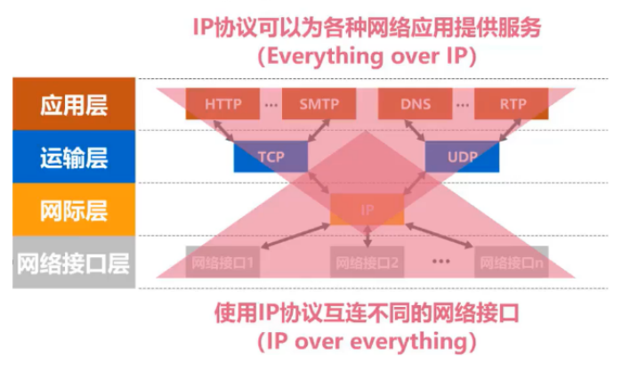

## 2. 物理层

### 传输介质

#### 导引性介质

- 同轴电缆

  

  1. 基带同轴电缆(50Ω)：数字传输，过去用于局域网；
  2. 宽带同轴电缆(75Ω)：模拟传输，目前主要用于有线电视。

- 双绞电缆（常用 RJ45 接口：4对差分双绞线）

  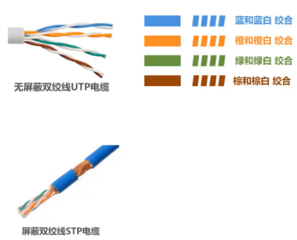

  | 双绞线类别 | 带宽   | 线缆                        | 应用                  |
  | ---------- | ------ | --------------------------- | --------------------- |
  | 3          | 16MHz  | 2对差分双绞线               | 传统以太网            |
  | 4          | 20MHz  | 4对差分双绞线               | 曾拥于令牌局域网      |
  | 5          | 100MHz | 4对差分双绞线(增加绞合度)   | 传输速率低于100Mbit/s |
  | 5E         | 125MHz | 4对差分双绞线(衰减低)       | 传输速率低于1Gbit/s   |
  | 6          | 250MHz | 4对差分双绞线(串扰性能改善) | 传输速率高于1Gbit/s   |
  | 7          | 600MHz | 4对屏蔽差分双绞线           | 传输速率高于10Gbit/s  |

- 光纤：通过电磁波全反射进行信号传播

  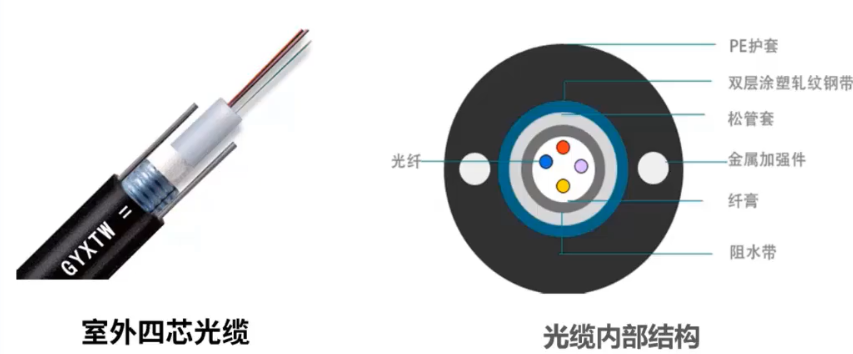

  通信容量大，传输损耗小，抗干扰能力好，但是切割需要专用设备。一般需要接入额外的光模块。

  1. 单模光纤：9μm 直径，黄色线，常见 100MHz/1000MHz，传输距离长。
  2. 多模光纤：50μm/62.5μm 直径，橙色线，常见1000MHz/10000MHz，传输距离短。

  连接器包括 PC/UPC(单模光纤-蓝色/多模光纤-米色或黑色)/APC(绿色)。

- 电力线

#### 非导引性介质

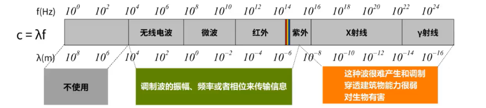

| 波段号 | 频段名称 | 缩写 | 频率范围     | 波段名称 | 波长             | 用途                       |
| ------ | -------- | ---- | ------------ | -------- | ---------------- | -------------------------- |
| 1      | 极低频   | ELF  | 3Hz-30Hz     | 极长波   | 100000km-10000km | 直接转换为声音/潜艇通讯    |
| 2      | 超低频   | SLF  | 30Hz-300Hz   | 超长波   | 10000km-1000km   | 直接转换为声音             |
| 3      | 特低频   | ULF  | 300Hz-3kHz   | 特长波   | 1000km-100km     | 直接转换为声音/矿场通讯    |
| 4      | 甚低频   | VLF  | 3kHz-30kHz   | 甚长波   | 100km-10km       | 直接转换为声音/超声        |
| 5      | 低频     | LF   | 30kHz-300kHz | 长波     | 10km-1km         | 国际广播                   |
| 6      | 中频     | MF   | 300kHz-3MHz  | 中波     | 1km-100m         | 调幅广播/航空通讯          |
| 7      | 高频     | HF   | 3MHz-30MHz   | 短波     | 100m-10m         | 短板/民用电台              |
| 8      | 甚高频   | VHF  | 30MHz-300MHz | 米波     | 10m-1m           | 调频广播/电视广播/航空通讯 |
| 9      | 特高频   | UHF  | 300MHz-3GHz  | 分米波   | 1m-100mm         | 电视广播/无线网络/微波炉   |
| 10     | 超高频   | SHF  | 3GHz-30GHz   | 厘米波   | 100mm-10mm       | 无线网络/雷达              |
| 11     | 极高频   | EHF  | 30GHz-300GHz | 毫米波   | 10mm-1mm         | 射电天文学/遥感            |

- 无线电波

  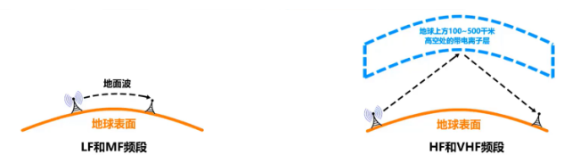

- 微波

  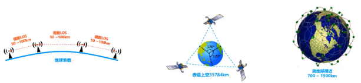

### 传输方式

#### 串行传输/并行传输

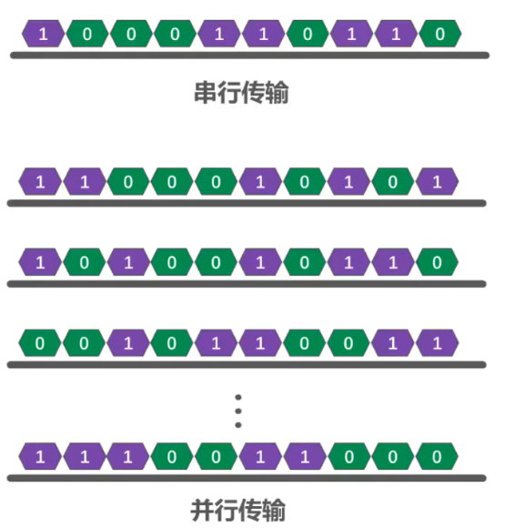

- 串行传输：一次发送 1 bit，在发送端与接收端之间，只有一条数据传输线路。

- 并行传输：一次发送 n bit，在发送端和接收端之间需要有 n 条传输线路。

数据在传输线路上的传输采用是串行传输，计算机内部的数据传输常用并行传输。

#### 同步传输/异步传输

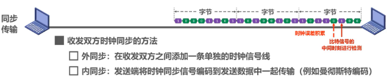

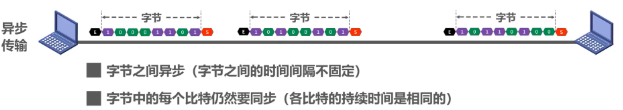

- 同步传输：数据块以稳定的比特流的形式传输。字节之间没有间隔；接收端在每个比特信号的中间时刻进行检测，以判别接收到的是比特 0 还是比特 1；由于不同设备的时钟频率存在一定差异，不可能做到完全相同，在传输大量数据的过程中，所产生的判别时刻的累计误差，会导致接收端对比特信号的判别错位，所以要使收发时钟保持同步；
- 异步传输：以字节为独立的传输单位，字节之间的时间间隔不固定；接收端仅在每个字节的起始处对字节内的比特实现同步；通常在每个字节前后分别加上起始位和结束位。

#### 单工传输/半双工传输/全双工传输

### 编码/调制

在计算机网络中，常见的是将数字基带信号通过编码或调制的方法在相应信道进行传输。

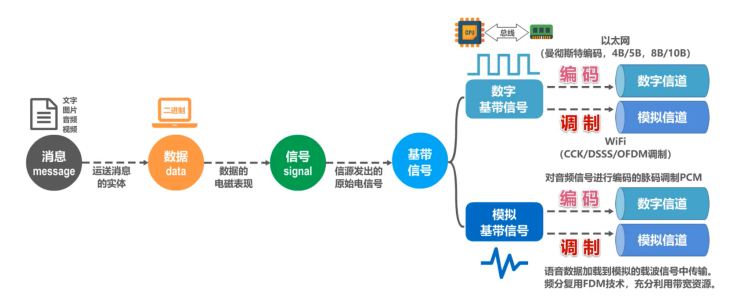

#### 常用编码

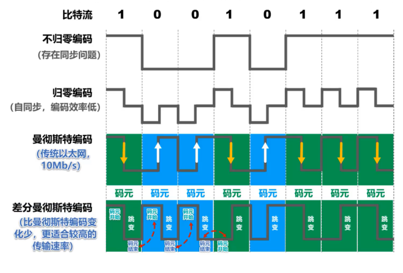

#### 常用调制

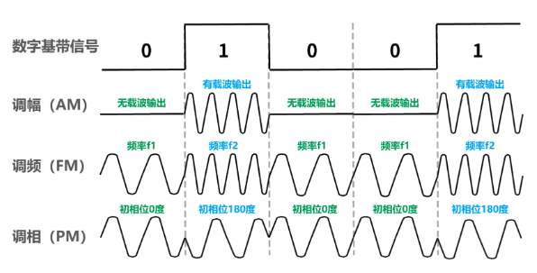

## 3. 数据链路层

> - 链路是从一个结点到相邻结点的一段物理线路；
> - 数据链路则是在链路的基础上增加了一些必要的硬件和软件；
> - 数据链路层以帧为单位传输和处理数据。

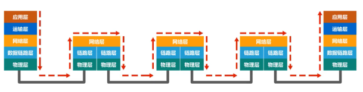

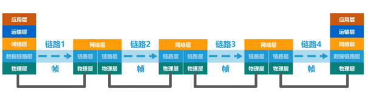

数据链路层使用的信道包括**点对点信道**和**广播信道**。

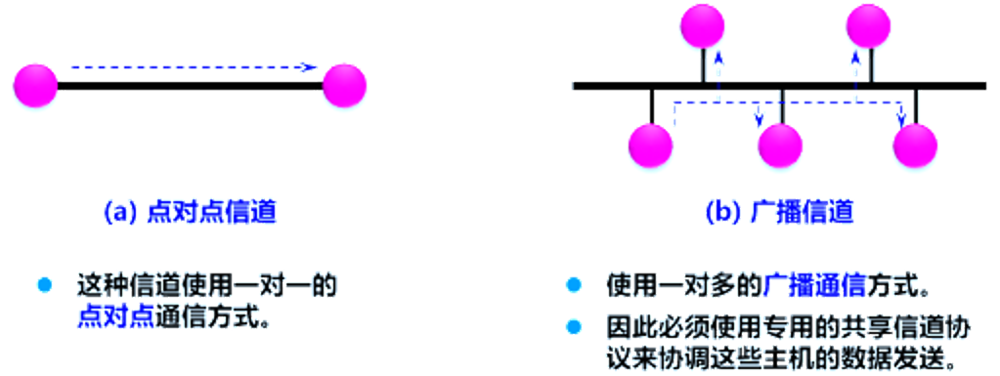

### 数据链路层的重要问题

#### 封装成帧

在一段数据的前后分别添加帧头和帧尾构成一个帧。帧头和帧尾的一个重要作用是进行帧定界。

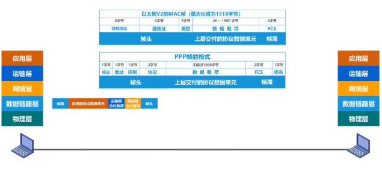

PPP 帧中的帧头和帧尾各自有一字节帧定界标志。以太网的 MAC 帧中没有帧定界标志，只在帧头之前添加一段前导码。

> ***前导码：***
>
> * 前同步码：使接收方的时钟同步；
> * 帧开始定界符：表明其后面紧跟着的就是 MAC 帧；
>
> 以太网规定了帧间间隔为 96 比特时间，因此 MAC 帧不需要帧结束定界符。

- 透明传输：数据链路层对上层交付的传输数据没有任何限制。

  帧界定标志也就是个特定数据值，如果在向上层交付的协议数据单元中恰好也包含这个特定数值，接收方就不能正确接收。

  数据链路层应该对上层交付的数据有限制，其内容不能包含帧定界符的值。

  **为实现透明传输，面向字节的物理链路使用字节填充或字符填充，面向比特的物理链路使用比特填充**。

  > ***字符填充：***
  >
  > 
  >
  > - 发送端的数据链路层在数据中出现控制字符 SOH 或 EOT 前插入一个转义字符 ESC；
  > - 接收端的数据链路层在将数据送往网络层之前删除插入的转义字符；
  > - 如果转义字符也出现在数据当中，那么应在转义字符前面插入一个转义字符 ESC；当接收端收到连续的两个转义字符时，就删除前面的一个 ESC。 
  >
  > ***比特填充：***
  >
  > 

- 帧数据的长度：

  帧数据长度应尽可能大以提高帧的传输效率；同时帧数据长度也有上限(最大传送单元 MTU)。

#### 差错检测

一般使用差错检测码检测传输过程中是否产生比特差错。

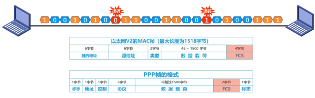

通常使用奇偶校验(容易误检)/CRC校验(常用)。

#### 可靠传输

- 传输差错

  1. 比特差错

     有线链路的误码率低；无线链路的误码率高；通常无线链路的数据链路层必须向上提供可靠传输服务，有线链路则不需要。

  2. 分组丢失

     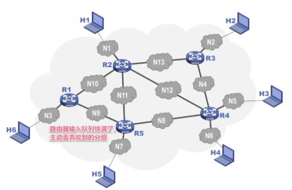

  3. 分组失序

     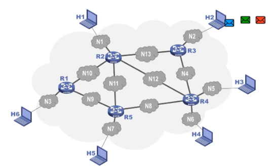

  4. 分组重复

     由于某些原因，有些分组在网络中滞留了，没有及时到达接收端，这可能会造成发送端对该分组的重发，重发的分组到达接收端，但一段时间后，滞留在网络的分组也到达了接收端。

  

- 可靠协议

  1. 停止-等待协议 (SN)

     发送方每发送一帧，就停止并等待接收方的确认（ACK）。收到确认后才发送下一帧。如果超时未收到确认，则重传该帧。

     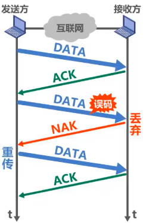

     > 需要解决的问题：
     >
     > 1. 超时重传 -- 增加超时计数器；
     > 2. 确认丢失 -- 添加数据分组编号；
     > 3. 确认迟到 -- 添加 ACK 分组编号；

  2. 后退 N 帧协议 (GBN)

     发送方可以连续发送多个帧（窗口大小为 N），无需每帧都等待确认。接收方只按顺序接收，若某一帧丢失或出错，则后续所有帧都被丢弃，发送方需从出错帧开始重传所有后续帧（后退 N 帧）。

     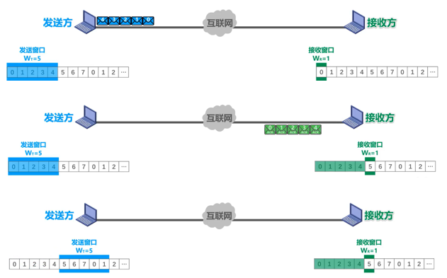

     > - 采用 n bit 对分组编号，发送窗口取值 $0 < W_T < 2^n$，接收窗口取值 $W_R = 1$。
     >
     > - 接收方可以不进行逐一确认，可以在收到几个分组后对最后一个分组发送确认。发送方收到对已发送分组的确认时，发送窗口向前滑动。

     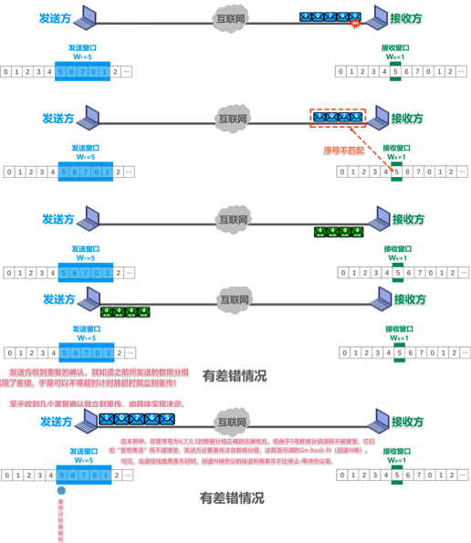

     > - 出现误码时，出现误码的分组和之后的分组都会被丢弃，并对之前按序接收的最后一个数据分组进行确认，每次丢弃一个分组发送一次。
     >
     >   当收到重复的确认时，发送端知道之前所发送的数据分组出现了差错，于是可以不等超时计时器超时就立刻开始重传，具体收到几个重复确认就立刻重传，根据具体实现决定。

  3. 选择重传协议 (SR)

     发送方同样有发送窗口，但接收方会缓存所有正确接收的帧，并对每一帧单独确认。发送方只重传那些超时或明确未确认的帧，而不重传后续已确认的帧。

     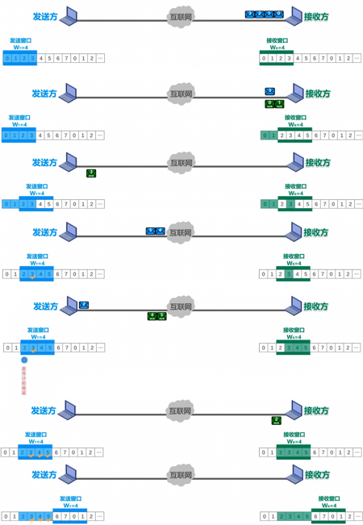

### 点对点信道 - PPP 协议

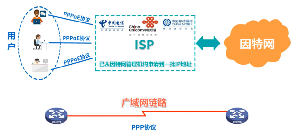

PPP 协议为点对点链路传输各种协议数据报提供了一个标准方法，主要由**网络控制协议 NCPs，协议数据报封装方法，链路控制协议 LCP**。

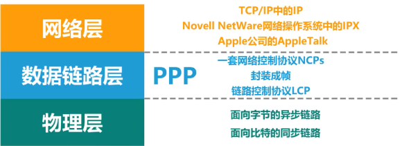

- 数据帧格式

  

  1. 标志字段(Flag)：PPP 数据帧定界符 0x7E；

  2. 地址字段(Address)：预留，0xFF；

  3. 控制字段(Control)：预留，0x03；

  4. 协议字段(Protocol)：指明帧的数据部分送交哪个协议处理。

     0x0021：IP 数据报；

     0xC021：LCP 分组；

     0x8021：NCP 分组；

     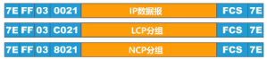

  5. 帧检验序列：CRC 计算校验位。

- 透明传输

  1. 面向字节的异步链路 - 字节填充法

     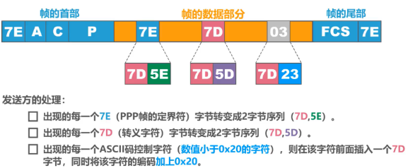

  2. 面向比特的同步链路 - 比特填充法

     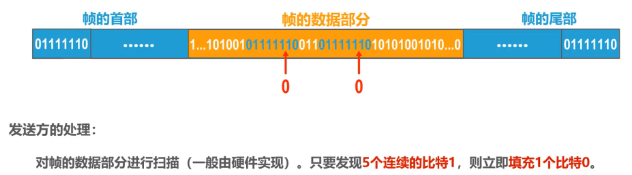

- 工作状态

  * 当用户拨号接入 ISP 时，路由器的调制解调器对拨号做出确认，并建立一条物理连接。
  * PC 机向路由器发送一系列的 LCP 分组（封装成多个 PPP 帧）。这些分组及其响应选择一些 PPP 参数，并进行网络层配置，NCP 给新接入的 PC 机分配一个临时的 IP 地址，使 PC 机成为因特网上的一个主机。
  * 通信完毕时，NCP 释放网络层连接，收回原来分配出去的 IP 地址。接着，LCP 释放数据链路层连接。最后释放的是物理层的连接。

  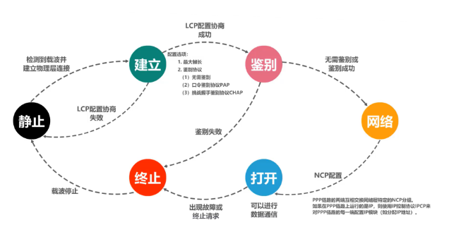

### 广播信道 - 以太网 (Ethernet) 协议

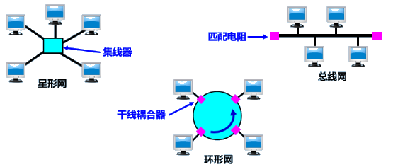

在 IEEE 802 标准体系（包括以太网 IEEE 802.3）中，局域网的数据链路层分为两个子层：逻辑链路控制(LLC)子层和媒体接入控制(MAC)子层。与接入传输介质有关的内容在 MAC 子层，而 LLC 子层则与传输介质无关。

#### 介质访问控制 MAC

若多个设备在共享信道上同时发送数据，则会造成彼此干扰，导致发送失败。

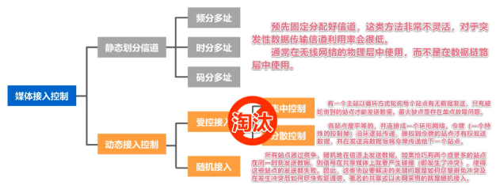

#### MAC 地址/IP 地址/ARP 协议

##### MAC 地址

使用点对点信道的数据链路层不需要使用地址；但是使用广播信道的数据链路层必须使用地址来区分各主机。在每个主机发送的帧中必须携带标识发送主机和接收主机的地址，这类地址用于媒体接入控制 MAC。因此称为 MAC 地址。

MAC 地址一般固化在网卡(网络适配器)的 EEPROM 中，因此 MAC 地址也称为硬件地址。MAC 地址是对网络上各个接口的唯一标识。

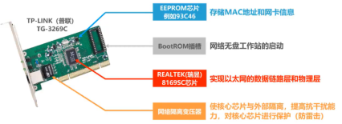

MAC 地址的格式如下：

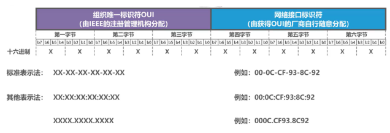

> - 组织唯一标识符 OUI：表明生产网络设备的厂商，需要向 IEEE 的注册管理机构申请一个或多个 OUI；
> - 网络接口标识符：由获得 OUI 的厂商自行随意分配。
>
> | 第一字节 b1 位 | 第一字节 b0 位 | MAC 地址类型                                                 |
> | -------------- | -------------- | ------------------------------------------------------------ |
> | 0              | 0              | 全球管理，单播地址，厂商生产网络设备时固化                   |
> | 0              | 1              | 全球管理，多播地址，标准网络设备支持的多播地址，用于特定功能 |
> | 1              | 0              | 本地管理，单播地址，由网络管理员分配，覆盖网络接口的全球管理单播地址 |
> | 1              | 1              | 本地管理，多播地址，用户对主机运行软件配置以表明其属于哪些多播组 |
>
> - 对于检查出的无效 MAC 帧就简单地丢弃，以太网不负责重传丢弃的帧。
>
> - 地址发送顺序：
>
>   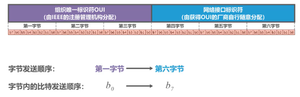

- **单播/广播/多播**

  1. 单播

     主机 B 给主机 C 发送单播帧，主机 B 首先要构建单播帧，在帧首部中的目的地址字段填入主机 C 的 MAC 地址，源地址字段填入自己的 MAC 地址，再加上帧首部的其他字段、数据载荷以及帧尾部，就构成了单播帧。

     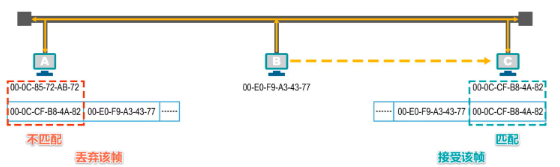

     主机 B 将该单播帧发送出去，主机 A 和 C 都会收到该单播帧；主机 A 的网卡发现该单播帧的目的 MAC 地址与自己的 MAC 地址不匹配，丢弃该帧；主机 C 的网卡发现该单播帧的目的 MAC 地址与自己的 MAC 地址匹配，接受该帧，并将该帧交给其上层处理。

  2. 广播
  
     主机 B 发送一个广播帧，在帧首部中的目的地址字段填入广播地址，也就是十六进制的全 F，源地址字段填入自己的 MAC 地址，再加上帧首部中的其他字段、数据载荷以及帧尾部，就构成了广播帧。
  
     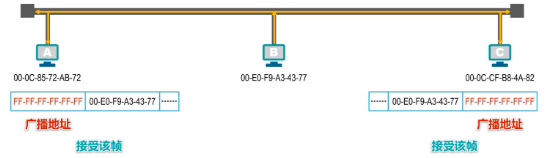
  
     主机 A 和 C 都会收到该广播帧，发现该帧首部中的目的地址字段的内容是广播地址，就知道该帧是广播帧，主机 A 和主机 C 都接受该帧，并将该帧交给上层处理。
  
  3. 多播

     主机 A 发送多播帧给多播地址，如果多播地址的左起第一个字节写成 8 个比特，第一个字节的最低比特位是 1，这就表明该地址是多播地址。
     
     主机 B，C，D 支持多播，其多播列表如下：
     
     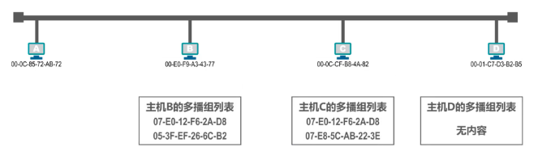
     
     主机 A 在帧首部中的目的地址字段填入多播地址，源地址点填入自己的 MAC 地址，再加上帧首部中的其他字段、数据载荷以及帧尾部，就构成了多播帧。
     
     主机 A 将该多播帧发送出去，主机B、C、D都会收到该多播帧；主机 B 和 C 发现该多播帧的目的 MAC 地址在自己的多播组列表中，主机 B 和 C 都会接受该帧。主机 D 发现该多播帧的目的 MAC 地址不在自己得多播组列表中，则丢弃该多播帧。给主机配置多播组列表进行私有应用时，不得使用公有的标准多播地址。
     
     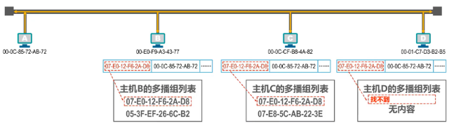
     
##### IP 地址

> IP 地址属于网络层，不属于数据链路层。

IP 地址是因特网上的主机和路由器使用的地址，用于标识：

1. **网络编号**：标识因特网上的网络；
2. **主机编号**：标识同一网络上的不同主机；

MAC 地址无法区分不同网络。一般对于接入因特网的主机，需要同时使用 IP 地址和 MAC 地址。

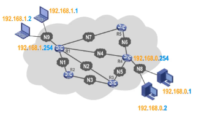

- 数据包的转发过程

  

  > 1. 源 IP 地址和目的 IP 地址不变；
  > 2. 源 MAC 地址和目的 MAC 地址随逐个链路改变；

  

##### ARP 协议

ARP 协议用于从 IP 地址找出对应的 MAC 地址。

当主机 B 要给主机 C 发送数据包时，会首先在自己的 ARP 高速缓存表中查找主机 C 的 IP 地址所对应的 MAC 地址，但未找到，因此主机 B 需要发送 ARP 请求报文，来获取主机 C 的 MAC 地址。

ARP 请求报文被封装在 MAC 帧中发送，目的地址为广播地址，主机 B 发送封装有 ARP 请求报文的广播帧，总线上的其他主机都能收到该广播帧。

收到 ARP 请求报文的主机 A 和主机 C 会把 ARP 请求报文交给上层的 ARP 进程；主机 A 发现所询问的 IP 地址不是自己的 IP 地址，因此不用理会；主机 C 发现所询问的 IP 地址是自己的 IP 地址，需要进行响应。

> 动态/静态 ARP：
>
> 

ARP 协议只能在一段链路或一个网络上使用，而不能跨网络使用；ARP 协议的使用是逐段链路进行的。

#### 集线器/交换机

##### 集线器 - 物理层扩展

> * 传统以太网最初是使用粗同轴电缆，后来演进到使用比较便宜的细同轴电缆，最后发展为使用更便宜和更灵活的双绞线；
> * 采用双绞线的以太网采用星形拓扑，在星形的中心增加集线器 (Hub)；
> * 集线器是也可以看做多口中继器，每个端口都可以成为一个中继器，中继器是对减弱的信号进行放大和发送的设备；
> * 集线器的以太网在逻辑上仍是个总线网，需要使用 CSMA/CD 协议来协调各主机争用总线，只能工作在半双工模式，收发帧不能同时进行。

集线器扩展：将多个以太网段连成更大的、多级星形结构的以太网。

> **碰撞域：**
>
> 碰撞域指网络中一个站点发出的帧会与其他站点发出的帧产生碰撞或冲突的那部分网络。碰撞域越大，发生碰撞的概率越高。

##### 交换机 - 数据链路层扩展

早期使用网桥进行扩展，当前使用交换机进行扩展。

> **网桥**
>
> * 网桥工作在数据链路层。
> * 根据 MAC 帧的目的地址对收到的帧进行转发和过滤。
> * 当网桥收到一个帧时，并不是向所有的接口转发此帧，而是先检查此帧的目的 MAC 地址，然后再确定将该帧转发到哪一个接口，或把它丢弃。 
>
> **交换机**
>
> * 交换机实质上就是一个**多接口的网桥**。

交换机受到帧之后，在帧交换表中查找帧目的 MAC 地址对应的接口号，然后通过该接口转发帧；以太网交换机是一种即插即用设备，刚上电时内部的帧交换表是空的，随着各个主机的通信，通过自学习方法建立帧交换表。

以下例子假设主机知道其他主机的 MAC 地址，从而不需要进行 ARP。

1. A -> B

   

   > - A 先向 B 发送一帧，该帧从接口 1 进入到交换机 1；
   > - 交换机 1 收到帧后，先查找交换表 1，没有查到应从哪个接口转发这个帧给 B；
   > - 交换机 1 把这个帧的源地址 A 和接口 1 写入交换表 1 中；交换机 1 向除接口 1 以外的所有的接口广播该帧；
   > - 交换机 2 接收到广播帧，查找交换表 2，没有查到应从哪个接口转发这个帧给 B；
   > - 交换机 2 把这个帧的源地址 A 和接口 2 写入交换表 2 中；
   > - 除 B 主机之外，该帧的目的地址不相符，将丢弃该帧；主机 B 发现是给自己的帧，接受该帧。

2. B -> A

   

   > - B 向 A 发送一帧，该帧从接口 3 进入到交换机 1；
   > - 交换机 1 收到帧后，先查找交换表 1，发现交换表 1 中的 MAC 地址有 A，表明要发送给 A 的帧应从接口 1 转发出去，于是把这个帧通过接口 1 转发给 A。
   > - 主机 A 发现目的地址是它，就接受该帧；
   > - 交换机 1 把这个帧的源地址 B 和接口 3 写入交换表 1 中。

3. E -> A

   

   > - E 向 A 发送一帧；
   >
   > - 交换机 2 收到帧后，先查找交换表 2。发现交换表 2 中的 MAC 地址有 A，表明要发送给 A 的帧应从接口 2 转发出去。于是就把这个帧通过接口 2 转发给交换机 1 接口 4。
   > - 交换机把这个帧的源地址 E 和接口 3 写入交换表 2 中；
   > - 交换机 1 先查找交换表 1，发现交换表 1 中的 MAC 地址有 A，表明要发送给 A 的帧应从接口 1 转发出去。于是就把这个帧通过接口 1 转发给 A。交换机 1 把这个帧的源地址 E 和接口 4 写入交换表 1 中；
   > - 主机 A 发现目的地址是它，就接受该帧；

4. G -> A

   

   主机 A、主机 G、交换机 1 的接口 1 共享同一条总线。

   > 1. 主机 G 发送给 主机 A 一个帧，主机 A 和交换机 1 接口 1 都能接收到；
   > 2. 主机 A 的网卡收到后，根据帧的目的 MAC 地址 A，就知道是发送给自己的帧，就接受该帧；
   > 3. 交换机 1 收到该帧后，首先进行登记工作；然后交换机 1 对该帧进行转发，该帧的 MAC 地址是 A，交换表 1 查找 MAC 地址有 A；
   > 4. MAC 地址为 A 的接口号是 1，但是该帧正是从接口 1 进入交换机的，交换机不会再从该接口 1 将帧转发出去，因为没有必要，于是丢弃该帧。

随着网络中各主机都发送了帧后，网络中的各交换机就可以学习到各主机的 MAC 地址，以及它们与自己各接口的对应关系。考虑到可能有时要在交换机的接口更换主机，或者主机要更换其网络适配器，这就需要更改交换表中的项目。为此，在交换表中每个项目都设有一定的有效时间，过期的项目就自动被删除。

##### 交换机和集线器的区别

使用集线器互连而成的共享总线式以太网上的某个主机，要给另一个主机发送单播帧，该单播帧会通过共享总线传输到总线上的其他各个主机；

使用交换机互连而成的交换式以太网上的某个主机，要给另一个主机发送单播帧，该单播帧进入交换机后，交换机会将该单播帧转发给目的主机，而不是网络中的其他各个主机。

> 碰撞问题：
>
> 
>
> 多台主机同时给另一台主机发送单播帧。
>
> 集线器以太网：会产生碰撞，遭遇碰撞的帧会传播到总线上的各主机；
>
> 交换机以太网：会将它们缓存起来，然后逐个转发给目的主机，不会产生碰撞；

## 4. 网络层

网络层的主要任务是实现网络互连，进而实现数据包在各网络之间的传输。

网络层需要解决的问题包括：

1. 网络层向运输层提供怎样的服务；
2. 网络层寻址问题；
3. 路由选择问题；

### 网络层提供服务

#### 面向连接的虚电路服务

可靠通信由网络保证。通信之前建立网络层连接 - 虚电路。通信双方沿着已建立的虚电路发送分组。目的主机弟子仅在连接建立阶段使用，之后每个分组的首部只需要携带一条虚电路的编号。如果使用可靠传输协议，可以使得发送的分组正确到达接收方。通信结束后释放虚电路。

##### 无连接的数据报服务

网络层向上只提供简单灵活的、无连接的、尽最大努力交付的数据报服务。可靠通信由用户主机保证。网络在发送分组时不需要建立连接，每一个分组独立发送，与先后顺序无关。网络不保证服务质量。

### IP 地址

IP 地址是因特网上的每一台主机的每一个接口在世界范围内的唯一标识符。IPv4 是 32 位标识符，通常采用点分十进制法表示 IP 地址。

#### 分类编制的 IPv4 地址

每一类地址都由两个固定长度的字段组成，其中一个字段是网络号，标志主机/路由器所连接到的网络，而另一个字段则是主机号，标志该主机/路由器。

主机号在它前面的网络号所指明的网络范围内必须是唯一的。

| 网络类别 | 最大可指派的网络数  | 第一个可指派的网络号 | 最后一个可指派的网络号 | 每个网络中最大主机数 |
| :------: | :-----------------: | :------------------: | :--------------------: | :------------------: |
|    A     |    126($2^7-2$)     |          1           |          126           |       16777214       |
|    B     |  16383($2^{14}-2$)  |        128.1         |        191.255         |        65534         |
|    C     | 2097151($2^{21}-2$) |       192.0.1        |      223.255.255       |         254          |

特殊 IP 地址如下：

| 网络号 |       主机号       | 源地址使用 | 目的地址使用 | 含义                                     |
| :----: | :----------------: | :--------: | :----------: | :--------------------------------------- |
|   0    |         0          |    可以    |     不可     | 在本网络上的本主机                       |
|   0    |      host-id       |    可以    |     不可     | 在本网络上的某台主机 host-id             |
|  全1   |        全1         |    不可    |     可以     | 只在本网络上进行广播（各路由器均不转发） |
| net-id |        全1         |    不可    |     可以     | 对 net-id 上的所有主机进行广播           |
|  127   | 非全0或全1的任何数 |    可以    |     可以     | 用于本地软件环回测试                     |

- IP 地址的特点

  1. IP 地址是一种分等级的地址结构。

     IP 地址管理机构在分配 IP 地址时只分配网络号，而剩下的主机号则由得到该网络号的单位自行分配。这样就方便了 IP 地址的管理。

     路由器仅根据目的主机所连接的网络号来转发分组（而不考虑目的主机号），这样就可以使路由表中的项目数大幅度减少，从而减小了路由表所占的存储空间。

  2. IP 地址是标志一个主机/路由器和一条链路的接口。
  
     当一个主机同时连接到两个网络上时，该主机就必须同时具有两个相应的 IP 地址，其网络号 net-id 必须是不同的，这种主机称为多归属主机。
  
     由于一个路由器至少应当连接到两个网络，因此一个路由器至少应当有两个不同的 IP 地址。
  
  3. 用转发器或网桥连接起来的若干个局域网仍为一个网络，因此这些局域网都具有同样的网络号 net-id。
  
  4. 所有分配到网络号 net-id 的网络，无论是范围很小的局域网，还是可能覆盖很大地理范围的广域网，都是平等的。

#### 划分子网的 IPv4 地址

两级 IP 地址不够灵活，一般将主机号借用一部分作为子网号，称为划分子网。

子网划分是一个单位内部的事情，单位对外表现为没有划分子网的网络。凡是从其他网络发送给本单位某个主机的 IP 数据报，仍然是根据 IP 数据报的目的网络号，先找到连接在本单位网络上的路由器。然后此路由器在收到 IP 数据报后，再按目的网络号和子网号找到目的子网。最后就将 IP 数据报直接交付目的主机。

32 位的子网掩码表明分类 IP 地址的主机号部分被借用了几位作为子网号。使用连续的 1 表示对应网络号和子网号，使用连续 0 表示主机号。将 IPv4 地址和子网掩码进行与运算可以得到子网网络地址。

给定 IP 地址和子网掩码，可以得到划分的子网数量，子网分配的 IP 地址数量，子网的网络地址和广播地址，子网最小地址和最大地址。

默认子网掩码是在未划分子网情况下使用的子网掩码。

路由器在和相邻路由器交换路由信息时，必须把自己所在网络（或子网）的子网掩码告诉相邻路由器。路由器的路由表中的每一个项目，除了要给出目的网络地址外，还必须同时给出该网络的子网掩码。若一个路由器连接在两个子网上，就拥有两个网络地址和两个子网掩码。

#### 无分类编址 IPv4 地址

划分子网在一定程度上缓解了因特网在发展中遇到的困难，但是数量巨大的 C 类网因为其地址空间太小并没有得到充分使用，而因特网的 IP 地址仍在加速消耗，整个 IPv4 地址空间面临全部耗尽的威胁。

CIDR 消除了传统的 A 类、B 类和 C 类地址，以及划分子网的概念；CIDR 使用斜线记法，在IPv4地址后面加上斜线 "/"，在斜线后面写上网络前缀所占的比特数量。实际上是将网络前缀都相同的连续的 IP 地址组成一个 CIDR 地址块。

只要知道CIDR地址块中的任何一个地址，就可以知道该地址块的全部细节：地址块的最小/最大地址，地址块中的地址数量，地址块聚合某类网络（A类、B类或C类）的数量，地址掩码。

此时可以进行路由聚合以减小路由表的存储容量。

路由器查表转发分组时如果发现有多条路由可选，选择网络前缀最长的路由，因为更具体。

#### IP 地址分配

IP 地址可以由网络管理员手动分配；也可以用一个服务器，进行动态 IP 分配(动态主机配置协议 DHCP)。

主机接入后广播语义为请求 IP 的报文，发送方 MAC 地址为主机的 MAC 地址，接收方 MAC 地址为 FF:FF:FF:FF:FF:FF，发送方 IP 地址为 0.0.0.0，接收方 IP 地址为 255.255.255.255。服务器收到这条消息后，会给主机反馈一条报文，内含被分配的 IP 地址、子网掩码、网关 IP 地址，发送方 MAC 地址为服务器的 MAC 地址，接收方 MAC 地址为主机的 MAC 地址，发送方 IP 地址为服务器的 IP 地址，接收方 IP 地址为主机刚分配的 IP 地址。考虑到这个网段上可能有多个 DHCP 服务器，主机需广播一下自己的 IP，发送方 MAC 地址为主机的 MAC 地址，接收方 MAC 地址为 FF:FF:FF:FF:FF:FF，发送方 IP 地址为主机的 IP 地址，接收方 IP 地址为该主机所在 LAN 的广播地址。

### IP 数据报的发送过程

可以通过目的地址 IP 和源地址的子网掩码进行逻辑与运算得到目的网络地址。

* 如果目的网络地址和源网络地址相同，就是在同一个网络中，属于直接交付；
* 如果目的网络地址和源网络地址不相同，就不在同一个网络中，属于间接交付，传输给主机所在网络的默认网关，由默认网关帮忙转发。

用户为了让本网络中的主机能和其他网络中的主机进行通信，就必须给其指定本网络的一个路由器的接口，由该路由器帮忙进行转发，所指定的路由器被称为默认网关。

路由器收到 IP 数据报后

1. 检查IP数据报首部是否出错：

* 若出错，则直接丢弃该IP数据报并通告源主机；
* 若没有出错，则进行转发。

2. 根据 IP 数据报的目的地址在路由表中查找匹配的条目(逐条检查路由条目，将目的地址与路由条目中的地址掩码进行逻辑与运算得到目的网络地址，然后与路由条目中的目的网络进行比较)：

* 若找到匹配的条目，则转发给条目中指示的下一跳；
* 若找不到，则丢弃该数据报并通告源主机；

路由器隔离了广播域。

### 路由选择

#### 静态路由配置

由用户或者网络管理员给路由器人工配置路由表。

静态路由配置容易产生配置错误等问题。因此常见的方法是动态路由配置，路由器通过路由选择协议自动获取路由信息。

因特网采用分层次的路由选择协议，将整个因特网划分为较小的自治系统 AS。自治系统是在单一的技术管理下的一组路由器，而这些路由器使用一种 AS 内部的路由选择协议和共同的度量以确定分组在该 AS 内的路由，同时还使用一种 AS 之间的路由选择协议用以确定分组在 AS 之间的路由。自治系统之间的路由选择简称为域间路由选择，自治系统内部的路由选择简称为域内路由选择。域间路由选择使用外部网关协议 EGP 这个类别的路由选择协议；域内路由选择使用内部网关协议 IGP 这个类别的路由选择协议。

### IP 数据报

IP 数据报也叫做 IP 数据报或者 IP 分组，IP 数据报组装在以太网帧中发送的，它通常由两个部分组成，即 IP 首部与数据区域，其中 IP 的首部是 20 字节大小，数据区域理论上可以多达 65535 个字节，由于以太网网络接口的最大传输单元为 1500，所以一个完整的数据包不能超出 1500 字节大小。

> - **版本**： IP 协议的版本。通信双方使用的 IP 协议版本必须一致。广泛使用的 IP 协议版本号为 4（即 IPv4）。
> - **首部长度**：可表示的最大十进制数值是 15。这个字段所表示数的单位是 32 位字长（1 个 32 位字长是 4 字节），因此，当 IP 的首部长度为 1111 时（即十进制的 15），
>   首部长度就达到 60 字节。当 IP 分组的首部长度不是 4 字节的整数倍时，必须利用最后的填充，字段加以填充。
> - **区分服务**：用来获得更好的服务。这个字段在旧标准中叫做服务类型，但实际上一直没有被使用过。
> - **总长度**：总长度指首部和数据之和的长度，单位为字节。在 IP 层下面的每一种数据链路层都有自己的帧格式，其中包括帧格式中的数据字段的最大长度，这称为最大传送单元 MTU。当一个数据报封装成链路层的帧时，此数据报的总长度（即首部加上数据部分）一定不能超过下面的数据链路层的 MTU 值。
> - **标识**：IP 软件在存储器中维持一个计数器，每产生一个数据报，计数器就加 1，并将此值赋给标识字段。但这个标识并不是序号，因为 IP 是无连接服务，数据报不存在按序接收的问题。当数据报由于长度超过网络的 MTU 而必须分片时，这个标识字段的值就被复制到所有的数据报的标识字段中。相同的标识字段的值使分片后的各数据报片最后能正确地重装成为原来的数据报。
> - **标志**：只有 2 位有意义。
>   1. 标志字段中的最低位记为 MF。`MF=1` 即表示后面还有分片的数据报。`MF=0` 表示这已是若干数据报片中的最后一个。
>   2. 标志字段中间的一位记为 DF，不能分片。只有当 `DF=0` 时才允许分片。
> - **片偏移**：片偏移为较长的分组在分片后，某片在原分组中的相对位置。也就是说，相对用户数据字段的起点，该片从何处开始。片偏移以 8 个字节为偏移单位。
> - **生存时间**：表明数据报在网络中的寿命。由发出数据报的源点设置这个字段。其目的是防止无法交付的数据报无限制地在因特网中兜圈子，因而白白消耗网络资源。最初的设计是以秒作为 TTL 的单位。每经过一个路由器时，就把 TTL 减去数据报在路由器消耗掉的一段时间。若数据报在路由器消耗的时间小于 1 秒，就把 TTL 值减 1。当 TTL 值为 0 时，就丢弃这个数据报。后来把 TTL 字段的功能改为跳数限制（但名称不变）。路由器在转发数据报之前就把 TTL 值减 1。若 TTL 值减少到零，就丢弃这个数据报，不再转发。因此，TTL 的单位不再是秒，而是跳数。TTL 的意义是指明数据报在网络中至多可经过多少个路由器。显然，数据报在网络上经过的路由器的最大数值是 255。若把 TTL 的初始值设为 1，就表示这个数据报只能在本局域网中传送。
> - **协议**：协议字段指出此数据报携带的数据是使用何种协议，以便使目的主机的 IP 层知道应将数据部分上交给哪个处理过程。
> - **首部检验和**：这个字段只检验数据报的首部，但不包括数据部分。这是因为数据报每经过一个路由器，路由器都要重新计算一下首部检验和（一些字段，如生存时间、标志、片偏移等都可能发生变化）。不检验数据部分可减少计算的工作量。
> - **源地址**
> - **目的地址**
> - **数据区域**

## 5. 传输层

从通信和信息处理的角度看，传输层向它上面的应用层提供通信服务，它属于面向通信部分的最高层，同时也是用户功能中的最低层。当网络的边缘部分中的两个主机使用网络的核心部分的功能进行端到端的通信时，只有位于网络边缘部分的主机的协议栈才有传输层。

在运输层使用不同的端口，来对应不同的应用进程；然后通过网络层及其下层来传输应用层报文；接收方的运输层通过不同的端口，将收到的应用层报文，交付给应用层中相应的应用进程；端口并不是指看得见、摸得着的物理端口，而是指用来区分不同应用进程的标识符。

### 端口号

运行在计算机上的进程使用进程标识符 PID 来标志。因特网上的计算机并不是使用统一的操作系统，不同的操作系统又使用不同格式的进程标识符。为了使运行不同操作系统的计算机的应用进程之间能够进行网络通信，就必须使用统一的方法对 TCP/IP 体系的应用进程进行标识。

TCP/IP 体系的运输层使用端口号来区分应用层的不同应用进程。端口号使用 16 位表示，取值范围 0 - 65535；

> - **熟知端口号**：0 - 1023，IANA 把这些端口号指派给了 TCP/IP 体系中最重要的一些应用协议，例如：FTP 使用 21/20，HTTP 使用 80，DNS 使用 53。
>
>   
>
> - **登记端口号**：1024 - 49151，为没有熟知端口号的应用程序使用。使用这类端口号必须在 IANA 按照规定的手续登记，以防止重复。例如：Microsoft RDP 微软远程桌面使用的端口是 3389。
>
> - **短暂端口号**：49152 - 65535，留给客户进程选择暂时使用。当服务器进程收到客户进程的报文时，就知道了客户进程所使用的动态端口号。通信结束后，这个端口号可供其他客户进程以后使用。

端口号只具有本地意义，即端口号只是为了标识本计算机应用层中的各进程，在因特网中，不同计算机中的相同端口号是没有联系的。

### TCP / UDP

UDP 和 TCP 是 TCP/IP 体系结构传输层中的两个重要协议。

* 当传输层采用面向连接的 TCP 协议时，尽管下面的网络是不可靠的（只提供尽最大努力服务），但这种逻辑通信信道就相当于一条全双工的可靠信道。
* 当传输层采用无连接的 UDP 协议时，这种逻辑通信信道是一条不可靠信道。

两个对等传输实体在通信时传送的数据单位叫作传输协议数据单元 TPDU。

* TCP 传送的数据单位协议是 TCP 报文段。

* UDP 传送的数据单位协议是 UDP 报文或用户数据报。

 

## 6. 应用层

