# CiA402 协议

CiA 402 是 CANopen 协议族中用于伺服驱动器和运动控制设备的标准设备子协议。

> 官网：[链接](https://www.can-cia.org/)
>
> 参考文献：《CiA-402-2-version-3.0.0》

## 1. 状态机

CiA402 协议定义的电机驱动系统状态机如下：

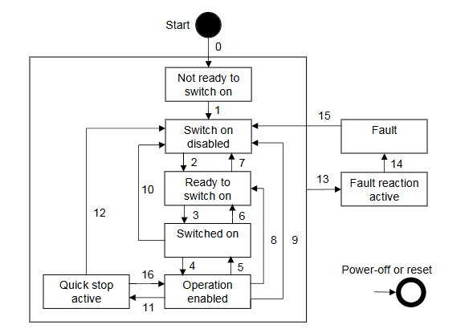

CiA402 协议定义了 8 种状态，每个状态支持的功能如下：

| 功能 | 初始化（Not ready to switch on） | 伺服无故障（Switch on disabled） | 伺服准备好（Ready to switch on） | 等待打开伺服使能（Switched on） | 伺服运行（Operation enabled） | 快速停机（Quick stop active） | 故障停机（Fault reaction active） | 故障（Fault） |
| ---------------- | ------ | ---------- | ---------- | ------ | -------- | ------------ | -------- | -- |
|刹车使能| 是 | 是      | 是      | 是     | 是/否     | 是/否         | 是/否     | 是 |
| 低压电源使能（驱动电源使能） | 是  | 是        | 是        | 是   | 是       | 是           | 是       | 是 |
| 高压电源使能（主电路电源使能） | 是/否  | 是/否      | 是/否                            | 是     | 是       | 是        | 是 | 是/否 |
| 驱动功能启用 | 否 | 否 | 否 | 否 | 是 | 是 | 是 | 否 |
| 配置功能启用 | 是 | 是 | 是 | 是 | 是/否 | 是/否 | 是/否 | 是 |

状态之间的转换事件和动作如下：

| 转换 | 事件                                                         | 动作                                                         |
| :--- | :----------------------------------------------------------- | :----------------------------------------------------------- |
| 0    | 上电或复位应用后的自动转换                                   | 应执行驱动设备自检和/或初始化                                |
| 1    | 自动转换                                                     | 应激活通信                                                   |
| 2    | 来自控制设备或本地信号的关闭命令                             | 无                                                           |
| 3    | 来自控制设备或本地信号的开启命令                             | 应接通主电路电源                                             |
| 4    | 来自控制设备或本地信号的使能操作命令                         | 应使能驱动功能并清除所有内部设定值                           |
| 5    | 来自控制设备或本地信号的禁用操作命令                         | 应禁用驱动功能                                               |
| 6    | 来自控制设备或本地信号的关闭命令                             | 应断开主电路电源                                             |
| 7    | 来自控制设备或本地信号的快速停止或禁用电压命令               | 无                                                           |
| 8    | 来自控制设备或本地信号的关闭命令                             | 应禁用驱动功能，断开主电路电源                               |
| 9    | 来自控制设备或本地信号的禁用电压命令                         | 应禁用驱动功能，断开主电路电源                               |
| 10   | 来自控制设备或本地信号的禁用电压或快速停止命令               | 应断开主电路电源                                             |
| 11   | 来自控制设备或本地信号的快速停止命令                         | 应启动快速停止功能                                           |
| 12   | 快速停止功能完成且快速停止选项代码为 1，2，3，4 时的自动转换，或来自控制设备的禁用电压命令（取决于快速停止选项代码） | 应禁用驱动功能，断开主电路电源                               |
| 13   | 故障信号                                                     | 应执行配置的故障响应功能                                     |
| 14   | 自动转换                                                     | 应禁用驱动功能，断开主电路电源                               |
| 15   | 来自控制设备或本地信号的故障复位命令                         | 若驱动设备当前不存在故障，则执行故障条件复位；离开故障状态后，控制设备应清除控制字中的故障复位位。 |
| 16   | 来自控制设备的使能操作命令，如果快速停止选项代码为5，6，7，8 | 应使能驱动功能                                               |

> - 如果请求进行状态转换，则相关操作必须完全处理完毕后，才能转换到新状态。

---

***运行模式：***

驱动系统的行为取决于激活的运行模式，这些运行模式无法并行运行。用户可以选择激活的运行模式，控制设备通过写入运行模式对象来选择运行模式；驱动设备提供运行模式显示对象，用于指示当前激活的运行模式。

> **CiA402 的运行模式包括：**
>
> 1. Profile Position Mode - 位置规划模式；
> 2. Profile Velocity Mode - 速度规划模式(用于伺服驱动器)；
> 3. Velocity Mode - 速度模式（用于变频器）；
> 4. Profile Torque Mode - 力矩规划模式；
> 5. Homing Mode - 原点复位模式；
> 6. Interpolated Position Mode - 插补位置模式；
> 7. Cyclic Synchronous Position Mode - 周期同步位置模式；
> 8. Cyclic Synchronous Velocity Mode - 周期同步速度模式；
> 9. Cyclic Synchronous Torque Mode - 周期同步力矩模式；

## 2. 对象字典

### 索引 `6040h` - 控制字

| 属性     | 值                      |
| :------- | :---------------------- |
| 索引     | `6040h`                 |
| 名称     | 控制字                  |
| 对象类型 | 变量                    |
| 数据类型 | 无符号 16 位 （UINT16） |
| 子索引   | `00h`                   |
| 访问权限 | 读写                    |
| 默认值   | 与设备和运行模式相关    |

控制字的数据位含义：

| 位      | 功能                             | 描述                  | 说明                                   |
| ------- | -------------------------------- | --------------------- | -------------------------------------- |
| 0       | 伺服准备（switch on）            | 0 - 无效 1 - 有效 | 使能准备                               |
| 1       | 接通主回路电源（enable voltage） | 0 - 无效 1 - 有效 | \                                      |
| 2       | 快速停机（quick Stop）           | 0 - 无效 1 - 有效 | 常闭信号，为 0 伺服快速停止            |
| 3       | 伺服运行（enable operation）     | 0 - 无效 1 - 有效 | 使能                                   |
| 4 - 6   | \                                | \                     | 与运行模式相关                         |
| 7       | 故障复位（fault Reset）          | 上升沿 - 有效         | 对于可复位故障和警告，执行故障复位功能 |
| 8       | 暂停（halt）                     | 0 - 无效 1 - 有效 | \                                      |
| 9       | \                                | \                     | 与运行模式相关                         |
| 10 - 15 | 保留                             | \                     | \                                      |

控制字的命令含义如下表：

| 命令            | Bit7   | Bit3 | Bit2 | Bit1 | Bit0 | 转换动作     |
| --------------- | ------ | ---- | ---- | ---- | ---- | ------------ |
| 关闭            | 0      | X    | 1    | 1    | 0    | 2，6，8      |
| 开启            | 0      | 0    | 1    | 1    | 1    | 3            |
| 开启 + 使能操作 | 0      | 1    | 1    | 1    | 1    | 3 + 4        |
| 禁用电压        | 0      | X    | X    | 0    | X    | 7，9，10，12 |
| 快速停止        | 0      | X    | 0    | 1    | X    | 7，10，11    |
| 禁用操作        | 0      | 0    | 1    | 1    | 1    | 5            |
| 使能操作        | 0      | 1    | 1    | 1    | 1    | 4，16        |
| 故障复位        | 上升沿 | X    | X    | X    | X    | 15           |

### 索引 `6041h` - 状态字

| 属性     | 值                      |
| :------- | :---------------------- |
| 索引     | `6041h`                 |
| 名称     | 状态字                  |
| 对象类型 | 变量                    |
| 数据类型 | 无符号 16 位 （UINT16） |
| 子索引   | `00h`                   |
| 访问权限 | 只读                    |
| 默认值   | \                       |

状态字的数据位含义：

| 位      | 状态                                  | 描述                                    | 说明                     |
| ------- | ------------------------------------- | --------------------------------------- | ------------------------ |
| 0       | 伺服准备好（ready to switch on）      | 0 - 无效 1 - 有效                   | /                        |
| 1       | 可以开启伺服运行（switched on）       | 0 - 无效 1 - 有效                   | /                        |
| 2       | 伺服运行（operation enabled）         | 0 - 无效 1 - 有效                   | /                        |
| 3       | 故障（fault）                         | 0 - 无效 1 - 有效                   | /                        |
| 4       | 主回路电源已接通（voltage enabled）   | 0 - 无效 1 - 有效                   | /                        |
| 5       | 快速停机（quick stop）                | 0 - 无效 1 - 有效                   | /                        |
| 6       | 伺服不可运行（switch on disabled）    | 0 - 无效 1 - 有效                   | /                        |
| 7       | 警告（warning）                       | 0 - 无效 1 - 有效                   | 警告输出                 |
| 8       | 保留                                  | /                                       | /                        |
| 9       | 远程控制（remote）                    | 0 - 无效 1 - 有效，控制字生效       | 表示控制字是否正在被处理 |
| 10      | 目标到达（target reached）            | 0 - 目标位置未到达 1 - 目标位置到达 | /                        |
| 11      | 内部限位激活（internal limit active） | /                                       | /                        |
| 12 - 13 | /                                     | /                                       | 与运行模式相关           |
| 14 - 15 | 保留                                  | /                                       | /                        |

对应的状态机状态如下：

| 状态字                 | 状态机状态       |
| :--------------------- | :--------------- |
| `xxxx xxxx x0xx 0000b` | 初始化           |
| `xxxx xxxx x1xx 0000b` | 伺服无故障       |
| `xxxx xxxx x01x 0001b` | 伺服准备好       |
| `xxxx xxxx x01x 0011b` | 等待打开伺服使能 |
| `xxxx xxxx x01x 0111b` | 伺服运行         |
| `xxxx xxxx x00x 0111b` | 快速停机         |
| `xxxx xxxx x0xx 1111b` | 故障停机         |
| `xxxx xxxx x0xx 1000b` | 故障             |

### 索引 `603Fh` - 错误字

| 属性     | 值                      |
| :------- | :---------------------- |
| 索引     | `603Fh`                 |
| 名称     | 错误字                  |
| 对象类型 | 变量                    |
| 数据类型 | 无符号 16 位 （UINT16） |
| 子索引   | `00h`                   |
| 访问权限 | 只读                    |
| 默认值   | \                       |

### 索引 `6007h` - 中止连接选项

| 属性     | 值                     |
| :------- | :--------------------- |
| 索引     | `6007h`                |
| 名称     | 中止连接选项           |
| 对象类型 | 变量                   |
| 数据类型 | 有符号 16 位 （INT16） |
| 子索引   | `00h`                  |
| 访问权限 | 读写                   |
| 默认值   | +1                     |

在总线关闭，心跳，生命守护，进入 NMT 停止状态，复位应用和复位通信时触发该选项；中止连接选项的值：

| 值          | 定义         |
| :---------- | :----------- |
| -32768 - -1 | 制造商定义   |
| 0           | 无动作       |
| +1          | 故障信号     |
| +2          | 禁用电压命令 |
| +3          | 快速停止命令 |
| +4 - +32767 | 保留         |

### 索引 `605Ah` - 快速停止选项

| 属性     | 值                     |
| :------- | :--------------------- |
| 索引     | `605Ah`                |
| 名称     | 快速停止选项           |
| 对象类型 | 变量                   |
| 数据类型 | 有符号 16 位 （INT16） |
| 子索引   | `00h`                  |
| 访问权限 | 读写                   |
| 默认值   | +2                     |

快速停止选项的值：

| 值          | 定义                                     |
| :---------- | :--------------------------------------- |
| -32768 - -1 | 制造商定义                               |
| 0           | 禁用驱动功能                             |
| +1          | 按减速斜坡减速并转换至伺服无故障状态     |
| +2          | 按快速停止斜坡减速并转换至伺服无故障状态 |
| +3          | 按电流限值减速并转换至伺服无故障状态     |
| +4          | 按电压限值减速并转换至伺服无故障状态     |
| +5          | 按减速斜坡减速并保持在快速停止状态       |
| +6          | 按快速停止斜坡减速并保持在快速停止状态   |
| +7          | 按电流限值减速并保持在快速停止状态       |
| +8          | 按电压限值减速并保持在快速停止状态       |
| +9 - +32767 | 保留                                     |

### 索引 `605Bh` - 关机选项

指示伺服运行到伺服准备好的动作。

| 属性     | 值                     |
| :------- | :--------------------- |
| 索引     | `605Bh`                |
| 名称     | 关机选项               |
| 对象类型 | 变量                   |
| 数据类型 | 有符号 16 位 （INT16） |
| 子索引   | `00h`                  |
| 访问权限 | 读写                   |
| 默认值   | 0                      |

关机选项的值：

| 值          | 定义                         |
| :---------- | :--------------------------- |
| -32768 - -1 | 制造商定义                   |
| 0           | 禁用驱动功能                 |
| +1          | 按减速斜坡减速，禁用驱动功能 |
| +2 - +32767 | 保留                         |

### 索引 `605Ch` - 禁用选项

指示伺服运行到等待打开伺服使能的动作。

| 属性     | 值                     |
| :------- | :--------------------- |
| 索引     | `605Ch`                |
| 名称     | 禁用选项               |
| 对象类型 | 变量                   |
| 数据类型 | 有符号 16 位 （INT16） |
| 子索引   | `00h`                  |
| 访问权限 | 读写                   |
| 默认值   | +1                     |

禁用选项的值：

| 值          | 定义                         |
| :---------- | :--------------------------- |
| -32768 - -1 | 制造商定义                   |
| 0           | 禁用驱动功能                 |
| +1          | 按减速斜坡减速，禁用驱动功能 |
| +2 - +32767 | 保留                         |

### 索引 `605Dh` - 停止选项

| 属性     | 值                     |
| :------- | :--------------------- |
| 索引     | `605Dh`                |
| 名称     | 停止选项               |
| 对象类型 | 变量                   |
| 数据类型 | 有符号 16 位 （INT16） |
| 子索引   | `00h`                  |
| 访问权限 | 读写                   |
| 默认值   | +1                     |

停止选项的值：

| 值          | 定义                                   |
| :---------- | :------------------------------------- |
| -32768 - -1 | 制造商定义                             |
| 0           | 保留                                   |
| +1          | 按减速斜坡减速并保持在伺服运行状态     |
| +2          | 按快速停止斜坡减速并保持在伺服运行状态 |
| +3          | 按电流限值减速并保持在伺服运行状态     |
| +4          | 按电压限值减速并保持在伺服运行状态     |
| +5 - +32767 | 保留                                   |

### 索引 `605Eh` - 故障响应选项

| 属性     | 值                     |
| :------- | :--------------------- |
| 索引     | `605Eh`                |
| 名称     | 故障响应选项           |
| 对象类型 | 变量                   |
| 数据类型 | 有符号 16 位 （INT16） |
| 子索引   | `00h`                  |
| 访问权限 | 读写                   |
| 默认值   | +2                     |

故障响应选项的值：

| 值          | 定义                         |
| :---------- | :--------------------------- |
| -32768 - -1 | 制造商定义                   |
| 0           | 禁用驱动功能，电机可自由旋转 |
| +1          | 按减速斜坡减速               |
| +2          | 按快速停止斜坡减速           |
| +3          | 按电流限值减速               |
| +4          | 按电压限值减速               |
| +5 - +32767 | 保留                         |

### 索引 `6060h` - 运行模式选项

| 属性     | 值                   |
| :------- | :------------------- |
| 索引     | `6060h`              |
| 名称     | 运行模式选项         |
| 对象类型 | 变量                 |
| 数据类型 | 有符号 8 位 （INT8） |
| 子索引   | `00h`                |
| 访问权限 | 读写                 |
| 默认值   | 0                    |

| 值         | 定义                  |
| :--------- | :-------------------- |
| -128 - -1  | 制造商定义运行模式    |
| 0          | 无模式变更/未分配模式 |
| +1         | 位置规划模式          |
| +2         | 速度模式              |
| +3         | 速度规划模式          |
| +4         | 力矩规划模式          |
| +5         | 保留                  |
| +6         | 原点复位模式          |
| +7         | 插补位置模式          |
| +8         | 周期同步位置模式      |
| +9         | 周期同步速度模式      |
| +10        | 周期同步力矩模式      |
| +11 - +127 | 保留                  |

### 其他通用常数对象字典

| 对象字典索引 | 含义             |
| :----------- | :--------------- |
| `608Fh`      | 位置编码器分辨率 |
| `6090h`      | 速度编码器分辨率 |
| `6091h`      | 齿轮比(减速比)   |
| `6092h`      | 进给常数         |
| `607Eh`      | 速度极性         |

## 3. 位置规划模式

位置规划模式的整体结构如下图，目标位置被输入到轨迹生成器，轨迹生成器为位置控制器生成位置指令值。

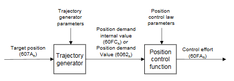

### 轨迹生成器

轨迹生成器结构：

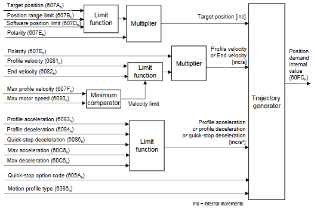

| 对象字典索引 | 名称             |
| :----------- | :--------------- |
| `607Ah`      | 目标位置         |
| `607Bh`      | 位置范围限值     |
| `607Dh`      | 软件位置限值     |
| `607Fh`      | 最大规划速度     |
| `6080h`      | 最大电机速度     |
| `6081h`      | 规划速度         |
| `6082h`      | 终止速度         |
| `6083h`      | 规划加速度       |
| `6084h`      | 规划减速度       |
| `6085h`      | 快速停止减速度   |
| `6086h`      | 运动规划类型     |
| `60A3h`      | 规划加加速度使用 |
| `60A4h`      | 规划加加速度     |
| `60C5h`      | 最大加速度       |
| `60C6h`      | 最大减速度       |

#### 控制字和状态字

- 控制字定义

  | Bit9 | Bit5 | Bit4 | 定义                                                 |
  | :--: | :--: | :--: | :--------------------------------------------------- |
  |  0   |  0   | 0->1 | 目标点应在下一个目标点开始前到达                     |
  |  X   |  1   | 0->1 | 下一个目标点应立即进行                               |
  |  1   |  0   | 0->1 | 以当前规划速度定位至当前目标点，然后进行下一个目标点 |
  
  |  位  | 定义                                              |
| :--: | :------------------------------------------------ |
|  6   | 0 - 目标位置应为绝对值 1 - 目标位置应为相对值 |
|  8   | 0 - 定位继续 1 - 根据停止选项停止             |

- 状态字定义

  |  位  | 定义                                                         |
  | :--: | :----------------------------------------------------------- |
  |  10  | 0 - （控制字 Bit8 = 0） - 目标位置未到达     （控制字 Bit8 = 1） - 电机减速 1 - （控制字 Bit8 = 0） - 目标位置已到达     （控制字 Bit8 = 1） - 电机速度为0 |
  |  12  | 0 - 前一目标点已到达，等待新目标点 1 - 前一目标点仍进行，可接受新目标点覆盖 |
  |  13  | 0 - 无跟随误差 1 - 有跟随误差                            |

#### 目标点设定流程

- 基本流程

  1. 主站写入目标点到从站，索引 `607Ah`；
  2. 主站将从站控制字 `6040h` 的 Bit4 从 0 置为 1；
  3. 从站检测到控制字 `6040h` 的上升沿，读取并锁存目标位置；
  4. 从站将状态字 `6041h` 的 Bit12 置 1，表示目标点已确认；
  5. 主站将控制字 `6040h` 的 Bit4 清 0。
  6. 从站将状态字 `6041h` 的 Bit12 置 0，表示可以接收下一个目标点；
  7. 从站驱动器控制电机到目标位置；
  8. 从站将状态字 `6041h` 的 Bit10 置 1，表示目标点已到达。

  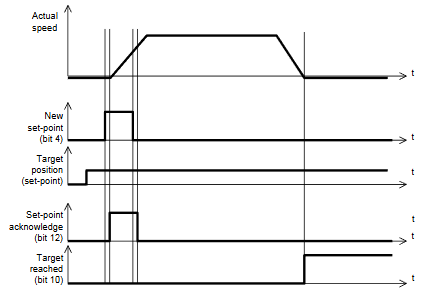

- 单目标点模式：如果当前还在进行一个目标点，而主站又发送了新的目标点，那么驱动器立即放弃或打断当前目标轨迹，转而执行新的目标点。（控制字的 Bit5 = 1）

  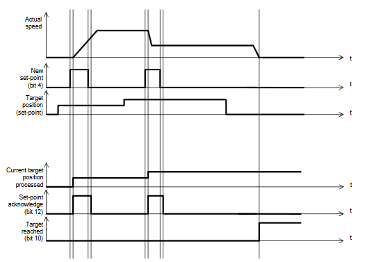

- 多目标点模式：如果当前目标点还没有执行完成，新目标点不会立即执行，而是进入缓冲区，等待当前目标点到达后再执行。（控制字的 Bit5 = 0，注意控制字 Bit9 的状态）

  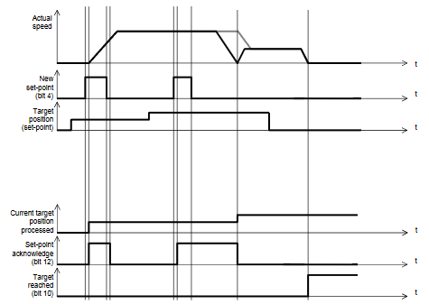

### 位置控制器

位置控制器结构如下：

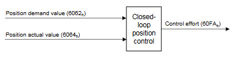

| 对象字典索引 | 名称           |
| :----------- | :------------- |
| `6062h`      | 位置指令值     |
| `6063h`      | 位置实际内部值 |
| `6064h`      | 位置实际值     |
| `6065h`      | 跟随误差窗口   |
| `6066h`      | 跟随误差超时   |
| `6067h`      | 位置窗口       |
| `6068h`      | 位置窗口时间   |
| `60F4h`      | 跟随误差实际值 |
| `60FAh`      | 控制量         |
| `60FCh`      | 位置指令内部值 |
| `60F2h`      | 定位选项代码   |

#### 跟随误差

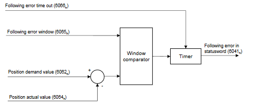

如果位置实际值超出跟随误差窗口允许范围，且在超过跟随误差超时时间后持续存在，会导致状态字中的Bit13 置 1。

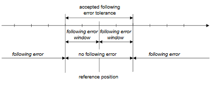

#### 位置到达

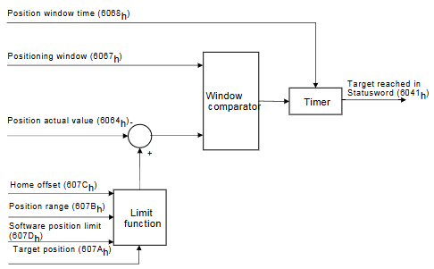

在目标位置周围对称定义一个可接受位置范围的窗口，如果在可接受位置范围内停留时间超过位置窗口时间，则状态字中的 Bit10 置 1。

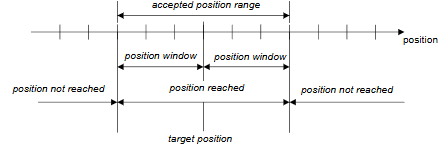

## 4. 速度规划模式

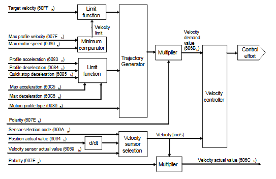

| 对象字典索引 | 名称             |
| :----------- | :--------------- |
| `6069h`      | 速度传感器实际值 |
| `606Ah`      | 传感器选择代码   |
| `606Bh`      | 速度指令值       |
| `606Ch`      | 速度实际值       |
| `606Dh`      | 速度窗口         |
| `606Eh`      | 速度窗口时间     |
| `606Fh`      | 速度阈值         |
| `6070h`      | 速度阈值时间     |
| `60FFh`      | 目标速度         |
| `60F8h`      | 最大滑差         |

### 控制字和状态字

- 控制字定义

  |  位  | 定义                                  |
  | :--: | :------------------------------------ |
  |  8   | 0 - 定位继续 1 - 根据停止选项停止 |
  
- 状态字定义

  |  位  | 定义                                                         |
  | :--: | :----------------------------------------------------------- |
  |  10  | 0 - （控制字 Bit8 = 0） - 目标速度未到达     （控制字 Bit8 = 1） - 电机减速 1 - （控制字 Bit8 = 0） - 目标速度已到达     （控制字 Bit8 = 1） - 电机速度为0 |
  |  12  | 0 - 速度不等于 0 1 - 速度等于 0                          |
  |  13  | 0 - 未达到最大滑差 1 - 已达到最大滑差                    |

## 5. 力矩规划模式

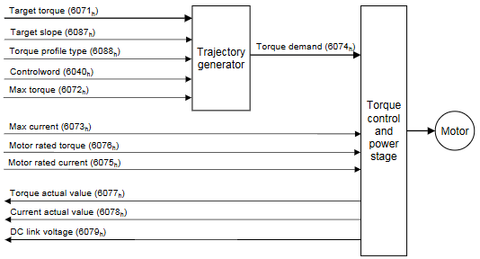

| 对象字典索引 | 名称                 |
| :----------- | :------------------- |
| `6071h`      | 目标力矩             |
| `6072h`      | 最大力矩             |
| `6073h`      | 最大电流             |
| `6074h`      | 力矩指令值           |
| `6075h`      | 电机额定电流         |
| `6076h`      | 电机额定力矩         |
| `6077h`      | 力矩实际值           |
| `6078h`      | 电流实际值           |
| `6079h`      | 直流母线电压         |
| `6087h`      | 力矩斜率             |
| `6088h`      | 力矩规划类型（斜坡） |

### 控制字和状态字

- 控制字定义

  |  位  | 定义                                  |
  | :--: | :------------------------------------ |
  |  8   | 0 - 运动继续 1 - 根据停止选项停止 |

- 状态字定义

  |  位  | 定义                                                         |
  | :--: | :----------------------------------------------------------- |
  |  10  | 0 - （控制字 Bit8 = 0） - 目标力矩未到达     （控制字 Bit8 = 1） - 电机减速 1 - （控制字 Bit8 = 0） - 目标力矩已到达     （控制字 Bit8 = 1） - 电机速度为0 |

## 6. 周期同步位置模式

在该模式中，轨迹生成器位于控制设备中，而非驱动设备中。控制设备以周期同步的方式向驱动设备提供目标位置，驱动设备则执行位置控制、速度控制和扭矩控制。同时控制设备**可以提供附加的速度和扭矩值，以实现速度和/或扭矩前馈**。通过传感器测量，驱动设备可将位置、速度和扭矩的实际值反馈给控制设备。

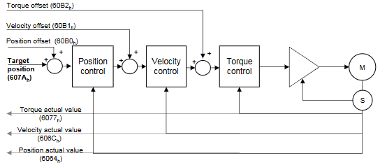

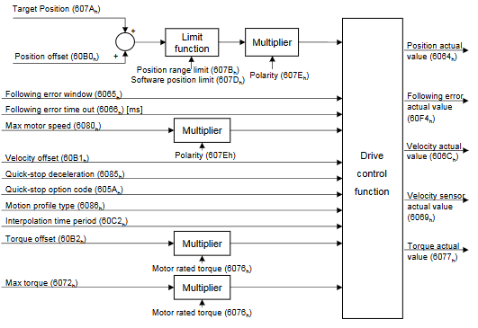

### 状态字

- 状态字定义

  |  位  | 定义                                                    |
  | :--: | :------------------------------------------------------ |
  |  10  | 保留                                                    |
  |  12  | 0 - 忽略目标位置 1 - 目标位置应作为位置控制器的输入 |
  |  13  | 0 - 无跟随误差 1 - 有跟随误差                       |

## 7. 周期同步速度模式

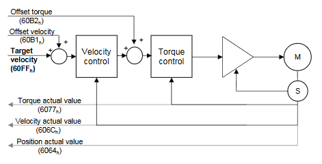

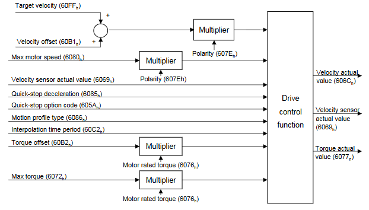

### 状态字

- 状态字定义

  |  位  | 定义                                                    |
  | :--: | :------------------------------------------------------ |
  |  10  | 保留                                                    |
  |  12  | 0 - 忽略目标速度 1 - 目标速度应作为速度控制器的输入 |
  |  13  | 保留                                                    |

## 8. 周期同步力矩模式

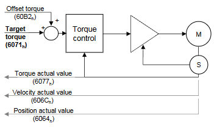

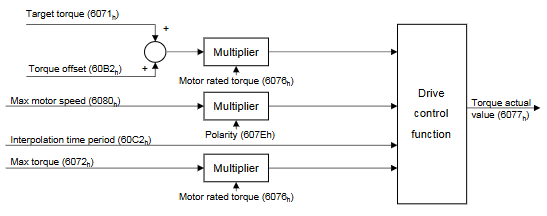

### 状态字

- 状态字定义

  |  位  | 定义                                                    |
  | :--: | :------------------------------------------------------ |
  |  10  | 保留                                                    |
  |  12  | 0 - 忽略目标力矩 1 - 目标力矩应作为力矩控制器的输入 |
  |  13  | 保留                                                    |
