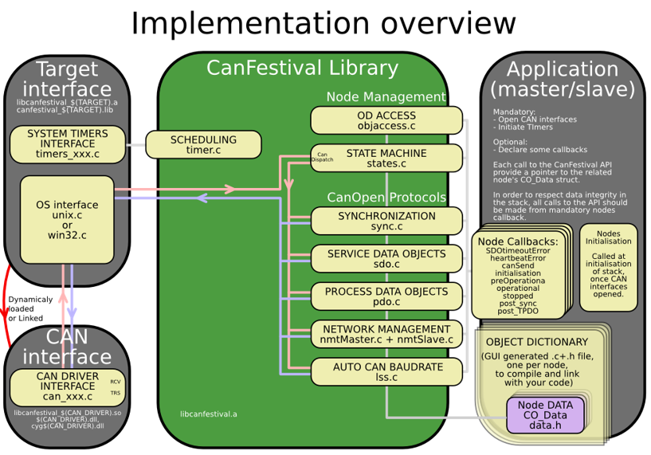
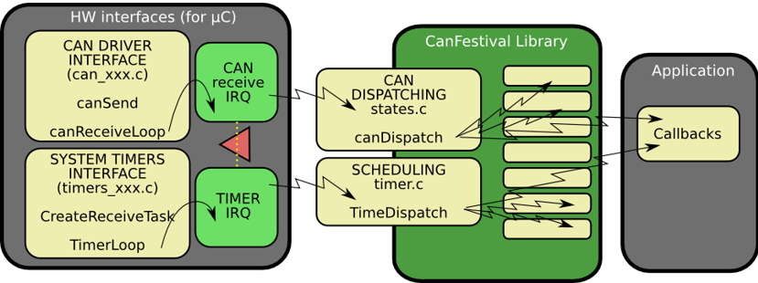
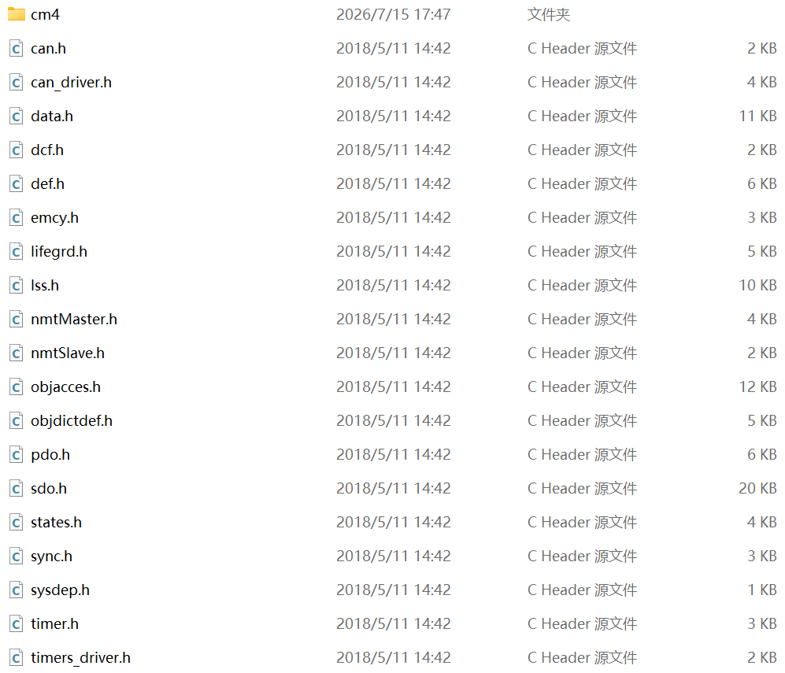
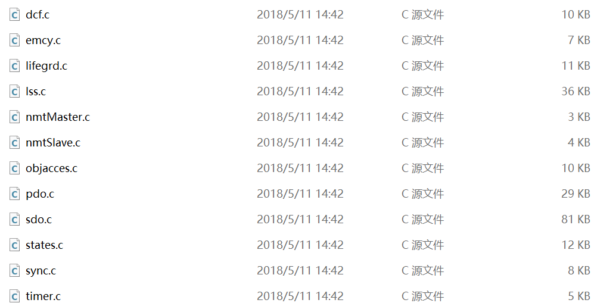
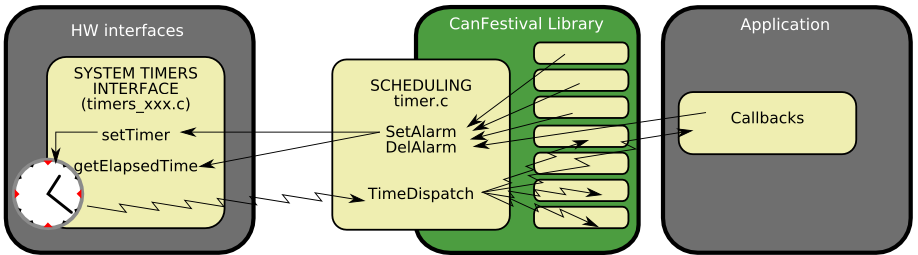
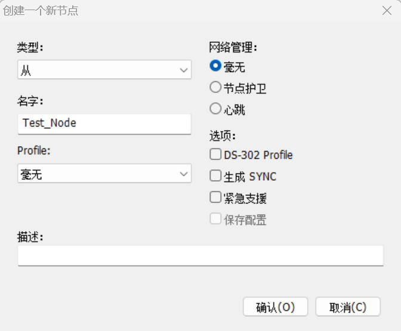
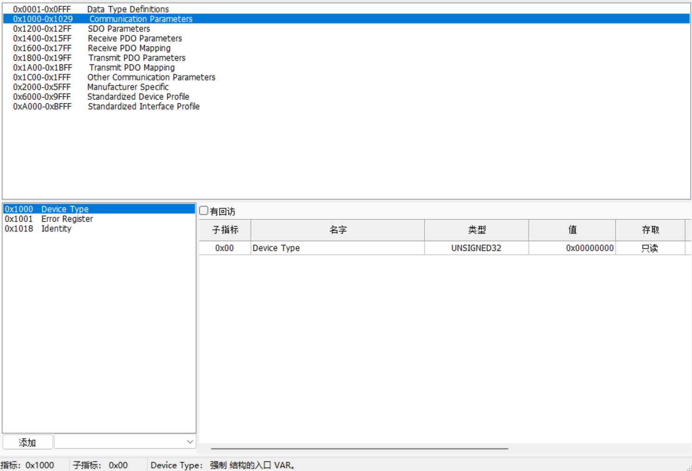

# CANfestival

CANfestival 是一套免费开源的 CANOpen 协议栈框架，遵循 ANSI-C，支持多平台。

CANfestival 官网：[链接](https://canfestival.org/index.html.en)

> 现在官网内的链接全部失效，目前 Github 上的有效链接如下：
>
> 1. (该链接内的 CANfestival 没有和 STM32 移植相关的文件)：[链接](https://github.com/NCAR/canfestival)

CANfestival 库支持的 CANopen 协议栈功能包括：

> - 主从站 NMT 网络管理；
> - 心跳报文发送和接收；
> - 节点守护报文发送和接收；
> - 同步报文发送和接收；
> - 支持多个 SDO 服务器/客户端，可使用快速/分段传输；
> - PDO 发送和接收，PDO 映射；
> - 紧急报文发送和接收；
> - 简明 DFC 文件访问；
> - LSS 设备底层配置协议；

CANfestival 协议栈的目录结构：

| 路径         | 说明                                                         |
| :----------- | :----------------------------------------------------------- |
| ./src        | 与处理器无关的 CANopen 协议栈 C 源码                         |
| ./include    | CANopen 协议栈 C 源码对应的头文件，以及针对不同处理器或操作系统移植时所需要的头文件 |
| ./drivers    | 针对不同处理器或操作系统的移植时的底层驱动（Timer 和 CAN 接口） |
| ./example    | CANfestival 移植到不同处理器或操作系统的实例程序             |
| ./objdictgen | 使用 Python 编写的图形化对象字典编辑工具，用于为基于 CANfestival 的具体应用设计相应的对象字典 |
| ./doc        | 说明文档                                                     |

 CANfestival 框架分为接口层，协议库和应用层，用户只需要关心接口层的移植和用户层的编写。



## 1. 接口移植



### 协议栈移植

- 头文件移植

  移植 `./include` 内的头文件：

  

  修改 `cm4/canfestival.h` 文件防止递归调用：

  ```c
  #ifndef __CANFESTIVAL_H
  #define __CANFESTIVAL_H
  
  #include "applicfg.h"
  #include "data.h"
  
  void initTimer(void);
  void clearTimer(void);
  
  unsigned char canSend(CAN_PORT notused, Message *m);
  unsigned char canInit(CO_Data * d, uint32_t bitrate);
  void canClose(void);
  
  void disable_it(void);
  void enable_it(void);
  
  #endif
  ```

  同时移植 `congif.h` 文件 (在  `./example/AVR/Slave` 内)

  ```c
  /*
  This file is part of CanFestival, a library implementing CanOpen Stack.
  
  Copyright (C): Edouard TISSERANT and Francis DUPIN
  AVR Port: Andreas GLAUSER and Peter CHRISTEN
  
  See COPYING file for copyrights details.
  
  This library is free software; you can redistribute it and/or
  modify it under the terms of the GNU Lesser General Public
  License as published by the Free Software Foundation; either
  version 2.1 of the License, or (at your option) any later version.
  
  This library is distributed in the hope that it will be useful,
  but WITHOUT ANY WARRANTY; without even the implied warranty of
  MERCHANTABILITY or FITNESS FOR A PARTICULAR PURPOSE.  See the GNU
  Lesser General Public License for more details.
  
  You should have received a copy of the GNU Lesser General Public
  License along with this library; if not, write to the Free Software
  Foundation, Inc., 59 Temple Place, Suite 330, Boston, MA  02111-1307  USA
  */
  
  #ifndef _CONFIG_H_
  #define _CONFIG_H_
  
  #ifdef  __IAR_SYSTEMS_ICC__
  #include <ioavr.h>
  #include <intrinsics.h>
  #include "iar.h"
  #else	// GCC
  // #include <inttypes.h>
  // #include <avr/io.h>
  // #include <avr/interrupt.h>
  // #include <avr/pgmspace.h>
  // #include <avr/sleep.h>
  // #include <avr/wdt.h>
  #endif	// GCC
  
  //#define WD_SLEEP
  // Needed defines by Atmel lib
  #define FOSC           8000        // 16 MHz External cristal
  #ifndef F_CPU
  #define F_CPU          (1000UL*FOSC) // Need for AVR GCC
  #endif
  #define CAN_BAUDRATE    1000        // 1Mbps 波特率
  
  // Needed defines by Canfestival lib
  #define MAX_CAN_BUS_ID 1
  #define SDO_MAX_LENGTH_TRANSFER 32
  #define SDO_MAX_SIMULTANEOUS_TRANSFERS 1
  #define NMT_MAX_NODE_ID 128
  #define SDO_TIMEOUT_MS 3000U
  #define MAX_NB_TIMER 8
  
  // CANOPEN_BIG_ENDIAN is not defined
  #define CANOPEN_LITTLE_ENDIAN 1
  
  #define US_TO_TIMEVAL_FACTOR 8
  
  #define REPEAT_SDO_MAX_SIMULTANEOUS_TRANSFERTS_TIMES(repeat)\
  repeat
  #define REPEAT_NMT_MAX_NODE_ID_TIMES(repeat)\
  repeat repeat repeat repeat repeat repeat repeat repeat repeat repeat repeat repeat repeat repeat repeat repeat repeat repeat repeat repeat repeat repeat repeat repeat repeat repeat repeat repeat repeat repeat repeat repeat repeat repeat repeat repeat repeat repeat repeat repeat repeat repeat
  
  #define EMCY_MAX_ERRORS 8
  #define REPEAT_EMCY_MAX_ERRORS_TIMES(repeat)\
  repeat repeat repeat repeat repeat repeat repeat repeat
  
  
  #endif /* _CONFIG_H_ */
  ```

- 源文件移植

  移植 `./src` 内的源文件：

  

  修改 `dcf.c` 文件，取消 `start_node()` 和 `start_and_seek_node()` 的内联：

  ```c
  void start_node(CO_Data* d, UNS8 nodeId){
      /* Ask slave node to go in operational mode */
      masterSendNMTstateChange (d, nodeId, NMT_Start_Node);
      d->NMTable[nodeId] = Connecting;
  }
  
  /**
  ** @brief Start the nodeId slave and look for other nodes waiting to be started 
  **        If nodeId is 0 the start node is not done
  ** @param d
  ** @param nodeId
  */
  void start_and_seek_node(CO_Data* d, UNS8 nodeId){
     UNS8 node;
     if(nodeId)
         start_node(d,nodeId);
     for(node = 0 ; node<NMT_MAX_NODE_ID ; node++){
         if(d->NMTable[node] != Initialisation)
             continue;
         if(check_and_start_node(d, node) == 2)
             return;
     }
     d->dcf_status = DCF_STATUS_INIT;
  }

### CAN 收发接口编写

需要实现 `canSend()` 函数和 `canDispatch()` 函数。

```c
unsigned char canSend(CAN_PORT notused, Message *m)
{
    uint32_t TxMailbox;
    CAN_TxHeaderTypeDef TxHeader = {0};
    uint8_t TxData[8] = {0};
    
    TxHeader.StdId = m->cob_id;
    TxHeader.ExtId = 0;
    TxHeader.IDE = CAN_ID_STD;
    TxHeader.RTR = (m->rtr) ? CAN_RTR_REMOTE : CAN_RTR_DATA;
    TxHeader.DLC = m->len;
    
    for(int i = 0; i < m->len && i < 8; i++)
    {
        TxData[i] = m->data[i];
    }
    
    if(HAL_CAN_AddTxMessage(&hcan, &TxHeader, TxData, &TxMailbox) != HAL_OK)
    {
        return 0;  
    }
    
    return 1;
}

static CO_Data *co_data = NULL;

void HAL_CAN_RxFifo0MsgPendingCallback(CAN_HandleTypeDef *hcan)
{
    CAN_RxHeaderTypeDef RxHeader = {0};
    uint8_t RxData[8] = {0};
    Message rxm = {0};
    
    if(HAL_CAN_GetRxMessage(hcan, CAN_RX_FIFO0, &RxHeader, RxData) != HAL_OK)
    {
        return;
    }
    
    if(RxHeader.IDE == CAN_ID_EXT)
    {
        return;
    }
    
    // 填充 CANopen 消息结构体
    rxm.cob_id = RxHeader.StdId;
    rxm.rtr = (RxHeader.RTR == CAN_RTR_REMOTE) ? 1 : 0;
    rxm.len = RxHeader.DLC;
    
    for(int i = 0; i < rxm.len && i < 8; i++)
    {
        rxm.data[i] = RxData[i];
    }
    
    // 交给 CANopen 协议栈处理
    canDispatch(co_data, &rxm);
}
```

### Timer 接口编写



TIM 设定 1ms 中断，需要实现 `setTimer()` 和 `getElapsedTime()` 函数。

```c
void setTimer(TIMEVAL value)
{
    uint32_t timer = __HAL_TIM_GET_COUNTER(&htim3);
    elapsed_time += timer - last_counter_val;
    last_counter_val = 65535 - value;
    __HAL_TIM_SET_COUNTER(&htim3, 65535 - value);
    __HAL_TIM_ENABLE(&htim3);
}

TIMEVAL getElapsedTime(void)
{
    uint32_t timer = __HAL_TIM_GET_COUNTER(&htim3);
    
    if (timer < last_counter_val)
    {
        timer += 65535;
    }
    
    TIMEVAL elapsed = timer - last_counter_val + elapsed_time;
    return elapsed;
}

void HAL_TIM_PeriodElapsedCallback(TIM_HandleTypeDef *htim)
{
    if (htim == &htim3)
    {
        last_counter_val = 0;
        elapsed_time = 0;
        // 调用 CANopen 协议栈的时间调度函数
        TimeDispatch();
    }
}
```

## 2. 对象字典编辑器

CANfestival 内置了对象字典编辑器 `objdictedit` 用于生成协议栈源码。

`objdictedit` 依赖于以下环境：

> - Python 2.7：[下载链接](https://www.python.org/downloads/windows/)
> - wxPython 2.8：[下载链接](https://sourceforge.net/projects/wxpython/files/wxPython/2.8.12.1/)

解压 `canfestival\objdictgen` 目录下的 `Gnosis_Utils-current.tar.gz`，将其中的 `gnosis` 拷贝到 `canfestival\objdictgen` 下。

运行 `objdictedit.py`，此时应当出现对象字典编辑器。


新建节点：



> - 类型：可选主、从节点；
> - 名字：自己定义节点名称；
> - Profile (协议)：协议，如 DS-401；
> - 网络管理：是否选择相关网络管理。

创建节点确认后，会进入对象字典配置界面。



可以进行对象字典相关配置。配置结束后选择 文件 -> 建立词典，此时会形成相关的对象字典源代码。包括 `xxx.od`，`xxx.c` 和 `xxx.h` 其中 `xxx.od` 为对象字典配置文件。
