# EtherCAT 基本原理

## 0. 工业以太网

**现场总线**是用于现场智能化装置与控制室自动化系统之间的一个标准化的数字式通信链路，可进行全数字化、双向及多站总线式的信息数字通信，实现相互操作以及数据共享。

现场总线的主要目的是用于控制、报警和事件报告等工作。现场总线通信协议的基本要求是响应速度和操作的可预测性的最优化。现场总线是一个低层次的网络协议，在其之上还允许有上级的监控和管理网络，负责文件传送等工作。

现场总线打破了传统控制系统的结构形式，采用数字信号替代模拟信号的传输，在一对双绞线上可以挂接多个节点，但在传输速率等方面具有一定的局限性，比如运动控制场合需要微秒级的数据刷新周期，现场总线难以满足其要求。

**工业以太网**以其应用广泛、通信速率高及成本低廉等优势引入到工业控制领域，成为新的热点。工业以太网使用率正在工业自动化和过程控制市场上迅速增长，几乎所有远程 I/O 接口技术的供应商均提供一个支持 TCP/IP 协议的以太网接口，如 Siemens、Rockwell、GE、Fanuc 等提供与远程 I/O 和基于 PC 的控制系统相连接的接口。

工业以太网在技术上与商用以太网兼容，但又必须满足工业控制网络通信的需求。在设计时，材质的选用、产品的强度、可靠性、抗干扰能力及实时性等方面应满足工业现场环境的应用。

工业以太网协议模型和 OSI 模型存在区别：

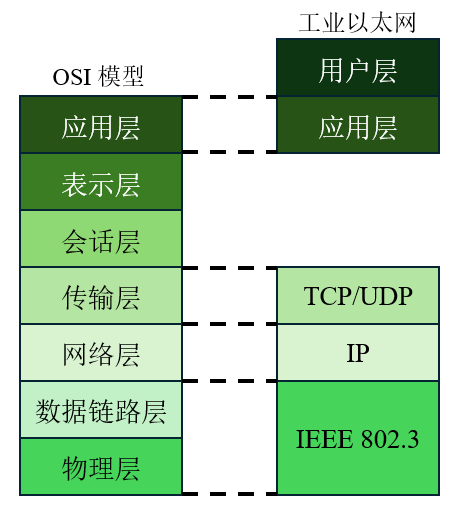

工业以太网一般应用于通信实时性要求不高的场合。对于响应时间小于 5ms 的应用，工业以太网已不能胜任。为了满足高实时性能应用的需要，各大公司和标准组织纷纷提出各种提升工业以太网实时性的技术解决方案。这些方案建立在 IEEE 802.3 标准的基础上，通过对其向相关标准的实时扩展来提高实时性，并且做到与标准以太网的无缝连接，这就是**实时以太网**。

常见的实时以太网协议如下：

| 技术名称           | 技术来源                     | 应用领域           |
| :----------------- | :--------------------------- | :----------------- |
| EtherNet/IP        | 美国 Rockwell 公司           | 过程控制           |
| PROFINET           | 德国 Siemens 公司            | 过程控制、运动控制 |
| P-NET              | 丹麦 Process-Data A/S 公司   | 过程控制           |
| Vnet/IP            | 日本 Yokogawa 公司           | 过程控制           |
| TC-net             | 日本 Toshiba 公司            | 过程控制           |
| EtherCAT           | 德国 BECKHOFF 公司           | 运动控制           |
| EtherNet Powerlink | 奥地利 B&R 公司              | 运动控制           |
| EPA                | 浙江大学、浙江中控公司等     | 过程控制、运动控制 |
| Modbus/TCP         | 法国 Schneider-Electric 公司 | 过程控制           |
| SERCOS-Ⅲ           | 德国 Hilscher 公司           | 运动控制           |

实时以太网采用不同的实时策略提高实时性能，实现模型如下：

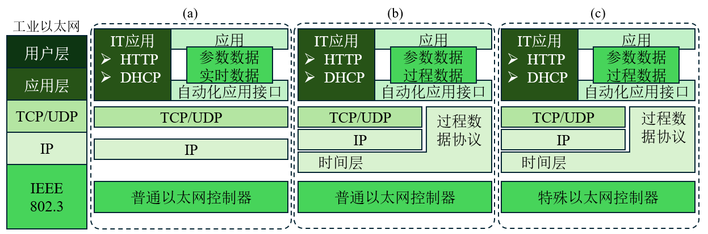

| 序号 | 技术特点         | 说明                                                         | 应用实例                         |
| :--: | :--------------- | :----------------------------------------------------------- | :------------------------------- |
|  1   | 基于 TCP/IP 实现 | 特殊部分在应用层                                             | Modbus/TCP、EtherNet/IP          |
|  2   | 基于以太网实现   | 不仅实现了应用层，而且在网络层和传输层做了修改               | EtherNet POWERLINK、PROFINET RT  |
|  3   | 修改以太网实现   | 不仅在网络层和传输层做了修改，而且改进了底下两层，需要特殊的网络控制器 | EtherCAT、SERCOS Ⅲ、PROFINET IRT |

几种实时以太网的比较如下：

|     项目     |            EtherCAT            |       SERCOS Ⅲ        |     PROFINET IRT      |      POWERLINK       |    EPA     | EtherNet/IP |
| :----------: | :----------------------------: | :-------------------: | :-------------------: | :------------------: | :--------: | :---------: |
| **管理组织** |              ETG               |          ICS          |          PNO          |         EPG          | EPA 俱乐部 |    ODVA     |
| **通信机构** |             主/从              |         主/从         |         主/从         |        主/从         |    C/S     |     C/S     |
| **传输模式** |             全双工             |        全双工         |        半双工         |        半双工        |   全双工   |   全双工    |
| **实时特性** |     100 轴，响应时间 100μs     | 8 轴，响应时间 32.5μs | 100 轴，响应时间 1ms  | 100 轴，响应时间 1ms |     —      |   1～5ms    |
| **拓扑结构** | 星形、线形、环形、树形、总线型 |      线形、环形       |      星形、线形       |  星形、树形、总线型  | 树形、星形 | 星形、树形  |
| **同步方法** |       时间片 + IEEE1588        |   主节点 + 循环周期   | 时间槽调度 + IEEE1588 |  时间片 + IEEE1588   |  IEEE1588  |  IEEE1588   |
| **同步精度** |             100ns              |         <1μs          |          1μs          |         1μs          |   500ns    |     1μs     |

其中 EtherCAT 各方面的性能都比较突出，循环时间低，高速，高同步性，易用性，低成本。

## 1. EtherCAT 协议简介

### EtherCAT 协议概述

##### EtherCAT 系统架构

EtherCAT 网络由一个通信控制器(主机)和多个现场设备(从机)构成。

不同类型的从机可以连接到网络，需要同步的从机可以与其他从机任意链接，没有特殊同步要求，单个从机可以在运行时热插拔。

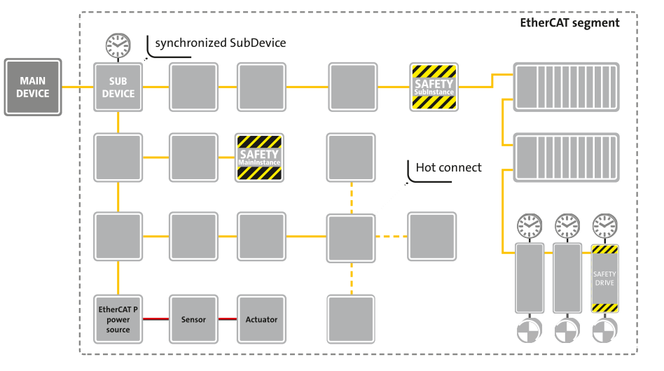

主机控制 EtherCAT 通信，是唯一能向网络发送新 EtherCAT 帧的设备，主机通过标准 MAC 发送和接收帧，从机在硬件层面实时处理帧。

EtherCAT 网络可以在线和离线配置。在线配置时，主机扫描连接的 EtherCAT 网络，并直接从从机获取配置所需的信息；离线配置时，需要子设备提供的 ESI 文件进行配置。

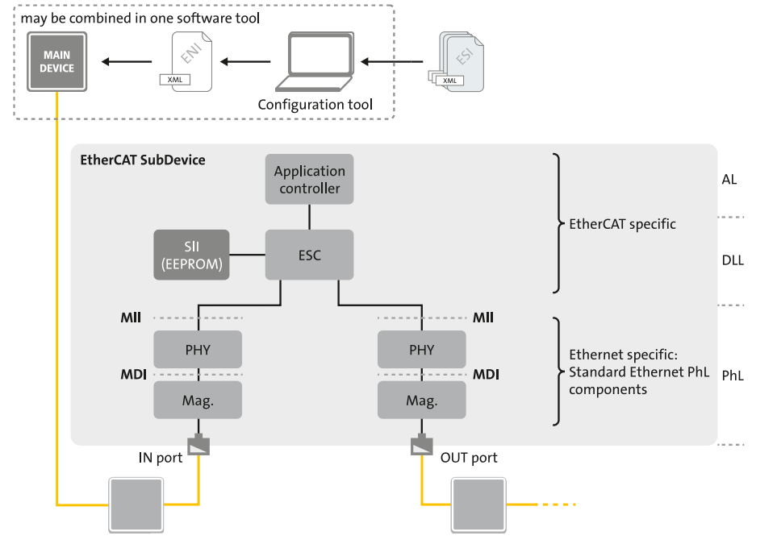

##### EtherCAT 系统拓扑

EtherCAT 从机通过标准网络接口连接到 EtherCAT 主机。当多个 EtherCAT 从机连接到主机时，这种连接方式称为直接模式，此时不检查 EtherCAT 帧的 MAC 地址字段；EtherCAT 网段可以通过 IEEE 802 报头字段进行访问，可以通过 IEEE 802.1 基础设施(交换机)连接到主机，这种连接方式称为开放模式。

EtherCAT 支持几乎所有拓扑结构：线型/菊花链型/星型/树型/分支线型/环型。这些拓扑变体可以通过 EtherCAT 网络内部通信端口的连接方式实现，而不需要交换机/集线器。

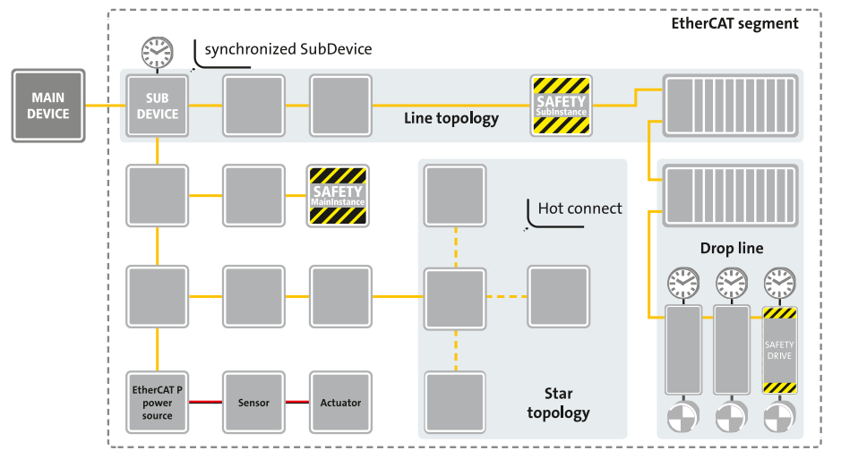

网络性能独立于网络拓扑。单个网段最多容纳 65536 个从机。

##### EtherCAT 工作原理

EtherCAT 采用 "on the fly" 方式进行工作，该方式通过每个从站设备内部的 EtherCAT 从机控制器 ESC 实现。**主机通过标准网络接口发送 EtherCAT 数据帧，从机逐半字节接收数据帧，在不中断数据流传输的情况下处理其内容，然后转发至后续从机。每个从机的处理延迟相较于数据帧本身的传输时间极为短暂，甚至可能出现多个从机同时处理同一数据帧不同部分的情况。**

EtherCAT 通过 "on the fly" 机制和基于环形逻辑的帧转发方案取代了 IEEE 902.1 桥接机制。**数据帧在 ESC 中被接收处理，并发送至下一个空闲接口。数据帧从该端口返回后，将继续转发至后续空闲端口，直到最终返回主机设备。由于端口支持全双工模式，每个端口可以同时进行数据帧发送和接收。**

> 相当于数据帧在信道上开火车，每个从机可以对火车的其中几节车厢进行极快的处理，火车从主机出发最后返回主机。

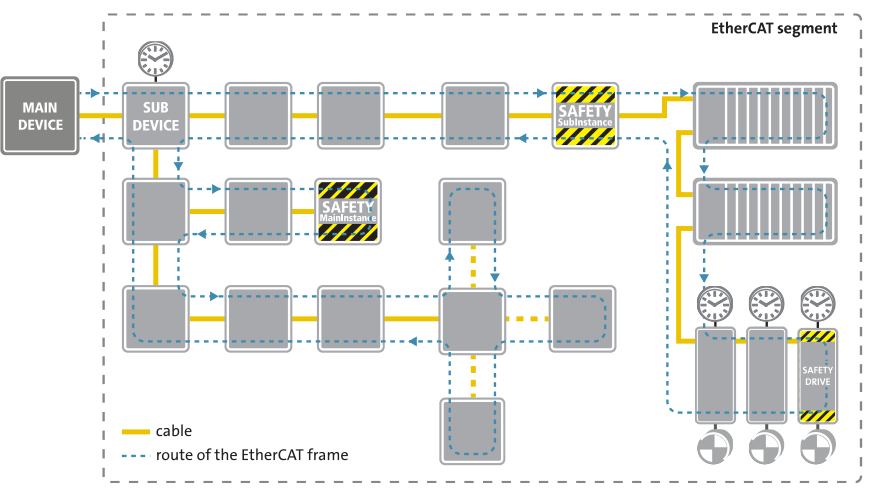

##### EtherCAT 从机模型

EtherCAT 从机符合下图所示的模型，仅保留物理层，数据链路层和应用层。

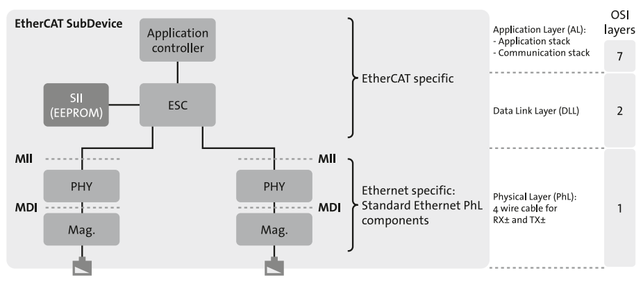

物理层 PhL 符合以太网标准 IEEE 802.3；与数据链路层 DLL 的接口是介质无关接口 MII。

数据链路层 DLL 包括帧格式，实时处理和环形端口转发功能，由 EtherCAT 从机控制器 ESC 在硬件中实现。数据链路层 DLL 的上层接口是物理设备接口 PDI，将 ESC 连接到主控制器和外部 I/O 驱动器。

在主控制器和 I/O 侧处理的功能是应用层 AL，包括通信栈(EtherCAT 状态机，EtherCAT 邮箱协议，过程数据处理)，特定应用的协议栈在通信栈之上执行。

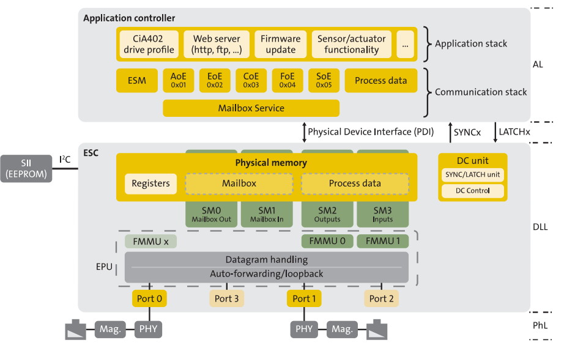

##### EtherCAT 从机控制器 ESC

ESC 以基于硬件的逻辑元件实现所有通信功能，包括实时帧处理、帧转发和时钟同步，无需在软件层面实现这些功能，这使得 EtherCAT 从机软件栈极为精简，并确保传播延迟和处理抖动保持在较小范围，且与具体从机实现方案无关。

ESC 最多可支持四个端口，但大多数 EtherCAT 从机设备配备两个外部连接端口，以实现从机设备的菊花链式连接。端口 0 称为 IN 端口，是数据帧在 ESC 内部由 EtherCAT 处理单元(EPU)处理前首先抵达的端口。所有其他支持的端口则称为 OUT 端口，用于连接从机设备至网络下游部分(这些端口接收的是已由 EPU 处理完成的数据帧)。

ESC 配置数据(与数据链路层相关)以及用于配置的设备描述(与应用层相关)存储在名为 EtherCAT 从机设备信息接口(SII)的非易失性存储器中。该存储器通常是通过 IIC 接口连接至 ESC 的 EEPROM 器件。少数 ESC 支持 SII 仿真功能，其 SII 内容可由软件栈维护。

每个 EtherCAT 端口的链路/活动指示灯，以及用于报告 EtherCAT 状态机当前状态与错误的指示灯，均可由 ESC 直接驱动。

EPU 通过端口 0 接收 EtherCAT 帧后进行处理。这包括从帧中读取数据并将其复制到 ESC 存储器中，将数据从 ESC 存储器复制到帧中，并更新帧校验序列(FCS)。

物理设备接口(PDI)为本地应用程序提供对 ESC 物理存储器的访问。寄存器存储器用于存储设置和诊断信息。用户存储器用于交换参数和过程数据，其访问方式类似于双端口存储器，既可由主机访问，也可由本地应用程序访问。ESC 物理存储器解耦了主机应用程序/现场总线与从机应用程序端的数据更新速率。因此从机中软件栈的处理时间完全不会影响网络上的帧传播延迟。所有 ESC 的处理延迟(即从一个端口接收帧到从下一个端口发送帧之间的时间)都非常相似，且极其短暂。

服务参数以及周期性过程数据通过数据存储器进行交换，数据一致性得到保证。从存储器读取和向存储器写入的位级数据映射也可以从两侧进行。这是通过在从机启动时配置的隐式映射实现的，使得能够用一个单独的帧对网络中的所有从机进行寻址。

ESC 集成了一个非常精确的本地计数器，该计数器可以与其他 ESC 的计数器以及主机时间同步。基于这些计数器，可以为整个网络设置一个系统时间。每个 ESC 内的专用功能块可以基于此时间参考生成本地中断和时间锁存事件，相关机制被称为分布式时钟 (DC)。

### EtherCAT 物理层

(略)

### EtherCAT 数据链路层

#### 帧处理

从机的输出端口在接入下一从机时打开，空接时闭合。从 IN 端口到下一个端口描述的帧处理方向称为处理方向，直到网段中的所有 ESC 都通过其 IN 端口接收到该帧。其他方向称为转发方向。

只有当端口处于开放状态（即环路开放）时，帧才会被导向链路中的下一个从机；如果端口处于关闭状态（即环路闭合），帧将在 ESC 内部传递至下一个端口。

EtherCAT 从机使用的端口数量可能少于其所用 ESC 支持的端口数。端口可通过配置禁用；ESC 支持但被禁用的端口将按关闭端口处理，其环路状态也会相应处理。

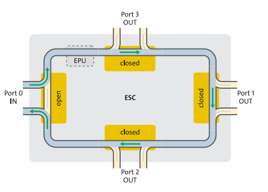

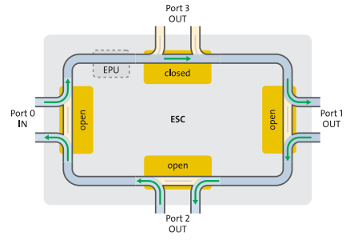

#### EPU

ESC 的主要功能包括具备数据报处理的 EtherCAT 处理单元 (EPU)、自动转发/回环功能以及现场总线内存管理单元 (FMMU)。ESC 负责接收、解码、处理并编码 EtherCAT 数据流。一旦通过端口 0 (IN) 接收到数据流，读写命令指令的执行便会开始。主机和从机应用之间的数据交换类似于共享内存 (应用 RAM)，并通过协调访问 (同步管理器) 和数据映射 (FMMU) 的特殊功能得到增强。

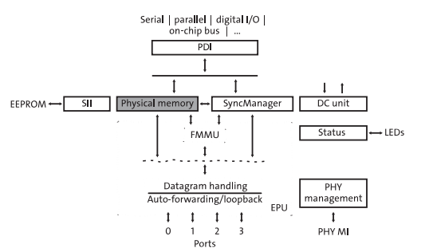

> - **端口 0/1/2/3**：端口实现了以太网的数据链路层部分 (包括帧结构和校验序列) ，即介质访问控制 (MAC) 。该模块通过介质独立接口 (MII) 与物理层连接。
> - **EtherCAT 处理单元**：自动转发/环回功能，数据报处理，FMMU。自动转发/回环功能接收以太网帧，执行帧检查并将其转发至下一端口或数据报处理模块。必要时，系统会为接收到的帧生成时间戳，并通过寄存器提供副本。数据报处理模块负责接收、分析和处理 EtherCAT 数据流，其主要功能是启用并协调对 ESC 内部寄存器及应用 RAM 的访问，可以通过 FMMU 或直接读写访问实现。以太网帧错误会被计数并存储，以便通过特定的错误寄存器读取。
> - 同步管理器：同步管理器确保应用 RAM 在从 EtherCAT 主机和从机应用两端访问时的一致性。它还协调单缓冲或三缓冲内存处理，用于邮箱或过程数据通信。通过这种方式，支持握手机制或随时读写访问。也包括 EtherCAT 通信看门狗功能。
> - PHY 管理：PHY 管理单元通过 MII 管理接口与以太网 PHY 通信，MII 管理接口用于可选的链路检测和配置功能。
> - **分布式时钟单元**：分布式时钟 (DC) 单元包含一个基于纳秒的计数器，该计数器可与其他 ESC 的计数器同步；特定的 DC 寄存器提供了必要的接口。基于此同步时间，可以生成本地时间事件和时间戳。
> - 物理内存：物理内存用于主机和从机应用之间的数据交换。分为两个区块：第一个区块从 0x0000 到 0x0FFF，用于寄存器；第二个区块从 0x1000 到最大 0xFFFF (具体取决于 ESC) ，用于交换应用数据。物理内存可通过 MII 和 PDI 从两侧进行读写。
> - 物理设备接口：物理设备接口 (PDI) 提供了从应用控制器侧到 ESC 的物理连接。接口类型包括数字 I/O、串行和并行接口、芯片特定接口以及通用 I/O。
> - **SII**：子设备信息接口 (SII) 保存可能的 ESC 配置信息和子设备应用特定信息，包括子设备的识别信息。SII 可以实现为非易失性 EEPROM 设备。
> - 状态指示灯。

ESC 处理嵌入在原始以太网帧或 IP/UDP 数据包中的 EtherCAT 帧。其他帧类型要么被 EPU 忽略，要么被销毁，具体取决于 ESC 中设置的处理规则。ESC 仅处理 EtherCAT 类型等于 1 的 EtherCAT 帧。

#### EtherCAT 数据帧

EtherCAT 采用 IEEE 标准定义的以太网帧 (详见数据链路层)。

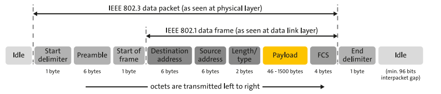

EtherCAT 帧嵌入在以太网帧中，如下图所示：

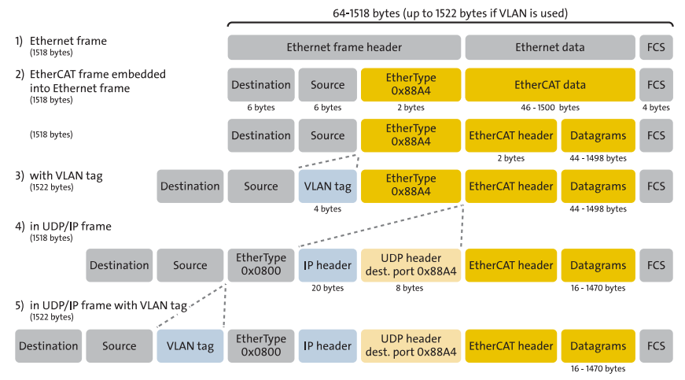

> 以太网帧的结构包括以太网帧头、以太网数据和帧校验序列 (FCS)，总长度为 1518 字节。以太网帧的最小长度为 64 字节，其中以太网数据的最小长度需为 46 字节。若 EtherCAT 帧长度不足，MAC 层会添加额外的填充字节。对于带标签的帧，填充字节的处理方式可能有所不同。

**ESC 不检查 MAC 地址，源 MAC 地址由 EPU 更改**，将本地管理位 (b1) 设置为真  （1），主机及网络扫描可以通过此方式区分出站和入站帧。

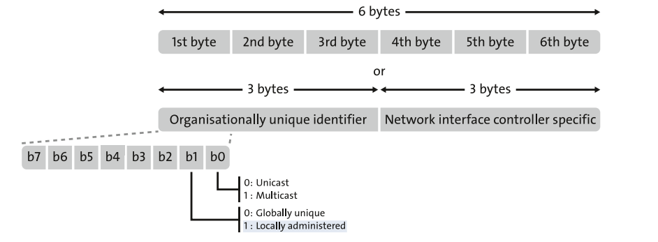

**EtherCAT 帧通过 IEEE 注册机构分配的 EtherType (0x88A4) 进行标识**。通常，EtherCAT 帧作为 EtherType 为 0x88A4 的以太网帧的数据单元进行传输。

EtherCAT 帧也可以根据 IEEE 802.1Q 嵌入到 VLAN 标记帧中，但 VLAN 标签不会被 ESC 评估。此类帧最多可包含 1522 字节。

EtherCAT 帧也可以嵌入到 UDP/IP 帧中 (IETF RFC 791/IETF RFC 768)。在这种情况下，使用 IP 的 EtherType 0x0800，目标端口号为 0x88A4，由互联网号码分配机构 (IANA) 分配。此类帧的最大长度为 1518 字节。

---

**一个 EtherCAT 帧分为 EtherCAT 帧头和一个或多个 EtherCAT 数据报。一个数据报寻址一个或多个 EtherCAT 子设备**。

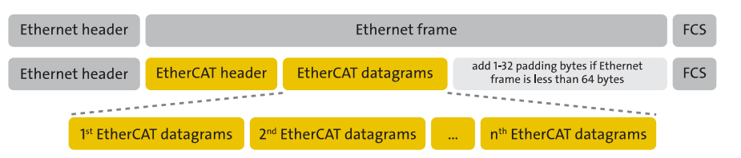

EtherCAT 帧头包含长度字段和类型字段，长度字段指示后续 EtherCAT 数据的总字节长度，即所有后续 EtherCAT 数据报的长度总和，所有数据报的总长度仅受限于以太网帧的最大长度。若超出以太网帧长度限制，可通过发送包含更多数据报的额外以太网帧来解决。类型字段用于标识后续 EtherCAT 数据的类型。

类型 1 表示 EtherCAT 设备协议 (EDP) 数据，这意味着其后跟随一个或多个 EtherCAT 数据报。只有这些帧由 ESC 处理。根据 ESC 设置，其他 EtherCAT 类型的帧可能会被破坏/截断。

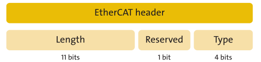

| 类型 | 描述                                     |
| ---- | ---------------------------------------- |
| 0    | 保留                                     |
| 1    | EtherCAT 设备通信，唯一由 ESC 评估的类型 |
| 2-3  | 保留                                     |
| 4    | EAP 过程数据通信                         |
| 5    | EAP 邮箱通信                             |
| 6-15 | 保留                                     |

---

EtherCAT 数据报由数据报头 (10 字节)、数据和工作计数器 (WKC，2 字节) 组成。

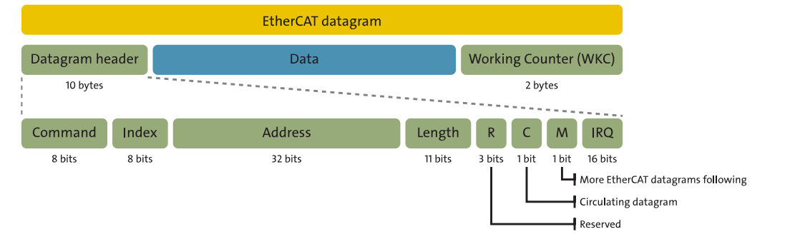

- **EtherCAT 命令(Command)**：结合 EtherCAT 地址，根据命令类型，可以寻址 EtherCAT 段内的单个、多个或所有 EtherCAT 从机。
- **索引(Index)**：由主机使用的数字标识符，用于识别重复和丢失的数据报。该标识符不应由 ESC 更改。
- **长度字段(Length)**：指示了该数据报中后续数据的长度。
- **循环数据报位(C)**：指示一个帧是否已在 EtherCAT 网段中循环过一次。当 EtherCAT 网段与主机断开连接时，这种情况可能发生。如果一个数据报在同一方向上第二次通过 ESC，ESC 将设置此位，并在下一次销毁该数据报（实际上是该以太网帧），以防止此类帧触发输出看门狗，即使该网段不再由 EtherCAT 主机主动控制。
- **EtherCAT 数据报跟随位(M)**：指示在该 EtherCAT 帧中是否还有另一个数据报跟随，ESC 使用此位来处理 EtherCAT 数据流。
- **数据报中断字段(IRQ)**：携带所有寻址从机经过逻辑或运算后的屏蔽 EtherCAT 外部事件 (0x0210:0x0211)。屏蔽功能通过外部事件掩码 (0x0200:0x0201) 进行配置。主机可评估该数据报中断字段以用于子设备和网络诊断。

#### 寻址

EtherCAT 数据报用于读取和写入 EtherCAT ESC 存储器。EtherCAT 数据报中的 32 位地址字段用于设备寻址或逻辑寻址。

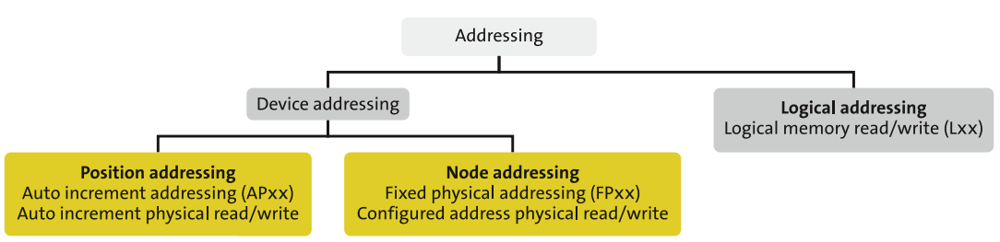

1. **设备寻址**

   在设备寻址模式下，数据报地址字段被分为一个 16 位字段 (用于寻址各个从机) 和另一个 16 位字段 (用于寻址物理内存中的特定部分)。前者也称为 ADP (地址位置)，后者称为 ADO (地址偏移)。使得在一个网段内可以寻址 65535 个 EtherCAT 从机，并支持 65535 字节（即最大 64 kB）的物理内存空间。

   设备寻址通常用于 EtherCAT 主机与从机之间交换参数数据。

   设备寻址分为位置寻址和节点寻址。

   - 位置寻址

     通过每个从机在 EtherCAT 段中的拓扑位置来寻址，从连接到 EtherCAT 主机的第一个从机开始。

     数据报地址字段包含从机在网段中的位置以及用于寻址物理内存的本地内存偏移量。

     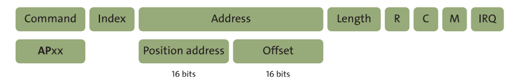

     位置字段包含子设备的位置，以负值表示。每个从机递增该位置值。接收到位置值等于 0 的数据报的从机即为被寻址的从机。

     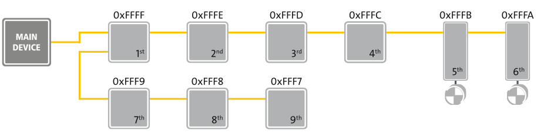

     > 一个 EtherCAT 段示例，其中包含每个从机的自动递增地址和位置编号。为寻址第三个子设备，主机发送一个自动递增地址为 -2 (0xFFFE) 的数据报。第一个从机接收到该值的数据报，将其递增 1 并转发给下一个从机。第二个从机接收到自动递增地址值 0xFFFF，递增后转发给第三个从机。第三个从机接收到一个带有 APxx 命令且自动递增地址为 0 的数据报，处理该命令指令，并将该值递增为 0x0001。

     位置寻址方式非常实用，因为其允许通过从机在网段中的位置来寻址任何 EtherCAT 从设备，无需明确的地址、名称或 ID。这种方式在启动期间以及主机检测网络拓扑时使用。然而使用位置寻址时，拓扑变化可能导致寻址错误的从设备。

     自动增量地址不由 ESC 存储。广播命令同样采用位置寻址方式。位置地址用作首个被寻址的从机，而后续所有子设备也会处理该广播命令指令。

     位置寻址命令包括 APRD、APWR、APRW、ARMW、BRD、BWR、BRW。

   - 节点寻址

     节点寻址用于通过主机分配的配置节点地址来寻址每个子设备，该地址在段启动时写入 0x0010:0x0011 配置站地址。数据报地址字段包含分配的节点地址以及用于寻址物理内存的偏移量。同时，虽然指定了替代站地址（0x0012:0x0013 配置站别名），但通常不用于节点寻址。

     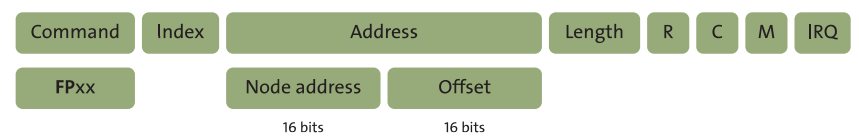

     主机或配置工具可以分配任何 16 位值作为配置站地址。为了通过值范围区分寻址类型，节点寻址通常从不同于 0x0000 的偏移量开始。

     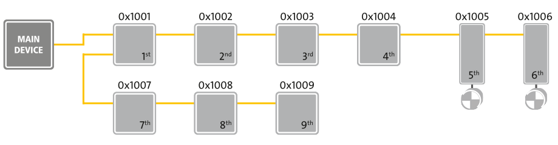

     节点地址由 ESC 存储。

     节点寻址命令包括 FPRD、FPWR、FPRW、FRMW。

2. **逻辑寻址**

   逻辑寻址将 32 位地址字段作为单一非结构化地址使用，可寻址 4GB。

   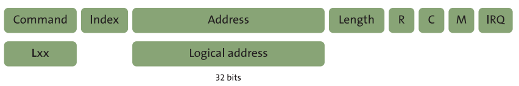

   在 4GB 地址范围内，映射一个或多个从机的输入数据和输出数据。每个从机在启动时被配置为将数据从逻辑地址空间映射到物理内存，地址字段包含逻辑地址空间的起始地址，长度字段则对应数据报所携带数据的逻辑地址空间长度。映射由 FMMU 完成。

   逻辑寻址通常用于访问过程数据。

   逻辑寻址命令包括 LRD，LWR 和 LRW。

#### 命令

EtherCAT 命令是从主机的角度进行描述的，写命令意味着数据从 EtherCAT 数据报复制到物理内存，读命令意味着数据从物理内存复制到 EtherCAT 数据报。

EtherCAT 命令嵌入在 EtherCAT 数据报中，因此，一个或多个命令可以嵌入到单个 EtherCAT 帧中发送。

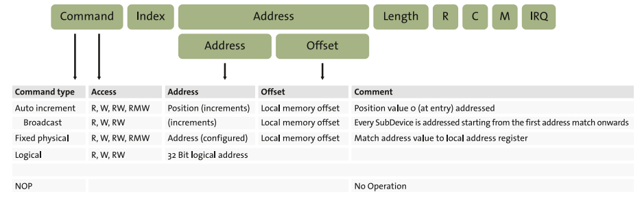

EtherCAT 命令如下：

| CMD  | 缩写 | 名称                     | 描述                                                         |
| ---- | ---- | ------------------------ | ------------------------------------------------------------ |
| 0x00 | NOP  | 无操作                   | 从机忽略命令。                                               |
| 0x01 | APRD | 自动递增物理读取         | 从机递增地址。如果接收到的地址为零，从机将读取的数据复制到 EtherCAT 数据报中。 |
| 0x02 | APWR | 自动递增物理写入         | 从机递增地址。如果接收到的地址为零，从机将数据写入存储位置。 |
| 0x03 | APRW | 自动递增物理读写         | 从机递增地址。如果接收到的地址为零，从机将读取的数据放入 EtherCAT 数据报中，并将数据写入相同的存储位置。 |
| 0x04 | FPRD | 配置地址物理读取         | 如果地址与其配置的地址之一匹配，从机将读取的数据放入 EtherCAT 数据报中。 |
| 0x05 | FPWR | 配置地址物理写入         | 如果地址与其配置的地址之一匹配，从机将数据写入存储位置。     |
| 0x06 | FPRW | 配置地址物理读写         | 如果地址与其配置的地址之一匹配，从机将读取的数据放入 EtherCAT 数据报中，并将数据写入相同的存储位置。 |
| 0x07 | BRD  | 广播读取                 | 所有从机将存储区域数据与 EtherCAT 数据报数据进行逻辑或运算后，放入 EtherCAT 数据报中。所有从机递增位置字段。 |
| 0x08 | BWR  | 广播写入                 | 所有从机将数据写入存储位置。所有从机递增位置字段。           |
| 0x09 | BRW  | 广播读写                 | 所有从机将存储区域数据与 EtherCAT 数据报数据进行逻辑或运算后，放入 EtherCAT 数据报中，并将数据写入存储位置。BRW 通常不使用。所有从机递增位置字段。 |
| 0x0A | LRD  | 逻辑存储器读取           | 如果接收到的地址与配置的用于读取的 FMMU 区域之一匹配，从机将读取的数据放入 EtherCAT 数据报中。 |
| 0x0B | LWR  | 逻辑存储器写入           | 如果接收到的地址与配置的用于写入的 FMMU 区域之一匹配，从机将数据写入存储位置。 |
| 0x0C | LRW  | 逻辑存储器读写           | 如果接收到的地址与配置的用于读取的 FMMU 区域之一匹配，从机将读取的数据放入 EtherCAT 数据报中。如果接收到的地址与配置的用于写入的 FMMU 区域之一匹配，从机将数据写入存储位置。 |
| 0x0D | ARMW | 自动递增物理读取多重写入 | 从机递增地址。如果接收到的地址为零，从机将读取的数据放入 EtherCAT 数据报中，否则子设备将数据写入存储位置。 |
| 0x0E | FRMW | 配置地址物理读取多重写入 | 如果地址与其配置的地址之一匹配，从机将读取的数据放入 EtherCAT 数据报中，否则从机将数据写入存储位置。 |

#### 工作计数器

EtherCAT 数据报以一个 16 位的工作计数器（WKC）结束。每次成功的读取和/或写入交互，ESC 都会增加 WKC。成功意味着至少有一个位或字节被成功读取或写入。

#### 从机物理内存

EtherCAT 将从机物理内存分为寄存器和应用 RAM。

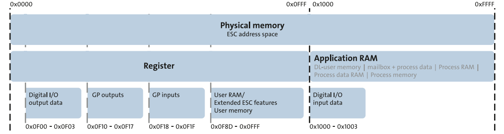

寄存器用于配置 ESC 功能，包括端口行为、FMMU、同步管理器和分布式时钟。寄存器还提供了 EtherCAT 主机和从机应用之间的状态与控制接口，并提供物理层和数据链路层诊断信息。

应用 RAM 的大小取决于具体的 ESC 设备。典型的最小应用 RAM 大小为 1 kB。当向应用 RAM 写入数据时，数据会直接写入实际内存，与 FCS 的有效性无关。

#### FMMU

FMMU (现场总线内存管理单元) 在逻辑命令和物理内存之间按位映射连续地址空间的数据，在从机启动时进行配置。

FMMU 单元需要配置(主机)数据逻辑位起始地址，从机物理内存起始地址，位长度，表示映射方向的类型位。**从机设备内的所有数据可以按位映射到主机逻辑地址**。

带有逻辑命令的数据报承载着 EtherCAT 网段的部分甚至全部过程映像。EtherCAT 帧包含三个逻辑命令，每个命令映射其中一个主机应用程序的过程映像。逻辑命令在其头部描述它们所携带的过程映像部分。逻辑命令标识符触发 FMMU。FMMU 检查其配置的读/写方向是否与逻辑命令类型的方向匹配。如果匹配，则检查其配置的逻辑内存区域是否在数据报所携带的内存地址范围内。如果是这种情况，它将根据其配置的映射方向，将数据从数据报映射到物理内存，反之亦然。

通过 FMMU 将数据映射到任意逻辑地址或从任意逻辑地址映射数据，一旦帧返回，主机就会接收到一个排序后的过程映像。

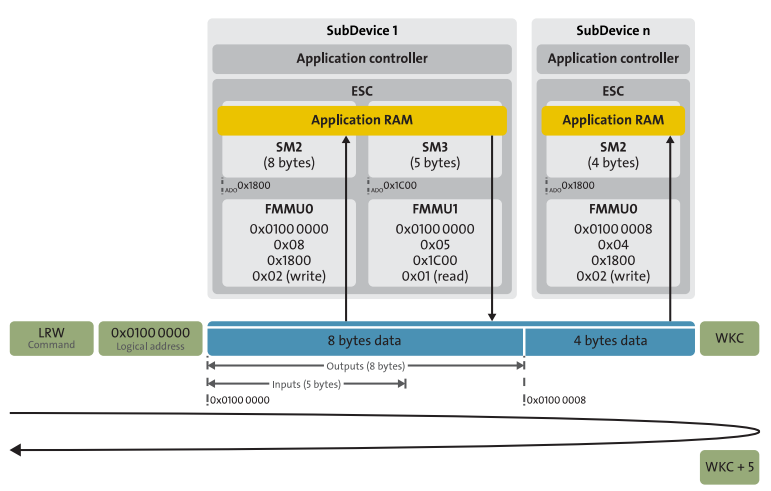

> LRW 命令的有效载荷为 12 字节，其逻辑起始地址为 0x0100 0000。配置了一个用于读取方向的 FMMU 和一个用于写入方向的 FMMU。对于从机 1，FMMU0 将逻辑内存地址 0x0100 0000 开始的 8 字节映射到物理内存地址 0x1800 开始的写入方向，FMMU1 配置为将物理内存地址 0x1C00 开始的 5 字节映射到逻辑地址 0x0100 0008。

#### 存储同步管理 SM

SM 用于阻止主机和从机 MCU 同时访问 ESC 存储区，确保数据的一致性，以及通知 MCU 数据到达等功能。

SM 中可以配置它所管理的物理地址，可以配合 FMMU 共同指向某片物理空间，使这片空间既可以被逻辑寻址所访问，也同时受到 SM 的管理：

当 SM 配合 FMMU 共同指向一片物理空间时，用于传输周期性过程数据的，也就是 PDO 数据，此时 SM 中的运行模式配置为 3 个缓存区以保证数据的一致性。从机 MCU 通过分别使用 SM2 和 SM3 两个通道来接收和发送主机的数据所指向的物理空间，由于有FMMU映射，可以使用逻辑寻址进行访问。
	当 SM 不配合 FMMU 共同指向一片物理空间时，用于传输非周期性数据的，也就是邮箱数据，此时 SM 中的运行模式配置为 1 个缓存区，而从机 MCU 通过分别使用 SM0 和 SM1 两个通道来接收和发送主机的数据以避免读写冲突。这一片物理空间由于没有 FMMU 管理，所以不能使用逻辑寻址访问，而是通过节点寻址进行访问的。

#### SII

子设备信息接口 SII 是 EtherCAT 子设备信息 ESI 的压缩版本，可从主机侧或应用控制器侧通过 ESC 在线访问。通常 SII 数据非易失性地存储在 EEPROM 设备上，该设备通过串行接口 IIC 连接到 ESC。对 SII 的访问通过 ESC 寄存器 (0x0500 - 0x050F) 提供的命令接口实现。

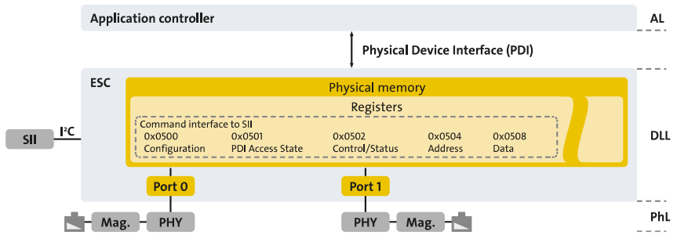

SII 提供了将所有子设备设置为运行状态所需的所有信息。为了保持 SII 的简洁性，它并未描述子设备可能支持的所有功能和操作模式。任何 EtherCAT 子设备都应具有标准配置，包括默认操作模式和相应的默认过程数据配置，以便能够设置为运行状态并提供实际功能。

SII 包含 ESC 的配置信息，特别是 ESC 的物理设备接口。SII 包含 EtherCAT 从设备的身份信息，以及主机或配置工具在 EtherCAT 网段中识别 EtherCAT 从机所需的其他信息。SII 还包含操作 EtherCAT 从机所需的信息，在默认模式下无需 ESI 文件。

在 EtherCAT 主机启动期间，会读取连接的 EtherCAT 网段中每个从机的身份信息，将物理可用的网络拓扑与其预期的拓扑进行比较，从而确定任何拓扑差异。

配置工具和主机可以将已配置的站别名存储至 SII 的 0x0004 字地址，并从中读取，以实现显式设备识别。

应用控制器可在固件更新期间访问 SII。固件及相关 SII 数据均通过 FoE 在引导状态下下载。应用控制器将固件烧录并更新 SII。这确保了固件与 SII 数据的一致性。

SII 结构如下：

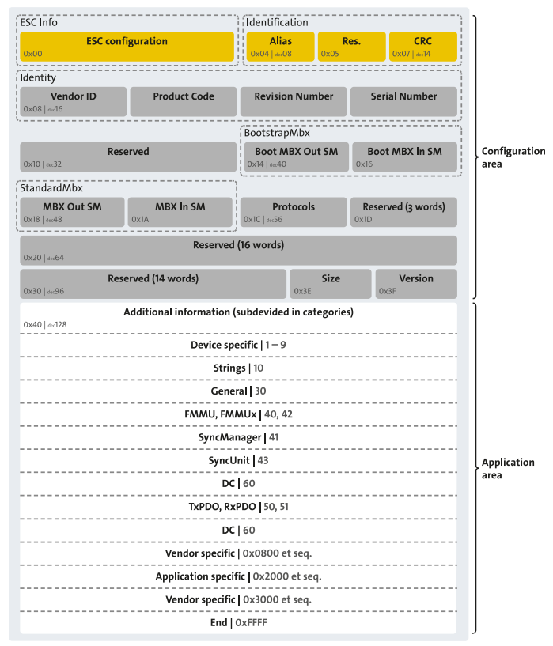

#### 分布式时钟 DC

分布式时钟的概念是一种在主机和从机之间建立并维护一个共同时间基准的方法。该时间基准用于同步应用程序，而管理 EtherCAT 通信则不需要。这个共同的时间基准可用于为从设备上的本地事件打上时间戳，在从机上生成本地硬件事件，同步发生在不同从设备上的事件 (时间戳和/或生成一种独立于通信周期的中断事件)，以及同步主机上的应用程序与一个或多个从机上的应用程序。对于同步要求较低或无同步要求的系统，可通过共享 DL 服务或使用同一以太网帧访问缓冲区来实现同步。分布式时钟机制适用于任何网络拓扑结构。在同一网段中，部分从设备可能参与分布式时钟同步，而其他从设备可能不参与。

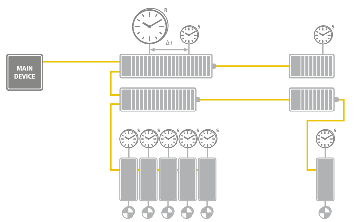

分布式时钟机制能够实现远低于 1μs 的同步精度。

分布式时钟单元主要用于分布式时钟控制和 SYNC/LATCH 单元控制。SYNC/LATCH 单元基于本地时间或系统时间运行，用于生成外部触发事件 (输出信号)，称为 SYNC0 和 SYNC1 事件，并在接收到输入信号 (LATCH0/LATCH1) 的上升沿或下降沿时锁存时间值。

- 基本概念

  - 系统时间：系统时间是分布式时钟使用的系统计时。

  - 参考时钟和从时钟：EtherCAT 协议规定主机连接的第一个具有分布时钟功能的从机作为参考时钟，其他从机的时钟称为从时钟。参考时钟被用于同步其他从机设备的从时钟和主机时钟。参考时钟提供 EtherCAT 系统时间。

  - 主机时钟：EtherCAT 主机也具有计时功能，称为主机时钟。主机时钟可以在分布时钟系统中作为从时钟被同步。在初始化阶段，主机可以按照系统时间的格式发送主机时间给参考时钟从机，使分布时钟使用系统时间计时。

  - 本地时钟，初始偏移量和时钟漂移：每一个 DC 从机都有本地时钟，本地时钟独立运行，使用本地时钟信号计时。系统启动时，各从机的本地时钟和参考时钟之间有一定的差值，称为时钟初始偏移量。在运行过程中，由于参考时钟和 DC 从机时钟使用各自的时钟源等原因，它们的计时周期存在一定的漂移，这将导致时钟运行不同步，本地时钟产生漂移。因此，必须对时钟初始偏移和时钟漂移都进行补偿。

  - 本地系统时间：每个 DC 从机的本地时钟经过补偿和同步之后都产生一个本地系统时间，分布时钟同步机制就是使各个从机的本地系统时间保持一致。参考时钟也是相应从机的本地系统时钟。

  - 传输延时：数据帧在从机之间传输时会产生一定的延迟，其中包括设备内部和物理连接延迟。所以在同步从时钟时，应该考虑参考时钟与各个从时钟之间的传输延时。

  | 符号                       | 描述                                                     |
  | -------------------------- | -------------------------------------------------------- |
  | $t_{\text{sys\_ref}}$      | 参考时钟时间，作为系统时间                               |
  | $t_{\text{local}}(n)$      | 各从机本地时钟的时间，独立运行                           |
  | $t_{\text{sys\_local}}(n)$ | 各从机本地系统时间，同步后应该等于 $t_{\text{sys\_ref}}$ |
  | $T_{\text{offset}}(n)$     | 从时钟和参考时钟之间的初始偏移量                         |
  | $T_{\text{delay}}(n)$      | 参考时钟到各从时钟之间的传输延时                         |

- 传输延时和时钟初始偏移量的测量

  分布时钟初始化时，首先测量参考时钟到所有其他从时钟之间的传输延时，将其写入各从机；并计算得到从时钟与参考时钟之间的偏移量，将其写入从时钟站。

  1. 主机发送一个广播写命令数据帧，数据帧到达每个从机后每个从机设备分别保存每个端口接收到以太网帧前导符的第一位的时刻。数据帧到达参考时钟从机时的 $t_{\text{sys\_ref}}$ 为 $T_1$ 时刻，到达从机 $n$ 时从时钟本地时钟 $t_{\text{local}}(n)$ 的时刻为 $T_2(n)$ ，可以建立以下关系：
     $$
     T_2(n) - T_1 = T_{\text{offset}}(n) + T_{\text{delay}}(n)
     $$

  2. 数据帧经过所有的从机后返回时，到达从机 $n$ 时本地时钟 $t_{\text{local}}(n)$ 的时刻为 $T_3(n)$ ，到达参考时钟从机 $t_{\text{sys\_ref}}$ 的时刻为 $T_4$；

  3. 假设线缆延时均匀，并且所有从机设备的处理和转发延时都一样，从机 $n$ 到参考时钟的传输延时可以由下式计算：
     $$
     T_{\text{delay}}(n) = [(T_4 - T_1) - (T_3(n) - T_2(n))]/2 = [(T_4 - T_1) - (T_3(n) - T_2(n))]/2
     $$
     主机读取从机保存的时间值，计算各个从机的传输延时 $T_{\text{delay}}(n)$，并写入到各个从机中；为了得到准确的传输延时，主机可以多次测量，然后求平均值；在初始化后的运行中也可以随时测量传输延时，以补偿环境变化对传输延时的影响。

  4. 主机计算出初始偏移量 $T_{\text{offset}}(n)$，并写入各个从机。初始偏移量只用于对从时钟的粗略同步且只需要测量一次。

- 时钟同步

  每个设备的本地时钟是自由运行的，会与参考时钟产生漂移。为了使所有设备都以相同的绝对系统时间运行，主机计算参考时钟与每个从机设备时钟之间的偏移量 $T_{\text{offset}}(n)$，并写入从机，以便计算从时钟的本地系统时间。利用 $T_{\text{offset}}(n)$ 可以在不改变自由运行的本地时钟的情况下实现时钟同步。每个 DC 从机使用自己的本地时间 $t_{\text{local}}(n)$ 和本地偏移量 $T_{\text{offset}}(n)$ 下式计算本地系统时间副本。这个时间用来产生同步信号和锁存信号时间标记，供从机微处理器使用。
  $$
  t_{\text{sys\_local}}(n) = t_{\text{local}}(n) - T_{\text{offset}}(n)
  $$
  在测得传输延时和时钟初始偏移量之后，主机开始同步各从机的时钟。主机使用 ARMW 或 FRMW 命令发送数据报文，从参考时钟从机读取它的当前系统时间 $t_{\text{sys\_ref}}$ 并写入从时钟的从机设备中。每个从时钟从机的时间控制环在数据帧的 SOF 到达时锁存本地时钟时刻 $t_{\text{local}}(n)$ ，根据下式计算得到本地系统时间 $t_{\text{sys\_local}}(n)$ 。根据接收到的参考时钟系统时间 $t_{\text{sys\_ref}}$ ，并利用本地保存的传输延时 $T_{\text {delay}}(n)$ ，计算得到本地时钟漂移补偿量 $\Delta t$。
  $$
  \Delta t = t_{\text{sys\_local}}(n) - T_{\text{delay}}(n) - t_{\text{sys\_ref}} = t_{\text{local}}(n) - T_{\text{offset}}(n) - T_{\text{delay}}(n) - t_{\text{sys\_ref}} 
  $$
  如果 $\Delta t$ 是正数，表示本地时钟运行比参考时钟快，必须减慢运行。如果 $\Delta t$ 是负数，表示本地时钟运行比参考时钟慢，必须加快运行。时间控制环路调整本地时钟的运行速度。正常情况下，ESC 控制本地时间每 10 ns 增加 10 个单位。当 $\Delta t > 0$ 时，则每 10 ns 增加 9，当 $\Delta t < 0$ 时，则增加 11，以实现时钟漂移补偿。

  为了快速补偿时钟的初始偏差，主机应该在测量传输延时和偏移补偿之后在独立的数据帧中连续发送很多 ARMW/FRMW 命令，使从机时钟同步，完成分布式时钟初始化。随后，在周期性运行阶段，可以随着过程数据周期性地发送 ARMW/FRMW 命令读取参考时钟系统时间，写入到其他 DC 从机，实时补偿动态时钟漂移。发送时钟同步数据帧的周期时间必须保证从时钟的漂移小于控制应用所规定的限制。

- SYNC 信号

  当分布式时钟时间达到一个特定或多个周期性时间值时，SYNC 信号被设置。SYNC 信号支持循环生成/单次触发/循环确认/单次触发确认模式。

  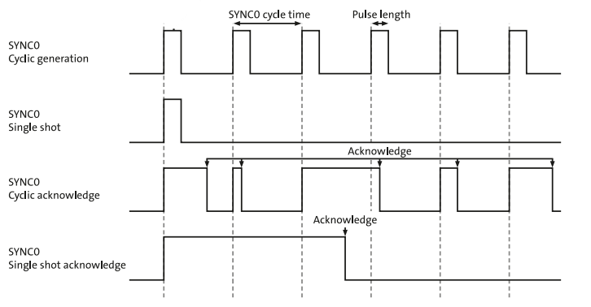

  SYNC1 可以相对于 SYNC0 以预定义的时间偏移和整数倍周期生成。

- LATCH 信号

  锁存信号触发 ESC 将系统时间存储到专用寄存器中，随后主机可通过非周期性命令读取这些寄存器，或将其映射到输入过程数据中。LATCH 信号可以在单次事件模式和连续模式下运行。

  1. 单次事件模式：DC 单元仅存储首个上升沿和首个下降沿的时间戳。每次事件通过读取锁存时间寄存器 0x09B0 - 0x09CF 来确认。读取这些寄存器后，DC 单元即可检测下一个事件。
  2. 连续模式：DC 单元存储每个边沿的时间戳。一旦检测到新事件，锁存时间寄存器 0x09B0 - 0x09CF 即被覆盖，因此这些寄存器始终包含最新事件的时间戳。

#### EtherCAT 状态机

EtherCAT 状态机 ESM 定义了主机与从机在启动和运行期间交互的协调、可预测行为。ESM 定义了五种状态：初始化 INIT/预运行 PREOP/安全运行 SAFEOP/运行 OP/引导 BOOT。

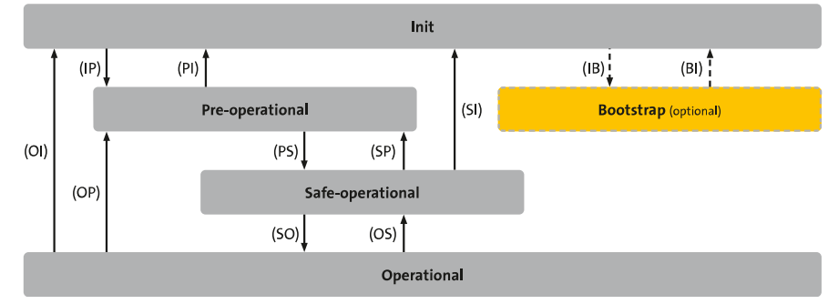

- 初始化

  主机可以读取和写入 ESC 寄存器，包括用于端口数量和状态的寄存器，以及访问 SII 信息，特别是从设备身份信息。应用层上没有通信。

- 转换到预运行状态

  主机配置 DL 地址寄存器，包括在寄存器 0x0010:0x0011 中分配固定物理地址。为了在 ESM 早期阶段提供邮箱通信手段，主机会配置邮箱同步管理器通道。当从机使用分布式时钟时，主机配置从设备 ESC 寄存器，使其系统时间同步至分布式时钟参考时钟。

  随后，主机通过设置 AL 控制寄存器请求进入预运行状态，并通过检查 AL 状态寄存器等待从机的确认。

- 预运行状态

  预运行状态下可进行邮箱通信，用于配置通信及特定应用参数 (包括过程数据配置参数)。预运行状态下不进行过程数据通信。

- 切换至安全运行状态

  主机发送启动命令。如果从机具有可配置的过程数据，则会下载过程数据配置。同时，应用参数（如滤波器或增益系数）将被下载到主机，过程数据同步管理器通道被配置，FMMU 被配置，主机开始发送过程数据的循环帧。

  当从机使用分布式时钟时，需完成分布式时钟周期时间、启动时间、激活和锁存配置的设置。

  随后主机请求进入安全操作状态，并等待从机的确认。

- 安全运行状态

  用于 AL 通信的邮箱通信已就绪。同时，过程数据通信启动，从机循环提供新的输入值，由主机进行评估，而物理输出保持在默认状态。这通常意味着电机不得转动，或模拟输出仍保持 0V。

  主机发送的值是未定义的。

- 切换至运行状态

  当从机使用分布式时钟时，从机应用程序利用切换至运行状态的过渡来检查分布式时钟设置，并将其锁相环与主机应用程序锁定。这包括在多个周期内监控输出过程数据是否在本地分布式时钟同步事件发生前不久被接收。

  随后，主机请求运行状态并等待从机的确认。

- 运行状态

  输入和输出有效，如果使用分布式时钟，则与分布式时钟同步，并且可以进行邮箱通信。

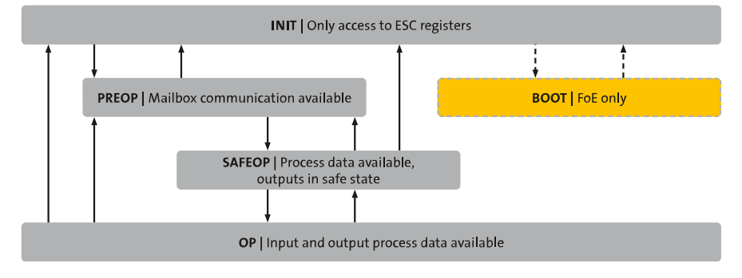

#### 通信模式

在实际自动化控制系统中，应用程序之间通常有两种数据交换形式：时间关键和非时间关键。

时间关键表示特定的动作必须在确定的时间窗口内完成。如果不能在要求的时间窗口内完成通信，则有可能引起控制失效。时间关键的数据通常周期性发送，称为周期性过程数据通信。非时间关键数据可以非周期性发送，在 EtherCAT 中采用非周期性邮箱数据通信。

---

周期性过程数据通信通常用 FMMU 进行逻辑寻址。

- 从机设备同步运行模式

  1. 自由运行

     在自由运行模式下，本地控制周期由一个本地定时器中断产生。周期时间可以由主机设定。

     $T_1$ 为本地微处理器从 ESC 复制数据并计算输出数据的时间；$T_2$  为输出硬件延时；$T_3$ 为输入锁存偏移时间。

     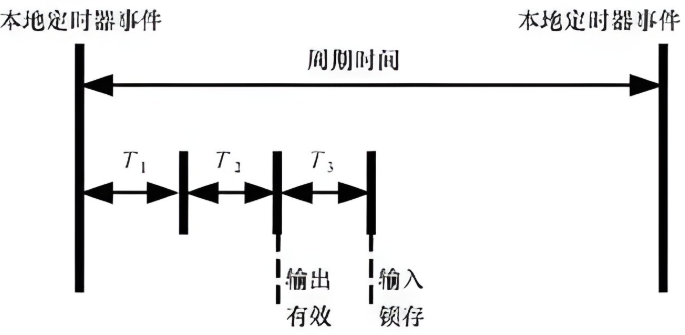

  2. 同步于数据输入/输出

     本地周期在发生数据输入或输出事件的时候触发。主机可以将过程数据帧的发送周期写给从机，从机可以检查是否支持这个周期时间或对周期时间进行本地优化。从机可以选择支持这个功能。通常同步于数据输出事件，如果从机只有输入数据，则同步于数据输入事件。

     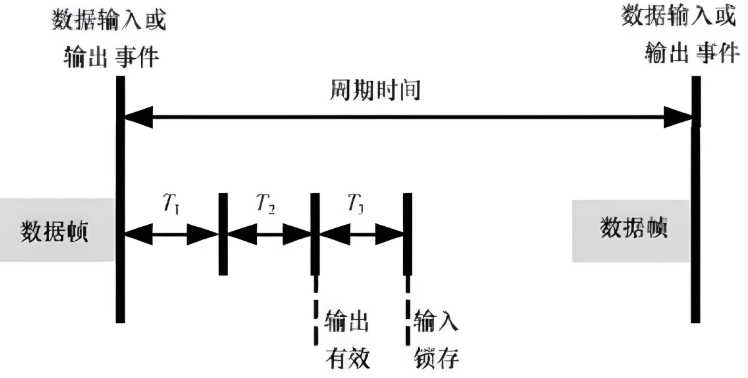

  3. 同步于分布式时钟同步事件

     本地周期由 SYNC 事件触发。主机必须在 SYNC 事件之前完成数据帧的发送。此时要求主机时钟也要同步于参考时钟。

     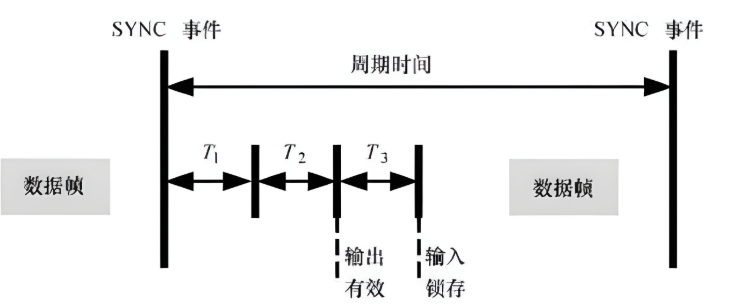

     为了进一步优化从机同步性能，从机应该在数据收发事件发生时从接收到的过程数据帧复制输出数据，然后等待 SYNC 信号到达后继续本地操作。数据帧必须比 SYNC 信号提前 $T_1$ 时间到达，从机在 SYNC 事件之前已经完成数据交换和控制计算，接收 SYNC 信号后可以马上执行输出操作，从而进一步提高同步性能。

     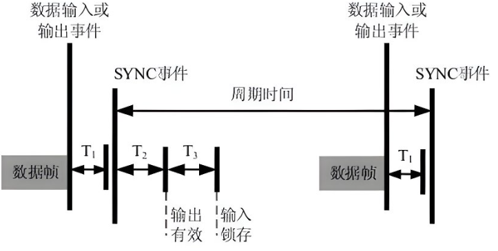

- 主机设备同步运行模式

  1. 周期性模式：在周期性模式下，主机周期性地发送过程数据帧。主机周期通常由一个本地定时器控制。从机可以运行在自由运行模式或同步于接收数据事件模式。对于运行在同步模式的从机，主机应该检查相应的过程数据帧的周期时间，保证大于从机支持的最小周期时间。主机可以以不同的周期时间发送多种周期性的过程数据帧，以便获得最优化的带宽。例如，以较小的周期发送运动控制数据，以较大的周期发送 I/O 数据。

  2. DC 模式：在 DC 模式下，主机运行与周期性模式类似，只是主机本地周期应该和参考时钟同步。主机本地定时器应该根据发布参考时钟的 ARMW 报文进行调整。在运行过程中，用于动态补偿时钟漂移的 ARMW 报文返回主机后，主机时钟可以根据读回的参考时钟时间进行调整，使之大致同步于参考时钟时间。

     DC 模式下，所有支持 DC 的从机都应该同步于 DC 系统时间。主机也应该使其通信周期同步于 DC 参考时钟时间。

     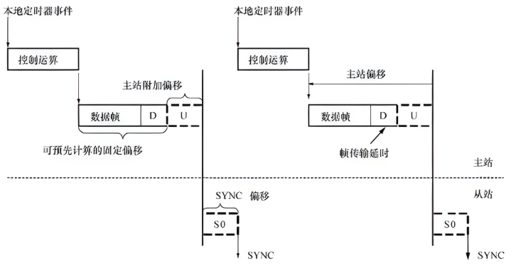

     主机本地运行由一个本地定时器启动。本地定时器应该比DC参考时钟定时存在一个提前量，提前量为以下时间之和：

     - 控制程序执行时间； 
     - 数据帧传输时间； 
     - 数据帧传输延时； 
     - 附加偏移。

---

EtherCAT 协议中非周期性数据通信称为邮箱数据通信，它可以双向进行 —— 主机到从机和从机到主机。它支持全双工、两个方向独立通信和多用户协议。从机到从机的通信由主机作为路由器来管理。邮箱通信数据头中包括一个地址域，使主机可以重寄邮箱数据。邮箱数据通信是实现参数交换的标准方式，如果需要配置周期性过程数据通信或需要其他非周期性服务时需要使用邮箱数据通信。通常邮箱通信只对应一个从机，所以报文中使用节点寻址模式。

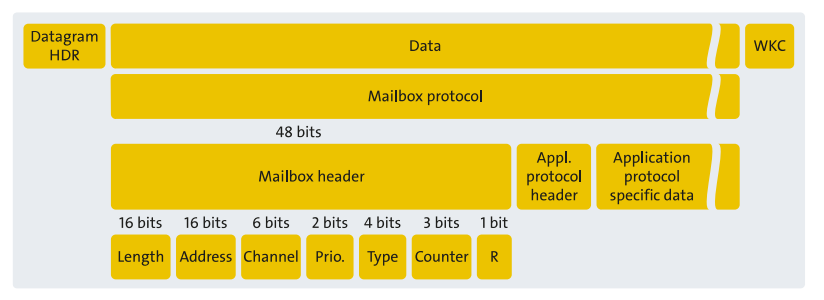

| 字段     | 说明                                                         |
| -------- | ------------------------------------------------------------ |
| Length   | 后续数据的长度（字节）                                       |
| Address  | 不用于主机与从机之间的邮箱通信，而用于从机与从机之间的邮箱通信；源从机的固定地址（从机 - 主机）；目标从机的固定地址（主机 - 从机） |
| Channel  | 保留供将来使用                                               |
| Priority | 保留供将来使用                                               |
| Type     | 邮箱类型，后续数据的应用协议标识符 0 - 邮箱错误 1 - AoE（ADS over EtherCAT） 2 - EoE（Ethernet over EtherCAT） 3 - CoE（CAN application protocol over EtherCAT） 4 - FoE（File Access over EtherCAT） 5 - SoE（Servo Drive over EtherCAT） 15 - VoE（Vendor specific profile over EtherCAT） |
| Cnt      | 邮箱服务计数器，每个新邮箱服务从 1-7 循环，主机使用它来请求重复邮箱服务，从机使用它来识别服务 |

1. 主机到从机通信 - 写邮箱命令

主机发送写数据区命令将发送邮箱数据给从机。主机需要检查从机邮箱命令应答报文中工作计数器 WKC。如果工作计数器为 1，表示写命令成功。反之，如果工作计数器没有增加，通常因为从机没有读完上一个命令，或在限定的时间内没有响应，主机必须重发写邮箱数据命令。

2. 从机到主机通信 - 读邮箱命令

从机有数据要发送给主机，必须先将数据写入输入邮箱缓存区，然后由主机来读取。主机发现从机 ESC 输入邮箱数据区有数据等待发送时，会尽快发送适当的读命令来读取从机数据。主机有两种方法来测定从机是否已经将邮箱数据填入输入数据区。一种是使用 FMMU 周期性地读某一个标志位。使用逻辑寻址可以同时读取多个从机的标志位，但其缺点是每个从机都需要一个 FMMU 单元。另一个方法是简单地轮询 ESC 输入邮箱的数据区。读命令的工作计数器增加 1 表示从机已经将新数据填入了输入数据区。

邮箱通信出错时，应答数据定义如下：

| 代码 | 名称                        | 含义                                       |
| ---- | --------------------------- | ------------------------------------------ |
| 0x01 | MBXERR\_SYNTAX              | 邮箱头部语法错误                           |
| 0x02 | MBXERR\_UNSUPPORTEDPROTOCOL | 不支持的邮箱协议类型                       |
| 0x03 | MBXERR\_INVALIDCHANNEL      | 通道字段包含错误值（从机可以忽略通道字段） |
| 0x04 | MBXERR\_SERVICENOTSUPPORTED | 邮箱协议中不支持该服务                     |
| 0x05 | MBXERR\_INVALIDHEADER       | 邮箱协议头部错误（不含邮箱头部）           |
| 0x06 | MBXERR\_SIZETOOSHORT        | 接收到的邮箱数据长度过短                   |
| 0x07 | MBXERR\_NOMOREMEMORY        | 由于资源有限，无法处理邮箱协议             |
| 0x08 | MBXERR\_INVALIDSIZE         | 数据长度不一致                             |

### EtherCAT 应用层

应用层是 EtherCAT 协议最高的一个功能层，是直接面向控制任务的一层，它为控制程序访问网络环境提供手段，同时为控制程序提供服务。

应用层不包括控制程序，它只是定义了控制程序与网络交互的接口，使符合此应用层协议的各种应用程序可以协同工作。

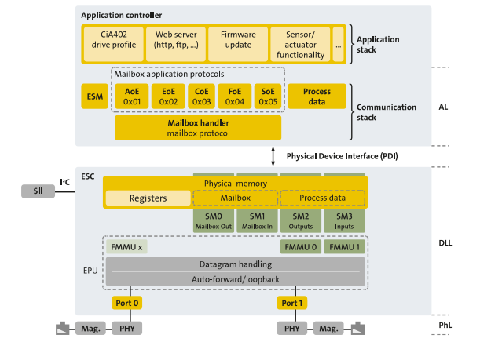

EtherCAT 应用层主要有以下协议：

- 基于 EtherCAT 的 CAN 应用协议 - CoE；
- 符合 IEC 61800-7-204 标准的伺服驱动设备行规 - SoE；
- Ethernet over EtherCAT - EoE；
- File access over EtherCAT - FoE；
- ADS over EtherCAT - AoE；

1. CoE 协议

   EtherCAT 可提供与 CANopen 标准 EN 50325-4 相同的通信机制：包括对 象字典、过程数据对象映像 (PDO) 以及服务数据对象 (SDO)，甚至相似的网络管理。因此，在已经实施了 CANopen 的设备中，仅需稍加变动即可轻松实现 EtherCAT，而且绝大部分的 CANopen 固件甚至都能得以重复利用。可以突破 8 字节的 PDO 限制，并可使用 EtherCAT 增强的带宽资源实现整个对象字典的上传。

2. EoE 协议

   EoE 仍然使用以太网物理层和以太网数据帧。以太网也通常与基于 TCP/IP 协议的 IT 应用数据传输联系在一起。使用 EoE 协议，可以在 EtherCAT 网段实现以太网数据的传输。以太网设备通过交换机端口与 EtherCAT 网段连接。以太网数据帧通 EtherCAT 协议进行传输，EtherCAT 网络对以太网设备完全透明。带有交换机端口的设备负责将 TCP/IP 数据片段插入到 EtherCAT 数据流中，避免了对网络实时性的影响。

   EtherCAT 设备也可以支持以太网协议，因此在 EtherCAT 网段外，这些 EtherCAT 设备看上去就像一个标准的以太网节点。主机设备如同一个链路层交换机，根据各个节点的 MAC 地址通过 EoE 发送数据帧给对应的节点。诸如集成 web 服务器、电子邮件、FTP 传输等所有的互联网技术都可以在 EtherCAT  环境中得以应用。

3. SoE 协议

   SERCOS 被认为是一种实时通信接口，尤其适用于运动控制。用于伺服驱动的 SERCOS 行规属于国际标准 IEC 61800-7 的范畴。标准还包含了该行规对应于 EtherCAT 行规的映射。包含访问驱动内部参数和功能的服务通道被映射到 EtherCAT 邮箱。

4. FoE 协议

   FoE 协议与 TFTP 协议类似，可通过网络访问设备中的文件以及将统一的固件跨网络上传到设备。FoE 协议有意识地用一种精简模式定义，因此可由 BootLoader 程序支持，而无需 TCP/IP 协议堆栈。

5. AoE 协议

   作为基于邮箱的客户端-服务器协议，AoE 由 EtherCAT 规范定义。诸如基于 EtherCAT 的 CAN 应用协议 CoE 提供了详细的语义概念，而 AoE 则通过路由和并行服务完美地补充了无论何种用例所需的这些功能。与因特网协议 (IP) 提供的类似服务相比，AoE 的开销要小得多。发送方和接收方寻址参数始终包含在 AoE 报文中，因此，对服务器和客户端的实施可以非常精简。AoE 可以选择通过 EtherCAT 自动化协议进行非周期性数据通信。因此，可以通过网关连接 实现 MES 系统、EtherCAT 主机和从机现场总线设备之间的无缝通信。AoE 服务作为一种标准意味着它能够从远程诊断工具获取 EtherCAT 网络诊断信息。

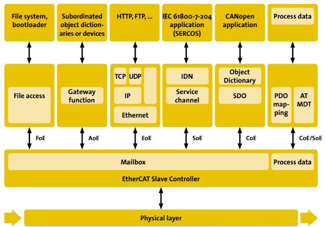

#### CoE 协议

EtherCAT 协议在应用层支持 CANopen 协议，并作了相应的扩充，其主要功能有：

- 使用邮箱通信访问 CANopen 对象字典及其对象，实现网络初始化； 
- 使用 CANopen 应急对象和可选的事件驱动 PDO 消息，实现网络管理； 
- 使用对象字典映射过程数据，周期性传输指令数据和状态数据。

##### CoE 对象字典

| 索引号范围    | 含义                                                         |
| :------------ | :----------------------------------------------------------- |
| 0x0000-0x0FFF | 数据类型描述                                                 |
| 0x1000-0x1FFF | 通信对象，包括： 1. 设备类型、标识符、PDO 映射，与 CANopen 兼容 2. CANopen 专用数据对象，在 EtherCAT 中保留 3. EtherCAT 扩展数据对象 |
| 0x2000-0x5FFF | 制造商定义对象                                               |
| 0x6000-0x9FFF | 行规定义数据对象                                             |
| 0xA000-0xFFFF | 保留                                                         |

CoE 通信数据对象：

| 索引号        | 含义                                                         |
| :------------ | :----------------------------------------------------------- |
| 0x1000        | 设备类型，32 位整数 位 0-15：所使用的设备行规 位 16-31：基于所使用行规的附加信息 |
| 0x1001        | 错误寄存器，8 位 位 0：常规错误 位 1：电流错误 位 2：电压错误 位 3：温度错误 位 4：通信错误 位 5：设备行规定义错误 位 6：保留 位 7：制造商定义错误 |
| 0x1008        | 制造商设备名称，字符串                                       |
| 0x1009        | 制造商硬件版本                                               |
| 0x100A        | 制造商软件版本                                               |
| 0x1018        | 设备标识符，结构体类型 子索引 0：参数体数目 子索引 1：制造商 ID 子索引 2：产品码 子索引 3：版本号 子索引 4：序列号 |
| 0x1600-0x17FF | RxPDO 映射，结构体类型 子索引 0：参数体数目 子索引 1：第一个映射的输出数据对象 子索引 n：最后一个映射的输出数据对象 |
| 0x1A00-0x1BFF | TxPDO 映射，结构体类型 子索引 0：参数体数目 子索引 1：第一个映射的输入数据对象 子索引 n：最后一个映射的输入数据对象 |
| 0x1C00        | 同步管理器通信类型，子索引 0 定义了所使用 SM 的数目，子索引 1-32 定义了相应 SM0-SM31 通道的通信类型。相关通信类型有： 0：邮箱输出，非周期性数据通信，1 个缓存区写操作 1：邮箱输入，非周期性数据通信，1 个缓存区读操作 2：过程数据输出，周期性数据通信，3 个缓存区写操作 3：过程数据输入，周期性数据通信，3 个缓存区读操作 |
| 0x1C10-0x1C2F | 过程数据通信同步管理器 PDO 分配 子索引 0：分配的 PDO 数目 子索引 1-n：PDO 映射对象索引号 |
| 0x1C30-0x1C4F | 同步管理器参数 子索引 1：同步类型 子索引 2：周期时间，单位为 ns 子索引 3：AL 事件和相关操作之间的偏移时间，单位为 ns |

对象条目属性：

| 属性                    | 描述                                                         |
| ----------------------- | ------------------------------------------------------------ |
| Default value           | 参数的默认值，或设备的出厂设置值，即从机上电且未被更改时的值。 |
| Minimum value           | 允许或支持的最小值。如果写入更小的值，可能会返回中止代码。   |
| Maximum value           | 允许或支持的最大值。如果写入更大的值，可能会返回中止代码。   |
| Default minimum maximum | 这些属性通常不用于过程数据对象。                             |
| Access rights           | 访问权限可以是只读（ro）、只写（wo）或读/写（rw）。 这些访问权限可以独立于特定的 ESM 状态描述和使用，甚至可以是 ESM 状态特定的。 |
| Bit length              | 对象条目的位长度。对于对象代码为 VAR 的对象，可通过读取子索引 0 的对象条目位长度来访问。 |
| Data type               | 数据类型。                                                   |
| Mappable in RxPDO       | 对象条目可以映射到输出过程数据。它可以是默认过程数据映射的一部分。建议将其映射到输出过程数据映射。 |
| Mappable in TxPDO       | 对象条目可以映射到输入过程数据。它可以是默认过程数据映射的一部分。建议将其映射到输入过程数据映射。 |
| Backup                  | 对象条目值以非易失性方式存储在从机上。                       |
| Setting                 | 对象条目是特定于应用的参数。用户可能希望更改此参数。如果更改为其默认值，可能会将其添加到CoE 启动命令中，以便在从机的任何启动期间下载（通常在 ESM 状态转换 PREOP-SAFEOP 期间）。 Setting 属性允许配置工具过滤 CoE OD，以便仅显示特定于应用的参数。 此属性允许在配置工具中方便地进行自定义。但是，它不需要在从机上进行扩展逻辑。从机需要存储带有对象条目和 SCO 条目描述响应结果的 Setting 属性。离线 OD 也标识这些对象。 |

##### CoE 周期性过程数据通信

周期性数据通信中，过程数据可以包含多个 PDO 映射数据对象。CoE 协议使用数据对象 0x1C10-0x1C2F 定义相应 SM 通道的 PDO 映射对象列表。

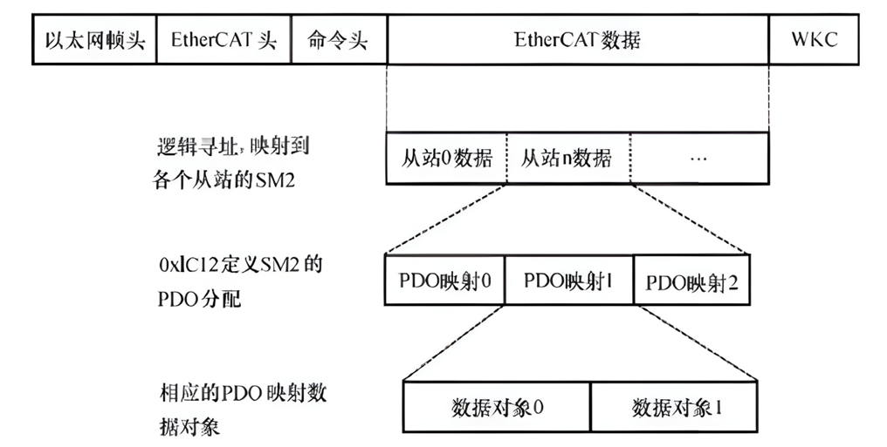

> 以周期性输出数据为例，输出数据使用 SM2 通道，由对象数据 0x1C12 定义 PDO 分配。

根据设备的复杂程度，PDO 过程数据映射有以下几种形式：

1. 简单的设备不需要映射协议。使用固定的过程数据；在从机 EEPROM 中读取，不需要 SDO 协议。
2. 可读取的 PDO 映射。固定过程数据映射；可以使用 SDO 通信读取。
3. 可选择的 PDO 映射。通过固定的 PDO 分配对象 0x1C1x 选择；通过 SDO 通信选择。
4. 可变的 PDO 映射。可通过 CoE 通信配置；PDO 内容可改变。

##### CoE 非周期性数据通信

EtherCAT 主机通过读写邮箱数据 SM 通道实现非周期性数据通信。CoE 协议邮箱数据结构如图：

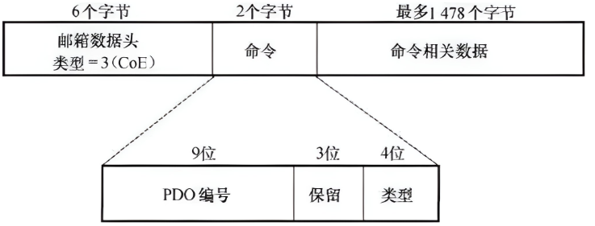

| 数据元素 | 描述                                                         |
| :------- | :----------------------------------------------------------- |
| PDO 编号 | PDO 发送时的 PDO 序号                                        |
| 类型     | CoE 服务类型： 0：保留 1：紧急事件信息 2：SDO 请求 3：SDO 响应 4：TxPDO 5：RxPDO 6：远程 TxPDO 发送请求 7：远程 RxPDO 发送请求 8：SDO 信息 9-15：保留 |

---

**SDO 服务：**

SDO 服务的数据帧格式如下：

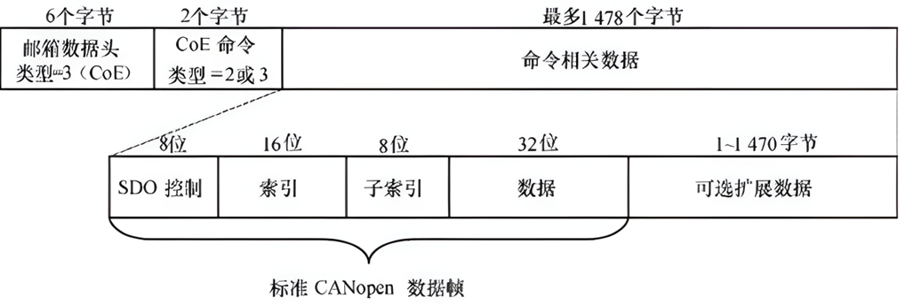

SDO 服务有 3 种类型：

1. 快速传输服务：与标准的 CANopen 协议相同，只使用 8 个字节，最多传输 4 个字节有效数据；
2. 常规传输服务：使用超过 8 个字节，可以传输超过 4 个字节的有效数据，最大可传输有效数据取决于邮箱 SM 所管理的存储区容量；
3. 分段传输服务：对于超过邮箱容量的情况，使用分段的方式进行传输。

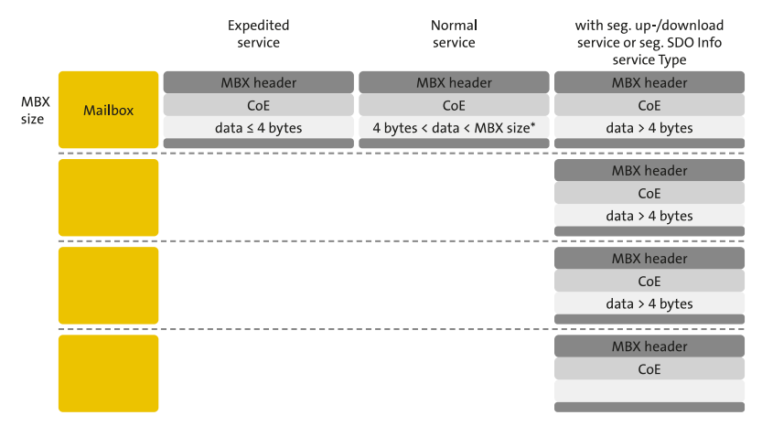

SDO 传输又分为下载和上传两种，下载传输常用于主机设置从机参数，上传传输用于主机读取从机的性能参数，这两种服务在物理上是对称的。

- SDO 下载传输请求

  如果要传输的数据小于 4 个字节，则使用快速 SDO 传输服务，它完全兼容 CANopen 协议，使用 8 个字节数据，其中 4 个字节为数据区，有效字节数为 4 减去 SDO 控制字节中的位 2 和 3 表示的数值。

  如果要传输的数据大于 4 个字节，则使用常规传输服务。在常规传输时，用快速传输时的 4 个数据字节表示要传输的数据的完整大小，用扩展数据部分传输有效数据，有效数据的最大容量为邮箱容量减去 16，实际大小为邮箱头中长度数据 n 减去 10。

  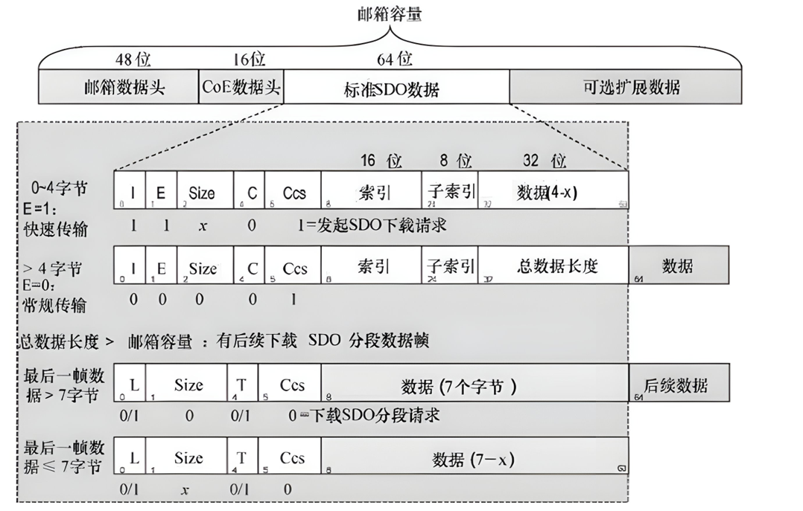

  | 数据区   | 字节数             | 位数     | 名称       | 取值和描述                                                   |
  | :------- | :----------------- | :------- | :--------- | :----------------------------------------------------------- |
  | 邮箱头   | 2 字节             | 16 位    | 长度 n     | n ≥ 0x0A：后续邮箱服务数据长度                               |
  |          | 2 字节             | 16 位    | 地址       | 主机到从机通信：为数据源从机地址 从机之间通信：为数据目的从机地址 |
  |          | 1 字节             | 位 0-5   | 通道       | 0x00：保留                                                   |
  |          |                    | 位 6-7   | 优先级     | 0x00：最低优先级 0x03：最高优先级                         |
  |          | 1 字节             | 位 0-3   | 类型       | 0x03：CoE                                                    |
  |          |                    | 位 4-7   | 保留       | 0x00                                                         |
  | CoE 命令 | 2 字节             | 位 0-8   | PDO 编号   | 0x00                                                         |
  |          |                    | 位 9-11  | 保留       | 0x00                                                         |
  |          |                    | 位 12-15 | 服务类型   | 0x02：SDO 请求                                               |
  | SDO 数据 | 1 字节（控制字节） | 位 0     | 数目指示 I | 0x00：未设置传输字节数目 0x01：设置传输字节数目（不包括字节 2-3 表示的数值） |
  |          |                    | 位 1     | 传输类型 E | 0x01：快速传输 0x00：常规分段传输                         |
  |          |                    | 位 2-3   | 传输字节数 | 4-x：快速传输时的有效数据字节数，x 是位 2-3 表示的数值 0：常规分段传输时无效 |
  |          |                    | 位 4     | 完全操作   | 0x00：操作由索引号和子索引号检索的参数体 0x01：操作完整的数据对象，子索引应该为 0 或 1（不包括子索引 0） |
  |          |                    | 位 5-7   | CoE 命令码 | 0x01：下载请求 0x00：分段下载请求                         |
  |          | 2 字节             | 16 位    | 索引号     | 数据对象索引号                                               |
  |          | 1 字节             | 8 位     | 子索引号   | 操作参数体子索引号                                           |
  |          | 4 字节             | 32 位    | 数据       | 快速传输：数据 常规传输：传输数据对象的总字节数，如果本次传输的有效数据数目小于总数据长度，则后续有分段传输数据 |
  |          | n-10               |          | 扩展数据   | 常规传输的扩展数据，传输有效数据                             |

  如果传输数据对象的总数量大于本次传输的允许数据数量，必须使用后续的分段下载传输服务。
  
  | 数据区       | 字节数 | 位数     | 名称           | 取值和描述                                                   |
  | :----------- | :----- | :------- | :------------- | :----------------------------------------------------------- |
  | 邮箱头       | 2 字节 | 16 位    | 长度           | n ≥ 0x0A：后续邮箱服务数据长度                               |
  |              | 2 字节 | 16 位    | 地址           | 主机到从机通信：为数据源从机地址 从机之间通信：为数据目的从机地址 |
  |              | 1 字节 | 位 0-5   | 通道           | 0x00：保留                                                   |
  |              |        | 位 6-7   | 优先级         | 同表 5.5                                                     |
  |              | 1 字节 | 位 0-3   | 类型           | 0x03：CoE                                                    |
  |              |        | 位 4-7   | 保留           | 0x00                                                         |
  | CoE 命令     | 2 字节 | 位 0-8   | PDO 编号       | 0x00                                                         |
  |              |        | 位 9-11  | 保留           | 0x00                                                         |
  |              |        | 位 12-15 | 服务类型       | 0x02：SDO 请求                                               |
  | SDO 控制数据 | 1 字节 | 位 0     | 是否有后续分段 | 0x00：有后续传输分段 0x01：最后一个下载分段               |
  |              |        | 位 1-3   | 分段数据数目   | 7-x：最后 7 个字节中的有效数据数目，x 是位 1-3 表示的数值    |
  |              |        | 位 4     | 翻转握手位     | 每次在 SDO 下载分段请求时翻转，从 0x00 开始                  |
  |              |        | 位 5-7   | CoE 命令码 CCS | 0x01：下载请求 0x00：分段下载请求                         |
  |              | n-3    |          | 数据           | 分段传输数据                                                 |

- SDO 下载传输响应

  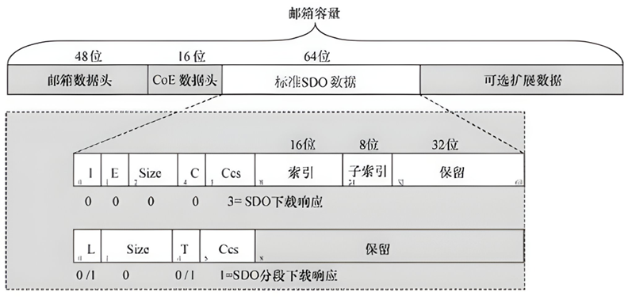

  从机收到 SDO 下载请求之后，执行相应处理，然后将响应数据写入输入邮箱 SM1 中，由主机读走。主机只有得到正确的响应之后才能执行下一步 SDO 操作。

  | 数据区                  | 字节数 | 位数     | 名称           | 取值和描述                                                   |
  | :---------------------- | :----- | :------- | :------------- | :----------------------------------------------------------- |
  | 邮箱头                  | 2 字节 | 16 位    | 长度           | n ≥ 0x0A：后续邮箱服务数据长度                               |
  |                         | 2 字节 | 16 位    | 地址           | 主机到从机通信：为数据源从机地址 从机之间通信：为数据目的从机地址 |
  |                         | 1 字节 | 位 0-5   | 通道           | 0x00：保留                                                   |
  |                         |        | 位 6-7   | 优先级         |                                                              |
  |                         | 1 字节 | 位 0-3   | 类型           | 0x03：CoE                                                    |
  |                         |        | 位 4-7   | 保留           | 0x00                                                         |
  | CoE 命令                | 2 字节 | 位 0-8   | PDO 编号       | 0x00                                                         |
  |                         |        | 位 9-11  | 保留           | 0x00                                                         |
  |                         |        | 位 12-15 | 服务类型       | 0x03：SDO 响应                                               |
  | 快速和正常传输 SDO 数据 | 1 字节 | 位 0     | 数目指示 I     | 0x00                                                         |
  |                         |        | 位 1     | 传输类型 E     | 0x00                                                         |
  |                         |        | 位 2-3   | 传输数目       | 0                                                            |
  |                         |        | 位 4     | 完全操作       |                                                              |
  |                         |        | 位 5-7   | CoE 命令码 CCS | 0x03：下载响应 0x01：分段下载响应                         |
  |                         | 2 字节 | 16 位    | 索引号         | 数据对象索引号                                               |
  |                         | 1 字节 | 8 位     | 子索引号       | 操作参数体子索引号                                           |
  |                         | 4 字节 | 32 位    | 保留           | 保留                                                         |
  | 分段下载响应 SDO 数据   | 1 字节 | 位 0-3   | 保留           | 0x00                                                         |
  |                         |        | 位 4     | 翻转位         | 与相应的分段下载请求相同                                     |
  |                         |        | 位 5-7   | CoE 命令码 CCS | 0x03：下载响应                                               |
  |                         | 7 字节 |          | 保留           | 保留                                                         |

- 终止 SDO 传输

  在 SDO 传输过程中，如果某一方发现有错误，可以发起 SDO 终止传输请求，对方收到此请求后，停止当前 SDO 传输。SDO 终止传输请求不需要应答。

  | 数据区   | 字节数 | 位数     | 名称           | 取值和描述                                                   |
  | :------- | :----- | :------- | :------------- | :----------------------------------------------------------- |
  | 邮箱头   | 2 字节 | 16 位    | 长度           | n = 0x0A：后续邮箱服务数据长度                               |
  |          | 2 字节 | 16 位    | 地址           | 主机到从机通信：为数据源从机地址 从机之间通信：为数据目的从机地址 |
  |          | 1 字节 | 位 0-5   | 通道           | 0x00：保留                                                   |
  |          |        | 位 6-7   | 优先级         |                                                              |
  |          | 1 字节 | 位 0-3   | 类型           | 0x03：CoE                                                    |
  |          |        | 位 4-7   | 保留           | 0x00                                                         |
  | CoE 命令 | 2 字节 | 位 0-8   | PDO 编号       | 0x00                                                         |
  |          |        | 位 9-11  | 保留           | 0x00                                                         |
  |          |        | 位 12-15 | 服务类型       | 0x02：SDO 请求                                               |
  | SDO 数据 | 1 字节 | 位 0     | 数目指示 I     | 0x00                                                         |
  |          |        | 位 1     | 传输类型 E     | 0x00：常规分段传输                                           |
  |          |        | 位 2-3   | 传输数目       | 0x00：常规分段传输，无效                                     |
  |          |        | 位 4     | 保留           |                                                              |
  |          |        | 位 5-7   | CoE 命令码 CCS | 0x04：终止传输请求                                           |
  |          | 2 字节 | 16 位    | 索引号         | 数据对象索引号                                               |
  |          | 1 字节 | 8 位     | 子索引号       | 操作参数体子索引号                                           |
  |          | 4 字节 | 32 位    | 终止代码       | 表示终止传输的原因                                           |

  | 序号 | 代码值        | 含义                                                   |
  | :--: | :------------ | :----------------------------------------------------- |
  |  1   | 0x05 03 00 00 | 分段传输时翻转位无变化                                 |
  |  2   | 0x05 04 00 00 | SDO 传输超时                                           |
  |  3   | 0x05 04 00 01 | 命令码无效或未知                                       |
  |  4   | 0x05 04 00 05 | 内存溢出                                               |
  |  5   | 0x06 01 00 00 | 不支持对某一对象的操作                                 |
  |  6   | 0x06 01 00 01 | 读一个只写数据对象                                     |
  |  7   | 0x06 03 00 02 | 写一个只读数据对象                                     |
  |  8   | 0x06 02 00 00 | 数据对象在数据字典中不存在                             |
  |  9   | 0x06 04 00 41 | 数据对象不能映射到 PDO 中                              |
  |  10  | 0x06 04 00 42 | 要映射的数据对象的数量和长度超过了 PDO 数据长度        |
  |  11  | 0x06 04 00 43 | 常规的参数不兼容                                       |
  |  12  | 0x06 04 00 47 | 设备中常规内部不兼容                                   |
  |  13  | 0x06 06 00 00 | 由于硬件错误导致操作失败                               |
  |  14  | 0x06 07 00 10 | 数据类型不匹配，服务参数长度不匹配                     |
  |  15  | 0x06 07 00 12 | 数据类型不匹配，服务参数长度过长                       |
  |  16  | 0x06 07 00 13 | 数据类型不匹配，服务参数长度过短                       |
  |  17  | 0x06 09 00 11 | 子索引不存在                                           |
  |  18  | 0x06 09 00 30 | 写操作时，写入数据值超出范围                           |
  |  19  | 0x06 09 00 31 | 写入数据值太大                                         |
  |  20  | 0x06 09 00 32 | 写入数据值太小                                         |
  |  21  | 0x06 09 00 36 | 最大值小于最小值                                       |
  |  22  | 0x08 00 00 00 | 普通错误                                               |
  |  23  | 0x08 00 00 20 | 数据不可以被传输或保存到应用程序                       |
  |  24  | 0x08 00 00 21 | 由于本地控制原因，数据不可以被传输或保存到应用程序     |
  |  25  | 0x08 00 00 22 | 由于当前设备状态原因，数据不可以被传输或保存到应用程序 |
  |  26  | 0x08 00 00 23 | 对象字典动态生成错误，或没有找到对象字典               |

- SDO 下载传输例子

  1. 快速下载

     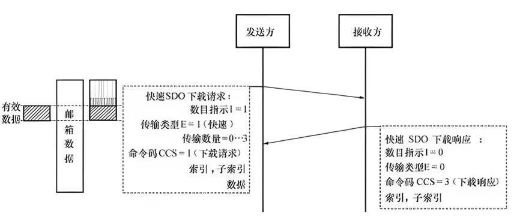

  2. 常规下载

     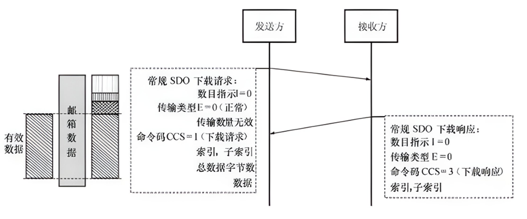

  3. 分段下载

     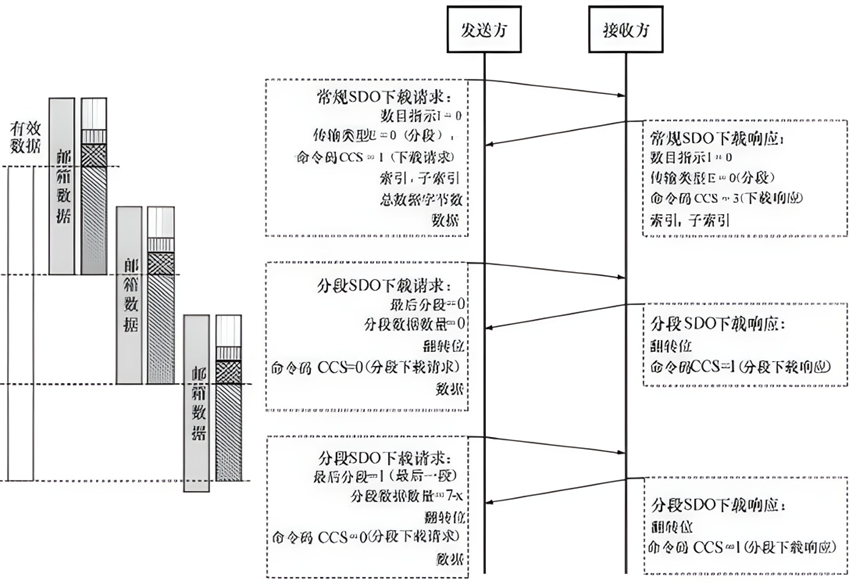

---

**紧急事件：**

紧急事件由设备内部的错误事件触发，将诊断信息发送给主机。当诊断事件消失之后，从机应该将诊断事件和错误复位码再发送一次。

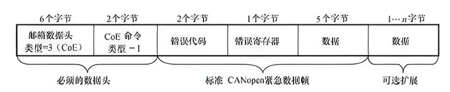

| 数据区   | 字节数 | 位数     | 名称       | 取值和描述                                                   |
| :------- | :----- | :------- | :--------- | :----------------------------------------------------------- |
| 邮箱头   | 2 字节 | 16 位    | 长度       | n = 0x0A：后续邮箱服务数据长度                               |
|          | 2 字节 | 16 位    | 地址       | 主机到从机通信：为数据源从机地址 从机之间通信：为数据目的从机地址 |
|          | 1 字节 | 位 0-5   | 通道       | 0x00：保留                                                   |
|          |        | 位 6-7   | 优先级     |                                                              |
|          | 1 字节 | 位 0-3   | 类型       | 0x03：CoE                                                    |
|          |        | 位 4-7   | 保留       | 0x00                                                         |
| CoE 命令 | 2 字节 | 位 0-8   | PDO 编号   | 0x00                                                         |
|          |        | 位 9-11  | 保留       | 0x00                                                         |
|          |        | 位 12-15 | 服务类型   | 0x01：紧急数据                                               |
| SDO 数据 | 2 字节 | 16 位    | 紧急错误码 |                                                              |
|          | 1 字节 | 8 位     | 错误寄存器 | 映射数据对象 0x1001                                          |
|          | 5 字节 | 40 位    | 数据       | 制造商定义错误信息                                           |

| 错误码（16 进制） | 含义                                                         |
| :---------------- | :----------------------------------------------------------- |
| 00xx              | 错误复位或无错误                                             |
| 10xx              | 常规错误                                                     |
| 20xx              | 电流错误： 21xx 设备输入端电流错误 22xx 设备内部电流错误 23xx 设备输出端电流错误 |
| 30xx              | 电压错误： 31xx 主电路电压错误 32xx 设备内部电压错误 33xx 输出电压错误 |
| 40xx              | 温度错误： 41xx 环境温度 42xx 设备温度                 |
| 50xx              | 设备硬件错误                                                 |
| 60xx              | 设备软件错误： 61xx 内部软件错误 62xx 用户软件错误 63xx 数据错误 |
| 70xx              | 附加模块错误                                                 |
| 80xx              | 监控： 81xx 通信错误 82xx 协议错误 8210 PDO 由于长度错误而未被处理 8220 PDO 超长 |
| 90xx              | 外部错误                                                     |
| A0xx              | EtherCAT 状态机错误                                          |
| F0xx              | 附加功能                                                     |
| FFxx              | 设备自定义                                                   |

#### EoE 协议

（略）

#### AoE 协议

（略）

#### FoE 协议

（略）

#### SoE 协议

（略）
