# EtherCAT 从站实现

> 本节介绍基于 SSC 工具，LAN9252 + STM32F407 的 EtherCAT 从站实现。

## 1. EtherCAT 从站硬件

### EtherCAT 从站芯片

EtherCAT 从站硬件架构如下：

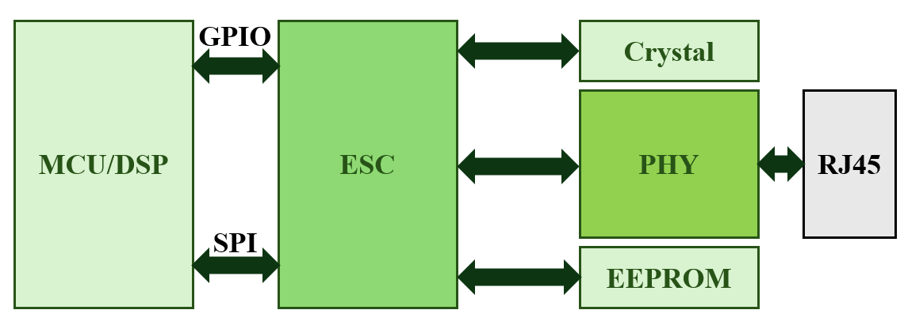

ESC 具有各类应用层寄存器供主站访问，但实际不执行具体的应用层操作，从站应用层的管理由专门的 MCU 进行。

ESC 根据倍福公司的 IP core 设计，常见的 ESC 芯片如下：

1. 纯 ESC 芯片 - MCU 外接

   | 型号         | 厂商      | 特点                                      | 适用场景                 |
   | ------------ | --------- | ----------------------------------------- | ------------------------ |
   | ET1100       | Beckhoff  | 业界标杆，3端口，8/16位并行总线或SPI      | 通用工业设备，伺服驱动器 |
   | ET1200       | Beckhoff  | ET1100 的低成本版，2端口                  | 简单 IO 模块，传感器     |
   | LAN9252      | Microchip | 集成双 PHY，2端口，SPI/并行接口，高性价比 | 分布式 IO，小型从站      |
   | LAN9253/9254 | Microchip | LAN9252 升级版，支持电缆诊断              | 高可靠性应用             |
   | AX58100      | ASIX      | 台湾厂商，集成 PHY，价格优势明显          | 成本敏感型设备           |

2. SoC 集成方案 - ESC + MCU

   | 型号         | 厂商          | 内核          | 特点                                                  |
   | ------------ | ------------- | ------------- | ----------------------------------------------------- |
   | R-IN32M3-EC  | Renesas       | ARM Cortex-M3 | 集成工业以太网交换机，双核架构（RX72N 也有 ESC 版本） |
   | XMC4800/4300 | Infineon      | ARM Cortex-M4 | 部分型号集成 ESC 外设，需配合专用 PHY 芯片            |
   | FSPM系列     | Fuji Electric | ARM Cortex-M3 | 日系厂商方案，适合电机控制                            |

3. FPGA 方案

   使用 Beckhoff IP Core 或者 EtherCAT IP Core。

## 2. EtherCAT 软件协议栈

从站帧的链路层功能都是由 ESC 完成的。从站软件运行在 MCU 中，主要执行的是应用层的操作。MCU 通过 PDI 接口读取 ESC 中的 PDO 和 SDO 数据，然后执行应用层的处理。MCU 需要一套协议栈执行相关的逻辑，称为软件协议栈。

商业协议栈主要有以下几种：

| 协议栈                          | 厂商              | 特点                                                         |
| ------------------------------- | ----------------- | ------------------------------------------------------------ |
| EtherCAT Slave Stack Code (SSC) | Beckhoff (ETG)    | 官方参考实现，功能最完整，需通过 ETG 获取授权，支持所有 EtherCAT 功能 |
| EC-Master / EC-Slave            | Acontis           | 德国公司，提供完整的主从站协议栈，支持多种操作系统           |
| EtherCAT Slave Stack            | Hilscher          | 德国工业通讯专家，提供NetX芯片配套的协议栈                   |
| KPA EtherCAT                    | KPA (俄罗斯/德国) | 提供主站和从站协议栈，兼容性好                               |
| tenAsys INtime EtherCAT         | Intel/tenAsys     | 针对实时 Windows 环境的方案                                  |

而开源协议栈如下：

| 协议栈 | 开发者  | 特点                                                         |
| ------ | ------- | ------------------------------------------------------------ |
| SOES   | RT-Labs | 最知名的开源从站栈，用 C 语言编写，代码简洁，支持多种 RTOS 和裸机环境，遵循 BSD 许可证 |

> - SSC 支持几乎所有应用层协议栈 (EoE，CoE，FoE) 等，同时还提供了对专有协议 CIA402 等的支持。SSC 还提供了专门的工具来配置协议栈和 PDO。SSC 是针对 BeckHoff 的 PIC 和 ET1100 芯片编写的，如果使用 STM32 或者其他通用处理器，需要手工移植代码。
> - SOES 支持 EoE 和 CoE 这两种较为常用的应用层协议，同时支持静态和动态的 PDO 映射。 SOES 的代码相较于 SSC 精简很多，代码可移植性较好。

### SSC 配置

1. 安装 SSC_V5.11 工具

   没有特殊要求，直接下载即可。

2. 新建工程并进行配置

   

   

   配置项如下：
   
   - SlaveInformation
   
     | 配置项                | 值                                                       | 说明                                                         |
     | --------------------- | -------------------------------------------------------- | ------------------------------------------------------------ |
     | VENDOR\_ID            | 0xE0000002                                               | 厂商 ID，ETG 组织中请，研究测试阶段可以修改 (对象字典 0x1018.SI1) |
     | VENDOR\_NAME          | Beckhoff Automation GmbH & Co. KG - Development Products | 厂商名字                                                     |
     | VENDOR\_IMAGE         | BMP 文件二进制格式                                       | 厂商图标                                                     |
     | GROUP\_NAME           | SSC\_Device                                              | 组名字，用以区分从站设备的类型                               |
     | GROUP\_IMAGE          | BMP文件二进制格式                                        | 组图标                                                       |
     | DEVICE\_IMAGE         | BMP文件二进制格式                                        | 设备图标                                                     |
     | PRODUCT\_CODE         | 0x26483052                                               | 产品代码信息 (对象字典 0x1018.SI2)                           |
     | REVISION\_NUMBER      | 0x00030111                                               | 产品的修订版本号 (对象字典 0x1018.SI3)                       |
     | SERIAL\_NUMBER        | 0x00000000                                               | 产品的系列版本号 (对象字典 0x1018.SI4)                       |
     | DEVICE\_PROFILE\_TYPE | 0x00001389                                               | 产品配置文件类型 (对象字典 0x1000)                           |
     | DEVICE\_NAME          | SSC-Device                                               | 设备名称 (对象字典 0x1008)                                   |
     | DEVICE\_HW\_VERSION   | n.a.                                                     | 设备的硬件版本号 (对象字典 0x1009)                           |
     | DEVICE\_SW\_VERSION   | 5.12                                                     | 设备的软件版本号 (对象字典 0x100A)                           |
     
   - Generic
   
     | 配置项                       | 值   | 说明                                           |
     | ---------------------------- | ---- | ---------------------------------------------- |
     | SYSTEM\_HEADER\_FILE         | -    | 系统头文件，一般包含在 `ecat\_def.h` 文件中    |
     | EXPLICIT\_DEVICE\_ID         | 0    | 是否显示设备 ID                                |
     | ESC\_SM\_WD\_SUPPORTED       | 1    | 是否开启同步管理器看门狗设置                   |
     | STATIC\_OBJECT\_DIC          | 0    | 对象存储方式是否为静态，参数意义不大，一般是 0 |
     | ESC\_EEPROM\_ACCESS\_SUPPORT | 0    | 是否支持总线访问 EEPROM                        |

   - HardWare
   
     | 配置项                  | 值    | 说明                                                         |
     | ----------------------- | ----- | ------------------------------------------------------------ |
     | EL9800\_HW              | 1     | 倍福硬件评估板卡 EL9800\_HW 评估板                           |
     | MCI\_HW                 | 0     | -                                                            |
     | FC1100\_HW              | 0     | FC1100 X86 工控机 Windows 系统                               |
     | HW\_ACCESS\_FILE        | -     | 用户需要包含的硬件接口文件                                   |
     | CONTROLLER\_16BIT       | 1     | 从站微控制器是否为 16 位控制器                               |
     | CONTROLLER\_32BIT       | 0     | 从站微控制器是否为 32 位控制器                               |
     | \_PIC18                 | 0     | Microchip PIC18F452 专用代码，该处理器安装在 Beckoff 从站评估板上 (硬件版本最高 EL9800_2) |
     | \_PIC24                 | 1     | Microchip PIC24HJ128GP306 专用代码，该处理器安装在 Beckoff 从站评估板上 (硬件版本最高 EL9800_4A) |
     | ESC\_16BIT\_ACCESS      | 1     | 微控制器只支持 16 位访问 ESC                                 |
     | ESC\_32BIT\_ACCESS      | 0     | 微控制器只支持 32 位访问 ESC                                 |
     | MBX\_16BIT\_ACCESS      | 1     | 微控制器只支持 16 位访问本地邮箱存储器                       |
     | BIG\_ENDIAN\_16BIT      | 0     | 微控制器始终以 16 位访问外部存储器，并以大端模式运行。高字节-低字节切换由硬件完成。 |
     | BIG\_ENDIAN\_FORMAT     | 0     | 微控制器是否支持大端模式；如果启用，则 BIG\_ENDIAN\_16BIT 应复位。 |
     | EXT\_DEBUGER\_INTERFACE | 0     | 是否激活 EL9800_4A 的外部调试器接口 _PIC24；如果未设置 _PIC24，该定义应忽略 |
     | UC\_SET\_ECAT\_LED      | 0     | 是否开启状态指示灯控制，如果设置了状态指示灯，则由微控制器设置。如果设置了 ESC_SUPPORT_ECAT_LED，则应复位 |
     | ESC\_SUPPORT\_ECAT\_LED | 0     | 如果所连接的 ESC 是否支持错误和运行指示灯功能；如果设置了 UC_SET_ECAT_LED，则应复位 |
     | ESC\_EEPROM\_EMULATION  | 0     | 是否支持 EEPROM 仿真                                         |
     | CREATE\_EEPROM\_CONTENT | 0     | 是否支持 EEPROM 内容创建，默认 0；如果启用 EEPROM 仿真，则应启用该设置 |
     | ESC\_EEPROM\_SIZE       | 0x500 | 硬件/模拟 EEPROM 所需大小，单位为字节                        |
   
   
   - EtherCAT State Mechine
   
     | 配置项                      | 值     | 说明                                                         |
     | --------------------------- | ------ | ------------------------------------------------------------ |
     | BOOTSTRAPMODE\_SUPPORTED    | 0      | 是否需要固件升级 FOE，如果设置该项，则应设置 FOE_SUPPORTED   |
     | OP\_PD\_REQUIRED            | 1      | 如果没有收到进程数据，复位该开关后，状态转换 SAFEOP -> OP 将成功。看门狗在收到第一个进程数据时激活 |
     | PREOPTIMEOUT                | 0x7D0  | INIT -> PREOP/BOOT 状态转化超时时间 (ms)                     |
     | SAFEOP2OPTIMEOUT            | 0x2328 | SAFEOP -> OP 状态转化超时时间 (ms)                           |
     | CHECK\_SM\_PARAM\_ALIGNMENT | 0      | 检查 SM 的相关参数 (长度，起始地址) 是否按要求对齐           |

   - Synchronisation

     | 配置项                            | 值         | 说明                                             |
     | --------------------------------- | ---------- | ------------------------------------------------ |
     | AL\_EVENT\_ENABLED                | 1          | 应用层中断是否使能                               |
     | DC\_SUPPORTED                     | 1          | 是否支持分布式时钟                               |
     | ECAT\_TIMER\_INT                  | 1          | 是否使用外部定时器中断，用于看门狗超时和状态检测 |
     | MIN\_PD\_CYCLE\_TIME              | 0x7A12C    | 过程数据最小的循环时间 (ns)                      |
     | MAX\_PD\_CYCLE\_TIME              | 0xC3500000 | 过程数据最大的循环时间 (ns)                      |
     | PD\_OUTPUT\_DELAY\_TIME           | 0x0        | 过程数据输出延迟时间 (ns)                        |
     | PD\_OUTPUT\_CALC\_AND\_COPY\_TIME | 0x0        | 过程输出数据计算和拷贝时间 (ns)                  |
     | PD\_INPUT\_CALC\_AND\_COPY\_TIME  | 0x0        | 过程输入数据计算和拷贝时间 (ns)                  |
     | PD\_INPUT\_DELAY\_TIME            | 0x0        | 过程输入数据延迟时间 (ns)                        |
   
   - Application
   
     | 配置项                         | 值   | 说明                                                         |
     | ------------------------------ | ---- | ------------------------------------------------------------ |
     | TEST\_APPLICATION              | 0    | 不用于创建用户应用程序，测试从站堆栈或者主站实现             |
     | EL9800\_APPLICATION            | 1    | 如果在 EL9800_x 评估板上运行，应置位该值                     |
     | CiA402\_DEVICE                 | 0    | 激活 CIA402 设备配置文件                                     |
     | SAMPLE\_APPLICATION            | 0    | 激活独立于硬件的示例程序                                     |
     | SAMPLE\_APPLICATION\_INTERFACE | 0    | 是否支持样本应用的接口文件 win32 动态链接                    |
     | BOOTLOADER\_SAMPLE             | 0    | 是否支持 BOOTLOADER 例程                                     |
     | APPLICATION\_FILE              | -    | 应用文件，一般用于非模板工程需要加载的应用文件，例如 `"#include "myapplication.h"` |
     | USE\_DEFAULT\_MAIN             | 1    | 是否使用默认的 `main` 函数接口                               |
   
   - ProcessData
   
     | 配置项                  | 值     | 说明                 |
     | ----------------------- | ------ | -------------------- |
     | MIN\_PD\_WRITE\_ADDRESS | 0x1000 | 过程数据最小写地址   |
     | DEF\_PD\_WRITE\_ADDRESS | 0x1100 | 默认过程数据写地址   |
     | MAX\_PD\_WRITE\_ADDRESS | 0x2FFF | 最大过程数据写地址   |
     | MIN\_PD\_READ\_ADDRESS  | 0x1000 | 过程数据最小读地址   |
     | DEF\_PD\_READ\_ADDRESS  | 0x1400 | 默认过程数据读地址   |
     | MAX\_PD\_READ\_ADDRESS  | 0x2FFF | 最大过程数据读地址   |
     | MAX\_PD\_INPUT\_SIZE    | 0x0044 | 最大过程输入数据字节 |
     | MAX\_PD\_OUTPUT\_SIZE   | 0x0044 | 最大过程输出数据字节 |

   - Mailbox
   
     | 配置项                                | 值     | 说明                     |
     | ------------------------------------- | ------ | ------------------------ |
     | MAILBOX\_QUEUE                        | 1      | 是否使能邮箱队列         |
     | AOE\_SUPPORTED                        | 0      | 是否支持 AoE             |
     | COE\_SUPPORTED                        | 1      | 是否支持 CoE             |
     | COMPLETE\_ACCESS\_SUPPORTED           | 1      | 是否支持 SDO 完全访问    |
     | SEGMENTED\_SDO\_SUPPORTED             | 1      | SDO 分段传输是否支持     |
     | SDO\_RES\_INTERFACE                   | 1      | 是否支持 SDO 快速响应    |
     | BACKUP\_PARAMETER\_SUPPORTED          | 0      | 是否编译备份参数         |
     | STORE\_BACKUP\_PARAMETER\_IMMEDIATELY | 0      | 是否立即存储备份参数     |
     | DIAGNOSIS\_SUPPORTED                  | 0      | 是否支持诊断             |
     | MAX\_DIAG\_MSG                        | 0x14   | 最大诊断消息数量         |
     | EMERGENCY\_SUPPORTED                  | 0      | 是否支持紧急告警消息     |
     | MAX\_EMERGENCIES                      | 0x1    | 最大紧急消息数量         |
     | VOE\_SUPPORTED                        | 0      | 是否支持 VoE             |
     | SOE\_SUPPORTED                        | 0      | 是否支持 SoE             |
     | EOE\_SUPPORTED                        | 0      | 是否支持 EoE             |
     | STATIC\_ETHERNET\_BUFFER              | 0      | 是否支持静态以太网缓冲区 |
     | FOE\_SUPPORTED                        | 0      | 是否支持 FoE             |
     | DEF\_MBX\_SIZE                        | 0x0080 | 默认邮箱大小             |
     | MAX\_MBX\_SIZE                        | 0x0080 | 最大邮箱字节值           |
     | MIN\_MBX\_WRITE\_ADDRESS              | 0x1000 | 邮箱写最小地址           |
     | DEF\_MBX\_WRITE\_ADDRESS              | 0x1000 | 邮箱写默认地址           |
     | MAX\_MBX\_WRITE\_ADDRESS              | 0x2FFF | 邮箱写最大地址           |
     | MIN\_MBX\_READ\_ADDRESS               | 0x1000 | 邮箱读最小地址           |
     | DEF\_MBX\_READ\_ADDRESS               | 0x1050 | 邮箱读默认地址           |
     | MAX\_MBX\_READ\_ADDRESS               | 0x2FFF | 邮箱读最大地址           |
   
   > 对于 LAN9252 芯片，可以在其[官网](https://www.microchip.com/en-us/software-library/lan9252-pic32-sdk)上下载官方模板 `lan9252-pic32-sdk` 进行导入，而不用手动配置：
   >
   > - 在初始配置导入界面点击 `Import` ，选择 `lan9252-pic-32_sdk_v1.1/Microchip_LAN9252_SSC_Config.xml` 进行导入。
   >
   > - 选择模板：
   >
   >   
   >
   > - 此时提示选取 `9252_HW.c` 文件，可以在 `lan9252-pic-32_sdk_v1.1/SSC/Common` 下找到。
   >
   >   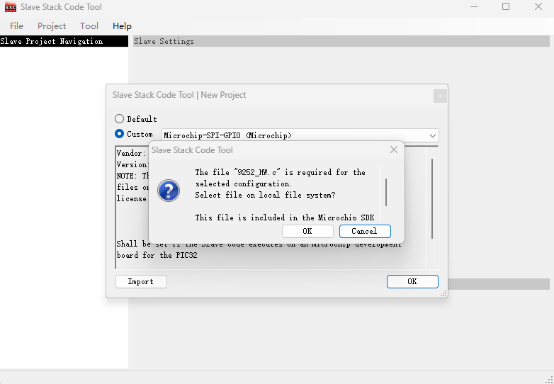

3. 使用 Excel 配置对象字典

   通过 `Tool` -> `Application` -> `Create New` 生成 Excel 表格，该表格用来配置对象字典，通过 SSC 工具导入该表格将自动生成 EtherCAT 从站代码和 XML 设备描述文件 ESI。

   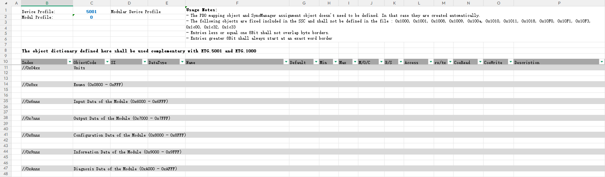

   > - 0x1600，0x1A00，0x1C12，0x1C13 不需要自行定义；
   > - 0x1000，0x1001，0x1008，0x1009，0x100a，0x1010，0x1011，0x1018，0x10F0，0x10F1，0x10F3，0x1c00，0x1c32，0x1c33 对象字典根据 SSC 中的配置自动生成。
   > - 子索引从 1 开始，在生成代码和 XML 文件时会自动添加子索引 0，类型是 UNSIGNED16。

   按需求添加对象字典：

   

   点击 `Project` -> `Create new Slave Files` -> `Start` -> `OK` -> `Close` 之后关闭 SSC Tool 即可：

   

   此时已经生成了 XML 文件和协议栈源代码。

   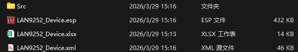


### XML 配置文件

> XML 基本语法：[链接](https://www.runoob.com/xml/xml-tutorial.html)

从站设备描述文件 ESI 是 EtherCAT 从站设备的配置文件，文件为 XML 格式。 XML 文件编写好后，通过主站程序或其它烧写工具下载到从站设备的 EEPROM 中。ESC 上电时，通过 IIC 总线读取 EEPROM，配置芯片内部的寄存器。

从站设备描述文件的主要功能是描述 EtherCAT 从站的配置信息，主要包含以下两个部分：EtherCAT 从站制造商信息和 EtherCAT 从站描述信息。

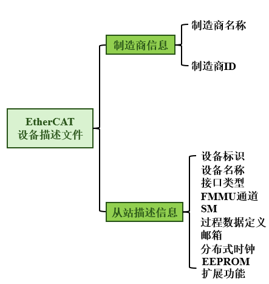

- 制造商信息：

  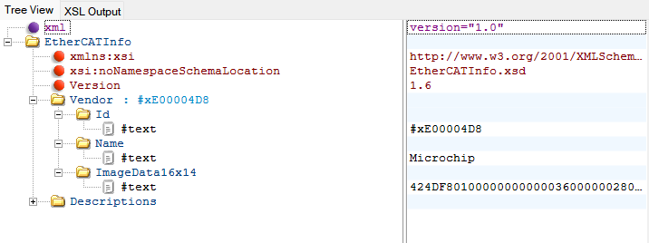

- 设备信息：

  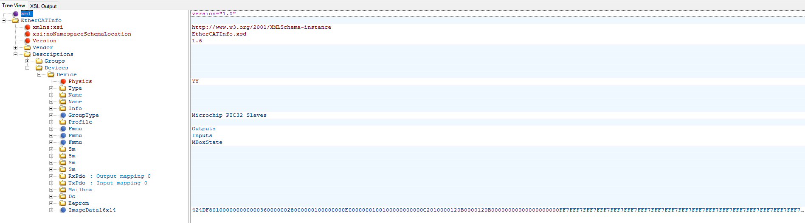

  - 设备名称和接口类型：

    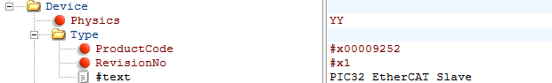

    > 当使用 MII 接口 0 和接口 1 时，Physical 定义为 YY；

  - FMMU 通道设置：

    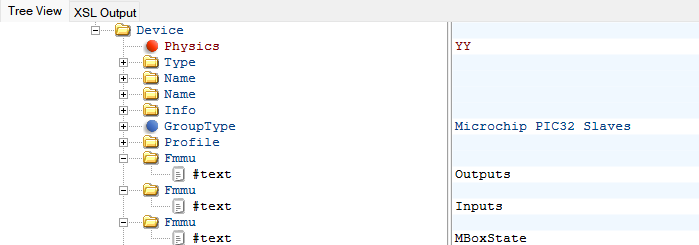

    > 定义了 3 个 FMMU 通道：Outputs、Inputs 和 Mailbox，分别用于过程数据输出、过程数据输入和邮箱数据通讯。

  - SM 通道设置：

    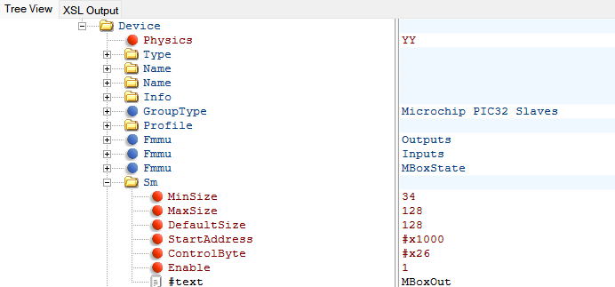

    > SM 通道一共用到 4 个。
    >
    > 通道 1 用于邮箱数据输出，起始地址设为 0x1000，控制位设为 0x26，使能位设为使能；
    >
    > 通道 2 用于邮箱数据输入，起始地址设为 0x1080，控制位设为 0x22，使能位设为使能；
    >
    > 通道 3 用于过程数据输出，起始地址设为 0x1100，控制位设为 0x24，使能位设为使能；
    >
    > 通道 4 用于过程数据输入，起始地址设为 0x1180，控制位设为 0x20，使能位设为使能。

  - 过程数据设置：

    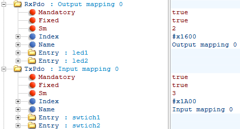

    > 配置信息包括对应的 SM 通道、FMMU 单元、索引号、数据类型、数据长度和数据名称。

  - 邮箱设置：

    

    > 可以配置邮箱协议：CoE，SoE，FoE 和 EoE。

  - 分布式时钟设置：

    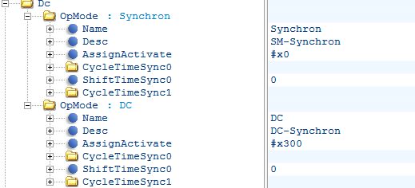

    > 从站运行有两种模式，一种是自由模式，一种是同步模式。
    >
    > 自由模式时，不需要分布时钟单元的同步信号输出；但是在同步模式时，需要 ESC 芯片输出同步脉冲。
    >
    > 同步时钟模块有两种状态，一种是同步信号使能模式，一种是同步信号失能模式。

  - EEPROM 设置：

    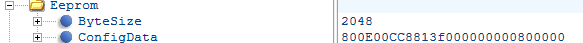

    > 在 EtherCAT 从站中，需要配置 EEPROM 的大小和一些寄存器的初始化数据。
    >
    > 这里 EEPROM 的大小为 2KB，相关寄存器的初始化数据为 800E00CC8813f000000000800000，这个数据主要用来配置过程数据接口信息以及使能同步时钟输出信号的相关硬件驱动。

### STM32 配置和 LAN9252 从站搭建

1. STM32CubeMX 配置

   - 需要一组标准 4 线 SPI；
   - 一个 1ms 定时中断；
   - 三个 EXTI 中断：主中断 IRQ，时钟同步中断 SYNC0，SYNC1。

   > IRQ 和 1ms 定时中断抢占优先级为 1； SYNC0 和 SYNC1 中断抢占优先级为 2。

2. 协议栈移植

   先将协议栈源代码完整移植到工程中。

   > 移植 LAN9252 官方 SPI 驱动：在 `LAN9252-PIC32-SDK-1.1\SSC\PIC32-SPI\SPIDriver` 中有 `SPIDriver.c` 和 `SPIDriver.h` ，复制到之前生成的协议栈代码文件中。

   接下来编译会产生报错，根据报错信息进行修改：

   ---

   ```
   ..\EtherCAT\9252_HW.c(190): warning:  #223-D: function "INTDisableInterrupts" declared implicitly
           DISABLE_AL_EVENT_INT;
   ..\EtherCAT\9252_HW.c(192): warning:  #223-D: function "INTEnableInterrupts" declared implicitly
           ENABLE_AL_EVENT_INT;
   ```

   将关闭全局变量的函数改为 STM32 的实现，并添加对应头文件。

   ```c
   // Global Interrupt setting
   #include "main.h"
   
   #define DISABLE_GLOBAL_INT          __disable_irq()
   #define ENABLE_GLOBAL_INT           __enable_irq()
   #define DISABLE_AL_EVENT_INT        DISABLE_GLOBAL_INT
   #define ENABLE_AL_EVENT_INT         ENABLE_GLOBAL_INT
   ```

   ---

   ```
   ..\EtherCAT\9252_HW.c(256): warning:  #223-D: function "PMPWriteDWord" declared implicitly
             PMPWriteDWord (0x54, data);
   ..\EtherCAT\9252_HW.c(287): warning:  #223-D: function "PMPReadDWord" declared implicitly
             data = PMPReadDWord(0x58);
   ```

   由于使用 SPI 通信，将被 `USE_SPI` 宏定义包含的代码范围内保留 `SPIWriteDord()` 函数，并添加 `SPIDriver.h` 头文件。

   ```C
   #include "SPIDriver.h"
   	
   	//部分修改结果,需要根据 Find 工具的结果进行查找
   	//IRQ enable,IRQ polarity, IRQ buffer type in Interrupt Configuration register.
       //Wrte 0x54 - 0x00000101
       data = 0x00000101;
   
       SPIWriteDWord (0x54, data);
   
       //Write in Interrupt Enable register -->
       //Write 0x5c - 0x00000001
       data = 0x00000001;
   
       SPIWriteDWord (0x5C, data);
   
       //Read Interrupt Status register
       //Read 0x58.
   
       SPIReadDWord(0x58);
   ```

   ---

   注释掉 `HW_SetLed()` 函数内的代码，并删除这之后的所有函数 (PIC32芯片的中断服务程序)。

   ```c
   void HW_SetLed(UINT8 RunLed,UINT8 ErrLed)
   {
       /* Here RunLed is not used. Because on chip supported RUN Led is available*/    
       // LED_ECATRED   = ErrLed;
   }
   ```

   ---

   ```
   ..\EtherCAT\9252_HW.c(295): error:  #20: identifier "INTCONbits" is undefined
         INIT_SYNC0_INT
   ..\EtherCAT\9252_HW.c(295): error:  #20: identifier "IPC1bits" is undefined
         INIT_SYNC0_INT
   ```

   这是 SYNC0 的初始化函数，此时已经由 STM32CubeMX 自动生成，直接删除宏定义内容并改为空宏。

   `9252_HW.c` 文件中的宏基于 PIC32 系列芯片定义，修改为适配 STM32 的宏定义。

   ```C
   #ifdef PIC32_HW
   BOOL bEscInterrupt = 0;
   BOOL bSync0Interrupt = 0;
   BOOL bSync1Interrupt = 0;
   BOOL bTimer5Interrupt = 0;
   ///////////////////////////////////////////////////////////////////////////////
   // Global Interrupt setting
   #include "main.h"
   
   #define DISABLE_GLOBAL_INT          __disable_irq()
   #define ENABLE_GLOBAL_INT           __enable_irq()
   #define DISABLE_AL_EVENT_INT        DISABLE_GLOBAL_INT
   #define ENABLE_AL_EVENT_INT         ENABLE_GLOBAL_INT
   
   
   ///////////////////////////////////////////////////////////////////////////////
   // ESC Interrupt
       //0 - falling edge 1-
   #define    INIT_ESC_INT           
   
   #define    INT_EL                 HAL_GPIO_ReadPin(EtherCAT_IRQ_GPIO_Port,EtherCAT_IRQ_Pin)  //ESC Interrupt input port
   
   #define    ACK_ESC_INT            __HAL_GPIO_EXTI_CLEAR_IT(EtherCAT_IRQ_Pin)
   
   #define IS_ESC_INT_ACTIVE    ((INT_EL) == 0) //0 - fro active low; 1 for hactive high
   ///////////////////////////////////////////////////////////////////////////////
   // SYNC0 Interrupt
   
   #ifndef RUN_FROM_SVB_FPGA
   
       #define    INIT_SYNC0_INT                    
       
       #define    INT_SYNC0                       HAL_GPIO_ReadPin(EtherCAT_SYNC0_GPIO_Port,EtherCAT_SYNC0_Pin) //Sync1 Interrupt input port
       
       #define    DISABLE_SYNC0_INT               HAL_NVIC_DisableIRQ(EtherCAT_SYNC0_EXTI_IRQn)//{(_INT1IE)=0;}//disable interrupt source INT1
       #define    ENABLE_SYNC0_INT                HAL_NVIC_EnableIRQ(EtherCAT_SYNC0_EXTI_IRQn) //enable interrupt source INT1
       #define    ACK_SYNC0_INT                   __HAL_GPIO_EXTI_CLEAR_IT(EtherCAT_SYNC0_Pin)
       
       
       #define    IS_SYNC0_INT_ACTIVE             ((INT_SYNC0) == 0) //0 - fro active low; 1 for hactive high
   
       #define    INIT_SYNC1_INT                   
       
       #define    INT_SYNC1                       HAL_GPIO_ReadPin(EtherCAT_SYNC1_GPIO_Port,EtherCAT_SYNC1_Pin) //Sync1 Interrupt input port
       
       #define    DISABLE_SYNC1_INT               HAL_NVIC_DisableIRQ(EtherCAT_SYNC1_EXTI_IRQn)//disable interrupt source INT2
       #define    ENABLE_SYNC1_INT                HAL_NVIC_EnableIRQ(EtherCAT_SYNC1_EXTI_IRQn) //enable interrupt source INT2
       #define    ACK_SYNC1_INT                   __HAL_GPIO_EXTI_CLEAR_IT(EtherCAT_SYNC1_Pin)
       
       
       #define    IS_SYNC1_INT_ACTIVE              ((INT_SYNC1) == 0) //0 - fro active low; 1 for hactive high
   #else
   
   	// Place-holder
   
   #endif
   
   ///////////////////////////////////////////////////////////////////////////////
   // Hardware timer
   
   #define STOP_ECAT_TIMER         HAL_TIM_Base_Stop_IT(&htim7)
   #define INIT_ECAT_TIMER         HAL_TIM_Base_Init(&htim7)
   
   #define START_ECAT_TIMER        HAL_TIM_Base_Start_IT(&htim7)
   
   #endif // end of PIC32_HW
   ```

   ---

   ```
   ..\EtherCAT\ecatappl.c(250): warning:  #223-D: function "HW_GetTimer" declared implicitly
                 StartTimerCnt = (UINT32) HW_GetTimer();
   ..\EtherCAT\ecatappl.c(256): warning:  #223-D: function "HW_GetTimer" declared implicitly
                     UINT32 CurTimerCnt = (UINT32)HW_GetTimer();
   ..\EtherCAT\ecatappl.c(725): warning:  #223-D: function "DISABLE_ESC_INT" declared implicitly
                 DISABLE_ESC_INT();
   ..\EtherCAT\ecatappl.c(733): warning:  #223-D: function "ENABLE_ESC_INT" declared implicitly
                 ENABLE_ESC_INT();
   ```

   将 `9252_HW.c` 文件内的代码修改如下：

   ```c
   ///////////////////////////////////////////////////////////////////////////////
   // Includes
   
   #include  "esc.h"
   #include  "main.h"
   #include  "tim.h"
   #include  "spi.h"
   #include  "gpio.h"
   #include  "stm32f4xx_hal.h"
   
   #ifdef STM32F4
   
   ///////////////////////////////////////////////////////////////////////////////
   //9252 HW DEFINES
   #define ECAT_REG_BASE_ADDR              0x0300
   
   #define CSR_DATA_REG_OFFSET             0x00
   #define CSR_CMD_REG_OFFSET              0x04
   #define PRAM_READ_ADDR_LEN_OFFSET       0x08
   #define PRAM_READ_CMD_OFFSET            0x0c
   #define PRAM_WRITE_ADDR_LEN_OFFSET      0x10
   #define PRAM_WRITE_CMD_OFFSET           0x14
   
   #define PRAM_SPACE_AVBL_COUNT_MASK      0x1f
   #define IS_PRAM_SPACE_AVBL_MASK         0x01
   
   
   #define CSR_DATA_REG                    ECAT_REG_BASE_ADDR+CSR_DATA_REG_OFFSET
   #define CSR_CMD_REG                     ECAT_REG_BASE_ADDR+CSR_CMD_REG_OFFSET
   #define PRAM_READ_ADDR_LEN_REG          ECAT_REG_BASE_ADDR+PRAM_READ_ADDR_LEN_OFFSET
   #define PRAM_READ_CMD_REG               ECAT_REG_BASE_ADDR+PRAM_READ_CMD_OFFSET
   #define PRAM_WRITE_ADDR_LEN_REG         ECAT_REG_BASE_ADDR+PRAM_WRITE_ADDR_LEN_OFFSET
   #define PRAM_WRITE_CMD_REG              ECAT_REG_BASE_ADDR+PRAM_WRITE_CMD_OFFSET
   
   #define PRAM_READ_FIFO_REG              0x04
   #define PRAM_WRITE_FIFO_REG             0x20
   
   #define HBI_INDEXED_DATA0_REG           0x04
   #define HBI_INDEXED_DATA1_REG           0x0c
   #define HBI_INDEXED_DATA2_REG           0x14
   
   #define HBI_INDEXED_INDEX0_REG          0x00
   #define HBI_INDEXED_INDEX1_REG          0x08
   #define HBI_INDEXED_INDEX2_REG          0x10
   
   #define HBI_INDEXED_PRAM_READ_WRITE_FIFO    0x18
   
   #define PRAM_RW_ABORT_MASK      (1 << 30)
   #define PRAM_RW_BUSY_32B        (1 << 31)
   #define PRAM_RW_BUSY_8B         (1 << 7)
   #define PRAM_SET_READ           (1 << 6)
   #define PRAM_SET_WRITE          0
   
   
   //#define 
   
   ///////////////////////////////////////////////////////////////////////////////
   
   ///////////////////////////////////////////////////////////////////////////////
   // Hardware timer settings
   
   #define ECAT_TIMER_INC_P_MS              2000 /**< \brief 312 ticks per ms*/
   
   
   ///////////////////////////////////////////////////////////////////////////////
   // Interrupt and Timer Defines
   
   #ifndef DISABLE_ESC_INT
       #define    DISABLE_ESC_INT()          HAL_NVIC_DisableIRQ(EtherCAT_SYNC0_EXTI_IRQn) /**< \brief Disable interrupt source INT1*/
   #endif
   #ifndef ENABLE_ESC_INT
       #define    ENABLE_ESC_INT()           HAL_NVIC_EnableIRQ(EtherCAT_SYNC0_EXTI_IRQn) /**< \brief Enable interrupt source INT1*/
   #endif
   
   //TODO
   #ifndef HW_GetTimer
       #define HW_GetTimer()       __HAL_TIM_GET_COUNTER(&htim7) /**< \brief Access to the hardware timer*/
   #endif
   
   #ifndef HW_ClearTimer
       #define HW_ClearTimer()     __HAL_TIM_SET_COUNTER(&htim7,0) /**< \brief Clear the hardware timer*/
   #endif
   
   #endif // end of #ifdef STM32F4
   ```

   ---

   修改 SPI 驱动文件 `SPIDriver.h`：

   1. 删掉 `#include "plib.h"`，增添头文件：

      ```c
      #include "ecat_def.h"
      #include "gpio.h"
      #include "spi.h"
      #include "main.h"
      ```

   2. 将宏 `CSLOW()` 与 `CSHIGH()` 修改为 SPI 的 CS 控制引脚：

      ```c
      #define CSLOW()      HAL_GPIO_WritePin(SPI1_CS_GPIO_Port,SPI1_CS_Pin,GPIO_PIN_RESET)
      #define CSHIGH()     HAL_GPIO_WritePin(SPI1_CS_GPIO_Port,SPI1_CS_Pin,GPIO_PIN_SET)
      ```

   ---

   修改 SPI 驱动文件 `SPIDriver.c`：

   删除 `Delay()`、`SPIPut()`、`SPIOpen()` 三个函数。修改 `SPIWrite()` 与 `SPIRead()` 函数，用 HAL 库方式实现。

   ```c
   void SPIWrite(UINT8 data)
   {
       HAL_SPI_Transmit(&hspi1,&data,1,2000);
   }
   
   UINT8 SPIRead()
   {
       UINT8 data;
       HAL_SPI_Receive(&hspi1,&data,1,2000);
       return (data);
   }
   ```

   ---

   剩下是 `UINT32_VAL` 与 `UINT16_VAL` 类型未定义引起的问题，这两个变量是 PIC 芯片内的库文件包含的，添加 `GenericTypeDefs.h` 头文件到工程并在 `SPIDrivers.c` 引用即可(删除 `../Common/UserDataTypes.h`)。

   ```c
   /*******************************************************************
    
                     Generic Type Definitions
    
   ********************************************************************
    FileName:        GenericTypeDefs.h
    Dependencies:    None
    Processor:       PIC10, PIC12, PIC16, PIC18, PIC24, dsPIC, PIC32
    Compiler:        MPLAB C Compilers for PIC18, PIC24, dsPIC, & PIC32
                     Hi-Tech PICC PRO, Hi-Tech PICC18 PRO
    Company:         Microchip Technology Inc.
    
    Software License Agreement
    
    The software supplied herewith by Microchip Technology Incorporated
    (the "Company") is intended and supplied to you, the Company's
    customer, for use solely and exclusively with products manufactured
    by the Company.
    The software is owned by the Company and/or its supplier, and is
    protected under applicable copyright laws. All rights are reserved.
    Any use in violation of the foregoing restrictions may subject the
    user to criminal sanctions under applicable laws, as well as to
    civil liability for the breach of the terms and conditions of this
    license.
    THIS SOFTWARE IS PROVIDED IN AN "AS IS" CONDITION. NO WARRANTIES,
    WHETHER EXPRESS, IMPLIED OR STATUTORY, INCLUDING, BUT NOT LIMITED
    TO, IMPLIED WARRANTIES OF MERCHANTABILITY AND FITNESS FOR A
    PARTICULAR PURPOSE APPLY TO THIS SOFTWARE. THE COMPANY SHALL NOT,
    IN ANY CIRCUMSTANCES, BE LIABLE FOR SPECIAL, INCIDENTAL OR
    CONSEQUENTIAL DAMAGES, FOR ANY REASON WHATSOEVER.
   ********************************************************************
    File Description:
    Change History:
     Rev   Date         Description
     1.1   09/11/06     Add base signed types
     1.2   02/28/07     Add QWORD, LONGLONG, QWORD_VAL
     1.3   02/06/08     Add def's for PIC32
     1.4   08/08/08     Remove LSB/MSB Macros, adopted by Peripheral lib
     1.5   08/14/08     Simplify file header
     Draft 2.0   07/13/09     Updated for new release of coding standards
   *******************************************************************/
    
   #ifndef __GENERIC_TYPE_DEFS_H_
   #define __GENERIC_TYPE_DEFS_H_
    
   #ifdef __cplusplus
   extern "C"
     {
   #endif
    
   /* Specify an extension for GCC based compilers */
   #if defined(__GNUC__)
   #define __EXTENSION __extension__
   #else
   #define __EXTENSION
   #endif
    
   /* get compiler defined type definitions (NULL, size_t, etc) */
   #include <stddef.h>
   #include "ecat_def.h"
    
   //typedef enum _BOOL { FALSE = 0, TRUE } BOOL;    /* Undefined size */
   //typedef enum _BIT { CLEAR = 0, SET } BIT;
    
   #define PUBLIC                                  /* Function attributes */
   #define PROTECTED
   #define PRIVATE   static
    
   /* INT is processor specific in length may vary in size */
   //typedef signed int          INT;
   //typedef signed char         INT8;
   //typedef signed short int    INT16;
   //typedef signed long int     INT32;
    
   /* MPLAB C Compiler for PIC18 does not support 64-bit integers */
   #if !defined(__18CXX)
   __EXTENSION typedef signed long long    INT64;
   #endif
    
   /* UINT is processor specific in length may vary in size */
   //typedef unsigned int        UINT;
   //typedef unsigned char       UINT8;
   //typedef unsigned short int  UINT16;
   /* 24-bit type only available on C18 */
   #if defined(__18CXX)
   typedef unsigned short long UINT24;
   #endif
   //typedef unsigned long int   UINT32;     /* other name for 32-bit integer */
   /* MPLAB C Compiler for PIC18 does not support 64-bit integers */
   #if !defined(__18CXX)
   __EXTENSION typedef unsigned long long  UINT64;
   #endif
    
   typedef union
   {
       UINT8 Val;
       struct
       {
           __EXTENSION UINT8 b0:1;
           __EXTENSION UINT8 b1:1;
           __EXTENSION UINT8 b2:1;
           __EXTENSION UINT8 b3:1;
           __EXTENSION UINT8 b4:1;
           __EXTENSION UINT8 b5:1;
           __EXTENSION UINT8 b6:1;
           __EXTENSION UINT8 b7:1;
       } bits;
   } UINT8_VAL, UINT8_BITS;
    
   typedef union
   {
       UINT16 Val;
       UINT8 v[2];
       struct
       {
           UINT8 LB;
           UINT8 HB;
       } byte;
       struct
       {
           __EXTENSION UINT8 b0:1;
           __EXTENSION UINT8 b1:1;
           __EXTENSION UINT8 b2:1;
           __EXTENSION UINT8 b3:1;
           __EXTENSION UINT8 b4:1;
           __EXTENSION UINT8 b5:1;
           __EXTENSION UINT8 b6:1;
           __EXTENSION UINT8 b7:1;
           __EXTENSION UINT8 b8:1;
           __EXTENSION UINT8 b9:1;
           __EXTENSION UINT8 b10:1;
           __EXTENSION UINT8 b11:1;
           __EXTENSION UINT8 b12:1;
           __EXTENSION UINT8 b13:1;
           __EXTENSION UINT8 b14:1;
           __EXTENSION UINT8 b15:1;
       } bits;
   } UINT16_VAL, UINT16_BITS;
    
   /* 24-bit type only available on C18 */
   #if defined(__18CXX)
   typedef union
   {
       UINT24 Val;
       UINT8 v[3];
       struct
       {
           UINT8 LB;
           UINT8 HB;
           UINT8 UB;
       } byte;
       struct
       {
           __EXTENSION UINT8 b0:1;
           __EXTENSION UINT8 b1:1;
           __EXTENSION UINT8 b2:1;
           __EXTENSION UINT8 b3:1;
           __EXTENSION UINT8 b4:1;
           __EXTENSION UINT8 b5:1;
           __EXTENSION UINT8 b6:1;
           __EXTENSION UINT8 b7:1;
           __EXTENSION UINT8 b8:1;
           __EXTENSION UINT8 b9:1;
           __EXTENSION UINT8 b10:1;
           __EXTENSION UINT8 b11:1;
           __EXTENSION UINT8 b12:1;
           __EXTENSION UINT8 b13:1;
           __EXTENSION UINT8 b14:1;
           __EXTENSION UINT8 b15:1;
           __EXTENSION UINT8 b16:1;
           __EXTENSION UINT8 b17:1;
           __EXTENSION UINT8 b18:1;
           __EXTENSION UINT8 b19:1;
           __EXTENSION UINT8 b20:1;
           __EXTENSION UINT8 b21:1;
           __EXTENSION UINT8 b22:1;
           __EXTENSION UINT8 b23:1;
       } bits;
   } UINT24_VAL, UINT24_BITS;
   #endif
    
   typedef union
   {
       UINT32 Val;
       UINT16 w[2];
       UINT8  v[4];
       struct
       {
           UINT16 LW;
           UINT16 HW;
       } word;
       struct
       {
           UINT8 LB;
           UINT8 HB;
           UINT8 UB;
           UINT8 MB;
       } byte;
       struct
       {
           UINT16_VAL low;
           UINT16_VAL high;
       }wordUnion;
       struct
       {
           __EXTENSION UINT8 b0:1;
           __EXTENSION UINT8 b1:1;
           __EXTENSION UINT8 b2:1;
           __EXTENSION UINT8 b3:1;
           __EXTENSION UINT8 b4:1;
           __EXTENSION UINT8 b5:1;
           __EXTENSION UINT8 b6:1;
           __EXTENSION UINT8 b7:1;
           __EXTENSION UINT8 b8:1;
           __EXTENSION UINT8 b9:1;
           __EXTENSION UINT8 b10:1;
           __EXTENSION UINT8 b11:1;
           __EXTENSION UINT8 b12:1;
           __EXTENSION UINT8 b13:1;
           __EXTENSION UINT8 b14:1;
           __EXTENSION UINT8 b15:1;
           __EXTENSION UINT8 b16:1;
           __EXTENSION UINT8 b17:1;
           __EXTENSION UINT8 b18:1;
           __EXTENSION UINT8 b19:1;
           __EXTENSION UINT8 b20:1;
           __EXTENSION UINT8 b21:1;
           __EXTENSION UINT8 b22:1;
           __EXTENSION UINT8 b23:1;
           __EXTENSION UINT8 b24:1;
           __EXTENSION UINT8 b25:1;
           __EXTENSION UINT8 b26:1;
           __EXTENSION UINT8 b27:1;
           __EXTENSION UINT8 b28:1;
           __EXTENSION UINT8 b29:1;
           __EXTENSION UINT8 b30:1;
           __EXTENSION UINT8 b31:1;
       } bits;
   } UINT32_VAL;
    
   /* MPLAB C Compiler for PIC18 does not support 64-bit integers */
   #if !defined(__18CXX)
   typedef union
   {
       UINT64 Val;
       UINT32 d[2];
       UINT16 w[4];
       UINT8 v[8];
       struct
       {
           UINT32 LD;
           UINT32 HD;
       } dword;
       struct
       {
           UINT16 LW;
           UINT16 HW;
           UINT16 UW;
           UINT16 MW;
       } word;
       struct
       {
           __EXTENSION UINT8 b0:1;
           __EXTENSION UINT8 b1:1;
           __EXTENSION UINT8 b2:1;
           __EXTENSION UINT8 b3:1;
           __EXTENSION UINT8 b4:1;
           __EXTENSION UINT8 b5:1;
           __EXTENSION UINT8 b6:1;
           __EXTENSION UINT8 b7:1;
           __EXTENSION UINT8 b8:1;
           __EXTENSION UINT8 b9:1;
           __EXTENSION UINT8 b10:1;
           __EXTENSION UINT8 b11:1;
           __EXTENSION UINT8 b12:1;
           __EXTENSION UINT8 b13:1;
           __EXTENSION UINT8 b14:1;
           __EXTENSION UINT8 b15:1;
           __EXTENSION UINT8 b16:1;
           __EXTENSION UINT8 b17:1;
           __EXTENSION UINT8 b18:1;
           __EXTENSION UINT8 b19:1;
           __EXTENSION UINT8 b20:1;
           __EXTENSION UINT8 b21:1;
           __EXTENSION UINT8 b22:1;
           __EXTENSION UINT8 b23:1;
           __EXTENSION UINT8 b24:1;
           __EXTENSION UINT8 b25:1;
           __EXTENSION UINT8 b26:1;
           __EXTENSION UINT8 b27:1;
           __EXTENSION UINT8 b28:1;
           __EXTENSION UINT8 b29:1;
           __EXTENSION UINT8 b30:1;
           __EXTENSION UINT8 b31:1;
           __EXTENSION UINT8 b32:1;
           __EXTENSION UINT8 b33:1;
           __EXTENSION UINT8 b34:1;
           __EXTENSION UINT8 b35:1;
           __EXTENSION UINT8 b36:1;
           __EXTENSION UINT8 b37:1;
           __EXTENSION UINT8 b38:1;
           __EXTENSION UINT8 b39:1;
           __EXTENSION UINT8 b40:1;
           __EXTENSION UINT8 b41:1;
           __EXTENSION UINT8 b42:1;
           __EXTENSION UINT8 b43:1;
           __EXTENSION UINT8 b44:1;
           __EXTENSION UINT8 b45:1;
           __EXTENSION UINT8 b46:1;
           __EXTENSION UINT8 b47:1;
           __EXTENSION UINT8 b48:1;
           __EXTENSION UINT8 b49:1;
           __EXTENSION UINT8 b50:1;
           __EXTENSION UINT8 b51:1;
           __EXTENSION UINT8 b52:1;
           __EXTENSION UINT8 b53:1;
           __EXTENSION UINT8 b54:1;
           __EXTENSION UINT8 b55:1;
           __EXTENSION UINT8 b56:1;
           __EXTENSION UINT8 b57:1;
           __EXTENSION UINT8 b58:1;
           __EXTENSION UINT8 b59:1;
           __EXTENSION UINT8 b60:1;
           __EXTENSION UINT8 b61:1;
           __EXTENSION UINT8 b62:1;
           __EXTENSION UINT8 b63:1;
       } bits;
   } UINT64_VAL;
   #endif /* __18CXX */
    
   /***********************************************************************************/
    
   /* Alternate definitions */
   typedef void                    VOID;
    
   typedef char                    CHAR8;
   typedef unsigned char           UCHAR8;
    
   typedef unsigned char           BYTE;                           /* 8-bit unsigned  */
   typedef unsigned short int      WORD;                           /* 16-bit unsigned */
   typedef unsigned long           DWORD;                          /* 32-bit unsigned */
   /* MPLAB C Compiler for PIC18 does not support 64-bit integers */
   #if !defined(__18CXX)
   __EXTENSION
   typedef unsigned long long      QWORD;                          /* 64-bit unsigned */
   #endif /* __18CXX */
   //typedef signed char             CHAR;                           /* 8-bit signed    */
   typedef signed short int        SHORT;                          /* 16-bit signed   */
   typedef signed long             LONG;                           /* 32-bit signed   */
   /* MPLAB C Compiler for PIC18 does not support 64-bit integers */
   #if !defined(__18CXX)
   __EXTENSION
   typedef signed long long        LONGLONG;                       /* 64-bit signed   */
   #endif /* __18CXX */
   typedef union
   {
       BYTE Val;
       struct
       {
           __EXTENSION BYTE b0:1;
           __EXTENSION BYTE b1:1;
           __EXTENSION BYTE b2:1;
           __EXTENSION BYTE b3:1;
           __EXTENSION BYTE b4:1;
           __EXTENSION BYTE b5:1;
           __EXTENSION BYTE b6:1;
           __EXTENSION BYTE b7:1;
       } bits;
   } BYTE_VAL, BYTE_BITS;
    
   typedef union
   {
       WORD Val;
       BYTE v[2];
       struct
       {
           BYTE LB;
           BYTE HB;
       } byte;
       struct
       {
           __EXTENSION BYTE b0:1;
           __EXTENSION BYTE b1:1;
           __EXTENSION BYTE b2:1;
           __EXTENSION BYTE b3:1;
           __EXTENSION BYTE b4:1;
           __EXTENSION BYTE b5:1;
           __EXTENSION BYTE b6:1;
           __EXTENSION BYTE b7:1;
           __EXTENSION BYTE b8:1;
           __EXTENSION BYTE b9:1;
           __EXTENSION BYTE b10:1;
           __EXTENSION BYTE b11:1;
           __EXTENSION BYTE b12:1;
           __EXTENSION BYTE b13:1;
           __EXTENSION BYTE b14:1;
           __EXTENSION BYTE b15:1;
       } bits;
   } WORD_VAL, WORD_BITS;
    
   typedef union
   {
       DWORD Val;
       WORD w[2];
       BYTE v[4];
       struct
       {
           WORD LW;
           WORD HW;
       } word;
       struct
       {
           BYTE LB;
           BYTE HB;
           BYTE UB;
           BYTE MB;
       } byte;
       struct
       {
           WORD_VAL low;
           WORD_VAL high;
       }wordUnion;
       struct
       {
           __EXTENSION BYTE b0:1;
           __EXTENSION BYTE b1:1;
           __EXTENSION BYTE b2:1;
           __EXTENSION BYTE b3:1;
           __EXTENSION BYTE b4:1;
           __EXTENSION BYTE b5:1;
           __EXTENSION BYTE b6:1;
           __EXTENSION BYTE b7:1;
           __EXTENSION BYTE b8:1;
           __EXTENSION BYTE b9:1;
           __EXTENSION BYTE b10:1;
           __EXTENSION BYTE b11:1;
           __EXTENSION BYTE b12:1;
           __EXTENSION BYTE b13:1;
           __EXTENSION BYTE b14:1;
           __EXTENSION BYTE b15:1;
           __EXTENSION BYTE b16:1;
           __EXTENSION BYTE b17:1;
           __EXTENSION BYTE b18:1;
           __EXTENSION BYTE b19:1;
           __EXTENSION BYTE b20:1;
           __EXTENSION BYTE b21:1;
           __EXTENSION BYTE b22:1;
           __EXTENSION BYTE b23:1;
           __EXTENSION BYTE b24:1;
           __EXTENSION BYTE b25:1;
           __EXTENSION BYTE b26:1;
           __EXTENSION BYTE b27:1;
           __EXTENSION BYTE b28:1;
           __EXTENSION BYTE b29:1;
           __EXTENSION BYTE b30:1;
           __EXTENSION BYTE b31:1;
       } bits;
   } DWORD_VAL;
    
   /* MPLAB C Compiler for PIC18 does not support 64-bit integers */
   #if !defined(__18CXX)
   typedef union
   {
       QWORD Val;
       DWORD d[2];
       WORD w[4];
       BYTE v[8];
       struct
       {
           DWORD LD;
           DWORD HD;
       } dword;
       struct
       {
           WORD LW;
           WORD HW;
           WORD UW;
           WORD MW;
       } word;
       struct
       {
           __EXTENSION BYTE b0:1;
           __EXTENSION BYTE b1:1;
           __EXTENSION BYTE b2:1;
           __EXTENSION BYTE b3:1;
           __EXTENSION BYTE b4:1;
           __EXTENSION BYTE b5:1;
           __EXTENSION BYTE b6:1;
           __EXTENSION BYTE b7:1;
           __EXTENSION BYTE b8:1;
           __EXTENSION BYTE b9:1;
           __EXTENSION BYTE b10:1;
           __EXTENSION BYTE b11:1;
           __EXTENSION BYTE b12:1;
           __EXTENSION BYTE b13:1;
           __EXTENSION BYTE b14:1;
           __EXTENSION BYTE b15:1;
           __EXTENSION BYTE b16:1;
           __EXTENSION BYTE b17:1;
           __EXTENSION BYTE b18:1;
           __EXTENSION BYTE b19:1;
           __EXTENSION BYTE b20:1;
           __EXTENSION BYTE b21:1;
           __EXTENSION BYTE b22:1;
           __EXTENSION BYTE b23:1;
           __EXTENSION BYTE b24:1;
           __EXTENSION BYTE b25:1;
           __EXTENSION BYTE b26:1;
           __EXTENSION BYTE b27:1;
           __EXTENSION BYTE b28:1;
           __EXTENSION BYTE b29:1;
           __EXTENSION BYTE b30:1;
           __EXTENSION BYTE b31:1;
           __EXTENSION BYTE b32:1;
           __EXTENSION BYTE b33:1;
           __EXTENSION BYTE b34:1;
           __EXTENSION BYTE b35:1;
           __EXTENSION BYTE b36:1;
           __EXTENSION BYTE b37:1;
           __EXTENSION BYTE b38:1;
           __EXTENSION BYTE b39:1;
           __EXTENSION BYTE b40:1;
           __EXTENSION BYTE b41:1;
           __EXTENSION BYTE b42:1;
           __EXTENSION BYTE b43:1;
           __EXTENSION BYTE b44:1;
           __EXTENSION BYTE b45:1;
           __EXTENSION BYTE b46:1;
           __EXTENSION BYTE b47:1;
           __EXTENSION BYTE b48:1;
           __EXTENSION BYTE b49:1;
           __EXTENSION BYTE b50:1;
           __EXTENSION BYTE b51:1;
           __EXTENSION BYTE b52:1;
           __EXTENSION BYTE b53:1;
           __EXTENSION BYTE b54:1;
           __EXTENSION BYTE b55:1;
           __EXTENSION BYTE b56:1;
           __EXTENSION BYTE b57:1;
           __EXTENSION BYTE b58:1;
           __EXTENSION BYTE b59:1;
           __EXTENSION BYTE b60:1;
           __EXTENSION BYTE b61:1;
           __EXTENSION BYTE b62:1;
           __EXTENSION BYTE b63:1;
       } bits;
   } QWORD_VAL;
   #endif /* __18CXX */
    
   #undef __EXTENSION
    
   #ifdef __cplusplus
     }
   #endif
   #endif /* __GENERIC_TYPE_DEFS_H_ */
   ```

   ---

   ```
   ..\EtherCAT\9252_HW.c(311): warning:  #223-D: function "ConfigIntTimer5" declared implicitly
         ConfigIntTimer5(T5_INT_ON | T5_INT_PRIOR_3 );
   ..\EtherCAT\9252_HW.c(311): error:  #20: identifier "T5_INT_ON" is undefined
         ConfigIntTimer5(T5_INT_ON | T5_INT_PRIOR_3 );
   ..\EtherCAT\9252_HW.c(311): error:  #20: identifier "T5_INT_PRIOR_3" is undefined
         ConfigIntTimer5(T5_INT_ON | T5_INT_PRIOR_3 );
   ```

   没有定义的函数，直接删除。

   ---

   ```
   ..\EtherCAT\ecatfoe.c(110): error:  #167: argument of type "__packed unsigned short *" is incompatible with parameter of type "unsigned short *"
                 nextState = FOE_Read(pFoeInd->Data, dataSize, pFoeInd->Data, SWAPDWORD(u32Password));
   ```

   由 `__packed` 关键字引发，将 `ecat_def.h` 的 `MBX_STRUCT_PACKED_END` 和 `STRUCT_PACKED_END` 改为空的宏定义。

   ---

   接下来将协议栈保留的接口函数在代码调用，并编写业务逻辑。

   1. `stm32f4xx_it.c` 引用 `applInterface.h` 头文件

   2. 在 IRQ 引脚对应的中断服务程序中调用 `PDI_Isr()`：

      ```c
      /**
        * @brief This function handles EXTI line0 interrupt.
        */
      void EXTI0_IRQHandler(void)
      {
        /* USER CODE BEGIN EXTI0_IRQn 0 */
      	PDI_Isr();
        /* USER CODE END EXTI0_IRQn 0 */
        HAL_GPIO_EXTI_IRQHandler(EtherCAT_IRQ_Pin);
        /* USER CODE BEGIN EXTI0_IRQn 1 */
      
        /* USER CODE END EXTI0_IRQn 1 */
      }
      ```

   3. 在 SYNC0 和 SYNC1 引脚对应的中断服务程序中调用 `Sync0_Isr()` 和 `Sync1_Isr()`：

      ```c
      /**
        * @brief This function handles EXTI line1 interrupt.
        */
      void EXTI1_IRQHandler(void)
      {
        /* USER CODE BEGIN EXTI1_IRQn 0 */
      	DISABLE_ESC_INT();
      	Sync1_Isr();
      	ENABLE_ESC_INT();
        /* USER CODE END EXTI1_IRQn 0 */
        HAL_GPIO_EXTI_IRQHandler(EtherCAT_SYNC1_Pin);
        /* USER CODE BEGIN EXTI1_IRQn 1 */
      
        /* USER CODE END EXTI1_IRQn 1 */
      }
      
      /**
        * @brief This function handles EXTI line3 interrupt.
        */
      void EXTI3_IRQHandler(void)
      {
        /* USER CODE BEGIN EXTI3_IRQn 0 */
      	DISABLE_ESC_INT();
      	Sync0_Isr();
      	ENABLE_ESC_INT();
        /* USER CODE END EXTI3_IRQn 0 */
        HAL_GPIO_EXTI_IRQHandler(EtherCAT_SYNC0_Pin);
        /* USER CODE BEGIN EXTI3_IRQn 1 */
      
        /* USER CODE END EXTI3_IRQn 1 */
      }
      ```

      > 设备上电后不可以直接调用 `HAL_NVIC_EnableIRQ` 函数将各种中断使能，此时协议栈相关数据都没初始化完成，直接使能这些中断将导致严重的逻辑问题。
      >
      > 将 `MX_GPIO_Init()` 结尾的使能中断进行注释：
      >
      > ```c
      >   /* EXTI interrupt init*/
      >   HAL_NVIC_SetPriority(EXTI0_IRQn, 1, 0);
      >   // HAL_NVIC_EnableIRQ(EXTI0_IRQn);
      > 
      >   HAL_NVIC_SetPriority(EXTI1_IRQn, 2, 0);
      >   // HAL_NVIC_EnableIRQ(EXTI1_IRQn);
      > 
      >   HAL_NVIC_SetPriority(EXTI3_IRQn, 2, 0);
      >   // HAL_NVIC_EnableIRQ(EXTI3_IRQn);
      > ```

   4. 1ms 定时器的中断服务函数调用 `ECAT_CheckTimer()`：
   
      ```c
      /**
        * @brief This function handles TIM7 global interrupt.
        */
      void TIM7_IRQHandler(void)
      {
        /* USER CODE BEGIN TIM7_IRQn 0 */
      	ECAT_CheckTimer();
        /* USER CODE END TIM7_IRQn 0 */
        HAL_TIM_IRQHandler(&htim7);
        /* USER CODE BEGIN TIM7_IRQn 1 */
      
        /* USER CODE END TIM7_IRQn 1 */
      }
      ```
   
   5. 在主函数中添加头文件 `applInterface.h`，调用协议栈的初始化函数 `HW_Init()` 和 `MainInit()`，并在 `while` 循环中调用 `MainLoop()`。
   
      > 应用逻辑写在 `APPL_Application()` 函数中，需要注意不要在 `APPL_Application()` 函数中进行耗时操作，如果耗时操作无法避免，可以另加操作系统，在其他线程中处理，否则会导致通信异常。
   
      ```c
      /**
        * @brief  The application entry point.
        * @retval int
        */
      int main(void)
      {
      
        /* USER CODE BEGIN 1 */
      
        /* USER CODE END 1 */
      
        /* MCU Configuration--------------------------------------------------------*/
      
        /* Reset of all peripherals, Initializes the Flash interface and the Systick. */
        HAL_Init();
      
        /* USER CODE BEGIN Init */
      
        /* USER CODE END Init */
      
        /* Configure the system clock */
        SystemClock_Config();
      
        /* USER CODE BEGIN SysInit */
      
        /* USER CODE END SysInit */
      
        /* Initialize all configured peripherals */
        MX_GPIO_Init();
        MX_SPI1_Init();
        MX_TIM7_Init();
        /* USER CODE BEGIN 2 */
      	HW_Init();
      	MainInit();
        /* USER CODE END 2 */
      
        /* Infinite loop */
        /* USER CODE BEGIN WHILE */
        while (1)
        {
          /* USER CODE END WHILE */
      
          /* USER CODE BEGIN 3 */
      		MainLoop();
        }
        /* USER CODE END 3 */
      }
      
      ```
   
   ---
   
   接下来可以在设备文件中编写业务逻辑，设备文件名取决于 SSC 工具生成时取的名字。
   
   需要实现的函数：
   
   ```c
   // 输入数据映射,将需要发送的数据映射到pData指向的空间
   void APPL_InputMapping(UINT16* pData) 
    
   // 输出数据映射,将想要接收的数据从pData指向的空间取出
   void APPL_OutputMapping(UINT16* pData) 
    
   // 应用逻辑
   void APPL_Application(void)              
   ```

   变量名在 `xxxQbjects.h` 中可以找到。

### EtherCAT 从站测试

1. TwinCAT 软件下载

   Beckhoff 官网下载中心：[链接](https://www.beckhoff.com.cn/zh-cn/support/download-finder/)

   下载中心内选择 Twincat 3 Download|eXtended Automation Engineering(XAE)：

   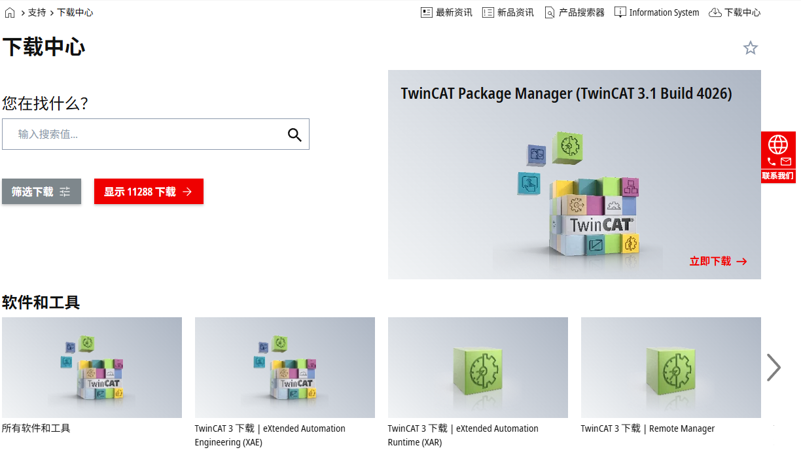

   > - XAE：eXtended Automation Engineering。XAE 是基于 Visual Studio 作为开发环境，进行多种语言的编程和硬件组态。
   > - XAR：eXtended Automation Runtime。XAR 是实时运行环境，对 TwinCAT 模块加载、执行、管理、实时运行与调用。

   注册登录后下载即可。

   > - 此处选择 do not accept：
   >
   >   

2. 初始化配置

   打开 TwinCAT XAE Shell。
   
   

   新建项目，类型为 TwinCAT XAE Project。

   接下来申请激活授权。
   
   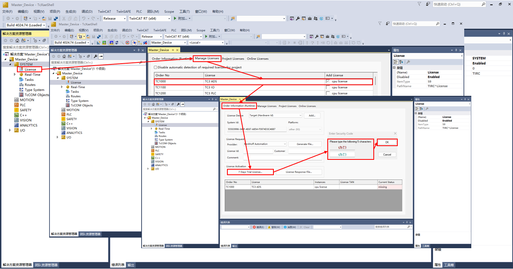
   
   > 1. 点击项目中 SYSTEM 目录下的 License。
   > 2. 选择 Manage Licenses，在 Add License 中勾选所需要的 License；
   > 3. 接着回到 Order Information 点击 7 Days Tral License ... 出现对话框，填写对应的验证码；
   > 4. 输入正确后弹出窗口告知 7 天试用版 License 已经生成，这样就可以有 7 天的授权可以使用，如果过期了再次用同样的方法激活即可。
   
   接下来进行网卡配置：
   
   
   
   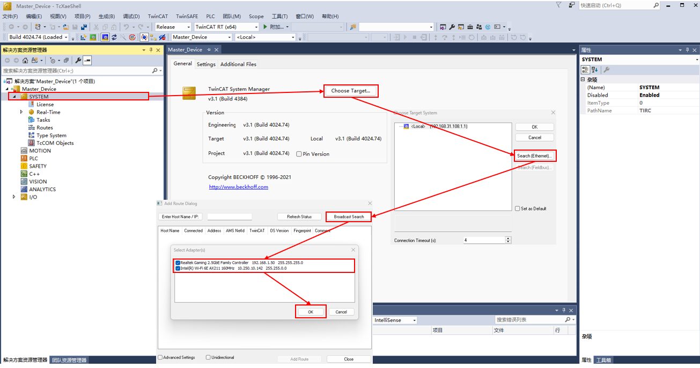
   
   > 1. 安装网卡驱动，点击 TwinCAT -> Show Realtime Ethernet Compatible Devices ...；
   > 2. 点击与设备连接的网卡进行安装；
   > 3. 双击项目 SYSTEM，选择 Choose Target；
   > 4. 扫描网卡，选择网卡设备。
   
3. 扫描设备并进行测试

   从机网口和主机网口相互连接，然后按图进行设备扫描。

   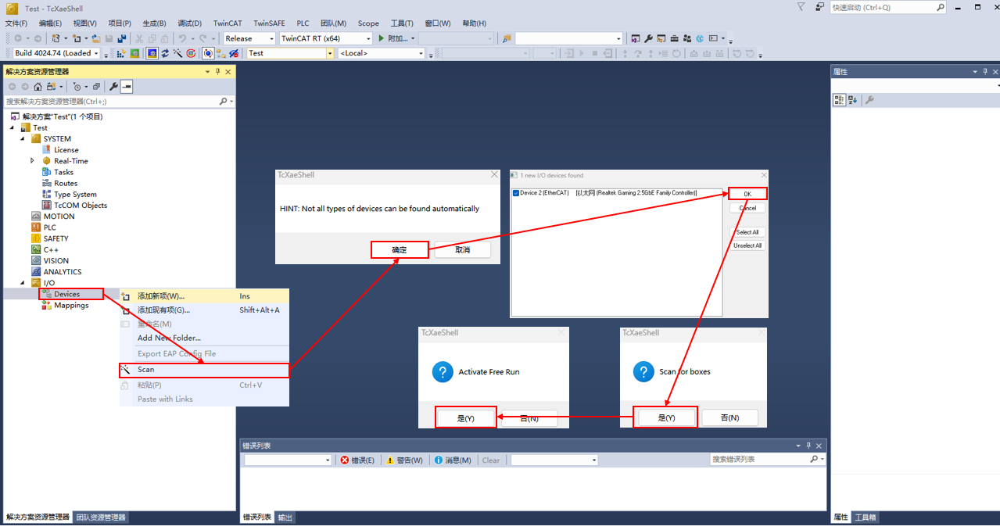

   此时可以扫描到设备：

   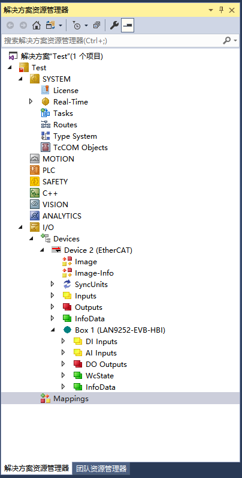

   此时可以在 Box 内读写数据。
   
   > **从站 EEPROM 烧写：**
   >
   > 更新 EEPROM 前，需要将新的 XML 文件放到 TwinCAT 的安装路径下：`C:\TwinCAT\3.1\Config\Io\EtherCAT`(C 盘是 TwinCAT 的安装盘)；
   >
   > 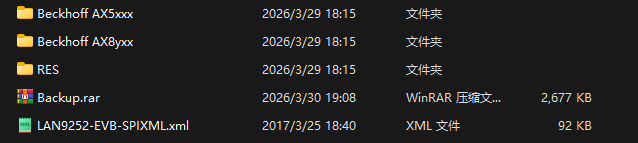
   >
   > 其余 XML 文件应当删除。
   >
   > 加载 XML 文件：
   >
   > 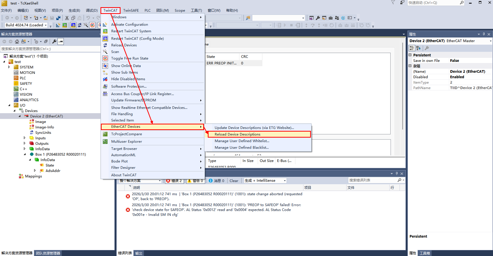
   >
   > 更新 EEPROM：
   >
   > 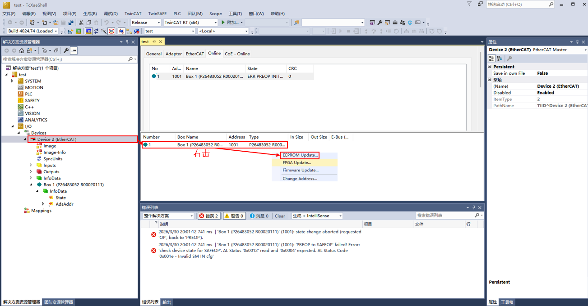
   >
   > 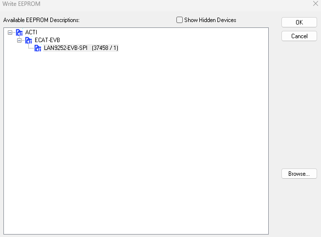
   >
   > 此时删除设备再次 scan 即可。