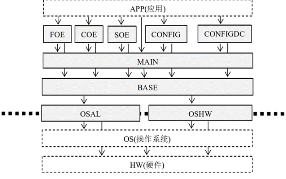
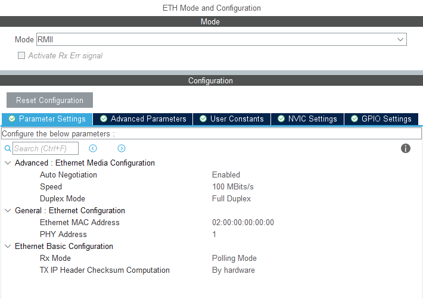
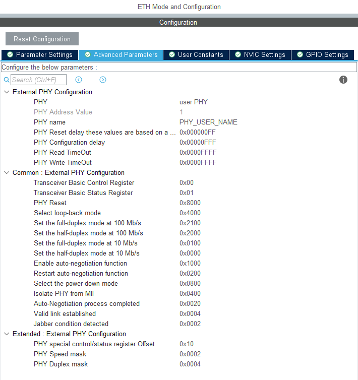
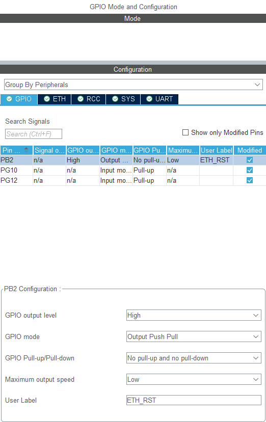
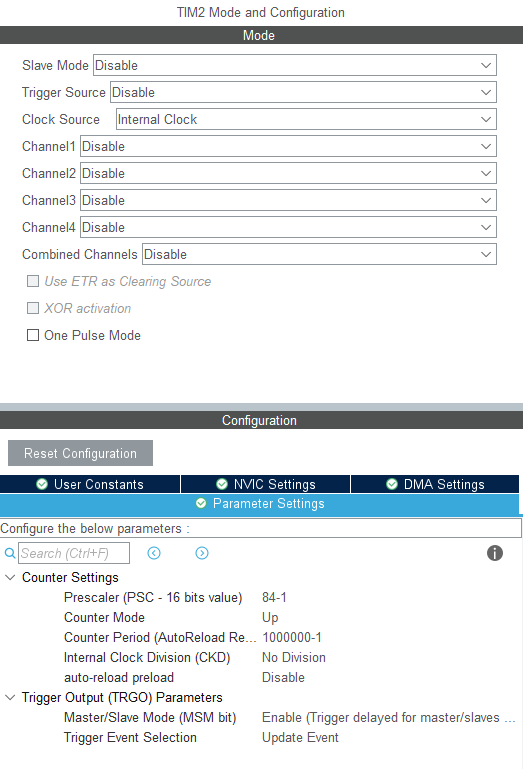
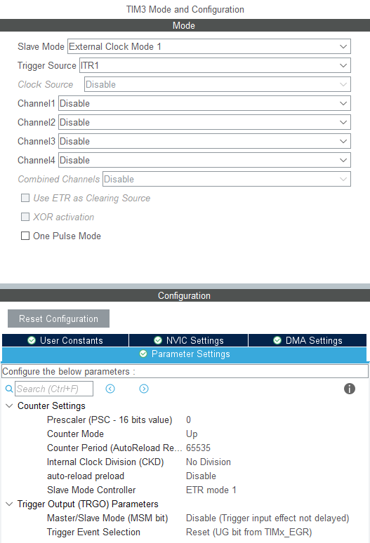
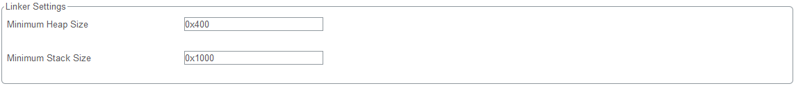

# EtherCAT 主站实现

> EtherCAT 主站可以通过 SOEM 或 IGH 实现。
>
> SOEM 是一款轻量级的开源 EtherCAT 主站栈，采用纯 C 编写，代码紧凑且无操作系统依赖，可直接运行于裸机或 FreeRTOS 等实时系统之上。作为纯软件主站，它通过标准以太网 MAC 控制器收发帧，无需专用硬件，资源占用极低，特别适合 STM32 等嵌入式微控制器构建小型控制系统，通常用于管理少量从站、毫秒级周期的应用场景。
>
> IGH EtherCAT Master 则是面向工业级应用的高性能主站方案，以内核模块形式深度集成于 Linux 系统，支持 PREEMPT_RT 实时补丁，可实现微秒级硬实时控制周期。其设计目标为复杂工业现场，能够管理大规模从站网络并提供完整的协议支持与诊断工具，适用于工控机平台及大型自动化设备。两者分别代表了嵌入式轻量方案与工业高性能方案的技术路线。

## 1. SOEM 主站实现

SOEM 是一个开源的 EtherCAT 主站协议栈，由瑞典 RT-Labs 公司最初开发，现由 Open EtherCAT Society 维护。它是一个使用纯 ANSI C 编写的小型、轻量级库，专门用于开发自定义 EtherCAT 主站应用程序。

目前最常使用的 SOEM 版本为 v1.4.0 版本：[链接](https://github.com/OpenEtherCATsociety/SOEM/tree/v1.4.0)

### SOEM 代码结构

SOEM 代码结构如下：



SOEM 采用分层设计，并且提供了一个抽象层，将 SOEM 协议栈与具体操作系统和硬件分开。

抽象层由 OSAL 和 OSHW 两个模块组成，OSAL 是操作系统抽象层，OSHW 是硬件抽象层。

> - OSAL 模块侧重于操作系统的抽象和时间机制，由 `osal.h`/`osal_def.h` 和 `osal.c` 组成。定义了基本数据类型，时间相关结构以及时间和定时器相关 API 和线程相关 API。其中的时间和定时器相关的 API 是必须实现的，线程相关的 API 不是必须实现的。
>
> - OSHW 侧重于为上层提供网络服务，由 `oshw.h`/`oshw.c` 和 `nicdrv.h`/`nicdrv.c` 四个文件组成。`oshw.h`/`oshw.c` 主要实现网络大小端和本地大小端的转换，`nicdrv.h`/`nicdrv.c` 是网络驱动，主要实现 EtherCAT 帧的发送和接收。
>
>   `nicdrv` 模块的逻辑结构基本相同，需要实现网口初始化，MAC 层帧发送，MAC 层帧接收

SOEM 中间层是 EtherCAT协议栈的具体实现，包含 BASE 模块、MAIN 模块、CONFIG 模块、CONFIGDC 模块、COE 模块等。

| 层       | 功能                                                         |
| -------- | ------------------------------------------------------------ |
| BASE     | 将工业应用数据组装成 EtherCAT 帧                             |
| MAIN     | 顺序寻址、广播方式、配置地址、逻辑地址方式对从站读写读写从站 EEPROM |
| CONFIG   | 邮箱模式的非过程数据读写，三缓冲模式的过程数据 PDO 读写，初始化从站控制器的寄存器，配置从站 FMMU |
| CONFIGDC | 提供分布式时钟，实现主从站之间时钟同步                       |
| COE      | CANOpen Over EtherCAT                                        |
| FOE      | File Over EtherCAT                                           |
| SOE      | Sercos Over EtherCAT                                         |

APP 应用层并不属于 SOEM 库，应用层调用 SOEM 提供的服务，实现具体的应用，由用户按所需自行编辑。

### SOEM 移植

> **移植环境：**
>
> 1. 代码和固件库：STM32CubeMX 6.2 + STM32Cube_FW_F4_V1.26.2；
> 2. 硬件：STM32F407ZET6 + LAN8720A；

1. STM32CubeMX 配置

   ETH 外设配置：需要另外配置复位引脚。

   

   

   

   定时器配置：配置一个 1us 定时器为 SOEM 提供时基，级联 1s 定时器(方便移植，也可以不级联)。

   

   

   堆栈配置：配置稍大的堆栈。

   

2. LAN8720A 驱动移植

   `LAN8720.c`：定义自动协商使能，芯片初始化和连接状态读取函数；

   ```c
   #include "LAN8720.h"
   #include "eth.h"
   #include "stdio.h"
   
   uint32_t lan8720addr;
   
   int LAN8720_Init(void)
   {
   		uint32_t regvalue = 0, addr = 0;
   		HAL_StatusTypeDef rtn;
   	
   		HAL_GPIO_WritePin(ETH_RST_GPIO_Port, ETH_RST_Pin, GPIO_PIN_RESET);
   		HAL_Delay(100);
   		HAL_GPIO_WritePin(ETH_RST_GPIO_Port, ETH_RST_Pin, GPIO_PIN_SET);
   		HAL_Delay(100);
   	
   		lan8720addr = 32;
   		for(addr = 0; addr <= lan8720addr; addr++)
   		{
   				rtn = HAL_ETH_ReadPHYRegister(&heth, LAN8720_SMR, &regvalue);
   				if(rtn != HAL_OK)
   				{
   						printf("Read Address %d error.\r\n", addr);
   						continue;
   				}
   				if((regvalue & LAN8720_SMR_PHY_ADDR) == addr)
   				{
   						lan8720addr = addr;
   						break;
   				}
   		}
   		printf("LAN8720 addr = %d.\r\n",addr);
   		if(lan8720addr > 31)
   				return -1;
   
   		rtn = HAL_ETH_WritePHYRegister(&heth,LAN8720_BCR,LAN8720_BCR_SOFT_RESET);
   		if(rtn != HAL_OK)
   		{
   				return -1;
   		}
   		do
   		{
   				rtn = HAL_ETH_ReadPHYRegister(&heth, LAN8720_BCR, &regvalue);
   				if(rtn != HAL_OK)
   				{
   						printf("read LAN8720 BCR Error.\r\n");
   						return -1;
   				}
   		}while(regvalue & LAN8720_BCR_SOFT_RESET);
   	
   		LAN8720_StartAutoNego();	 
   
   		return 0;
   }
   
   /**
     * @brief	LAN8720 Get Link State
   	* @return	Link State
     */
   int LAN8720_GetLinkState(void)
   {
   		uint32_t readval = 0;
   		int32_t rtn;
   	
   		// Read BSR
   		rtn = HAL_ETH_ReadPHYRegister(&heth, LAN8720_BSR, &readval);
   		if( rtn != HAL_OK )
   		{
   					printf("read LAN8720 BSR Error.\r\n");
   					return LAN8720_STATUS_READ_ERROR;
   		}
   	
   		// Read BSR Again
   		rtn = HAL_ETH_ReadPHYRegister(&heth, LAN8720_BSR, &readval);
   		if( rtn != HAL_OK )
   		{
   					printf("read LAN8720 BSR Error.\r\n");
   					return LAN8720_STATUS_READ_ERROR;
   		}
   	
   		if((readval & LAN8720_BSR_LINK_STATUS) == 0)
   		{
   					return LAN8720_STATUS_LINK_DOWN;    
   		}
   	
   		// Read BCR - Check Auto negotiaition 
   		rtn = HAL_ETH_ReadPHYRegister(&heth,  LAN8720_BCR, &readval);
   		if( rtn != HAL_OK )
   		{
   					return LAN8720_STATUS_READ_ERROR;
   		}
   		
   		if((readval & LAN8720_BCR_AUTONEGO_EN) != LAN8720_BCR_AUTONEGO_EN)
   		{
   					if(((readval & LAN8720_BCR_SPEED_SELECT) == LAN8720_BCR_SPEED_SELECT) && ((readval & LAN8720_BCR_DUPLEX_MODE) == LAN8720_BCR_DUPLEX_MODE)) 
   					{	
   								return LAN8720_STATUS_100MBITS_FULLDUPLEX;
   					}
   					else if ((readval & LAN8720_BCR_SPEED_SELECT) == LAN8720_BCR_SPEED_SELECT)
   					{
   								return LAN8720_STATUS_100MBITS_HALFDUPLEX;
   					}        
   					else if ((readval & LAN8720_BCR_DUPLEX_MODE) == LAN8720_BCR_DUPLEX_MODE)
   					{
   								return LAN8720_STATUS_10MBITS_FULLDUPLEX;
   					}
   					else
   					{
   								return LAN8720_STATUS_10MBITS_HALFDUPLEX;
   					}  		
   		}
   		else
   		{
   					// Read PHYSCSR
   					rtn = HAL_ETH_ReadPHYRegister(&heth,  LAN8720_PHYSCSR, &readval);
   					if( rtn != HAL_OK )
   					{
   								return LAN8720_STATUS_READ_ERROR;
   					}
   		
   		// Check if auto nego not done
   		if((readval & LAN8720_PHYSCSR_AUTONEGO_DONE) == 0)
   		{
   					return LAN8720_STATUS_AUTONEGO_NOTDONE;
   		}
   		
   		// Read PHYSCSR
   		if((readval & LAN8720_PHYSCSR_HCDSPEEDMASK) == LAN8720_PHYSCSR_100BTX_FD)
   		{
   					return LAN8720_STATUS_100MBITS_FULLDUPLEX;
   		}
   		else if ((readval & LAN8720_PHYSCSR_HCDSPEEDMASK) == LAN8720_PHYSCSR_100BTX_HD)
   		{
   					return LAN8720_STATUS_100MBITS_HALFDUPLEX;
   		}
   		else if ((readval & LAN8720_PHYSCSR_HCDSPEEDMASK) == LAN8720_PHYSCSR_10BT_FD)
   		{
   					return LAN8720_STATUS_10MBITS_FULLDUPLEX;
   		}
   		else
   		{
   					return LAN8720_STATUS_10MBITS_HALFDUPLEX;
   		}				
   	}
   }
   
   /**
    * @brief  Read PHY register value
    * @param  reg: 	Register address to read
    * @retval 0: 		Read successful
    * @retval -1: 		Read failed
    */
   int32_t ETH_PHY_ReadReg(uint16_t reg,uint32_t *regval)
   {
   		if(HAL_ETH_ReadPHYRegister(&heth,reg,regval)!=HAL_OK)
   					return -1;
       return 0;
   }
   
   /**
    * @brief  Write value to PHY register
    * @param  reg:   Register address to write to
    * @param  value: Value to write
    * @retval 0:     Write successful
    * @retval -1:    Write failed
    */
   int32_t ETH_PHY_WriteReg(uint16_t reg,uint16_t value)
   {
       uint32_t temp = value;
       if(HAL_ETH_WritePHYRegister(&heth,reg,temp)!=HAL_OK)
   					return -1;
       return 0;
   }
   
   /**
    * @brief  Enable LAN8720A auto-negotiation
    */
   void LAN8720_StartAutoNego(void)
   {
       uint32_t readval = 0;
       ETH_PHY_ReadReg(LAN8720_BCR, &readval);
       readval |= LAN8720_BCR_AUTONEGO_EN;
       ETH_PHY_WriteReg(LAN8720_BCR, readval);
   }
   ```

   `LAN8720.h`：

   ```c
   #include "LAN8720.h"
   #include "eth.h"
   #include "stdio.h"
   
   uint32_t lan8720addr;
   
   int LAN8720_Init(void)
   {
   		uint32_t regvalue = 0, addr = 0;
   		HAL_StatusTypeDef rtn;
   	
   		HAL_GPIO_WritePin(ETH_RST_GPIO_Port, ETH_RST_Pin, GPIO_PIN_RESET);
   		HAL_Delay(100);
   		HAL_GPIO_WritePin(ETH_RST_GPIO_Port, ETH_RST_Pin, GPIO_PIN_SET);
   		HAL_Delay(100);
   	
   		lan8720addr = 32;
   		for(addr = 0; addr <= lan8720addr; addr++)
   		{
   				rtn = HAL_ETH_ReadPHYRegister(&heth, LAN8720_SMR, &regvalue);
   				if(rtn != HAL_OK)
   				{
   						printf("Read Address %d error.\r\n", addr);
   						continue;
   				}
   				if((regvalue & LAN8720_SMR_PHY_ADDR) == addr)
   				{
   						lan8720addr = addr;
   						break;
   				}
   		}
   		printf("LAN8720 addr = %d.\r\n",addr);
   		if(lan8720addr > 31)
   				return -1;
   
   		rtn = HAL_ETH_WritePHYRegister(&heth,LAN8720_BCR,LAN8720_BCR_SOFT_RESET);
   		if(rtn != HAL_OK)
   		{
   				return -1;
   		}
   		do
   		{
   				rtn = HAL_ETH_ReadPHYRegister(&heth, LAN8720_BCR, &regvalue);
   				if(rtn != HAL_OK)
   				{
   						printf("read LAN8720 BCR Error.\r\n");
   						return -1;
   				}
   		}while(regvalue & LAN8720_BCR_SOFT_RESET);
   	
   		LAN8720_StartAutoNego();	 
   
   		return 0;
   }
   
   /**
     * @brief	LAN8720 Get Link State
   	* @return	Link State
     */
   int LAN8720_GetLinkState(void)
   {
   		uint32_t readval = 0;
   		int32_t rtn;
   	
   		// Read BSR
   		rtn = HAL_ETH_ReadPHYRegister(&heth, LAN8720_BSR, &readval);
   		if( rtn != HAL_OK )
   		{
   					printf("read LAN8720 BSR Error.\r\n");
   					return LAN8720_STATUS_READ_ERROR;
   		}
   	
   		// Read BSR Again
   		rtn = HAL_ETH_ReadPHYRegister(&heth, LAN8720_BSR, &readval);
   		if( rtn != HAL_OK )
   		{
   					printf("read LAN8720 BSR Error.\r\n");
   					return LAN8720_STATUS_READ_ERROR;
   		}
   	
   		if((readval & LAN8720_BSR_LINK_STATUS) == 0)
   		{
   					return LAN8720_STATUS_LINK_DOWN;    
   		}
   	
   		// Read BCR - Check Auto negotiaition 
   		rtn = HAL_ETH_ReadPHYRegister(&heth,  LAN8720_BCR, &readval);
   		if( rtn != HAL_OK )
   		{
   					return LAN8720_STATUS_READ_ERROR;
   		}
   		
   		if((readval & LAN8720_BCR_AUTONEGO_EN) != LAN8720_BCR_AUTONEGO_EN)
   		{
   					if(((readval & LAN8720_BCR_SPEED_SELECT) == LAN8720_BCR_SPEED_SELECT) && ((readval & LAN8720_BCR_DUPLEX_MODE) == LAN8720_BCR_DUPLEX_MODE)) 
   					{	
   								return LAN8720_STATUS_100MBITS_FULLDUPLEX;
   					}
   					else if ((readval & LAN8720_BCR_SPEED_SELECT) == LAN8720_BCR_SPEED_SELECT)
   					{
   								return LAN8720_STATUS_100MBITS_HALFDUPLEX;
   					}        
   					else if ((readval & LAN8720_BCR_DUPLEX_MODE) == LAN8720_BCR_DUPLEX_MODE)
   					{
   								return LAN8720_STATUS_10MBITS_FULLDUPLEX;
   					}
   					else
   					{
   								return LAN8720_STATUS_10MBITS_HALFDUPLEX;
   					}  		
   		}
   		else
   		{
   					// Read PHYSCSR
   					rtn = HAL_ETH_ReadPHYRegister(&heth,  LAN8720_PHYSCSR, &readval);
   					if( rtn != HAL_OK )
   					{
   								return LAN8720_STATUS_READ_ERROR;
   					}
   		
   		// Check if auto nego not done
   		if((readval & LAN8720_PHYSCSR_AUTONEGO_DONE) == 0)
   		{
   					return LAN8720_STATUS_AUTONEGO_NOTDONE;
   		}
   		
   		// Read PHYSCSR
   		if((readval & LAN8720_PHYSCSR_HCDSPEEDMASK) == LAN8720_PHYSCSR_100BTX_FD)
   		{
   					return LAN8720_STATUS_100MBITS_FULLDUPLEX;
   		}
   		else if ((readval & LAN8720_PHYSCSR_HCDSPEEDMASK) == LAN8720_PHYSCSR_100BTX_HD)
   		{
   					return LAN8720_STATUS_100MBITS_HALFDUPLEX;
   		}
   		else if ((readval & LAN8720_PHYSCSR_HCDSPEEDMASK) == LAN8720_PHYSCSR_10BT_FD)
   		{
   					return LAN8720_STATUS_10MBITS_FULLDUPLEX;
   		}
   		else
   		{
   					return LAN8720_STATUS_10MBITS_HALFDUPLEX;
   		}				
   	}
   }
   
   /**
    * @brief  Read PHY register value
    * @param  reg: 	Register address to read
    * @retval 0: 		Read successful
    * @retval -1: 		Read failed
    */
   int32_t ETH_PHY_ReadReg(uint16_t reg,uint32_t *regval)
   {
   		if(HAL_ETH_ReadPHYRegister(&heth,reg,regval)!=HAL_OK)
   					return -1;
       return 0;
   }
   
   /**
    * @brief  Write value to PHY register
    * @param  reg:   Register address to write to
    * @param  value: Value to write
    * @retval 0:     Write successful
    * @retval -1:    Write failed
    */
   int32_t ETH_PHY_WriteReg(uint16_t reg,uint16_t value)
   {
       uint32_t temp = value;
       if(HAL_ETH_WritePHYRegister(&heth,reg,temp)!=HAL_OK)
   					return -1;
       return 0;
   }
   
   /**
    * @brief  Enable LAN8720A auto-negotiation
    */
   void LAN8720_StartAutoNego(void)
   {
       uint32_t readval = 0;
       ETH_PHY_ReadReg(LAN8720_BCR, &readval);
       readval |= LAN8720_BCR_AUTONEGO_EN;
       ETH_PHY_WriteReg(LAN8720_BCR, readval);
   }
   ```

   `eth.c`：增加 ETH 收发函数，增加 PHY 芯片初始化流程。

   ```c
   /**
     ******************************************************************************
     * @file    eth.c
     * @brief   This file provides code for the configuration
     *          of the ETH instances.
     ******************************************************************************
     * @attention
     *
     * <h2><center>&copy; Copyright (c) 2026 STMicroelectronics.
     * All rights reserved.</center></h2>
     *
     * This software component is licensed by ST under BSD 3-Clause license,
     * the "License"; You may not use this file except in compliance with the
     * License. You may obtain a copy of the License at:
     *                        opensource.org/licenses/BSD-3-Clause
     *
     ******************************************************************************
     */
   
   /* Includes ------------------------------------------------------------------*/
   #include "eth.h"
   
   /* USER CODE BEGIN 0 */
   #include "LAN8720.h"
   #include "stdio.h"
   #include "string.h"
   
   __ALIGN_BEGIN ETH_DMADescTypeDef  DMARxDscrTab[ETH_RXBUFNB] __ALIGN_END;	/* Ethernet Rx MA Descriptor */
   __ALIGN_BEGIN ETH_DMADescTypeDef  DMATxDscrTab[ETH_TXBUFNB] __ALIGN_END;	/* Ethernet Tx DMA Descriptor */
   __ALIGN_BEGIN uint8_t Rx_Buff[ETH_RXBUFNB][ETH_RX_BUF_SIZE] __ALIGN_END; 	/* Ethernet Receive Buffer */
   __ALIGN_BEGIN uint8_t Tx_Buff[ETH_TXBUFNB][ETH_TX_BUF_SIZE] __ALIGN_END; 	/* Ethernet Transmit Buffer */
   /* USER CODE END 0 */
   
   ETH_HandleTypeDef heth;
   
   /* ETH init function */
   void MX_ETH_Init(void)
   {
   
     /* USER CODE BEGIN ETH_Init 0 */
   	printf("ETH Init.\r\n");
     /* USER CODE END ETH_Init 0 */
   
     /* USER CODE BEGIN ETH_Init 1 */
   
     /* USER CODE END ETH_Init 1 */
     heth.Instance = ETH;
     heth.Init.AutoNegotiation = ETH_AUTONEGOTIATION_ENABLE;
     heth.Init.Speed = ETH_SPEED_100M;
     heth.Init.DuplexMode = ETH_MODE_FULLDUPLEX;
     heth.Init.PhyAddress = PHY_USER_NAME_PHY_ADDRESS;
     heth.Init.MACAddr[0] =   0x02;
     heth.Init.MACAddr[1] =   0x00;
     heth.Init.MACAddr[2] =   0x00;
     heth.Init.MACAddr[3] =   0x00;
     heth.Init.MACAddr[4] =   0x00;
     heth.Init.MACAddr[5] =   0x00;
     heth.Init.RxMode = ETH_RXPOLLING_MODE;
     heth.Init.ChecksumMode = ETH_CHECKSUM_BY_HARDWARE;
     heth.Init.MediaInterface = ETH_MEDIA_INTERFACE_RMII;
   
     /* USER CODE BEGIN MACADDRESS */
   	// LAN8720 Address
   	heth.Init.PhyAddress = 0x00;
     /* USER CODE END MACADDRESS */
   
     if (HAL_ETH_Init(&heth) != HAL_OK)
     {
       // Error_Handler();
     }
     /* USER CODE BEGIN ETH_Init 2 */
     // Initialize Tx Descriptors list: Chain Mode
     HAL_ETH_DMATxDescListInit(&heth, DMATxDscrTab, &Tx_Buff[0][0], ETH_TXBUFNB);
        
     // Initialize Rx Descriptors list: Chain Mode
     HAL_ETH_DMARxDescListInit(&heth, DMARxDscrTab, &Rx_Buff[0][0], ETH_RXBUFNB);	
   	
   	// Enable MAC and DMA transmission and reception
   	HAL_ETH_Start(&heth);
   	
   	// Configure PHY to generate an interrupt when Eth Link state changes 
   	uint32_t regvalue = 0;
   	
     // Read Register Configuration 
     HAL_ETH_ReadPHYRegister(&heth, PHY_MICR, &regvalue);
     
     regvalue |= (PHY_MICR_INT_EN | PHY_MICR_INT_OE);
   
     // Enable Interrupts 
     HAL_ETH_WritePHYRegister(&heth, PHY_MICR, regvalue );
     
     // Read Register Configuration
     HAL_ETH_ReadPHYRegister(&heth, PHY_MISR, &regvalue);
     
     regvalue |= PHY_MISR_LINK_INT_EN;
       
     // Enable Interrupt on change of link status */
     HAL_ETH_WritePHYRegister(&heth, PHY_MISR, regvalue);
   	printf("ETH Init done.\r\n");
   
   	// PHY Init
   	printf("LAN8720 Init.\r\n");
   	LAN8720_Init();
   	printf("LAN8720 Init done.\r\n");
   	
   	// Wait for link up
   	int32_t PHYLinkState;
   	printf("Wait for LAN8720 link.\r\n");
   	do
   	{
   		HAL_Delay(100);
   		PHYLinkState = LAN8720_GetLinkState();
   		printf("get LAN8720 state: %d.\r\n", PHYLinkState);
   	}while(PHYLinkState <= LAN8720_STATUS_LINK_DOWN);	
   	printf("Wait for LAN8720 link done.\r\n");
   	
   	// Set Speed and Mode
   	uint32_t duplex, speed = 0;
   	printf("Set LAN8720 Speed and Mode.\r\n");
   	switch(PHYLinkState)
   	{
   		case LAN8720_STATUS_100MBITS_FULLDUPLEX:
   			duplex = ETH_MODE_FULLDUPLEX;
   			speed = ETH_SPEED_100M;
   		break;
   		case LAN8720_STATUS_100MBITS_HALFDUPLEX:
   			duplex = ETH_MODE_HALFDUPLEX;
   			speed = ETH_SPEED_100M;
   			break;
   		case LAN8720_STATUS_10MBITS_FULLDUPLEX:
   			duplex = ETH_MODE_FULLDUPLEX;
   			speed = ETH_SPEED_10M;
   			break;
   		case LAN8720_STATUS_10MBITS_HALFDUPLEX:
   			duplex = ETH_MODE_HALFDUPLEX;
   			speed = ETH_SPEED_10M;
   			break;
   		default:
   			duplex = ETH_MODE_FULLDUPLEX;
   			speed = ETH_SPEED_100M;
   			break;      
   	}
   	heth.Init.DuplexMode = duplex;
   	heth.Init.Speed = speed;
   	printf("Set LAN8720 Speed and Mode done.\r\n");
   	
   	// ETHERNET MAC Re-Configuration
   	HAL_ETH_ConfigMAC(&heth, (ETH_MACInitTypeDef *)NULL);
     /* USER CODE END ETH_Init 2 */
   
   }
   
   void HAL_ETH_MspInit(ETH_HandleTypeDef* ethHandle)
   {
   
     GPIO_InitTypeDef GPIO_InitStruct = {0};
     if(ethHandle->Instance==ETH)
     {
     /* USER CODE BEGIN ETH_MspInit 0 */
   
     /* USER CODE END ETH_MspInit 0 */
       /* ETH clock enable */
       __HAL_RCC_ETH_CLK_ENABLE();
   
       __HAL_RCC_GPIOC_CLK_ENABLE();
       __HAL_RCC_GPIOA_CLK_ENABLE();
       __HAL_RCC_GPIOG_CLK_ENABLE();
       /**ETH GPIO Configuration
       PC1     ------> ETH_MDC
       PA1     ------> ETH_REF_CLK
       PA2     ------> ETH_MDIO
       PA7     ------> ETH_CRS_DV
       PC4     ------> ETH_RXD0
       PC5     ------> ETH_RXD1
       PG11     ------> ETH_TX_EN
       PG13     ------> ETH_TXD0
       PG14     ------> ETH_TXD1
       */
       GPIO_InitStruct.Pin = GPIO_PIN_1|GPIO_PIN_4|GPIO_PIN_5;
       GPIO_InitStruct.Mode = GPIO_MODE_AF_PP;
       GPIO_InitStruct.Pull = GPIO_NOPULL;
       GPIO_InitStruct.Speed = GPIO_SPEED_FREQ_VERY_HIGH;
       GPIO_InitStruct.Alternate = GPIO_AF11_ETH;
       HAL_GPIO_Init(GPIOC, &GPIO_InitStruct);
   
       GPIO_InitStruct.Pin = GPIO_PIN_1|GPIO_PIN_2|GPIO_PIN_7;
       GPIO_InitStruct.Mode = GPIO_MODE_AF_PP;
       GPIO_InitStruct.Pull = GPIO_NOPULL;
       GPIO_InitStruct.Speed = GPIO_SPEED_FREQ_VERY_HIGH;
       GPIO_InitStruct.Alternate = GPIO_AF11_ETH;
       HAL_GPIO_Init(GPIOA, &GPIO_InitStruct);
   
       GPIO_InitStruct.Pin = GPIO_PIN_11|GPIO_PIN_13|GPIO_PIN_14;
       GPIO_InitStruct.Mode = GPIO_MODE_AF_PP;
       GPIO_InitStruct.Pull = GPIO_NOPULL;
       GPIO_InitStruct.Speed = GPIO_SPEED_FREQ_VERY_HIGH;
       GPIO_InitStruct.Alternate = GPIO_AF11_ETH;
       HAL_GPIO_Init(GPIOG, &GPIO_InitStruct);
   
     /* USER CODE BEGIN ETH_MspInit 1 */
   
     /* USER CODE END ETH_MspInit 1 */
     }
   }
   
   void HAL_ETH_MspDeInit(ETH_HandleTypeDef* ethHandle)
   {
   
     if(ethHandle->Instance==ETH)
     {
     /* USER CODE BEGIN ETH_MspDeInit 0 */
   
     /* USER CODE END ETH_MspDeInit 0 */
       /* Peripheral clock disable */
       __HAL_RCC_ETH_CLK_DISABLE();
   
       /**ETH GPIO Configuration
       PC1     ------> ETH_MDC
       PA1     ------> ETH_REF_CLK
       PA2     ------> ETH_MDIO
       PA7     ------> ETH_CRS_DV
       PC4     ------> ETH_RXD0
       PC5     ------> ETH_RXD1
       PG11     ------> ETH_TX_EN
       PG13     ------> ETH_TXD0
       PG14     ------> ETH_TXD1
       */
       HAL_GPIO_DeInit(GPIOC, GPIO_PIN_1|GPIO_PIN_4|GPIO_PIN_5);
   
       HAL_GPIO_DeInit(GPIOA, GPIO_PIN_1|GPIO_PIN_2|GPIO_PIN_7);
   
       HAL_GPIO_DeInit(GPIOG, GPIO_PIN_11|GPIO_PIN_13|GPIO_PIN_14);
   
     /* USER CODE BEGIN ETH_MspDeInit 1 */
   
     /* USER CODE END ETH_MspDeInit 1 */
     }
   }
   
   /* USER CODE BEGIN 1 */
   
   /**
    * @brief  Send Ethernet packet
    * @param  packet: 	Pointer to data buffer to transmit
    * @param  length: 	Length of data in bytes
    * @retval 0: 			Success
    * @retval -1: 			Error
    */
   int32_t bfin_EMAC_send(void *packet, int length)
   {
       HAL_StatusTypeDef state;
       __IO ETH_DMADescTypeDef *DmaTxDesc;
       
       if(packet == NULL || length <= 0 || length > ETH_TX_BUF_SIZE) {
           return -1;
       }
   
       DmaTxDesc = heth.TxDesc;
   
       // Check descriptor available
       if((DmaTxDesc->Status & ETH_DMATXDESC_OWN) != (uint32_t)RESET) {
           return -1;
       }
   
       // Copy to DMA buffer and transmit
       memcpy((uint8_t *)(DmaTxDesc->Buffer1Addr), packet, length);
       while(heth.Lock == HAL_LOCKED) 
   		{
   		
   		}
       state = HAL_ETH_TransmitFrame(&heth, length);
       
       // Handle underflow if failed
       if(state != HAL_OK) {
           if((heth.Instance->DMASR & ETH_DMASR_TUS) != (uint32_t)RESET) {
               heth.Instance->DMASR = ETH_DMASR_TUS;
               heth.Instance->DMATPDR = 0;
           }
           return -1;
       }
       return 0;
   }
   
   uint32_t current_pbuf_idx = 0;
   
   /**
    * @brief  Receive Ethernet packet
    * @param  packet: 	Pointer to buffer for storing received data
    * @param  size:   	Size of the provided buffer in bytes
    * @retval 0:    		Number of bytes received (frame length)
    * @retval -1:    	No frame received or error
    */
   int32_t bfin_EMAC_recv(uint8_t *packet, size_t size)
   {
       uint32_t framelength = 0;
       __IO ETH_DMADescTypeDef *dmarxdesc;
       uint32_t i = 0;
       HAL_StatusTypeDef status;
   
       // Check if frame received
       status = HAL_ETH_GetReceivedFrame(&heth);
       if(status != HAL_OK) {
           return -1;
       }
   
       // Get received frame length
       framelength = heth.RxFrameInfos.length;
   
       // Copy frame to user buffer
       memcpy(packet, Rx_Buff[current_pbuf_idx], framelength);
   
       // Advance to next Rx buffer index
       if(current_pbuf_idx < (ETH_RX_DESC_CNT - 1)) {
           current_pbuf_idx++;
       } else {
           current_pbuf_idx = 0;
       }
   
       // Release descriptors back to DMA
       dmarxdesc = heth.RxFrameInfos.FSRxDesc;
       for(i = 0; i < heth.RxFrameInfos.SegCount; i++) {  
           dmarxdesc->Status |= ETH_DMARXDESC_OWN;
           dmarxdesc = (ETH_DMADescTypeDef *)(dmarxdesc->Buffer2NextDescAddr);
       }
   
       // Clear segment count
       heth.RxFrameInfos.SegCount = 0;
   
       // Handle Rx Buffer Unavailable condition
       if((heth.Instance->DMASR & ETH_DMASR_RBUS) != (uint32_t)RESET) {
           // Clear RBUS flag
           heth.Instance->DMASR = ETH_DMASR_RBUS;
           // Resume DMA reception
           heth.Instance->DMARPDR = 0;
       }
   		
       return framelength;
   }
   /* USER CODE END 1 */
   
   /************************ (C) COPYRIGHT STMicroelectronics *****END OF FILE****/
   ```


3. SOEM 移植

   移植 SOEM 1.4.0 库中的文件夹：`osal`，`oshw`，`soem`。

   - `soem` 移植：不修改函数，主要修改 `ethercatmain.h` 和 `ethercattypes.h` 里的配置宏定义(比如最大从站数量)。

     直接将 `soem` 文件夹内的所有文件移植到工程中即可。

   - `osal` 移植：实现时基函数。

     使用 `rtk` 文件夹下的 `osal.c` 进行移植，更贴近嵌入式平台。

     通过读取 1us 定时器和 1s 定时器的 `CNT` 值以获取秒数和微秒数：

     ```c
     uint32_t GetSec(void)
     {
         return TIM3->CNT;
     }
     
     uint32_t GetUSec(void)
     {
         return TIM2->CNT;
     }
     ```

     在 `osal.h` 中新增结构体定义 `timeval`：

     ```c
     typedef struct
     {
         uint32 tv_sec;
         uint32 tv_usec;
     } timeval;
     ```

     `osal.c` 实现：

     ```c
     /*
      * Licensed under the GNU General Public License version 2 with exceptions. See
      * LICENSE file in the project root for full license information
      */
     
     #include <osal.h>
     #include <time.h>
     #include "tim.h"
     
     #define  timercmp(a, b, CMP)                                \
       (((a)->tv_sec == (b)->tv_sec) ?                           \
        ((a)->tv_usec CMP (b)->tv_usec) :                        \
        ((a)->tv_sec CMP (b)->tv_sec))
     #define  timeradd(a, b, result)                             \
       do {                                                      \
         (result)->tv_sec = (a)->tv_sec + (b)->tv_sec;           \
         (result)->tv_usec = (a)->tv_usec + (b)->tv_usec;        \
         if ((result)->tv_usec >= 1000000)                       \
         {                                                       \
            ++(result)->tv_sec;                                  \
            (result)->tv_usec -= 1000000;                        \
         }                                                       \
       } while (0)
     #define  timersub(a, b, result)                             \
       do {                                                      \
         (result)->tv_sec = (a)->tv_sec - (b)->tv_sec;           \
         (result)->tv_usec = (a)->tv_usec - (b)->tv_usec;        \
         if ((result)->tv_usec < 0) {                            \
           --(result)->tv_sec;                                   \
           (result)->tv_usec += 1000000;                         \
         }                                                       \
       } while (0)
     
     #define USECS_PER_SEC   1000000
     // #define USECS_PER_TICK  (USECS_PER_SEC / CFG_TICKS_PER_SECOND)
     
     int osal_usleep(uint32 usec)
     {
        osal_timert qtime;
        osal_timer_start(&qtime, usec);
     
        while(!osal_timer_is_expired(&qtime));
        return 1;
     }
     
     int gettimeofday(timeval *tv)
     {
         uint32_t sec = GetSec();
         uint32_t us = GetUSec();
         
         if(sec != GetSec())
         {
             sec = GetSec();
             us = GetUSec();
         }
         tv->tv_usec = us;
         tv->tv_sec = sec;
     
         return 0;
     }
     
     ec_timet osal_current_time (void)
     {
         ec_timet return_value;
         
         uint32_t sec = GetSec();
         uint32_t us = GetUSec();
         
         if(sec != GetSec())
         {
             sec = GetSec();
             us = GetUSec();
         }
         
         return_value.usec = us;
         return_value.sec = sec;
         
         return return_value;
     }
     
     void osal_timer_start (osal_timert * self, uint32 timeout_usec)
     {
        ec_timet ec_t_now;
         
        timeval start_time;
        timeval timeout;
        timeval stop_time;
     
        ec_t_now = osal_current_time();
        
        start_time.tv_sec = ec_t_now.sec;
        start_time.tv_usec = ec_t_now.usec;
        
        timeout.tv_sec = timeout_usec / USECS_PER_SEC;
        timeout.tv_usec = timeout_usec % USECS_PER_SEC;
        timeradd(&start_time, &timeout, &stop_time);
     
        self->stop_time.sec = stop_time.tv_sec;
        self->stop_time.usec = stop_time.tv_usec;
         
     }
     
     boolean osal_timer_is_expired (osal_timert * self)
     {
        ec_timet ec_t_now;
         
        timeval current_time;
        timeval stop_time;
        int is_not_yet_expired;
     
        ec_t_now = osal_current_time();
        current_time.tv_sec = ec_t_now.sec;
        current_time.tv_usec = ec_t_now.usec;
        
        stop_time.tv_sec = self->stop_time.sec;
        stop_time.tv_usec = self->stop_time.usec;
        is_not_yet_expired = timercmp(&current_time, &stop_time, <);
     
        return is_not_yet_expired == FALSE;
     }
     ```

   - `oshw` 移植：实现网口底层驱动和大小端定义。

     使用 `rtk` 文件夹下的 `oshw.c`/`oshw.h`/`nicdrv.c`/`nicdrv.h` 进行移植，更贴近嵌入式平台。

     `oshw.h` 中增加大小端实现函数，STM32F4 为小端。

     ```c
     /*
      * Licensed under the GNU General Public License version 2 with exceptions. See
      * LICENSE file in the project root for full license information
      */
     
     /** \file
      * \brief
      * Headerfile for oshw.c
      */
     
     #ifndef _oshw_
     #define _oshw_
     
     #ifdef __cplusplus
     extern "C"
     {
     #endif
     
     #include "ethercattype.h"
     #include "nicdrv.h"
     #include "ethercatmain.h"
     #include "stm32f4xx.h"
     
     typedef unsigned char bool;
     
     #define htons(x) ((((x)&0xff)<<8)|(((x)&0xff00)>>8))
     #define ntohs(x) htons(x)
     #define htonl(x) ((((x)&0xff)<<24)| \
                      (((x)&0xff00)<<8) | \
                      (((x)&0xff0000)>>8) | \
                      (((x)&0xff000000)>>24))
     
     #define ntohl(x) htonl(x)
     
     uint16 oshw_htons(uint16 host);
     uint16 oshw_ntohs(uint16 network);
     
     ec_adaptert * oshw_find_adapters(void);
     void oshw_free_adapters(ec_adaptert * adapter);
     
     #ifdef __cplusplus
     }
     #endif
     
     #endif
     ```

     `oshw.c` 中不用对函数进行修改。

     `nicdrv.h` 中删除多线程中关于互斥锁的定义：

     ```c
     /*
      * Licensed under the GNU General Public License version 2 with exceptions. See
      * LICENSE file in the project root for full license information
      */
     
     /** \file
      * \brief
      * Headerfile for nicdrv.c
      */
     
     #ifndef _nicdrvh_
     #define _nicdrvh_
     
     /** pointer structure to Tx and Rx stacks */
     typedef struct
     {
        /** socket connection used */
        int         *sock;
        /** tx buffer */
        ec_bufT     (*txbuf)[EC_MAXBUF];
        /** tx buffer lengths */
        int         (*txbuflength)[EC_MAXBUF];
        /** temporary receive buffer */
        ec_bufT     *tempbuf;
        /** rx buffers */
        ec_bufT     (*rxbuf)[EC_MAXBUF];
        /** rx buffer status fields */
        int         (*rxbufstat)[EC_MAXBUF];
        /** received MAC source address (middle word) */
        int         (*rxsa)[EC_MAXBUF];
     } ec_stackT;
     
     /** pointer structure to buffers for redundant port */
     typedef struct
     {
        ec_stackT   stack;
        int         sockhandle;
        /** rx buffers */
        ec_bufT rxbuf[EC_MAXBUF];
        /** rx buffer status */
        int rxbufstat[EC_MAXBUF];
        /** rx MAC source address */
        int rxsa[EC_MAXBUF];
        /** temporary rx buffer */
        ec_bufT tempinbuf;
     } ecx_redportt;
     
     /** pointer structure to buffers, vars and mutexes for port instantiation */
     typedef struct
     {
        ec_stackT   stack;
        int         sockhandle;
        /** rx buffers */
        ec_bufT rxbuf[EC_MAXBUF];
        /** rx buffer status */
        int rxbufstat[EC_MAXBUF];
        /** rx MAC source address */
        int rxsa[EC_MAXBUF];
        /** temporary rx buffer */
        ec_bufT tempinbuf;
        /** temporary rx buffer status */
        int tempinbufs;
        /** transmit buffers */
        ec_bufT txbuf[EC_MAXBUF];
        /** transmit buffer lengths */
        int txbuflength[EC_MAXBUF];
        /** temporary tx buffer */
        ec_bufT txbuf2;
        /** temporary tx buffer length */
        int txbuflength2;
        /** last used frame index */
        int lastidx;
        /** current redundancy state */
        int redstate;
        /** pointer to redundancy port and buffers */
        ecx_redportt *redport;
     //   mtx_t * getindex_mutex;
     //   mtx_t * tx_mutex;
     //   mtx_t * rx_mutex;
     } ecx_portt;
     
     extern const uint16 priMAC[3];
     extern const uint16 secMAC[3];
     
     #ifdef EC_VER1
     extern ecx_portt     ecx_port;
     extern ecx_redportt  ecx_redport;
     
     int ec_setupnic(const char * ifname, int secondary);
     int ec_closenic(void);
     void ec_setbufstat(int idx, int bufstat);
     int ec_getindex(void);
     int ec_outframe(int idx, int stacknumber);
     int ec_outframe_red(int idx);
     int ec_waitinframe(int idx, int timeout);
     int ec_srconfirm(int idx,int timeout);
     #endif
     
     void ec_setupheader(void *p);
     int ecx_setupnic(ecx_portt *port, const char * ifname, int secondary);
     int ecx_closenic(ecx_portt *port);
     void ecx_setbufstat(ecx_portt *port, int idx, int bufstat);
     int ecx_getindex(ecx_portt *port);
     int ecx_outframe(ecx_portt *port, int idx, int stacknumber);
     int ecx_outframe_red(ecx_portt *port, int idx);
     int ecx_waitinframe(ecx_portt *port, int idx, int timeout);
     int ecx_srconfirm(ecx_portt *port, int idx,int timeout);
     
     #endif
     ```

     `nicdrv.c` 中删除互斥锁相关代码，`bfin_EMAC_recv` 和 `bfin_EMAC_send` 是网口驱动函数，在 `eth.c` 中已经实现：

     ```c
     /*
      * Licensed under the GNU General Public License version 2 with exceptions. See
      * LICENSE file in the project root for full license information
      */
     
     /** \file
      * \brief
      * EtherCAT RAW socket driver.
      *
      * Low level interface functions to send and receive EtherCAT packets.
      * EtherCAT has the property that packets are only send by the master,
      * and the send packets always return in the receive buffer.
      * There can be multiple packets "on the wire" before they return.
      * To combine the received packets with the original send packets a buffer
      * system is installed. The identifier is put in the index item of the
      * EtherCAT header. The index is stored and compared when a frame is received.
      * If there is a match the packet can be combined with the transmit packet
      * and returned to the higher level function.
      *
      * The socket layer can exhibit a reversal in the packet order (rare).
      * If the Tx order is A-B-C the return order could be A-C-B. The indexed buffer
      * will reorder the packets automatically.
      *
      * The "redundant" option will configure two sockets and two NIC interfaces.
      * Slaves are connected to both interfaces, one on the IN port and one on the
      * OUT port. Packets are send via both interfaces. Any one of the connections
      * (also an interconnect) can be removed and the slaves are still serviced with
      * packets. The software layer will detect the possible failure modes and
      * compensate. If needed the packets from interface A are resent through interface B.
      * This layer is fully transparent for the higher layers.
      */
     
     //#include <kern.h>
     //#include <ioctl.h>
     #include <stdio.h>
     #include <string.h>
     
     #include "osal.h"
     #include "oshw.h"
     
     #include "eth.h"
     
     #ifndef MAX
     #define MAX(a,b) (((a) > (b)) ? (a) : (b))
     #define MIN(a,b) (((a) < (b)) ? (a) : (b))
     #endif
     
     /** Redundancy modes */
     enum
     {
        /** No redundancy, single NIC mode */
        ECT_RED_NONE,
        /** Double redundant NIC connection */
        ECT_RED_DOUBLE
     };
     
     /** Primary source MAC address used for EtherCAT.
      * This address is not the MAC address used from the NIC.
      * EtherCAT does not care about MAC addressing, but it is used here to
      * differentiate the route the packet traverses through the EtherCAT
      * segment. This is needed to find out the packet flow in redundant
      * configurations. */
     const uint16 priMAC[3] = { 0x0101, 0x0101, 0x0101 };
     /** Secondary source MAC address used for EtherCAT. */
     const uint16 secMAC[3] = { 0x0404, 0x0404, 0x0404 };
     
     /** second MAC word is used for identification */
     #define RX_PRIM priMAC[1]
     /** second MAC word is used for identification */
     #define RX_SEC secMAC[1]
     
     static void ecx_clear_rxbufstat(int *rxbufstat)
     {
        int i;
        for(i = 0; i < EC_MAXBUF; i++)
        {
           rxbufstat[i] = EC_BUF_EMPTY;
        }
     }
     
     /** Basic setup to connect NIC to socket.
      * @param[in] port        = port context struct
      * @param[in] ifname      = Name of NIC device, f.e. "eth0"
      * @param[in] secondary   = if >0 then use secondary stack instead of primary
      * @return >0 if succeeded
      */
     int ecx_setupnic(ecx_portt *port, const char *ifname, int secondary)
     {
        int i;
     //   int rVal;
        int *psock;
     
     //   port->getindex_mutex = mtx_create();
     //   port->tx_mutex = mtx_create();
     //   port->rx_mutex = mtx_create();
     
     //   rVal = bfin_EMAC_init((uint8_t *)priMAC);
     //   if (rVal != 0)
     //      return 0;
     
        if (secondary)
        {
           /* secondary port struct available? */
           if (port->redport)
           {
              /* when using secondary socket it is automatically a redundant setup */
              psock = &(port->redport->sockhandle);
              *psock = -1;
              port->redstate                   = ECT_RED_DOUBLE;
              port->redport->stack.sock        = &(port->redport->sockhandle);
              port->redport->stack.txbuf       = &(port->txbuf);
              port->redport->stack.txbuflength = &(port->txbuflength);
              port->redport->stack.tempbuf     = &(port->redport->tempinbuf);
              port->redport->stack.rxbuf       = &(port->redport->rxbuf);
              port->redport->stack.rxbufstat   = &(port->redport->rxbufstat);
              port->redport->stack.rxsa        = &(port->redport->rxsa);
              ecx_clear_rxbufstat(&(port->redport->rxbufstat[0]));
           }
           else
           {
              /* fail */
              return 0;
           }
        }
        else
        {
     //      port->getindex_mutex = mtx_create();
     //      port->tx_mutex = mtx_create();
     //      port->rx_mutex = mtx_create();
           port->sockhandle        = -1;
           port->lastidx           = 0;
           port->redstate          = ECT_RED_NONE;
     //      port->stack.sock        = &(port->sockhandle);
           port->stack.txbuf       = &(port->txbuf);
           port->stack.txbuflength = &(port->txbuflength);
           port->stack.tempbuf     = &(port->tempinbuf);
           port->stack.rxbuf       = &(port->rxbuf);
           port->stack.rxbufstat   = &(port->rxbufstat);
           port->stack.rxsa        = &(port->rxsa);
           ecx_clear_rxbufstat(&(port->rxbufstat[0]));
           psock = &(port->sockhandle);
        }
     
        /* setup ethernet headers in tx buffers so we don't have to repeat it */
        for (i = 0; i < EC_MAXBUF; i++)
        {
           ec_setupheader(&(port->txbuf[i]));
           port->rxbufstat[i] = EC_BUF_EMPTY;
        }
        ec_setupheader(&(port->txbuf2));
     
        return 1;
     }
     
     /** Close sockets used
      * @param[in] port        = port context struct
      * @return 0
      */
     int ecx_closenic(ecx_portt *port)
     {
     //   if (port->sockhandle >= 0)
     //   {
     //      close(port->sockhandle);
     //   }
     //   if ((port->redport) && (port->redport->sockhandle >= 0))
     //   {
     //      close(port->redport->sockhandle);
     //   }
        return 0;
     }
     
     /** Fill buffer with ethernet header structure.
      * Destination MAC is always broadcast.
      * Ethertype is always ETH_P_ECAT.
      * @param[out] p = buffer
      */
     void ec_setupheader(void *p)
     {
        ec_etherheadert *bp;
        bp = p;
        bp->da0 = oshw_htons(0xffff);
        bp->da1 = oshw_htons(0xffff);
        bp->da2 = oshw_htons(0xffff);
        bp->sa0 = oshw_htons(priMAC[0]);
        bp->sa1 = oshw_htons(priMAC[1]);
        bp->sa2 = oshw_htons(priMAC[2]);
        bp->etype = oshw_htons(ETH_P_ECAT);
     }
     
     /** Get new frame identifier index and allocate corresponding rx buffer.
      * @param[in] port        = port context struct
      * @return new index.
      */
     int ecx_getindex(ecx_portt *port)
     {
        int idx;
        int cnt;
     
     //   mtx_lock (port->getindex_mutex);
     
        idx = port->lastidx + 1;
        /* index can't be larger than buffer array */
        if (idx >= EC_MAXBUF)
        {
           idx = 0;
        }
        cnt = 0;
        /* try to find unused index */
        while ((port->rxbufstat[idx] != EC_BUF_EMPTY) && (cnt < EC_MAXBUF))
        {
           idx++;
           cnt++;
           if (idx >= EC_MAXBUF)
           {
              idx = 0;
           }
        }
        port->rxbufstat[idx] = EC_BUF_ALLOC;
        if (port->redstate != ECT_RED_NONE)
        {
           port->redport->rxbufstat[idx] = EC_BUF_ALLOC;
        }
        port->lastidx = idx;
     
     //   mtx_unlock (port->getindex_mutex);
     
        return idx;
     }
     
     /** Set rx buffer status.
      * @param[in] port     = port context struct
      * @param[in] idx      = index in buffer array
      * @param[in] bufstat  = status to set
      */
     void ecx_setbufstat(ecx_portt *port, int idx, int bufstat)
     {
        port->rxbufstat[idx] = bufstat;
        if (port->redstate != ECT_RED_NONE)
        {
           port->redport->rxbufstat[idx] = bufstat;
        }
     }
     
     /** Transmit buffer over socket (non blocking).
      * @param[in] port        = port context struct
      * @param[in] idx         = index in tx buffer array
      * @param[in] stacknumber  = 0=Primary 1=Secondary stack
      * @return socket send result
      */
     int ecx_outframe(ecx_portt *port, int idx, int stacknumber)
     {
        int lp, rval;
        ec_stackT *stack;
     
        if (!stacknumber)
        {
           stack = &(port->stack);
        }
        else
        {
           stack = &(port->redport->stack);
        }
        lp = (*stack->txbuflength)[idx];
        (*stack->rxbufstat)[idx] = EC_BUF_TX;
        rval = bfin_EMAC_send((*stack->txbuf)[idx], lp);
     
        return rval;
     }
     
     /** Transmit buffer over socket (non blocking).
      * @param[in] port        = port context struct
      * @param[in] idx = index in tx buffer array
      * @return socket send result
      */
     int ecx_outframe_red(ecx_portt *port, int idx)
     {
        ec_comt *datagramP;
        ec_etherheadert *ehp;
        int rval;
     
        ehp = (ec_etherheadert *)&(port->txbuf[idx]);
        /* rewrite MAC source address 1 to primary */
        ehp->sa1 = oshw_htons(priMAC[1]);
        /* transmit over primary socket*/
        rval = ecx_outframe(port, idx, 0);
        if (port->redstate != ECT_RED_NONE)
        {
     //      mtx_lock (port->tx_mutex);
           ehp = (ec_etherheadert *)&(port->txbuf2);
           /* use dummy frame for secondary socket transmit (BRD) */
           datagramP = (ec_comt*)&(port->txbuf2[ETH_HEADERSIZE]);
           /* write index to frame */
           datagramP->index = idx;
           /* rewrite MAC source address 1 to secondary */
           ehp->sa1 = oshw_htons(secMAC[1]);
           /* transmit over secondary socket */
           //send(sockhandle2, &ec_txbuf2, ec_txbuflength2 , 0);
           // OBS! redundant not ACTIVE for BFIN, just added to compile
     //      ASSERT (0);
           port->redport->rxbufstat[idx] = EC_BUF_TX;
     //      bfin_EMAC_send(&(port->txbuf2), port->txbuflength2);
     //      mtx_unlock (port->tx_mutex);
        }
     
        return rval;
     }
     
     /** Non blocking read of socket. Put frame in temporary buffer.
      * @param[in] port        = port context struct
      * @param[in] stacknumber = 0=primary 1=secondary stack
      * @return >0 if frame is available and read
      */
     static int ecx_recvpkt(ecx_portt *port, int stacknumber)
     {
        int lp, bytesrx;
        ec_stackT *stack;
     
        if (!stacknumber)
        {
           stack = &(port->stack);
        }
        else
        {
           stack = &(port->redport->stack);
        }
        lp = sizeof(port->tempinbuf);
        bytesrx = bfin_EMAC_recv((*stack->tempbuf), lp);
        port->tempinbufs = bytesrx;
     
        return (bytesrx > 0);
     }
     
     /** Non blocking receive frame function. Uses RX buffer and index to combine
      * read frame with transmitted frame. To compensate for received frames that
      * are out-of-order all frames are stored in their respective indexed buffer.
      * If a frame was placed in the buffer previously, the function retrieves it
      * from that buffer index without calling ec_recvpkt. If the requested index
      * is not already in the buffer it calls ec_recvpkt to fetch it. There are
      * three options now, 1 no frame read, so exit. 2 frame read but other
      * than requested index, store in buffer and exit. 3 frame read with matching
      * index, store in buffer, set completed flag in buffer status and exit.
      *
      * @param[in] port        = port context struct
      * @param[in] idx         = requested index of frame
      * @param[in] stacknumber = 0=primary 1=secondary stack
      * @return Workcounter if a frame is found with corresponding index, otherwise
      * EC_NOFRAME or EC_OTHERFRAME.
      */
     int ecx_inframe(ecx_portt *port, int idx, int stacknumber)
     {
        uint16  l;
        int     rval;
        uint8   idxf;
        ec_etherheadert *ehp;
        ec_comt *ecp;
        ec_stackT *stack;
        ec_bufT *rxbuf;
     
        if (!stacknumber)
        {
           stack = &(port->stack);
        }
        else
        {
           stack = &(port->redport->stack);
        }
        rval = EC_NOFRAME;
        rxbuf = &(*stack->rxbuf)[idx];
        /* check if requested index is already in buffer ? */
        if ((idx < EC_MAXBUF) && (   (*stack->rxbufstat)[idx] == EC_BUF_RCVD))
        {
           l = (*rxbuf)[0] + ((uint16)((*rxbuf)[1] & 0x0f) << 8);
           /* return WKC */
           rval = ((*rxbuf)[l] + ((uint16)(*rxbuf)[l + 1] << 8));
           /* mark as completed */
           (*stack->rxbufstat)[idx] = EC_BUF_COMPLETE;
        }
        else
        {
     //      mtx_lock (port->rx_mutex);
           /* non blocking call to retrieve frame from socket */
           if (ecx_recvpkt(port, stacknumber))
           {
              rval = EC_OTHERFRAME;
              ehp =(ec_etherheadert*)(stack->tempbuf);
              /* check if it is an EtherCAT frame */
              if (ehp->etype == oshw_htons(ETH_P_ECAT))
              {
                 ecp =(ec_comt*)(&(*stack->tempbuf)[ETH_HEADERSIZE]);
                 l = etohs(ecp->elength) & 0x0fff;
                 idxf = ecp->index;
                 /* found index equals requested index ? */
                 if (idxf == idx)
                 {
                    /* yes, put it in the buffer array (strip ethernet header) */
                    memcpy(rxbuf, &(*stack->tempbuf)[ETH_HEADERSIZE], (*stack->txbuflength)[idx] - ETH_HEADERSIZE);
                    /* return WKC */
                    rval = ((*rxbuf)[l] + ((uint16)((*rxbuf)[l + 1]) << 8));
                    /* mark as completed */
                    (*stack->rxbufstat)[idx] = EC_BUF_COMPLETE;
                    /* store MAC source word 1 for redundant routing info */
                    (*stack->rxsa)[idx] = oshw_ntohs(ehp->sa1);
                 }
                 else
                 {
                    /* check if index exist and someone is waiting for it */
                    if (idxf < EC_MAXBUF && (*stack->rxbufstat)[idxf] == EC_BUF_TX)
                    {
                       rxbuf = &(*stack->rxbuf)[idxf];
                       /* put it in the buffer array (strip ethernet header) */
                       memcpy(rxbuf, &(*stack->tempbuf)[ETH_HEADERSIZE], (*stack->txbuflength)[idxf] - ETH_HEADERSIZE);
                       /* mark as received */
                       (*stack->rxbufstat)[idxf] = EC_BUF_RCVD;
                       (*stack->rxsa)[idxf] = oshw_ntohs(ehp->sa1);
                    }
                    else
                    {
                       /* strange things happened */
                    }
                 }
              }
           }
     //      mtx_unlock (port->rx_mutex);
     
        }
     
        /* WKC if matching frame found */
        return rval;
     }
     
     /** Blocking redundant receive frame function. If redundant mode is not active then
      * it skips the secondary stack and redundancy functions. In redundant mode it waits
      * for both (primary and secondary) frames to come in. The result goes in an decision
      * tree that decides, depending on the route of the packet and its possible missing arrival,
      * how to reroute the original packet to get the data in an other try.
      *
      * @param[in] port        = port context struct
      * @param[in] idx = requested index of frame
      * @param[in] timer = absolute timeout time
      * @return Workcounter if a frame is found with corresponding index, otherwise
      * EC_NOFRAME.
      */
     static int ecx_waitinframe_red(ecx_portt *port, int idx, osal_timert timer)
     {
        int wkc  = EC_NOFRAME;
        int wkc2 = EC_NOFRAME;
        int primrx, secrx;
     
        /* if not in redundant mode then always assume secondary is OK */
        if (port->redstate == ECT_RED_NONE)
        {
           wkc2 = 0;
        }
        do
        {
           /* only read frame if not already in */
           if (wkc <= EC_NOFRAME)
           {
              wkc  = ecx_inframe(port, idx, 0);
           }
           /* only try secondary if in redundant mode */
           if (port->redstate != ECT_RED_NONE)
           {
              /* only read frame if not already in */
              if (wkc2 <= EC_NOFRAME)
                 wkc2 = ecx_inframe(port, idx, 1);
           }
        /* wait for both frames to arrive or timeout */
        } while (((wkc <= EC_NOFRAME) || (wkc2 <= EC_NOFRAME)) && (osal_timer_is_expired(&timer) == FALSE));
        /* only do redundant functions when in redundant mode */
        if (port->redstate != ECT_RED_NONE)
        {
           /* primrx if the received MAC source on primary socket */
           primrx = 0;
           if (wkc > EC_NOFRAME)
           {
              primrx = port->rxsa[idx];
           }
           /* secrx if the received MAC source on psecondary socket */
           secrx = 0;
           if (wkc2 > EC_NOFRAME)
           {
              secrx = port->redport->rxsa[idx];
           }
           /* primary socket got secondary frame and secondary socket got primary frame */
           /* normal situation in redundant mode */
           if ( ((primrx == RX_SEC) && (secrx == RX_PRIM)) )
           {
              /* copy secondary buffer to primary */
              memcpy(&(port->rxbuf[idx]), &(port->redport->rxbuf[idx]), port->txbuflength[idx] - ETH_HEADERSIZE);
              wkc = wkc2;
           }
           /* primary socket got nothing or primary frame, and secondary socket got secondary frame */
           /* we need to resend TX packet */
           if ( ((primrx == 0) && (secrx == RX_SEC)) ||
                ((primrx == RX_PRIM) && (secrx == RX_SEC)) )
           {
              osal_timert read_timer;
     
              /* If both primary and secondary have partial connection retransmit the primary received
               * frame over the secondary socket. The result from the secondary received frame is a combined
               * frame that traversed all slaves in standard order. */
              if ( (primrx == RX_PRIM) && (secrx == RX_SEC) )
              {
                 /* copy primary rx to tx buffer */
                 memcpy(&(port->txbuf[idx][ETH_HEADERSIZE]), &(port->rxbuf[idx]), port->txbuflength[idx] - ETH_HEADERSIZE);
              }
              osal_timer_start(&read_timer, EC_TIMEOUTRET);
              /* resend secondary tx */
              ecx_outframe(port, idx, 1);
              do
              {
                 /* retrieve frame */
                 wkc2 = ecx_inframe(port, idx, 1);
              } while ((wkc2 <= EC_NOFRAME) && (osal_timer_is_expired(&read_timer) == FALSE));
              if (wkc2 > EC_NOFRAME)
              {
                 /* copy secondary result to primary rx buffer */
                 memcpy(&(port->rxbuf[idx]), &(port->redport->rxbuf[idx]), port->txbuflength[idx] - ETH_HEADERSIZE);
                 wkc = wkc2;
              }
           }
        }
     
        /* return WKC or EC_NOFRAME */
        return wkc;
     }
     
     /** Blocking receive frame function. Calls ec_waitinframe_red().
      * @param[in] port        = port context struct
      * @param[in] idx       = requested index of frame
      * @param[in] timeout   = timeout in us
      * @return Workcounter if a frame is found with corresponding index, otherwise
      * EC_NOFRAME.
      */
     int ecx_waitinframe(ecx_portt *port, int idx, int timeout)
     {
        int wkc;
        osal_timert timer;
     
        osal_timer_start (&timer, timeout);
        wkc = ecx_waitinframe_red(port, idx, timer);
     
        return wkc;
     }
     
     /** Blocking send and receive frame function. Used for non processdata frames.
      * A datagram is build into a frame and transmitted via this function. It waits
      * for an answer and returns the workcounter. The function retries if time is
      * left and the result is WKC=0 or no frame received.
      *
      * The function calls ec_outframe_red() and ec_waitinframe_red().
      *
      * @param[in] port        = port context struct
      * @param[in] idx      = index of frame
      * @param[in] timeout  = timeout in us
      * @return Workcounter or EC_NOFRAME
      */
     int ecx_srconfirm(ecx_portt *port, int idx, int timeout)
     {
        int wkc = EC_NOFRAME;
        osal_timert timer;
     
        osal_timer_start(&timer, timeout);
        do
        {
           osal_timert read_timer;
     
           /* tx frame on primary and if in redundant mode a dummy on secondary */
           ecx_outframe_red(port, idx);
           osal_timer_start(&read_timer, MIN(timeout, EC_TIMEOUTRET));
           /* get frame from primary or if in redundant mode possibly from secondary */
           wkc = ecx_waitinframe_red(port, idx, read_timer);
        /* wait for answer with WKC>0 or otherwise retry until timeout */
        } while ((wkc <= EC_NOFRAME) && (osal_timer_is_expired(&timer) == FALSE));
     
        return wkc;
     }
     
     
     #ifdef EC_VER1
     int ec_setupnic(const char *ifname, int secondary)
     {
        return ecx_setupnic(&ecx_port, ifname, secondary);
     }
     
     int ec_closenic(void)
     {
        return ecx_closenic(&ecx_port);
     }
     
     int ec_getindex(void)
     {
        return ecx_getindex(&ecx_port);
     }
     
     void ec_setbufstat(int idx, int bufstat)
     {
        ecx_setbufstat(&ecx_port, idx, bufstat);
     }
     
     int ec_outframe(int idx, int stacknumber)
     {
        return ecx_outframe(&ecx_port, idx, stacknumber);
     }
     
     int ec_outframe_red(int idx)
     {
        return ecx_outframe_red(&ecx_port, idx);
     }
     
     int ec_inframe(int idx, int stacknumber)
     {
        return ecx_inframe(&ecx_port, idx, stacknumber);
     }
     
     int ec_waitinframe(int idx, int timeout)
     {
        return ecx_waitinframe(&ecx_port, idx, timeout);
     }
     
     int ec_srconfirm(int idx, int timeout)
     {
        return ecx_srconfirm(&ecx_port, idx, timeout);
     }
     #endif
     ```

   > - 需要在 Keil 中添加编译选项：`--gnu`；

4. 编写用户代码

   主要实现 EtherCAT 主站初始化函数和定时进行数据交换的函数。

   根据从站 PDO 配置定义 PDO 结构体(4 字节对齐)，在循环任务中进行数据交换。

   `ethercatuser.h`：

   ```c
   #ifndef __ETHERCATUSER_H
   #define __ETHERCATUSER_H
   
   #include "ethercat.h"
   #include "osal.h"
   
   PACKED_BEGIN
   typedef struct PACKED
   {
   	uint16 d1;
   	uint16 d2;
   } PDO_Outputs;
   PACKED_END
   
   PACKED_BEGIN
   typedef struct PACKED
   {
   	uint16 s1;
   	uint16 s2;
   } PDO_Inputs;
   PACKED_END
   
   void ecat_init(void);
   void ecat_loop(void);
   
   #endif
   ```

   `ethercatuser.c`：

   ```c
   #include "ethercatuser.h"
   #include "LAN8720.h"
   #include <stdio.h>
   #include <string.h>
   
   char IOmap[48];
   int expectedWKC;
   boolean inOP;
   uint32_t dorun = 0;
   
   int wkc = 0;
   
   PDO_Outputs *outputs;  
   PDO_Inputs  *inputs;  
   
   /**
    * @brief EtherCAT Init
    */
   void ecat_init(void)
   {
       
       printf("EtherCAT init.\r\n");
       
       // 初始化 SOEM
       if (!ec_init("eth")) 
   		{      
           printf("EtherCAT init failed\r\n");
           return;
       }
       printf("EtherCAT init done.\r\n");
       
       // 配置从站 
       if (ec_config(FALSE, &IOmap) > 0) {
           printf("%d slaves found and configured.\r\n", ec_slavecount);
           
           if (ec_slavecount >= 1) {
               printf("Found %s at position %d\r\n", ec_slave[1].name, 1);
               printf("Vendor: 0x%08X, Product: 0x%08X\r\n", 
                      ec_slave[1].eep_man, ec_slave[1].eep_id);
           }
   				
   				ec_statecheck(0, EC_STATE_PRE_OP, EC_TIMEOUTSTATE);
   				HAL_Delay(200);
   				
           // 配置 DC 同步
           ec_configdc();
   				
           // 映射 PDO
   				ec_config_map(&IOmap);
   				
           // 配置 SYNC0
           ec_dcsync0(1, TRUE, 1000000, 0);
           
           // 等待 SAFE-OP
           ec_statecheck(0, EC_STATE_SAFE_OP, EC_TIMEOUTSTATE);
           
           // 计算 WKC
           expectedWKC = (ec_group[0].outputsWKC * 2) + ec_group[0].inputsWKC;
           printf("Calculated workcounter %d\r\n", expectedWKC);
           
           // 请求 OP 状态
           printf("Request operational state for all slaves\r\n");
           ec_slave[0].state = EC_STATE_OPERATIONAL;
           
           // 发送一帧空数据
           ec_send_processdata();
           ec_receive_processdata(EC_TIMEOUTRET);
           ec_writestate(0);
           
           // 等待进入 OP
   				int chk, i;
           do {
               ec_statecheck(0, EC_STATE_OPERATIONAL, 50000);
           } while (chk-- && (ec_slave[0].state != EC_STATE_OPERATIONAL));
           
           // 多次写入确保状态 
           for (i = 0; i < 10; i++) {
               ec_slave[0].state = EC_STATE_OPERATIONAL;
               ec_writestate(0);
           }
           
           // 检查是否成功进入 OP 
           if (ec_slave[0].state == EC_STATE_OPERATIONAL) {
               // 设置 PDO 指针 
               outputs = (PDO_Outputs *)ec_slave[1].outputs;
               inputs  = (PDO_Inputs *)ec_slave[1].inputs;
               
               // 初始化 LED 为关闭
               outputs->d1 = 0;
               outputs->d2 = 0;
               
               dorun = 1;
               inOP = TRUE;
               printf("All slaves reached operational state.\r\n");
           } else {
               printf("Failed to reach OP, state: 0x%02X\r\n", ec_slave[0].state);
           }
       } else {
           printf("No slaves found!\r\n");
       }
   }
   
   void ecat_loop(void)
   {
       if (!dorun) return;
       
       outputs->d1 = (HAL_GPIO_ReadPin(GPIOG, GPIO_PIN_12) == GPIO_PIN_RESET) ? 1 : 0;
       outputs->d2 = (HAL_GPIO_ReadPin(GPIOG, GPIO_PIN_10) == GPIO_PIN_RESET) ? 1 : 0;
       
       /* PDO 交换 */
       ec_send_processdata();
       wkc = ec_receive_processdata(EC_TIMEOUTRET);
   	
   	printf("switch: %d,%d\r\n", inputs->s1, inputs->s2);
   }
   ```

   主函数：

   ```c
   /**
     * @brief  The application entry point.
     * @retval int
     */
   int main(void)
   {
     /* USER CODE BEGIN 1 */
   
     /* USER CODE END 1 */
   
     /* MCU Configuration--------------------------------------------------------*/
   
     /* Reset of all peripherals, Initializes the Flash interface and the Systick. */
     HAL_Init();
   
     /* USER CODE BEGIN Init */
   
     /* USER CODE END Init */
   
     /* Configure the system clock */
     SystemClock_Config();
   
     /* USER CODE BEGIN SysInit */
   
     /* USER CODE END SysInit */
   
     /* Initialize all configured peripherals */
     MX_GPIO_Init();
     MX_UART4_Init();
     MX_ETH_Init();
     MX_TIM2_Init();
     MX_TIM3_Init();
     /* USER CODE BEGIN 2 */
     HAL_TIM_Base_Start(&htim3);
     HAL_TIM_Base_Start(&htim2);
   	
     __enable_irq();
   	
     printf("init done.\r\n");
   	
     HAL_Delay(100);
   	
     ecat_init();
     /* USER CODE END 2 */
   
     /* Infinite loop */
     /* USER CODE BEGIN WHILE */
     while (1)
     {
       /* USER CODE END WHILE */
   
       /* USER CODE BEGIN 3 */
       ecat_loop();
       HAL_Delay(1);
     }
     /* USER CODE END 3 */
   }
   ```

   移植完成，主机可以识别到从机并进行 EtherCAT PDO 通信。