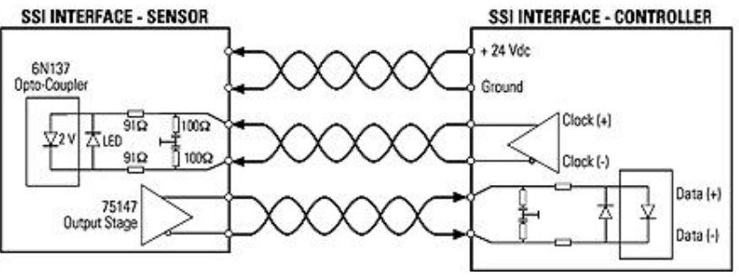
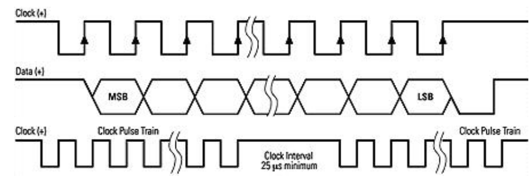
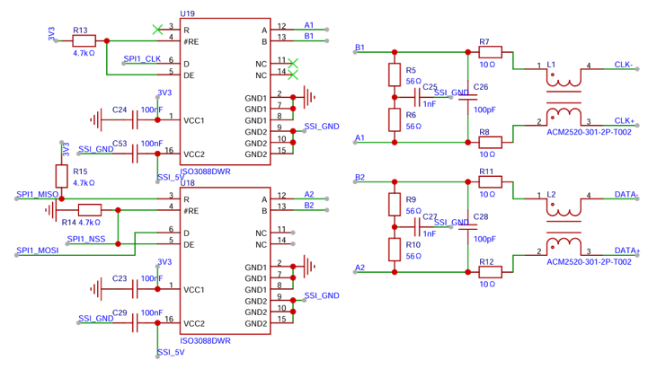
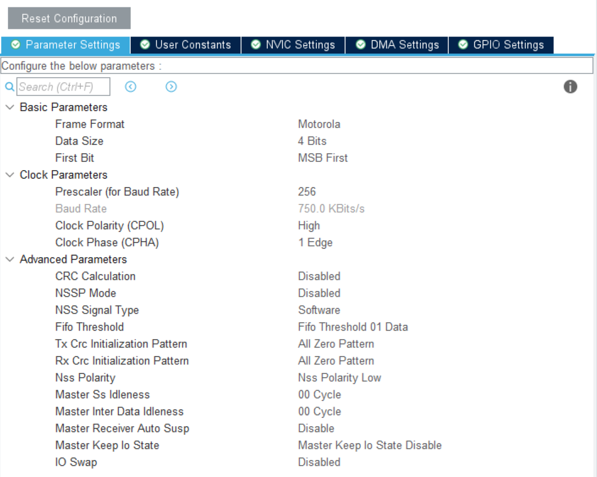
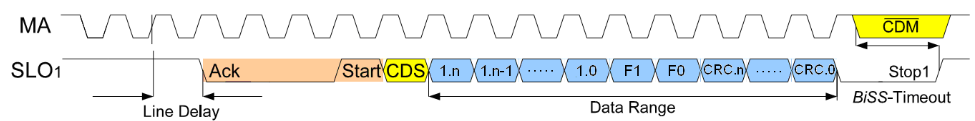

# SSI BISS_C 协议

## 1. SSI 协议

同步串行接口协议 (Synchronous Serial interface, SSI) 广泛应用在工业编码器上。

SSI 协议的硬件层是 RS422，是单向串行协议。单向时钟由主机产生，数据由从机传回主机，且不支持传输延迟补偿。

SSI 规定时钟空闲时为高电平，数据空闲时为高电平，第一个时钟脉冲固定为起始位，在时钟上升沿，数据从从机传出，时钟下降沿数据锁存，每一个时钟脉冲传出一位数据。时钟停止后，空闲一定时间后结束通信。SSI 时钟频率为 80kHz - 2MHz。

SSI 的硬件层如下，CLK 和 DATA 均为差分线，遵循 RS422 电平。

SSI 的协议层如下：

可以看到，SSI 协议和 SPI 协议类似，因此可以通过配置 SPI 实现 SSI 通信。

CLK 接入 SPI_CLK，DATA 接入 MISO。

软件配置方面，SPI 可配置为 CPOL = 1(高电平空闲)，CPHA = 0(下降沿采样)；

同时，对于多位数据，SPI 应当实现连续的时钟发送，因此可以关闭 NSSP Mode 实现连续时钟发送。

> 参考：[SPI 连续传输](https://blog.csdn.net/weixin_53403301/article/details/128116423)

此时可以使用 `HAL_SPI_Receive()` 函数进行 SSI 通信。

## 2. BISS-C 协议

BISS-C 和 SSI 的硬件层一致，其通信帧定义如下 (MA 为时钟线，SLO 为数据线)：

> - 空闲 IDLE：MA，SLO 为高电平；
>
> - 通信起始 Start Frame：主机发送时钟信号，在 MA 第一个上升沿，从机锁存传感器状态。在 MA 第二个上升沿，从机将 SL 信号拉低，用于应答主机的通信请求。 
>
>   同时由于长线延迟、信号整形、滤波以及信号传递通过多级门电路等因素的综合作用，SL 相对 MA 信号存在一定的相移，造成 SL 拉低滞后 MA 第二上升沿一段时间，这个时间被称为线路延迟，如果 SL 信号采样电路不能修正这个延迟，那么总线的通信距离和通信速率都要降低，以保证 SL 信号被可靠地采样。BISS-C 规定每个通信帧发起时都要检测一次线路延迟，并加以修正。
>
> - 发送 Transmit：SL 信号拉低后维持一段时间(ACK)，表示 Slave 响应了 MA 信号，正在进行数据准备。通常 ACK 维持 0.1us 到 8us 之间，这与从机数据是否准备就绪有关，对于特定的 从机，其 ACK 的长度是基本上是固定的。ACK 期间 MA 持续输出脉冲。然后 SL 发送 1 位的起始位(高电平)，表示从机数据准备就绪。开始数据发送。SL 会顺次发 1 位 CDS 信号，1 个单周期字段 (SCD)；BISS-C 规定单周期字段长度要大于 4 位，小于 64 位。对于特定应用，字段长度由 S从机厂商规定。这个期间，MA 持续输出脉冲。
>
> - 超时 Timeout：当 SCD 发出完成后，SL 维持 0.5 - 40us 的低电平，这个时间段被称为超时段，对于特定的应用，超时段由从机厂商规定。MA 在超时期间发送 CDM 信号，该信号一直维持到 SL 被拉高，SL 被拉高后，本次通信完全结束。

