# STM32 HAL 11_CAN

## 1. CAN 物理层

CAN 是一种半双工，异步，差分，多设备的通信方式。

CAN可分为开环总线和闭环总线，闭环总线适用于远距离通信，开环总线适用于高速通信。

- 闭环总线

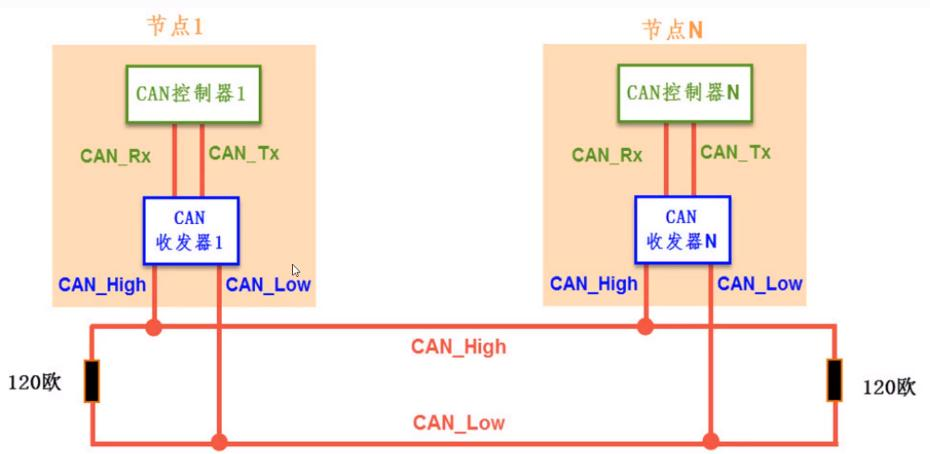

- 开环总线

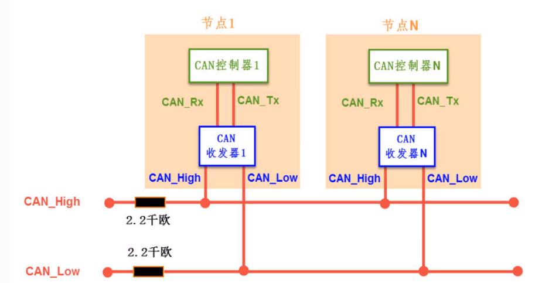

**电平标准**

- CAN（高速） 

  > 1：CAN_H 2.5V CAN_L 2.5V    
  >
  > （隐性电平）
  > 0：CAN_H 3.5V CAN_L 1.5V
  >
  > （显性电平）

- CAN（低速） 

  > 1：CAN_H 1.75V CAN_L 3.25V
  > 0：CAN_H 4.0V  CAN_L 1.0V

## 2. CAN协议层

### CAN 帧格式通信

CAN通过帧格式进行通信。

| 帧     | 帧用途                                             |
| ------ | -------------------------------------------------- |
| 遥控帧 | 用于接收单元向具有相同 ID 的发送单元请求数据的帧。 |
| 数据帧 | 用于发送单元向接收单元传送数据的帧。               |
| 错误帧 | 用于当检测出错误时向其它单元通知错误的帧。         |
| 过载帧 | 用于接收单元通知其尚未做好接收准备的帧。           |
| 帧间隔 | 用于将数据帧及遥控帧与前面的帧分离开来的帧。       |

数据帧和遥控帧有标准格式和扩展格式，标准格式有11位的ID，扩展格式有29位ID。

### CAN 数据帧结构

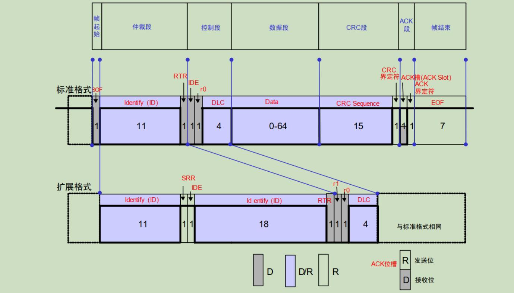

**帧起始**：一位显性电平；

**仲裁段**：表示数据优先级。

> ID : 高位在前，低位在后，禁止高7位为隐性电平。
> RTR : 远程请求位，0为数据帧，1为遥控帧。
> IDE : 标识符选择位，0为标准帧，1为扩展帧。
> SSR : 替代远程请求位，一般为1.

**控制段**：表示数据的字节数和保留段，6位。

>r0/r1 : 保留位，必须以显性电平发送，可以接受隐性电平。
>DLC : 数据长度码（0-8），表示数据发送/接受的长度（字节）。
>IDE : 标识符选择位。

**数据段**：包含0-8字节的数据，从最高位开始输出。

**CRC段**：检查帧传输错误，由15位CRC和一位界定符组成。接收方通过CRC段进行计算，不一致时会报错。

**ACK段**：应答段，由一位槽位和一位界定符组成在 ACK 槽位中，发送端发送的为隐性位，而接收端则在这一位中发送显性位以示应答。

**EOF段**：7字节，表示帧结束。

### CAN 位时序

CAN总线以位同步机制实现对电平的正确采样，位的数据由4段（**同步段SS，传播时间段PTS，相位缓冲段PBS1，相位缓冲段PBS2**）构成，每段由多个位时序构成。

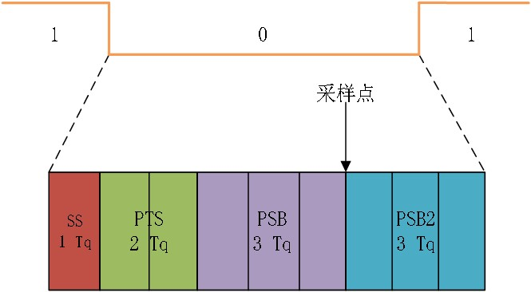

**采样点为读取总线电平，将读取到的总线电平作为位值的点。**

根据一位传输的时间（按照Tq计算），得到传输波特率。

>SS：1Tq<br>
>PTS：1-8Tq<br>
>PSB1：1-8Tq<br>
>PSB2：2-8Tq<br>

当节点检测到总线上信号的跳变沿在SS范围内，采样点电平为此位的电平。

- 数据同步

1. 硬件同步

节点通过CAN总线发送数据，一开始发送帧起始信号，总线上其他节点会检测起始信号是否在SS段内，判断内部时序是否与总线同步。

如果不在SS段内，节点会将SS段移动到检测到边沿的地方进行同步。

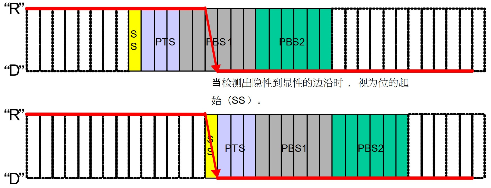

2. 再同步

再同步通过普通数据位的边沿信号进行同步。分为超前（于SS段）和滞后（于SS段）

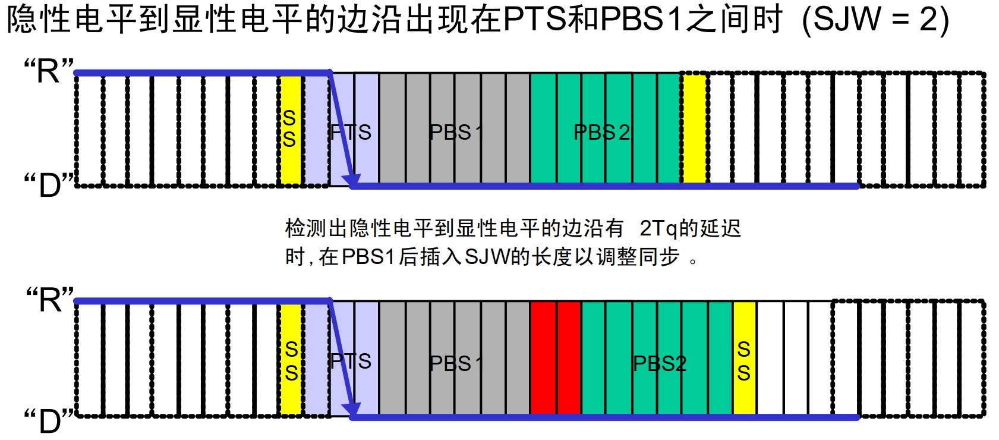

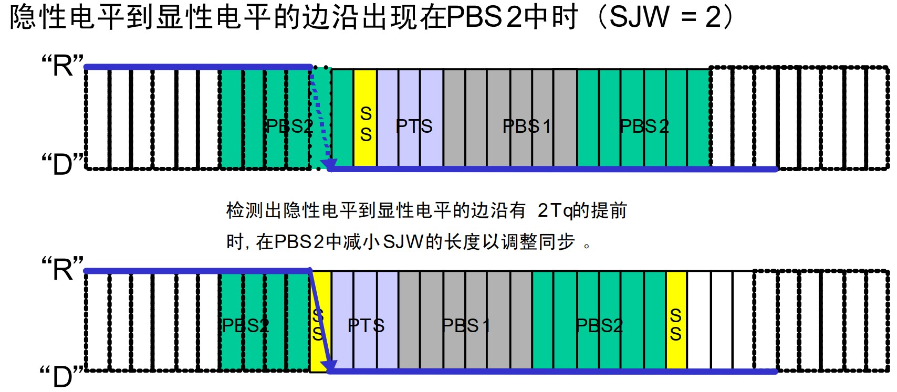

再同步时，PSB1和PSB2中增加或者减少的时间被称为再同步补偿宽度SJW,其范围为1-4Tq。

限定了SJW值后，再同步时，不能增加限定长度的SJW值。SJW值较大时，吸收误差能力更强，但是通讯速度会下降。

### CAN 的总线仲裁

CAN总线处于空闲状态时，最先发送消息的单元获得发送权。

多个单元同时开始发送时，从仲裁段(报文ID)的第一位开始进行仲裁。连续输出显性电平最多的单元可继续发送，即**首先出现隐性电平的单元失去对总线的占有权变为接收**。

## 3. STM32 CAN控制器

### CAN 工作模式

工作模式有三种：**初始化模式、正常模式和睡眠模式**。

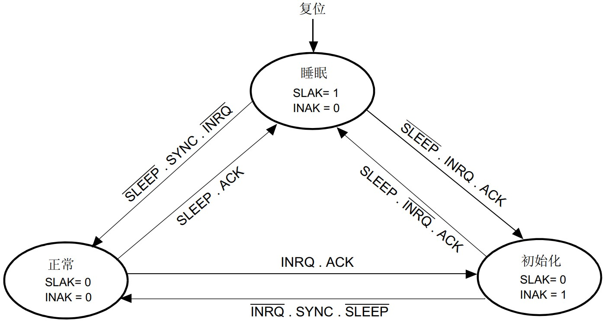

测试模式有三种：**静默模式、环回模式和环回静默模式**。

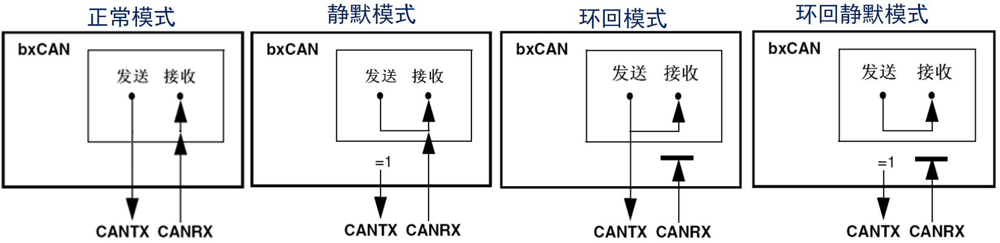

>**正常模式**：可向总线发送数据和接收数据。
>**静默模式**：只能向总线发送隐性信号，能从总线接收数据。用于统计总线流量。
>**环回模式**：能向总线发送数据，但只能接收自身发送的数据。
>**环回静默模式**：发送的数据直接到自身，向总线不发送数据，用于自检。

### CAN 控制器框图

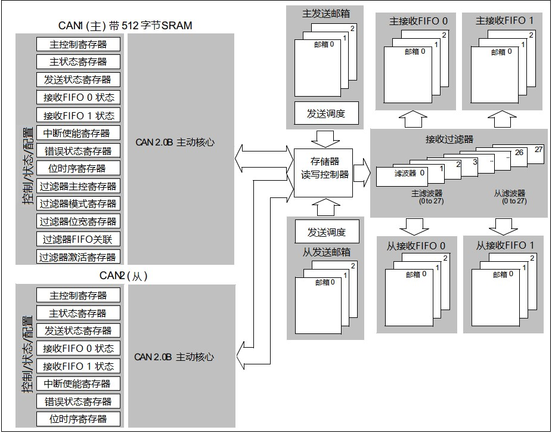

> 1. CAN内核：包含各种控制/状态/配置寄存器，用于配置模式和波特率
> 2. FIFO邮箱：缓存发送的报文。
> 3. 接收FIFO邮箱：缓存接收报文。
> 4. 接收过滤器：筛选FIFO中有效报文。

### CAN 发送和接收
1. 发送

>1. 选择空置邮箱，设置ID/DLC/DATA，放入最高优先级邮箱。<br>
>2. 邮箱退出空状态，请求数据发送。<br>
>3. 邮箱处于挂号状态，等待成为最高优先级的邮箱。<br>
>4. 邮箱处于预定发送状态，等待总线进入空闲。
>5. 总线空闲后邮箱处于发送状态，将CAN_TSR的RQCP和TXOK置1，同时变为空置。

发送优先级由邮箱中报文的标识符决定。标识符数值越低有最高优先级。如果标识符值相同，邮箱小的先被发送。

2. 数据接收

>1. FIFO空置，如果收到有效报文，挂号为1.
>2. 若未能读取，再次接收到有效报文，则挂号为2.
>3. 若未能读取，再次接收到有效报文，挂号为3.
>4. 若未能读取，再次接收到有效报文，则产生溢出，报文丢失。

3. 过滤器

当总线上报文数据量很大时，总线上的设备会频繁获取报文，占用CPU。过滤器的存在，选择性接收有效报文，减轻系统负担。

每个过滤器组都有两个32位寄存器CAN_FxR1和CAN_FxR2。根据过滤器组的工作模式不同，寄存器的作用不尽相同。

位宽可设置32位（用于扩展帧）或16位（用于标准帧）。

>| 过滤器组Reg | 32位                               | 16位（寄存器由两部分组成）          |
>| ----------- | ---------------------------------- | ----------------------------------- |
>| CAN_FxR1    | STDID[10:0]、EXTID[17:0]、IDE、RTR | STDID[10:0]、EXTID[17:15]、IDE、RTR |
>| CAN_FxR2    | STDID[10:0]、EXTID[17:0]、IDE、RTR | STDID[10:0]、EXTID[17:15]、IDE、RTR |

过滤器可设置为列表模式和掩码模式。

**列表模式**：此时两个寄存器都作为标识符寄存器，这两个标识符寄存器组成一个表，只有在此列表中的ID，才能通过筛选器，存入FIFO。
**掩码模式**：此时两个寄存器作为标识符寄存器和掩码寄存器，根据掩码寄存器指定的哪些位与标识符寄存器匹配的ID，才能通过筛选器，存入FIFO。

> 1. FSCx=1，FBMx=0：处于32位掩码模式，此时两个32位寄存器CAN_FxR1和CAN_FxR2，一个存放ID，一个存放掩码；<br>
> 2. FSCx=1，FBMx=1：处于32位列表模式，此时两个32位寄存器CAN_FxR1和CAN_FxR2，两个都存放ID，组成列表；<br>
> 3. FSCx=0，FBMx=0：处于16位掩码模式，此时两个32位寄存器CAN_FxR1和CAN_FxR2，它们各自低16位存放ID，高16位存放掩码；<br>
> 4. FSCx=0，FBMx=1：处于16位列表模式，此时两个32位寄存器CAN_FxR1和CAN_FxR2，它们各自低16位和高16位都存放ID，组成列表。

### CAN 波特率

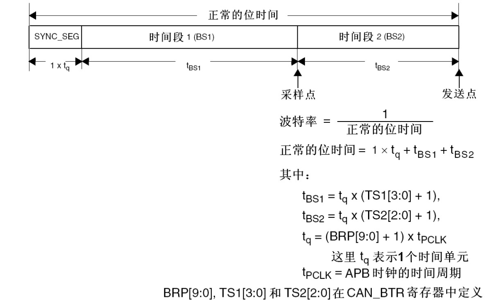
$$
Baud = \frac{1}{t_q+t_q(TS1[3:0]+1)+t_q(TS2[2:0]+1)}\\t_q = \frac{BRP+1}{f_{pck}}
$$
$f_{pck}$为CAN对应的时钟频率。

## 4. CAN 的使用

### HAL 库函数和结构体

```c
/**
  * @brief  CAN 使能函数
  * @param  hcan CAN控制器句柄 hcan1
  */
HAL_StatusTypeDef HAL_CAN_Start(CAN_HandleTypeDef *hcan);

/**
  * @brief  配置CAN接收过滤器
  * @param  hcan CAN控制器句柄 hcan1
  * @param  sFilterConfig CAN过滤器句柄
  */
HAL_StatusTypeDef HAL_CAN_ConfigFilter(CAN_HandleTypeDef* hcan, CAN_FilterConfTypeDef* sFilterConfig);

/**
  * @brief  CAN 发送
  * @param  hcan CAN控制器句柄 hcan1
  * @param  pHeader 发送报文结构体
  * @param  aData[] 要发送的数据
  * @param  pTxMailbox 发送报文使用FIFO号
  */
HAL_StatusTypeDef HAL_CAN_AddTxMessage(CAN_HandleTypeDef *hcan, CAN_TxHeaderTypeDef *pHeader, uint8_t aData[], uint32_t *pTxMailbox);

/**
  * @brief  CAN 中断使能函数
  * @param  hcan CAN控制器句柄 hcan1
  * @param  ActiveITs 中断使能类型
  */
HAL_StatusTypeDef HAL_CAN_ActivateNotification(CAN_HandleTypeDef *hcan, uint32_t ActiveITs);

/**
  * @brief  CAN 接收中断回调函数
  * @param  hcan CAN控制器句柄
  */
void HAL_CAN_RxFifo0MsgPendingCallback(CAN_HandleTypeDef *hcan);

/**
  * @brief  CAN 从FIFO接收
  * @param  hcan CAN控制器句柄 hcan1
  * @param  RxFifo 接收FIFO，CAN_RX_FIFO0， CAN_RX_FIFO1
  * @param  pHeader 接收报文结构体
  * @param  aData[] 接收的数据
  */
HAL_StatusTypeDef HAL_CAN_GetRxMessage(CAN_HandleTypeDef *hcan, uint32_t RxFifo, CAN_RxHeaderTypeDef *pHeader, uint8_t aData[]);

/**
  * @brief  CAN 报文发送结构体
  */
typedef struct
{
  uint32_t StdId;    					//标准ID
  uint32_t ExtId;    					//扩展ID
  uint32_t IDE;      					//用来决定报文是使用标准ID还是扩准ID
  uint32_t RTR;      					//用来决定报文是数据帧要是遥控帧
  uint32_t DLC;      					//数据长度，取值为0-8
  FunctionalState TransmitGlobalTime; 	//时间触发模式，开启后会自动把时间戳添加到最后两字节的数据中。目前没有用到，选择 DISABLE 
} CAN_TxHeaderTypeDef;

/**
  * @brief  CAN 过滤器结构体
  */
typedef struct
{
  uint32_t FilterIdHigh;          //CAN_FiR1寄存器的高16位
  uint32_t FilterIdLow;           //CAN_FiR1寄存器的低16位
  uint32_t FilterMaskIdHigh;      //CAN_FiR2寄存器的高16位
  uint32_t FilterMaskIdLow;       //CAN_FiR2寄存器的低16位
  uint32_t FilterFIFOAssignment;  //通过筛选器的报文存在FIFO0还是FIFO1中
  uint32_t FilterBank;            //此次配置用的是哪个筛选器。用单CAN的取值为0-13
  uint32_t FilterMode;            //掩码模式或列表模式
  uint32_t FilterScale;           //32位或16位
  uint32_t FilterActivation;      //使能或失能
  uint32_t SlaveStartFilterBank;  //CAN1和CAN2一起用的时候，为CAN2分配筛选器的个数
} CAN_FilterTypeDef;

/**
  * @brief  CAN 报文接收结构体
  */
typedef struct
{
  uint32_t StdId;    
  uint32_t ExtId;    
  uint32_t IDE;      
  uint32_t RTR;      
  uint32_t DLC;      
  uint32_t Timestamp; 
  uint32_t FilterMatchIndex; 
} CAN_RxHeaderTypeDef;

```

