# CANopen 基本原理

CAN 总线仅仅定义了物理层和数据链路层，这两层由硬件实现。但是 CAN 没有规定应用层。

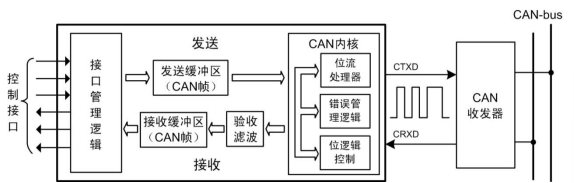

CANopen 协议定义在应用层上，支持各种 CAN 厂商设备的互用性、互换性，能够实现在 CAN 网络中提供标准的、统一的系统通讯模式，提供设备功能描述方式，执行网络管理功能。包括：

- 应用层 (Application layer)：为网络中每一个有效设备都能够提供一组有用的服务与协议。
- 通讯描述 (Communication profile)：提供配置设备、通讯数据的含义，定义数据通讯方式。
- 设备描述 (Device profile)：为设备（类）增加符合规范的行为。

## 1. CANopen 简介

CANopen 协议分为**用户应用层**，**对象字典**和**通信**三部分，其中应用字典描述了应用对象和 CANopen 报文之间的关系。

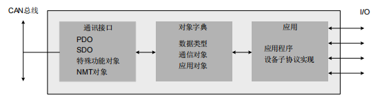

### CANopen 基本概念

- **网络管理 (NMT) 主机**

  **NMT 主机一般是 CANopen 网络中具备监控的 PLC 或者 PC (也可以是一般节点)，又称为 CANopen 主站。其余 CANopen 节点为 NMT 从机。** 

  NMT 主机和 NMT 从机之间通讯的报文就称为 NMT 网络管理报文。管理报文负责层管理、网络管理和 ID 分配服务，例如初始化、配置和网络管理（其中包括节点保护）。

  网络管理中，同一个网络中只允许有一个主节点、一个或多个从节点，并遵循主从模式。

  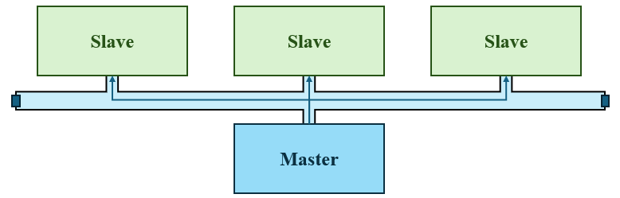
  
- **过程数据对象 PDO**
  
  PDO 是过程数据对象，采用生产消费模型，进行单向传输而无需接收节点回应 CAN 报文。
  
  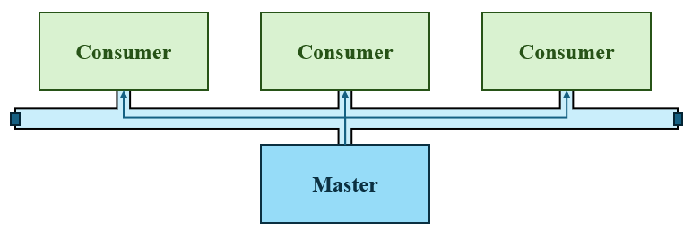
  
  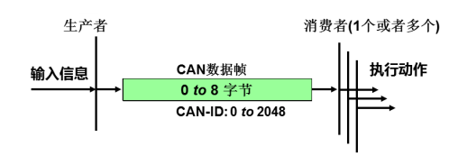
  
  节点的 PDO 共定义 8 个数据对象，由于需要区分每个 CANopen 节点的输入和输出，PDO 分为 TPDO (发送 PDO) 
  和 (接收 RPDO) (发送和接收以 CANopen 从站节点为参考)。TPDO 和 RPDO 分别有 4 个数据对象。
  
- **服务数据对象 SDO**
  
  SDO 是服务数据对象，采用服务器客户端模型，有指定被接收节点的地址，并且需要指定的接收节点回应 CAN 报文来确认已经接收，如果超时没有确认，则发送节点将会重新发送原报文。
  
  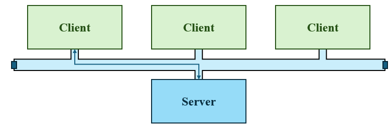
  
  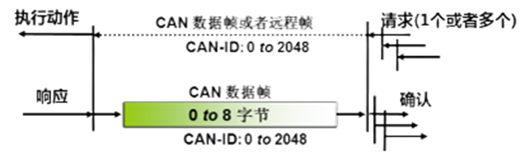
  
  NMT 主机能发起 SDO 通讯，进行节点参数配置或者关键性参数的传递。从节点也可以对其他从节点发起 SDO 通讯。
  

### CANopen 报文 ID 分类

CANopen 采用 CAN 标准帧格式，ID 为 11 位。

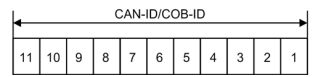

1. 特殊协议报文 ID：特殊协议报文用于协调各个节点的同步，时间，心跳和错误提示。

   | 对象             | 规范     | CAN-ID                           |
   | :--------------- | :------- | :------------------------------- |
   | NMT 网络管理命令 | CiA301   | `000h`                           |
   | 全局故障安全命令 | CiA304   | `001h`                           |
   | 动态主站         | CiA302-2 | `071h` - `076h`                  |
   | 标示活动接口     | CiA302-6 | `07Fh`                           |
   | 同步报文         | CiA301   | `080h`                           |
   | 紧急报文         | CiA301   | `081h` - `0FFh` `(080h+node-ID)` |
   | 时间戳报文       | CiA301   | `100h`                           |
   | 安全相关数据对象 | CiA301   | `101h` - `180h`                  |

2. PDO/SDO 报文 ID：CANopen 预定义了强制性的缺省标识符 (CAN-ID) 分配表，基于 11 位 CAN-ID 的标准帧格式。将其划分为 4 位的功能码和 7 位的节点号。

   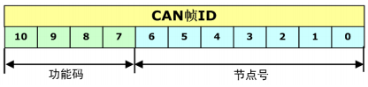

   CAN-ID 又称为 COB-ID (通信对象编号)；

   CANopen 规定了逻辑上最大 128 个节点，所以 Node-ID 最大为 128。

   | 对象                   | 规范   | CAN-ID                           |
   | :--------------------- | :----- | :------------------------------- |
   | TPDO1 发送过程数据对象 | CiA301 | `181h` - `1FFh` `(180h+node-ID)` |
   | RPDO1 接收过程数据对象 | CiA301 | `201h` - `27Fh` `(200h+node-ID)` |
   | TPDO2 发送过程数据对象 | CiA301 | `281h` - `2FFh` `(280h+node-ID)` |
   | RPDO2 接收过程数据对象 | CiA301 | `301h` - `37Fh` `(300h+node-ID)` |
   | TPDO3 发送过程数据对象 | CiA301 | `381h` - `3FFh` `(380h+node-ID)` |
   | RPDO3 接收过程数据对象 | CiA301 | `401h` - `47Fh` `(400h+node-ID)` |
   | TPDO4 发送过程数据对象 | CiA301 | `481h` - `4FFh` `(480h+node-ID)` |
   | RPDO4 接收过程数据对象 | CiA301 | `501h` - `57Fh` `(500h+node-ID)` |
   | SDO 服务数据对象响应   | CiA301 | `581h` - `5FFh` `(580h+node-ID)` |
   | SDO 服务数据对象请求   | CiA301 | `601h` - `67Fh` `(600h+node-ID)` |

### CANopen 对象字典

对象字典是 CANopen 协议中最重要的部分。**对象字典是一组参数和变量的有序集合，包含了设备描述及设备网络状态的所有参数。**

每一个 CANopen 设备都有一个对象字典，使用电子数据文档（EDS 文件）来记录这些参数。

CANopen 对象字典中的项通过一系列子协议进行描述，子协议为对象字典中的每个对象都描述了它的功能、名字、索引、子索引、数据类型，以及这个对象是否必需、读写属性等等，这样可保证不同厂商的同类型设备兼容。

CANopen 协议采用了 16 位索引和 8 位子索引的对象字典，其索引结构如下：

| 索引范围          | 描述                       |
| :---------------- | :------------------------- |
| `0000h`           | 保留                       |
| `0001h` - `025Fh` | 数据类型                   |
| `0260h` - `0FFFh` | 保留                       |
| `1000h` - `1FFFh` | 通讯对象子协议区           |
| `2000h` - `5FFFh` | 制造商特定子协议区         |
| `6000h` - `9FFFh` | 标准化设备子协议区         |
| `A000h` - `AFFFh` | 网络变量（符合IEC61131-3） |
| `B000h` - `BFFFh` | 用于路由网关的系统变量     |
| `C000h` - `FFFFh` | 保留                       |

#### 数据类型区域

| 索引范围          | 描述                                                         |
| :---------------- | :----------------------------------------------------------- |
| `0001h` – `001Fh` | 静态数据类型（标准数据类型，如 `Boolean`、`Integer16`）      |
| `0020h` – `003Fh` | 复杂数据类型（预定义由简单类型组合成的结构如 `PDOCommPar`、`SDOpartern`） |
| `0060h` – `007Fh` | 设备子协议规定的静态数据类型                                 |
| `0080h` – `009Fh` | 设备子协议规定的复杂数据类型                                 |
| `0040h` – `005Fh` | 制造商规定的复杂数据类型                                     |

#### 通讯对象子协议区

通讯对象子协议区定义了所有和通信有关的对象参数，其中通用通讯对象所有 CANopen 节点都必须具备，否则将无法加入 CANopen 网络。

| 索引范围          | 描述             |
| :---------------- | :--------------- |
| `1000h` - `1029h` | 通用通讯对象     |
| `1200h` - `12FFh` | SDO 参数对象     |
| `1300h` - `13FFh` | 安全对象         |
| `1400h` - `1BFFh` | PDO 参数对象     |
| `1F00h` - `1F11h` | SDO 管理对象     |
| `1F20h` - `1F27h` | 配置管理对象     |
| `1F50h` - `1F54h` | 程序控制对象     |
| `1F80h` - `1F89h` | 网络管理主机对象 |

> **通用通讯对象：**
>
> |  索引   | 对象数据类型 | 描述                                |
> | :-----: | :----------: | :---------------------------------- |
> | `1000h` |   VAR 变量   | 设备类型                            |
> | `1001h` |   VAR 变量   | 错误寄存器                          |
> | `1002h` |   VAR 变量   | 制造商状态寄存器                    |
> | `1013h` |  ARRAY 数组  | 预定义错误场                        |
> | `1005h` |   VAR 变量   | 同步报文 COB 标识符                 |
> | `1006h` |   VAR 变量   | 同步通信循环周期（单位 us）         |
> | `1007h` |   VAR 变量   | 同步窗口长度 (单位 us)              |
> | `1008h` |   VAR 变量   | 制造商设备名称                      |
> | `1009h` |   VAR 变量   | 制造商硬件版本                      |
> | `100Ah` |   VAR 变量   | 制造商软件版本                      |
> | `100Ch` |   VAR 变量   | 守护时间（单位 ms）                 |
> | `100Dh` |   VAR 变量   | 寿命因子（单位 ms）                 |
> | `1010h` |   VAR 变量   | 保存参数                            |
> | `1011h` |   VAR 变量   | 恢复默认参数                        |
> | `1012h` |   VAR 变量   | 时间报文 COB 标识符（发送网络时间） |
> | `1013h` |   VAR 变量   | 高分辨率时间标识                    |
> | `1014h` |   VAR 变量   | 紧急报文 COB 标识符                 |
> | `1015h` |   VAR 变量   | 紧急报文禁止时间（单位 100us）      |
> | `1016h` |  ARRAY 数组  | 消费者心跳时间间隔 (单位 ms)        |
> | `1017h` |   VAR 变量   | 生产者心跳时间间隔（单位 ms）       |
> | `1018h` | RECORD 记录  | 厂商 ID 标识对象                    |
> | `1019h` |   VAR 变量   | 同步计数器溢出值                    |
> | `1020h` |  ARRAY 数组  | 验证配置                            |
> | `1021h` |   VAR 变量   | 存储 EDS                            |
> | `1022h` |   VAR 变量   | 存储格式                            |
> | `1023h` | RECORD 记录  | 操作系统命令                        |
> | `1024h` |   VAR 变量   | 操作系统命令模式                    |
> | `1025h` | RECORD 记录  | 操作系统调试接口                    |
> | `1026h` |  ARRAY 数组  | 操作系统提示                        |
> | `1027h` |  ARRAY 数组  | 模块列表                            |
> | `1028h` |  ARRAY 数组  | 紧急报文消费者                      |
> | `1029h` |  ARRAY 数组  | 错误行为                            |

#### 制造商特定子协议

制造商特定子协议通常存放所应用子协议的应用数据，而通讯对象子协议区存放这些应用数据的通信参数，二者形成映射关系。

对于在设备子协议中未定义的特殊功能，制造商也可以在此区域根据需求定义对象字典对象。

#### 标准化设备子协议

标准化设备子协议为各种行业不同类型的标准设备定义对象字典中的对象。目前已有十几种为不同类型的设备定义的子协议，例如 DS401、DS402、DS406 等。

### NMT 和 CANopen 主站

每个 CANopen 从节点的 CANopen 协议栈中，必须具备 NMT 管理的相应代码。

#### NMT 节点状态

NMT 管理定义了 CANopen 节点从上电之后的 6 种状态：

> - **初始化**：节点上电后对功能部件包括 CAN 控制器进行初始化；
> - **应用层复位**：节点中的应用程序复位，比如开关量输出、模拟量输出的初始值；
> - **通讯复位**：节点中的 CANopen 通讯复位，此节点可以进行CANopen通讯。
> - **预操作状态**：节点的 CANopen 通讯处于操作就绪状态，此时此节点不能进行 PDO 通信，而可以进行 SDO 进行参数配置和 NMT 网络管理的操作；
> - **操作状态**：节点收到 NMT 主机发来的启动命令后，CANopen 通讯被激活，PDO 通信启动后，按照对象字典里面规定的规则进行传输，同样 SDO 也可以对节点进行数据传输和参数修改；
> - **停止状态**：节点收到 NMT 主机发来的停止命令后，节点的 PDO 通信被停止，但 SDO 和 NMT 网络管理依然可以对节点进行操作；

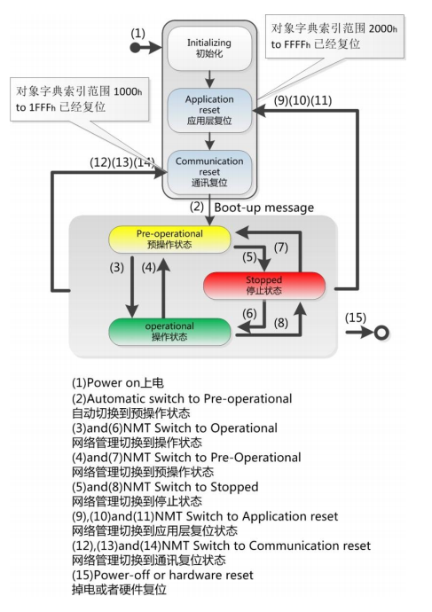

- NMT 节点上线报文：

  任何一个 CANopen 从站上线后，为了提示主站它已经加入网络（便于热插拔），或者
  避免与其他从站 Node-ID 冲突，从站必须发出节点上线报文（boot-up）。

  节点上线报文的 ID：`700h + Node-ID`，数据为一个字节 0。

  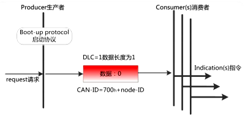

- NMT 节点状态与心跳报文：

  为了监控 CANopen 节点是否在线与目前的节点状态。CANopen 应用中通常都要求在线上电的从站定时发送状态报文（心跳报文），以便于主站确认从站是否故障、是否脱离网络。

  节点状态与心跳报文的 ID：`700h + Node-ID`，数据为一个字节，代表节点状态。

  `04h` - 停止状态；`05h` - 操作状态；`7Fh` - 预操作状态。

  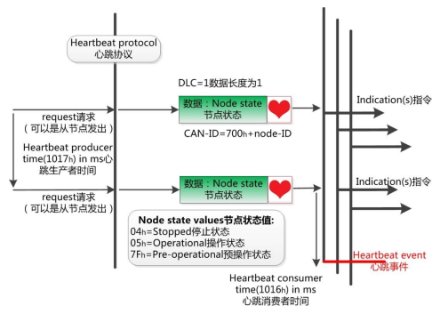

  CANopen 从站按其对象字典中 `1017h` 中填写的心跳生产时间进行心跳报文的发送，而 CANopen 主站（NMT 主站）则会按其 `1016h` 中填写的心跳消费时间进行检查，假设超过若干次心跳消费时间没有收到从站的心跳报文，则认为从站已经离线或者损坏。

  > **NMT 节点守护：**
  >
  > 在早期 CANopen 应用中，还有一种可以通过轮询模式监视从站状态的节点守护模式，它与心跳报文模式二者不能并存。通过节点守护，MNT 主机可以检查每个节点的当前状态。
  >
  > 主站发送标准远程帧，无数据：
  >
  > 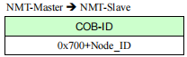
  >
  > 从站发送应答数据帧，数据为 1 个字节：
  >
  > 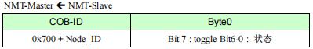
  >
  > 数据部分包括一个触发位（bit7），触发位必须在每次节点保护应答中交替置 0 或者 1。触发位在第一次节点守护请求时置为 0。位 0 - 位 6 表示节点状态：
  >
  > 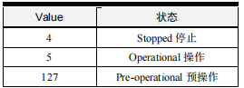
  >
  > 由于远程帧在 CAN 发展中逐渐被淘汰，而节点守护由于需要更多的主站开销与增加网络负载，CiA 协会已经不建议使用，被心跳报文所取代。

- NMT 节点状态切换命令

  NMT 节点状态切换命令是用于主站的网络管理报文。

  节点状态切换命令的 ID：`000h`，数据为 2 个字节：

  1. 字节 1：命令类型

     | 值    | 命令类型                                            |
     | ----- | --------------------------------------------------- |
     | `01h` | 启动命令 - 节点进入操作状态                         |
     | `02h` | 停止命令 - 节点进入停止状态                         |
     | `80h` | 预操作命令 - 节点进入预操作状态                     |
     | `81h` | 应用层复位命令 - 节点的应用恢复初始状态             |
     | `82h` | 通讯复位命令 - 节点的 CAN 和 CANopen 通讯重新初始化 |

  2. 字节 2：目标 Node-ID

     如果要对整个网络所有节点同时进行控制，这个值为 0 即可。

  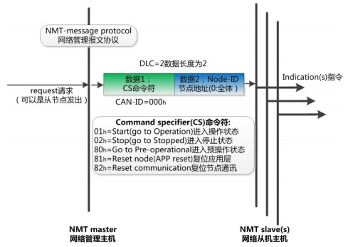

### 过程数据对象 PDO

PDO 用于传输实时数据，单向传输，无需接收。

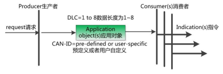

> 只要符合 PDO 范围内的所有 CANID 都可以作为节点自身的 TPDO 或者 RPDO 使用，也称为 COB-ID，不受功能码和 Node-ID 限制。
>
> 同时也预定义了一些 COB-ID，规定了 Node-ID 在 PDO 中的位置。

PDO 分为 TPDO（发送 PDO）和 RPDO (接收 PDO)，发送和接收是以 CANopen 节点自身为参考。TPDO 和 RPDO 分别有 4 个数据对象，每种数据对象就是 1 条 CAN 报文封装。

如果某个节点需要传递的资源特别多，导致预定义的 TPDO 或者 RPDO 不够用，它们的 CAN-ID 定义就需要打破预定义规则，由用户自行命名。

- PDO 传输形式：

  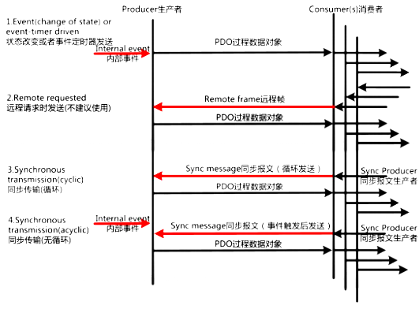

  1. 异步传输 - 特定事件触发：

     两种触发方式，第一种是由设备子协议中规定的对象特定事件来触发（例如，定时传输，数据变化传输等）；第二种是通过发送与 PDO 的 COB-ID 相同的远程帧来触发 PDO的发送。基本采用第一种。

  2. 同步传输 - 通过接收同步对象实现同步：

     通过同步报文让所有节点能在同一时刻进行上传数据或者执行下达的应用指令，可以有效避免异步传输导致的应用逻辑混乱和总线负载不平衡的问题。一般发送同步报文的节点是 NMT 主机。

     同步传输又可分为周期传输和非周期传输。周期传输则是通过接收同步对象来实现，可以设置 1 - 240 个同步对象触发。非周期传输是由远程帧预触发或者由设备子协议中规定的对象特定事件预触发传送。

- PDO 通信参数：

  PDO 通信参数定义了该设备所使用的 COB-ID、传输类型、定时周期等。
  
  RPDO 通讯参数位于对象字典索引的 `1400h` - `15FFh`，TPDO 通讯参数位于对象字典索引的 `1800h` - `19FFh`。
  
  每条索引代表一个 PDO 的通信参数集，其中的子索引分别指向具体的各种参数。
  
  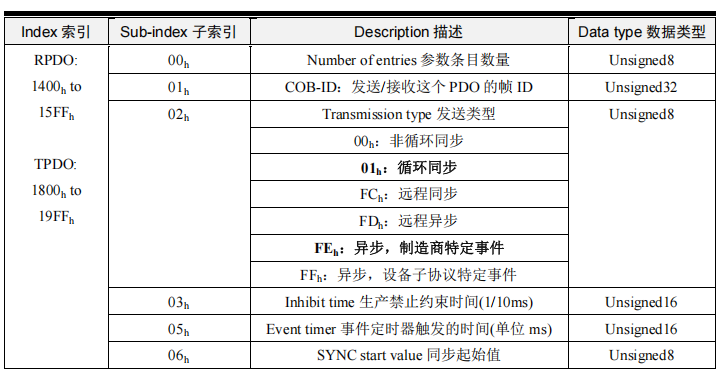
  
  > - `00h` - 参数条目数量：本索引中有几条参数；
  > - `01h` - COB-ID：PDO 发出或者接收的对应 CAN 帧 ID；
  > - `02h` - 发送类型：PDO 发送或者接收的传输形式；
  > - `03h` - 生产禁止约束时间：约束 PDO 发送的最小间隔，单位为 0.1ms；
  > - `05h` - 事件定时器触发事件：定时发送 PDO 的定时时间；如果为 0，PDO 为事件改变发送。
  > - `06h` - 同步起始值：同步传输的 PDO，收到若干个同步包后，才进行发送。
  
- PDO 映射参数：

  PDO 映射参数包含了对象字典中的对象列表，将这些对象映射到对应的 PDO (将 CAN 报文中的数据和对象字典数据进行映射)。

  RPDO 通讯参数在 `1400h` - `15FFh`，映射参数在 `1600h` - `17FFh`，数据存放为 `2000h` 之后厂商自定义区域；

  TPDO 通讯参数在 `1800h` - `19FFh`，映射参数在 `1A00h` - `1BFFh`，数据存放为 `2000h` 之
  后厂商自定义区域。

  映射参数的子索引下存储一个 32 位数值，数值定义了 PDO 数据段中对应位置的数据是来自驱动器对象字典中的哪个对象、哪个子索引，以及该数据的位长度。

  > - Bit 31 - Bit 16 - 对象索引：要映射的对象的索引号；
  > - Bit 15 - Bit 08 - 子索引：要映射的对象的子索引号；
  > - Bit 07 - Bit 00 - 数据大小：该对象数据在 PDO 报文中所占的位数 （INT32 - 20h；INT16 - 10h；BOOLEAN / UNSIGNED8 - 08h）。

  > **实例：**
  >
  > 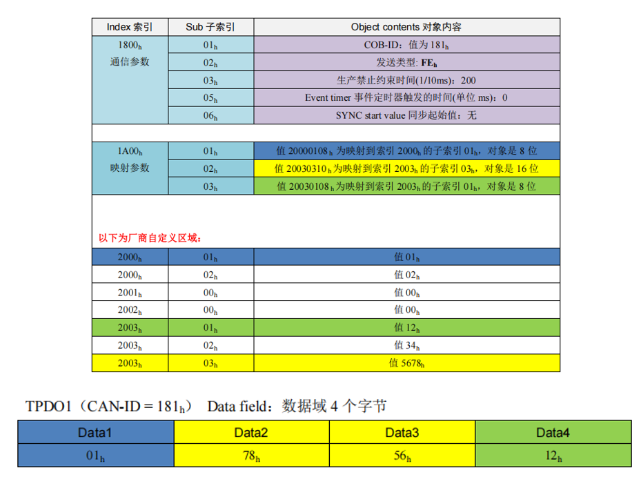

### 服务数据对象 SDO

SDO 主要用于 CANopen 主站对从节点的参数配置。SDO 为每个消息都生成一个应答，确保数据传输的准确性。

SDO 客户端通过索引和子索引，能够访问 SDO 服务器上的对象字典。这样 CANopen 主站可以访问从节点的任意对象字典项的参数，并且 SDO 也可以传输任何长度的数据。

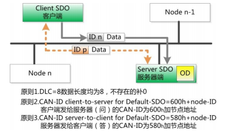

> 发送方(客户端)发送报文 ID：`600h + Node-ID`，`Node-ID` 为服务端地址，数据长度 8 字节；
>
> 接收方(服务端)回应报文 ID：`580h + Node-ID`，`Node-ID` 为服务端地址，数据长度 8 字节。

- 快速 SDO 协议：读取和写入的值不能大于 32 位。

  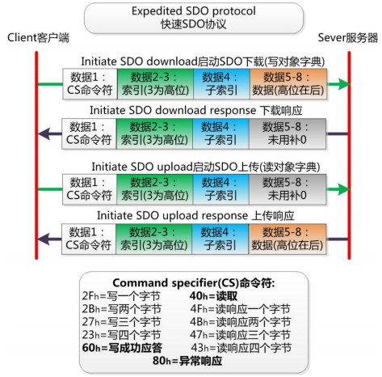

- 普通 SDO 协议：读取/写入的值大于 32 位，进行分帧传输。

  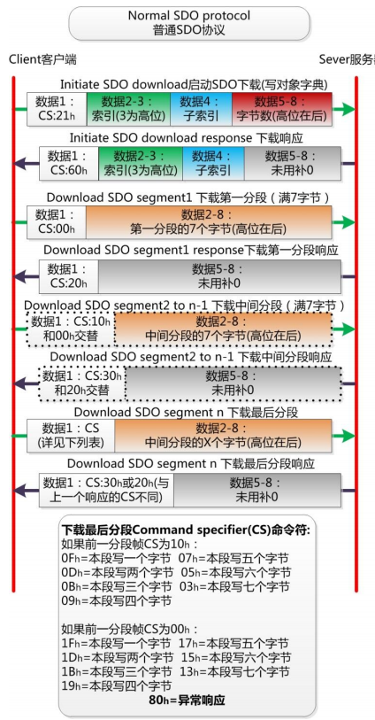

  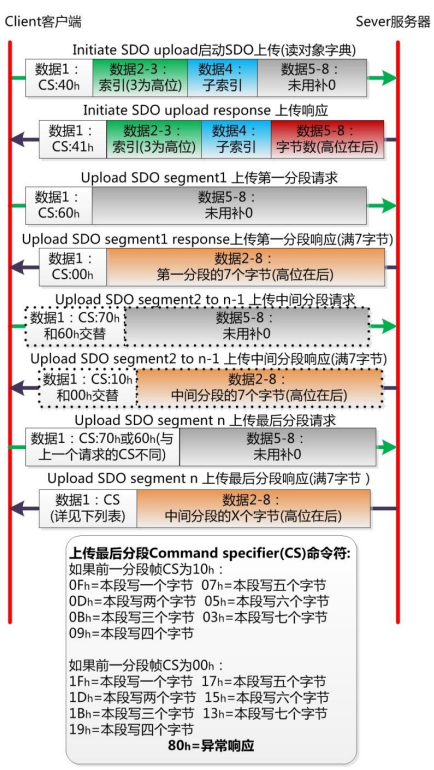

  

### 特殊协议

#### 同步协议

实现整个网络的同步传输。每个节点都以同步报文作为 PDO 触发参数，因此同步报文的 COB-ID 具有比较高的优先级以及最短的传输时间。 一般选用 `80h` 作为同步报文的 CAN-ID。

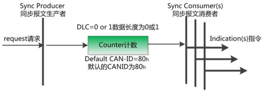

一般同步报文由 NMT 主机发出，CAN 报文的数据为 0 字节。但如果一个网络内有 2 个同步机制，就需要设置不同的同步节拍。

> - 同步窗口时间 `1007h`：约束同步帧发送后，从节点发送 PDO 的时效，即在这个时间内发送的 PDO 才有效，超过时间的 PDO 将被丢弃；
>
> - 通讯循环周期 `1006h`：规定了同步帧的循环周期。

#### 时间戳协议

NMT 主机发送自身的时钟为网络各个节点提供公共的时间参考。时间戳协议采用广播方式，无需节点应答。

时间戳报文的 ID 为 `100h`，数据为 6 个字节，值为当前时刻与 1984 年 1 月 1 日 0 时的时间差，存储在对象字典 `1012h` 中。

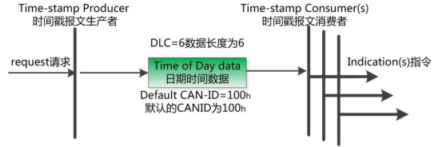

#### 紧急报文协议

当设备内部发生错误触发该对象发送设备内部错误代码提示 NMT 主站。

紧急报文的 ID 为 `80h + Node-ID`，数据为 8 个字节。

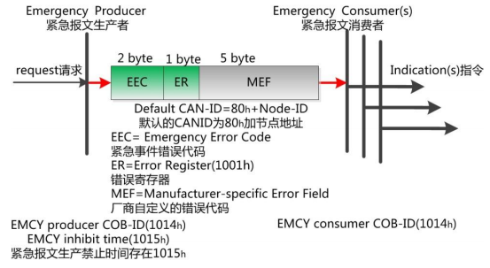

> - EEC：紧急时间错误代码；
> - ER：错误寄存器；
> - MEF：厂商自定义的错误代码。

紧急报文也有生产禁止时间，存储在对象字典 `1015h` 中，为了限制节点不断发送紧急报文，导致总线负载过大。