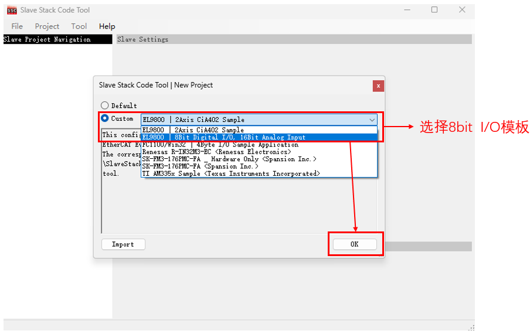
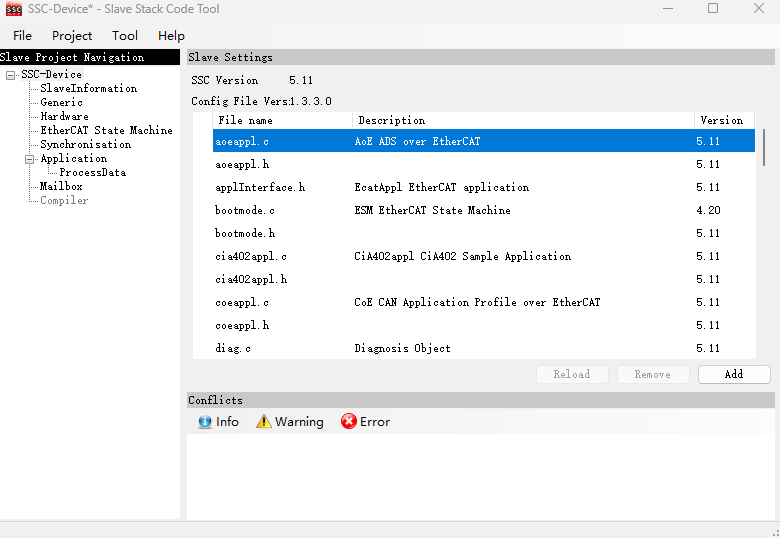
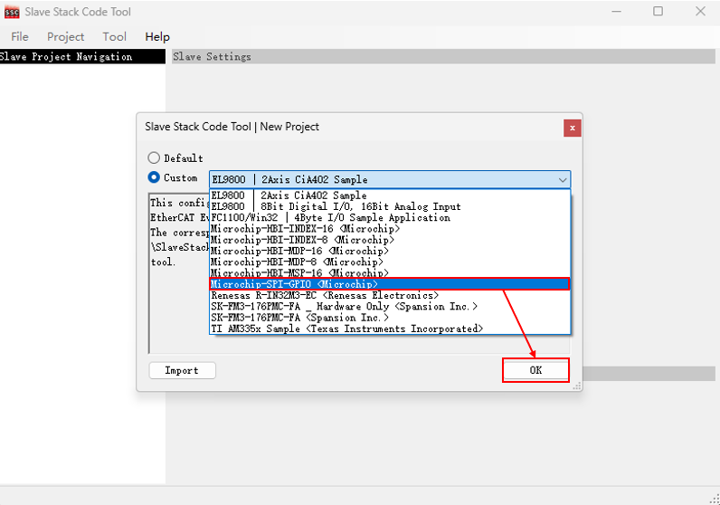
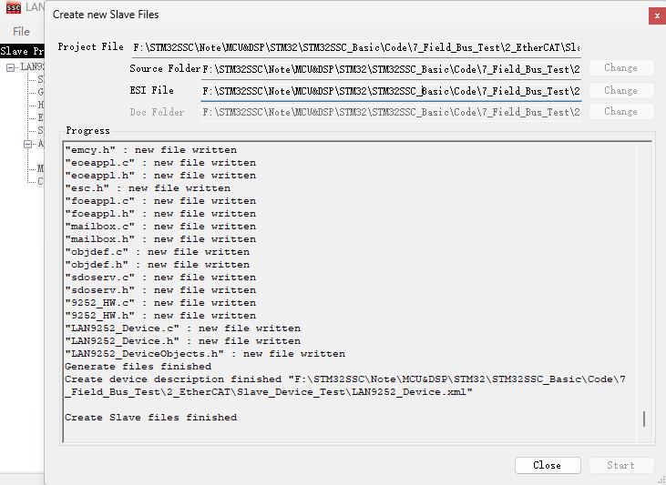
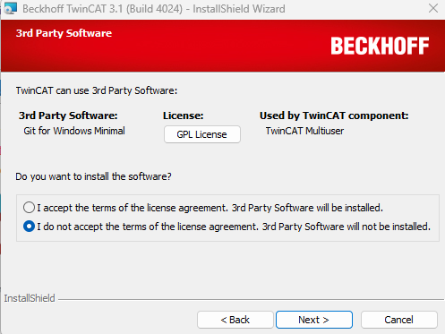
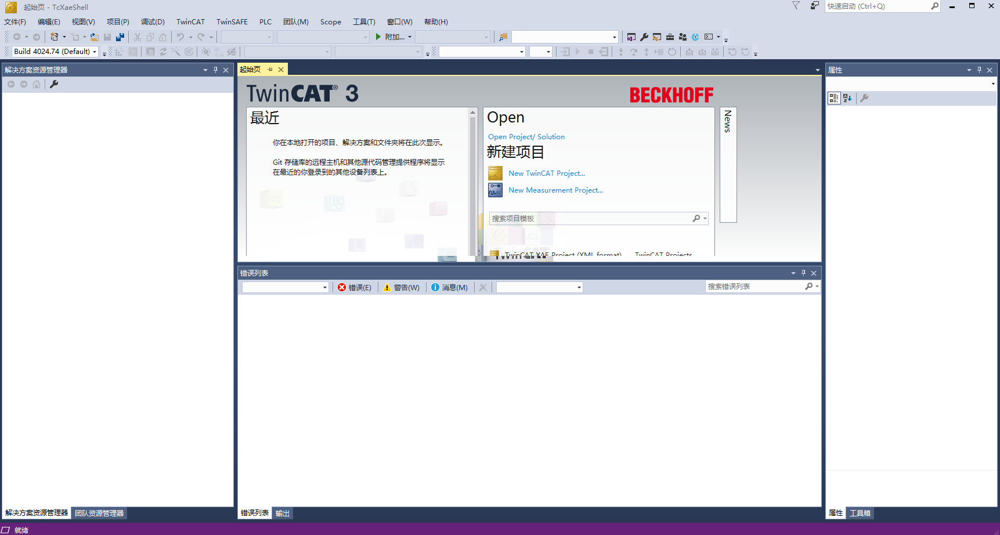
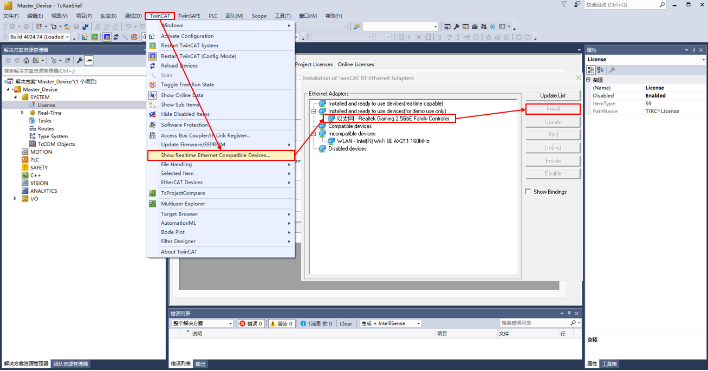

# EtherCAT 从站实现

## 1. EtherCAT 从站硬件

### EtherCAT 从站芯片

EtherCAT 从站硬件架构如下：

ESC 具有各类应用层寄存器供主站访问，但实际不执行具体的应用层操作，从站应用层的管理由专门的 MCU 进行。

ESC 根据倍福公司的 IP core 设计，常见的 ESC 芯片如下：

1. 纯 ESC 芯片 - MCU 外接

   | 型号         | 厂商      | 特点                                      | 适用场景                 |
   | ------------ | --------- | ----------------------------------------- | ------------------------ |
   | ET1100       | Beckhoff  | 业界标杆，3端口，8/16位并行总线或SPI      | 通用工业设备，伺服驱动器 |
   | ET1200       | Beckhoff  | ET1100 的低成本版，2端口                  | 简单 IO 模块，传感器     |
   | LAN9252      | Microchip | 集成双 PHY，2端口，SPI/并行接口，高性价比 | 分布式 IO，小型从站      |
   | LAN9253/9254 | Microchip | LAN9252 升级版，支持电缆诊断              | 高可靠性应用             |
   | AX58100      | ASIX      | 台湾厂商，集成 PHY，价格优势明显          | 成本敏感型设备           |

2. SoC 集成方案 - ESC + MCU

   | 型号         | 厂商          | 内核          | 特点                                                  |
   | ------------ | ------------- | ------------- | ----------------------------------------------------- |
   | R-IN32M3-EC  | Renesas       | ARM Cortex-M3 | 集成工业以太网交换机，双核架构（RX72N 也有 ESC 版本） |
   | XMC4800/4300 | Infineon      | ARM Cortex-M4 | 部分型号集成 ESC 外设，需配合专用 PHY 芯片            |
   | FSPM系列     | Fuji Electric | ARM Cortex-M3 | 日系厂商方案，适合电机控制                            |

3. FPGA 方案

   使用 Beckhoff IP Core 或者 EtherCAT IP Core。

## 2. EtherCAT 软件协议栈

从站帧的链路层功能都是由 ESC 完成的。从站软件运行在 MCU 中，主要执行的是应用层的操作。MCU 通过 PDI 接口读取 ESC 中的 PDO 和 SDO 数据，然后执行应用层的处理。MCU 需要一套协议栈执行相关的逻辑，称为软件协议栈。

商业协议栈主要有以下几种：

| 协议栈                          | 厂商              | 特点                                                         |
| ------------------------------- | ----------------- | ------------------------------------------------------------ |
| EtherCAT Slave Stack Code (SSC) | Beckhoff (ETG)    | 官方参考实现，功能最完整，需通过 ETG 获取授权，支持所有 EtherCAT 功能 |
| EC-Master / EC-Slave            | Acontis           | 德国公司，提供完整的主从站协议栈，支持多种操作系统           |
| EtherCAT Slave Stack            | Hilscher          | 德国工业通讯专家，提供NetX芯片配套的协议栈                   |
| KPA EtherCAT                    | KPA (俄罗斯/德国) | 提供主站和从站协议栈，兼容性好                               |
| tenAsys INtime EtherCAT         | Intel/tenAsys     | 针对实时 Windows 环境的方案                                  |

而开源协议栈如下：

| 协议栈 | 开发者  | 特点                                                         |
| ------ | ------- | ------------------------------------------------------------ |
| SOES   | RT-Labs | 最知名的开源从站栈，用 C 语言编写，代码简洁，支持多种 RTOS 和裸机环境，遵循 BSD 许可证 |

> - SSC 支持几乎所有应用层协议栈 (EoE，CoE，FoE) 等，同时还提供了对专有协议 CIA402 等的支持。SSC 还提供了专门的工具来配置协议栈和 PDO。SSC 是针对 BeckHoff 的 PIC 和 ET1100 芯片编写的，如果使用 STM32 或者其他通用处理器，需要手工移植代码。
> - SOES 支持 EoE 和 CoE 这两种较为常用的应用层协议，同时支持静态和动态的 PDO 映射。 SOES 的代码相较于 SSC 精简很多，代码可移植性较好。

### 基于 SSC 的 EtherCAT 从站配置

1. 安装 SSC_V5.11 工具

   没有特殊要求，直接下载即可。

2. 新建工程并进行配置

   

   

   配置项如下：
   
   - SlaveInformation
   
     | 配置项                | 值                                                       | 说明                                                         |
     | --------------------- | -------------------------------------------------------- | ------------------------------------------------------------ |
     | VENDOR\_ID            | 0xE0000002                                               | 厂商 ID，ETG 组织中请，研究测试阶段可以修改 (对象字典 0x1018.SI1) |
     | VENDOR\_NAME          | Beckhoff Automation GmbH & Co. KG - Development Products | 厂商名字                                                     |
     | VENDOR\_IMAGE         | BMP 文件二进制格式                                       | 厂商图标                                                     |
     | GROUP\_NAME           | SSC\_Device                                              | 组名字，用以区分从站设备的类型                               |
     | GROUP\_IMAGE          | BMP文件二进制格式                                        | 组图标                                                       |
     | DEVICE\_IMAGE         | BMP文件二进制格式                                        | 设备图标                                                     |
     | PRODUCT\_CODE         | 0x26483052                                               | 产品代码信息 (对象字典 0x1018.SI2)                           |
     | REVISION\_NUMBER      | 0x00030111                                               | 产品的修订版本号 (对象字典 0x1018.SI3)                       |
     | SERIAL\_NUMBER        | 0x00000000                                               | 产品的系列版本号 (对象字典 0x1018.SI4)                       |
     | DEVICE\_PROFILE\_TYPE | 0x00001389                                               | 产品配置文件类型 (对象字典 0x1000)                           |
     | DEVICE\_NAME          | SSC-Device                                               | 设备名称 (对象字典 0x1008)                                   |
     | DEVICE\_HW\_VERSION   | n.a.                                                     | 设备的硬件版本号 (对象字典 0x1009)                           |
     | DEVICE\_SW\_VERSION   | 5.12                                                     | 设备的软件版本号 (对象字典 0x100A)                           |
     
   - Generic
   
     | 配置项                       | 值   | 说明                                           |
     | ---------------------------- | ---- | ---------------------------------------------- |
     | SYSTEM\_HEADER\_FILE         | -    | 系统头文件，一般包含在 `ecat\_def.h` 文件中    |
     | EXPLICIT\_DEVICE\_ID         | 0    | 是否显示设备 ID                                |
     | ESC\_SM\_WD\_SUPPORTED       | 1    | 是否开启同步管理器看门狗设置                   |
     | STATIC\_OBJECT\_DIC          | 0    | 对象存储方式是否为静态，参数意义不大，一般是 0 |
     | ESC\_EEPROM\_ACCESS\_SUPPORT | 0    | 是否支持总线访问 EEPROM                        |

   - HardWare
   
     | 配置项                  | 值    | 说明                                                         |
     | ----------------------- | ----- | ------------------------------------------------------------ |
     | EL9800\_HW              | 1     | 倍福硬件评估板卡 EL9800\_HW 评估板                           |
     | MCI\_HW                 | 0     | -                                                            |
     | FC1100\_HW              | 0     | FC1100 X86 工控机 Windows 系统                               |
     | HW\_ACCESS\_FILE        | -     | 用户需要包含的硬件接口文件                                   |
     | CONTROLLER\_16BIT       | 1     | 从站微控制器是否为 16 位控制器                               |
     | CONTROLLER\_32BIT       | 0     | 从站微控制器是否为 32 位控制器                               |
     | \_PIC18                 | 0     | Microchip PIC18F452 专用代码，该处理器安装在 Beckoff 从站评估板上 (硬件版本最高 EL9800_2) |
     | \_PIC24                 | 1     | Microchip PIC24HJ128GP306 专用代码，该处理器安装在 Beckoff 从站评估板上 (硬件版本最高 EL9800_4A) |
     | ESC\_16BIT\_ACCESS      | 1     | 微控制器只支持 16 位访问 ESC                                 |
     | ESC\_32BIT\_ACCESS      | 0     | 微控制器只支持 32 位访问 ESC                                 |
     | MBX\_16BIT\_ACCESS      | 1     | 微控制器只支持 16 位访问本地邮箱存储器                       |
     | BIG\_ENDIAN\_16BIT      | 0     | 微控制器始终以 16 位访问外部存储器，并以大端模式运行。高字节-低字节切换由硬件完成。 |
     | BIG\_ENDIAN\_FORMAT     | 0     | 微控制器是否支持大端模式；如果启用，则 BIG\_ENDIAN\_16BIT 应复位。 |
     | EXT\_DEBUGER\_INTERFACE | 0     | 是否激活 EL9800_4A 的外部调试器接口 _PIC24；如果未设置 _PIC24，该定义应忽略 |
     | UC\_SET\_ECAT\_LED      | 0     | 是否开启状态指示灯控制，如果设置了状态指示灯，则由微控制器设置。如果设置了 ESC_SUPPORT_ECAT_LED，则应复位 |
     | ESC\_SUPPORT\_ECAT\_LED | 0     | 如果所连接的 ESC 是否支持错误和运行指示灯功能；如果设置了 UC_SET_ECAT_LED，则应复位 |
     | ESC\_EEPROM\_EMULATION  | 0     | 是否支持 EEPROM 仿真                                         |
     | CREATE\_EEPROM\_CONTENT | 0     | 是否支持 EEPROM 内容创建，默认 0；如果启用 EEPROM 仿真，则应启用该设置 |
     | ESC\_EEPROM\_SIZE       | 0x500 | 硬件/模拟 EEPROM 所需大小，单位为字节                        |
   
   
   - EtherCAT State Mechine
   
     | 配置项                      | 值     | 说明                                                         |
     | --------------------------- | ------ | ------------------------------------------------------------ |
     | BOOTSTRAPMODE\_SUPPORTED    | 0      | 是否需要固件升级 FOE，如果设置该项，则应设置 FOE_SUPPORTED   |
     | OP\_PD\_REQUIRED            | 1      | 如果没有收到进程数据，复位该开关后，状态转换 SAFEOP -> OP 将成功。看门狗在收到第一个进程数据时激活 |
     | PREOPTIMEOUT                | 0x7D0  | INIT -> PREOP/BOOT 状态转化超时时间 (ms)                     |
     | SAFEOP2OPTIMEOUT            | 0x2328 | SAFEOP -> OP 状态转化超时时间 (ms)                           |
     | CHECK\_SM\_PARAM\_ALIGNMENT | 0      | 检查 SM 的相关参数 (长度，起始地址) 是否按要求对齐           |

   - Synchronisation

     | 配置项                            | 值         | 说明                                             |
     | --------------------------------- | ---------- | ------------------------------------------------ |
     | AL\_EVENT\_ENABLED                | 1          | 应用层中断是否使能                               |
     | DC\_SUPPORTED                     | 1          | 是否支持分布式时钟                               |
     | ECAT\_TIMER\_INT                  | 1          | 是否使用外部定时器中断，用于看门狗超时和状态检测 |
     | MIN\_PD\_CYCLE\_TIME              | 0x7A12C    | 过程数据最小的循环时间 (ns)                      |
     | MAX\_PD\_CYCLE\_TIME              | 0xC3500000 | 过程数据最大的循环时间 (ns)                      |
     | PD\_OUTPUT\_DELAY\_TIME           | 0x0        | 过程数据输出延迟时间 (ns)                        |
     | PD\_OUTPUT\_CALC\_AND\_COPY\_TIME | 0x0        | 过程输出数据计算和拷贝时间 (ns)                  |
     | PD\_INPUT\_CALC\_AND\_COPY\_TIME  | 0x0        | 过程输入数据计算和拷贝时间 (ns)                  |
     | PD\_INPUT\_DELAY\_TIME            | 0x0        | 过程输入数据延迟时间 (ns)                        |
   
   - Application
   
     | 配置项                         | 值   | 说明                                                         |
     | ------------------------------ | ---- | ------------------------------------------------------------ |
     | TEST\_APPLICATION              | 0    | 不用于创建用户应用程序，测试从站堆栈或者主站实现             |
     | EL9800\_APPLICATION            | 1    | 如果在 EL9800_x 评估板上运行，应置位该值                     |
     | CiA402\_DEVICE                 | 0    | 激活 CIA402 设备配置文件                                     |
     | SAMPLE\_APPLICATION            | 0    | 激活独立于硬件的示例程序                                     |
     | SAMPLE\_APPLICATION\_INTERFACE | 0    | 是否支持样本应用的接口文件 win32 动态链接                    |
     | BOOTLOADER\_SAMPLE             | 0    | 是否支持 BOOTLOADER 例程                                     |
     | APPLICATION\_FILE              | -    | 应用文件，一般用于非模板工程需要加载的应用文件，例如 `"#include "myapplication.h"` |
     | USE\_DEFAULT\_MAIN             | 1    | 是否使用默认的 `main` 函数接口                               |
   
   - ProcessData
   
     | 配置项                  | 值     | 说明                 |
     | ----------------------- | ------ | -------------------- |
     | MIN\_PD\_WRITE\_ADDRESS | 0x1000 | 过程数据最小写地址   |
     | DEF\_PD\_WRITE\_ADDRESS | 0x1100 | 默认过程数据写地址   |
     | MAX\_PD\_WRITE\_ADDRESS | 0x2FFF | 最大过程数据写地址   |
     | MIN\_PD\_READ\_ADDRESS  | 0x1000 | 过程数据最小读地址   |
     | DEF\_PD\_READ\_ADDRESS  | 0x1400 | 默认过程数据读地址   |
     | MAX\_PD\_READ\_ADDRESS  | 0x2FFF | 最大过程数据读地址   |
     | MAX\_PD\_INPUT\_SIZE    | 0x0044 | 最大过程输入数据字节 |
     | MAX\_PD\_OUTPUT\_SIZE   | 0x0044 | 最大过程输出数据字节 |

   - Mailbox
   
     | 配置项                                | 值     | 说明                     |
     | ------------------------------------- | ------ | ------------------------ |
     | MAILBOX\_QUEUE                        | 1      | 是否使能邮箱队列         |
     | AOE\_SUPPORTED                        | 0      | 是否支持 AoE             |
     | COE\_SUPPORTED                        | 1      | 是否支持 CoE             |
     | COMPLETE\_ACCESS\_SUPPORTED           | 1      | 是否支持 SDO 完全访问    |
     | SEGMENTED\_SDO\_SUPPORTED             | 1      | SDO 分段传输是否支持     |
     | SDO\_RES\_INTERFACE                   | 1      | 是否支持 SDO 快速响应    |
     | BACKUP\_PARAMETER\_SUPPORTED          | 0      | 是否编译备份参数         |
     | STORE\_BACKUP\_PARAMETER\_IMMEDIATELY | 0      | 是否立即存储备份参数     |
     | DIAGNOSIS\_SUPPORTED                  | 0      | 是否支持诊断             |
     | MAX\_DIAG\_MSG                        | 0x14   | 最大诊断消息数量         |
     | EMERGENCY\_SUPPORTED                  | 0      | 是否支持紧急告警消息     |
     | MAX\_EMERGENCIES                      | 0x1    | 最大紧急消息数量         |
     | VOE\_SUPPORTED                        | 0      | 是否支持 VoE             |
     | SOE\_SUPPORTED                        | 0      | 是否支持 SoE             |
     | EOE\_SUPPORTED                        | 0      | 是否支持 EoE             |
     | STATIC\_ETHERNET\_BUFFER              | 0      | 是否支持静态以太网缓冲区 |
     | FOE\_SUPPORTED                        | 0      | 是否支持 FoE             |
     | DEF\_MBX\_SIZE                        | 0x0080 | 默认邮箱大小             |
     | MAX\_MBX\_SIZE                        | 0x0080 | 最大邮箱字节值           |
     | MIN\_MBX\_WRITE\_ADDRESS              | 0x1000 | 邮箱写最小地址           |
     | DEF\_MBX\_WRITE\_ADDRESS              | 0x1000 | 邮箱写默认地址           |
     | MAX\_MBX\_WRITE\_ADDRESS              | 0x2FFF | 邮箱写最大地址           |
     | MIN\_MBX\_READ\_ADDRESS               | 0x1000 | 邮箱读最小地址           |
     | DEF\_MBX\_READ\_ADDRESS               | 0x1050 | 邮箱读默认地址           |
     | MAX\_MBX\_READ\_ADDRESS               | 0x2FFF | 邮箱读最大地址           |
   
   > 对于 LAN9252 芯片，可以在其[官网](https://www.microchip.com/en-us/software-library/lan9252-pic32-sdk)上下载官方模板 `lan9252-pic32-sdk` 进行导入，而不用手动配置：
   >
   > - 在初始配置导入界面点击 `Import` ，选择 `lan9252-pic-32_sdk_v1.1/Microchip_LAN9252_SSC_Config.xml` 进行导入。
   >
   > - 选择模板：
   >
   >   
   >
   > - 此时提示选取 `9252_HW.c` 文件，可以在 `lan9252-pic-32_sdk_v1.1/SSC/Common` 下找到。
   >
   >   

3. 使用 Excel 配置对象字典

   通过 `Tool` -> `Application` -> `Create New` 生成 Excel 表格，该表格用来配置对象字典，通过 SSC 工具导入该表格将自动生成 EtherCAT 从站代码和 XML 设备描述文件 ESI。

   

   > - 0x1600，0x1A00，0x1C12，0x1C13 不需要自行定义；
   > - 0x1000，0x1001，0x1008，0x1009，0x100a，0x1010，0x1011，0x1018，0x10F0，0x10F1，0x10F3，0x1c00，0x1c32，0x1c33 对象字典根据 SSC 中的配置自动生成。
   > - 子索引从 1 开始，在生成代码和 XML 文件时会自动添加子索引 0，类型是 UNSIGNED16。

   按需求添加对象字典：

   

   点击 `Project` -> `Create new Slave Files` -> `Start` -> `OK` -> `Close` 之后关闭 SSC Tool 即可：

   

   此时已经生成了 XML 文件和协议栈源代码。

   

### EtherCAT 从站测试

1. TwinCAT 软件下载

   Beckhoff 官网下载中心：[链接](https://www.beckhoff.com.cn/zh-cn/support/download-finder/)

   下载中心内选择 Twincat 3 Download|eXtended Automation Engineering(XAE)：

   

   > - XAE：eXtended Automation Engineering。XAE 是基于 Visual Studio 作为开发环境，进行多种语言的编程和硬件组态。
   > - XAR：eXtended Automation Runtime。XAR 是实时运行环境，对 TwinCAT 模块加载、执行、管理、实时运行与调用。

   注册登录后下载即可。

   > - 此处选择 do not accept：
   >
   >   

2. 初始化配置

   打开 TwinCAT XAE Shell。
   
   

   新建项目，类型为 TwinCAT XAE Project。

   接下来申请激活授权。
   
   
   
   > 1. 点击项目中 SYSTEM 目录下的 License。
   > 2. 选择 Manage Licenses，在 Add License 中勾选所需要的 License；
   > 3. 接着回到 Order Information 点击 7 Days Tral License ... 出现对话框，填写对应的验证码；
   > 4. 输入正确后弹出窗口告知 7 天试用版 License 已经生成，这样就可以有 7 天的授权可以使用，如果过期了再次用同样的方法激活即可。
   
   接下来进行网卡配置：
   
   
   
   
   
   > 1. 安装网卡驱动，点击 TwinCAT -> Show Realtime Ethernet Compatible Devices ...；
   > 2. 点击与设备连接的网卡进行安装；
   > 3. 双击项目 SYSTEM，选择 Choose Target；
   > 4. 扫描网卡，选择网卡设备。
   
   