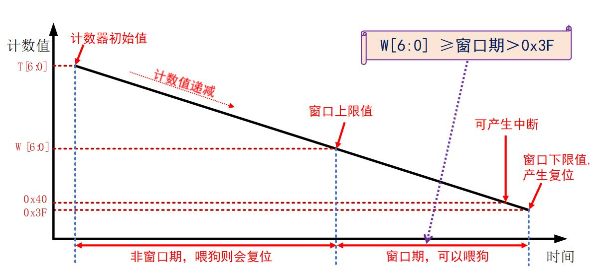

# STM32 HAL库 13_看门狗

## 1. 看门狗工作原理

STM32 存在以下的复位方式：

> 1. NRST管脚上的低电平(外部复位) 
> 2. 窗口看门狗计数终止(WWDG复位) 
> 3. 独立看门狗计数终止(IWDG复位) 
> 4. 软件复位(SW复位) 
> 5. 低功耗管理复位

看门狗会在自身计数器计数值递减到0是使得全体程序复位，可以通过“喂狗”重装载计数器防止复位。

> 1. 外界电磁干扰或者自身系统（硬件或软件）异常，
>    造成程序跑飞，如：陷入某个不正常的死循环，打断正常的程序运行。
> 2. 主要用于检测外界电磁干扰，或硬件异常导致的程序跑飞问题。

## 2. IWDG 独立看门狗

### IWDG 原理


- 独立看门狗时钟

独立看门狗的时钟由独立的RC振荡器LSI提供，即使主时钟发生故障它仍然有效，非常独立。LSI 的频率一般在30到60KHZ 之间，根据温度和工作场合会有一定的漂移，**一般取40KHZ**，所以**独立看门狗的定时时间并不一定非常精确**，只适用于对时间精度要求比较低的场合。

- 计数器时钟

递减计数器的时钟由LSI经过一个8位的预分频器得到。

- 计数器

独立看门狗的计数器是一个12位的递减计数器，最大值为`0XFFF`，当计数器减到0 时，会产生一个复位信号`IWDG_RESET`，让程序重新启动运行，如果在计数器减到0之前刷新了计数器的值的话，就不会产生复位信号，重新刷新计数器值的这个动作俗称喂狗。

- 键寄存器

`IWDG_KR`是独立看门狗的一个控制寄存器。

| 键值     | 键值作用             |
| -------- | -------------------- |
| `0XAAAA` | 把RLR的值重装载到CNT |
| `0X5555` | PR和RLR寄存器可写    |
| `0XCCCC` | 启动IWDG             |

- 超时时间

$$
T_{out} = \frac{PSC}{LSI \times (RLR + 1)}
$$

$RLR$为重装载值，$LSI$为IWDG时钟频率。

### HAL 库函数

```c
/**
 * @brief 独立看门狗喂狗函数，喂狗后会使得计数器重装载
 * @param hiwdg IWDG句柄
 */
HAL_StatusTypeDef HAL_IWDG_Refresh(IWDG_HandleTypeDef *hiwdg);
```

## 3. WWDG 窗口看门狗

### WWDG 原理

窗口看门狗跟独立看门狗一样，也是一个递减计数器不断的往下递减计数，当减到一个固定值 `0x3F`时还不喂狗的话，产生复位，这个值叫窗口的下限，是固定的值，不能改变。

喂狗时间是在一个有上下限的范围内（计数器减到某个值~计数器减到`0x3F`），在这个范围内才可以喂狗，可以通过设定相关寄存器，设定其上限时间（但是下限是固定的`0x3F`）。




如果使能了提前唤醒中断，系统出现问题，喂狗函数没有生效，那么在计数器由减到`0x40 `的时候，会先进入中断，之后才会复位，也可以在中断里面喂狗使得不复位。

- 时间计算公式

WWDG计数周期：
$$
T = \frac{1000 \times 4096 \times PSC}{PCLK1}
$$
$PSC$为WWDG预分频值。

最小超时时间：
$$
T_{min} = T \times (DownCounter\_Value - Windows\_Value)
$$
$DownCounter\_Value$为递减计数器重装载值，$Windows\_Value$为窗口值。

最大超时时间：
$$
T_{max} = T\times(DownCounter\_Value - 0x40)
$$

### HAL 库函数

```c
/**
 * @brief 窗口看门狗喂狗函数，喂狗后会使得计数器重装载
 * @param hwwdg WWDG句柄
 */
HAL_StatusTypeDef HAL_WWDG_Refresh(WWDG_HandleTypeDef *hwwdg);

/**
 * @brief 窗口看门狗中断回调函数
 */
void HAL_WWDG_EarlyWakeupCallback(WWDG_HandleTypeDef *hwwdg)
{

}
```

