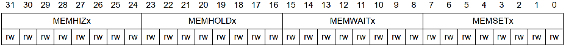

# STM32 HAL库 14_存储器简介

## 1. 存储器简介

### 存储器的基本分类

存储器分为 RAM 和 ROM 两大类。

- RAM：**随机访问存储器(Random Access Memory)，易失性**。是与CPU直接交换数据的内部存储器，它可以随时读写，而且速度很快，通常作为操作系统或其他正在运行中的程序的临时数据存储媒介。当电源关闭时RAM不能保留数据。如果需要保存数据，就必须把它们写入一个长期的存储设备中（例如硬盘）。

- ROM：**只读存储器(Read Only Memory)，非易失性**。一般是装入整机前事先写好的，整机工作过程中只能读出，而不像随机存储器那样能快速地、方便地加以改写。ROM所存数据稳定，断电后所存数据也不会改变。计算机中的ROM主要是用来存储一些系统信息，或者启动程序BIOS程序，这些都是非常重要的，只可以读一般不能修改，断电也不会消失。

**RAM和ROM相比，两者的最大区别是RAM在断电以后保存在上面的数据会自动消失，而ROM不会自动消失，可以长时间断电保存。**

### 只读存储器 ROM

ROM指的是“只读存储器”，即Read-Only Memory。这是一种线路最简单半导体电路，通过掩模工艺， 一次性制造，其中的代码与数据将永久保存，不能进行修改，即使机器停电，这些数据也不会丢失。ROM一般用于存放计算机的基本程序和数据，如BIOS ROM。其物理外形一般是双列直插式（DIP）的集成块。在微机的发展初期，BIOS都存放在ROM（Read Only Memory，只读存储器）中。如果发现内部数据有错，则只有舍弃不用，重新订做一份。

现在比较流行的只读存储器是闪存(Flash Memory)，它属于 EEPROM(电擦除可编程只读存储器)的升级，可以通过电学原理反复擦写。现在大部分BIOS程序就存储在Flash ROM芯片中。U盘和固态硬盘(SSD)也是利用闪存原理做成的。

**ROM分为 可编程ROM 和 Flash ROM**，可编程ROM用分为 PROM、EPROM、EEPROM；Flash ROM 又分为 NOR Flash 和 NAND Flash。

#### PROM

PROM 是 可编程ROM，PROM是一次性的，也就是软件灌入后，就无法修改了，这种是早期的产品，现在已经不可能使用了。

#### EPROM

EPROM 是 可擦除可编程ROM，EPROM 是通过紫外光的照射擦出原先的程序，是一种通用的存储器。

#### EEPROM

EEPROM 是 可擦除可编程ROM，。EEPROM 的擦除不需要借助于其它设备，它是以电子信号来修改其内容的，而且是以 Byte 为最小修改单位，不必将资料全部洗掉才能写入，彻底摆脱了 EPROM Eraser 和编程器的束缚。

#### FLASH ROM

FLASH ROM 指的是闪存，也是一种非易失性的内存，属于EEPROM的改进产品，FLASH 属于真正的单电压芯片，它的读和写操作都是在单电压下进行。它的最大特点是**必须按块( Block 或 Sector )擦除**(每个区块的大小不定，不同厂家的产品有不同的规格)， 而**EEPROM则可以一次只擦除一个字节 (Byte) **。Flash ROM 是利用浮置栅上的电容存储电荷来保存信息，因为浮置栅不会漏电，所以断电后信息仍然可以保存。

FLASH 结合了 ROM 和 RAM 的长处，不仅具备电子可擦除可编程（EEPROM）的性能，还不会断电丢失数据同时可以快速读取数据（NVRAM的优势），U盘 和 MP3 里用的就是这种存储器。在过去的20年里，嵌入式系统一直使用 ROM（EPROM）作为它们的存储设备，然而近年来 FLASH 全面代替了 ROM（EPROM）在嵌入式系统中的地位，用作存储 Bootloader 以及操作系统 或者 程序代码 或者 直接当硬盘使用（U盘）。

**FLASH ROM 包括 NOR FLASH ROM 和 NAND FLASH ROM**。

- NOR FLASH 的读取和常见的 SDRAM 的读取是一样的，用户可以直接运行装载在 NOR FLASH 里面的代码，这样可以减少 SRAM 的容量从而节约了成本。

- NAND FLASH 没有采取内存的随机读取技术，它的读取是以一次读取一块的形式来进行的，通常是一次读取512个字节，采用这种技术的 FLASH 比较廉价。用户不能直接运行NAND FLASH 上的代码。

一般小容量的用NOR FLASH，因为其读取速度快，多用来存储操作系统等重要信息，而大容量的用NAND FLASH。

### 随机读写存储器 RAM

随机存储器（Random Access Memory）既可以从中读取数据，也可以写入数据。当机器电源关闭时，存于其中的数据就会丢失。我们通常购买或升级的内存条就是用作电脑的内存，内存条（SIMM）就是将RAM集成块集中在一起的一小块电路板，它插在计算机中的内存插槽上，以减少RAM集成块占用的空间。目前市场上常见的内存条有1G/条，2G/条，4G/条等。

**RAM 分为两种：SRAM（Static RAM/静态存储器）和DRAM（Dynamic RAM/动态存储器）。**

#### SRAM

SRAM的速率高、性能好，它主要有如下应用：CPU与主存之间的高速缓存；CPU内部的L1／L2或外部的L2高速缓存。

Cache也就是平常看到的一级缓存(L1 Cache）、二级缓存(L2 Cache）、三级缓存(L3 Cache）这些数据，它**位于CPU与内存之间，是一个读写速度比内存更快的存储器。**当CPU向内存中写入或读出数据时，这个数据也被存储进高速缓冲存储器中。**当CPU再次需要这些数据时，CPU就从高速缓冲存储器读取数据，而不是访问较慢的内存**，当然，如需要的数据在Cache中没有，CPU会再去读取内存中的数据。

Cache一般使用SRAM制造，它与CPU之间交换数据的速度高于DRAM，所以被称作"高速缓冲存储器"，简称为"高速缓存"。由于CPU的信息处理速度常常超过其它部件的信息传递速度，所以使用一般的DRAM来作为信息存储器常常使CPU处于等待状态，造成资源的浪费。Cache就是为了解决这个问题而诞生的。在操作系统启动以后，CPU就把DRAM中经常被调用的一些系统信息暂时储存在Cache里面，以后当CPU需要调用这些信息时，首先到Cache里去找，如果找到了，就直接从Cache里读取，这样利用Cache的高速性能就可以节省很多时间。大多数CPU在自身中集成了一定量的Cache，一般被称作"一级缓存"或"内置Cache"。这部分存储器与CPU的信息交换速度是最快的，但容量较小。大多数主板上也集成了Cache，一般被称作"二级缓存"或"外置Cache"，比内置Cache容量大些，一般可达到256K。

> SSRAM（Synchronous SRAM）即同步静态随机存取存储器。同步是指Memory工作需要同步时钟，内部的命令的发送与数据的传输都以它为基准；随机是指数据不是线性依次存储，而是由指定地址进行数据读写。 
>
> 对于 SSRAM 的所有访问都在时钟的上升/下降沿启动。地址、数据输入和其它控制信号均于时钟信号相关。这一点与异步SRAM不同，异步SRAM的访问独立于时钟，数据输入和输出都由地址的变化控制。

#### SDRAM

SDRAM (Synchronous Dynamic RAM，同步动态随机存储器) 采用3.3V工作电压，内存数据位宽64位。 SDRAM与CPU通过一个相同的时钟频率锁在一起，使两者以相同的速度同步工作。 SDRAM它在每一个时钟脉冲的上升沿传输数据。

#### DDR SDRAM

( Double data Rate SDRAM，双倍速率同步动态随机存储器)采用2.5V工作电压，内存数据位宽64位。 DDR SDRAM (简称DDR内存)一个时钟脉冲传输两次数据，分别在时钟脉冲的上升沿和下降沿各传输一次数据，因此称为双倍速率的SDRAM。

## 2. FSMC 接口驱动 SRAM

### SRAM 芯片

| 线         | 含义                         |
| ---------- | ---------------------------- |
| `A[18:0]`  | 地址线                       |
| `DQ[15:0]` | 数据线                       |
| `CEn`      | 芯片使能信号，低电平有效     |
| `OEn`      | 输出(读)使能信号，低电平有效 |
| `WEn`      | 写使能信号，低电平有效       |
| `BLEn`     | 低字节控制信号               |
| `BHEn`     | 高字节控制信号               |

### 8080 并口时序

- 读时序

> - $t_{RC}$： 读周期时间；
> - $t_{ACE}$ ：地址建立时间，从接收到地址信号到给有效数据的时间。
> - $t_{DOE}$：OE建立时间，从接收到读使能信号到给有效数据的时间。
>
> 

- 写时序

>- $t_{WC}$： 写周期时间；
>- $t_{SA}$ ：地址建立时间，从发送地址信号到给写使能信号的时间。
>- $t_{PWE}$：WE脉冲，从接收到写使能信号到数据采集时间。
>
>

### FSMC 接口驱动 SRAM

FSMC，灵活的静态存储控制器，能驱动SRAM、NOR/NAND Flash等存储器。

| 访问模式 | 对应的外部存储器     | 设置参数                     |
| -------- | -------------------- | ---------------------------- |
| 模式1    | SRAM/CRAM            | `ADDSET`、`DATAST`           |
| 模式A    | SRAM/PSRAM(CRAM)     | `ADDSET`、`DATAST`           |
| 模式B/2  | NOR FLASH            | `ADDSET`、`DATAST`           |
| 模式C    | NOR FLASH            | `ADDSET`、`DATAST`           |
| 模式D    | 带地址扩展的异步操作 | `ADDSET`、`DATAST`、`ADDHLD` |

可以使用 FSMC 接口产生时序驱动 SRAM。(使用模式A)

> $$
> t_{RC} = (ADDSET + 1 + DATAST + 1 + 2)t_{HCLK} > 15ns \\
> t_{ACE} = (ADDSET + 1)t_{HCLK}  < 12ns \\
> t_{DOE} = (DATAST + 1)t_{HCLK} < 3.4ns
> $$

> $$
> t_{WC} = (ADDSET + 1 + DATAST + 1)t_{HCLK} > 15ns \\
> t_{SA} = (ADDSET + 1)t_{HCLK} > 0ns \\
> t_{PWE} = (DATAST + 1)t_{HCLK} > 0.7ns
> $$

使用FSMC外接存储器，其存储单元是映射到STM32的内部寻址空间的。

## 3. FSMC 接口驱动 SDRAM

### SDRAM 芯片

| 线       | 含义                                           |
| -------- | ---------------------------------------------- |
| CLK      | 时钟信号，提供SDRAM工作时钟                    |
| CKE      | 时钟使能                                       |
| CS       | 片选信号，低电平有效                           |
| RAS      | 行地址选通信号，低电平有效，表示行地址         |
| CAS      | 列地址选通信号，低电平有效，表示列地址         |
| WE       | 读写指令切换信号  低电平:写指令，高电平:读指令 |
| A[12:0]  | 地址线（行 / 列）                              |
| BS0/BS1  | BANK地址线                                     |
| DQ[15:0] | 数据线                                         |
| L/UDQM   | 数据掩码，表示DQ的有效部分                     |

> SDRAM 寻址方法：
>
> 1. 指定 BANK；
>
> 2. 指定 BANK 内的行和列。
>
>    
>
>    

### SDRAM 操作指令

1. `No-operation`

空操作命令，用于选中 SDRAM，防止SDRAM接受错误的命令，为接下来的命令发送做准备。

2. `Active`

激活命令，该命令必须在读写操作之前被发送，用于设置所需要的 BANK 和行地址（同时设置），BANK 地址由 BS0(BA0)/BS1(BA1) 决定，行地址由 A[12:0] 决定。

3. `Read/Write`

读 / 写命令，在发送完激活命令后， 再发送列地址就可以完成对 SDRAM 的寻址，并进行读写操作。读/写命令和列地址的发送，是通过一次传输完成的。

4. `Precharge`

预充电指令，用于关闭 BANK 中所打开的行地址，准备打开新行。进行完读写操作后，要对同一 BANK 的另一行进行寻址，就要将原来有效(打开)的行关闭，重新发送行/列地址。

> 1. 通过指令线发送预充电命令；
> 2. 通过 A10 控制操作区域（高电平：所有BANK都预充电；低电平：使用BA线选择要预充电 BANK）

5. `Refresh`

刷新指令，用于刷新一行数据，可以依次对所有的行进行刷新操作。

- 自动刷新：依靠刷新计数器(行地址生成器)自动依次生成要刷新的行地址。刷新周期（完成一次所有行的刷新所需要的时间）64ms。刷新过程中，所有 Bank 停止工作。（ CKE 为高电平）
- 自我刷新：用于休眠低功耗状态下的数据保存。（发出AR命令后，将CKE至于无效状态(低电平)），进入自我刷新模式后，不再依靠系统时钟工作，根据内部时钟进行刷新操作。CKE高电平时退出自刷新模式进入正常操作模式。

6. `Mode Register Set`

设置模式寄存器。SDRAM芯片内部有一个逻辑控制单元，控制单元的相关参数由模式寄存器提供。该命令在每次对SDRAM进行初始化时都需要用到。

### SDRAM 工作流程

- 初始化

- 写操作

- 读操作

### FSMC 接口驱动 SDRAM

| SDRAM   | FMC         |
| ------- | ----------- |
| A[0:12] | FMC_A[0:18] |
| BA[0:1] | FMC_BA[0:1] |
| D[0:15] | FMC_D[0:15] |
| CKE     | FMC_SDCKE0  |
| CLK     | FMC_SDCLK   |
| UDQM    | FMC_NBL1    |
| LDQM    | FMC_NBL0    |
| WE      | FMC_SDNWE   |
| CAS     | FMC_SDNCAS  |
| RAS     | FMC_SDNRAS  |
| CS      | FMC_SDNE0   |

#### 控制寄存器`FMC_SDCRx`

> `RPIPE`：CAS延迟后延后多少个HCLK读取数据。
> `RNBURST`：用于使能突发读模式。
> `SDCLK`：用于配置SDRAM时钟，需在禁止SDRAM时钟下配置。
> `WP`：用于设置写保护。
> `CAS`：设置SDRAM的CAS延迟。
> `NB`：设置SDRAM内部存储区域BANK数量。
> `MWID`：定义存储器数据总线宽度。
> `NR`：定义行地址的位数。
> `NC`：定义列地址的位数。

#### 时序寄存器`FMC_SDTRx`

> `TRCD`：定义激活命令与读/写命令之间的延迟。
> `TRP`：定义预充电命令与其他命令之间的延迟。
> `TWR`：定义写命令和预充电命令之间的延迟。
> `TRC`：定义刷新和激活命令之间延迟以及两个相邻刷新命令之间延迟。
> `TRAS`：用于设置自刷新周期。
> `TXSR`：定义从发出自刷新命令到发出激活命令之间的延迟。
> `TMRD`：定义加载模式寄存器命令和激活或刷新命令之间的延迟。

#### 命令模式寄存器`FMC_SDCMR`

> `MRD`：定义SDRAM模式寄存器的内容（地址线发送），MODE=100时需配置。NRFS：在MODE=011时表示所发出的连续自刷新命令的个数。
> `CTB2/CTB1`：用于指定命令所发送的目标存储器，由于SDRAM控制器能够外挂2个SDRAM，发送命令时，需通过CTB1/2指定命令发送给哪个存储器。
> `MODE`：定义发送到SDRAM存储器的命令。000：正常模式；001：时钟配置使能；010：预充电所有存储区；011：自刷新命令；100：配置模式寄存器；101：自刷新命令；110：掉电命令。

#### 刷新定时器寄存器`FMC_SDRTR`

$$
COUNT = (SDRAM刷新周期 / 行数) / SDRAM时钟周期 - 20
$$
SDRAM接收读请求后若出现内部刷新请求，必须将刷新速率增加20个SDRAM时钟周期，获得充足余量。

## 4. FSMC 接口驱动 NAND FLASH

### NAND FLASH 芯片(MT29F4G08)

| 线   | 含义                                   |
| ---- | -------------------------------------- |
| CE#  | 芯片使能，用于选中NAND FLASH           |
| CLE  | 命令锁存使能，表示写入的是命令         |
| ALE  | 地址锁存使能，表示写入的是地址         |
| WE#  | 写使能，用于写入数据                   |
| RE#  | 读使能，用于读取数据                   |
| WP#  | 写保护                                 |
| R/B  | 就绪/忙，用于判断编程/擦除操作是否完成 |
| I/Ox | 地址/数据 输入/输出口                  |

- 存储结构：数据存储区(data area)和备用区域(spare area)

> MT29F4G08：数据存储区大小为2KB（存放有效数据），  备用区域大小为64B（存放ECC校验值）。

NAND FLASH 由块(block)组成，每块又由若干页(page)组成。页是数据读写的最小单位，块是擦除的最小单位。

- 寻址：块地址(Block Address)、页地址(Page Address)、列地址(Column Address)

对MT29F4G08，这三个地址，通过5个周期发送，首先发送列地址，再发送页地址和块地址。

> - CA[11:0]表示列地址，用于在一个Page内部寻址，器件的Page为2112字节，需要12根地址线寻址；
> - PA[5:0]表示页地址，用于在一个Block内部寻址，器件的Block为64个Page，需要6根地址线寻址；
> - BA[17:6]表示块地址，用于块寻址，器件总共有4096个Block ，需要12根地址线寻址。

### NAND FLASH 操作指令

1. `READ PAGE(00h-30h)`

> READ PAGE的命令分两次发送:
>
> 1. 发送`00h`命令；
> 2. 发送5次地址(Block&Page&Column地址)，指定读取的地址；
> 3. 发送`30h`命令；
> 4.  等待$t_{RDY}$时间；
> 5. 读取PAGE里面的数据。

2. `PROGRAM PAGE(80h-10h)`

> PROGRAM PAGE的命令分两次发送：
>
> 1. 发送`80h`命令；
> 2. 发送5次地址(Block&Page&Column地址)，指定写入的地址；
> 3. 等待$t_{ADL}$时间；
> 4. 发送需要写入的数据；
> 5. 发送`10h`命令；
> 6. 等待$t_{PROG}$时间；
> 7. 发送`READ STATUS`命令，查询NAND FLASH状态，完成写入操作

3. `ERASE BLOCK(60h-D0h)`

> ERASE BLOCK的命令分两次发送：
>
> 1. 发送`60h`命令；
> 2. 发送3次地址(Block地址)，指定要擦除的Block地址；
> 3. 发送`D0h`命令；
> 4. 等待$t_{BERS}$时间；
> 5. 发送`READ STATUS`命令，查询状态，完成一个BLOCK的擦除。

4. `INTERNAL DATA MOVE(00h-35h && 85h-10h)`

> 1. 发送`READ FOR INTERNAL DATA MOVE`的命令（00h-35h）过程中指定源地址（源数据）；
> 2. 发送`READ STATUS`命令查询状态或查询RB信号；
> 3. 发送`PROGRAM FOR INTERNAL DATA MOVE`的命令（85h-10h）过程中指定目标地址；
> 4. 等待$t_{PROG}$时间；
> 5. 发送`READ STATUS`命令查询状态，等待操作完成。

> 只能在同一个plane中互相拷贝（源地址和目标地址在同一个plane）。内部数据移动过程中，也可以写入数据。当发送`10h`命令时，开始进行拷贝。

- 时间参数：

$t_{ADL}$：发送完地址到数据传输（最小70ns）；

$t_{PROG}$：页写完成需用时间（200-600us）；

$t_{BERS}$：块擦除完成需用时间（0.7-3ms）；

$t_{WHR}$：从写入变读取的时间（最小60ns）；

$t_{RHW}$：从读取变写入的时间（最小100ns）；

> FSMC 参数配置：
>
> 1. $t_{CLR}$：发送完命令到数据输出需用时间（最小10ns）；
>
> 2. $t_{AR}$：发送完地址到数据输出需用时间（最小10ns）；
>
> 3. $t_{CLS}/t_{ALS}$：CLE/ALE信号建立时间（最小10ns）；
>
> 4. $t_{RP}/t_{WP}$：读/写周期的低电平时间（最小10ns）；
>
> 5. $t_{CLH}/t_{ALH}$：CLE/ALE信号保持时间（最小5ns）。

### NAND FLASH ECC校验

- 坏块

由于物理特性，NAND FLASH只有有限的擦写次数，超过后，基本上是坏了，属于坏块。需要对坏块进行识别和标记，合理的分配和使用好的块，以最大限度延长NAND FLASH的寿命。

写入时先用算法计算的到数据的ECC值，把ECC值和块内数据一起存入NAND FLASH中。待读取时也是把块内数据和ECC一并读出，然后用相同的算法计算块内数据的ECC和读出的ECC进行比较，如果不同就认为数据已经发生了变质，没法相信了。

> NAND FLASH的坏块识别有几种方式：	
>
> 1. NAND厂家出厂时，会在每个Block的第一个Page和第二个Page的spare区的第一个字节写入非0xFF的值来表示，可以通过这个来判断该块是否为坏块。
> 2. 通过给每个Block写入数据（0xFF/0x00）,然后读取出来，判断写入的数据和读取的数据是否完全 一样，来识别坏块。
> 3. 通过读取数据时，检验ECC错误，来识别坏块。

- 转换表

文件系统访问文件时，使用的是逻辑地址，是按顺序编号的，不考虑坏块的情况。NAND FLASH存储地址，称之为物理地址，是有可能存在坏块的。两个地址之间，必须有一个映射表，将逻辑地址转换为物理地址，且不能指向坏块的物理地址，这个映射表称之为 逻辑地址-物理地址转换表，简称转换表(LUT表)。映射表必须存储到NAND FLASH，以便上电后重建。当出现坏块时，需要进行坏块标记并且不再作为正常块使用，还得从保留区提取一个未使用过的块来代替坏块。

利用每个Block的第一个page的spare区来存储映射表，另外还需要标记这个Block是否被利用。

> 第一个字节：用来表示该块是否为坏块（ 0xFF表示好块；0xAA表示坏块）	
>
> 第二个字节：用来表示是否被占用（0xFF表示未被占用；0xCC表示已被占用）	
>
> 第三和四个字节：用来表示存储该块所映射到的逻辑地址（0xFFFF表示未被分配）
>
> 

- ECC 校验

ECC，是一种对传输数据的错误检测和修正算法。NAND FLASH 存储单元是串行组织的，当读取一个单元时，读出放大器所检测到的信号强度会被这种串行存储结构削弱，降低了所读信号的准确性，导致读数出错（一般只有1个bit出错）。ECC 就可以检测这种错误，并修正错误的数据位。ECC 校验有三种常用的算法：汉明码(Hamming Code)、RS 码(Reed Solomom Code)和 BCH 码。

STM32 的 FSMC 模块支持硬件 ECC 计算，使用的就是汉明码，可以检测出错误，但无法修正。支持页大小按256、512、1024、2048、4096和8192字节为单位进行ECC计算。

> 1. 数据分割(1/2、1/4、1/8)通过异或运算进行奇偶校验，得到偶校验值和奇校验；
> 2. 得到ECC值后，需要将原数据包和 ECC 数值写入NAND FLASH里。读取时，ECC值将会重新计算，对比即可知数据有无异常。
> 3. 如果有异常，按照步骤1进行操作，通过原来 ECC 和现有 ECC 异或可得出错位置。
> 4. 进行数据纠正。

写操作：STM32 FMC的硬件ECC会计算出ECC值，需要写入到spare区对应地址；

读操作：STM32 FMC的硬件ECC会计算一个新的ECC值，需要进行与原来的ECC值比对，判断数据是否有误，以及1bit 数据纠正。

### FSMC 接口驱动 NAND FLASH

#### NAND FLASH控制寄存`FMC_PCR3`

> `PWAITEN`：用于设置等待特性。
> `PBKEN`：用于使能存储区域。
> `PTYP`：用于设置存储器类型。0：卡；1：NAND FLASH。
> `PWID`：设置数据总线宽度。
> `ECCEN`：用于使能STM32的硬件ECC计算逻辑。
> `TCLR`：用于设置CLE到RE的延迟。 $t_{clr}=(TCLR+SET+2)\times t_{hclk}$
> `TAR`：用于设置ALE到RE的延迟。 $t_{ar}=(TAR+SET+2)\times t_{hclk}$
> `ECCCPS`：用于设置ECC的页大小。

#### 通用存储器空间时序寄存器`FMC_PMEM`

> `MEMSETx`：存储器建立时间。（$t_{CLS}$和$t_{ALS}$最小为10ns）
> `MEMWAITx`：存储器等待时间。（设置时间长一点，否则可能访问不正常）（$t_{RP}$和$t_{WP}$最小为10ns）
> `MEMHOLEDx`：存储器保持时间。（$t_{CLH}$和$t_{ALH}$最小为5ns）
> `MEMHIZx`：存储器数据总线高阻态时间。

#### ECC结果寄存器`FMC_ECCR`

#### FIFO状态和中断寄存器`FMC_SR3`

> `EFMPT`：用于表示FIFO的状态：0，表示FIFO非空；1，表示FIFO为空，表示数据传输完成。计算ECC时，必须等待`EFMPT`为1，再去读取ECCRx寄存器的值，确保数据全部传输完毕。
