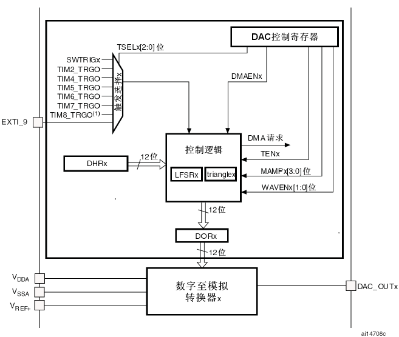
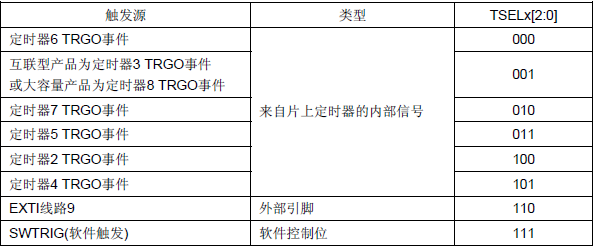
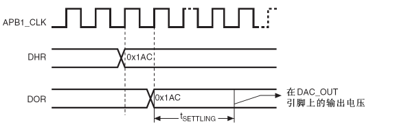
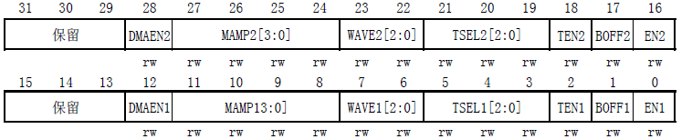
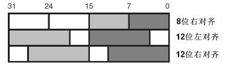

# STM32 HAL 15_DAC

## 1. DAC 工作原理

DAC 是 Digital-to-Analog Converter 的缩写，将表示一定比例电压值的数字信号转换为模拟信号。STM32 的 DAC 模块是 12 位数字输入，电压输出型的 DAC。

DAC 有两个用途：输出波形和输出固定电压。

## 2. STM32 DAC 控制器



### 触发方式

DAC 转换可以由某外部事件触发（定时器计数器、外部中断线）。

配置控制位`TSELx[2:0]`可以选择8个触发事件之一触发 DAC 转换，任意一种触发源都可以触发 DAC 转换。



每次 DAC 接口侦测到来自选中的定时器 TRGO 输出，或者外部中断线9的上升沿，存放在寄存器`DAC_DHRx`中的数据会被传送到寄存器`DAC_DORx`中。在3个 APB1 时钟周期后，寄存器`DAC_DORx`更新为新值。

如果选择软件触发，一旦`SWTRIG`位置 1，转换即开始。在数据从`DAC_DHRx`寄存器传送到 `DAC_DORx`寄存器后，`SWTRIG`位由硬件自动清0。

### 控制逻辑

此部分决定了DAC的波形控制，输出方式，DMA传输。

DAC 受 `DAC_DORx` 寄存器直接控制的，但是数据并不是直接传入 `DAC_DORx` 的，需要先传入 `DAC_DHRx` 之后再间接地传给 `DAC_DORx` 寄存器，不能直接往 `DAC_DORx` 寄存器写入数据。

如果没有选择硬件触发（`TENx=0`），在一个 APB1 周期后传入 `DAC_DORx`，如果选择硬件触发（`TENx=1`），则在 3 个 APB1 周期后传入 `DAC_DORx`。 一旦数据从`DAC_DHRx`寄存器装入`DAC_DORx`寄存器，在经过时间$t_{setting}$（大约3us） 之后，输出即有效，这段时间的长短依电源电压和模拟输出负载的不同会有所变化。



- DAC 控制寄存器



> - `DMAENx`：控制 DAC 通道1/2 的 DMA 使能；
> - `MAMP2[3:0]`：DAC 通道2屏蔽/幅值选择器，在噪声生成模式下选择屏蔽位，在三角波生成模式下选择波形的幅值。
> - `WAVE2[1:0]`：DAC 通道2噪声/三角波生成使能，00：关闭波形发生器；10：使能噪声波形发生器；1x：使能三角波发生器。
> - `TENx`：DAC 通道x触发使能，用来使能/关闭 DAC 通道x的触发。

### DAC 数据格式

1. 单 DAC 通道有3种情况：

> - 8位数据右对齐：用户须将数据写入寄存器`DAC_DHR8Rx[7:0]`位（实际是存入寄存器`DHRx[11:4]`位）；
> - 12位数据左对齐：用户须将数据写入寄存器`DAC_DHR12Lx[15:4]`位（实际是存入寄存器`DHRx[11:0]`位）；
> - 12位数据右对齐：用户须将数据写入寄存器`DAC_DHR12Rx[11:0]`位（实际是存入寄存器`DHRx[11:0]`位）。

一般采用12位数据右对齐。

根据对`DAC_DHRx`寄存器的操作，经过相应的移位后，写入的数据被转存到`DAC_DHRx`寄存器中（`DAC_DHRx`是内部的数据保存寄存器x）。随后，`DAC_DHRx`寄存器的内容或被自动地传送到`DAC_DORx`寄存器，或通过软件触发或外部事件触发被传送到`DAC_DORx`寄存器。


2. 双DAC通道，有3种情况：

> - 8位数据右对齐：用户须将DAC通道1数据写入寄存器`DAC_DHR8RD[7:0]`位（实际是存入寄存器`DHR1[11:4]`位），将DAC通道2数据写入寄存器`DAC_DHR8RD[15:8]`位（实际是存入寄存器`DHR2[11:4]`位）；
> - 12位数据左对齐：用户须将DAC通道1数据写入寄存器`DAC_DHR12LD[15:4]`位（实际是存入寄存器`DHR1[11:0]`位），将DAC通道2数据写入寄存器`DAC_DHR12LD[31:20]`位（实际是存入寄存器`DHR2[11:0]`位）；
> - 12位数据右对齐：用户须将DAC通道1数据写入寄存器`DAC_DHR12RD[11:0]`位（实际是存入寄存器`DHR1[11:0]`位），将DAC通道2数据写入寄存器`DAC_DHR12RD[27:16]`位（实际是存入寄存器`DHR2[11:0]`位）。



### 输出电压

当 DAC 的参考电压位 $V_{REF+}$ 的时候，数字输入经过 DAC 被线性地转换为模拟电压输出，其范围为 0 到 $V_{REF+}$。

任一 DAC 通道引脚上的输出电压满足下面的关系：
$$
V_{out} = V_{REF} \times (DAC\_DOR / 4095)。
$$
此时数据格式应该选择12位数据右对齐。

## 3. DAC 的使用

```c
/**
  * @brief	启动 DAC
  * @param	hadc DAC句柄
  * @param	Channel	DAC 通道号，DAC_CHANNEL_1 或 DAC_CHANNEL_2
  */
HAL_StatusTypeDef HAL_DAC_Start(DAC_HandleTypeDef* hdac, uint32_t Channel);

/**
  * @brief	设置 DAC 值
  * @param	hadc 		DAC句柄
  * @param	Channel		DAC 通道号，DAC_CHANNEL_1 或 DAC_CHANNEL_2
  * @param	Alignment 	数据对齐方式，可以是 DAC_ALIGN_8B_R、DAC_ALIGN_12B_L 或 DAC_ALIGN_12B_R
  * @param	Data 		要设置的输出值
  */
HAL_StatusTypeDef HAL_DAC_SetValue(DAC_HandleTypeDef* hdac, uint32_t Channel, uint32_t Alignment, uint32_t Data);
```

