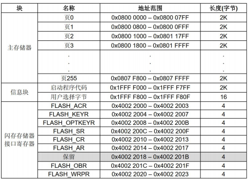
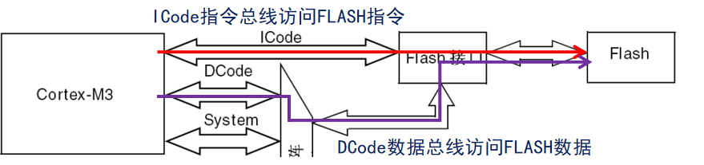
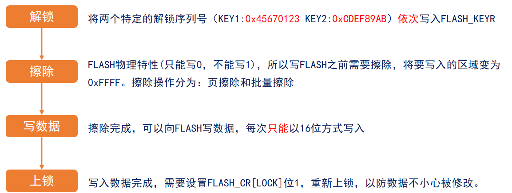
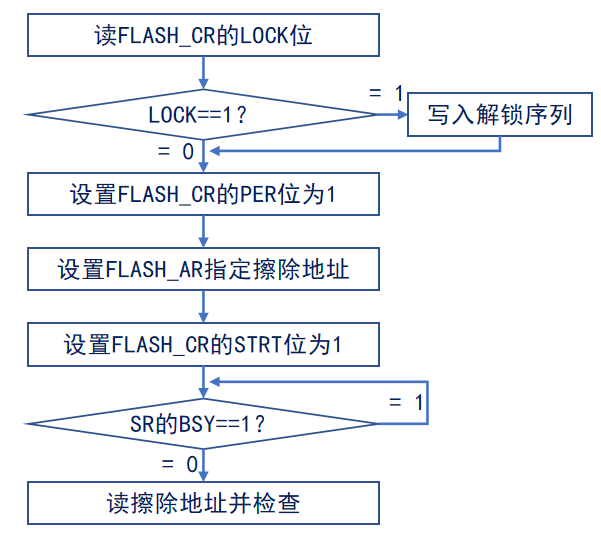
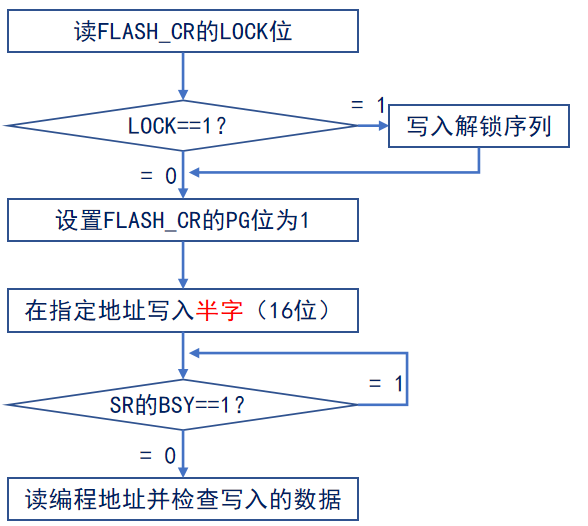

# STM32 HAL 16_FLASH

## 1. STM32 内部 FLASH 简介

一个32位地址指向1个字节，FLASH 空间多少多少K指的是多少多少K byte。

FLASH 是闪存，是一种长寿命的非易失性（断电数据不丢失）的存储器。可以对称为块的存储器单元块进行擦写和再编程，在进行写入操作之前必须先执行擦除。

内部 FLASH 用于保存要运行的代码和常量，外部 FLASH 用于存储需要掉电保存的用户数据。在STM32芯片内部有一个 FLASH 存储器，主要用于存储代码。

- 根据闪存容量划分为几个密度等级：
  
    | **密度等级** | **容量范围**       | **类型**     |
    | ------------ | ------------------ | ------------ |
    | 低密度 LD    | ≤ 32KB             | 小容量产品   |
    | 中密度 MD    | 32KB ＜ X ≤ 128KB  | 中容量产品   |
    | 高密度 HD    | 128KB ＜ X ≤ 512KB | 大容量产品   |
    | 超密度 XD    | ＞ 512KB           | 超大容量产品 |
	
	不同密度等级的FLASH，其组织结构也不一样。

- STM32 内部 FLASH 构成：

  内部 FLASH 主要由三部分组成：**主存储器、信息块、闪存存储器接口寄存器**。

  | **闪存模块的子部分** | **作用**                                                     |
  | -------------------- | ------------------------------------------------------------ |
  | 主存储器             | 用来存放代码和数据常数（如 `const` 类型的数据）              |
  | 信息块               | 分为两个部分：系统存储（启动程序代码）、选项字节（用户选择字节） |
  | 闪存存储器接口寄存器 | 用于控制闪存读写等，是整个闪存模块的控制结构                 |
  
  
  
  > 1. 主存储器：地址范围为 `0x0800 0000` ~ `0x0807 FFFF`，分为256页，每页 `2KB`（小/中容量为 `1K` ）。当 `BOOT0` 接地，系统将从 `0x0800 0000` 地址处开始读取代码（从主存储器启动）。
  > 2. 信息块：
  >    - 系统存储器是用于存放在系统存储器自举模式下的启动程序，这个区域只保留给ST使用，启动程序使用 `USART1` 串行接口实现对闪存存储器的编程； ST在生产线上对这个区域编程并锁定以防止用户擦写。
  >    - 选择字节： 选项字节存储芯片的配置信息及对主存储块的保护信息。 用于配置 FLASH 的读写保护、电源管理中的 BOR 级别、软件/硬件看门狗等功能，这部分共 32 字节。可以通过修改 FLASH 的选项控制寄存器修改。
  >    - 当 `BOOT0` 接VCC，`BOOT1` 接GND （串口下载程序） ，系统运行的就是这部分代码。
  
- FLASH 的保护方式：

  闪存存储器有两种保护方式防止非法的访问(读、写、擦除)：**页写入保护和读出保护**。

  在执行闪存写操作时，任何对闪存的读操作都会锁住总线，在写操作完成后读操作才能正确地进行；即在进行写或擦除操作时，不能进行代码或数据的读取操作。

  进行闪存编程操作时(写或擦除)，必须打开内部的RC振荡器(HSI)。

- FLASH 的编程方式：

  **闪存存储器可以用ICP或IAP方式编程。**

  - IAP(In-Application Programming)(在程序中编程)： IAP是在用户程序运行时对闪存微控制器中存储器重新编程。通过任何一种通信接口(如IO端口，USB，CAN，UART，I2C，SPI等)下载程序或者应用数据到存储器中。也就是说，STM32允许用户在应用程序中重新烧写闪存存储器中的内容。然而，IAP需要至少有一部分程序已经使用ICP方式烧到闪存存储器中（Bootloader)。

  - ICP(In-Circuit Programming)(在线编程)： ICP 是在芯片安装到用户应用板上后，通过 JTAG 协议对闪存微控制器中存储器编程。通过 JTAG/SWD 协议或者系统加载程序(Bootloader)下载用户应用程序到微控制器中。

## 2. STM32 内部 FLASH 的读写操作

### 读取操作

直接在通用地址空间直接寻址，任何 32 位数据的读操作都能访问闪存模块的内容并得到相对应的数据。



> CPU运行速度比FLASH快得多，STM32F103 的 FLASH 最快访问速度 ≤24MHz，CPU频率超过这个速度，得加入等待时间，否则读写FLASH可能出错，导致死机等情况。
>
> | **频率范围**              | 等待周期数(`LATENCY`) |
> | ------------------------- | --------------------- |
> | 0 ＜ `SYSCLK` ＜ 24MHz    | 0个等待周期           |
> | 24MHz ＜ `SYSCLK` ≤ 48MHz | 1个等待周期           |
> | 48MHz ＜ `SYSCLK` ≤ 72MHz | 2个等待周期           |

正确设置好等待周期后，利用指针读取数据。

```c
// 从地址addr，读取数据（字节为8位，半字为16位，字为32位）
data = *(volatile uint8_t *)addr;		/* 读取一个字节数据 */
data = *(volatile uint16_t *)addr;		/* 读取一个半字数据 */
data = *(volatile uint32_t *)addr;		/* 读取一个字数据 */
```

### 写入操作

闪存编程是由 `FPEC`（闪存编程和擦除控制器）模块处理的。**写操作有四步：解锁，擦除 ，写数据，上锁。**



- FLASH 擦除：

  

- FLASH 写入：

  

## 3. HAL 库函数

