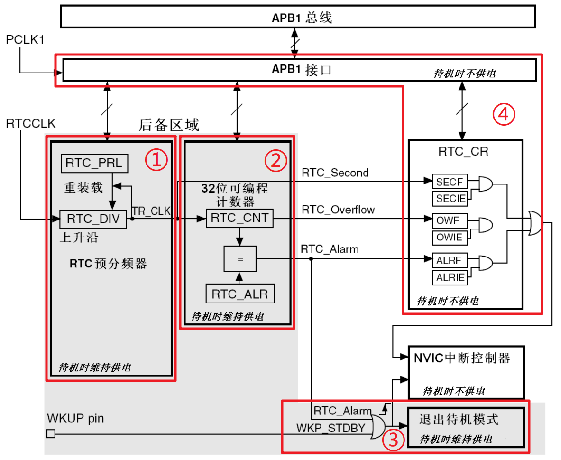

# STM32 HAL 17_RTC

## 1. STM32 RTC 简介

实时时钟(Real Time Clock)，本质是一个计数器，计数频率常为秒，专门用来记录时间。

> RTC 特性：
>
> - 能提供时间（秒钟数）；
> - 能在MCU掉电后运行；
> - 低功耗。

- RTC 方案

	

	| **对比因素** | 内部RTC          | 外置RTC          |
	| ------------ | ---------------- | ---------------- |
	| **信息差异** | 提供秒/亚秒信号  | 提供秒信号和日历 |
	| **功耗**     | 功耗高           | 功耗低           |
	| **体积**     | 不用占用额外体积 | 体积大           |
	| **成本**     | 成本低           | 成本高           |

	> 1. 一般都需要设计RTC外围电路；
	>
	> 2. 一般都可以给RTC设置独立的电源；
	>
	> 3. 多数RTC的寄存器采用BCD码存储时间信息；

- STM32F1 RTC 框图

  

  > 1. RTC 预分频器；
  >
  >    它可编程产生 1 秒的 RTC 时间基准 `TR_CLK`。RTC 的预分频模块包含了一个 20 位的可编程分频器(RTC 预分频器)。如果在 `RTC_CR` 寄存器中设置了相应的允许位，则在每个 `TR_CLK` 周期中 RTC 产生一个中断(秒中断)。
  > 2. 32 位可编程计数器；
  >
  >    可被初始化为当前的系统时间，一个 32 位的时钟计数器，按秒钟计算，可以记 录 4294967296 秒，约合 136 年左右，作为一般应用，这已经是足够了的。
  > 3. 待机唤醒；
  > 4. RTC 控制寄存器，APB1 接口。

  1. **寄存器写保护**：`RTC_PRL`、`RTC_ALR`、`RTC_CNT` 和 `RTC_DIV`寄存器不会被系统复位 ；
  2. **数据存储**：RTC和后备寄存器不会被系统或电源复位源复位；当从待机模式唤醒时，也不会被复位。 后备寄存器可用于保存掉电时的数据。
  3. **电源独立性**：RTC和后备寄存器通过一个开关供电，在 VDD 有效时该开关选择VDD 供电，否则由 VBAT 引脚供电。在 VBAT 供电时仍可继续工作。
  4. APB1接口由系统复位；RTC核心只能由后备域复位；
  5. `RTCCLK` 经过 `RTC_DIV` 预分频，`RTC_PRL` 设置预分频系数，然后得到 `TR_CLK` 时钟信号，我们一般设置其周期为1s，`RTC_CNT` 计数器计数，假如1970设置为时间起点为 0s，通过当前时间的秒数计算得到当前的时间。`RTC_ALR` 是设置闹钟时间，`RTC_CNT` 计数到 `RTC_ALR` 就会产生计数中断。

     > - `RTC_Second` 为秒中断，用于刷新时间，
     > - `RTC_Overflow` 是溢出中断。
     > - `RTC Alarm` 控制开关机。

- RTC 中断

  **秒中断：**RTC 时钟自带一个秒中断，每当计数加一的时候就会触发一次秒中断。注意，这里所说的秒中断并非一定是一秒的时间，它是由RTC时钟源和分频值决定的秒的时间，当然也是可以做到1秒钟中断一次。我们通过往秒中断里写更新时间的函数来达到时间同步的效果。

  **闹钟中断：**闹钟中断就是设置一个预设定的值，计数每自加多少次触发一次闹钟中断。

- RTC 配置步骤
  1. **使能对RTC的访问**：使能 PWR && BKP 时钟（`RCC_APB1ENR`）、使能对后备寄存器和 RTC 的访问权限（`PWR_CR`）。
  2. **设置RTC时钟源**：激活 LSE，设置 RTC 的计数时钟源为 LSE（`RCC_BDCR`）；
  3. **进入配置模式**：等待 `RTOFF` 位为1，设置 `CNF` 位为1（`RCC_CRL`）；
  4. **设置RTC寄存器**：设置分频值、计数值等，一般先只设置分频值，`CNT` 的设置独立。
  5. **退出配置模式**：清除 `CNF` 位，等待 `RTOFF` 为1即配置完成。

## 2. HAL库函数

### 寄存器简介

1. `RTC_ALR` 寄存器


2. `RTC_CNT`寄存器


3. `RTC_DIV`寄存器


4. `RTC_PRL`寄存器


### HAL 库函数

```c
/**
  * @brief  RTC 时间结构体
  */
typedef struct
{
  uint8_t Hours;            /*!< Specifies the RTC Time Hour.
                                 This parameter must be a number between Min_Data = 0 and Max_Data = 23 */
  uint8_t Minutes;          /*!< Specifies the RTC Time Minutes.
                                 This parameter must be a number between Min_Data = 0 and Max_Data = 59 */
  uint8_t Seconds;          /*!< Specifies the RTC Time Seconds.
                                 This parameter must be a number between Min_Data = 0 and Max_Data = 59 */
} RTC_TimeTypeDef;

/**
  * @brief  RTC 日期结构体
  */
typedef struct
{
  uint8_t WeekDay;  /*!< Specifies the RTC Date WeekDay (not necessary for HAL_RTC_SetDate).
                         This parameter can be a value of @ref RTC_WeekDay_Definitions */
  uint8_t Month;    /*!< Specifies the RTC Date Month (in BCD format).
                         This parameter can be a value of @ref RTC_Month_Date_Definitions */
  uint8_t Date;     /*!< Specifies the RTC Date.
                         This parameter must be a number between Min_Data = 1 and Max_Data = 31 */
  uint8_t Year;     /*!< Specifies the RTC Date Year.
                         This parameter must be a number between Min_Data = 0 and Max_Data = 99 */
} RTC_DateTypeDef;

/**
  * @brief  RTC 闹钟结构体
  */
typedef struct
{
  RTC_TimeTypeDef AlarmTime;     /*!< Specifies the RTC Alarm Time members */
  uint32_t Alarm;                /*!< Specifies the alarm ID (only 1 alarm ID for STM32F1).
                                      This parameter can be a value of @ref RTC_Alarms_Definitions */
} RTC_AlarmTypeDef;

/**
  * @brief  设置 RTC 当前时间
  * @param  hrtc   RTC 句柄
  * @param  sTime  RTC 时间结构体
  * @param  Format: RTC 时间格式 RTC_FORMAT_BIN/RTC_FORMAT_BCD
  */
HAL_StatusTypeDef HAL_RTC_SetTime(RTC_HandleTypeDef *hrtc, RTC_TimeTypeDef *sTime, uint32_t Format);

/**
  * @brief  设置 RTC 当前日期
  * @param  hrtc   RTC 句柄
  * @param  sDate  RTC 时间结构体
  * @param  Format: RTC 时间格式 RTC_FORMAT_BIN/RTC_FORMAT_BCD
  */
HAL_StatusTypeDef HAL_RTC_SetDate(RTC_HandleTypeDef *hrtc, RTC_DateTypeDef *sDate, uint32_t Format);

/**
  * @brief  读取 RTC 当前时间
  * @param  hrtc   RTC 句柄
  * @param  sTime  RTC 时间结构体
  * @param  Format: RTC 时间格式 RTC_FORMAT_BIN/RTC_FORMAT_BCD
  */
HAL_StatusTypeDef HAL_RTC_GetTime(RTC_HandleTypeDef *hrtc, RTC_TimeTypeDef *sTime, uint32_t Format);

/**
  * @brief  读取 RTC 当前时间
  * @param  hrtc   RTC 句柄
  * @param  sDate  RTC 时间结构体
  * @param  Format: RTC 时间格式 RTC_FORMAT_BIN/RTC_FORMAT_BCD
  */
HAL_StatusTypeDef HAL_RTC_GetDate(RTC_HandleTypeDef *hrtc, RTC_DateTypeDef *sDate, uint32_t Format);

/**
  * @brief  设置 RTC 闹钟
  * @param  hrtc   RTC 句柄
  * @param  sAlarm  RTC 闹钟结构体
  * @param  Format: RTC 时间格式 RTC_FORMAT_BIN/RTC_FORMAT_BCD
  */
HAL_StatusTypeDef HAL_RTC_SetAlarm(RTC_HandleTypeDef *hrtc, RTC_AlarmTypeDef *sAlarm, uint32_t Format);

/**
  * @brief  设置 RTC 闹钟(中断模式)
  * @param  hrtc   RTC 句柄
  * @param  sAlarm  RTC 闹钟结构体
  * @param  Format: RTC 时间格式 RTC_FORMAT_BIN/RTC_FORMAT_BCD
  */
HAL_StatusTypeDef HAL_RTC_SetAlarm_IT(RTC_HandleTypeDef *hrtc, RTC_AlarmTypeDef *sAlarm, uint32_t Format);

/**
  * @brief  闹钟中断回调函数
  */
__weak void HAL_RTC_AlarmAEventCallback(RTC_HandleTypeDef *hrtc);
```

### RTC 掉电保存

对于 HAL 库，每次断电就 RTC 时间会重置，每次上电都会重新初始化时间。

由于 HAL 库设置了一个 BKP 寄存器保存一个标志。每次单片机启动时都读取这个标志并判断是不是预先设定的值：如果不是就初始化 RTC 并设置时间，再设置标志为预期值；如果是预期值就跳过初始化和时间设置，继续执行后面的程序。所以这里只需要每次上电执行 RTC 初始化之前，将标志设置为预期值即可。


```c
/**
  * @brief  向后备区域写数据
  * @param  hrtc			RTC 句柄
  * @param  BackupRegister	 后备区域寄存器号RTC_BKP_DRx
  * @param  Data			向后备区域写入数据
  */
void HAL_RTCEx_BKUPWrite(RTC_HandleTypeDef *hrtc, uint32_t BackupRegister, uint32_t Data);

/**
  * @brief  从后备区域读出数据
  * @param  hrtc			RTC 句柄
  * @param  BackupRegister	 后备区域寄存器号RTC_BKP_DRx
  */
uint32_t HAL_RTCEx_BKUPRead(RTC_HandleTypeDef *hrtc, uint32_t BackupRegister);
```

