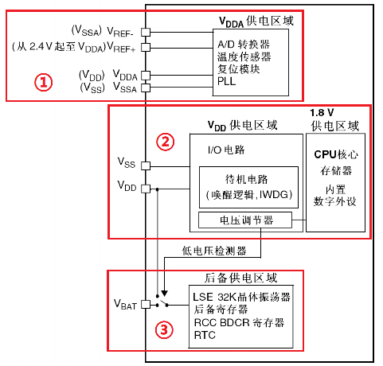
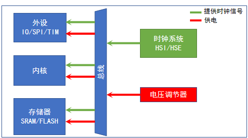
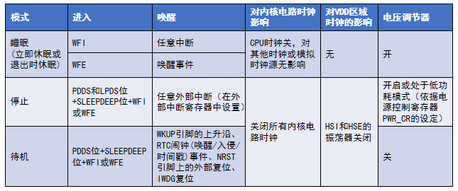
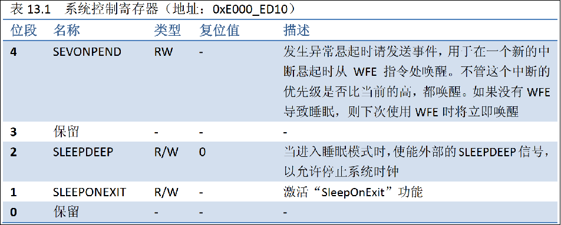
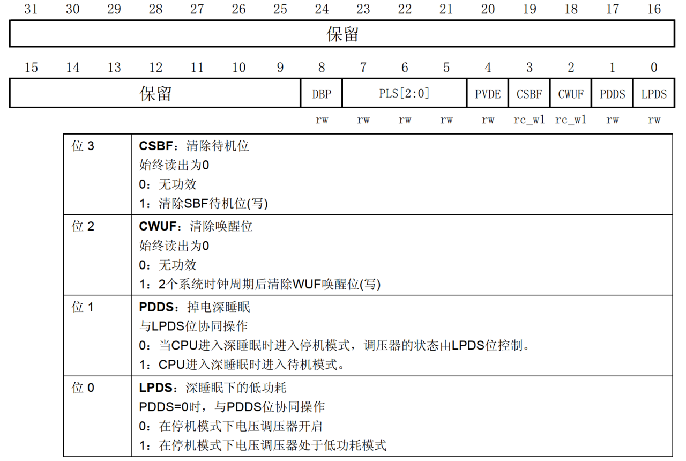
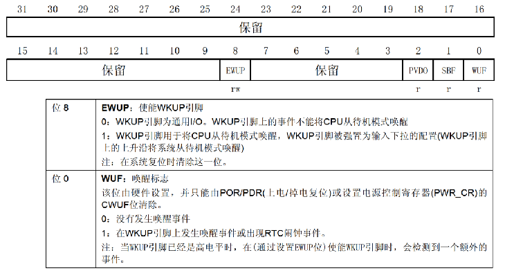

# STM32 HAL 18_PWR

## 1. STM32 电源系统

- STM32F1 的电源系统

  

  > - 器件的工作电压（VDD） 2.0~3.6V；
  >   1. 为了提高转换精度，给模拟外设独立供电；
  >   2. 电压调节器为1.8V供电区域供电，且1.8V供电区域是电源系统中最主要的部分。
  >   3. 两种供电方式：VBAT 和 VDD。主要电源被切断，该区域还能工作。

## 2. STM32 低功耗模式

STM32具有**运行**、**睡眠**、**停止**和**待机**四种工作模式。上电后默认是在运行模式，当内核不需要继续运行时，可以选择后面三种低功耗模式。



1. 睡眠模式

   内核时钟关闭，外设继续工作，对系统影响小，节能效果最差。

2. 停止模式

   内核时钟关闭，关闭内核逻辑电路的所有时钟，关闭时钟系统，存储器保留，节能效果好，程序不会复位，恢复时间较长。

3. 待机模式

   内核时钟关闭，关闭内核逻辑电路的所有时钟，关闭时钟系统，关闭电压调节器，存储器清空，节能效果最好，程序会复位，少数条件下能够唤醒。
   
   > 在待机模式下，所有的I/O引脚处于高阻态，除了以下的引脚：复位引脚(始终有效)，当被设置为防侵入或校准输出时的TAMPER引脚，被使能的唤醒引脚(PA0)。



## 3. HAL 库函数

### 寄存器简介

1. 系统控制寄存器(`SCB_SCR`)

   

   > 进入停止模式/待机模式 ，`SLEEPDEEP`置1。

2. 电源控制寄存器(`PWR_CR`)

   

   > - 停止模式：`PDDS`清0，`LPDS`选调节器模式。
   > - 待机模式：`PDDS`置1，清除唤醒位 `CWUF`。

3. 电源控制/状态寄存器(`PWR_CSR`)

	

### 内核指令

`WFI`和`WFE`都是Cortex内核进入低功耗的指令，`WFI`（wait for interrupt）和`WFE`（wait for event），如果仅仅从字面去理解，一个是中断（int）唤醒，一个是事件（event）唤醒。

`WFI`和`WFE`使用函数的格式`__WFI()`和`__WFE()`来调用。`__wfi`和`__wfe`是编译器内置的函数，函数内部调用了相对应的汇编指令。

>`WFE`因为可以等待事件，因此在某些不能`WFI`的场合可以采用`WFE`。比如唤醒后，系统需要做一些恢复操作，才能响应中断，采用`WFE`先唤醒系统，完成芯片所需的恢复操作。

### HAL 库函数

```c
/**
  * @brief 进入睡眠模式
  * @param Regulator
  * @param SLEEPEntry 	进入睡眠模式的执行指令WFE/WFI(PWR_SLEEPENTRY_WFI/PWR_SLEEPENTRY_WFE)
  */
void HAL_PWR_EnterSLEEPMode(uint32_t Regulator, uint8_t SLEEPEntry);

/**
  * @brief 当外部中断执行完返回主线程序的时候，如果调用该函数那么将重新进入睡眠模式，否则就接着睡眠前的程序执行
  */
void HAL_PWR_EnableSleepOnExit(void);

/**
  * @brief 进入停止模式
  * @param Regulator    电压调节器是否打开(PWR_MAINREGULATOR_ON/PWR_LOWPOWERREGULATOR_ON)
  * @param SLEEPEntry 	进入停止模式的执行指令WFE/WFI(PWR_SLEEPENTRY_WFI/PWR_SLEEPENTRY_WFE)
  */
void HAL_PWR_EnterSTOPMode(uint32_t Regulator, uint8_t STOPEntry);

/**
  * @brief 强制使能唤醒引脚
  * @param WakeUpPinx: 唤醒引脚号 PWR_WAKEUP_PIN1
  */
void HAL_PWR_EnableWakeUpPin(uint32_t WakeUpPinx);

/**
  * @brief 进入待机模式
  */
void HAL_PWR_EnterSTANDBYMode(void);

/**
  * @brief 停止系统滴答定时器
  */
__weak void HAL_SuspendTick(void);

/**
  * @brief 恢复系统滴答定时器
  */
__weak void HAL_ResumeTick(void);
```

1. 睡眠模式配置

   ```c
   HAL_SuspendTick();
   HAL_PWR_EnterSLEEPMode(0, PWR_STOPENTRY_WFI); // 进入睡眠模式
   HAL_ResumeTick();
   ```

2. 停止模式配置

   停止模式唤醒后，STM32 会使用 HSI（F1的 HSI 为8M，F4 为 12M）作为系统时钟。所以有必要在唤醒以后，在程序上重新配置系统时钟，将时钟切换回 HSE。

   唤醒延迟 ：基础延迟为 HSI 振荡器的启动时间，若调压器工作在低功耗模式，还需要加上调压器从低功耗切换至正常模式下的时间，若 FLASH 工作在掉电模式，还需要加上 FLASH 从掉电模式唤醒的时间。

   ```c
   HAL_SuspendTick();												// 停止系统滴答计时器
   HAL_PWR_EnterSTOPMode(PWR_LOWPOWERREGULATOR_ON, PWR_STOPENTRY_WFI);	// 电压调节器为低功耗模式，WFI指令进入停止模式
   SystemClock_Config();											// 重新配置系统时钟
   HAL_ResumeTick();												// 恢复系统滴答计时器
   ```

3. 待机模式配置

   ```c
   HAL_PWR_EnableWakeUpPin(PWR_WAKEUP_PIN1);						 // 强制使能WKUP(PA0)引脚
   SET_BIT(PWR->CR, PWR_CR_CWUF_Msk);								// 写1清除该位 唤醒位
   SET_BIT(PWR->CR, PWR_CR_CSBF_Msk);								// 写1清除该位 待机位
   while (1) {
   	HAL_Delay(1000);
   	SET_BIT(PWR->CR, PWR_CR_CWUF_Msk); 							// 写1清除该位 唤醒位 如果不清除此位 系统将保持唤醒状态
   	HAL_PWR_EnterSTANDBYMode();        							// 进入待机模式
   }
   ```

   

   

