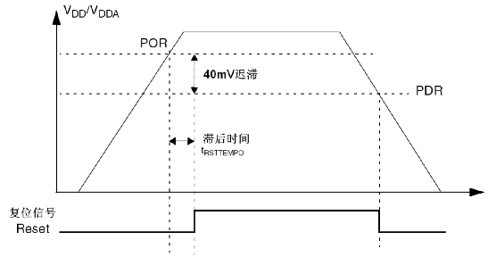
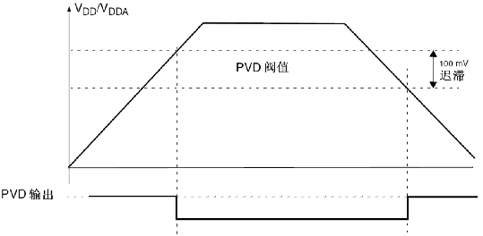
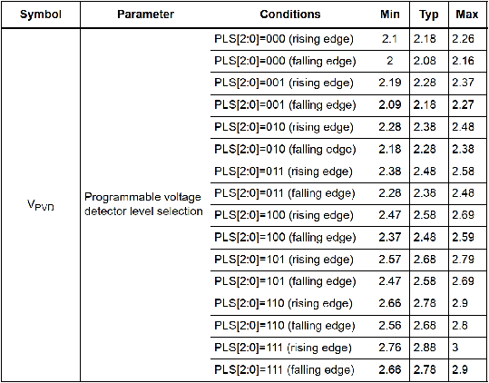
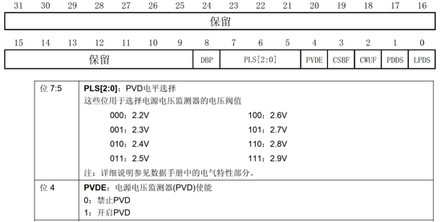
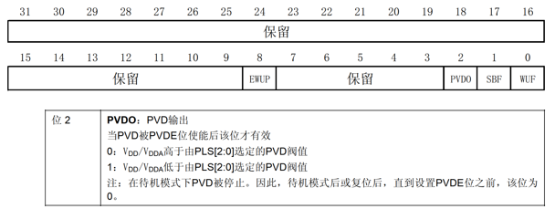

# STM32 HAL 19_PVD

## 1. STM32 PVD 简介

- 电源监控

  电源监控即对某些电源电压（VDD / VDDA / VBAT）进行监控。

  > POR/PDR（power on/down reset）：上电/掉电复位；
  >
  > PVD（programmable voltage detector）：监控VDD 电压；
  >
  > BOR（brown out reset）：欠压复位；
  >
  > AVD（analog voltage detector）：监控VDDA电压；
  >
  > VBAT阈值（battery voltage thresholds）：监控VBAT电池电压；
  >
  > 温度阈值（temperature thresholds）：监控结温。

- 上电/掉电复位 POR/PDR

	
	
	> VPOR阈值(典型值)为1.92V，VPDR阈值(典型值)为1.88V；
	
	上电时，当 VDD ＜ VPOR 阈值时，系统无需外部复位电路便会保持复位状态。当VDD ＞ VPOR阈值时，系统便退出复位状态，正常工作。掉电时，当VDD ＜ VPDR阈值时，系统就会保持复位状态。
	
- 可编程电压检测器 PVD

  

  监视供电电压VDD。当电压下降到设定阈值以下时产生中断，通知软件做紧急处理；当电压恢复到设定阈值以上时产生中断，通知软件供电恢复。供电下降的阈值和上升的阈值有固定差值，是为了防止电压在阈值上下小幅度抖动，而频繁产生中断。

  PVD总共可以设置7个等级，可以通过`PWR_CR`寄存器的`PLS[2:0]`来设置。下面是`PLS`的描述。

  

  其中最后一个等级是特殊的，它使用PB7引脚的电压和内部基准电压进行比较，使用这一等级时，PB7必须设置成模拟输入。

  一般而言，我们用前6个等级就足够了，具体选择哪个等级需要根据自己板子的实际情况来定夺，例如当MCU是3.3V供电且电源非常稳定时，就可以选择将阈值设置成3.1V，这样在掉电时就可以更早的触发PVD中断做紧急处理。同时也要注意电路上储能电容是否够大，这会影响PVD中断能处理多少代码，因为系统很快就要完全断电了。

## 2. HAL 库函数

### 寄存器简介

1. 电源控制寄存器 `PWR_CR`

   

2. 电源控制/状态寄存器 `PWR_CSR`

   

### HAL 库函数

```c
// PWR电源时钟
#define __HAL_RCC_PWR_CLK_ENABLE()   do { \
                                        __IO uint32_t tmpreg; \
                                        SET_BIT(RCC->APB1ENR, RCC_APB1ENR_PWREN);\
                                        /* Delay after an RCC peripheral clock enabling */\
                                        tmpreg = READ_BIT(RCC->APB1ENR, RCC_APB1ENR_PWREN);\
                                        UNUSED(tmpreg); \
                                      } while(0U)
                                          
/**
  * @brief  PVD 设置
  * @param  sConfigPVD	PVD设置结构体
  */
void HAL_PWR_ConfigPVD(PWR_PVDTypeDef *sConfigPVD);

// PVD设置结构体
typedef struct{ 
	uint32_t			PVDLevel; 		/* PVD检测级别 */ 
	uint32_t			Mode; 			/* PVD的EXTI检测模式 */ 
} PWR_PVDTypeDef;

/**
  * @brief  PVD 使能
  */
void HAL_PWR_EnablePVD(void);
```

> CubeMX 不提供 PVD 的初始化设置，需要手动设置。


