# STM32 HAL 1_环境配置

## 1. Windows 环境配置

### 1.1 Keil + STM32CubeMX 环境配置

- Keil 下载

1. 下载 MDK 53x


2. 一路点ok即可（注意修改安装路径）

3. 打开 Keil，选择 File -> License Management

​	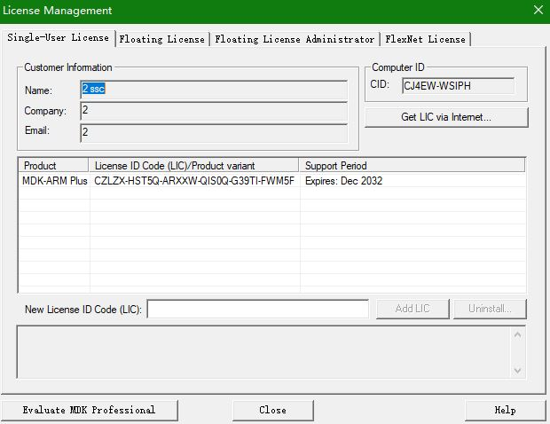

​	Name，Company，Email是随机填写的，最后复制CID。

4. 打开注册机（取消防火墙后操作）

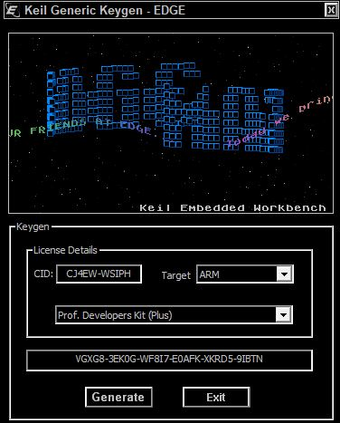

先复制CID，Target 选择 ARM，点击 Generate，最后复制生成的破解码。

5. 回到 3 所示的界面，复制刚才的破解码到 LIC，选择 Add LIC 即可破解。

- STM32CubeMX 的下载和初始配置

1. 首先需要下载 Java 环境。
2. 下载并安装 STM32CubeMX（高版本可打开低版本，但是低版本打不开高版本）（注意改变安装路径）
3. STM32CubeMX 的工程配置。

> 1. 选择芯片
>
> 2. 选择烧录方式
>
>    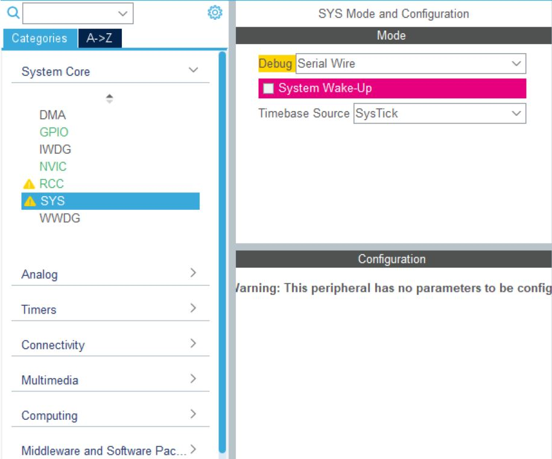
>
>    3. 选择时钟源（外部高速晶振）
>
>    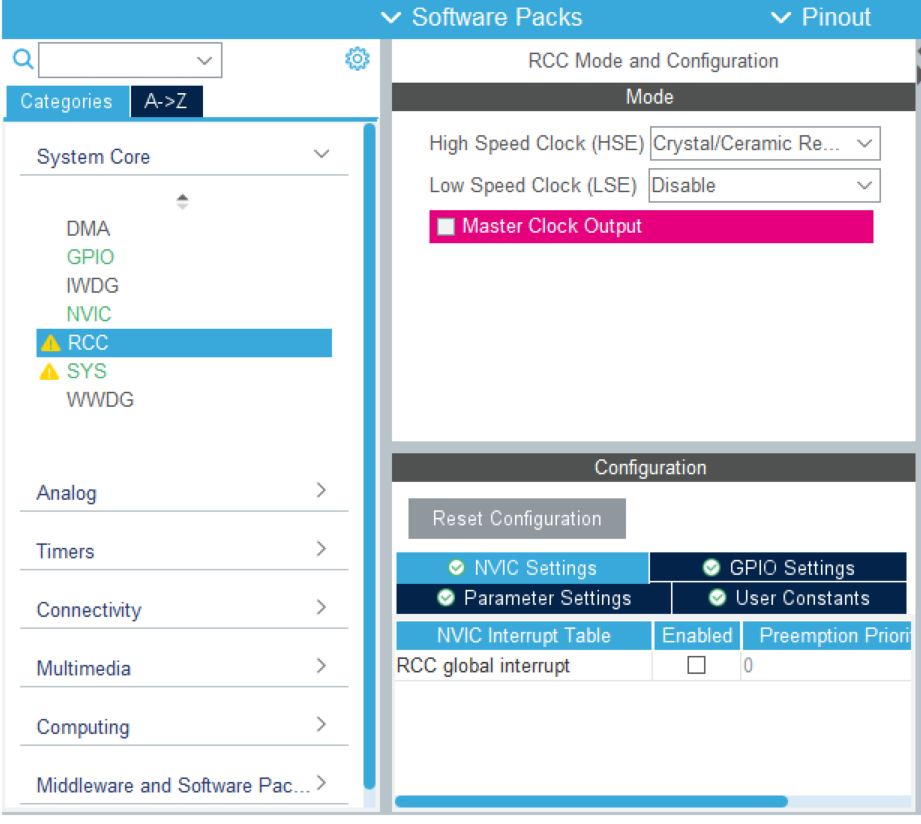
>
>    4. 配置所需要的外设
>
>    5. 配置时钟树
>
>       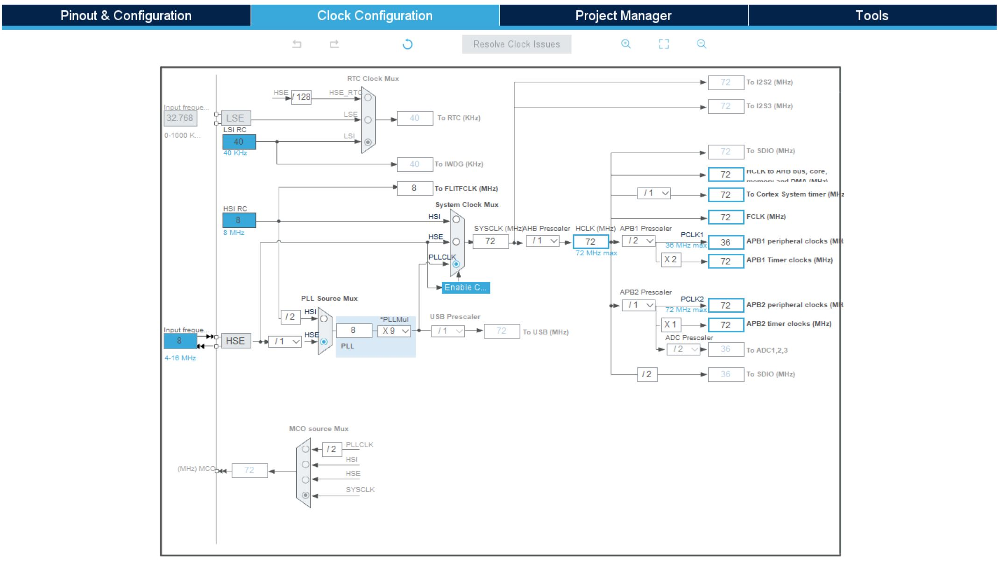
>
>       6. 配置工程路径(IDE 选择 MDK-ARM)
>
>       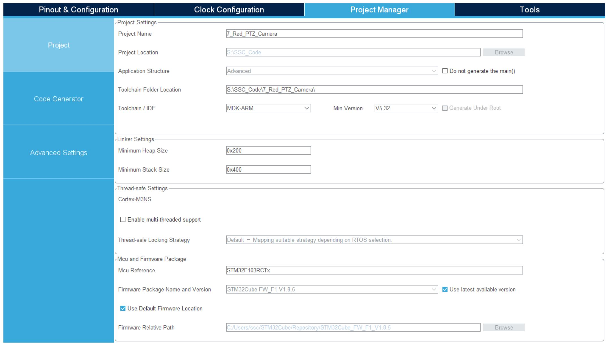
>
>       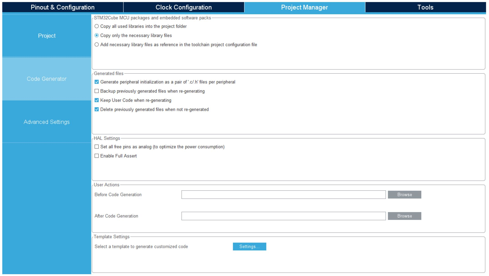
>
>       8. 选择 Generate Code 即可

#### Keil 使用说明

- 魔术棒设置

>|选项卡|说明|
>|----|---|
>|Target 选项卡|设置使用的编译器版本、外部晶振频率
>|Output 选项卡|设置Objects输出文件夹、生成.hex文件、输出浏览信息
>|Listing 选项卡|设置Listing输出文件夹
>|C/C++ 选项卡|设置全局宏定义、优化等级、C99 Mode、设置头文件包含路径
>|Debug 选项卡|设置使用的仿真器类型、选择的下载接口等
>|Utilities 选项卡|设置下载功能、下载算法、下载算法起始地址和大小等
>|Linker 选项卡|添加分散加载文件

1. AC5和AC6编译器对比
- AC6 对中文支持极差， goto definition 无法使用，误报等
- AC6 对某些代码优化可能导致运行异常，需慢慢调试
- AC6 编译速度比 AC5 快
- AC6 语法检查非常严格，代码严谨性较好

一般使用AC5编译器。

2. 文件路径

绝对路径是指目录下的绝对位置，直接到达目标位置，通常是从盘符开始的路径；

相对路径就是指由某个文件所在的路径引起的跟其它文件（或文件夹）的路径关系；

>1. 默认路径就是指 MDK 工程所在的路径，即.uvprojx 文件所在路径（文件夹）
>2. “./”表示当前目录（相对当前路径，也可以写做“.\”）
>3. “../”表示当前目录的上一层目录（也可以写做“..\”）

### 1.2 STM32CubeMX + Clion 环境配置

- 环境配置

1. OpenOCD 用于程序烧录


2. MinGW 提供编译环境

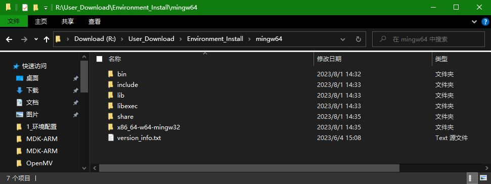

3. arm-none-eabi-gcc 交叉编译链


4. 添加环境变量

.\GNU Arm Toolchain\GNU Arm Embedded Toolchain\10 2021.10\bin

.\OpenOCD-20230712-0.12.0\bin

.\mingw64\bin

- Clion 安装

1. 找到Clion官网进行下载和安装，激活方式自定（激活码可以去网上随便翻翻）
2. 在Clion中选择创建STM32CubeMX的项目

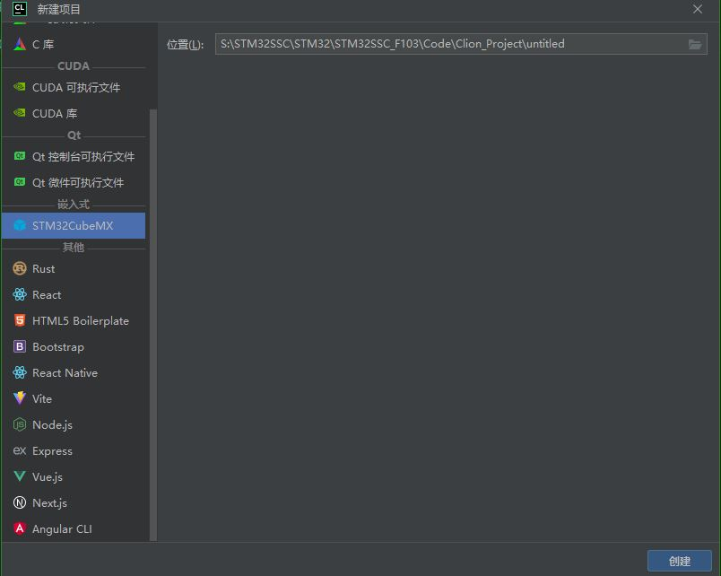

3. 点击create后会生成一个**.ioc**文件，这个文件跟使用STM32CubeMX直接创建的是一样的，点击链接可以跳转到STM32CubeMX中打开这个ioc文件.

4. 默认选中的芯片型号是STM32F030F4Px，可以在CubeMX中重新选择自己需要的芯片，一切操作都和使用Keil开发没有区别。

   > 设置中**项目名称一定要和在Clion中建立的一致**，这样生成的工程文件才会覆盖Clion中的文件，否则会另外生成一个文件夹，Clion就无法读取了。

   > 生成的IDE类型选择是**STM32CubeIDE**。

每次修改完点Generate之后，弹窗直接点Close，Clion里面会自动更新文件。

5. 在文件 -> 设置里面选择 STM32CubeMX 和 OpenOCD 的位置

   

6. 编译工具链配置

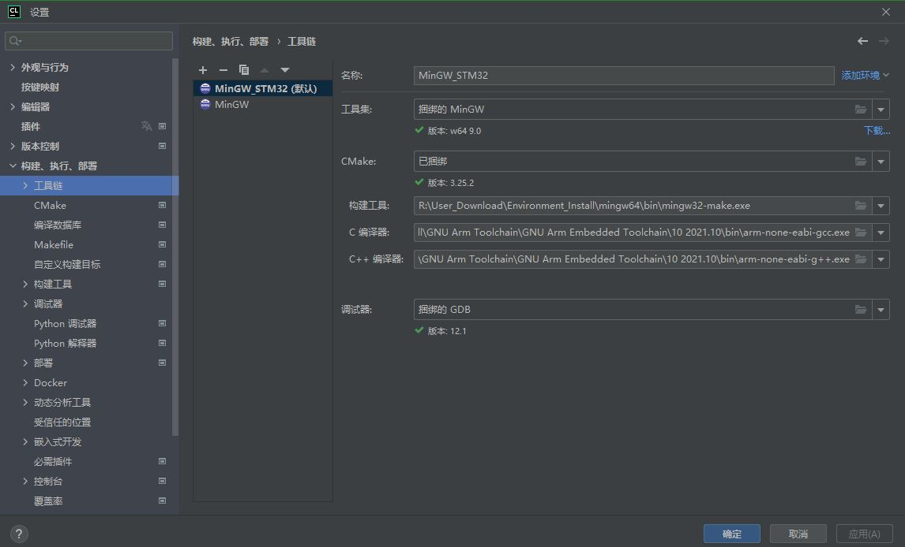

此时可编译通过。

7. 烧录配置

> 1. 新建配置文件stlink.cfg
>
> ```
> # choose st-link/j-link/dap-link etc.
> #adapter driver cmsis-dap
> #transport select swd
> source [find interface/stlink.cfg]
> transport select hla_swd
> source [find target/stm32f1x.cfg]
> # download speed = 10MHz
> adapter speed 10000
> ```
>
> 前两行设置了仿真器的类型和接口，下面几行指定了**Flash大小**、**芯片类型**、**下载速度**等。
>
> 2. 烧录配置中添加文件即可
>
> 

- 常见问题

1. 

```
Info : The selected transport took over low-level target control. The results might differ compared to plain JTAG/SWD
adapter speed: 8000 kHz
adapter_nsrst_delay: 100
Info : clock speed 8000 kHz
Info : STLINK v2 JTAG v31 API v2 SWIM v7 VID 0x0483 PID 0x3748
Info : using stlink api v2
Info : Target voltage: 3.162004
Info : Unable to match requested speed 8000 kHz, using 4000 kHz
Info : Stlink adapter speed set to 4000 kHz
Warn : UNEXPECTED idcode: 0x2ba01477
Error: expected 1 of 1: 0x1ba01477
in procedure 'program' 
in procedure 'init' called at file "embedded:startup.tcl", line 495
in procedure 'ocd_bouncer'
** OpenOCD init failed **
shutdown command invoked
```

识别STLink ID错误，通常是 STLink 过新或过旧

> 1. 配置文件首行加入 set CPUTAPID 0 禁止识别ID
> 2. 修改以下其中一行：
>
> ```
> #jtag scan chain
> if { [info exists CPUTAPID] } {
>    set _CPUTAPID $CPUTAPID
> } else {
>    if { [using_jtag] } {
>       # See STM Document RM0008 Section 26.6.3
>       set _CPUTAPID 0x3ba00477
>    } {
>       # this is the SW-DP tap id not the jtag tap id
>       set _CPUTAPID 0x1ba01477
>    }
> }
> ```
>
> 为
>
> ```
> set _CPUTAPID 0x2ba01477
> ```

### 1.3 STM32CubeMX + VSCode + EIDE 环境配置

- 首先在VSCode上下载以下插件：


- 进行以下配置：

1. 编译链配置

> 1. 如果安装了Keil，则可以配置以下编译链
>
> 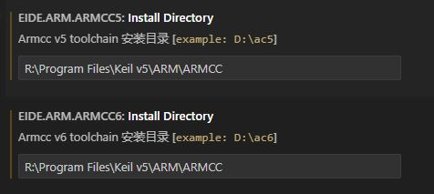
>
> 2. arm-none-eabi-gcc 交叉编译链
>
> 

2. 生成配置


点击左侧边框生成的EIDE插件：


在”设置编译链“里面如果看到相关编译链旁边显示√，则配置完成。

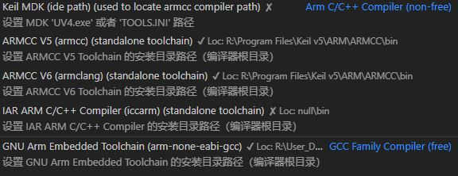

- 工程配置

1. 使用STM32CubeMX中的`Makefile`选项生成工程。

2. 用 VS Code 打开刚才生成的工程目录，随后EIDE - 新建项目 - 空项目 - Cortex-M - 输入项目名称（需要和 CubeMX 生成的文件夹名称相同）；

3. 弹出文件夹选择窗口，选择工程目录的**上一级文件夹**。

   出现如下警告时，点 yes，并在之后的弹窗中选择切换到工作区；


在资源管理器中可以看到以下文件：

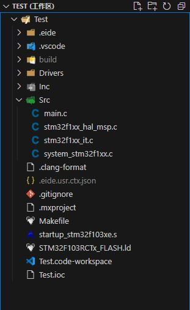

4. 选择项目资源，将以下类型的文件添加进项目资源中：

> 1. 源代码文件夹（包含.c/.h文件）；
> 2. 启动文件（.s文件）。
> 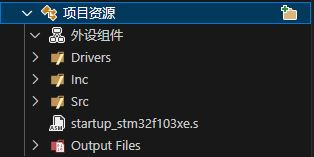

5. 构建配置选项中的连接脚本路径修改为工程文件夹下后缀名为`.ld`的文件名（包含后缀）；


6. 烧录配置选择STLink
7. 打开项目属性右侧的钳子图标：


添加以下内容（包含文件目录和全局宏定义）：


注意：**这些内容可以从工程文件夹中的Makefile文件中获得。**

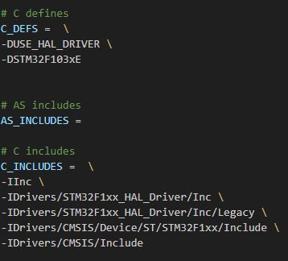

8. 随后可以进行编译和运行。


从左到右为编译，清理，下载，重新编译。

- 调试配置

在调试中选择设置，出现的`launch.json`文件中有以下配置选项：


注意只需要修改第二个.cfg文件的文件名。

在Cortex Debug插件中，使用settings.json文件编辑方式，在此文件中加入以下几行：

```json
    "cortex-debug.armToolchainPath": "R:\\User_Download\\Environment_Install\\GNU Arm Toolchain\\GNU Arm Embedded Toolchain\\10 2021.10\\bin", \\ 交叉编译链路径
    "cortex-debug.variableUseNaturalFormat": false,
    "cortex-debug.openocdPath": "R:\\User_Download\\Environment_Install\\OpenOCD\\OpenOCD-20230712-0.12.0\\bin\\openocd.exe", \\ OpenOCD路径
```

随后即可使用stlink进行调试。


