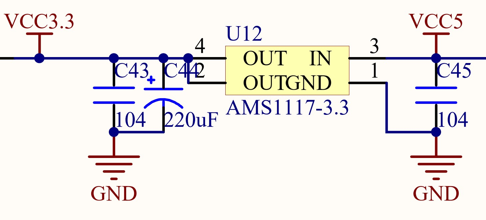
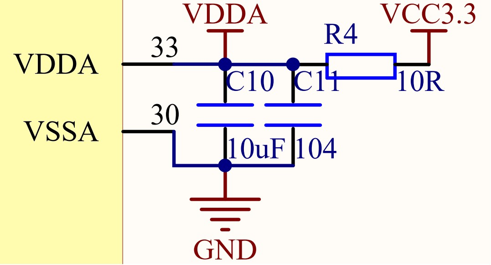
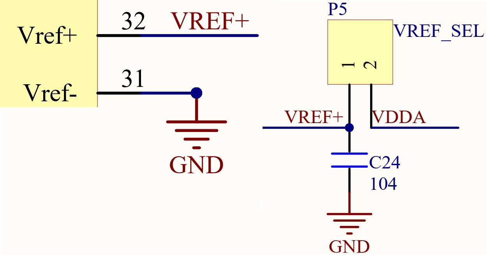
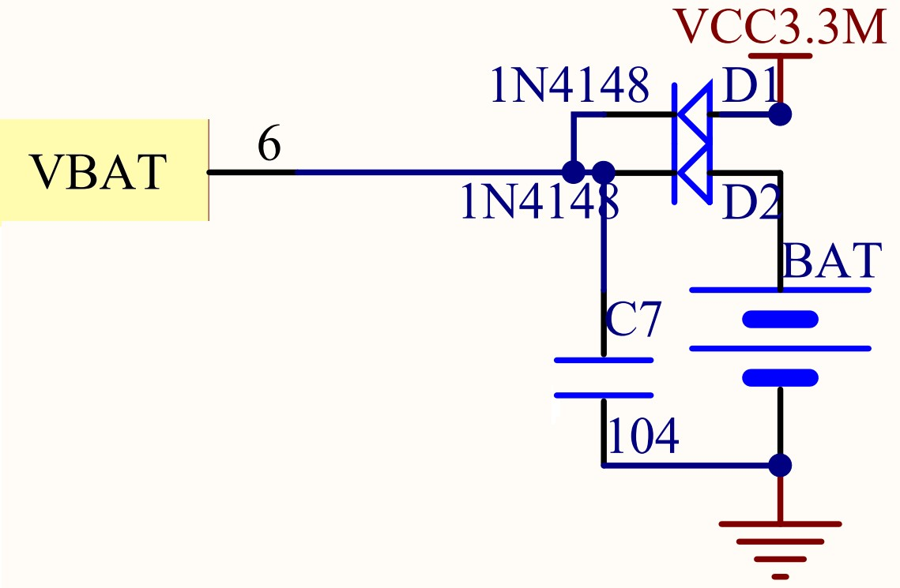
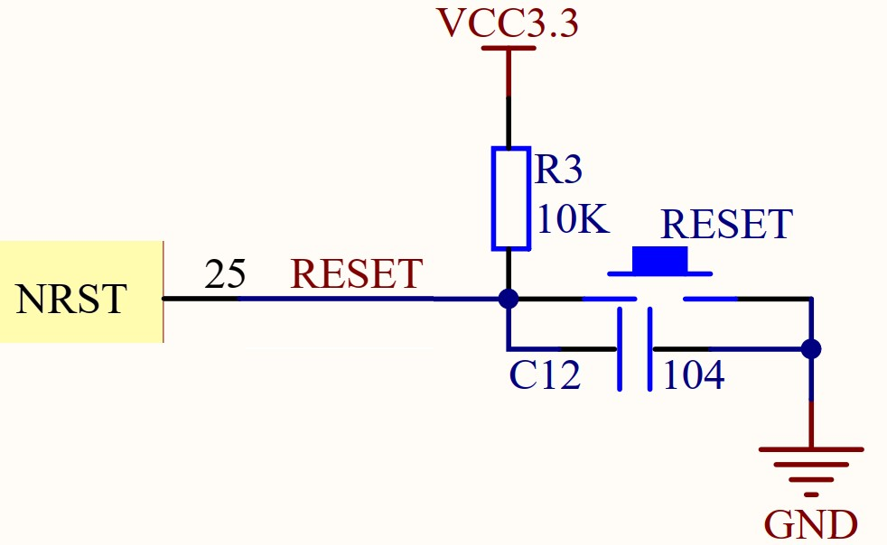
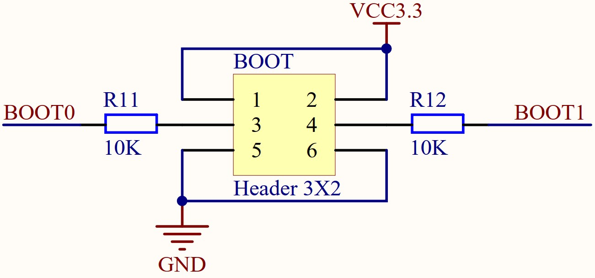
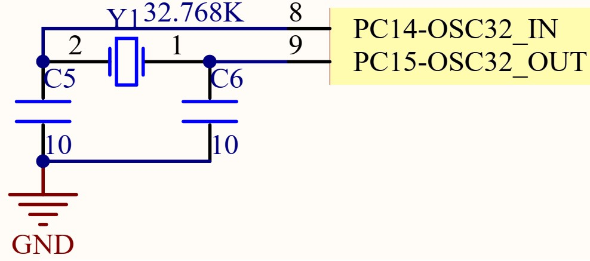
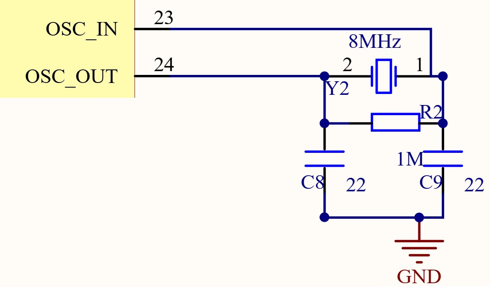

# STM32 HAL 2_最小系统电路

最小系统电路：保证MCU正常工作的最小电路组成单元;

>|类型| 引脚| 说明|
>|-------|----------|---------|
>|电源 | VDD/VSS|电源引脚，用于给STM32供电;
>||      VDDA/VSSA|模拟部分电源引脚，用于给STM32模拟部分电路供电;
>||      VREF+/VREF-|参考电压引脚，为ADC/DAC提供参考电压;
>||      VBAT|RTC/后备区域引脚，给RTC和后备区域供电;一般VBAT接电 池，用于断电维持RTC工作，若不需要时接VDD;
>|复位 | NRST|用于STM32低电平复位
>|启动 | BOOT0/BOOT1|启动选择引脚
>|晶振 |OSC_IN/OSC_OUT|外部HSE晶振引脚，为STM32提供高精度系统时钟。使用内部HSI时可不接晶振。
>||OSC32_IN/OSC32_OUT|外部LSE晶振引脚，为RTC提供时钟。使用内部LSI时可不接晶振。
>|调试|SWCLK/SWDIO|SWD调试引脚

1. **电源电路**

数字电源：AMS1117-3.3为稳压器，将5V电压变为3.3V电压。

模拟电源：使用RC低通滤波器;

RTC/后备区域电源：使用纽扣电池供电;

2. **复位电路**

STM32复位引脚NRST保持低电平状态时间1~4.5ms即可复位。

上电时，由于电容处于短路状态，STM32低电平复位。

3. **BOOT启动电路**

4. **晶振电路**

低速晶振(LSE)

高速晶振(HSE)
