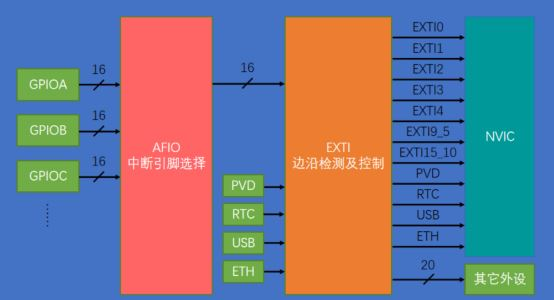

# STM32 HAL 5_EXTI

## 1. 中断

**中断：** 打断CPU执行正常的程序，转而处理紧急程序，然后返回原暂停的程序继续运行.
高效处理紧急程序，不会一直占用CPU资源.

**中断嵌套**：一个中断程序运行时可以被更高优先级的中断打断。依次处理后依次返回。


**STM32 嵌套向量中断控制器NVIC**


**中断向量表：** 定义一块固定的内存，以4字节对齐，存放各个中断服务函数程序的首地址。中断向量表定义在启动文件，当发生中断，CPU会自动执行对应的中断服务函数。

NVIC支持：256个中断（16内核 + 240外部），支持：256个优先级。


***优先级***

1. **抢占优先级(pre)：** 高抢占优先级可以打断正在执行的低抢占优先级中断。为高n位。
2. **响应优先级(sub)：** 当抢占优先级相同时，响应优先级高的先执行，但是不能互相打断。为低(4-n)位。
3. 抢占和响应都相同的情况下，自然优先级越高的，先执行。
4. 自然优先级：中断向量表的优先级。
5. ***数值越小，表示优先级越高***。

- NVIC寄存器
>| NVIC相关寄存器                        | 位数 | 寄存器个数 | 备注                                  |
>| ------------------------------------- | ---- | ---------- | ------------------------------------- |
>| 中断使能寄存器（ISER）                | 32   | 8          | 每个位控制一个中断                    |
>| 中断除能寄存器（ICER）                | 32   | 8          | 每个位控制一个中断                    |
>| 应用程序中断及复位控制寄存器（AIRCR） | 32   | 1          | 位[10:8]控制优先级分组                |
>| 中断优先级寄存器（IPR）               | 8    | 240        | 8个位对应一个中断，而STM32只使用高4位 |

- 优先级分组配置：

>| 优先级分组 | AIRCR[10:8] | IPRx bit[7:4]分配 | 分配结果                     |
>| ---------- | ----------- | ----------------- | ---------------------------- |
>| 0          | 111         | None  ：[7:4]     | 0位抢占优先级，4位响应优先级 |
>| 1          | 110         | [7]  ：[6:4]      | 1位抢占优先级，3位响应优先级 |
>| 2          | 101         | [7:6]  ：[5:4]    | 2位抢占优先级，2位响应优先级 |
>| 3          | 100         | [7:5]  ：[4]      | 3位抢占优先级，1位响应优先级 |
>| 4          | 011         | [7:4]  ：None     | 4位抢占优先级，0位响应优先级 |

## 2. EXTI外部中断

EXTI可以监测指定GPIO口的电平信号，当其指定的GPIO口产生电平变化时，EXTI将立即向NVIC发出中断申请，经过NVIC裁决后即可中断CPU主程序，使CPU执行EXTI对应的中断程序。

### EXTI基本结构



- AFIO IO引脚复用

AFIO主要完成两个任务：**复用功能引脚重映射、中断引脚选择**。


- EXTI 框图


1. **边沿检测**

> 在`EXTI_RTSR`对应置1，为上升沿检测;
>
> 在`EXTI_FTSR`对应置1，为下降沿检测;
>
> 在`EXTI_FTSR`和`EXTI_RTSR`对应置1，为双边沿检测;

2. **软件触发**

3. **中断屏蔽/状态显示/清除**

> 当`EXTI_IMR`中对应位置1时且`EXTI_PR`置1时，中断传至NVIC，同时`EXTI_PR`对应标志位清除。


**EXTI 中断分组**

包含20个产生事件/中断请求的边沿检测器，即总共20条EXTI线

> **中断：** 要进入NVIC，有相应的中断服务函数，需要CPU处理
>
> **事件：** 不进入NVIC，仅用于内部硬件自动控制的，如：TIM、DMA、ADC

**EXTI 中断处理流程**

1. 中断触发
2. 系统调用中断服务函数

```c
/**
  * @brief EXTI1外部中断服务函数
  */
void EXTI1_IRQHandler(void)
{
  /* USER CODE BEGIN EXTI1_IRQn 0 */

  /* USER CODE END EXTI1_IRQn 0 */
  HAL_GPIO_EXTI_IRQHandler(GPIO_PIN_1);			//进入中断处理公用函数
  /* USER CODE BEGIN EXTI1_IRQn 1 */

  /* USER CODE END EXTI1_IRQn 1 */
}
```

3. 进入中断处理公用函数

```c
/**
  * @brief  EXTI外部中断处理公用函数
  * @param  GPIO_Pin: Specifies the pins connected EXTI line
  * @retval None
  */
void HAL_GPIO_EXTI_IRQHandler(uint16_t GPIO_Pin)
{
  /* EXTI line interrupt detected */
  if (__HAL_GPIO_EXTI_GET_IT(GPIO_Pin) != 0x00u)
  {
    __HAL_GPIO_EXTI_CLEAR_IT(GPIO_Pin);					// 清除标志位
    HAL_GPIO_EXTI_Callback(GPIO_Pin);					// 进入回调函数
  }
}
```

4. 进入中断回调函数进行数据处理

```c
/**
  * @brief	EXTI回调函数，由用户编写
  * @attention 回调函数名可以在中断处理公用函数文件中找到
  */
void HAL_GPIO_EXTI_Callback(uint16_t GPIO_Pin)
{
	if( GPIO_Pin == GPIO_PIN_1 )						//引脚判断
	{
		HAL_GPIO_TogglePin(GPIOA,GPIO_PIN_7);			//中断执行的代码，注意不能有太长的延时
  }
}
```

**中断回调函数中不能有大量延时**，否则会造成程序的卡死。


