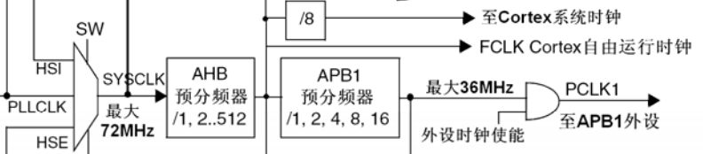

# 系统时钟 Systick

Systick 是内核时钟，表示内核的运行时基。

---

**Systick 时钟源：**

Systick 时钟源可以由 AHB 时钟(HCLK) 8 分频生成的时钟或者 AHB 时钟直接生成的 FCLK Cortex 自由运行时钟得到。



---

**Systick 寄存器：**

Systick 是一个 24 位定时器，其寄存器如下：

1. Systick 控制/状态寄存器

   | 位段 | 名称        | 类型 | 复位值 | 描述                                                         |
   | :--- | :---------- | :--- | :----- | :----------------------------------------------------------- |
   | 16   | `COUNTFLAG` | R    | 0      | 如果在上次读取本寄存器后，Systick 已经数到了 0，则该位为 1。如果读取该位，该位将自动清零 |
   | 2    | `CLKSOURCE` | R/W  | 0      | 0 - 外部时钟源(HCLK)<br/>1 - 内核时钟(FCLK)                  |
   | 1    | `TICKINT`   | R/W  | 0      | 1 - Systick 倒数到 0 时产生 Systick 中断请求<br/>0 - 数到 0 时无动作 |
   | 0    | `ENABLE`    | R/W  | 0      | Systick 定时器的使能位                                       |

2. Systick 重装载寄存器

   | 位段 | 名称     | 类型 | 复位值 | 描述                                  |
   | :--- | :------- | :--- | :----- | :------------------------------------ |
   | 23:0 | `RELOAD` | R/W  | 0      | 当 Systick 倒数至零时，将被重装载的值 |

3. Systick 当前数值寄存器

   | 位段 | 名称      | 类型 | 复位值 | 描述                                                         |
   | :--- | :-------- | :--- | :----- | :----------------------------------------------------------- |
   | 23:0 | `CURRENT` | R/Wc | 0      | 读取时返回当前倒计数的值，写它则使之清零，同时还会清除在 Systick 控制及状态寄存器中的 `COUNTFLAG` 标志 |

寄存器定义在 `core_cm3.h` 中：

```c
typedef struct
{
  __IOM uint32_t CTRL;                   /*!< Offset: 0x000 (R/W)  SysTick Control and Status Register */
  __IOM uint32_t LOAD;                   /*!< Offset: 0x004 (R/W)  SysTick Reload Value Register */
  __IOM uint32_t VAL;                    /*!< Offset: 0x008 (R/W)  SysTick Current Value Register */
  __IM  uint32_t CALIB;                  /*!< Offset: 0x00C (R/ )  SysTick Calibration Register */
} SysTick_Type;
```

---

**Systick 的配置：**

对于 CubeMX 的工程，Systick 按照以下的调用链完成配置：

`SystemClock_Config()` 函数 -> `HAL_RCC_ClockConfig()` 函数 -> `HAL_RCC_GetHCLKFreq()` 函数获取系统时钟，并赋值给 `SystemCoreClock` -> `HAL_InitTick()` 函数配置 Systick 中断优先级和时钟 -> `HAL_SYSTICK_Config()` 配置 Systick 中断周期 -> `SysTick_Config()` 函数配置 `SysTick` 结构体的 `LOAD`，`VAL`，`CTRL` 成员：

```c
__STATIC_INLINE uint32_t SysTick_Config(uint32_t ticks)
{
  if ((ticks - 1UL) > SysTick_LOAD_RELOAD_Msk)
  {
    return (1UL);                                                   /* Reload value impossible */
  }

  SysTick->LOAD  = (uint32_t)(ticks - 1UL);                         /* set reload register */
  NVIC_SetPriority (SysTick_IRQn, (1UL << __NVIC_PRIO_BITS) - 1UL); /* set Priority for Systick Interrupt */
  SysTick->VAL   = 0UL;                                             /* Load the SysTick Counter Value */
  SysTick->CTRL  = SysTick_CTRL_CLKSOURCE_Msk |
                   SysTick_CTRL_TICKINT_Msk   |
                   SysTick_CTRL_ENABLE_Msk;                         /* Enable SysTick IRQ and SysTick Timer */
  return (0UL);                                                     /* Function successful */
}
```

---

**Systick 中断优先级：**

Systick 是内核中断，没有抢占优先级和响应优先级的区别。其优先级可以编程，通常配置 Systick 中断优先级为 15(对应抢占优先级 3，响应优先级 3，优先级最低)。

由于 Systick 优先级最低，任何一个中断都能打断 Systick，因此基于 Systick 进行延时的函数不能在其余更高优先级的中断使用。

Systick 的中断服务函数如下：

```c
/**
  * @brief This function handles System tick timer.
  */
void SysTick_Handler(void)
{
  /* USER CODE BEGIN SysTick_IRQn 0 */

  /* USER CODE END SysTick_IRQn 0 */
  HAL_IncTick();
  /* USER CODE BEGIN SysTick_IRQn 1 */

  /* USER CODE END SysTick_IRQn 1 */
}
```

其中 `HAL_IncTick()` 的实现是本质上是将当前的时钟加一个 tick 值，这个值取决于 Systick 的周期(CubeMX 默认配置 1ms)。

```c
__weak void HAL_IncTick(void)
{
  uwTick += uwTickFreq;
}
```

