# DMA

直接存储器读取 DMA 用于提供在**外设和存储器之间**或者**存储器和存储器之间**的高速数据传输，而无需 CPU 干预。数据可以通过 DMA 进行快速移动，此时 CPU 的资源可以节省下来进行其他操作。（比如传输一个比较大的数值，可以使用 DMA 避免阻塞 CPU）。

> - 存储器：片上 SRAM，FLASH，片外存储器的地址空间(可以是程序中的一个数组)；
> - 外设：APB1，APB2，AHB 外设中的数据寄存器 DR，实质也是存储器。

DMA 的传输方向包括：**存储器到外设**，**外设到存储器**，**存储器到存储器**。其中，存储器之间的数据传输由软件触发；外设和存储器之间的数据传输由硬件触发（由外设产生 DMA 请求）。

## 1. F1 的 DMA 功能

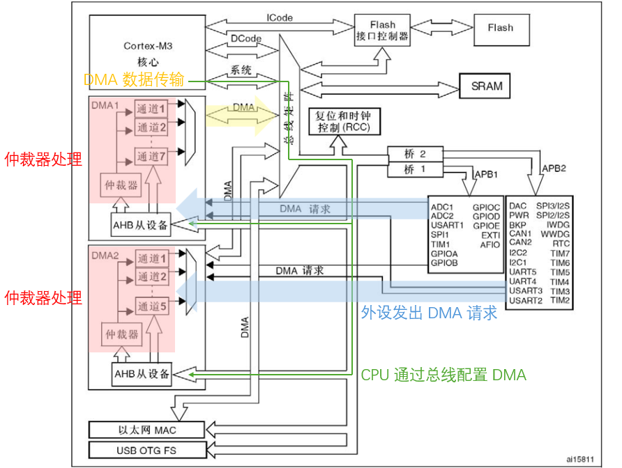

---

***DMA 通道配置：***

DMA1 有 7 个通道，DMA2 有 5 个通道。DMA 传输的数据量最大能到达 65535，包含要传输的数据项数量，每次 DMA 传输后递减传输计数。

外设和存储器的指针在每次传输后可以有选择地完成自动增量。当设置为增量模式时，下一个要传输的地址将是前一个地址加上增量值，增量值取决于所选的数据宽度（半字，字，字节）。第一个传输的地址是需要传输的数据首地址，在 DMA 传输过程中，软件不能改变或者读取当前 DMA 正在传输的地址。

> **循环模式和非循环模式：**
>
> - 非循环模式：传输结束后（传输计数变为 0）不产生 DMA 操作，需要产生新的 DMA 传输时，需要在关闭 DMA 通道时重新写入传输计数。
>
> - 循环模式：传输结束时，传输计数重新加载为初始值，同时 DMA 传输的外设/存储器地址被重新加载为初始地址。DMA 操作继续运行。
>
>   循环模式通常用于处理连续的数据流。

> **通道配置流程：**
>
> 1. 在 `DMA_CPARx` 寄存器中设置外设寄存器的地址。发生外设数据传输请求时，这个地址将是数据传输的源或目标。
> 2. 在 `DMA_CMARx` 寄存器中设置数据存储器的地址。发生外设数据传输请求时，传输的数据将从这个地址读出或写入这个地址。
> 3. 在 `DMA_CNDTRx` 寄存器中设置要传输的数据量。在每个数据传输后，这个数值递减。
> 4. 在 `DMA_CCRx` 寄存器的 `PL[1:0]` 位中设置通道的优先级。
> 5. 在 `DMA_CCRx` 寄存器中设置数据传输的方向、循环模式、外设和存储器的增量模式、外设和存储器的数据宽度、传输一半产生中断或传输完成产生中断。
> 6. 设置 `DMA_CCRx` 寄存器的 `ENABLE` 位，启动该通道。一旦启动了 DMA 通道，它既可响应连到该通道上的外设的 DMA 请求。

> **数据宽度和对齐方式：**
>
> 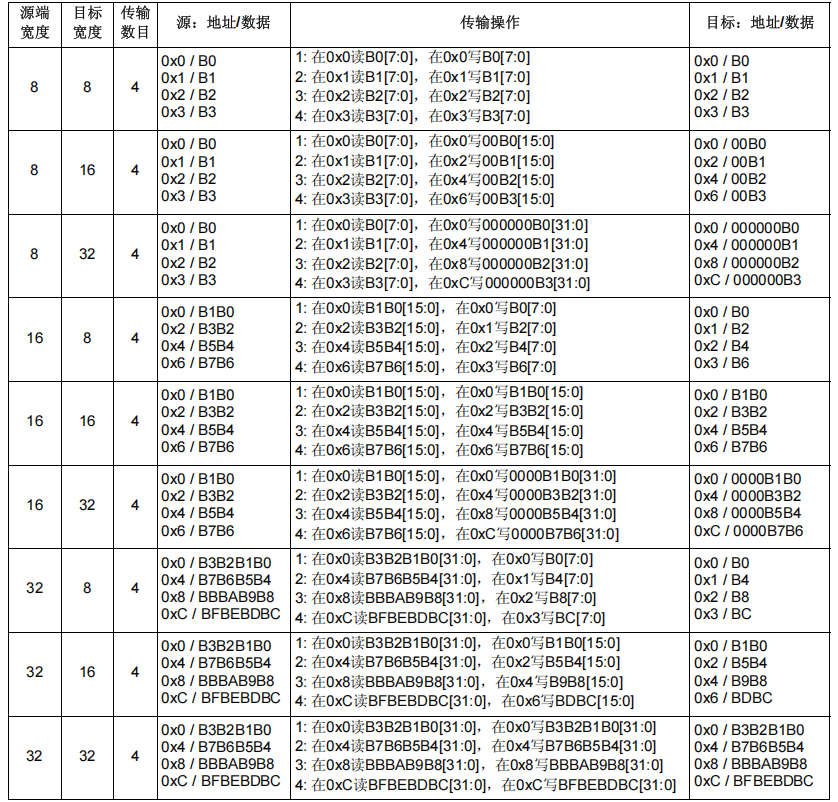

> **DMA 请求映射：**
>
> 每一个外设只能使用特定的 DMA 通道：
>
> 对于 DMA1：
>
> 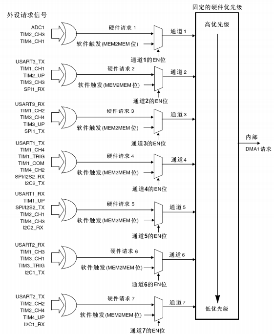
>
> 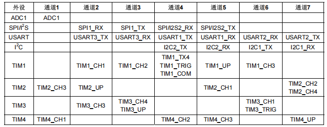
>
> 对于 DMA2：
>
> 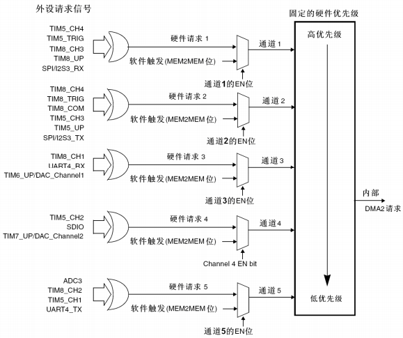
>
> 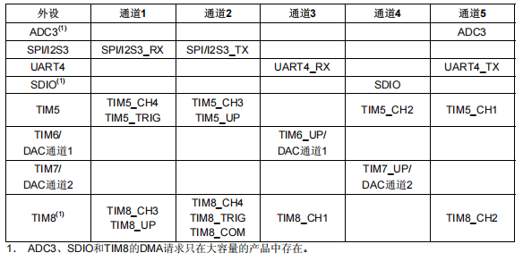


---

***DMA 传输流程：***

在发生一个事件后，外设向 DMA 控制器发送一个请求信号 (需要使能外设的 DMA 请求)。DMA控制器根据通道的优先级处理请求。

当 DMA 控制器开始访问发出请求的外设时，DMA 控制器立即发送给外设一个应答信号。

当外设从 DMA 控制器得到应答信号时，外设立即释放它的请求。一旦外设释放了这个请求，DMA 控制器同时撤销应答信号。此后 DMA 控制器开始进行数据传输。

数据传输时，DMA 的操作包含：

- 从外设数据寄存器或者从当前外设/存储器地址寄存器指示的存储器地址取数据，第一次传输时的开始地址是 `DMA_CPARx` 或 `DMA_CMARx` 寄存器指定的外设基地址或存储器单元。
- 存数据到外设数据寄存器或者当前外设/存储器地址寄存器指示的存储器地址，第一次传输时的开始地址是 `DMA_CPARx` 或 `DMA_CMARx` 寄存器指定的外设基地址或存储器单元。
- 执行一次 `DMA_CNDTRx` 寄存器的递减操作，该寄存器包含未完成的操作数目。

> **优先级：**
>
> 外设/存储器只能同时支持一个 DMA 访问，因此需要根据 DMA 优先级进行仲裁，仲裁依次包含以下两个阶段：
>
> 1. 软件优先级：有 4 个等级 - 最高/高/中等/低；
> 2. 硬件优先级：当两个请求有相同软件优先级时，低编号通道的优先级更高。
>
> DMA1 的优先级高于 DMA2。

> **中断：**
>
> 当传输一半的数据后，半传输标志 `HTIF` 被置1，当设置了允许半传输中断位 `HTIE` 时，将产生一个中断请求。在数据传输结束后，传输完成标志 `TCIF` 被置1，当设置了允许传输完成中断位`TCIE` 时，将产生一个中断请求。
>
> 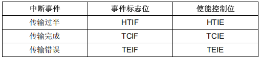

## 2. F4 的 DMA 功能

F4 的 DMA 架构如下，相对于 F1，F4 采用了双 AHB 主总线架构，一个用于存储器访问，另一个用于外设访问。

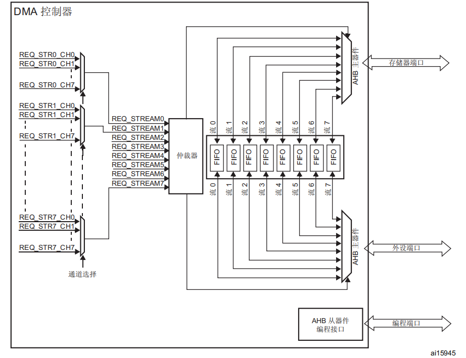

DMA 控制器提供两个 AHB 主端口：AHB 存储器端口（用于连接存储器）和 AHB 外设端口（用于连接外设）。但是如果需要执行存储器到存储器的传输，AHB 外设端口必须也能访问存储器。AHB 从端口用于对 DMA 控制器进行配置。

DMA 和总线矩阵的链接关系如下：其中 DMA1 控制器 AHB 外设端口与 DMA2 控制器的情况不同，不连接到总线矩阵，**仅 DMA2 数据流能够执行存储器到存储器的传输**。

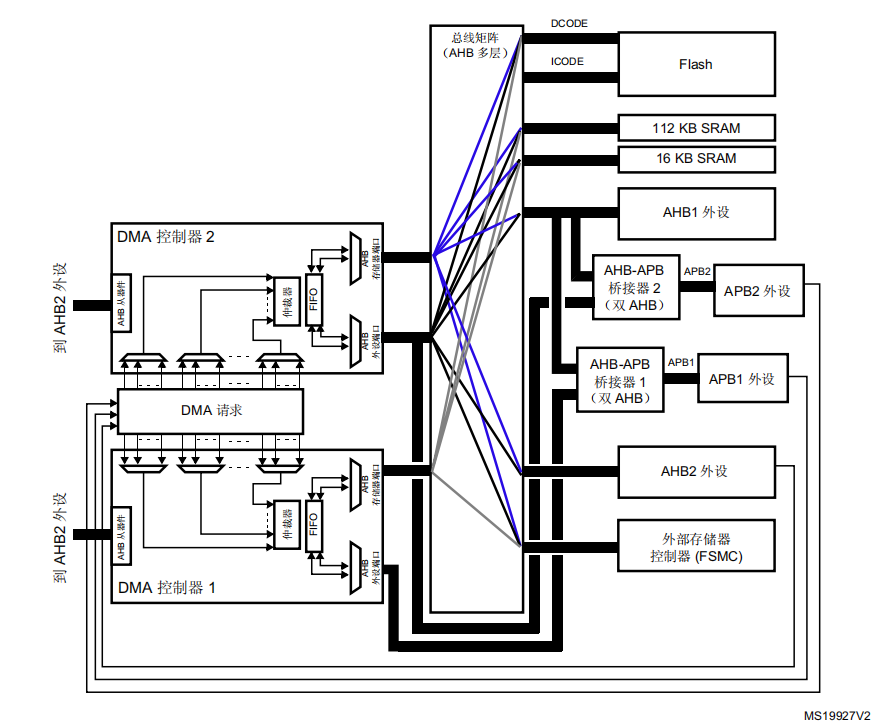

---

***DMA 通道配置：***

> **DMA 请求映射：**
>
> 每个 DMA 控制器有 8 个数据流，每个数据流有多达 8 个通道。每个数据流都与一个 DMA 请求相关联，此 DMA 请求可以从 8 个可能的通道请求中选出。 
>
> 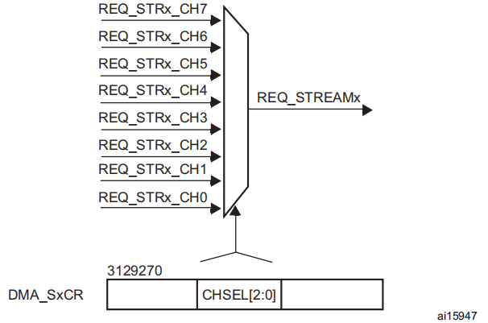
>
> 请求映射表如下所示，具体映射表需要参考芯片手册：
>
> DMA1：
>
> 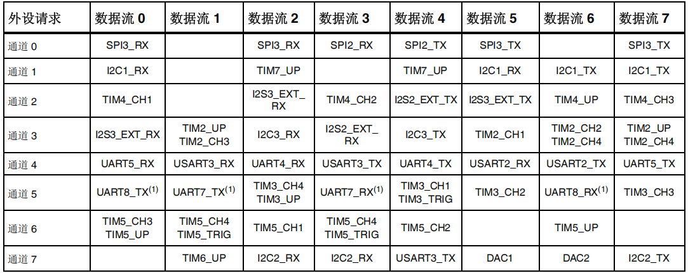
>
> DMA2：
>
> 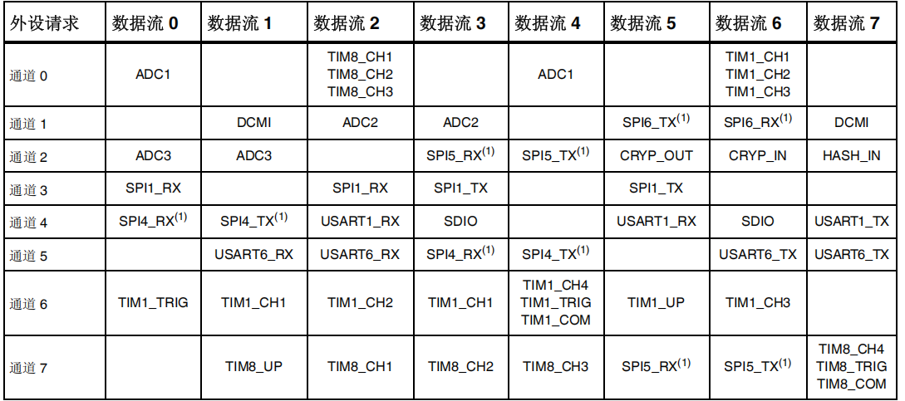

> **双缓冲区模式：**
>
> 双缓冲区模式适用于 DMA1 和 DMA2 的所有数据流，将 `DM_SxCR` 寄存器的 `DBM` 位置 1 即可使能双缓冲区模式。
>
> 双缓冲区模式拥有两个存储器指针，每次 DMA 操作和常规操作一致。在此模式下，**每次事务结束时，DMA 控制器都从一个存储器目标交换为另一个存储器目标**。因此 **CPU 在处理一个存储器区域的同时，DMA 传输还可以填充/使用第二个存储器区域**。
>
> **双缓冲区模式启用时将自动启动循环模式**。
>
> 双缓冲区模式下，当一个基地址正在被写入时，该基地址不可被修改，但是另一个基地址可以被修改。
>
> 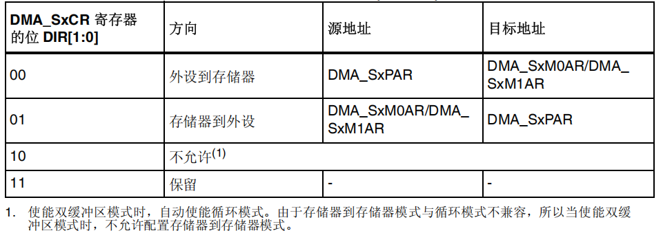
>
> STM32CubeMX 内没有关于双缓冲区模式的配置，如果需要使用双缓冲区模式，需要使能循环模式，在代码中按照以下方式开启：
>
> ```c
> #define BUFFER_SIZE 512
> uint16_t buf0[BUFFER_SIZE]; // 缓冲区 0
> uint16_t buf1[BUFFER_SIZE]; // 缓冲区 1
> 
> HAL_DMAEx_MultiBufferStart_IT(&hdma_adc1, 
>                                   (uint32_t)&ADC1->DR, // 外设地址
>                                   (uint32_t)buf0,      // 内存地址 0
>                                   (uint32_t)buf1,      // 内存地址 1
>                                   BUFFER_SIZE);
> ```
>
> 双缓冲区启动后，DMA 会在写满一个缓冲区时自动切换，并触发传输完成中断，通过 `CT` 位判断使用的缓冲区：
>
> ```c
> void HAL_ADC_ConvCpltCallback(ADC_HandleTypeDef* hadc)
> {
>     if (__HAL_DMA_GET_CT(&hdma_adc1) == 0) {
>         // CT=0，说明 DMA 当前已切换回 buf0，刚刚填满的是 buf1
>         // 此处处理 buf1 数据
>     } else {
>         // CT=1，说明 DMA 当前在使用 buf1，刚刚填满的是 buf0
>         // 此处处理 buf0 数据
>     }
> }
> ```

> **FIFO 和传输模式：**
>
> - 外设到存储器：
>
>   外设到存储器模式下，每次产生外设请求，数据流启动从数据源到外设的传输。**达到 FIFO 的阈值级别时，FIFO 的内容移出并存储到目标中。**
>
>   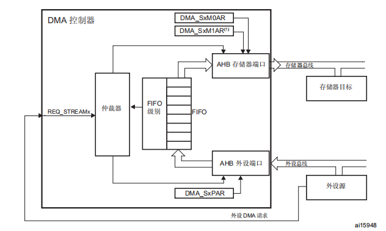
>
>   如果传输的数据项到零、外设请求传输终止（使用外设流控制器）或寄存器中的使能位由软件清零，传输即会停止。
>
>   直接模式下，不使用 FIFO 的阈值控制，每完成一次从外设到 FIFO 的数据传输后，相应的数据立即就会移出并存储到目标中。
>
> - 存储器到外设：
>
>   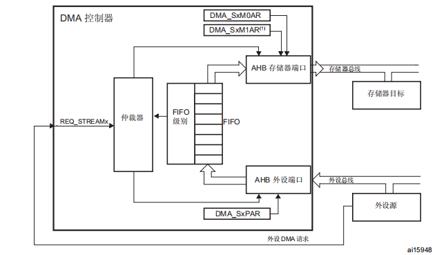
>
>   存储器到外设模式下，数据流会立即启动传输，从源完全填充 FIFO。每次发生外设请求，FIFO 的内容都会移出并存储到目标中。**当 FIFO 的级别小于或等于预定义的阈值级别时，将使用存储器中的数据完全重载 FIFO**。
>
>   如果传输的数据项到零、外设请求传输终止（使用外设流控制器）或寄存器中的使能位由软件清零，传输即会停止。
>
>   直接模式下，不使用 FIFO 的阈值级别。一旦使能了数据流，DMA 便会预装载第一个数据，将其传输到内部 FIFO。一旦外设请求数据传输，DMA 便会将预装载的值传输到配置的目标。然后，它会使用要传输的下一个数据再次重载内部空 FIFO。
>
> - 存储器到存储器：
>
>   通过将 `DMA_SxCR` 寄存器中的使能位 `EN` 置 1 来使能数据流时，数据流会立即开始填充  FIFO，直至达到阈值级别。达到阈值级别后，FIFO 的内容便会移出，并存储到目标中。
>
>   使用存储器到存储器模式时，不允许循环模式和直接模式。
>
> - FIFO - 在源数据传输到目标之前临时存储这些数据
>
>   每个数据流都有一个独立的 4 字 FIFO，阈值级别可由软件配置为 1/4、1/2、3/4 或满。FIFO 可以使用不同的数据宽度传输到目标（实现打包和拆包）。
>
>   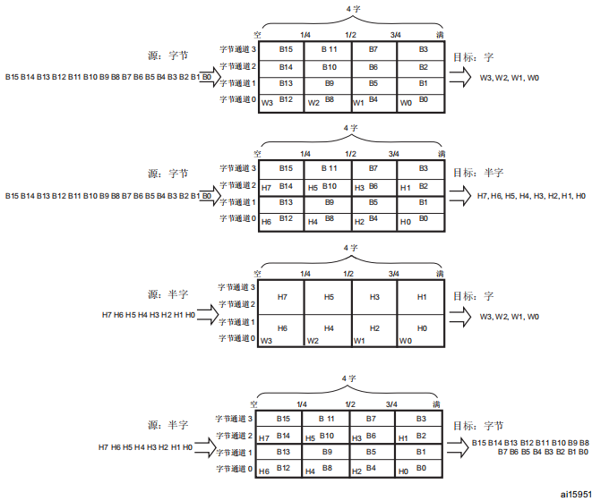

> **单次传输和突发传输：**
>
> DMA 控制器可以产生单次传输或 4 个、8 个和 16 个节拍的增量突发传输。
>
> 单次传输下，每次 DMA 请求只搬运一个数据单元（大小由数据宽度决定）。每次搬运都必须重新申请总线使用权，搬运完成后立即释放 AHB 总线。直接模式下只能使用单次传输。
>
> 突发传输下，**每次 DMA 请求一次性连续搬运一组数据（4/8/16 个节拍），并且在搬运过程中锁定 AHB 总线，这组数据全部搬完才释放总线**。突发模式下必须使用 FIFO。突发大小指示突发中的节拍数，而不是传输的字节数。FIFO 阈值指向的内容必须与整数个存储器突发传输完全匹配。
>
> 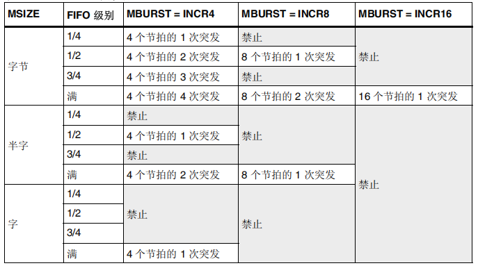
>
> > 以下情况会发生不完整突发传输：
> >
> > 1. 对于 AHB 外设端口配置，数据项总数不是突发大小与数据大小乘积的倍数。
> > 2. 对于 AHB 存储器端口配置：要传输到存储器的 FIFO 中的剩余数据项的数目不是突发大小与数据大小乘积的倍数。
> >
> > 即使在 DMA 数据流配置期间请求突发事务，要传输的剩余数据也将由 DMA 在单次传输模式下管理。

> **流控制器：**控制要传输的数据数目的实体称为流控制器。
>
> 1. DMA 控制器：要传输的数据项的数目在使能 DMA 数据流之前由软件编程到 `DMA_SxNDTR` 寄存器。
> 2. 外设源或目标：当要传输的数据项的数目未知时属于这种情况。当所传输的是最后的数据时，外设通过硬件向 DMA 控制器发出指示。仅限能够发出传输结束信号的外设支持此功能。对于 F4，仅 SDIO 支持。

可能的 DMA 配置如下：

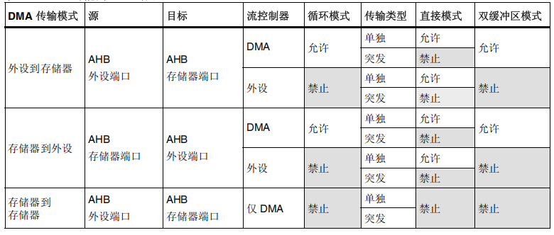

DMA 配置应当遵循以下步骤：

1. 如果使能了数据流，通过重置 `DMA_SxCR` 寄存器中的 EN 位将其禁止，然后读取此位以确认没有正在进行的数据流操作。将此位写为 0 不会立即生效，因为实际上只有所有当前传输都已完成时才会将其写为 0。当所读取 EN 位的值为 0 时，才表示可以配置数据流。因此在开始任何数据流配置之前，需要等待 EN 位置 0。应将先前的数据块 DMA 传输中在状态寄存器（`DMA_LISR` 和 `DMA_HISR`）中置 1 的所有数据流专用的位置 0，然后才可重新使能数据流。
2. 在 `DMA_SxPAR` 寄存器中设置外设端口寄存器地址。外设事件发生后，数据会从此地址移动到外设端口或从外设端口移动到此地址。
3. 在 `DMA_SxMA0R` 寄存器（在双缓冲区模式的情况下还有 `DMA_SxMA1R` 寄存器）中设置存储器地址。外设事件发生后，将从此存储器读取数据或将数据写入此存储器。
4. 在 `DMA_SxNDTR` 寄存器中配置要传输的数据项的总数。每出现一次外设事件或每出现一个节拍的突发传输，该值都会递减。
5. 使用 `DMA_SxCR` 寄存器中的 `CHSEL[2:0]` 选择 DMA 通道。
6. 如果外设用作流控制器而且支持此功能，请将 `DMA_SxCR` 寄存器中的 `PFCTRL` 位置 1。
7. 使用 `DMA_SxCR` 寄存器中的 `PL[1:0]` 位配置数据流优先级。
8. 配置 FIFO 的使用情况（使能或禁止，发送和接收阈值）。
9. 配置数据传输方向、外设和存储器增量 / 固定模式、单独或突发事务、外设和存储器数据宽度、循环模式、双缓冲区模式和传输完成一半和/或全部完成，和/或 `DMA_SxCR` 寄存器中错误的中断。
10. 通过将 `DMA_SxCR` 寄存器中的 EN 位置 1 激活数据流。
