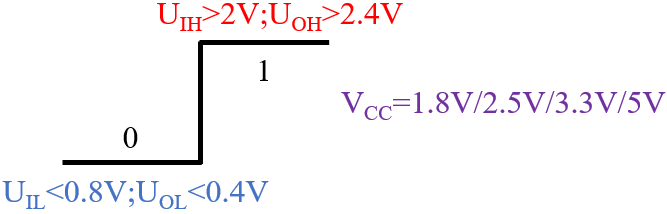
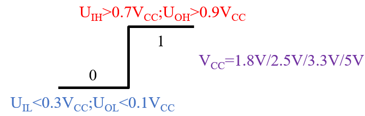
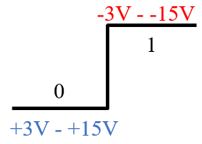
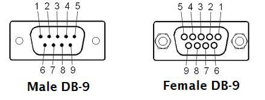
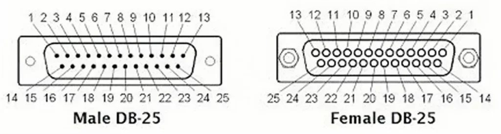
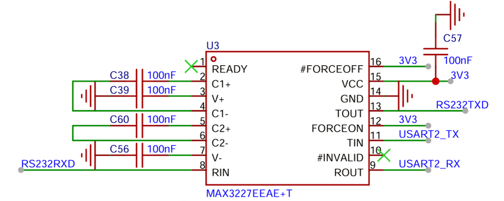
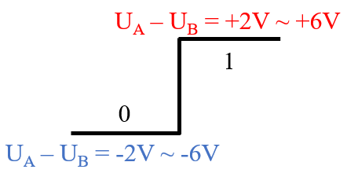
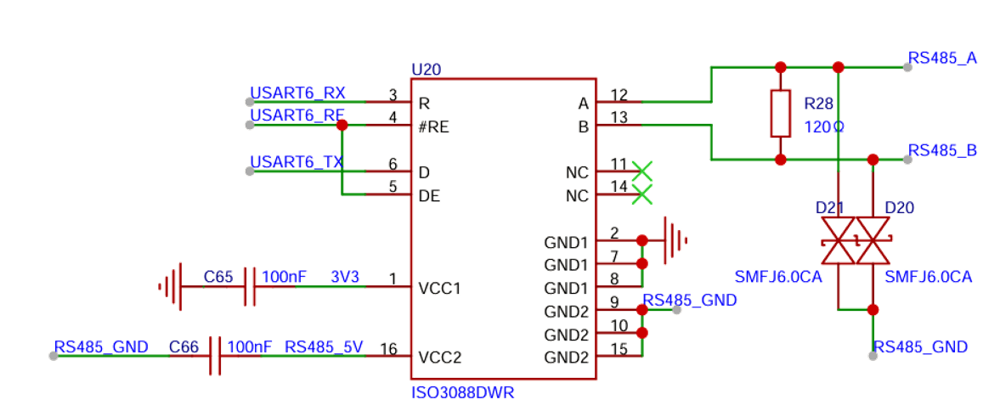

# 串口电平标准

## 1. TTL/CMOS 标准

TTL 电平标准细分为 TTL 电平，CMOS 电平和 LVTTL 电平。

1. TTL 电平，最常用的电平标准

   

2. CMOS 电平

   

   > 通常的 TTL 和 CMOS 电平标准的供电电压是 5V，比 5V 更低的供电电压称为 LVTTL / LVCMOS 电平标准。

TTL / CMOS 标准是单端电平，通常引出 TXD，RXD，GND 三根线（可全双工通信），两个通信设备之间要求共地。

TTL / CMOS 标准只能支持点对点通信，不支持总线通信。

## 2. RS232 标准

RS232 标准是单端电平，通常引出 TXD，RXD，GND 三根线（可全双工通信），两个通信设备之间要求共地。

RS232 标准只能支持点对点通信，不支持总线通信。

RS232 的波特率通常在 1Mbps 以下，通信距离较近。

RS232 的电平标准如下：

> RS232 通常使用 DB9 / DB25 端口进行接线：
>
> - DB9 引脚定义
>
>   
>
>   | 引脚 | 信号 |     名称     |
>   | - | - | - |
>   | 1 | DCD  |   载波检测   |
>   | 2 | RXD  |   接收数据   |
>   | 3 | TXD  |   发送数据   |
>   | 4 | DTR  | 数据终端就绪 |
>   | 5 | GND  |    信号地    |
>   | 6 | DSR  | 数据设备就绪 |
>   | 7 | RTS  |   请求发送   |
>   | 8 | CTS  |   清除发送   |
>   | 9 |  RI  |   振铃指示   |
>
> - DB25 引脚定义
>
>   
>
>   | 引脚 |     信号     |          名称           |
>   | -| - | - |
>   |    1 | FG / Shield  |     机壳地 / 屏蔽地     |
>   |    2 |   TXD / TD   |        发送数据         |
>   |    3 |   RXD / RD   |        接收数据         |
>   |    4 |     RTS      |        请求发送         |
>   |    5 |     CTS      |        清除发送         |
>   |    6 |     DSR      |      数据设备就绪       |
>   |    7 |   SG / GND   |         信号地          |
>   |    8 |   DCD / CD   |        载波检测         |
>   |    9 |  +V / TEST  |       保留 / 测试       |
>   |   10 |  -V / TEST  |       保留 / 测试       |
>   |   11 |      -       |      未定义 / 保留      |
>   |   12 |  SCD / SDCD  |      辅助载波检测       |
>   |   13 |     SCTS     |      辅助清除发送       |
>   |   14 |  STD / TXD2  |      辅助发送数据       |
>   |   15 |   TC / TXC   |        发送时钟         |
>   |   16 |  SRD / RXD2  |      辅助接收数据       |
>   |   17 |   RC / RXC   |        接收时钟         |
>   |   18 |      -       |      未定义 / 保留      |
>   |   19 |     SRTS     |      辅助请求发送       |
>   |   20 |     DTR      |      数据终端就绪       |
>   |   21 |   SQD / RL   | 信号质量检测 / 远端环回 |
>   |   22 |      RI      |        振铃指示         |
>   |   23 | DSRD / CH/CI |      数据速率选择       |
>   |   24 |  XTC / ETC   |      外部发送时钟       |
>   |   25 |      TM      |        测试模式         |
>
>

通常只需要 TXD，RXD 和 GND 即可实现通信。

> - RTS/CTS 是硬件流控线，如果使用硬件流控，两设备间的 RTS 和 CTS 需要交叉连接。发送端读取 CTS 电平检测是否允许发送；接收端控制 RTS 电平控制是否允许发送端发送。
> - DTR/DSR/DCD 用于就绪检测，两设备间的 DTR 和 DSR+DCD 需要交叉连接。（现已很少使用）

TTL 转 RS232 方案：

## 3. RS485 标准

RS485 标准是差分电平，通常引出 A，B两根线（半双工通信）（引出两对 A，B 线可全双工通信），两个通信设备之间不要求共地。

RS485 标准支持点对点通信和总线通信。

RS485 的波特率可达到 1Mbps 以上，通信距离可以很远。

RS485 的电平标准如下：

TTL 转 RS485 方案（隔离）：

> - DE/RE 引脚负责进行收/发控制，通常接在一起，由软件进行收发控制。

## 4. RS422 标准

RS422 标准是单端电平，通常引出 TX+，TX-，RX+，RX- 四根线（全双工通信），两个通信设备之间不要求共地。

RS422 标准支持点对点通信和一主多从通信。

RS422 的波特率通常可以达到 10Mbps，通信距离较远。

RS422 的电平标准如下：

硬件设计上，RS422 可以参考两个 RS485 模块进行设计。
