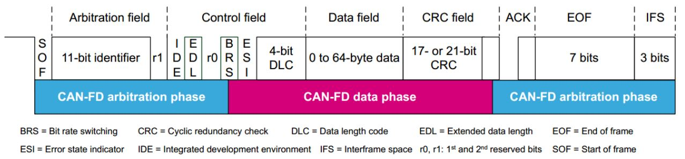
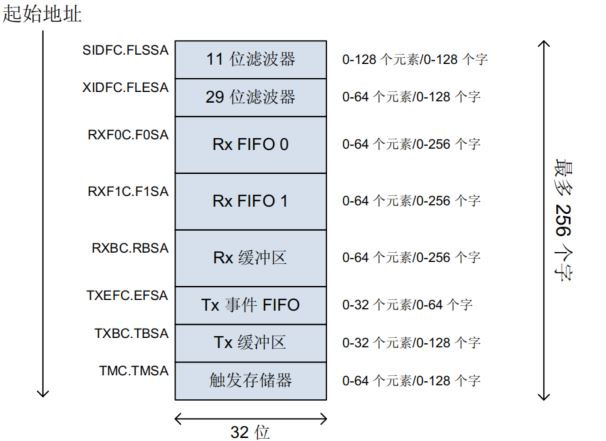
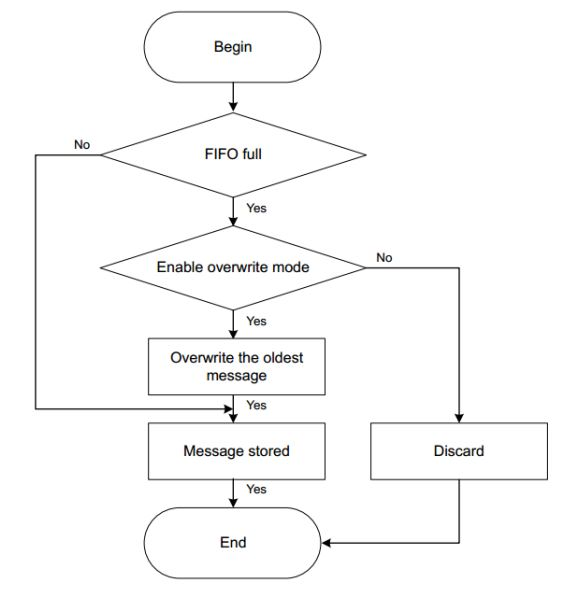
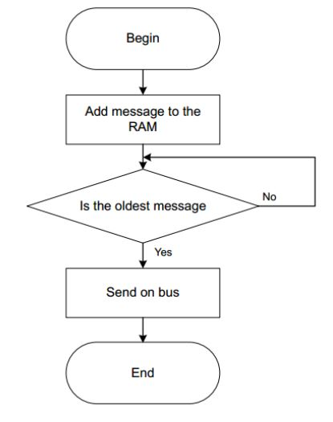
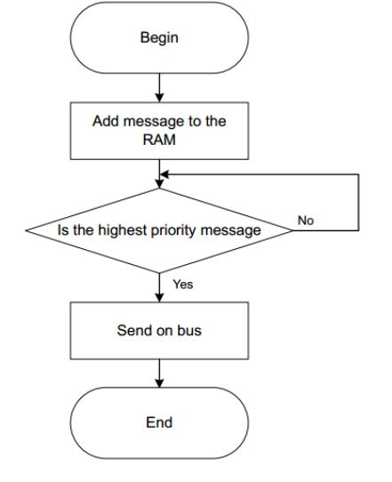
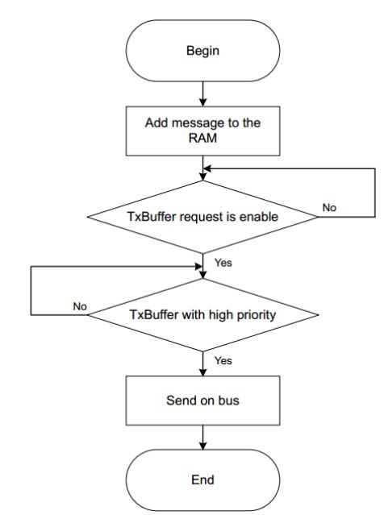

# FDCAN

FDCAN 是面向 CAN FD 通信协议的新一代 CAN 外设，兼容经典 CAN 协议，同时性能更强。

## 1. CAN FD 协议

相对于 CAN 协议，CAN FD 协议增强了以下内容：

- CAN FD 通信帧定义：
  - `EDL` - 标识普通 CAN 报文 / CAN FD 报文；
  - `BRS` - 速率转换位；
  - `ESI` - 标识节点是否错误。



- **可变传输速率**

  在总线仲裁阶段，CAN FD 和 CAN 协议使用相同的比特率（最高 1Mbps）；使得所有节点能正确同步和仲裁。

  当仲裁结束，某节点获得发送权并进入数据段后，CAN FD 会提高数据传输速率（最高 8Mbps）。

  该速率切换由 CAN FD 帧的 `BRS` 位控制。

  > `BRS` 位隐性时，速率可变（即 `BRS` 到 `CRC` 使用可变速率传输）；`BRS` 位显性时，以正常的 CAN-FD总线速率传输（恒定速率）。
  >
  > CAN FD 采用了两种位速率：从控制段中的 `BRS` 位到 `ACK` 段之前（含 `CRC` 分界符）为可变速率，其余部分为 CAN 总线使用的速率，即仲裁段和数据控制段使用标准 CAN 的通信波特率，而数据传输段时就会切换到更高的通信波特率。
  >
  > **两种速率各有一套位时序定义寄存器，它们除了采用不同的位时间单位 `tq` 外，位时间各段的分配比例也可不同**。

- **数据段长度扩展**

  普通 CAN 最多传输 8 bit 数据，CAN FD 扩展为最多传输 64 bit 数据。

  数据长度码 `DLC` 为 4 bit，0 - 8 的定义不变，新增 9 - 15 的定义：

  | `DLC` | CAN 数据帧长度 | CAN FD 数据帧长度 |
  | :---- | :------------- | :---------------- |
  | 0-8   | 0-8 字节       | 0 - 8 字节        |
  | 9     | 8 字节         | 12 字节           |
  | 10    | 8 字节         | 16 字节           |
  | 11    | 8 字节         | 20 字节           |
  | 12    | 8 字节         | 24 字节           |
  | 13    | 8 字节         | 32 字节           |
  | 14    | 8 字节         | 48 字节           |
  | 15    | 8 字节         | 64 字节           |

- CRC 校验加强

  为了避免位填充对 CRC 的影响，CAN FD 在 CRC 段中增加了 `stuff count` 记录填充位的个数对应 8 的模，并用格雷码表示，还增加了奇偶校验位。`FSB`（`fixed stuff-bit`）固定为前一位的补码。

  `stuff count` 由以下两个元素组成：

  1. 格雷码计算：CRC 区域之前的填充位数除以 8，得到的余数进行格雷码计算得到的值（bit 0 - bit 2）。

  2. 奇偶校验：通过格雷码计算后的值的奇偶校验。

  为了保证信息发送的质量，CAN FD 的 CRC 计算不仅要包括数据段的位，还包括来自 SOF 的 `stuff count` 和填充位。通过比较 CRC 的计算结果，可以判断接收节点是否能够正常接收。此时 CRC 位增加到 21 位。

  位填充 - 与 CAN 一样，填充位插入到 `SOF `和数据场的末尾之间。插入的填充位数值是经过格雷码计算转换后的值，并且用奇偶校验位保护（`stuff count`）。在 CRC 校验场中，填充位被放置在固定的位置，这称为固定填充位（`fixed stuff bit`，`FSB`）。固定填充位的值是上一位的反码。

## 2. STM32 FDCAN 外设

### Message RAM 总览

与 STM32 的 CAN 外设不同，STM32 CAN 外设内部固定使用 FIFO 进行数据收发，不进行过滤器配置。而 STM32 的 FDCAN 外设使用一块专门的 FDCAN Message RAM （最大 10kB）进行数据收发和配置工作。主要实现功能包括：过滤器，接收 FIFO，接收缓冲区，发送事件 FIFO，发送缓冲区，触发存储器。

**不同的 FDCAN 共享 Message RAM，因此不同的 FDCAN 的 Message RAM 需要设置偏移**，HAL 库会对此进行检查。



Message RAM 分配如下：

| RAM 段        | 最大元素数量 | 最大空间占用 | RAM 段描述              |
| ------------- | ------------ | ------------ | ----------------------- |
| `SIDFC.FLSSA` | 128 个       | 128 word     | 11 bit 标准帧滤波器设置 |
| `XIDFC.FLESA` | 64 个        | 128  word    | 29 bit 扩展帧滤波器设置 |
| `RXF0C.F0SA`  | 64 个        | 1152 word    | RX FIFO0 设置           |
| `RXF1C.F1SA`  | 64 个        | 1152 word    | RX FIFO1 设置           |
| `RXBC.RBSA`   | 64 个        | 1152 word    | RX 缓冲区设置           |
| `TXEFC.EFSA`  | 32 个        | 64 word      | TX EVENT FIFO 设置      |
| `TXBC.TBSA`   | 32 个        | 576 word     | TX 缓冲区设置           |
| `TMC.TMSA`    | 64 个        | 128 word     | 触发存储器设置          |

HAL 库定义的 `FDCAN_InitTypeDef` 结构体中包含了 Message RAM 分配的相关字段：

```c
  uint32_t MessageRAMOffset;        // FDCAN 实例在共享 Message RAM 里的起始偏移，单位为 32 bit(1 word)

  uint32_t StdFiltersNbr;           // 标准 ID 过滤器数量    
  uint32_t ExtFiltersNbr;    		// 扩展 ID 过滤器数量

  uint32_t RxFifo0ElmtsNbr;         // Rx FIFO0 元素数量    
  uint32_t RxFifo0ElmtSize;         // Rx FIFO0 每个元素最大数据区大小     
                                             
  uint32_t RxFifo1ElmtsNbr;         // Rx FIFO1 元素数量
  uint32_t RxFifo1ElmtSize;         // Rx FIFO1 每个元素最大数据区大小    

  uint32_t RxBuffersNbr;            // Rx 缓冲区元素数量     
  uint32_t RxBufferSize;            // Rx 每个缓冲区最大数据区大小    

  uint32_t TxEventsNbr;             // Tx 事件 FIFO 元素数量

  uint32_t TxBuffersNbr;            // Tx 缓冲区元素数量
  uint32_t TxFifoQueueElmtsNbr;     // Tx FIFO/Queue 元素数量
  uint32_t TxFifoQueueMode;         // Tx FIFO/Queue 元素模式
  uint32_t TxElmtSize;      		// Tx 元素最大数据区大小
```

其中每个元素的数据区大小可以定义为：

| 数据区大小配置值      | 单个 Rx/Tx 元素占用空间 |
| --------------------- | ----------------------- |
| `FDCAN_DATA_BYTES_8`  | 4 words                 |
| `FDCAN_DATA_BYTES_12` | 5 words                 |
| `FDCAN_DATA_BYTES_16` | 6 words                 |
| `FDCAN_DATA_BYTES_20` | 7 words                 |
| `FDCAN_DATA_BYTES_24` | 8 words                 |
| `FDCAN_DATA_BYTES_32` | 10 words                |
| `FDCAN_DATA_BYTES_48` | 14 words                |
| `FDCAN_DATA_BYTES_64` | 18 words                |

### FDCAN 过滤器配置

HAL 库定义的一个过滤器元素如下：

```c
typedef struct
{
	// 设置标准ID/扩展ID
	// FDCAN_STANDARD_ID - 标准ID
	// FDCAN_EXTENDED_ID - 扩展ID
    uint32_t IdType;
    
    // 过滤器索引, 注意需要小于FiltersNbr规定的数量
    uint32_t FilterIndex;
    
    // 过滤器类型
    // FDCAN_FILTER_RANGE - 范围过滤器
    // FDCAN_FILTER_DUAL  - 专用 ID 过滤器
    // FDCAN_FILTER_MASK  - 位屏蔽过滤器
    uint32_t FilterType;
    
    // 过滤设置
    // FDCAN_FILTER_DISABLE       - 禁止过滤
	// FDCAN_FILTER_TO_RXFIFO0    - 如果过滤匹配，将数据保存到 Rx FIFO 0
    // FDCAN_FILTER_TO_RXFIFO1    - 如果过滤匹配，将数据保存到 Rx FIFO 1
    // FDCAN_FILTER_REJECT        - 如果过滤匹配，拒绝此 ID
	// FDCAN_FILTER_HP         	  - 如果过滤匹配，设置高优先级
	// FDCAN_FILTER_TO_RXFIFO0_HP - 如果过滤匹配，设置高优先级并保存到 FIFO 0
	// FDCAN_FILTER_TO_RXFIFO1_HP - 如果过滤匹配，设置高优先级并保存到 FIFO 1
	// FDCAN_FILTER_TO_RXBUFFER   - 如果过滤匹配，保存到 Rx Buffer，并忽略 FilterType 配置
    uint32_t FilterConfig;
    
    uint32_t FilterID1;
    uint32_t FilterID2;
    
    // 匹配消息存储到 Rx buffer 中的索引
    uint32_t RxBufferIndex;
    
    // 是否配置校准消息
    uint32_t IsCalibrationMsg;
} FDCAN_FilterTypeDef;
```

FDCAN 的每个过滤器元素可以配置为：

- 范围过滤器（Range filter）：该过滤器匹配标识符在两个 ID 定义的范围内的所有消息。

- 专用 ID 的过滤器（Filter for dedicated IDs）：可以将过滤器配置为匹配一个或两个特定的标识符。（列表模式）

- 经典位屏蔽过滤器（Classic bit mask filter）：通过对接收到的标识符的位进行屏蔽来匹配标识符组。第一个 ID 配置为消息 ID 过滤器，第二个 ID 为过滤器屏蔽。过滤器屏蔽的每个零位屏蔽已配置的 ID过滤器的相应位位置。（掩码模式）

```c
/**
  * @brief 	FDCAN 过滤器配置函数
  * @param	hfdcan			 FDCAN 句柄
  * @param	sFilterConfig	 FDCAN 过滤器配置结构体
  */
HAL_StatusTypeDef HAL_FDCAN_ConfigFilter(FDCAN_HandleTypeDef *hfdcan, FDCAN_FilterTypeDef *sFilterConfig);
```

### FDCAN 接收

HAL 规定的一个接收元素如下。

```c
typedef struct
{
    // ID 值
 	uint32_t Identifier; 		   
    
    // ID 类型
	// FDCAN_STANDARD_ID - 标准ID
	// FDCAN_EXTENDED_ID - 扩展ID
    uint32_t IdType; 			  
    
    // 接收帧类型，数据帧或者遥控帧
 	uint32_t RxFrameType; 		   
    
    // 数据长度
 	uint32_t DataLength; 		   
    
    // 错误指示
 	uint32_t ErrorStateIndicator; 	
    
    // 是否进行比特率转换
 	uint32_t BitRateSwitch; 	    
    
    // 经典 CAN 帧 / CAN FD 帧 
 	uint32_t FDFormat;               
    
    // 设置帧接收时间戳
 	uint32_t RxTimestamp;           
    
    // 命中的接收过滤器索引
 	uint32_t FilterIndex; 			
    
    // 是否是匹配过滤器的帧
 	uint32_t IsFilterMatchingFrame;  
} FDCAN_RxHeaderTypeDef;
```

每个 Rx FIFO 部分最多可存储 64 个元素，每个接收到的消息存储在一个 Rx FIFO 元素中。收到的元素通过匹配过滤的数据将根据匹配的过滤器元素存储在适当的 Rx FIFO 中。

如果 Rx FIFO 已满，则可以根据两种不同模式来处理新到达的元素：

> 1. 阻塞模式：Rx FIFO 默认操作模式，没有新元素写入 Rx FIFO，直到至少一个元素已被读出。
> 2. 覆盖模式：Rx FIFO 中接受的新元素将覆盖 Rx FIFO 中最旧（最先接收的数据）的元素并且 FIFO 的 `put` 和 `get` 索引加 1。
>
> 
>
> 该配置通过 `HAL_FDCAN_ConfigRxFifoOverwrite()` 配置，使用 `FDCAN_RX_FIFO_BLOCKING` 和 `FDCAN_RX_FIFO_OVERWRITE` 两个宏定义接收模式。

通常通过中断方式进行 FDCAN 接收，对于使用 FIFO 接收的数据，有 4 种中断类型：`FDCAN_IT_RX_FIFO0_NEW_MESSAGE`（新消息写入中断），`FDCAN_IT_RX_FIFO0_WATERMARK`（水印中断，FIFO 填充数量达到水印），`FDCAN_IT_RX_FIFO0_FULL` （FIFO 满中断），`FDCAN_IT_RX_FIFO0_MESSAGE_LOST`（FIFO 消息丢失/溢出），`FDCAN_IT_RX_HIGH_PRIORITY_MSG`（高优先级消息接收中断）。

> 水印中断通过 `HAL_FDCAN_ConfigFifoWatermark()` 函数配置。
>
> ```c
> // FIFO 接收到 4 条消息时产生中断
> HAL_FDCAN_ConfigFifoWatermark(
>     &hfdcan1,
>     FDCAN_CFG_RX_FIFO0,
>     4
> );
> ```

通过 `HAL_FDCAN_ActivateNotification()` 函数开启中断：

```c
HAL_FDCAN_ActivateNotification(
    &hfdcan1,
    FDCAN_IT_RX_FIFO0_NEW_MESSAGE |
    FDCAN_IT_RX_FIFO0_FULL |
    FDCAN_IT_RX_FIFO0_MESSAGE_LOST,
    0
);
```

触发中断后，通过对应的回调函数，用 `HAL_FDCAN_GetRxMessage()` 进行消息读取：

```c
void HAL_FDCAN_RxFifo0Callback(FDCAN_HandleTypeDef *hfdcan,
                               uint32_t RxFifo0ITs)
{
    FDCAN_RxHeaderTypeDef rxHeader;

    // 消息丢失中断
    if ((RxFifo0ITs & FDCAN_IT_RX_FIFO0_MESSAGE_LOST) != 0U)
    {

    }

    // FIFO 满中断
    if ((RxFifo0ITs & FDCAN_IT_RX_FIFO0_FULL) != 0U)
    {

    }

    // 接收消息/满中断/水印中断
    if ((RxFifo0ITs & (FDCAN_IT_RX_FIFO0_NEW_MESSAGE |
                       FDCAN_IT_RX_FIFO0_WATERMARK |
                       FDCAN_IT_RX_FIFO0_FULL)) != 0U)
    {
        // 读取 FIFO 填充数量
        while (HAL_FDCAN_GetRxFifoFillLevel(hfdcan, FDCAN_RX_FIFO0) > 0U)
        {
            // 单次读取 FIFO 消息
            if (HAL_FDCAN_GetRxMessage(hfdcan,
                                       FDCAN_RX_FIFO0,
                                       &rxHeader,
                                       rxData) != HAL_OK)
            {
                break;
            }
       }
    }
}
```

FDCAN 支持多达 64 个专用 Rx 缓冲区。每个专用的 Rx 缓冲区可以存储一个元素。当消息传到 Rx 缓冲区内时，缓冲区将会锁定（`NDAT1`/`NDAT2` 被置位），不会被新的元素覆盖；直到读取后，CPU 将缓冲区解锁（清除 `NDAT1`/`NDAT2` 位）。

Rx 缓冲区的中断类型为：`FDCAN_IT_RX_BUFFER_NEW_MESSAGE`。 中断回调函数如下，在中断回调函数中，需要读取 `NDAT1`/`NDAT2` 判断是哪一个缓冲区接收到消息。

```c
void HAL_FDCAN_RxBufferNewMessageCallback(FDCAN_HandleTypeDef *hfdcan)
{
    FDCAN_RxHeaderTypeDef rxHeader;

    uint32_t ndat1 = hfdcan->Instance->NDAT1;
    uint32_t ndat2 = hfdcan->Instance->NDAT2;

    for (uint32_t i = 0; i < hfdcan->Init.RxBuffersNbr; i++)
    {
        uint32_t hasNewMessage;

        if (i < 32U)
        {
            hasNewMessage = ndat1 & (1UL << i);
        }
        else
        {
            hasNewMessage = ndat2 & (1UL << (i - 32U));
        }

        if (hasNewMessage != 0U)
        {
            HAL_FDCAN_GetRxMessage(hfdcan,
                                   FDCAN_RX_BUFFER0 + i,
                                   &rxHeader,
                                   rxData);

        }
    }
}
```

### FDCAN 发送

FDCAN 有三种发送方式：Tx FIFO，Tx Queue，Tx Buffer。Tx Event FIFO 是发送事件的记录而非 FDCAN 发送方式。

HAL 规定的一个发送元素如下。

```c
typedef struct
{
    // 发送的 CAN ID
 	uint32_t Identifier; 			
    
    // ID 类型
 	uint32_t IdType; 				
    
    // 数据帧/远程帧
 	uint32_t TxFrameType; 			
    
    // 数据长度
 	uint32_t DataLength; 			
    
    // 是否使能错误状态指示
 	uint32_t ErrorStateIndicator; 	 
    
    // 是否使能数据转换
 	uint32_t BitRateSwitch; 	
    
    // 经典 CAN 帧 / CAN FD 帧
 	uint32_t FDFormat; 				
    
    // 是否将发送事件写入 Tx Event FIFO
    // FDCAN_STORE_TX_EVENTS - 写入 Tx Event FIFO
    // FDCAN_NO_TX_EVENTS	 - 不写入 Tx Event FIFO
 	uint32_t TxEventFifoControl; 	
    
    // 发送事件标记值
 	uint32_t MessageMarker; 		
} FDCAN_TxHeaderTypeDef;
```

- Tx FIFO 发送

  

  软件把报文写入 FIFO，硬件按进入 FIFO 的顺序提出发送请求；使用 `HAL_FDCAN_AddMessageToTxFifoQ()` 函数进行发送。发送前也可以先用 `HAL_FDCAN_GetTxFifoFreeLevel()` 函数查剩余 FIFO 空间。

- Tx Queue 发送

  

  软件把报文写入队列，硬件按照优先级进行优先发送；使用 `HAL_FDCAN_AddMessageToTxFifoQ()` 函数进行发送。

- Tx Buffer 发送

  

  

  Tx Buffer 是固定的发送槽位。发送时，需要使用 `HAL_FDCAN_AddMessageToTxBuffer()` 将消息写入 Tx Buffer，然后对 Tx Buffer 使用 `HAL_FDCAN_EnableTxBufferRequest()` 函数对该 Buffer 发起发送请求。用 `HAL_FDCAN_IsTxBufferMessagePending()` 函数判断 Tx Buffer 是否等待发送。

Tx Event FIFO 用于记录已发送消息的事件。首先需要开启发送中断，然后在发送中断中读取发送信息：

```c
HAL_FDCAN_ActivateNotification(
    &hfdcan1,
    FDCAN_IT_TX_EVT_FIFO_NEW_DATA |
    FDCAN_IT_TX_EVT_FIFO_FULL |
    FDCAN_IT_TX_EVT_FIFO_ELT_LOST,
    0
);

void HAL_FDCAN_TxEventFifoCallback(FDCAN_HandleTypeDef *hfdcan,
                                   uint32_t TxEventFifoITs)
{
    FDCAN_TxEventFifoTypeDef txEvent;

    if ((TxEventFifoITs & FDCAN_IT_TX_EVT_FIFO_NEW_DATA) != 0U)
    {
        // 取出发送事件
        while (HAL_FDCAN_GetTxEvent(hfdcan, &txEvent) == HAL_OK)
        {
           
        }
    }

    if ((TxEventFifoITs & FDCAN_IT_TX_EVT_FIFO_ELT_LOST) != 0U)
    {
        
    }
}
```

当 Tx Event FIFO 已满时，不会再有其他元素写入 Tx Event FIFO，直到至少有一个元素被读出为止。如果在 Tx Event FIFO 已满时发生 Tx Event，则这事件被丢弃。为避免 Tx Event FIFO 溢出，可以使用 Tx Event FIFO WaterMark。

可以在不使用事件的条件下使用发送中断：

```c
HAL_FDCAN_ActivateNotification(
    &hfdcan1,
    FDCAN_IT_TX_COMPLETE |
    FDCAN_IT_TX_ABORT_COMPLETE |
    FDCAN_IT_TX_FIFO_EMPTY,
    FDCAN_TX_BUFFER0 | FDCAN_TX_BUFFER1
);

void HAL_FDCAN_TxBufferCompleteCallback(FDCAN_HandleTypeDef *hfdcan,
                                        uint32_t BufferIndexes)
{
    if ((BufferIndexes & FDCAN_TX_BUFFER0) != 0U)
    {
        // Buffer0 对应消息发送完成
    }

    if ((BufferIndexes & FDCAN_TX_BUFFER1) != 0U)
    {
        // Buffer1 对应消息发送完成
    }
}

void HAL_FDCAN_TxFifoEmptyCallback(FDCAN_HandleTypeDef *hfdcan)
{
    // Tx FIFO 空
}
```

