# STM32 HAL 6_TIM定时器

## 1. STM32 定时器概述

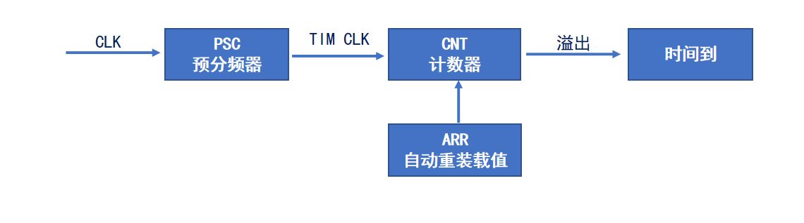

> 系统主频（APB1或APB2）经过PSC（预分频器）分频形成定时器主频。
>
> 定时器通过计数的方式进行周期性记时。
>
> ARR为一次周期结束后新周期的起始计数值。

- STM32 定时器分类

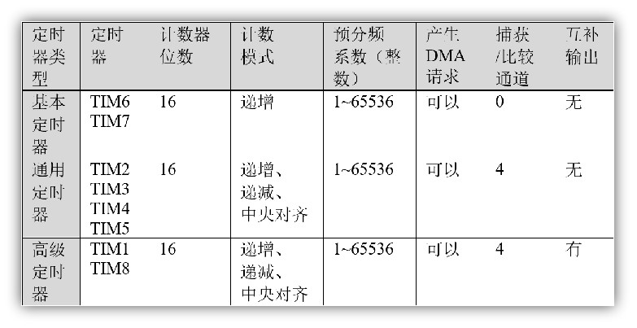

>| 定时器类型 | 主要功能                                                     |
>| ---------- | ------------------------------------------------------------ |
>| 基本定时器 | 没有输入输出通道，常用作时基，即定时功能                     |
>| 通用定时器 | 具有多路独立通道，可用于输入捕获/输出比较，也可用作时基      |
>| 高级定时器 | 除具备通用定时器所有功能外，还具备带死区控制的互补信号输出、刹车输入等功能（可用于电机控制、数字电源设计等） |

## 2. 基本定时器

**特点：**

1. 16位递增计数器（计数值：0~65535）
2. 16位预分频器（分频系数：1~65536）
3. 可用于触发DAC
4. 在更新事件（计数器溢出）时，会产生中断/DMA请求

- 基本定时器框图

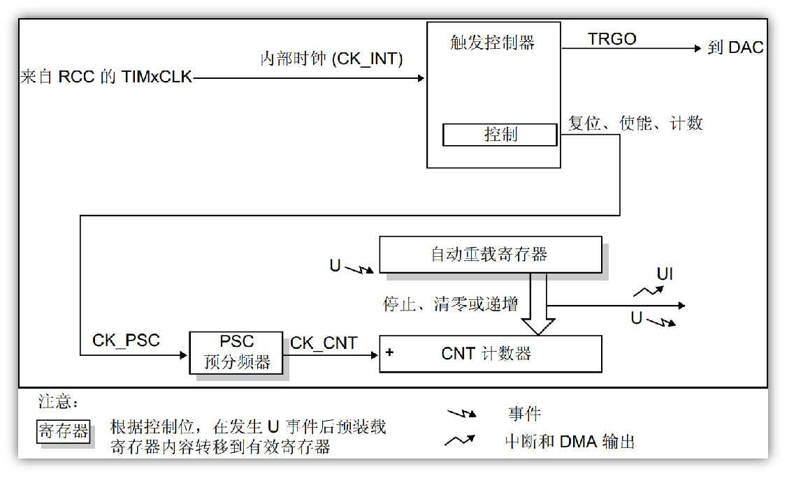

分为**时钟源，控制器，时基单元**三部分。

1. **时基单元**：

> PSC：预分频器；(存在影子寄存器)
>
> 自动重装载寄存器；(存在影子寄存器)
>
> CNT计数器；
>
> >*影子寄存器是实际起作用的寄存器，不可直接访问。*
> >
> >PSC，ARR起缓存作用，产生事件后转移到影子寄存器起效。

2. **事件**

UI：中断和DMA输出；

U：溢出事件产生；(产生后将预装载寄存器的值装载到影子寄存器)

>ARR寄存器中的ARPE位可以决定是否通过事件将数值加载到影子寄存器。

- 计数模式与溢出条件

>| 计数器模式   | 溢出条件                 |
>| ------------ | ------------------------ |
>| 递增计数模式 | CNT                      |
>| 递减计数模式 | CNT == 0                 |
>| 中心对齐模式 | CNT == ARR - 1、CNT == 1 |

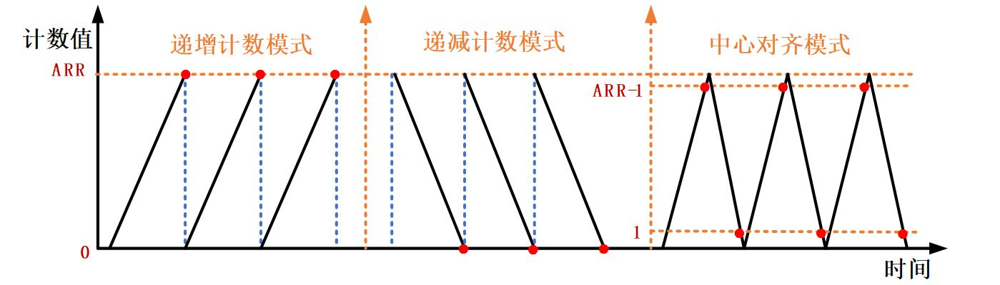

- 时间计算：

1. 计数器的时钟频率$CK\_CNT$是

$$
f_{CK\_PSC}/(PSC[15:1]+1)。
$$

在每一次更新事件时，PSC的数值被传送到实际的预分频寄存器中。

2. 溢出时间（实际周期）

$$
T_{out}=(ARR+1)*(PSC+1)/f_t
$$

$T_{out}$是定时器溢出时间；
$f_t$是定时器的时钟源频率；
$ARR$是自动重装载寄存器的值；(溢出后仍须等待时钟信号)
$PSC$是预分频器寄存器的值；

### 基本定时器配置

设定时钟源，PSC，ARR（CubeMX）--> 启动定时器（轮询或中断方式） --> （编写中断回调函数）

**使用定时器实现微秒延时**

```c
void delay_us(uint16_t us)
{
	uint16_t counter = 0;
	__HAL_TIM_SetAutoreload(&htim2, us);		//设置定时器自动加载值
	__HAL_TIM_SetCounter(&htim2, counter); 		//设置定时器初始值
	HAL_TIM_Base_Start(&htim2); 				//启动定时器

	while(counter != us) //直到定时器计数从0计数到us结束循环,刚好是所需要的时间
	{
		counter = __HAL_TIM_GetCounter(&htim2); // 获取定时器当前计数
	}
	HAL_TIM_Base_Stop(&htim2); // 停止定时器
}
```

### HAL 库函数

```c
/**
  * @brief  启动定时器
  * @param  htim 定时器句柄
  */
HAL_StatusTypeDef HAL_TIM_Base_Start(TIM_HandleTypeDef *htim);

/**
  * @brief  启动定时器
  * @param  htim 定时器句柄
  */
HAL_StatusTypeDef HAL_TIM_Base_Stop(TIM_HandleTypeDef *htim);

/**
  * @brief  中断模式下启动定时器
  * @param  htim 定时器句柄
  */  
HAL_StatusTypeDef HAL_TIM_Base_Start_IT(TIM_HandleTypeDef *htim);

/**
  * @brief  中断模式下停止定时器
  * @param  htim 定时器句柄
  */
HAL_StatusTypeDef HAL_TIM_Base_Stop_IT(TIM_HandleTypeDef *htim);

/**
  * @brief	更新中断回调函数
  */
void HAL_TIM_PeriodElapsedCallback(TIM_HandleTypeDef *htim);
```

## 3. 通用定时器

**特点：**

1. 16位递增、递减、中心对齐计数器（计数值：0~65535）
2. 16位预分频器（分频系数：1~65536）
3. 可用于触发DAC、ADC
4. 在更新事件、触发事件、输入捕获、输出比较时，会产生中断/DMA请求
5. 4个独立通道，可用于：输入捕获、输出比较、输出PWM、单脉冲模式
6. 使用外部信号控制定时器且可实现多个定时器互连的同步电路
7. 支持编码器和霍尔传感器电路

- 通用定时器框图

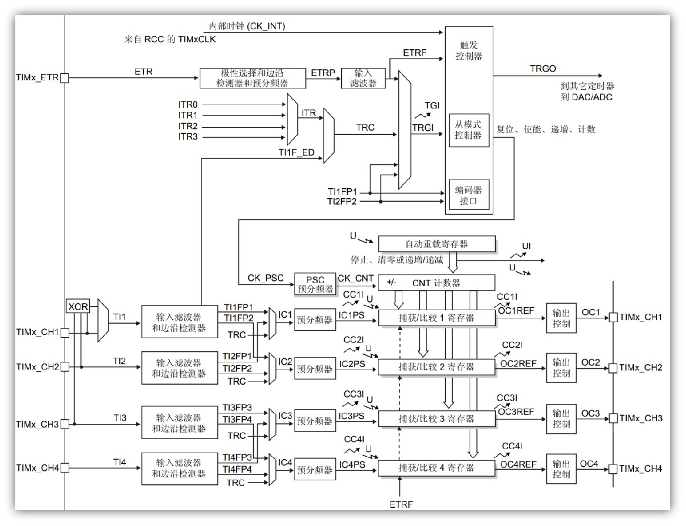

1. 时钟源：

>| 时钟源             | 说明                                                         |
>| ------------------ | ------------------------------------------------------------ |
>| 内部时钟(CK_INT)   | 来自外设总线APB提供的时钟                                    |
>| 外部时钟模式1      | 外部输入引脚(TIx)，来自定时器通道1(TIMx_CH1)或者通道2(TIMx_CH2)引脚的信号(TI1F_ED双边沿检测,TI1FP1,TI2FP2单边沿检测) |
>| 外部时钟模式2      | 外部触发输入(ETR)，来自可以复用为TIMx_ETR的IO引脚            |
>| 内部触发输入(ITRx) | 用于与芯片内部其它通用/高级定时器级联                        |

2. 计数器时钟源寄存器设置方法

>| 计数器时钟选择类型               | 设置方法               |
>| -------------------------------- | ---------------------- |
>| 内部时钟(CK_INT)                 | 设置TIMx_SMCR的SMS=000 |
>| 外部时钟模式1：外部输入引脚(TIx) | 设置TIMx_SMCR的SMS=111 |
>| 外部时钟模式2：外部触发输入(ETR) | 设置TIMx_SMCR的ECE=1   |
>| 内部触发输入(ITRx)               | -                      |

3. 外部时钟模式1

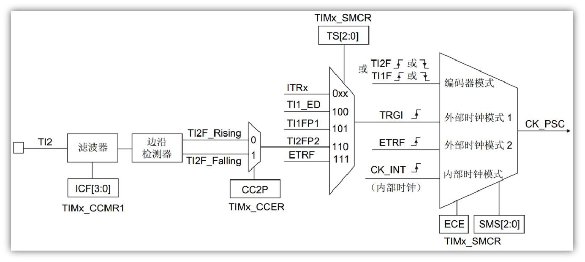

> - TS[2:0]控制触发选择的数据选择器；
> - ECE=0;SMS[2:0]=111控制从模式选择数据选择器；
> - CCxP控制边沿检测方式选择器；
> - ICF[3:0]控制输入捕获滤波器。

4. 外部时钟模式2

   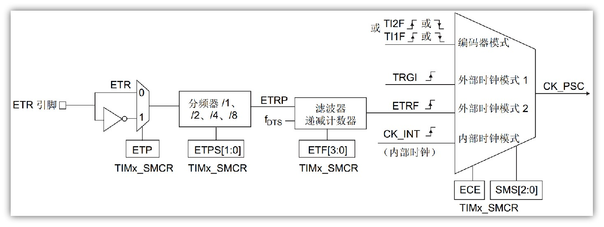

> - ETP控制极性选择数据寄存器
> - ETPS[1:0]控制外部触发预分频器
> - ETF[3:0]控制滤波器和递减计数器

### 输出比较 -- PWM输出

输出比较可以通过**比较CNT（时基单元）和CCR（捕获单元）寄存器值**的关系，来对输出电平进行置1、置0或翻转的操作，用于输出一定频率的占空比的PWM波形。

- 输出比较框图

1. 时基单元

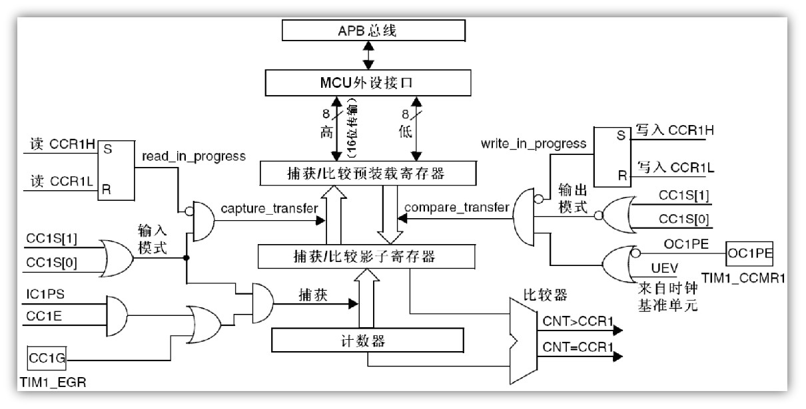

2. 捕获/比较通道1的输出部分

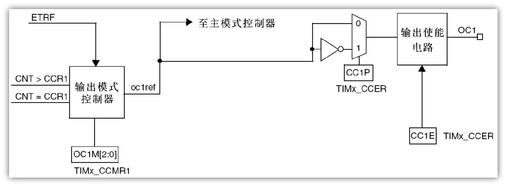

> CNT计数器（时基单元模块中的）和CCR1第一路的捕获/比较寄存器进行比较。
>
> 当CNT>CCR1或者CNT=CCR1时就会给输出模式控制器传一个信号，然后输出模式控制器就会改变输出OC1REF的高低电平（REF时reference的缩写，意思是参考信号）。
>
> 接着REF信号可以前往主模式控制器，可以把REF映射到主模式的TRGO输出。
>
> 在极性选择部分，给极性选择寄存器写0，信号电平不翻转，写1时输出信号就是输入信号高低电平反转的信号。
>
> 输出使能电路选择要不要输出，最后是OC1引脚，这个引脚是CH1的通道的引脚。

- PWM 输出原理

在具有惯性的系统中，可以通过对一系列脉冲的宽度进行调制，来等效地获得所需要的模拟参量。

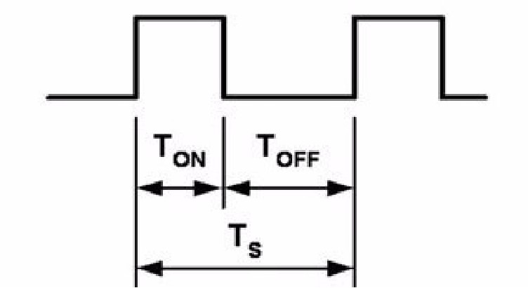

> PWM频率：$f = \frac{1}{T_S}$
>
> PWM占空比：$\phi = \frac{T_{ON}}{T_S}$

| **模式**         | **描述**                                                     |
| ---------------- | ------------------------------------------------------------ |
| 冻结             | CNT=CCR时，REF保持为原状态                                   |
| 匹配时置有效电平 | CNT=CCR时，REF置有效电平                                     |
| 匹配时置无效电平 | CNT=CCR时，REF置无效电平                                     |
| 匹配时电平翻转   | CNT=CCR时，REF电平翻转                                       |
| 强制为无效电平   | CNT与CCR无效，REF强制为无效电平                              |
| 强制为有效电平   | CNT与CCR无效，REF强制为有效电平                              |
| PWM模式1         | 向上计数：CNT<CCR时，REF置有效电平，CNT≥CCR时，REF置无效电平<br/>向下计数：CNT>CCR时，REF置无效电平，CNT≤CCR时，REF置有效电平 |
| PWM模式2         | 向上计数：CNT<CCR时，REF置无效电平，CNT≥CCR时，REF置有效电平<br>向下计数：CNT>CCR时，REF置有效电平，CNT≤CCR时，REF置无效电平 |

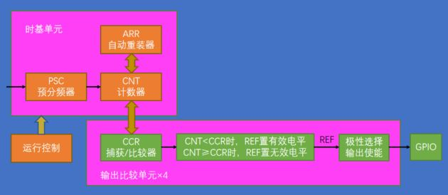

- 参数计算：

1. PWM 频率：

$$
f_{PWM} = \frac{CK\_{PSC}}{(PSC + 1)(ARR+1)}
$$

2. PWM 占空比：

$$
\phi = \frac{CCR}{ARR+1}
$$

#### HAL 库函数

```c
/**
  * @brief  启动PWM信号.
  * @param  htim 定时器句柄 htimx
  * @param  Channel 通道(1-4) TIM_CHANNEL_x
*/
HAL_StatusTypeDef HAL_TIM_PWM_Start(TIM_HandleTypeDef *htim, uint32_t Channel) ;

/**
  * @brief  停止PWM信号.
  * @param  htim 定时器句柄 htimx
  * @param  Channel 通道(1-4) TIM_CHANNEL_x
*/
HAL_StatusTypeDef HAL_TIM_PWM_Stop(TIM_HandleTypeDef *htim, uint32_t Channel);

/**
  * @brief  中断启动PWM信号.
  * @param  htim 定时器句柄 htimx
  * @param  Channel 通道(1-4) TIM_CHANNEL_x
*/
HAL_StatusTypeDef HAL_TIM_PWM_Start_IT(TIM_HandleTypeDef *htim, uint32_t Channel) ;

/**
  * @brief  中断停止PWM信号.
  * @param  htim 定时器句柄 htimx
  * @param  Channel 通道(1-4) TIM_CHANNEL_x
*/
HAL_StatusTypeDef HAL_TIM_PWM_Stop_IT(TIM_HandleTypeDef *htim, uint32_t Channel);

/**
  * @brief  修改ARR值
  * @param  __HANDLE__ 定时器句柄 htimx
  * @param  __AUTORELOAD__ ARR值
*/
__HAL_TIM_SET_AUTORELOAD(__HANDLE__, __AUTORELOAD__);

/**
  * @brief  修改CCR值
  * @param  __HANDLE__ 定时器句柄 htimx
  * @param  __CHANNEL__	通道值
  * @param  __COMPARE__ CCR值
*/
__HAL_TIM_SET_COMPARE(__HANDLE__, __CHANNEL__, __COMPARE__);
```

### 输入捕获

输入捕获模式下，当通道输入引脚出现指定电平跳变时，**当前CNT的值将被锁存到CCR中**，可用于测量PWM波形的频率、占空比、脉冲间隔、电平持续时间等参数。

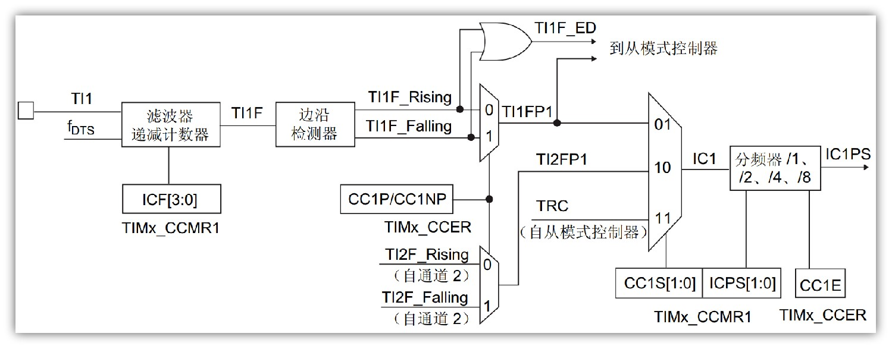

> 1. TIMx_CCMR1 寄存器控制 ICF 位用来控制滤波器参数。TI1 信号经过滤波形成 TI1F 信号。
> 2. 通过边沿检测器检查 TI1F 的上升沿和下降沿，通过 CC1P/CC1NP 寄存器选择极性生成 TI1FP1。
> 3. TI1F 信号也可传递到从模式控制器。 
> 4. TIMx_CCMR 控制捕获的信号通道（CC1S）和分频（ICPS）。
> 5. TIMx_CCER 控制输入捕获的使能。
> 6. 硬件电路可以在捕获后自动清零 CNT 值。

- 主从触发

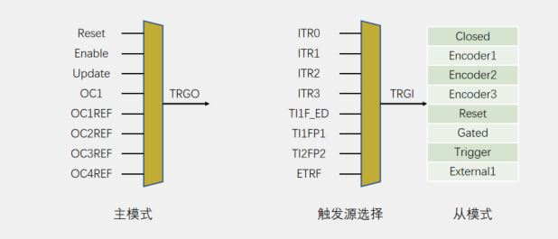

主模式：将定时器的内部信号映射到 TRGO 引脚，用于触发其他外设。

从模式：选择信号源后接收其他外设控制自身定时器（编码器）。

#### HAL 库函数

```c
/**
  * @brief 输入捕获启动函数
  */
HAL_StatusTypeDef HAL_TIM_IC_Start (TIM_HandleTypeDef *htim, uint32_t Channel);

/**
  * @brief 输入捕获停止函数
  */
HAL_StatusTypeDef HAL_TIM_IC_Stop(TIM_HandleTypeDef *htim, uint32_t Channel);

/**
  * @brief 输入捕获中断模式启动函数
  */
HAL_StatusTypeDef HAL_TIM_IC_Start_IT (TIM_HandleTypeDef *htim, uint32_t Channel);

/**
  * @brief 输入捕获中断模式停止函数
  */
HAL_StatusTypeDef HAL_TIM_IC_Stop_IT(TIM_HandleTypeDef *htim, uint32_t Channel);

/**
  * @brief 计数值设置CNT函数
  */
__HAL_TIM_SET_COUNTER(__HANDLE__, __COUNTER__);

/**
  * @brief 	上升/下降沿触发设置函数
  * @param	TIM_INPUTCHANNELPOLARITY_RISING 上升沿
  *         TIM_INPUTCHANNELPOLARITY_FALLING 下降沿
  */
__HAL_TIM_SET_CAPTUREPOLARITY(__HANDLE__, __CHANNEL__, __POLARITY__);

/**
  * @brief 读取输入捕获计数值
  */
uint32_t HAL_TIM_ReadCapturedValue(const TIM_HandleTypeDef *htim, uint32_t Channel);
```

## 4. 注意事项

1. 使用TIM前，请阅读芯片的数据手册以确定该TIM在哪一个APB总线上，**不同APB总线上的TIM频率可能会有差别**。
2. TIM可以用来进行定时采样，是最可靠的定时方式。(HAL_Delay或者osDelay定时误差较大)

