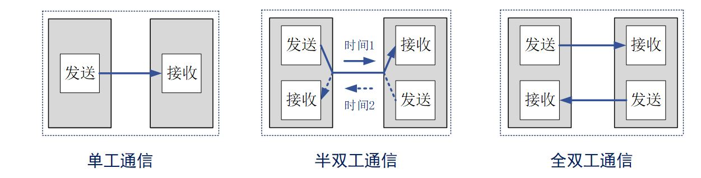
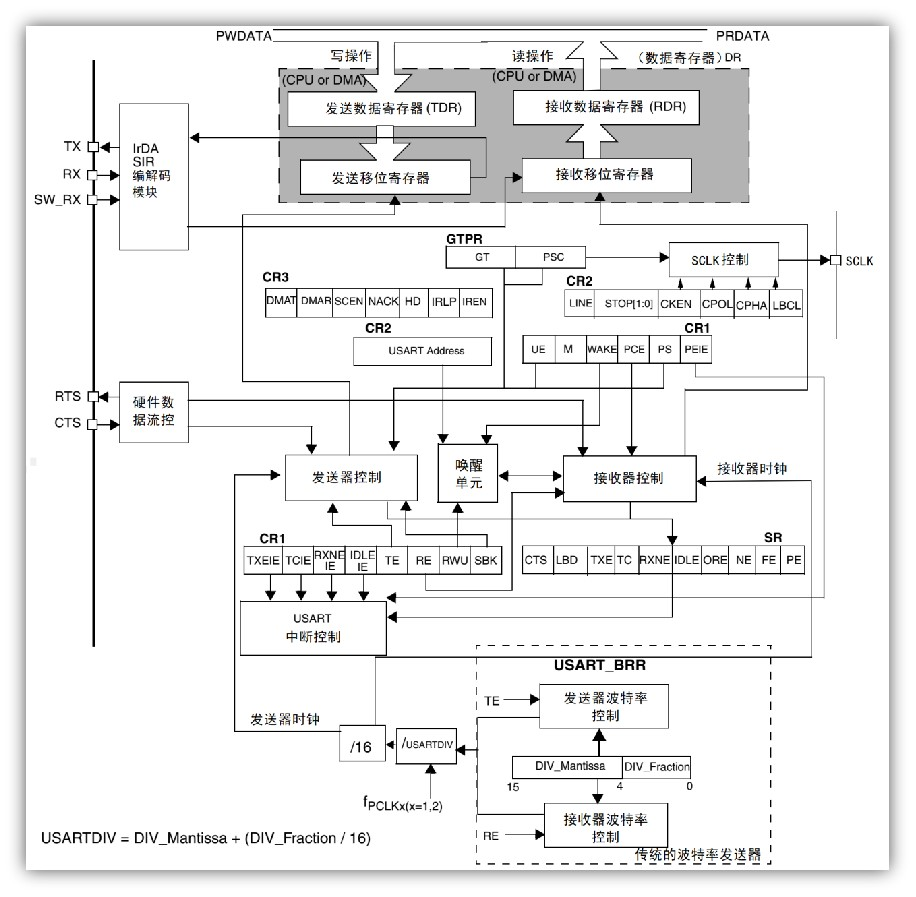
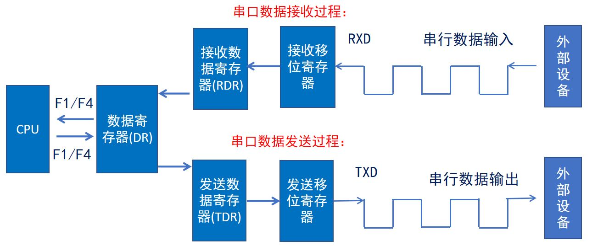
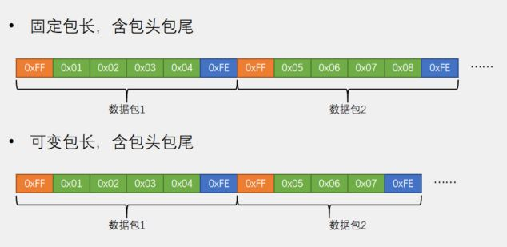
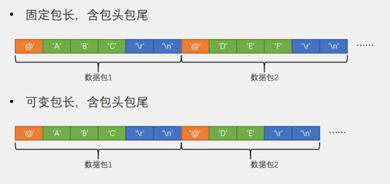
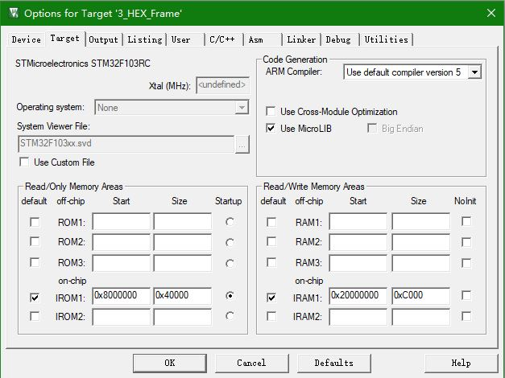

# STM32 HAL 7_USART

## 1. 通信概述

在下位机，下位机和上位机，上位机之间常常使用通信的方式传递数据和指令。

- 串行与并行通信

**串行通讯：** 是指设备之间通过一根数据信号线，地线以及控制信号线，按数据位形式一位一位地传输数据的通讯方式，同一时刻只能传输一位数据。

**并行通讯：** 是指使用 8、16、32 及 64 根或更多的数据线进行传输的通讯方式，可以同一时刻传输多个数据位的数据。

>| 特点     | 传输速率 | 抗干扰能力 | 通信距离 | IO资源占用 | 成本 |
>| -------- | -------- | ---------- | -------- | ---------- | ---- |
>| 串行通信 | 较低     | 较强       | 较长     | 较少       | 较低 |
>| 并行通信 | 较高     | 较弱       | 较短     | 较多       | 较高 |

- 单工/半双工/全双工通信



**单工通信：** 数据只能沿一个方向传输

**半双工通信：** 数据可以沿两个方向传输，但需要分时进行

**全双工通信：** 数据可以同时进行双向传输

- 同步/异步通信

**同步通信：** 共用同一时钟信号

**异步通信：** 没有时钟信号，通过在数据信号中加入起始位和停止位等一些同步信号

- 波特率

**比特率：** 每秒钟传送的比特数，单位bit/s

**波特率：** 每秒钟传送的码元数，单位Baud

$比特率 = 波特率*log_2M$ ，M表示每个码元承载的信息量；
二进制系统中，波特率数值上等于比特率。

- 常用串行通信接口

>| 通信接口         | 接口引脚                                                     | 数据同步方式 | 数据传输方向 |
>| ---------------- | ------------------------------------------------------------ | ------------ | ------------ |
>| UART             | TXD:发送端;<br>RXD:接收端;<br/>GND:公共地                    | 异步通信     | 全双工       |
>| 1-wire（单总线） | DQ:发送/接收端                                               | 异步通信     | 半双工       |
>| IIC              | SCL:同步时钟;<br/>SDA:数据输入/输出端                        | 同步通信     | 半双工       |
>| SPI              | SCK:同步时钟;<br/>MISO:主机输入，从机输出;<br/>MOSI:主机输出，从机输入;<br/>CS:片选信号 | 同步通信     | 全双工       |

## 2. USART 物理层

- 电平标准

>| 电平标准 | 电平                                                         |
>| -------- | ------------------------------------------------------------ |
>| TTL      | 1：+3.3V或+5V   0：0V                      （通常的USB转TTL串口） |
>| RS232    | 1：-3到-15V     0：+3V到+15V                                 |
>| RS485    | 1: +2到+6V      0：-2V到-6V                                  |

> **RS232 电平标准（DB9线）**
>
> | 用途     | 接口         | 说明         |
> | -------- | ------------ | ------------ |
> | *数据：* |              |              |
> |          | TXD（pin 3） | 串口数据输出 |
> |          | RXD（pin 2） | 串口数据输入 |
> | *握手：* |              |              |
> |          | RTS（pin 7） | 请求发送     |
> |          | CTS（pin 8） | 清除发送     |
> |          | DSR（pin 6） | 数据发送就绪 |
> |          | DCD（pin 1） | 数据载波检测 |
> |          | DTR（pin 4） | 数据终端就绪 |
> | *地线：* |              |              |
> |          | GND（pin 5） | 信号地       |
> | *其他：* |              |              |
> |          | RI（pin 9）  | 振铃指示     |
>
> 

- 电脑（上位机）与串口的连接：


> *注：需要下载CH340驱动*

- 串口间的连接：

| 串口A       | 串口B          |
| ----------- | -------------- |
| GND         | GND            |
| TX          | RX（数据接收） |
| RX          | TX（数据输出） |
| （可选）VCC | VCC            |

## 3. USART 协议层

- 通信帧

> **空闲状态：** 高电平；
>
> **起始位（1位）：** 低电平；
>
> **数据位（8位）：** 高电平为1，低电平为0；（低位先行）。
>
> ​							LSB:最低有效位;   
>
> ​							MSB:最高有效位
>
> **奇偶校验位：** 发送方检查校验位保证0/1个数奇偶性并进行补位；
>               接收方验证数据位和校验位。
>
> **停止位：** 1个停止位：停止位位数的默认值。
> 				2个停止位：可用于常规USART模式、单线模式以及调制解调器模式。
> 				0.5个停止位：在智能卡模式下接收数据时使用。
> 				1.5个停止位：在智能卡模式下发送和接收数据时使用。


- STM32 USART 框图





> 发送移位寄存器将TDR传输的数据移位，当满8位之后，通过TX发送，TDR继续向发送移位寄存器传输数据;
>
> 接收移位寄存器将接收到的数据移位，当满8位置后，通过RDR接收;
>
> 用户只能访问DR;

## 4. STM32 USART使用

### HAL 库函数

**轮询方式**：类似一个延时函数,当这个函数没处理完时所有的按照流程需要执行的代码都不会被执行,需要等到这个延时完成。

**中断方式**：非阻塞模式一般用中断,执行这条语句的时候,开启相应的中断达到一定的条件才进行处理,这样不会影响到流程的执行。

```c
/**
  * @brief  串口轮询发送函数
  * @param  huart 串口句柄huartx
  * @param	pData 发送数据地址，注意需要以 uint8_t 数组形式发送
  * @param  Size  发送数据字节数
  * @param  Timeout	超时时间
  */
HAL_StatusTypeDef HAL_UART_Transmit(UART_HandleTypeDef *huart, uint8_t *pData, uint16_t Size, uint32_t Timeout);

/**
  * @brief  串口轮询接收函数
  * @param  huart 串口句柄huartx
  * @param	pData 接收数据地址，注意需要以 uint8_t 数组形式接收
  * @param  Size  接收数据字节数
  * @param  Timeout	超时时间
  */
HAL_StatusTypeDef HAL_UART_Receive(UART_HandleTypeDef *huart, uint8_t *pData, uint16_t Size, uint32_t Timeout);

/**
  * @brief  串口中断发送函数
  * @param  huart 串口句柄huartx
  * @param	pData 发送数据地址，注意需要以 uint8_t 数组形式发送
  * @param  Size  发送数据字节数
  * @attention	发送完毕之后进入发送中断，应调用发送完成中断回调函数HAL_UART_TxCpltCallback()
  */
HAL_StatusTypeDef HAL_UART_Transmit_IT(UART_HandleTypeDef *huart, uint8_t *pData, uint16_t Size);

/**
  * @brief  串口中断接收函数
  * @param  huart 串口句柄huartx
  * @param	pData 接收数据地址，注意需要以 uint8_t 数组形式接收
  * @param  Size  接收数据字节数
  * @attention	接收完毕之后进入接收中断，应调用发送完成中断回调函数HAL_UART_RxCpltCallback()
  				中断回调结束后中接收中断会关闭，如果需要连续接收，建议在回调函数中再次使用此函数。
  */
HAL_StatusTypeDef HAL_UART_Receive_IT(UART_HandleTypeDef *huart, uint8_t *pData, uint16_t Size);

/**
  * @brief  串口DMA发送函数
  * @param  huart 串口句柄huartx
  * @param	pData 发送数据地址，注意需要以 uint8_t 数组形式发送
  * @param  Size  发送数据字节数
  */
HAL_StatusTypeDef HAL_UART_Transmit_DMA(UART_HandleTypeDef *huart, uint8_t *pData, uint16_t Size);

/**
  * @brief  串口DMA接收函数
  * @param  huart 串口句柄huartx
  * @param	pData 接收数据地址，注意需要以 uint8_t 数组形式接收
  * @param  Size  接收数据字节数
  */
HAL_StatusTypeDef HAL_UART_Receive_DMA(UART_HandleTypeDef *huart, uint8_t *pData, uint16_t Size);

/**
  * @brief  串口DMA暂停发送函数
  * @param  huart 串口句柄huartx
  */
HAL_StatusTypeDef HAL_UART_DMAPause(UART_HandleTypeDef *huart);

/**
  * @brief  串口DMA恢复发送函数
  * @param  huart 串口句柄huartx
  */
HAL_StatusTypeDef HAL_UART_DMAResume(UART_HandleTypeDef *huart);

/**
  * @brief  串口DMA停止发送函数
  * @param  huart 串口句柄huartx
  */
HAL_StatusTypeDef HAL_UART_DMAStop(UART_HandleTypeDef *huart);

/**
  * @brief  串口中断使能函数
  * @param  _HANDLE_ 串口句柄huartx
  * @param  _MODE_ 中断模式（UART_IT_IDLE为空闲中断，UART_IT_RXLE为接收中断）
  */
__HAL_UART_ENABLE_IT(_HANDLE_,_MODE_)
```

### 自定义通讯协议

可以自定义通讯数据包，分为HEX数据包和文本数据包两种。

> HEX 数据包
>
> 

> 文本数据包
>
> 

使用**有限状态机方式**进行解包。

接收到帧头 -> 开始接收数据 -> 接收到帧尾 -> 处理数据并进行相应操作。

### 串口重定向

在C语言中，printf 函数默认的输出是在屏幕上。为了使得 printf 的输出能够传到串口上，需要进行串口重定向。

**方法1**：（需要使用Keil的MicroLIB微库，引入stdio.h）--- 重写 fputc 文件



```c
/* USER CODE BEGIN 0 */
int fputc(int ch, FILE *f)
{
   HAL_UART_Transmit(&huart1, (uint8_t *)&ch, 1, 0xffff);
   return ch;
}

int fgetc(FILE *f)
{
   uint8_t ch = 0;
   HAL_UART_Receive(&huart1, &ch, 1, 0xffff);
   return ch;
}
/* USER CODE END 0 */
```

**方法2**：retarget.h文件

```c
#ifndef	__RETARGET_H
#define	__RETARGET_H

#include "stm32f1xx.h"

#include "usart.h"

#include <stdio.h>
#include <string.h>
#include <stdarg.h>

#define _USART1 1	                                //串口1开关
#define _USART2 0	                                //串口2开关
#define _USART3 0	                                //串口3开关

#define BUFFER_MAX_SIZE         512
static char USART_BUFFER[BUFFER_MAX_SIZE];

#if _USART1
    #define printf(FORMAT,...) \
    {\
        memset(USART_BUFFER, 0, BUFFER_MAX_SIZE);\
        sprintf(USART_BUFFER,FORMAT,##__VA_ARGS__); \
	    HAL_UART_Transmit(&huart1,(uint8_t *)USART_BUFFER,strlen(USART_BUFFER), 1);\
    }
#else
    #define printf(FORMAT,...)
#endif

#if _USART2
    #define printf2(FORMAT,...) \
    {\
        memset(USART_BUFFER, 0, BUFFER_MAX_SIZE);\
        sprintf(USART_BUFFER,FORMAT,##__VA_ARGS__); \
	    HAL_UART_Transmit(&huart2,(uint8_t *)USART_BUFFER,strlen(USART_BUFFER), 1);\
    }
#else
    #define printf2(FORMAT,...)
#endif

#if _USART3
    #define printf3(FORMAT,...) \
    {\
    memset(USART_BUFFER, 0, BUFFER_MAX_SIZE);\
    sprintf(USART_BUFFER,FORMAT,##__VA_ARGS__); \
	HAL_UART_Transmit(&huart3,(uint8_t *)USART_BUFFER,strlen(USART_BUFFER), 1);\
    }
#else
    #define printf3(FORMAT,...)
#endif

#endif
```

### DMA 方式进行不定长数据收发

在没有DMA之前，串口每次发送数据时都要由CPU将源地址上的数据拷贝到串口发送的相关寄存器上；串口每次接收数据时都要由CPU将发送来的数据拷贝到主存上。使用DMA后，只需要告诉DMA源地址和目标地址，DMA通道就能够自动进行数据的转移，转移期间CPU就可以去处理别的事情，这就大大提高了CPU的运行效率。


**空闲中断：** 空闲的定义是总线上在一个字节的时间内没有再接收到数据。空闲中断是检测到有数据被接收后，总线上在一个字节的时间内没有再接收到数据的时候发生的。

```c
void USART1_IRQHandler(void)
{
  /* USER CODE BEGIN USART1_IRQn 0 */

  /* USER CODE END USART1_IRQn 0 */
  HAL_UART_IRQHandler(&huart1);
  /* USER CODE BEGIN USART1_IRQn 1 */
  uint8_t flag = __HAL_UART_GET_FLAG(&huart1, UART_FLAG_IDLE); // 获取空闲中断标志位
  if (flag != RESET)                                         // 判断接收结束
  {
    rx_flag = 1;
    __HAL_UART_CLEAR_IDLEFLAG(&huart1); // 清除标志位
    HAL_UART_DMAStop(&huart1);
    uint8_t temp = __HAL_DMA_GET_COUNTER(&hdma_usart1_rx);
    rx_len = LENGTH - temp;                            // 计算出数据长度
    HAL_UART_Transmit_DMA(&huart1, rx_buffer, rx_len); // 将受到的数据发送出去
    HAL_UART_Receive_DMA(&huart1, rx_buffer, LENGTH);     // 开启DMA接收，方便下一次接收数据
  }

  /* USER CODE END USART1_IRQn 1 */
}
```

### 16/32位数据处理

STM32 的 USART 只支持发送8位无符号数。

当发送 16/32 位数时，采用共用体发送方式。

```c
typedef union 
{
    float num;
    uint8_t num[4];
}num;
```

发送时，将数据传入 float 类型的 num ，再以数组形式发送数据。

接收时，以数组形式接收数据，再将数据以 float 类型取出。  

## 5. 注意事项

1. 建议使用RS485电平通信，RS485由于为差分总线方式，抗干扰能力较强，且RS485可以组成串口网，扩展性极强。
2. 有一些传感器/电机通信使用的是高速串口，此时应当使用高速PCB，同时注意不同APB总线上的串口最大波特率存在差别。
