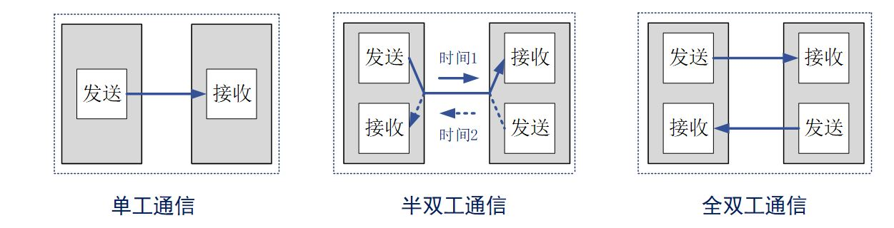
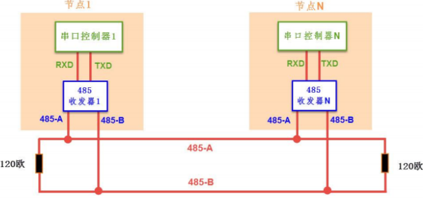
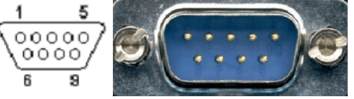
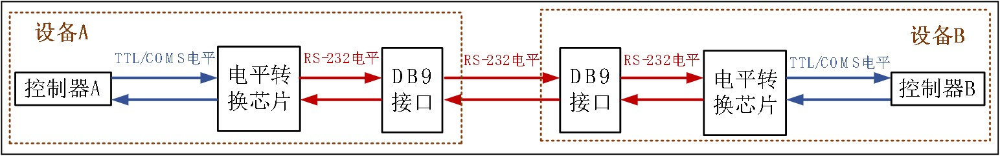
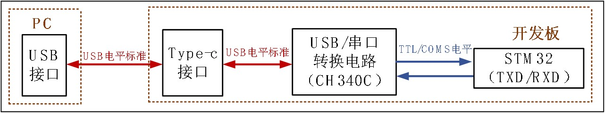
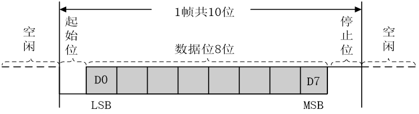
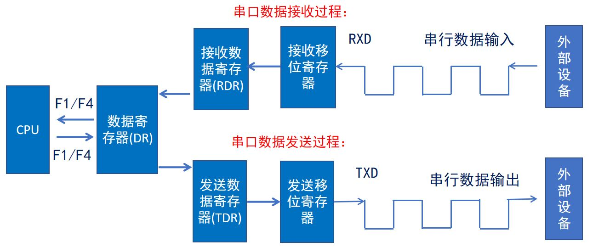
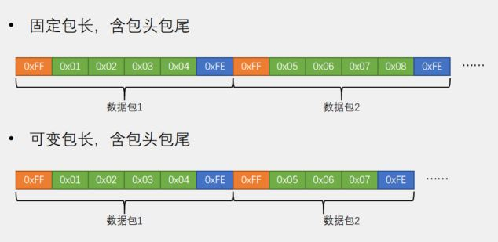
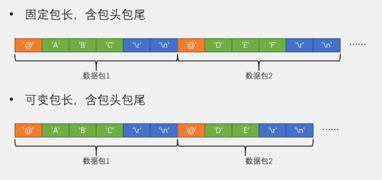

# STM32 HAL 7_USART

## 1. 通信概述

在下位机，下位机和上位机，上位机之间常常使用通信的方式传递数据和指令。

- 串行与并行通信

    **串行通讯：** 是指设备之间通过一根数据信号线，地线以及控制信号线，按数据位形式一位一位地传输数据的通讯方式，同一时刻只能传输一位数据。

    **并行通讯：** 是指使用 8、16、32 及 64 根或更多的数据线进行传输的通讯方式，可以同一时刻传输多个数据位的数据。

    | 特点     | 传输速率 | 抗干扰能力 | 通信距离 | IO资源占用 | 成本 |
    | -------- | -------- | ---------- | -------- | ---------- | ---- |
    | 串行通信 | 较低     | 较强       | 较长     | 较少       | 较低 |
    | 并行通信 | 较高     | 较弱       | 较短     | 较多       | 较高 |

- 单工/半双工/全双工通信

    

    **单工通信：** 数据只能沿一个方向传输

    **半双工通信：** 数据可以沿两个方向传输，但需要分时进行

    **全双工通信：** 数据可以同时进行双向传输

- 同步/异步通信

    **同步通信：** 共用同一时钟信号

    **异步通信：** 没有时钟信号，通过在数据信号中加入起始位和停止位等一些同步信号

- 波特率

    **比特率：** 每秒钟传送的比特数，单位bit/s

    **波特率：** 每秒钟传送的码元数，单位Baud

    $比特率 = 波特率*log_2M$ ，M表示每个码元承载的信息量；
    二进制系统中，波特率数值上等于比特率。

- 常用串行通信接口(板级协议)

    | 通信接口         | 接口引脚                                                     | 数据同步方式 | 数据传输方向 |
    | ---------------- | ------------------------------------------------------------ | ------------ | ------------ |
    | UART             | TXD:发送端;<br>RXD:接收端;<br/>GND:公共地                    | 异步通信     | 全双工       |
    | 1-wire（单总线） | DQ:发送/接收端                                               | 异步通信     | 半双工       |
    | IIC              | SCL:同步时钟;<br/>SDA:数据输入/输出端                        | 同步通信     | 半双工       |
    | SPI              | SCK:同步时钟;<br/>MISO:主机输入，从机输出;<br/>MOSI:主机输出，从机输入;<br/>CS:片选信号 | 同步通信     | 全双工       |

## 2. USART 物理层

- 电平标准(现场协议)

    | 电平标准 | 电平                                         |
    | -------- | -------------------------------------------- |
    | TTL      | 1：+3.3V或+5V   0：0V （通常的USB转TTL串口） |
    | RS232    | 1：-3到-15V     0：+3V到+15V                 |
    | RS485    | 1: +2到+6V      0：-2V到-6V                  |

    > RS485 为差分通信：
    >
    > 
    - **DB9接口：**仅支持RS232和RS485。

        

        | 用途     | 接口         | 说明         |
        | -------- | ------------ | ------------ |
        | *数据：* |              |              |
        |          | TXD（pin 3） | 串口数据输出 |
        |          | RXD（pin 2） | 串口数据输入 |
        | *握手：* |              |              |
        |          | RTS（pin 7） | 请求发送     |
        |          | CTS（pin 8） | 清除发送     |
        |          | DSR（pin 6） | 数据发送就绪 |
        |          | DCD（pin 1） | 数据载波检测 |
        |          | DTR（pin 4） | 数据终端就绪 |
        | *地线：* |              |              |
        |          | GND（pin 5） | 信号地       |
        | *其他：* |              |              |
        |          | RI（pin 9）  | 振铃指示     |

    	

    - **四线接口：**仅支持RS232和TTL。

    - **三线接口**：支持RS485。

- 电脑（上位机）与串口的连接

    

    > *注：需要下载CH340驱动*

- 串口间的连接(三线/四线)

    - TTL/RS232
    
        | 串口A       | 串口B          |
        | ----------- | -------------- |
        | GND         | GND            |
        | TX          | RX（数据接收） |
        | RX          | TX（数据输出） |
        | （可选）VCC | VCC            |
        
        > 可能存在 TX - TX ，RX - RX 情况。
    
    - RS485

        | 串口A       | 串口B          |
        | ----------- | -------------- |
        | （可选）GND         | GND            |
        | A         | A |
        | B         |B |
    

## 3. USART 软件协议层

- 通信帧

    **空闲状态：** 高电平；

    **起始位（1位）：** 低电平；

    **数据位（8位）：** 高电平为1，低电平为0；（低位先行）。LSB:最低有效位; MSB:最高有效位。

    **奇偶校验位：** 发送方检查校验位保证0/1个数奇偶性并进行补位； 接收方验证数据位和校验位。

    **停止位：** 1个停止位：停止位位数的默认值。2个停止位：可用于常规USART模式、单线模式以及调制解调器模式。0.5个停止位：在智能卡模式下接收数据时使用。1.5个停止位：在智能卡模式下发送和接收数据时使用。

    

- STM32 USART 框图

    

    

    > 发送移位寄存器将TDR传输的数据移位，当满8位之后，通过TX发送，TDR继续向发送移位寄存器传输数据;
    >
    > 接收移位寄存器将接收到的数据移位，当满8位置后，通过RDR接收;
    >
    > 用户只能访问DR;

## 4. STM32 USART使用

### 串口的工作模式

1. **轮询方式**：类似一个延时函数,当这个函数没处理完时所有的按照流程需要执行的代码都不会被执行,需要等到这个延时完成。

    > 串口的轮询实现就是通过不停的轮询状态寄存器的状态判断是否有数据需要接收或发送。发送时先向数据寄存器或发送FIFO写入数据，然后不断检查状态寄存器，查看发送是否完成。发送完成才能发送下一字节或退出发送状态。
    >
    > 对于接收则要先创建一个循环定时器或线程死循环，不断的轮询状态寄存器，检查是否有数据收到，有数据收到则读取数据，然后调用接收回调，将数据传递给上层应用。

2. **中断方式**：非阻塞模式一般用中断,执行这条语句的时候,开启相应的中断达到一定的条件才进行处理,这样不会影响到流程的执行。

    > 接收时，不需要有一个任务专门用来检测是否有数据收到，收到数据会触发接收中断，在中断中收取数据并传递给上层应用。
    >
    > 发送时，只需要发送第一个字节即可让出CPU，之后每发送完成一字节都会触发发送完成中断，在中断中将后面需要发送的数据发送出去或者退出发送模式。

    > 中断方式接收数据产生的中断称为接收中断。

3. **DMA方式**：DMA 方式是指数据在内存和设备之间能够直接进行数据的传输，只需要CPU执行一下开始和完成操作即可，不需处理每一字节的收发，是一种比中断模式效率更高的方式。

    > 发送时需要把数据先拷贝到连续的无 Cache 的内存区，然后配置 DMA 源地址、目标地址、数据长度等参数并启动 DMA 传输。这时就可以让出 CPU 了。当传输完成，会触发一个完成中断，通知应用层传输完成。
    >
    > 接收时，要提前准备好连续的无 Cache 的内存区供给 DMA 自动接收。设置 DMA 各个接收参数并启动。当有数据收到后会触发中断，中断通知上层应用去处理。
    
    > DMA 接收数据通常采用空闲中断方式。空闲的定义是总线上在一个字节的时间内没有再接收到数据。空闲中断是检测到有数据被接收后，总线上在一个字节的时间内没有再接收到数据的时候发生的。

### HAL 库函数

```c
/**
  * @brief  串口轮询发送函数
  * @param  huart 串口句柄huartx
  * @param	pData 发送数据地址，注意需要以 uint8_t 数组形式发送
  * @param  Size  发送数据字节数
  * @param  Timeout	超时时间
  */
HAL_StatusTypeDef HAL_UART_Transmit(UART_HandleTypeDef *huart, uint8_t *pData, uint16_t Size, uint32_t Timeout);

/**
  * @brief  串口轮询接收函数
  * @param  huart 串口句柄huartx
  * @param	pData 接收数据地址，注意需要以 uint8_t 数组形式接收
  * @param  Size  接收数据字节数
  * @param  Timeout	超时时间
  */
HAL_StatusTypeDef HAL_UART_Receive(UART_HandleTypeDef *huart, uint8_t *pData, uint16_t Size, uint32_t Timeout);

/**
  * @brief  串口中断发送函数
  * @param  huart 串口句柄huartx
  * @param	pData 发送数据地址，注意需要以 uint8_t 数组形式发送
  * @param  Size  发送数据字节数
  * @attention	发送完毕之后进入发送中断，应调用发送完成中断回调函数HAL_UART_TxCpltCallback()
  */
HAL_StatusTypeDef HAL_UART_Transmit_IT(UART_HandleTypeDef *huart, uint8_t *pData, uint16_t Size);

/**
  * @brief  串口中断接收函数
  * @param  huart 串口句柄huartx
  * @param	pData 接收数据地址，注意需要以 uint8_t 数组形式接收
  * @param  Size  接收数据字节数
  * @attention	接收完毕之后进入接收中断，应调用发送完成中断回调函数HAL_UART_RxCpltCallback()
  				中断回调结束后中接收中断会关闭，如果需要连续接收，建议在回调函数中再次使用此函数。
  */
HAL_StatusTypeDef HAL_UART_Receive_IT(UART_HandleTypeDef *huart, uint8_t *pData, uint16_t Size);

/**
  * @brief  串口DMA发送函数
  * @param  huart 串口句柄huartx
  * @param	pData 发送数据地址，注意需要以 uint8_t 数组形式发送
  * @param  Size  发送数据字节数
  */
HAL_StatusTypeDef HAL_UART_Transmit_DMA(UART_HandleTypeDef *huart, uint8_t *pData, uint16_t Size);

/**
  * @brief  串口DMA接收函数
  * @param  huart 串口句柄huartx
  * @param	pData 接收数据地址，注意需要以 uint8_t 数组形式接收
  * @param  Size  接收数据字节数
  */
HAL_StatusTypeDef HAL_UART_Receive_DMA(UART_HandleTypeDef *huart, uint8_t *pData, uint16_t Size);

/**
  * @brief  串口DMA暂停发送函数
  * @param  huart 串口句柄huartx
  */
HAL_StatusTypeDef HAL_UART_DMAPause(UART_HandleTypeDef *huart);

/**
  * @brief  串口DMA恢复发送函数
  * @param  huart 串口句柄huartx
  */
HAL_StatusTypeDef HAL_UART_DMAResume(UART_HandleTypeDef *huart);

/**
  * @brief  串口DMA停止发送函数
  * @param  huart 串口句柄huartx
  */
HAL_StatusTypeDef HAL_UART_DMAStop(UART_HandleTypeDef *huart);

/**
  * @brief  串口中断使能函数
  * @param  _HANDLE_ 串口句柄huartx
  * @param  _MODE_ 中断模式（UART_IT_IDLE为空闲中断，UART_IT_RXLE为接收中断）
  */
__HAL_UART_ENABLE_IT(_HANDLE_,_MODE_);

/**
  * @brief  串口空闲接收函数
  * @param  huart 串口句柄huartx
  * @param	pData 接收数据地址，注意需要以 uint8_t 数组形式接收
  * @param  Size  接收数据字节数
  * @param  RxLen   最终接收到的数据长度(小于Size)
  * @param  Timeout 超时时间
  * @retval HAL status
  */
HAL_StatusTypeDef HAL_UARTEx_ReceiveToIdle(UART_HandleTypeDef *huart, uint8_t *pData, uint16_t Size, uint16_t *RxLen, uint32_t Timeout);

/**
  * @brief  串口空闲中断接收函数
  * @param  huart 串口句柄huartx
  * @param	pData 接收数据地址，注意需要以 uint8_t 数组形式接收
  * @param  Size  接收数据字节数
  * @attention	接收完毕之后可触发接收中断或者空闲中断，应调用接收完成中断回调函数HAL_UARTEx_RxEventCallback()
  				中断回调结束后中接收中断会关闭，如果需要连续接收，建议在回调函数中再次使用此函数。
  * @retval HAL status
  */
HAL_StatusTypeDef HAL_UARTEx_ReceiveToIdle_IT(UART_HandleTypeDef *huart, uint8_t *pData, uint16_t Size);

/**
  * @brief  串口空闲DMA接收函数
  * @param  huart 串口句柄huartx
  * @param	pData 接收数据地址，注意需要以 uint8_t 数组形式接收
  * @param  Size  接收数据字节数
  * @attention	接收完毕之后可触发接收中断或者空闲中断，应调用接收完成中断回调函数HAL_UARTEx_RxEventCallback()
  				中断回调结束后中接收中断会关闭，如果需要连续接收，建议在回调函数中再次使用此函数。
  * @retval HAL status
  */
HAL_StatusTypeDef HAL_UARTEx_ReceiveToIdle_DMA(UART_HandleTypeDef *huart, uint8_t *pData, uint16_t Size);
```

### 串口的应用

#### 自定义通讯协议

**发送设备和接收设备应当指定应用层通信协议（和硬件协议不同），便于解析发送设备传来的数据**。

> 1. 串口通信两方制定好通信协议，最好写出一份协议手册；
> 2. 串口通信最好指定发送的数据长度，方便接收方进行数据解码；
> 3. 串口通信最好指定特殊的头帧和尾帧，用以进行数据对齐和纠错；
> 4. 串口通信最好指明一个命令位，用以区分不同数据的不同用途；

可以自定义通讯数据包，分为HEX数据包和文本数据包两种。

> - HEX 数据包
>
> 

> - 文本数据包
>
> 

1. 使用**有限状态机方式**进行解包。

	接收到帧头 -> 开始接收数据 -> 接收到帧尾 -> 处理数据并进行相应操作。
	
	此时需要配合中断接收，缺点在于无法验证数据正确性，需要附加校验。

2. 使用中断解包。
	
	一次性接收定长数据包然后解析，前提是不能丢包。

3. 使用DMA解包。

	不定长数据包接收，通过空闲中断判断传输结束。

#### 串口重定向

在C语言中，`printf` 函数默认的输出是在屏幕上。为了使得 `printf` 的输出能够传到串口上，需要进行串口重定向。

##### AC5/6 编译环境

**方法1**：（需要使用Keil的MicroLIB微库，引入`stdio.h`）--- 重写 `fputc` 函数


```c
/* USER CODE BEGIN 0 */
int fputc(int ch, FILE *f)
{
   HAL_UART_Transmit(&huart1, (uint8_t *)&ch, 1, 0xffff);
   return ch;
}

int fgetc(FILE *f)
{
   uint8_t ch = 0;
   HAL_UART_Receive(&huart1, &ch, 1, 0xffff);
   return ch;
}
/* USER CODE END 0 */
```

**方法2**：`retarget.h`文件

```c
#ifndef	__RETARGET_H
#define	__RETARGET_H

#include "stm32f1xx.h"

#include "usart.h"

#include <stdio.h>
#include <string.h>
#include <stdarg.h>

#define _USART1 1	                                //串口1开关
#define _USART2 0	                                //串口2开关
#define _USART3 0	                                //串口3开关

#define BUFFER_MAX_SIZE         512
static char USART_BUFFER[BUFFER_MAX_SIZE];

#if _USART1
    #define printf(FORMAT,...) \
    {\
        memset(USART_BUFFER, 0, BUFFER_MAX_SIZE);\
        sprintf(USART_BUFFER,FORMAT,##__VA_ARGS__); \
	    HAL_UART_Transmit(&huart1,(uint8_t *)USART_BUFFER,strlen(USART_BUFFER), 1);\
    }
#else
    #define printf(FORMAT,...)
#endif

#if _USART2
    #define printf2(FORMAT,...) \
    {\
        memset(USART_BUFFER, 0, BUFFER_MAX_SIZE);\
        sprintf(USART_BUFFER,FORMAT,##__VA_ARGS__); \
	    HAL_UART_Transmit(&huart2,(uint8_t *)USART_BUFFER,strlen(USART_BUFFER), 1);\
    }
#else
    #define printf2(FORMAT,...)
#endif

#if _USART3
    #define printf3(FORMAT,...) \
    {\
    memset(USART_BUFFER, 0, BUFFER_MAX_SIZE);\
    sprintf(USART_BUFFER,FORMAT,##__VA_ARGS__); \
	HAL_UART_Transmit(&huart3,(uint8_t *)USART_BUFFER,strlen(USART_BUFFER), 1);\
    }
#else
    #define printf3(FORMAT,...)
#endif

#endif
```

##### GCC 编译环境

主要修改`write`函数：

- `retarget.c`文件

```c
#include <_ansi.h>
#include <_syslist.h>
#include <errno.h>
#include <sys/time.h>
#include <sys/times.h>
#include <stdint.h>
#include "userdebug.h"

#if !defined(OS_USE_SEMIHOSTING)

#define STDIN_FILENO  0
#define STDOUT_FILENO 1
#define STDERR_FILENO 2
UART_HandleTypeDef *gHuart;

void RetargetInit(UART_HandleTypeDef *huart)
{
    gHuart = huart;

    /* Disable I/O buffering for STDOUT stream, so that
     * chars are sent out as soon as they are printed. */
    setvbuf(stdout, NULL, _IONBF, 0);
}
int _isatty(int fd)
{
    if (fd >= STDIN_FILENO && fd <= STDERR_FILENO)
        return 1;
    errno = EBADF;
    return 0;
}
int _write(int fd, char *ptr, int len)
{
    HAL_StatusTypeDef hstatus;
    if (fd == STDOUT_FILENO || fd == STDERR_FILENO) {
        hstatus = HAL_UART_Transmit(gHuart, (uint8_t *)ptr, len, HAL_MAX_DELAY);
        if (hstatus == HAL_OK)
            return len;
        else
            return EIO;
    }
    errno = EBADF;
    return -1;
}

int _close(int fd)
{
    if (fd >= STDIN_FILENO && fd <= STDERR_FILENO)
        return 0;
    errno = EBADF;
    return -1;
}

int _lseek(int fd, int ptr, int dir)
{
    (void)fd;
    (void)ptr;
    (void)dir;
    errno = EBADF;
    return -1;
}

int _read(int fd, char *ptr, int len)
{
    HAL_StatusTypeDef hstatus;
    if (fd == STDIN_FILENO) {
        hstatus = HAL_UART_Receive(gHuart, (uint8_t *)ptr, 1, HAL_MAX_DELAY);
        if (hstatus == HAL_OK)
            return 1;
        else
            return EIO;
    }
    errno = EBADF;
    return -1;
}

int _fstat(int fd, struct stat *st)
{
    if (fd >= STDIN_FILENO && fd <= STDERR_FILENO) {
        st->st_mode = S_IFCHR;
        return 0;
    }
    errno = EBADF;
    return 0;
}

#endif // #if !defined(OS_USE_SEMIHOSTING)
```

- `retarget.h`文件

```c
#ifndef _RETARGET_H__
#define _RETARGET_H__

#include "usart.h"
#include <sys/stat.h>
#include <stdio.h>

void RetargetInit(UART_HandleTypeDef *huart);

int _isatty(int fd);

int _write(int fd, char *ptr, int len);

int _close(int fd);

int _lseek(int fd, int ptr, int dir);

int _read(int fd, char *ptr, int len);

int _fstat(int fd, struct stat *st);

#endif // #ifndef _RETARGET_H__
```

- 附加编译选项

```cmake
set(COMMON_FLAGS "-specs=nosys.specs -specs=nano.specs -u _printf_float -u _scanf_float")
```

#### 16/32位数据处理

STM32 的 USART 只支持发送8位无符号数。

当发送 16/32 位数时，采用共用体发送方式。

```c
typedef union 
{
    float num;
    uint8_t num[4];
}num;
```

发送时，将数据传入 float 类型的数据 ，再以数组形式发送数据。

接收时，以数组形式接收数据，再将数据以 float 类型取出。  

## 5. 注意事项

1. 建议使用RS485电平通信，RS485由于为差分总线方式，抗干扰能力较强，且RS485可以组成串口网，扩展性极强。
2. 有一些传感器/电机通信使用的是高速串口，此时应当使用高速PCB，同时注意不同APB总线上的串口最大波特率存在差别。
