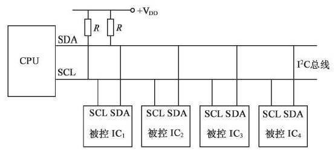
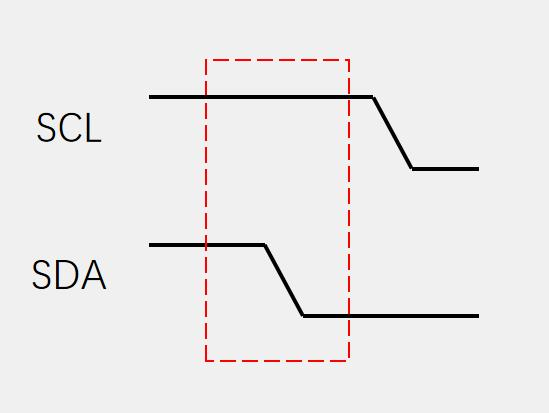
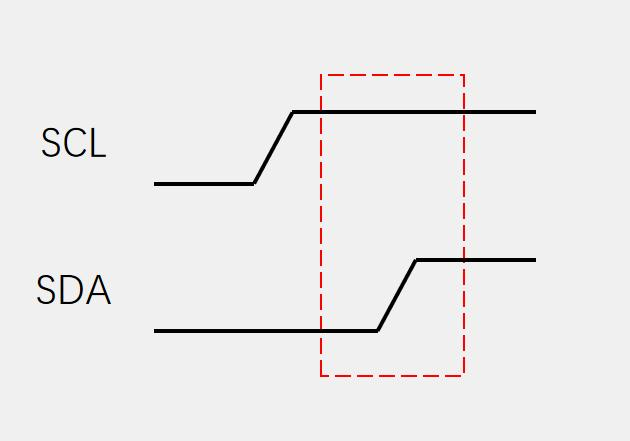
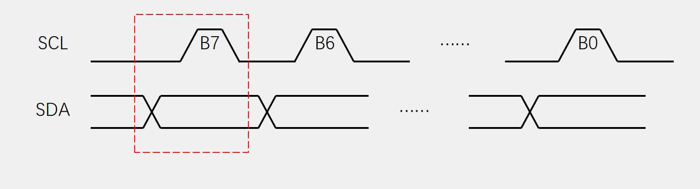
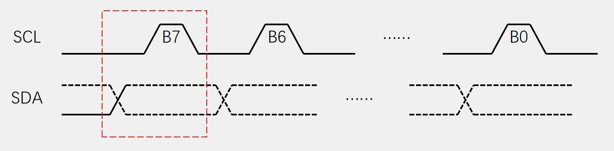
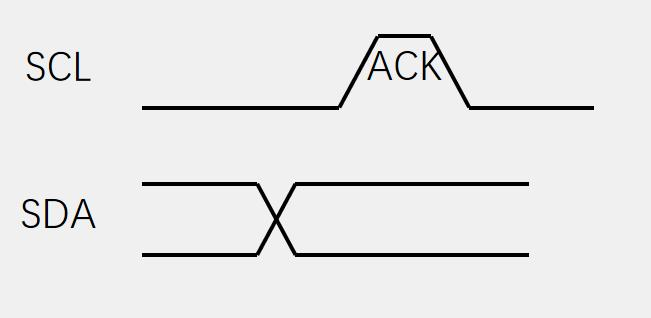
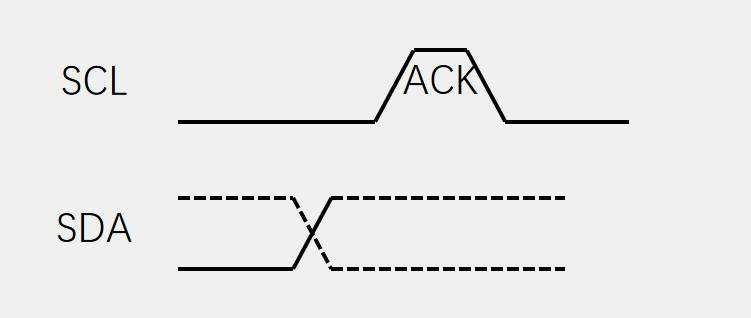
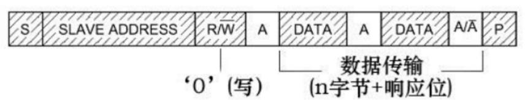
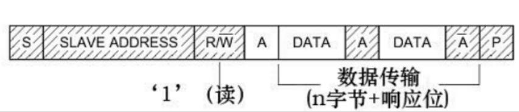

# STM32 HAL 9_IIC

## 1. IIC 物理层

IIC是一种半双工，同步，单端，多设备的通信方式。



**SDA:**双向数据串行线（从机发出应答或从机发出数据时取得控制）

**SCL:**串行时钟线（主机完全控制）

> - 从机的SCL和SDA接口配置为开漏输出防止输出高电平；
> - IIC总线有线与特性：一个设备处于低电平则总线处于低电平；

**传输模式:**标准模式100kbit/s，快速模式400kbits/s；

## 2. IIC 协议层

### IIC 时序

**空闲状态：**SCL,SDA高电平；

**起始信号（主机触发）：**在SCL高电平期间，主机将SDA从高电平拉至低电平；从机捕获此信号后复位，随后主机将SCL总线下拉开始IIC传输。



**终止信号（主机触发）：**SCL高电平期间，主机将SDA从低电平拉高到高电平，随后主机将SCL总线上拉结束IIC传输。



**发送字节：**SCL低电平期间，主机将数据位依次放到SDA线上（高位先行），然后释放SCL，从机将在SCL高电平期间读取数据位，所以SCL高电平期间SDA不允许有数据变化，依次循环上述过程8次，即可发送一个字节。



**接收字节：**SCL低电平期间，从机将数据位依次放到SDA线上（高位先行），然后释放SCL，主机将在SCL高电平期间读取数据位，所以SCL高电平期间SDA不允许有数据变化，依次循环上述过程8次，即可接收一个字节（主机在接收之前，需要释放SDA）。



**发送应答：**主机在接收完一个字节之后，在下一个时钟发送一位数据，数据0表示应答，数据1表示非应答。



**接收应答：**主机在发送完一个字节之后，在下一个时钟接收一位数据，判断从机是否应答，数据0表示应答，数据1表示非应答（主机在接收之前，需要释放SDA）。



### IIC数据帧

- 主机写数据到从机：



- 主机从从机接收数据：



## 3. IIC 的使用

### 软件模拟IIC时序

```c
/**
 * @brief       CPU发起IIC总线启动信号
 * @attention   当SCL高电平时，SDA出现一个下跳沿表示IIC总线启动信号
 */
void _IIC_Start(void)
{
    IIC_SDA(1);
    IIC_SCL(1);
    _IIC_Delay();
    IIC_SDA(0);
    _IIC_Delay();
    IIC_SCL(0);
    _IIC_Delay();
}

/**
 * @brief       CPU发起IIC总线停止信号
 * @attention   当SCL高电平时，SDA出现一个上跳沿表示IIC总线停止信号
 */
void _IIC_Stop(void)
{
    IIC_SDA(0);
    IIC_SCL(1);
    _IIC_Delay();
    IIC_SDA(1);
}

/**
 * @brief       CPU向IIC总线设备发送8bit数据
 * @param       byte    发送的8字节数据
 */
void _IIC_Send_Byte(uint8_t byte)
{
    uint8_t i;

    /* 先发送字节的高位bit7 */
    for (i = 0; i < 8; i++)
    {
        if (byte & 0x80)
        {
            IIC_SDA(1);
        }
        else
        {
            IIC_SDA(0);
        }
        _IIC_Delay();
        IIC_SCL(1);
        _IIC_Delay();
        IIC_SCL(0);
        if (i == 7)
        {
            IIC_SDA(1); // 释放总线
        }
        byte <<= 1; // 左移一位
        _IIC_Delay();
    }
}

/**
 * @brief   CPU从IIC总线设备读取8bit数据
 * @return  读取的数据
 */
uint8_t _IIC_Read_Byte(uint8_t ack)
{
    uint8_t i;
    uint8_t value;

    /* 读到第1个bit为数据的bit7 */
    value = 0;
    for (i = 0; i < 8; i++)
    {
        value <<= 1;
        IIC_SCL(1);
        _IIC_Delay();
        if (IIC_SDA_READ())
        {
            value++;
        }
        IIC_SCL(0);
        _IIC_Delay();
    }
    if (ack == 0)
        _IIC_NAck();
    else
        _IIC_Ack();
    return value;
}

/**
 * @brief   CPU产生一个时钟，并读取器件的ACK应答信号
 * @return  返回0表示正确应答，1表示无器件响应
 */
uint8_t _IIC_Wait_Ack(void)
{
    uint8_t re;

    IIC_SDA(1); /* CPU释放SDA总线 */
    _IIC_Delay();
    IIC_SCL(1); /* CPU驱动SCL = 1, 此时器件会返回ACK应答 */
    _IIC_Delay();
    if (IIC_SDA_READ()) /* CPU读取SDA口线状态 */
    {
        re = 1;
    }
    else
    {
        re = 0;
    }
    IIC_SCL(0);
    _IIC_Delay();
    return re;
}

/**
 * @brief   CPU产生一个ACK信号
 */
void _IIC_Ack(void)
{
    IIC_SDA(0); /* CPU驱动SDA = 0 */
    _IIC_Delay();
    IIC_SCL(1); /* CPU产生1个时钟 */
    _IIC_Delay();
    IIC_SCL(0);
    _IIC_Delay();
    IIC_SDA(1); /* CPU释放SDA总线 */
}

/**
 * @brief   CPU产生1个NACK信号
 */
void _IIC_NAck(void)
{
    IIC_SDA(1); /* CPU驱动SDA = 1 */
    _IIC_Delay();
    IIC_SCL(1); /* CPU产生1个时钟 */
    _IIC_Delay();
    IIC_SCL(0);
    _IIC_Delay();
}

/**
 * @brief   检测IIC总线设备，CPU向发送设备地址，然后读取设备应答来判断该设备是否存在
 * @param   _Address 设备的IIC总线地址
 * @return  0表示正确,1表示未探测到
*/
uint8_t _IIC_CheckDevice(uint8_t _Address)
{
    uint8_t ucAck;

    _IIC_GPIO_Init();                           /* 配置GPIO */
    _IIC_Start();                               /* 发送启动信号 */
    _IIC_Send_Byte(_Address | IIC_WR);          /* 发送设备地址+读写控制bit（0 = w， 1 = r) bit7 先传 */
    ucAck = _IIC_Wait_Ack();                    /* 检测设备的ACK应答 */
    _IIC_Stop();                                /* 发送停止信号 */

    return ucAck;
}

/**
 * @brief   IIC连续写
 * @param   addr    器件地址
 * @param   reg     寄存器地址
 * @param   len     写入长度
 * @param   buf     数据区
*/
uint8_t _IIC_Write_Len(uint8_t addr, uint8_t reg, uint8_t len, uint8_t *buf)
{
    uint8_t i;
    _IIC_Start();
    _IIC_Send_Byte((addr << 1) | 0);                         // 发送器件地址+写命令
    if (_IIC_Wait_Ack())                                     // 等待应答
    {
        _IIC_Stop();
        return 1;
    }
    _IIC_Send_Byte(reg);                                     // 写寄存器地址
    _IIC_Wait_Ack();                                         // 等待应答
    for (i = 0; i < len; i++)
    {
        _IIC_Send_Byte(buf[i]);                              // 发送数据
        if (_IIC_Wait_Ack())                                 // 等待ACK
        {
            _IIC_Stop();
            return 1;
        }
    }
    _IIC_Stop();
    return 0;
}

/**
 * @brief   IIC连续读
 * @param   addr    器件地址
 * @param   reg     寄存器地址
 * @param   len     写入长度
 * @param   buf     数据区
*/
uint8_t _MPU_Read_Len(uint8_t addr, uint8_t reg, uint8_t len, uint8_t *buf)
{
    _IIC_Start();
    _IIC_Send_Byte((addr << 1) | 0);             // 发送器件地址+写命令
    if (_IIC_Wait_Ack())                         // 等待应答
    {
        _IIC_Stop();
        return 1;
    }
    _IIC_Send_Byte(reg);                         // 写寄存器地址
    _IIC_Wait_Ack();                             // 等待应答
    _IIC_Start();
    _IIC_Send_Byte((addr << 1) | 1);             // 发送器件地址+读命令
    _IIC_Wait_Ack();                             // 等待应答
    while (len)
    {
        if (len == 1)
            *buf = _IIC_Read_Byte(0);            // 读数据,发送nACK
        else
            *buf = _IIC_Read_Byte(1);            // 读数据,发送ACK
        len--;
        buf++;
    }
    _IIC_Stop();                                 // 产生一个停止条件
    return 0;
}
```

### HAL 库函数

```c
/**
  * @brief  主机发送数据（非阻塞式）
  * @param  hi2c IIC句柄 hi2cx
  * @param 	DevAddress 目标设备地址 7位地址, 向左移1位
  * @param  pData 发送数据地址
  * @param  Size 发送的字节长度
  * @param  Timeout 超时时间
  */
HAL_StatusTypeDef HAL_I2C_Master_Transmit(I2C_HandleTypeDef *hi2c, uint16_t DevAddress, uint8_t *pData,uint16_t Size, uint32_t Timeout);

/**
  * @brief  主机读取数据（非阻塞式）
  * @param  hi2c IIC句柄 hi2cx
  * @param 	DevAddress 目标设备地址 7位地址, 向左移1位
  * @param  pData 读取数据地址
  * @param  Size 读取的字节长度
  * @param  Timeout 超时时间
  */
HAL_StatusTypeDef HAL_I2C_Master_Receive(I2C_HandleTypeDef *hi2c, uint16_t DevAddress, uint8_t *pData,uint16_t Size, uint32_t Timeout);

/**
  * @brief  从机发送数据（非阻塞式）
  * @param  hi2c IIC句柄 hi2cx
  * @param  pData 发送数据地址
  * @param  Size 发送的字节长度
  * @param  Timeout 超时时间
  */
HAL_StatusTypeDef HAL_I2C_Slave_Transmit(I2C_HandleTypeDef *hi2c, uint8_t *pData, uint16_t Size,uint32_t Timeout);

/**
  * @brief  从机读取数据（非阻塞式）
  * @param  hi2c IIC句柄 hi2cx
  * @param  pData 读取数据地址
  * @param  Size 读取的字节长度
  * @param  Timeout 超时时间
  */
HAL_StatusTypeDef HAL_I2C_Slave_Receive(I2C_HandleTypeDef *hi2c, uint8_t *pData,uint16_t Size, uint32_t Timeout)

/**
  * @brief  向从机特定位置写数据
  * @param  hi2c IIC句柄 hi2cx
  * @param 	DevAddress 目标设备地址 7位地址, 向左移1位
  * @param  MemAddress 从机寄存器地址
  * @param  MemAddSize 从机寄存器地址的大小（8位I2C_MEMADD_SIZE_8BIT或16位I2C_MEMADD_SIZE_16BIT）
  * @param  pData 发送数据地址
  * @param  Size 发送的字节长度
  * @param  Timeout 超时时间
  */
HAL_StatusTypeDef HAL_I2C_Mem_Write(I2C_HandleTypeDef *hi2c, uint16_t DevAddress, uint16_t MemAddress,uint16_t MemAddSize, uint8_t *pData, uint16_t Size, uint32_t Timeout);

/**
  * @brief  向从机特定位置读取数据
  * @param  hi2c IIC句柄 hi2cx
  * @param 	DevAddress 目标设备地址 7位地址, 向左移1位
  * @param  MemAddress 从机寄存器地址
  * @param  MemAddSize 从机寄存器地址的大小（8位I2C_MEMADD_SIZE_8BIT或16位I2C_MEMADD_SIZE_16BIT）
  * @param  pData 读取数据地址
  * @param  Size 读取的字节长度
  * @param  Timeout 超时时间
  */
HAL_StatusTypeDef HAL_I2C_Mem_Read(I2C_HandleTypeDef *hi2c, uint16_t DevAddress, uint16_t MemAddress,uint16_t MemAddSize, uint8_t *pData, uint16_t Size, uint32_t Timeout);
```
> 注：对于一个IIC通信设备，通常分为写数据和写命令进行写入（数据手册中有数据和命令对应的16进制数）；