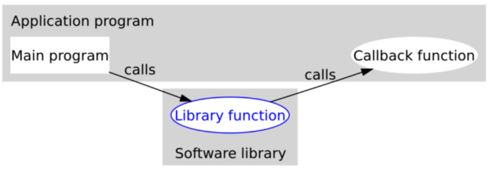
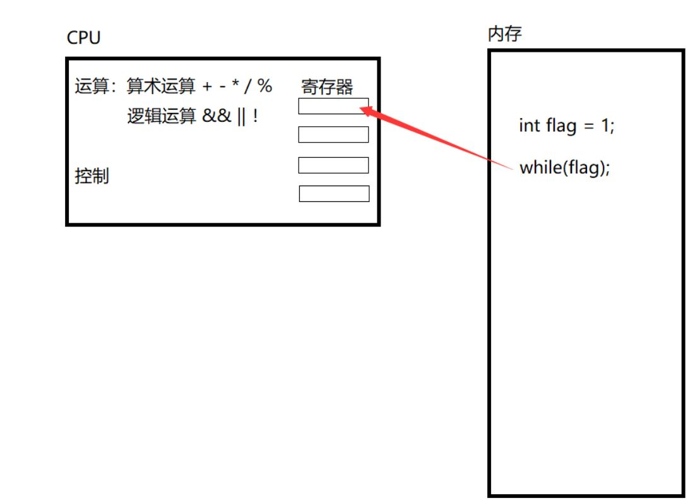

# STM32 A1_C语言扩展

## 1. 条件编译

在编译一个程序的时候我们如果要将一条语句（一组语句）编译或者放弃是很方便的。因为有条件编译指令。调试性的代码可以选择性的编译。

此时，可以使用其他指令创建条件编译。也就是说，可以使用这些指令告诉编译器根据编译时的套件执行或忽略某些信息（或代码）块。

### `#ifdef`和`#endif`指令

```c
#ifdef 标识符
    //代码
#endif
```

`#ifdef` 指令说明，如果预处理器已经定义了后面的标识符，则执行 `#ifdef` 与 `#endif` 之间的所有所有C代码。如果预处理器未定义该标识符，则中间的代码不参与编译。

> 1. `#if define(标识符)`指令也可实现相同效果；
> 2. `#ifndef`和`#if !define`效果与之相反，通常用来防止头文件重复包含。
>
> ```c
> #ifndef __XXX_H
> #define __XXX_H
> 
> #endif
> ```

### `#if`和`#endif`指令

```c
#if 常量表达式
    //代码
#endif
```

`#if` 后面为常量表达式，如果表达式为非0，则表达式为真，执行 `#if` 与 `#endif` 中间的所有C代码；如果表达式为0，则表达式为假，中间的代码不参与编译。

> - `#if` 指令中可以使用C的关系运算符和逻辑运算符
>
> - 使用`#if`定义的标识符后面必须要有表达式。

### `#elif`和`#else`指令

```c
#if 常量表达式
    //代码1
#elif 常量表达式
    //代码2
#else
    //代码3
#endif
```

`#ifdef` / `#if` `#else` 类似于C的`if else`语句，两者的主要区别是，预处理器不识别用于标记块的花括号 `{}`。

## 2. 位运算

### 位的表示

```c
#define BIT0 0x01			//0b00000001
#define BIT1 0x02			//0b00000010
#define BIT2 0x04			//0b00000100
#define BIT3 0x08			//0b00001000
#define BIT4 0x10			//0b00010000
#define	BIT5 0x20			//0b00100000
#define	BIT6 0x40           //0b01000000
#define BIT7 0x80           //0b10000000
```

### 位运算

#### 按位取反`~`

```c
x = ~x;
```

按位取反为前置运算符，对操作数的每一位取反。

> 例如：00001111 --> 11110000

#### 按位与`&`

```c
x & y;
/**
 *		x = 0,y = 0 ---> x & y = 0
 *      x = 1,y = 0 ---> x & y = 0
 *		x = 0,y = 1 ---> x & y = 0
 *		x = 1,y = 1 ---> x & y = 1
*/
```

> - `&`  通常在读取寄存器是低时使用：
>
> ```c
> if((P1IN & BIT5) == 0)			//判断P1.5输入是否为低
> if(!(P1IN & BIT5))
> ```
> > `!`为逻辑取反，操作数不是0才是1
>
> - `&` 也可以将寄存器置为低
>
> ```c
> P2OUT &= ~(BIT0);				//将P2.0置0
> ```

#### 按位或`|`

```c
x | y;
/**
 *		x = 0,y = 0 ---> x | y = 0
 *      x = 1,y = 0 ---> x | y = 1
 *		x = 0,y = 1 ---> x | y = 1
 *		x = 1,y = 1 ---> x | y = 1
*/
```

> 将寄存器的某一位置高
>```c
> P2OUT |= BIT0;
> ```

#### 按位异或`^`

```c
x ^ y;
/**
 *		x = 0,y = 0 ---> x ^ y = 1
 *      x = 1,y = 0 ---> x ^ y = 0
 *		x = 0,y = 1 ---> x ^ y = 0
 *		x = 1,y = 1 ---> x ^ y = 1
*/
```

> 翻转寄存器某一位
>
> ```c
P2OUT ^= BIT0;

## 3. 函数指针和回调函数

### 函数指针

函数指针是指向函数的指针变量。

- 定义方法：

```c
// 函数返回值类型 (*指针变量名) (函数参数列表);
int (*function)(int,int);	// 定义了名为 function 的函数指针变量，function 指向的函数返回 int 类型的变量，同时需要接收两个 int 类型的形参
```

>- 参数列表中是函数形参的**数据类型**；
>
>- 指向函数的指针变量没有 ++ 和 -- 运算。

- 定义函数指针类型：

```c
// typedef 函数返回值类型 (*指针变量类型名) (函数参数列表);
typedef int (*FUNCTION)(int,int);		 // 定义了名为 FUNCTION 的函数指针类型
FUNCTION function;						// 定义了名为 function 的函数指针变量，function 指向的函数返回 int 类型的变量，同时需要接收两个 int 类型的形参
```

>- 此时定义的为一个函数指针类型，这个类型的指针变量可以指向对应种类的函数首地址。
>- 显然，这种方法使得代码具有很好的可读性。

- 返回一个函数指针：

```c
// 函数指针返回值类型 (*函数名(函数形参列表))(函数指针指向函数的形参数据类型);
int (*Function())(int,int);		// 声明了名为 Function 的函数，无形参，返回一个指针变量；此时将 *Function() 去掉，容易看出返回的函数指针类型
```

- 函数指针数组：

```c
// 函数指针返回值类型 (*数组名[容量])(函数指针指向函数的形参数据类型);
int (*Array[10])(int,int);
```

### 回调函数

回调函数就是一个通过函数指针调用的函数。把函数的指针（地址）作为参数传递给另一个函数，当这个指针被用来调用其所指向的函数时，是回调函数。**回调函数不是由该函数的实现方直接调用，而是在特定的事件或条件发生时由另外的一方调用的，用于对该事件或条件进行响应。**



```c
int Callback_1(int a)   // 回调函数1
{
    printf("Hello, this is Callback_1: a = %d ", a);
    return 0;
}

int Callback_2(int b)  // 回调函数2
{
    printf("Hello, this is Callback_2: b = %d ", b);
    return 0;
}

int Callback_3(int c)   // 回调函数3
{
    printf("Hello, this is Callback_3: c = %d ", c);
    return 0;
}

int Handle(int x, int (*Callback)(int)) 
{
    Callback(x);
}

int main()
{
    Handle(4, Callback_1);
    Handle(5, Callback_2);
    Handle(6, Callback_3);
    return 0;
}
```

## 4. 断言

`assert`宏的原型定义在`<assert.h>`中，其作用是如果它的条件返回错误，则终止程序执行，原型定义：

```c
void assert( int expression );
```

`assert`的作用是计算表达式`expression` ，如果其值为假（即为0），那么它先向`stderr`打印一条出错信息，然后通过调用`abort`来终止程序运行。

>使用assert的缺点是，频繁的调用会极大的影响程序的性能，增加额外的开销。
>在调试结束后，可以通过在包含`#include <assert.h>`的语句之前插入 `#define NDEBUG` 来禁用`assert`调用

- 用法与注意事项

1. 在函数开始处检验传入参数的合法性。

2. 每个`assert`只检验一个条件,因为同时检验多个条件时,如果断言失败,无法直观的判断是哪个条件失败。

3. 不能使用改变环境的语句,因为`assert`只在`DEBUG`中生效,如果这么做,会使用程序在真正运行时遇到问题。

## 5. 变量定义关键字

### `volatile`关键字

`volatile` 关键字是一种类型修饰符，用它修饰的变量表示可以被某些编译器，未知的因素更改，比如操作系统、硬件或者其它线程等。遇到这个关键字声明的变量，**编译器对访问该变量的代码就不再进行优化，从而可以提供对特殊地址的稳定访问**。

>如图，这里用 flag 标记了一个循环，编译器在执行这条语句的时候为了对循环进行逻辑判断需要CPU参与，而CPU进行逻辑判断的时候是先将变量 flag 加载到寄存器中，再判断循环条件是否为真，为真再执行循环语句，但是这里并没有任何东西能够修改循环变量flag的值，也就是定义了一个死循环，那么，为了将这个循环进行下去，CPU就需要不断地将变量flag从内存加载到寄存器中进行逻辑判断，显然，这样效率很低，所以，为了提高效率，CPU会直接将 flag 放在寄存器中，以后CPU每次检测时直接从寄存器中读取 flag 的值，不再从内存中读取，这种情况也被称为 “内存覆盖”。
>但是如果是多线程运行时，循环变量 flag 是有可能在 while 外部被其他值修改的，当一个和 while 并行存在的逻辑将 flag 改为0时，因为CPU是直接从寄存器中读取 flag 的值进行 while 循环的逻辑判断的，所以当另一个逻辑将 flag 改为0时，while 循环并不会停止，而是会继续执行其中的代码块，从而造成程序逻辑上的错误。
>
>- 可以直接在 flag 变量前面加上 volatile 关键字，让CPU不要对 flag 进行优化，每次都继续从内存当中读取 flag 的值。



## 6. 可变参数

`va_list`是在C语言中解决变参问题的一组宏，变参问题是指参数的个数不定，可以是传入一个参数也可以是多个;可变参数中的每个参数的类型可以不同,也可以相同;可变参数的每个参数并没有实际的名称与之相对应，用起来很灵活。需要包含`<stdarg.h>`

`va_list`的用法：

（1）首先在函数里定义一具`va_list`型的变量，这个变量是指向参数的指针；

（2）然后用`va_start`宏初始化变量刚定义的`va_list`变量；

（3）然后用`va_arg`返回可变的参数，`va_arg`的第二个参数是你要返回的参数的类型（如果函数有多个可变参数的，依次调用`va_arg`获取各个参数）；

（4）最后用`va_end`宏结束可变参数的获取。

1. `va_list` 类型，对应于形参中的省略号部分

```c
typedef char*  va_list;
```

2. `va_start(va_list,arg)`

`va_start`初始化`va_list`变量，使得`va_list`变量指向可变参数列表第一个参数的地址，第二个参数固定为可变参数列表(`...`)左边第一个参数。

```c
#define _INTSIZEOF(n)   ( (sizeof(n) + sizeof(int) - 1) & ~(sizeof(int) - 1) )
#define va_start(ap,v)  ( ap = (va_list)_ADDRESSOF(v) + _INTSIZEOF(v) )
```

3. `va_arg(va_list,t)`

`va_arg`获取当前参数并使得`va_list`变量指向下一个参数的地址，第二个参数是获取参数的类型。

```c
#define va_arg(ap,t)    ( *(t *)((ap += _INTSIZEOF(t)) - _INTSIZEOF(t)) )
```

4. `va_end(va_list)`

`va_end`结束可变参数列表获取，将`va_list`变量置`NULL`。即删除此变量，下一次使用时需要重新调用`va_start`。

```c
#define va_end(ap)      ( ap = (va_list)0 )
```

```c
// 可变参数头文件
#include <stdarg.h>

// 函数原型应有至少一个形参，以省略号结尾
// 省略号左侧的第一个形参称为paramN，传递给该形参的实际参数为省略号部分代表的参数数量
double sum(int lim, ...)
{
    double tic;
    float toc;
    
    va_list ap;			// 声明一个存储参数的对象
    va_start(ap,lim);	// 将ap初始化为参数列表
	
    tic = va_arg(ap, double);	// 检索第一个参数
    toc = va_arg(ap, float);	// 检索第二个参数
    
    va_end(ap);			// 结束检索
    
    return tic;
}
```

