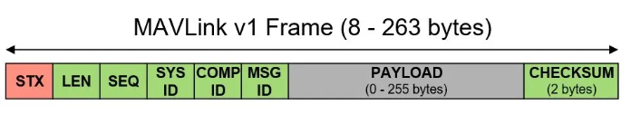
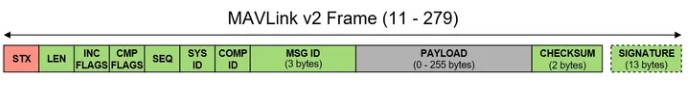
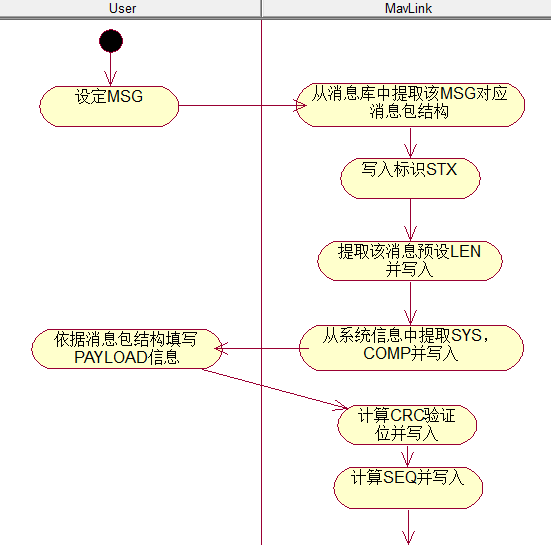

# STM32 A2_软件层通信协议 1_Mavlink协议

[Mavlink 官网](https://mavlink.io/en/)

## 1. Mavlink 简介

MAVLink(Micro Air Vehicle Link，微型空中飞行器链路通讯协议)是一个非常轻量化的消息协议，用于无人机之间的通信以及无人机机载设备之间的通信。

- Mavlink 优势

> - 提供了代码生成工具，一键生成不同语言的API库，不用自己写通信协议的具体实现了，不用担心在收包的时候低效、丢包，不用费劲心思写校验函数。常见的编程语言基本上都支持了，这也意味着你可以在很多不同的平台上使用，例如Windows、Linux、STM32、Android等等。
> - 极易扩展！MavLink给予`XML`格式给定了消息定义模板，当基础消息无法满足你的通信需求时，你可以根据模板定义扩展消息，然后使用生成工具一键重新生成即可！
> - 高效、稳定，从2009年起，无数应用场景已经证明这点。
> - 标准就是最大的优点！

- Mavlink 版本

Mavlink有两个版本：Mavlink v1和Mavlink v2，基本框架没有什么区别，二者不同点有：

> - Mavlink v2版本能够定义的消息数量更多，有三个字节定义`MSG ID`，也就是多达16777216个，而Mavlink v1版本只有256个。
> - Mavlink v2版本增加了签名信息。

- Mavlink 通信协议





> - `STX`：数据包起始标志`0xFD`；
> - `LEN`：`PAYLOAD`的长度；
> - `SEQ`：数据包序号，0~255，每次发送一个数据包，序号就会累加，循环往复，用于检测丢包；
> - `SYS ID`：设备系统级的ID；
> - `COMP ID`：设备组件级的ID，一个相同系统可能有多个不同组件都使用MavLink进行通信；
> - `PAYLOAD`：存放通信数据，可能是信息、命令等；

- Mavlink 封包/解包过程

使用Mavlink协议提供的方法封装消息包时，会根据所使用的`MSG`获取到该类别`MSG`消息的`LEN`信息，同时软件（地面站或飞行控制软件）会根据自身状态信息填写`SYS`、`COMP`。

信息填写完毕生成数据包时，封装方法会自动添加`STX`，并在上一次发送消息包所使用的`SEQ`上加1作为本次发送的`SEQ`写入，当`SEQ`超过255时，会回到0并重新开始计数。

`CKA`、`CKB`会在`PAYLOAD`信息写入后、封装完成之前，根据CRC算法计算得出并自动写入包内。

设定`SYS`和`COMP`并且正确调用Mavlink所提供方法后，整个消息包的生成过程中仅有`MSG`和`PAYLOAD`两项内容需要用户关心。



> 注意：消息的`MSG ID`确定了`PAYLOAD`的数据包结构，接收方接收消息后仅需要根据`MSG ID`进行解包即可。

## 2. Mavlink 消息库生成

### 环境安装

1. 克隆官方库

```shell
$ git clone https://github.com/mavlink/mavlink.git --recursive
```

2. 安装Python(Mavlink 是基于 Python 实现的)，并在Python中安装必要模块。

```shell
$ pip install -r pymavlink/requirements.txt
```

### 生成消息库

- 自定义消息

消息就是要发送或接收的一组变量。消息在`xml`文件中定义。Mavlink 会根据`xml`文件生成对应的结构体以及收发函数。如果想在两个系统之间传输消息，那么这个消息必须在这两个系统中都定义（而且这个消息的`MSG ID`和`PAYLOAD`要相同）

https://mavlink.io/zh/guide/xml_schema.html

https://mavlink.io/zh/guide/define_xml_element.html

```xml
<?xml version="1.0"?>
<mavlink>
  <!-- 确定mavlink版本 -->
  <version>3</version>					
  <messages>
    <!-- 确定每种消息的类型，通过MSG ID区别 -->
    <message id="1" name="SPEED">
      <!-- description 标签相当于注释 -->
      <description>SpeedData</description>
      <!-- field 标签确定数据包内容，包括数据的type和name属性 -->
      <field type="double" name="vx">vx</field>
      <field type="double" name="vy">vy</field>
      <field type="double" name="vz">vz</field>
     </message>
     <message id="2" name="GYRO">
      <description>IMUData</description>
      <field type="int16_t" name="gx">gx</field>
      <field type="int16_t" name="gy">gy</field>
      <field type="int16_t" name="gz">gz</field>
      <field type="int16_t" name="ax">ax</field>
      <field type="int16_t" name="ay">ay</field>
      <field type="int16_t" name="az">az</field>
     </message>
   </messages>
 </mavlink>
```

> 对于 Mavlink 1:
>
> - 有效数字介于 0 到 255。
> - ID 0-149 和 230-255 为`common.xml`保留。 语支可以使用180-229 用于自定义消息 (除非这些信息没有被其他包括语支使用)。
>
> 对于 Mavlink 2 :
>
> - 有效数字介于0-1677215。
> - 255以下所有值都被认为是保留的，除非报文也打算用于 MAVLink 1。 **注意** ID 在 MAVLink 1 中很宝贵！
>
> Mavlink 官方有一些预定义消息。这些消息是官方预设的无人机通信消息，如果不玩无人机就基本上用不到。

- 通过自定义消息生成库

1. 打开`mavlink/mavgenerate.py`


>- XML 选择你刚刚编写的 XML 文件
>- Out 选择你想要存放库文件的目录
>- Language 选择 C
>- Protocol 选择 1.0 或 2.0（看你需求，版本区别官网上有说明）

2. Generate