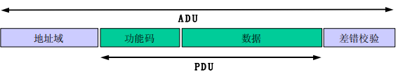
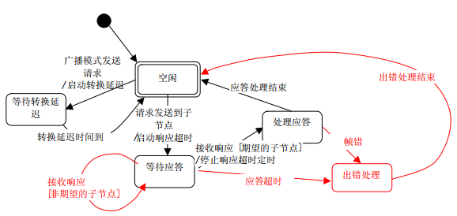

# STM32 A2_软件层通信协议 Modbus协议

Modbus 官网： www.modbus.org

## 1. Modbus 协议简介

Modbus 是工业界常用的一种通讯协议。

Modbus 协议于 1979 年由 Modicon 公司（现被 Schneider 公司收购）设计开发，一经面世因其简单开放的通信方式逐渐成为工业系统中流行的标准，是全球第一个真正用于工业现场的总线协议。后来，为了更好地普及和推动 Modbus 基于以太网（TCP/IP）的分布式应用，施耐德公司将 Modbus 协议的所有权移交给 IDA（Interface for Distributed Automation，分布式自动化接口）组织，并成立了 Modbu-IDA 国际组织，负责推广 Modbus 标准以及对 Modbus 产品进行认证。

Modbus 协议允许在各种网络体系结构内进行简单通信。

> - 每种设备（PLC、HMI、控制面板、驱动程序、动作控制、输入/输出设备）都能使用 Modbus 协议来启动远程操作。
> - 在基于串行链路和以太 TCP/IP 网络的 Modbus 上可以进行相同通信。
> - 一些网关允许在几种使用 Modbus 协议的总线或网络之间进行通信。

## 2. Modbus 协议内容

### Modbus 通信帧格式

Modbus 协议定义了一个与基础通信层无关的简单协议数据单元（PDU）。特定总线或网络上的 Modbus 协议映射能够在应用数据单元（ADU）上引入一些附加域。

> - **地址域：**子节点地址，主节点通过将子节点的地址放到报文的地址域对子节点寻址。当子节点返回应答时， 它将自己的地址放到应答报文的地址域以让主节点知道哪个子节点在回答。
> - **功能码：**指明服务器要执行的动作。
> - **数据域：**功能码后面的有表示含有请求和响应参数的数据。
> - **错误检验：**是对报文内容执行冗余校验的计算结果。根据不同的传输模式使用不同的计算方法。

### Modbus 数据模型

一个 Modbus 设备内可以有存在寄存器地址的数据块：

| 数据块     | 数据类型        | 访问权限 | 内容                         |
| ---------- | --------------- | -------- | ---------------------------- |
| 离散量输入 | bool            | 只读     | I/O 系统提供这种类型数据     |
| 线圈       | bool            | 读写     | 通过应用程序改变这种类型数据 |
| 输入寄存器 | 无符号2字节整型 | 只读     | I/O 系统提供这种类型数据     |
| 保持寄存器 | 无符号2字节整型 | 读写     | 通过应用程序改变这种类型数据 |

> - 线圈可读可写，还是布尔类型的，它可以表示控制现场的开关，1表示开关的打开，0表示开关的关闭。控制开关的开闭可以这么表示，同样的读取回来的值也可以表示开关的开闭状态。
> - 离散量输入也是布尔型的，但是只能读取，不支持写入。所以它可以表示控制现场中的信号灯的状态，主设备通过查询这些bit的值从而获知信号灯的状态。
> - 输入寄存器是只读的，占有两个字节的数据量。所以可以用于存储一些系统的信息，方便主设备随时查询，从而获知从设备的状态。
> - 保持寄存器可读可写，也是两个字节的数据量。所以可以接收来自主设备的控制数据，也可以向主设备返回从设备的控制数据。

这些数据块的寄存器地址编号范围为 0 - 65535：

| 寄存器地址前缀 | 编号范围（1-65536） | 编号范围（1-9999） | 数据区块   |
| -------------- | ------------------- | ------------------ | ---------- |
| 0              | 000001-065536       | 00001-09999        | 线圈       |
| 1              | 100001-165536       | 10001-19999        | 离散量输入 |
| 3              | 300001-365536       | 30001-39999        | 输入寄存器 |
| 4              | 400001-465536       | 40001-49999        | 保持寄存器 |

### Modbus 功能码

Modbus的功能码分为三类：公共功能码、用户定义功能码、保留功能码。

> - 公共功能码：公共功能码是已经被定义好的功能码。
> - 用户定义功能码：用户定义功能码有两个范围，65 - 72和 100 - 110。
> - 保留功能码：可以用于某些公司或者应用使用的功能码，这部分功能码对公共使用是无效的。

- 公共功能码

  

  - (0x01)读线圈

    在一个远程设备中，使用该功能码读取线圈的 1 至 2000 连续状态。

    

    

  - (0x02)读离散量输入

    在一个远程设备中，使用该功能码读取离散量输入的 1 至 2000 连续状态。
    
    
    
  - (0x03)读保持寄存器
  
    在一个远程设备中，使用该功能码读取保持寄存器连续块的内容。
    
    
    
    
    
  - (0x04)读输入寄存器

    在一个远程设备中，使用该功能码读取 1 至大约 125 的连续输入寄存器。
  
    
  
    
  
  - (0x05)写单个线圈
  
    在一个远程设备上，使用该功能码写单个输出为 ON 或 OFF。
  
    
  
  - (0x06)写单个寄存器
  
    在一个远程设备中，使用该功能码写单个保持寄存器。
  
    
  
    

  - (0x0F) 写多个线圈
  
    在一个远程设备中，使用该功能码强制线圈序列中的每个线圈为 ON 或 OFF。
  
    
  
  - (0x10) 写多个寄存器
  
    在一个远程设备中，使用该功能码写连续寄存器块。
  
    
  
    
  

## 3. Modbus 串行链路协议内容

### Modbus 通信模式

Modbus 是一种串行链路上的主从协议，在通信线路上只能有一个主机存在，不会有多主机存在的情况。虽然主机只有一个，但是从机是可以有多个的。

Modbus 的通信过程都是由主机发起的，从机在接收到主机的请求后再进行响应，从机不会主动进行数据的发送。并且从机之间也不会互相发送数据。

- Modbus 地址

  Modbus中的每个从机为了能在通信时被主机识别，都会有一个地址，也称为从节点地址。从节点地址对从设备而言必须是唯一的，在总线上也只能有唯一的一个设备地址，即从机设备的地址在总线上也不能冲突。

  从机是有唯一的设备地址的，而主机本身是没有地址的。

  Modbus支持的寻址空间为256个：

  | 0        | 1-247      | 248-255 |
  | -------- | ---------- | ------- |
  | 广播地址 | 子节点地址 | 保留    |

  > 0是广播地址，所有的子节点都必须要能够识别广播地址。

- 单播模式和广播模式

  1. **单播模式：**主机要访问某个子节点的时候，是通过子节点的地址进行的一对一的访问方式。子节点在收到主节点发过来的请求以后，根据请求的类型完成相应处理后，子节点会向主节点返回一个报文。

     

     在单播模式下，一个 Modbus 的事务它包含了两个报文，一个是由主机主动发出的请求报文，另一个是由从机返回的应答报文。

  2. **广播模式：**广播模式是主机用于向总线上的所有的从机发送请求的指令。主机的广播指令一般都是用于写命令的，对于来自于主机的广播指令，从机是不需要进行应答的。

     

     广播模式是单向的，主机发送出广播指令，而从机不再对广播指令进行应答，数据流只在一个方向上流动。

     总线上所有的从机都必须要能够识别主机的广播指令，并且地址0是用于广播的，不能作为从机的地址。

- 主从机的状态特征

  - 主机状态：

    

    > 1. 初始上电后，主机处于空闲状态，主机在空闲状态时可以发送请求，发送请求后，主机离开空闲状态，进入忙状态，此时不能再发送其他的请求。
    > 2. 当单播请求发送到一个从机上，主机将进入等待应答状态， 同时一个临界超时定时计数器会启动。这个超时称为响应超时。 它避免主节点永远处于等待应答状态。响应超时的时间依赖于实际的应用场景。
    > 3. 当收到一个应答时，主节点在处理数据之前检验应答。在某些情况下，检验的结果可能为错误。如收到来自非期望的子节点的应答，或接收的帧错误，响应超时继续计时；当检测到帧错时，可以执行一个重试。
    > 4. 响应超时但没有收到应答时，则产生一个错误。那么主节点会重新进入空闲状态，并发出一个重试请求。重试的最大次数取决于主节点的设置。
    > 5. 当广播请求发送到串行总线上，没有响应从子节点返回。然而主节点需要进行延迟以便使子节点在发送新的请求处理完当前请求。该延迟被称作转换延迟。因此，主节点会在返回能够发送另一个请求的空闲状态之前，到等待转换延迟状态。
    > 6. 在单播方式，响应超时必须设置到足够的长度以使任何子节点都能处理完请求并返回响应。而广播转换延迟必须有足够的长度以使任何子节点都能只处理完请求而可以接收新的请求。因此，转换延迟应该比响应超时要短。

  - 从机状态：

    

    > 1. 初始上电后，从机处于空闲状态；
    > 2. 当收到一个请求时，子节点在处理请求中要求的动作前要先检验报文包。当检测到错误时，必须向主节点发送应答告知错误。
    > 3. 当要求的动作完成后，单播报文要求必须按格式应答主节点。如果子节点在接收到的帧中检测到错误， 则没有响应返回到主节点。
    > 4. 任何子节点均应该定义并管理 Modbus 诊断计数器以提供诊断信息。通过使用 Modbus 诊断功能码，可以得到这些计数值。

  - 通信时序：

    

### Modbus 通信帧格式

Modbus 串行链路定义两种通信模式：**RTU 模式和 ASCII 模式**；定义了报文域的位内容在线路上串行的传送，确定了信息如何打包为报文和解码。

Modbus 串行链路上所有设备的传输模式必须相同。**所有设备必须实现 RTU 模式**，ASCII 模式是备选项。

#### RTU 模式

当设备使用 RTU (Remote Terminal Unit) 模式在 Modbus 串行链路通信， 报文中每个8位字节含有两个4位十六进制字符。这种模式的主要优点是较高的数据密度，在相同的波特率下比 ASCII 模式有更高的吞吐率。每个报文必须以连续的字符流传送。

- RTU 帧格式和字节定义

    **编码系统：**8位二进制报文中每个8位字节含有两个4位十六进制字符(0–9， A–F)；

    **字节定义：**1位起始位；8位数据位，首先发送最低有效位；1位作为奇偶校验位；1位停止位。

    > 偶校验是要求的，其它模式(奇校验，无校验)也可以使用。为了保证与其它产品的最大兼容性，同时支持无校验模式是建议的。默认校验模式模式必须为偶校验。
    >
    > 
    >
    > 

    **校验方式：**循环冗余校验（CRC）。

    **帧格式：**

    
    
- RTU Modbus 报文

    由发送设备将 Modbus 报文构造为带有已知起始和结束标记的帧。这使设备可以在报文的开始接收新帧，并且知道何时报文结束。不完整的报文必须能够被检测到而错误标志必须作为结果被设置。

    

    整个报文帧必须以连续的字符流发送。如果两个字符之间的空闲间隔大于1.5个字符时间，则报文帧被认为不完整应该被接收节点丢弃。

    

    > RTU 接收驱动程序的实现，由于1.5字符和3.5字符的定时，隐含着大量的对中断的管理。在高通信速率下，这导致 CPU 负担加重。因此，在通信速率等于或低于 19200 Bps 时，这两个定时必须严格遵守；对于波特率大于 19200 Bps 的情形，应该使用 2 个定时的固定值：建议的字符间超时时间为 750µs，帧间的超时时间为 1.750ms。

    
    
    > 1. 从初始态到空闲态转换需要 3.5 字节定时超时，用以保证帧间延迟。
    > 2. 空闲态是没有发送和接收报文要处理的正常状态。
    > 3. 在 RTU 模式，当没有活动的传输的时间间隔达 3.5 字节长时，通信链路被认为在空闲态。
    > 4. 当链路空闲时，在链路上检测到的任何传输的字符被识别为 帧起始。链路变为活动状态。然后，当链路上没有字符传输的时间间个达到 3.5 字节后，被识别为帧结束。
    > 5. 检测到帧结束后，完成 CRC 计算和检验。然后，分析地址域以确定帧是否发往此设备，如果不是，则丢弃此帧。为了减少接收处理时间，地址域可以在一接到就分析，而不需要等到整个帧结束。这样，CRC 计算只需要在帧寻址到该节点 (包括广播帧) 时进行。

#### ASCII 模式

当 Modbus 串行链路的设备被配置为使用 ASCII 模式通信时，报文中的每个 8 位子节以两个 ASCII 字符发送。当通信链路或者设备无法符合 RTU 模式的定时管理时使用该模式。

- ASCII 帧格式和字节定义

    **编码系统：**十六进制，ASCII 字符 0-9，A-F。报文中每个 ASCII 字符含有 1 个十六进制字符。
    
    **字节定义：**1位起始位；7位数据位，首先发送最低有效位；1位作为奇偶校验位；1位停止位。
    
    > 偶校验是要求的，其它模式(奇校验，无校验)也可以使用。为了保证与其它产品的最大兼容性，同时支持无校验模式是建议的。默认校验模式模式必须为偶校验。
    >
    > 
    >
    > 
    
    **校验方式：**纵向冗余校验(LRC)
    
- ASCII Modbus 报文

    

    > ASCII报文帧中用冒号(`:`)(ASCII的十六进制为`0x3A`)作为起始；用回车换行(`CR` `LF`)(ASCII的十六进制为`0x0D` `0x0A`)作为结束。

    

