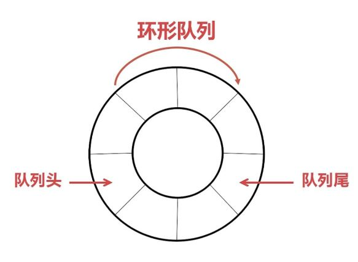

# STM32 A3_环形缓冲区

## 1. 环形缓冲区的设计

### 环形缓冲区的目的

​	当有大量数据的时候，不能存储所有的数据，计算机只能处理先到达的数据，处理完后就会把数据释放掉，再处理下一个。已经处理的数据的内存就会被浪费掉，因为后来的数据只能往后排队，如果要将剩余的数据都往前移动一次，数据处理的效率就会很低。

​	使用环形缓冲区：避免频繁的内存创建取消和分配，内存一直只用一块。



### 环形缓冲区的实现

代码摘录自Robomaster机器人源码：[Click Here](https://github.com/RoboMaster/RoboRTS-Firmware)

#### 创建环形缓冲区（`fifo_s_init`）

```c
int fifo_s_init(fifo_s_t *p_fifo, void *p_base_addr, int uint_cnt)
{
    ASSERT(p_fifo);
    ASSERT(p_base_addr);
    ASSERT(uint_cnt);

    p_fifo->p_start_addr = (char *)p_base_addr;					// 确定内存起始地址
    p_fifo->p_end_addr = (char *)p_base_addr + uint_cnt - 1;	 // 确定内存结束地址
    p_fifo->free_num = uint_cnt;							   // 确定内存元素总量
    p_fifo->used_num = 0;									  // 初始化内存占用空间
    p_fifo->p_read_addr = (char *)p_base_addr;					// 初始化读指针
    p_fifo->p_write_addr = (char *)p_base_addr;					// 初始化写指针

    MUTEX_INIT(p_fifo->mutex);								   // 加入互斥锁

    return (0);
}
```

#### 向环形缓冲区写入一个元素（`fifo_s_put`）

```c
int fifo_s_put(fifo_s_t *p_fifo, char element)
{
    ASSERT(p_fifo);
	
    // 检查FIFO是否已满
    if (0 == p_fifo->free_num)
    {
        return (-1);
    }
	
    // 加入互斥锁防止打断
    MUTEX_LOCK(p_fifo->mutex);
	
    // 如果已满则释放互斥锁
    if (0 == p_fifo->free_num)
    {
        MUTEX_UNLOCK(p_fifo->mutex);
        return (-1);
    }
	
    // 如果写指针超过了内存末端地址，则移动到内存起始地址
    if (p_fifo->p_write_addr > p_fifo->p_end_addr)
    {
        p_fifo->p_write_addr = p_fifo->p_start_addr;
    }
	
    // 进行写入操作
    *(p_fifo->p_write_addr) = element;
    p_fifo->p_write_addr++;
    p_fifo->free_num--;
    p_fifo->used_num++;
    MUTEX_UNLOCK(p_fifo->mutex);

    return (0);
}
```

#### 向环形缓冲区写入n个元素（`fifo_s_puts`）

```c
int fifo_s_puts(fifo_s_t *p_fifo, char *p_source, int len)
{
    int retval;
    int len_to_end;
    int len_from_start;

    ASSERT(p_fifo);

    if (NULL == p_source)
    {
        return -1;
    }
	// 如果FIFO已满
    if (0 == p_fifo->free_num)
    {
        return 0;
    }

    MUTEX_LOCK(p_fifo->mutex);

    if (0 == p_fifo->free_num)
    {
        MUTEX_UNLOCK(p_fifo->mutex);
        return 0;
    }

    if (p_fifo->p_write_addr > p_fifo->p_end_addr)
    {
        p_fifo->p_write_addr = p_fifo->p_start_addr;
    }

    // 如果写入长度超过空闲长度，则写满FIFO
    len = (len < p_fifo->free_num) ? len : p_fifo->free_num;
    // 计算从当前写指针位置开始到 FIFO 缓冲区末尾的剩余空间大小
    len_to_end = p_fifo->p_end_addr - p_fifo->p_write_addr + 1;

    // 如果写入较少，写指针不会开启循环
    if (len_to_end >= len) 
    {
        // 直接进行复制操作
        len_to_end = len;
        memcpy(p_fifo->p_write_addr, p_source, len_to_end);
        p_fifo->p_write_addr += len_to_end;
    }
    // 如果写入较多，写指针会开启循环
    else 
    {
        // 先写到内存终点，再从起始点开始写入
        len_from_start = len - len_to_end;
        memcpy(p_fifo->p_write_addr, p_source, len_to_end);
        memcpy(p_fifo->p_start_addr, p_source + len_to_end, len_from_start);
        p_fifo->p_write_addr = p_fifo->p_start_addr + len_from_start;
    }

    p_fifo->free_num -= len;
    p_fifo->used_num += len;
    retval = len;
    MUTEX_UNLOCK(p_fifo->mutex);

    return retval;
}
```

#### 从环形缓冲区取出一个元素（`fifo_s_get`）

```c
char fifo_s_get(fifo_s_t *p_fifo)
{
    char retval = 0;

    ASSERT(p_fifo);

    if (0 == p_fifo->used_num)
    {
        return 0;
    }

    MUTEX_LOCK(p_fifo->mutex);
	
    // 如果FIFO为空
    if (0 == p_fifo->used_num)
    {
        MUTEX_UNLOCK(p_fifo->mutex);
        return 0;
    }
	
    // 如果读指针超过了内存末端地址，则移动到内存起始地址
    if (p_fifo->p_read_addr > p_fifo->p_end_addr)
    {
        p_fifo->p_read_addr = p_fifo->p_start_addr;
    }

    retval = *p_fifo->p_read_addr;
    p_fifo->p_read_addr++;
    p_fifo->free_num++;
    p_fifo->used_num--;
    MUTEX_UNLOCK(p_fifo->mutex);

    return (retval);
}
```

#### 从环形缓冲区取出n个元素（`fifo_s_gets`）

```c
int fifo_s_gets(fifo_s_t *p_fifo, char *p_dest, int len)
{
    int retval;
    int len_to_end;
    int len_from_start;

    ASSERT(p_fifo);

    if (NULL == p_dest)
    {
        return -1;
    }

    if (0 == p_fifo->used_num)
    {
        return 0;
    }

    MUTEX_LOCK(p_fifo->mutex);

    if (0 == p_fifo->used_num)
    {
        MUTEX_UNLOCK(p_fifo->mutex);
        return 0;
    }

    if (p_fifo->p_read_addr > p_fifo->p_end_addr)
    {
        p_fifo->p_read_addr = p_fifo->p_start_addr;
    }

    len = (len < p_fifo->used_num) ? len : p_fifo->used_num;
    len_to_end = p_fifo->p_end_addr - p_fifo->p_read_addr + 1;

    if (len_to_end >= len)
    {
        len_to_end = len;
        memcpy(p_dest, p_fifo->p_read_addr, len_to_end);
        p_fifo->p_read_addr += len_to_end;
    }
    else 
    {
        len_from_start = len - len_to_end;
        memcpy(p_dest, p_fifo->p_read_addr, len_to_end);
        memcpy(p_dest + len_to_end, p_fifo->p_start_addr, len_from_start);
        p_fifo->p_read_addr = p_fifo->p_start_addr + len_from_start;
    }

    p_fifo->free_num += len;
    p_fifo->used_num -= len;
    retval = len;
    MUTEX_UNLOCK(p_fifo->mutex);

    return retval;
}
```

#### 从环形缓冲区读一个元素（`fifo_s_preread`）

```c
char fifo_s_preread(fifo_s_t *p_fifo, int offset)
{
    char *tmp_read_addr;

    ASSERT(p_fifo);

    if (offset > p_fifo->used_num)
    {
        return 0;
    }
    else
    {
        tmp_read_addr = p_fifo->p_read_addr + offset;
        if (tmp_read_addr > p_fifo->p_end_addr)
        {
            tmp_read_addr = tmp_read_addr - p_fifo->p_end_addr + p_fifo->p_start_addr - 1;
        }

        return *tmp_read_addr;
    }
}
```

#### 从环形缓冲区读n个元素（`fifo_s_prereads`）

```c
int fifo_s_prereads(fifo_s_t *p_fifo, char *p_dest, int offset, int len)
{
    int retval;
    char *tmp_read_addr;
    int len_to_end;
    int len_from_start;

    ASSERT(p_fifo);

    if (NULL == p_dest)
    {
        return -1;
    }

    if (0 == p_fifo->used_num)
    {
        return -1;
    }

    if (offset >= p_fifo->used_num)
    {
        return -1;
    }

    MUTEX_LOCK(p_fifo->mutex);

    if (0 == p_fifo->used_num)
    {
        MUTEX_UNLOCK(p_fifo->mutex);
        return -1;
    }

    if (offset >= p_fifo->used_num)
    {
        MUTEX_UNLOCK(p_fifo->mutex);
        return -1;
    }

    tmp_read_addr = p_fifo->p_read_addr + offset;
    if (tmp_read_addr > p_fifo->p_end_addr)
    {
        tmp_read_addr = tmp_read_addr - p_fifo->p_end_addr + p_fifo->p_start_addr - 1;
    }

    len = (len < (p_fifo->used_num - offset)) ? len : (p_fifo->used_num - offset);
    len_to_end = p_fifo->p_end_addr - tmp_read_addr + 1;

    if (len_to_end >= len) 
    {
        len_to_end = len;
        memcpy(p_dest, tmp_read_addr, len_to_end);
    }
    else 
    {
        len_from_start = len - len_to_end;
        memcpy(p_dest, tmp_read_addr, len_to_end);
        memcpy(p_dest + len_to_end, p_fifo->p_start_addr, len_from_start);
    }

    retval = len;
    MUTEX_UNLOCK(p_fifo->mutex);

    return retval;
}
```

## 2. 串口的FIFO+DMA设计

#### 串口的DMA发送流程


