# 元件的非理想性能

## 1. 导线

导线通常由一个或者更多的实芯柱形导线构成，称为实芯线。

导线的半径为 $r_w$，电导率为 $\sigma$，导线材料大多为铜，直流电导率为 $\sigma_{Cu} = 5.8 \times 10^t S/m$。导线的通常没有铁磁性，其磁导率即为真空磁导率 $\mu = \mu_0 = 4\pi \times 10^{-7} H/m$。导线的介电常数为真空介电常数，$\epsilon = \epsilon_0 = \frac{1}{36\pi}\times 10^{-9}F/m$。

绞合线由半径为 $r_{ws}$ 并且相互平行的几股实芯线构成，可以将绞合线看作 $S$ 股并联的相同导线，其电阻和电感可以通过一根导线的电阻和电感参数除以股数 $S$ 近似计算。电感和电容的外部参数可以通过用相同半径的实芯线替代进行近似计算。

通用的导线规格是美国导线规格 AWG。

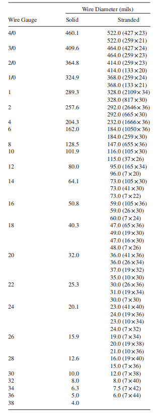

导线通常会包裹一层圆柱形电介质绝缘材料，通常其厚度约为导线半径。绝缘材料通常不是铁磁性的，其相对磁导率为 1。其相对介电常数如下：

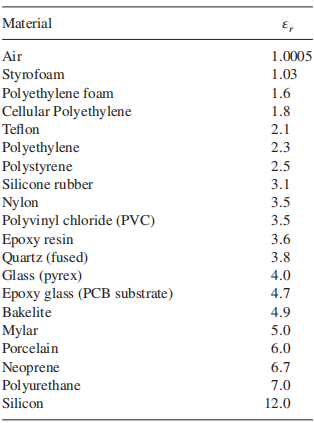

---

**导线的电阻：**

导线的电阻可以进行计算：
$$
R = \frac{L}{\sigma\pi r_w^2}
$$
随着频率升高，导线横截面上的电流由于趋肤效应，在靠近外部设备的地方更加密集。假设电流集中在表面的一个环形区域内，该区域的厚度定义为趋肤深度：
$$
\delta = \frac{1}{\sqrt{\pi f \mu_0 \sigma}}
$$
频率越高，趋肤深度越小。对于铜，其趋肤深度如下：

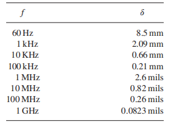

单位长度电阻为：
$$
r_{LF} = r_{DC} = \frac{1}{\sigma \pi r_w^2}
$$

$$
r_{HF} = \frac{1}{\sigma[\pi r_w^2-\pi(r_2-\delta)^2]}=\frac{1}{2\sigma\pi r_w\delta} = \frac{r_w}{2\delta}r_{DC} = \frac{1}{2r_w}\sqrt{\frac{\mu_0}{\pi \sigma}}\sqrt{f}
$$

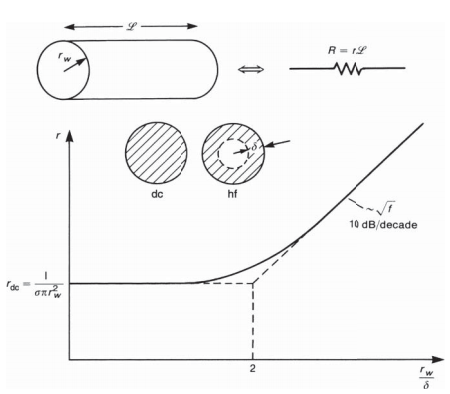

---

**导线的电感：**

导线的内电感由进入导线内部的磁通量产生，同时也受到趋肤效应影响。单位长度内自感为：
$$
l_{i,LF}=l_{i,DC} = \frac{\mu_0}{8\pi}
$$

$$
l_{i,HF} = \frac{2\delta}{r_w}l_{i,DC} = \frac{1}{4\pi r_w}\sqrt{\frac{\mu_0}{\pi\sigma}}\frac{1}{\sqrt{f}}
$$

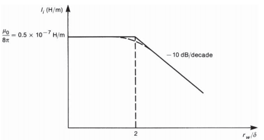

---

**平行导线外电感：**

常见的平行导线是具有相等半径 $r_w$，长度 $L$ 和距离 $s$ 的一对平行导线，一对导线的单位长度外电感为两条导线之间的单位长度磁通除以产生该磁通的电流，假设导线充分隔离 $s/r_w > 5$，此时电流均匀分布在导线周边，邻近效应可以忽略，此时：
$$
l_e \approx \frac{\mu_0}{\pi}ln(\frac{s}{r_w})
$$
总环路电感为两条导线的内电感和外电感之和：$L_{loop} = 2l_iL+l_eL$；

---

**平行导线电容：**

导线上的电荷会在两条导线之间产生电容，假设导线充分隔离 $s/r_w > 5$，此时电荷均匀分布在导线上，邻近效应可以忽略：
$$
c = \frac{\pi\epsilon_0}{ln(\frac{s}{r_w})}
$$

---

**平行导线的集中参数等效电路：**

当线长在电磁波范畴上很短：$L \ll \lambda$，可以集中这些分布参数得到集中参数等效电路：

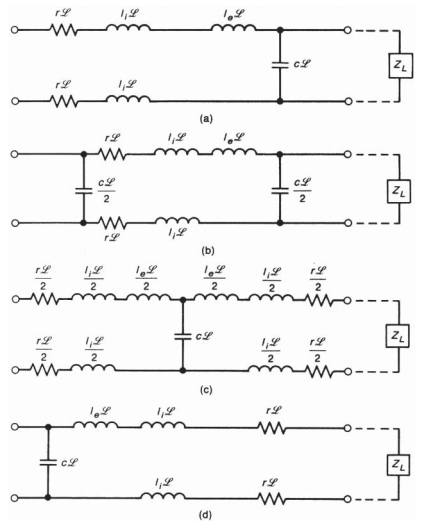

这些集中参数等效电路的精确程度随着导线末端的负载阻抗而存在差异。如果负载阻抗 $Z_L$ 为低阻抗：
$$
Z_C = \sqrt\frac{l_e}{c} = 120ln(\frac{s}{r_w})
$$
则 $T$ 型等效电路和 $\Gamma$ 型等效电路的精确度要高于反向 $\Gamma$ 型等效电路和 $\Pi$ 型等效电路。反之如果负载阻抗为高阻抗，则反向 $\Gamma$ 型等效电路和 $\Pi$ 型等效电路的精确度更高。

同时，对于典型的线径和线间距，外电感通常大于内电感，在高频时差异更大，因此通常忽略模型中的内电感。

对于电容，当考虑到导线周围的绝缘介质时，电容参数将受到影响，而且没有相应的解析表达式，通常使用数值方法。

## 2. 元件引线的寄生参数

元件引线会引入寄生电阻，寄生电容和寄生电感：

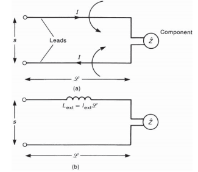

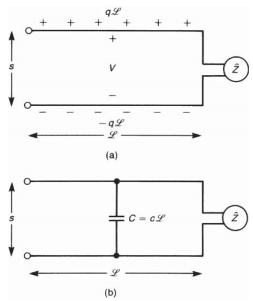

这些寄生参数可以等效为以下的集总参数模型：

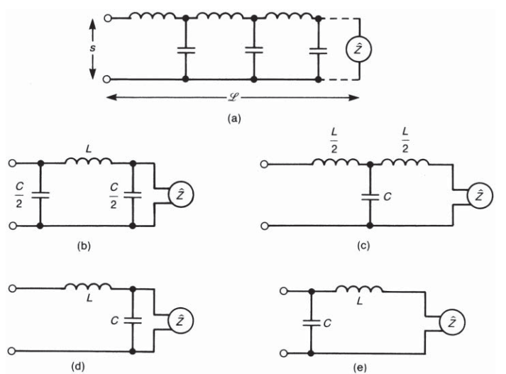

## 3. 电阻

电阻包括薄膜电阻，绕线电阻和碳纤维电阻。

理想电阻的频率响应如下：

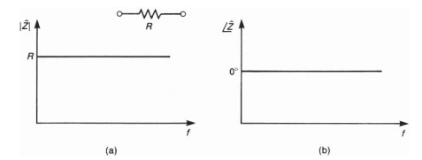

但是实际电阻器的特性并不是理想的。首先电阻引线会存在寄生电感（在绕线电阻中寄生电感更大）$L_{lead}$($nH$ 级)，同时由于电阻体可能存在电荷泄露，电阻两端存在一定的泄露电容 $C_{leakage}$($pF$ 级)。

电阻的等效电路和频率响应如下：
$$
H(j\omega) = L_{lead}\frac{\frac{1}{L_{lead}C_{par}}-\omega^2+\frac{j\omega}{RC_{par}}}{j\omega+\frac{1}{RC_{par}}}
$$

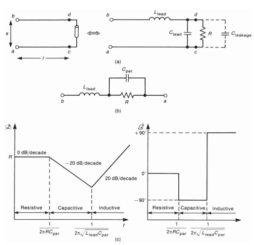

在不同频率下可以得到不同等效电路，事实上寄生电容的影响占据主导地位：

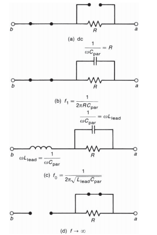

## 4. 电容

电容包括陶瓷电容和钽电解电容。钽电容电容值相对更大，一般用于抑制传导发射频带，同时用于大容量电荷存储；陶瓷电容电容相对更小，一般用于抑制辐射发射频带。

理想电容的频率特性如下：

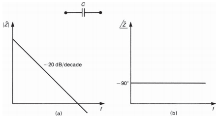

但是实际电容器的特性并不是理想的。电介质的损耗可以表示为一个并联电阻 $R_{diel}$（一般很大），平行板的电阻为 $R_{plate}$（小型陶瓷电容中值比较小，钽电容中值为 $Ω$ 级），称为等效串联电阻 ESR。电容的引线包含寄生电感 $L_{lead}$ 和寄生电容，通常寄生电容会远小于电容值。

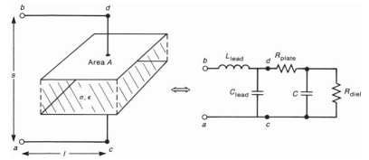

电容的等效电路和频率响应如下：
$$
H(j\omega) = L_{lead}\frac{\frac{1}{L_{lead}C}-\omega^2+j\omega\frac{R_{plate}}{L_{lead}}}{j\omega}
$$
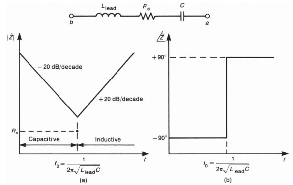

直流时电容表现为开路，随着频率增长，电容的阻抗占主导地位，并随着频率增高而减小。电感的阻抗逐渐增加直到 $f_0 = \frac{1}{2}\pi\sqrt{L_{lead}C}$ 时等于电容阻抗，此时电容呈现阻性；更高频时电感的阻抗占主导地位，而且随着频率增高而增加。$f_0$ 为自谐振频率。

如果需要依靠电容滤波高频噪声电流，通常需要使得抑制电流的频率小于电容的自谐振频率，不然得不到预期的滤波效果。

通常采用小电容抑制高频噪声，这是因为小电容的自谐振频率更大。同时，使用电容滤波时，负载阻抗也是必须考虑的一方面，只有在高阻抗电路中，并联电容的滤波才有效果。同时需要考虑电容对所需信号的影响。

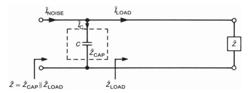

## 5. 电感

理想电感的频率特性如下：

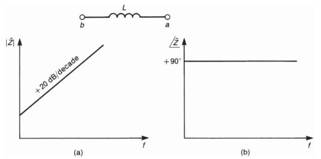

但是实际电感的特性并不是理想的。绕制电感的导线存在电阻，线圈之间存在电容。

电感的等效电路和频率响应如下：
$$
H(j\omega) = R_{par}\frac{1+j\omega\frac{L}{R_{par}}}{1-\omega^2LC_{par}+j\omega R_{par}C_{par}}
$$
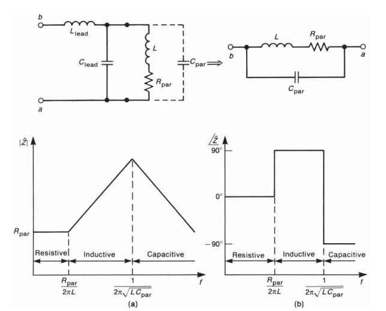

低频时电阻占主导地位，随着频率的增加，电感开始占据主导地位；在自谐振频率 $f_0 = \frac{1}{2}\pi\sqrt{LC_{par}}$ 以上，电容开始占据主导地位。

增加电感的值并不必然在高频时降低阻抗，因为有可能引入更大的电容导致自谐振频率的减小。串联电感滤波在低阻抗通路中更加有效。

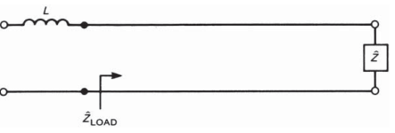

## 6. 铁磁材料 - 磁珠/共模电感(扼流圈)

### 铁磁材料性能

为了增大电感的电感值，通常将线圈绕制在铁磁磁芯上，铁磁材料具有较高的相对磁导率。

铁磁材料具有饱和特性，假设绕在铁磁材料上的线圈通入的电流为 $I$，该电流产生磁场强度 $H$，随后在磁芯中产生磁通密度 $B$：

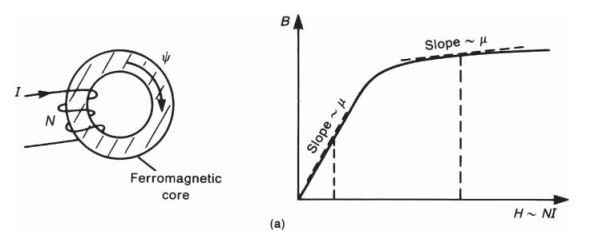

电流增大时，铁磁材料的磁导率减小，这导致电感减小（饱和）。

一部分磁通将会泄露，泄露的多少取决于材料的磁导率，高磁导率的铁芯磁通泄露会更少。

不同的磁芯会有不同的频率响应，应根据具体应用场景（抑制传导发射或抑制辐射发射）来选择合适的磁芯。

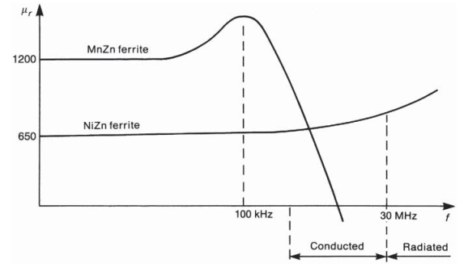

### 铁氧体磁珠

铁氧体材料本质上是不导电的陶瓷材料。它们与其他铁磁材料的不同之处在于：在很高的频率范围内，其涡流损耗都很低。可以利用铁氧体材料选择性地衰减从 EMC 角度希望抑制的高频信号，同时不影响功能信号中较重要的低频分量。

磁珠是一个常见的 EMC 器件。铁氧体材料包覆在导线周围，使其外观类似于普通电阻器，可以提供较高的高频阻抗。

磁珠内部流过导线的电流会产生沿圆周方向的磁通，该磁通穿过磁珠材料，并产生内电感，内电感和磁导率成正比：

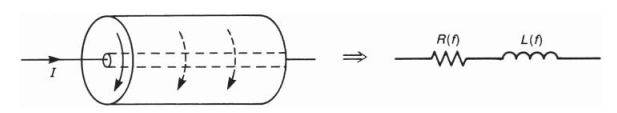
$$
L_{bead} = \mu_0\mu_r K 
$$
$K$ 由磁珠尺寸决定。磁珠材料可以用复相对磁导率表示：
$$
\mu_r = \mu_r' - j\mu_{r}''
$$
实部 ($\mu_r'$) 与磁珠材料中储存的磁能有关，虚部 ($\mu_r''$) 则与磁珠材料中的损耗有关。二者都是频率的函数。磁珠的等效电路由一个随频率变化的电阻和一个与其串联、同样随频率变化的电感构成。典型铁氧体磁珠在大约 100 MHz 以上时，可以产生超过 100Ω 的阻抗。

> 由于磁珠的阻抗在其有效频段内是有限的，所以它们通常用在电源等低阻抗电路中。
>
> 磁珠也可以用于构成有损滤波器。例如，将磁珠串联在一根导线上，并在两根导线之间接入一个电容，就构成了一个二阶低通滤波器。串联磁珠还可以抑制上升时间很短的高速电路中产生的振铃。

### 共模扼流圈

---

**共模和差模电流：**

一对平行导体流过电流 $I_1$ 和 $I_2$，可以将这两个电流分解为共模电流和差模电流：
$$
I_1 = I_C + I_D \\
I_2 = I_C - I_D
$$
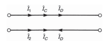

两根导线中的差模电流大小相等、方向相反。这些是电路正常工作所需要的功能电流。两根导线中的共模电流大小相等、方向相同。理论上并不希望共模电流存在，但实际系统中总会出现共模电流。标准集总电路理论无法预测这些共模电流，因此常被称为天线模电流。

差模电流方向相反，所产生的电场方向也相反。但是因为两根导体并不位于同一位置，所以两个电场不能完全抵消，只能相减后留下一个较小的净辐射电场。共模电流方向相同，产生的辐射场会相互叠加，共模电流对总辐射场的贡献远大于差模电流。

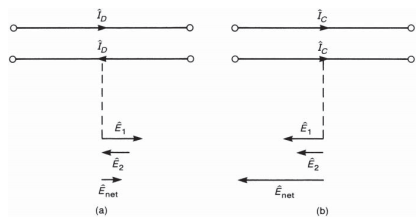

---

**共模扼流圈：**

将一对导线绕到铁磁磁芯上，两根导线采用相同的绕法，注意绕制方向，假设两个绕组的自感为 $L_1 = L_2 = L$；如果两个绕组完全对称，并且所有磁通都限制在磁芯内，也就是说一个绕组的磁通与另一个绕组完全交链，则还有 $L = M$；

其中一个绕组的阻抗为 $Z_1 = \frac{j\omega LI_1+j\omega MI_2}{I_1}$；对于共模电流，$Z_{CM} = j\omega(L+M)$；对于差模电流，$Z_{DM} = j\omega(L-M) = 0$；

在理想情况下，共模扼流圈不会影响差模电流，会在共模电流路径中引入电感。同时共模通路中还会引入随着频率变化的电阻，在高频下，该电阻分量会占据主导地位。因此，共模电流不仅会受到阻碍，其能量还会消耗在电阻中。共模扼流圈既能阻断共模电流，也能耗散其能量。

共模扼流圈的存在在理想情况下不会影响功能信号，而功能信号也不会影响共模扼流圈的性能。

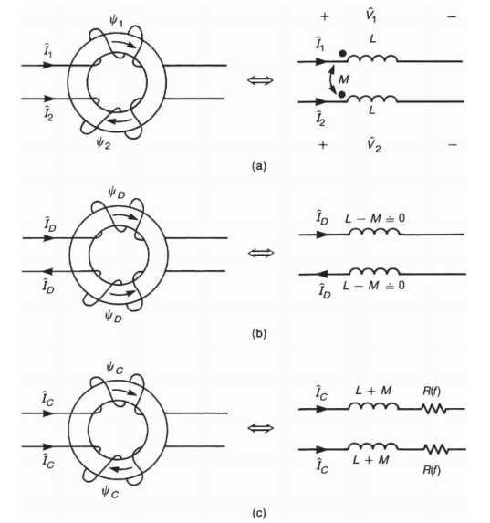

共模扼流圈存在寄生参数，一般的是寄生电容，该电容会旁路磁芯，从而降低共模扼流圈的抑制效果。

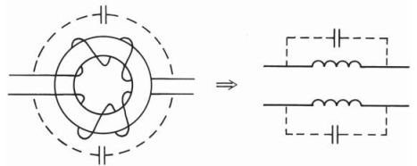