# 串扰

串扰本质上是指同一设备中导线与 PCB 走线之间非预期的电磁耦合。串扰与天线耦合的区别在于：前者属于近场耦合问题，而后者属于远场耦合问题。

PCB 上导体之间的串扰会影响产品内部的抗扰性能，即电磁发射源与发射的接收端位于同一个系统之中。因此，这反映了产品的抗扰性能，而不是产品对外部环境的抗扰性能。

串扰也会影响产品的辐射发射和/或传导发射。假设产品内部的一条带状电缆靠近连接到外设电缆的两根导线，而该外设电缆从产品中引出。内部带状电缆上的串扰可能会在外设电缆上感应出信号，使其向产品外部辐射，从而导致产品无法满足辐射发射法规限值。如果产品的交流电源线靠近产品内部的导线，耦合到电源线上的信号也可能导致产品无法满足传导发射法规要求。串扰还可能影响某个产品对另一产品发射的抗扰能力。例如，产品对外部电缆耦合进来的干扰信号具有一定的抗扰能力，但该电缆可能在产品内部与另一条电缆发生耦合，使干扰信号的敏感性进一步增强。

通常通过多导体传输线理论分析串扰问题。

## 1. 三导体传输线

三导体传输线的电路图如下：

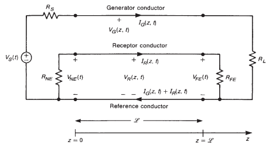

源端由源阻抗 $R_S$ 和源电压 $U_S(t)$ 构成，通过电源线和参考地线和负载 $R_L$ 相连。受扰线通过两个电阻和参考地线相连，分别为近端电阻 $R_{NE}$ 和远端电阻 $R_{FE}$ (表示从受扰线电路两端看到的输入电阻)。传输线的各根导体均与 $z$ 轴平行，并且沿线具有均匀的横截面。假设周围介质沿传输线轴向均匀。源电路由电源线和参考地线组成，电源线的电流为 $I_G(z,t)$，两端电压为 $U_G(z,t)$。源电路中的电压和电流会产生电磁场，并在受扰线和参考地线构成的受扰回路中感应出电压 $U_R(z,t)$ 和电流 $I_R(z,t)$。感应电压和感应电流会在近端和远端产生电压 $U_{NE}(t)$，$U_{FE}(t)$；

典型的三导体传输线如下：

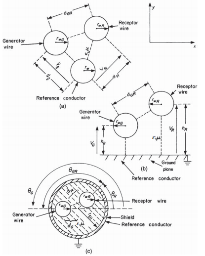

PCB 中的三导体传输线存在非均匀介质：

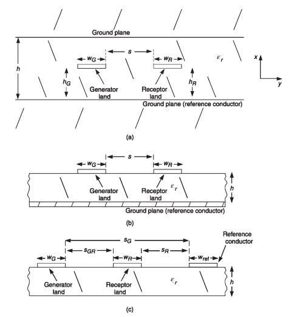

分析三导体传输线时，采用的假设时：线路上只存在横电磁波(TEM)，TEM 场结构要求电场和磁场矢量都位于和线路 $z$ 轴垂直的横向 $xy$ 平面内，不存在线路轴向分量。此时线路的电压，电流可以得到唯一解。同时，电流流经电源线和受扰线，并通过参考地返回。TEM 场结构与静态直流场结构完全相同，因此可以通过横向 $xy$ 平面的分析方法确定单位长度的电感和电容。

当线路导体不是理想导体，介质不均匀时，TEM 场结构是不理想的。不过对于良导体，典型的线路横截面尺寸和较低的频率，实际场结构和 TEM 场结构差异很小，称为准 TEM 场结构。

### 传输线方程

传输线损耗主要包含导体的损耗和周围介质中的损耗，为了简化分析，通常忽略掉这些损耗以近似求解串扰。

三导体传输线的单位长度等效电路如下：

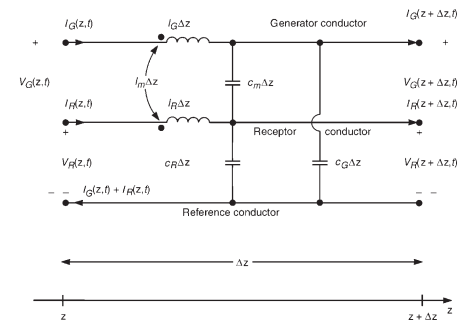

线路电流会产生穿过由导体和参考导体围成回路的磁通，用电感表示相应磁通对线路产生的作用。电源回路和受扰回路有单位长度自感 $l_G$ 和 $l_R$，两个回路之间有单位长度互感 $l_m$；线路导体与参考导体之间的电压会产生电荷，并在每对导体之间形成电场，用电容表示电场的作用，电源线和参考地线，受扰线和参考地线之间的单位长度电容为 $c_G$ 和 $c_R$，电源线和受扰线之间的电容为 $c_m$。

三导体传输线的传输线方程：
$$
\frac{\partial U_G(z,t)}{\partial z}=-l_G\frac{\partial I_G(z,t)}{\partial t}-l_m\frac{\partial I_R(z,t)}{\partial t} \\

\frac{\partial U_R(z,t)}{\partial z}=-l_m\frac{\partial I_G(z,t)}{\partial t}-l_R\frac{\partial I_R(z,t)}{\partial t} \\

\frac{\partial I_G(z,t)}{\partial z}=-\left(c_G+c_m\right)\frac{\partial U_G(z,t)}{\partial t}+c_m\frac{\partial U_R(z,t)}{\partial t} \\

\frac{\partial I_R(z,t)}{\partial z}=c_m\frac{\partial U_G(z,t)}{\partial t}-\left(c_R+c_m\right)\frac{\partial U_R(z,t)}{\partial t}
$$
可以写成矩阵形式：
$$
\frac{\partial}{\partial z}\mathbf U(z,t)=-\mathbf L\frac{\partial}{\partial t}\mathbf I(z,t) \\

\frac{\partial}{\partial z}\mathbf I(z,t)=-\mathbf C\frac{\partial}{\partial t}\mathbf U(z,t)\\
$$
其中 $\mathbf L= \begin{bmatrix} l_G & l_m\\ l_m & l_R \end{bmatrix}$，$\mathbf C= \begin{bmatrix} c_G+c_m & -c_m\\ -c_m & c_R+c_m \end{bmatrix}$，$\mathbf U(z,t)= \begin{bmatrix} U_G(z,t)\\ U_R(z,t) \end{bmatrix}$，$\mathbf I(z,t)= \begin{bmatrix} I_G(z,t)\\ I_R(z,t) \end{bmatrix}$；

### 单位长度参数

---

**均匀和非均匀介质：**

对于三导体传输线，可以忽略介质绝缘层，将导线视为裸线（在宽间距条件下绝缘层对电容的影响很小），假设所有的导体都在具有介电常数 $\epsilon$ 和磁导率 $\mu$ 的均匀介质中。对于 PCB 结构的三导体传输线，其介质是不均匀的，单位长度的电容和电感的解析解尚未得到。

在均匀介质中，单位长度电感和单位长度电容有以下关系：
$$
\mathbf L\mathbf C=\mathbf C\mathbf L=\mu\varepsilon\mathbf E_2
$$
因此只需要确定其中一个参数矩阵，就可以求得另一个参数矩阵($v=\frac{1}{\sqrt{\mu\varepsilon}}$)：
$$
\begin{bmatrix}
c_G+c_m&-c_m\\
-c_m&c_R+c_m
\end{bmatrix}
=
\frac{1}{v^2\left(l_Gl_R-l_m^2\right)}
\begin{bmatrix}
l_R&-l_m\\
-l_m&l_G
\end{bmatrix}
$$
对于非均匀介质中的传输线，介质的非均匀性不会影响单位长度电感，如果将移除介质并用自由空间取代后得到的单位长度电容矩阵记为 $\mathbf C_0$，则 $\mathbf L = \mu_0\varepsilon_0\mathbf C_0^{-1}$。对于非均匀介质，需要分别确定存在介质时和移除介质时的单位长度电容矩阵，通常由数值方法求出。

---

**宽间距条件：**

宽间距条件指：导线的间距足够大，使得导线圆周上的电荷和电流分布基本均匀，此时可以得到均匀介质中传输线的单位长度参数。

> - 载流导线产生的磁通：
>   $$
>   \psi=\frac{\mu_0 I}{2\pi}\ln\left(\frac{R_2}{R_1}\right)
>   $$
>   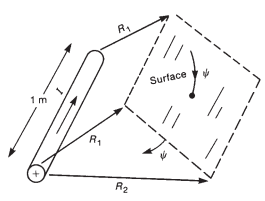
>
> - 载荷导线产生的电压：
>   $$
>   U=\frac{q}{2\pi\varepsilon_0}\ln\left(\frac{R_2}{R_1}\right)
>   $$
>   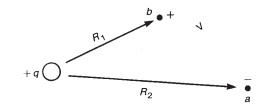

1. 三导线结构(a)：
   $$
   \begin{bmatrix}
   \psi_G\\
   \psi_R
   \end{bmatrix}
   =
   \begin{bmatrix}
   l_G&l_m\\
   l_m&l_R
   \end{bmatrix}
   \begin{bmatrix}
   I_G\\
   I_R
   \end{bmatrix}
   $$
   求单位长度电感时，可以在一根导体上施加电流，并使该电流经参考导体返回；同时令另一回路的电流为零，再确定穿过相应回路的磁通。

   电源回路自感：
   $$
   \begin{aligned}
   l_G
   &=\frac{\mu_0}{2\pi}
   \ln\left(\frac{d_G^2}{r_{wG}r_{w0}}\right)
   \end{aligned} \\
   
   $$
   受扰回路自感：
   $$
   l_R=\frac{\mu_0}{2\pi}
   \ln\left(\frac{d_R^2}{r_{wR}r_{w0}}\right)
   $$
   单位长度互感：
   $$
   \begin{aligned}
   l_m
   &=\frac{\mu_0}{2\pi}
   \ln\left(\frac{d_Gd_R}{d_{GR}r_{w0}}\right)
   \end{aligned}
   $$
   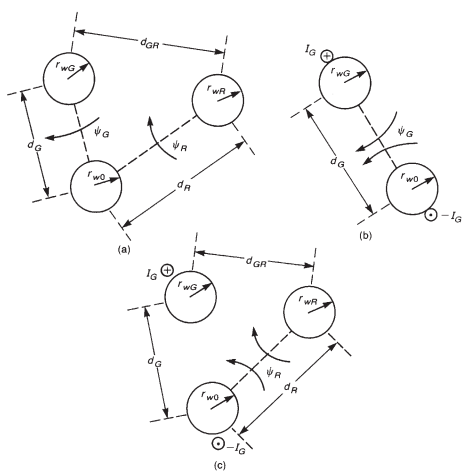
   $$
   \begin{bmatrix}
   q_G\\
   q_R
   \end{bmatrix}
   =
   \begin{bmatrix}
   c_G+c_m&-c_m\\
   -c_m&c_R+c_m
   \end{bmatrix}
   \begin{bmatrix}
   U_G\\
   U_R
   \end{bmatrix}
   $$
   令电位矩阵 $\mathbf P = \mathbf C^{-1}$，则：
   $$
   \begin{aligned}
   p_G
   &=\frac{1}{2\pi\varepsilon_0}
   \ln\left(\frac{d_G^2}{r_{wG}r_{w0}}\right)
   \end{aligned}
   $$
   
   $$
   p_R=\frac{1}{2\pi\varepsilon_0}
   \ln\left(\frac{d_R^2}{r_{wR}r_{w0}}\right)
   $$
   
   $$
   \begin{aligned}
   p_m
   &=\frac{1}{2\pi\varepsilon_0}
   \ln\left(\frac{d_Gd_R}{d_{GR}r_{w0}}\right)
   \end{aligned}
   $$
   
   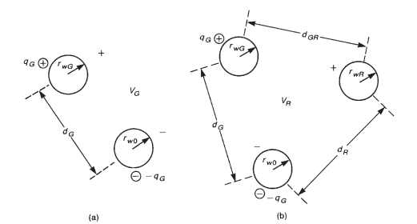

2. 接地平面上方的导线(b)

   使用电像法可得：
   $$
   \begin{aligned}
   l_G
   &=\frac{\mu_0}{2\pi}\ln\left(\frac{2h_G}{r_{wG}}\right)
   \end{aligned}
   $$

   $$
   l_R=\frac{\mu_0}{2\pi}
   \ln\left(\frac{2h_R}{r_{wR}}\right)
   $$

   $$
   \begin{aligned}
   l_m
   &=\frac{\mu_0}{2\pi}\ln\left(\frac{s_2}{s}\right)\\
   &=\frac{\mu_0}{4\pi}
   \ln\left(1+\frac{4h_Gh_R}{s^2}\right)
   \end{aligned}
   $$

   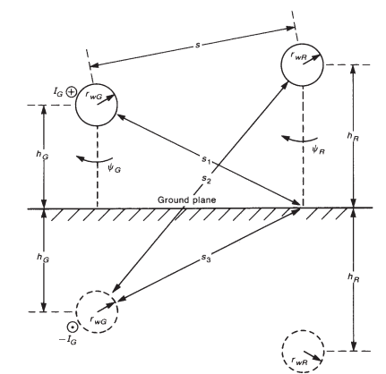

3. 圆柱形屏蔽层的双导线(c)

   使用电像法可得：
   $$
   l_G=\frac{\mu_0}{2\pi}
   \ln\left(
   \frac{r_{SH}^2-d_G^2}
   {r_{SH}r_{wG}}
   \right)
   $$

   $$
   l_R=\frac{\mu_0}{2\pi}
   \ln\left(
   \frac{r_{SH}^2-d_R^2}
   {r_{SH}r_{wR}}
   \right)
   $$

   $$
   l_m=
   \frac{\mu_0}{2\pi}
   \ln\left[
   \frac{d_R}{r_{SH}}
   \sqrt{
   \frac{
   (d_Gd_R)^2+r_{SH}^4
   -2d_Gd_Rr_{SH}^2\cos\theta_{GR}
   }{
   (d_Gd_R)^2+d_R^4
   -2d_Gd_R^3\cos\theta_{GR}
   }
   }
   \right]
   $$

   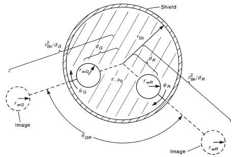

对于不满足宽间距条件（存在邻近效应），一般采用数值方法（矩量法）进行计算，此处略。

### 感性耦合-容性耦合近似模型

一般的，求解耦合多导体传输线方程十分困难。一般通过矩阵变换进行解耦，此处略。对于均匀介质的三导体无损传输线，可以得到解析解，但是该解不适用于非均匀介质。

通常假定线路之间是**弱耦合**的，通常电源回路中的电流和电压会通过互感 $l_m$ 和互电容 $c_m$，在受扰回路中感应出电压和电流。这些感应出的电压和电流又会反过来影响电源回路。弱耦合假设**感应是单向的，只从电源回路传递到受扰回路**。

此时传输线方程中，电源回路的耦合项可以忽略：
$$
\frac{\partial U_G(z,t)}{\partial z}
+l_G\frac{\partial I_G(z,t)}{\partial t}=0 \\

\frac{\partial I_G(z,t)}{\partial z}
+(c_G+c_m)\frac{\partial U_G(z,t)}{\partial t}=0 \\
$$

$$
\frac{\partial U_R(z,t)}{\partial z}
+l_R\frac{\partial I_R(z,t)}{\partial t}
=-l_m\frac{\partial I_G(z,t)}{\partial t} \\

\frac{\partial I_R(z,t)}{\partial z}
+(c_R+c_m)\frac{\partial U_R(z,t)}{\partial t}
=c_m\frac{\partial U_G(z,t)}{\partial t}
$$

因此可以先求解电源回路的电压和电流，求得电源回路的电压和电流后，再通过互感和互电容，将它们产生的感应源加入受扰回路。

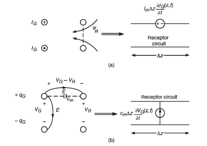

感应源包括两项：$-l_m\frac{\partial I_G(z,t)}{\partial t}$ 和 $c_m\frac{\partial V_G(z,t)}{\partial t}$。

> 受扰回路中的磁通变化时，产生单位长度电压源：
> $$
> U_{S1}=l_R\frac{\partial I_R}{\partial t} \\
> 
> U_{S2}=l_m\frac{\partial I_G}{\partial t}
> $$
> 电压源 $U_{S1}$ 来自受扰回路自感，$U_{S2}$ 来自于电源回路的磁场耦合，称为电感耦合。
>
> 回路上的电荷和电压之间有对应关系，受扰回路上感应的单位长度电荷为：$\begin{aligned} q_R &=(c_R+c_m)V_R-c_mV_G=c_RV_R-c_m(V_G-V_R) \end{aligned}$，电流是电荷对时间的微分，因此受扰回路会产生两个单位长度电流源：
> $$
> I_{S1}=(c_R+c_m)\frac{\partial V_R}{\partial t} \\
> I_{S2}=-c_m\frac{\partial V_G}{\partial t}
> $$
> 电流源 $I_{S1}$ 来自受扰回路自身电容，$I_{S2}$ 来自于电源回路的电场耦合，称为电容耦合。

将分布参数乘以长度 $L$ 可以得到集中参数等效，因此受扰回路等效电路如下：

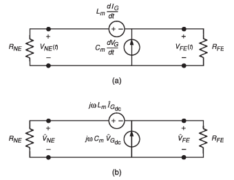

---

**频域响应：**

假设 $U_S(t)$ 为正弦信号，在电短线路条件（频率比较低）时，电源回路的电压和电流近似为直流驱动下的电压和电流：
$$
\hat I_{G\mathrm{dc}}
\cong
\frac{1}{R_S+R_L}\hat U_S \\

\hat V_{G\mathrm{dc}}
\cong
\frac{R_L}{R_S+R_L}\hat U_S
$$
通过叠加原理，可以得到近端和远端的串扰电压：
$$
\hat U_{NE}
=
\frac{R_{NE}}{R_{NE}+R_{FE}}
j\omega L_m\hat I_{G\mathrm{dc}}
+
\frac{R_{NE}R_{FE}}{R_{NE}+R_{FE}}
j\omega C_m\hat U_{G\mathrm{dc}} \\
\hat U_{FE}
=
-\frac{R_{FE}}{R_{NE}+R_{FE}}
j\omega L_m\hat I_{G\mathrm{dc}}
+
\frac{R_{NE}R_{FE}}{R_{NE}+R_{FE}}
j\omega C_m\hat U_{G\mathrm{dc}} \\
$$
第一项为电感耦合，第二项为电容耦合。

> 对于近端串扰，如果 $\frac{L_m}{C_m}>R_{FE}R_L$，则电感耦合强于电容耦合。
>
> 对于远端串扰，如果 $\frac{L_m}{C_m}>R_{NE}R_L$，则电感耦合强于电容耦合。
>
> 近端的电感耦合和电容耦合是抵消的，远端的电感耦合和电容耦合是叠加的。

定义另一个回路存在时的特性阻抗为：
$$
Z_{CG}
=
\sqrt{\frac{l_G}{c_G+c_m}} \\
Z_{CR}
=
\sqrt{\frac{l_R}{c_R+c_m}}
$$
对于相对于线路特性阻抗而言较低的终端阻抗，电感耦合通常占主导；对于较高的终端阻抗，电容耦合通常占主导。电感耦合和电容耦合的贡献都与激励频率成正比。根据负载阻抗不同，这种频率响应可能几乎完全由电感耦合或电容耦合中的某一种造成。

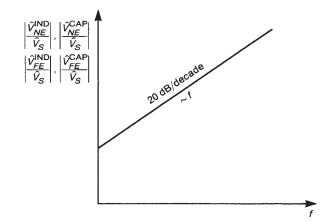

计入损耗时，较低频率下会引入公共阻抗耦合：

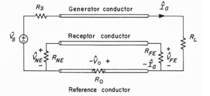

通常参考地线的电阻远小于负载电阻，因此电源导体的大部分电流经过参考地线返回，并产生电压 $U_0$。可以认为参考地线上的电压降为：
$$
\hat U_0
=
R_0\hat I_G
=
\frac{R_0}{R_S+R_L}\hat U_S
$$
该电压会直接影响受扰回路，在低频区域形成一个与频率无关的最小串扰。总耦合是电感耦合，电容耦合和公共阻抗耦合之和。

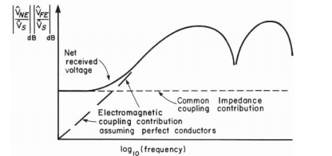

---

**时域响应：**

将频域响应的 $j\omega$ 替换为时域微分算子 $\frac{d}{dt}$ 即可。

对于脉冲电压造成的串扰，由于脉冲信号的频率分量丰富，所以分析时需要考虑高频量的影响。一般的，上升时间和下降时间满足 $\tau_r,\tau_f>10T_D$ 时，可以使用上述等效电路进行处理。

## 2. 屏蔽线

加入屏蔽线会降低传输线的串扰。

### 单位长度参数

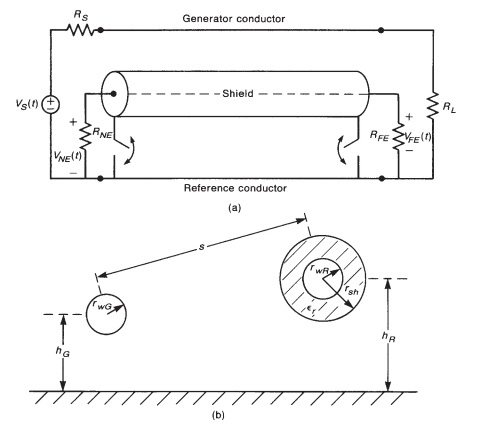

假设使用无限大接地平面作为参考地平面。

---

**单位长度电阻：**

屏蔽层的单位长度电阻 $r_S$ 取决于其制造方式，对于编织屏蔽层，可以先计算一根编织丝的电阻，再将所有编织丝视为并联，可以得到：
$$
r_S=\frac{r_b}{BW\cos\theta_w}
$$
$r_b$ 是一根编织丝的单位长度电阻；$\theta_w$ 是编织角；$B$ 是编织束的数量；$W$ 是每束中的编织丝数量。

扁平同轴电缆等使用的实心屏蔽层，可按照趋肤效应充分形成的实心导体计算，假定屏蔽电流均匀分布在屏蔽层横截面上，使屏蔽层电阻等于其直流值：
$$
r_S=\frac{1}{\sigma 2\pi r_{sh}t_{sh}}
$$
$r_{sh}$ 是屏蔽层内半径，$t_{sh}$ 是屏蔽层厚度。

---

**单位长度电感：**

计算自感时，在相应导线或屏蔽层上施加电流，使其通过镜像导体返回，再计算穿过该导线与接地平面所组成回路的磁通。

电源回路的自感为：
$$
l_G=\frac{\mu_0}{2\pi}
\ln\left(\frac{2h_G}{r_{wG}}\right)
$$
屏蔽层－接地平面回路的自感可以将屏蔽层视为接地平面上方的一根粗导线计算：
$$
l_S=\frac{\mu_0}{2\pi}
\ln\left(\frac{2h_R}{r_{sh}+t_{sh}}\right)
$$
受扰回路的自感为：
$$
l_R=\frac{\mu_0}{2\pi}
\ln\left(\frac{2h_R}{r_{wR}}\right)
$$
电源线和屏蔽层之间的互感以及电源线和受扰线之间的互感相等（假设间距足够大）：
$$
l_{GS}
=
\frac{\mu_0}{4\pi}
\ln\left(1+\frac{4h_Gh_R}{s^2}\right)
=
l_{GR}
$$
**屏蔽层和受扰线之间的互感，考虑到屏蔽层通入电流时层内部无磁场，所以互感值等于屏蔽层－接地平面回路的自感**：
$$
l_{RS}
=
\frac{\mu_0}{2\pi}
\ln\left(\frac{2h_R}{r_{sh}+t_{sh}}\right)
=
l_S
$$

---

**单位长度电容：**

单位长度电容可以利用电感矩阵和电容矩阵之间的互易关系求得。屏蔽层内部介质可以满足 $\epsilon_r\ne1$，而屏蔽层外部介质可合理地假定为自由空间，并忽略发生器导线和屏蔽层外的介质绝缘层。

屏蔽层和受扰线之间的电容是同轴电缆间的电容：
$$
c_{RS}
=
\frac{2\pi\varepsilon_0\varepsilon_r}
{\ln(r_{sh}/r_{wR})}
$$
其他电容可以只考虑发生器导线与屏蔽层，并利用均匀介质中电感与电容矩阵的互易关系求得：
$$
\begin{bmatrix}
c_G+c_{GS}&-c_{GS}\\
-c_{GS}&c_S+c_{GS}
\end{bmatrix}
=
\mu_0\varepsilon_0
\begin{bmatrix}
l_G&l_{GS}\\
l_{GS}&l_S
\end{bmatrix}^{-1}
$$
屏蔽层的存在消除了一些自电容和互电容。屏蔽层相当于法拉第笼：屏蔽层外部的电场线终止于屏蔽层，不能终止在屏蔽层内部的导体上。因此，**电源回路和受扰回路之间的电容为 0**：
$$
c_{GR}=0
$$
**受扰回路相对于参考导体的电容为 0**：
$$
c_R=0
$$
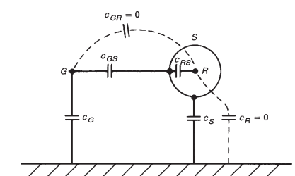

### 感性耦合-容性耦合

---

**容性耦合：**

保留电源回路、屏蔽回路和受扰回路之间的互电容，忽略自电容 $c_G$ 和 $c_S$。

根据分压关系，容性耦合电压为：

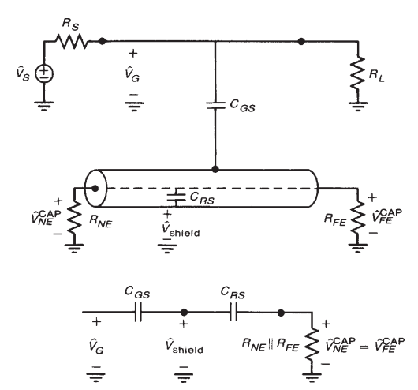
$$
\hat U_{NE}^{CAP}
=
\hat U_{FE}^{CAP}
=
\frac{j\omega R(C_{RS}\parallel C_{GS})}
{1+j\omega R(C_{RS}\parallel C_{GS})}
\hat U_G
$$
频率较低时，可以近似为：
$$
\hat U_{NE}^{CAP}
=
\hat U_{FE}^{CAP}
=
j\omega
\frac{R_{NE}R_{FE}}{R_{NE}+R_{FE}}
\frac{C_{RS}C_{GS}}{C_{RS}+C_{GS}}
\hat U_{G\mathrm{dc}}
$$
此时与两根未屏蔽导线之间的电容耦合相同，没有屏蔽效果。一般的 $C_{RS}\gg C_{GS}$，所以**屏蔽层悬空，电容耦合与未屏蔽时基本相同**。

通常将屏蔽层的一端或两端连接到参考导体，即接地。**如果屏蔽层任意一端连接到参考导体，屏蔽层电压就会降为零，电容耦合分量随之消失，这是因为电源回路的电场线终止于屏蔽层，而不是终止于受扰导线**。

不过要消除电容耦合，必须满足 $\hat U_{\mathrm{shield}}=0$。**对于电短线路，只要将屏蔽层任意一端接地，整个屏蔽层上的电压就近似为零。随着线路电长度增加，为了维持这一近似，需要沿屏蔽层以大约 $\lambda/10$ 的间距设置多个接地点**。

---

**感性耦合：**

电源导线电流 $\hat I_G$ 会在屏蔽层－接地平面回路中产生磁通 $\psi_G$。根据法拉第定律，该磁通会在屏蔽回路中感应出电动势，使感应电流 $\hat I_S$ 沿屏蔽层返回。**感应屏蔽电流产生的磁通倾向于抵消发生器导线电流产生的磁通。屏蔽导线正是通过这一过程消除感性耦合**。如果屏蔽层没有两端接地，就不存在允许电流 $\hat I_S$ 沿屏蔽层返回的闭合路径，也就不能产生用于抵消发生器回路磁通的反向磁通。因此，屏蔽层没有两端接地时，无法消除电感耦合。

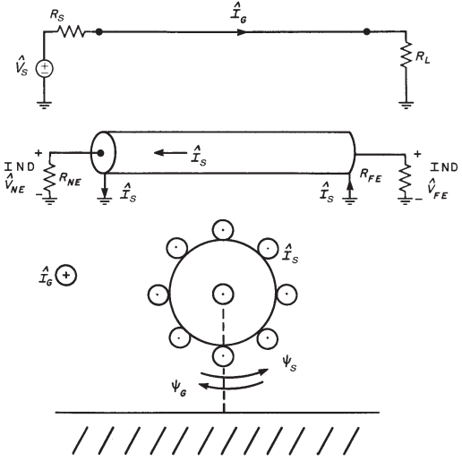

电源回路中的电流产生两个感应源：在受扰导线－接地平面回路中产生 $j\omega L_{GR}\hat I_G$，在屏蔽层－接地平面回路中产生 $j\omega L_{GS}\hat I_G$，屏蔽层电流为：
$$
\hat I_S
=
\frac{j\omega L_{GS}}
{R_{SH}+j\omega L_{SH}}
\hat I_G
$$
屏蔽电流又会在接收器导线－接地平面回路中产生感应源：$j\omega L_{RS}\hat I_S$，感性耦合串扰电压为：
$$
\hat U_{NE}^{IND}
=
\frac{R_{NE}}{R_{FE}+R_{NE}}
j\omega
\left(
L_{GR}\hat I_G-L_{RS}\hat I_S
\right)
$$
利用 $L_{GR}=L_{GS}$，$L_{RS}=L_{SH}$，得到：
$$
\hat U_{NE}^{IND}
=
\frac{R_{NE}}{R_{FE}+R_{NE}}
j\omega L_{GR}\hat I_G
\frac{R_{SH}}{R_{SH}+j\omega L_{SH}} \\

\hat U_{FE}^{IND}
=
-\frac{R_{FE}}{R_{FE}+R_{NE}}
j\omega L_{GR}\hat I_G
\frac{R_{SH}}{R_{SH}+j\omega L_{SH}}
$$
结果相当于移除屏蔽层时的串扰结果乘以屏蔽因子：
$$
\alpha_{SF}= \frac{1}{1+j\frac{f}{f_{SH}}}
$$
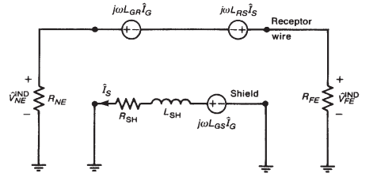

感性耦合的频率响应如下：

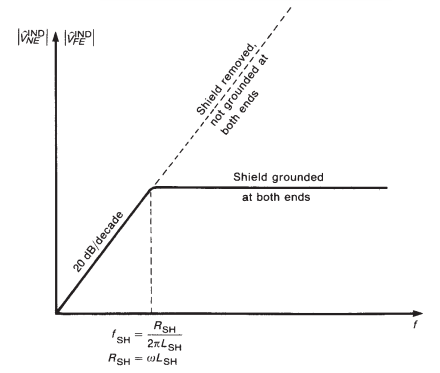

> 当 $f<f_{SH}$ 时，发生器电流通过接地平面形成最低阻抗的返回路径，因此该电流产生的磁通穿过整个接收器回路。
>
> 当 $f>f_{SH}$ 时，沿屏蔽层返回的路径比通过接地平面返回的路径阻抗更低，因此大部分电流沿屏蔽层返回。

当电源线也加入屏蔽层时，串扰需要乘以电源屏蔽层的屏蔽因子和受扰屏蔽层的屏蔽因子，实际上是二者效果的叠加。

---

**尾线的影响：**

尾线不会完全消除屏蔽层的作用，只会使实际效果低于理想值。

## 3. 双绞线

**如果用一对双绞线代替接收器导线，并以双绞线中的一根导线作为接收器回路的返回导线，则绞合结构本身就能降低感性耦合。只有当双绞线两端的终端相对于参考导体保持平衡时，双绞线才能降低容性耦合**。

双绞线是一种双线螺旋结构，建模时将其近似为一系列极性交替的回路：

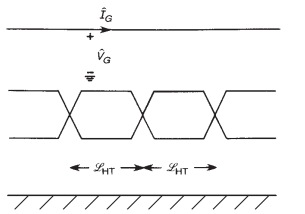

双绞线降低电感耦合或磁场耦合的基本原理如下：**电源导线电流产生的磁通穿过双绞线的各个回路，并在每个回路中感应出电动势。由于相邻回路的极性相反，其感应电动势倾向于相互抵消。因此受扰回路，也就是双绞线中剩余的净感应电动势最多相当于半个绞距产生的电动势**，将一个回路称为一个半绞距，长度为 $L_{HT}$。

将每个回路视为一段平行导线传输线。分别计算电源回路与双绞线中每根导线和参考地组成的回路之间的互感，得到单位长度互感 $l_{m1}$ 和 $l_{m2}$，以及单位长度互电容 $c_{m1}$ 和 $c_{m2}$。这些互参数的作用仍表示为电压源和电流源，其数值取决于相应半绞距长度上的互参数以及发生器回路的电流或电压。

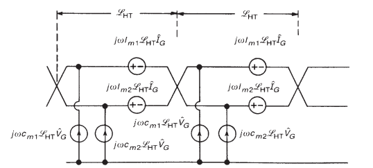

### 单位长度参数

---

**单位长度互感：**

考虑接地平面上方的一根发生器导线和一对双绞线，接地平面为参考导体。将双绞线中的每根导线与接地平面分别视为一个回路，可得：
$$
l_{m1}
=
\frac{\mu_0}{4\pi}
\ln\left[
1+
\frac{4h(h+\Delta h)}
{d^2+\Delta h^2}
\right] \\
l_{m2}
=
\frac{\mu_0}{4\pi}
\ln\left[
1+
\frac{4h(h-\Delta h)}
{d^2+\Delta h^2}
\right]
$$
各个线的自感为：
$$
l_G
=
\frac{\mu_0}{2\pi}
\ln\left(\frac{2h}{r_w}\right) \\

l_{R1}
=
\frac{\mu_0}{2\pi}
\ln\left[\frac{2(h+\Delta h)}{r_w}\right] \\

l_{R2}
=
\frac{\mu_0}{2\pi}
\ln\left[\frac{2(h-\Delta h)}{r_w}\right]
$$
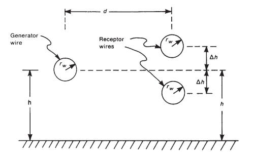

双绞线间互感为：
$$
\begin{aligned}
l_{R1R2}
&=
\frac{\mu_0}{2\pi}
\ln\left(\frac{h}{\Delta h}\right)
\end{aligned}
$$

---

**单位长度电容：**

忽略导线的绝缘介质，根据互易关系：
$$
\begin{bmatrix}
c_G+c_{m1}+c_{m2}&-c_{m1}&-c_{m2}\\
-c_{m1}&c_{R1R2}+c_{m1}+c_{R1}&-c_{R1R2}\\
-c_{m2}&-c_{R1R2}&c_{R1R2}+c_{m2}+c_{R2}
\end{bmatrix}
=
\mu_0\varepsilon_0
\begin{bmatrix}
l_G&l_{m1}&l_{m2}\\
l_{m1}&l_{R1}&l_{R1R2}\\
l_{m2}&l_{R1R2}&l_{R2}
\end{bmatrix}^{-1}
$$
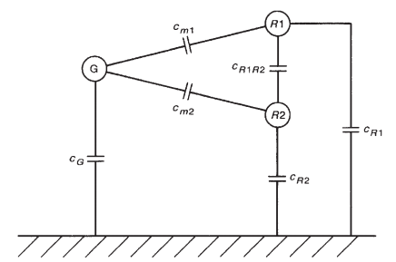

### 感性耦合-容性耦合

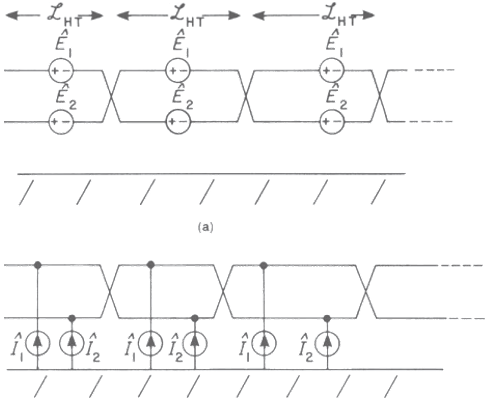

感应电压源 $E_1$ 和 $E_2$ 来自电源回路与双绞线回路之间的互感，本质上是由法拉第定律产生的感应电动势(注意方向)。感应电流源 $I_1$ 和 $I_2$ 来自电源回路与双绞线回路之间的互电容。
$$
\hat E_1
=
j\omega l_{m1} L_{HT}\hat I_G \\

\hat E_2
=
j\omega l_{m2} L_{HT}\hat I_G \\

\hat I_1
=
j\omega c_{m1} L_{HT}\hat U_G \\

\hat I_2
=
j\omega c_{m2} L_{HT}\hat U_G
$$
将双绞线解开绞合得到以下等效电路：

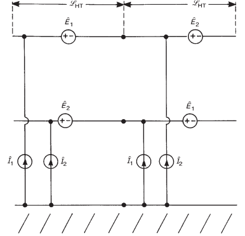

考虑终端结构，双绞线有两种端接方法：

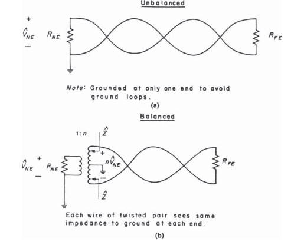

> - a：不平衡端接，每根导线与地之间看到的阻抗不相同。双绞线中的一根导线在近端连接到参考导体，而在另一端不连接到参考地，以避免该导线与参考地之间形成接地回路并产生环流。
> - b：平衡端接，每根导线与参考导体之间看到的阻抗相等。可以利用中心抽头变压器，平衡线路驱动器和接收器实现平衡。

---

**不平衡端接：**

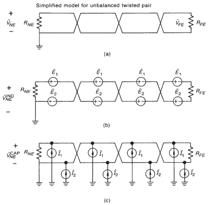

其解开绞合之后得到的等效电路如下：

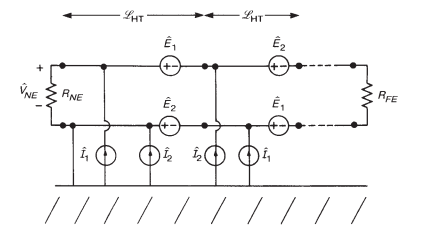

半绞距数量为奇数时，双绞线回路中的净感应电动势等于一个半绞距产生的感应电动势；半绞距数量为偶数时，净感应电动势为零。

在一个完整绞距内，连接到未接地导线上的净电流源为：
$$
\begin{aligned}
\hat I_1+\hat I_2
&=
j\omega c_{m1} L_{HT}\hat U_G
+
j\omega c_{m2} L_{HT}\hat U_G
\end{aligned}
$$
双绞线中的两根导线彼此非常接近，可以认为 $c_{m1} = c_{m2}$，因此会产生与未绞合平行线对相同的容性耦合。

可以得到串扰：
$$
\begin{aligned}
\frac{\hat U_{NE}}{\hat U_S}
={}&
\frac{R_{NE}}{R_{NE}+R_{FE}}
j\omega(l_{m1}-l_{m2}) L_{HT}
\frac{1}{R_S+R_L}\\
&+
\frac{R_{NE}R_{FE}}{R_{NE}+R_{FE}}
j\omega c_m L
\frac{R_L}{R_S+R_L}
\end{aligned} 
$$

$$
\begin{aligned}
\frac{\hat U_{FE}}{\hat U_S}
={}&
-\frac{R_{FE}}{R_{NE}+R_{FE}}
j\omega(l_{m1}-l_{m2}) L_{HT}
\frac{1}{R_S+R_L}\\
&+
\frac{R_{NE}R_{FE}}{R_{NE}+R_{FE}}
j\omega c_m L
\frac{R_L}{R_S+R_L}
\end{aligned}
$$

感性耦合等于长度为一个半绞距的平直线对所产生的感性耦合；容性耦合等于长度为双绞线总长度的平直线对所产生的容性耦合。

因此，对于不平衡端接：**双绞接收器线对能够降低低阻抗终端下的总串扰，对于高阻抗终端，总串扰基本不变**。

---

**平衡端接：**

**平衡的作用是消除容性耦合**，由于负载是平衡的，电容耦合贡献会相互抵消。

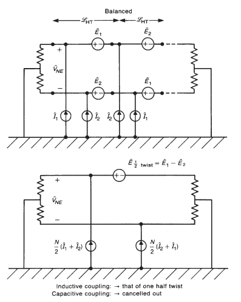
