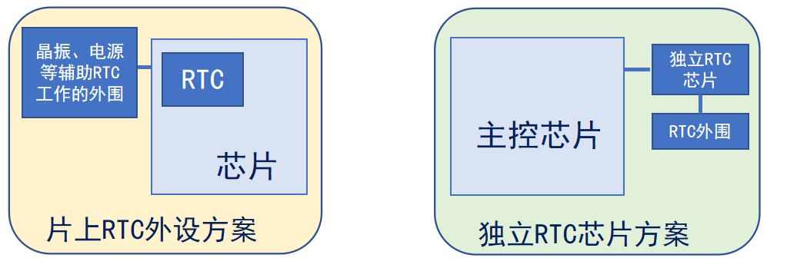
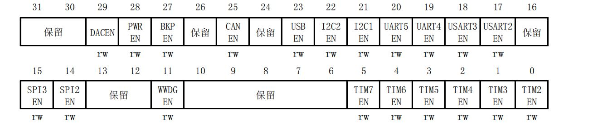
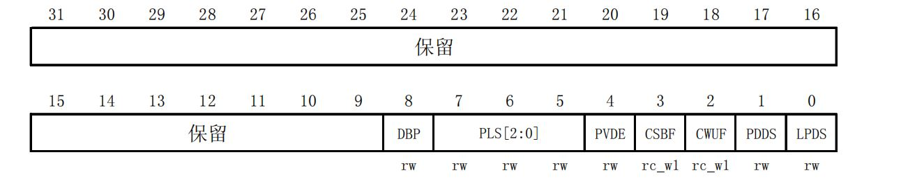
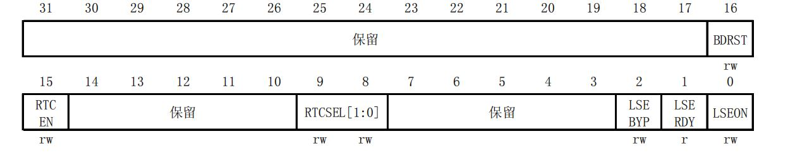
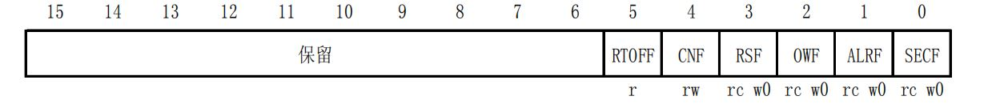
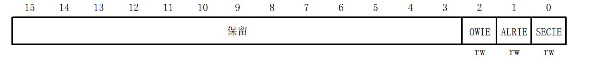
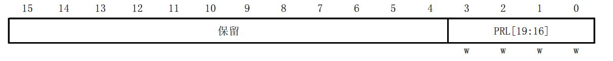

# STM32 11_RTC

## 1. RTC简介

实时时钟(Real Time Clock，RTC)，本质是一个计数器，计数频率常为秒，专门用来记录时间。


**RTC特性:**
1. 能提供时间（秒钟数）
2. 能在MCU掉电后运行
3. 低功耗

**RTC设计方案：**



>-|	内部RTC|外置RTC
>-|-|-
>信息差异|提供秒/亚秒信号|提供秒信号和日历
>功耗|功耗高|功耗低
>体积|不用占用额外体积|体积大
>成本|成本低|成本高

1. 一般都需要设计RTC外围电路；
2. 一般都可以给RTC设置独立的电源；
3. 多数RTC的寄存器采用BCD码存储时间信息；

## 2.RTC外设框图


1. RTC预分频器

时钟源：
- HSE / 128 (受$V_{DD}$影响)
- LSI 40kHz (受$V_{DD}$影响)
- LSE 32.768kHz(一般选择LSE)

通过预分频获得1Hz的信号(TR_CLK)，若使能秒中断，则会产生秒中断。

2. 32位计数器

通过在TR_CLK传来时将RTC_CNT值加1，以1900:1:1:0:0:0为时间基准计算当前时间。
若RTC_CNT = RTC_ALR，则产生闹钟中断信号。

3. 待机唤醒

4. RTC控制寄存器

**后备区域掉电仍正常进行。**

## 3. RTC寄存器简介

后备寄存器和RTC寄存器特性:

1. 部分寄存器写保护<br />
RTC_PRL、RTC_ALR、RTC_CNT和RTC_DIV寄存器不会被系统复位
2. 数据存储功能<br />
RTC和后备寄存器不会被系统或电源复位源复位；当从待机模式唤醒时，也不会被复位。 后备寄存器可用于保存掉电时的数据。
3. 独立工作<br />
RTC和后备寄存器通过一个开关供电，在VDD有效时该开关选择VDD供电，否则由VBAT引脚供电。在VBAT供电时仍可继续工作。
4. 2个独立复位<br />
APB1接口由系统复位；RTC核心只能由后备域复位；

- APB1 外设时钟使能寄存器(RCC_APB1ENR)



>位|名称|描述
>-|-|-
>29| DACEN: DAC接口时钟使能|由软件置’1’或清’0’ <br />0：DAC接口时钟关闭；<br />1：DAC接口时钟开启。
>28 |PWREN：电源接口时钟使能|由软件置’1’或清’0’ <br />0：电源接口时钟关闭；<br />1：电源接口时钟开启。
>27 |BKPEN：备份接口时钟使能|由软件置’1’或清’0’<br /> 0：备份接口时钟关闭；<br />1：备份接口时钟开启。
>23 |USBEN：USB时钟使能|由软件置’1’或清’0’ <br />0：USB时钟关闭；<br />1：USB时钟开启。
>22 |I2C2EN：I2C 2时钟使能|由软件置’1’或清’0’ <br />0：I2C 2时钟关闭；<br />1：I2C 2时钟开启。
>21 |I2C1EN：I2C 1时钟使能|由软件置’1’或清’0’ <br />0：I2C 1时钟关闭；<br />1：I2C 1时钟开启。
>20 |UART5EN：UART5时钟使能|由软件置’1’或清’0’<br /> 0：UART5时钟关闭；<br />1：UART5时钟开启。
>19 |UART4EN：UART4时钟使能|由软件置’1’或清’0’ <br />0：UART4时钟关闭；<br />1：UART4时钟开启。
>18 |USART3EN：USART3时钟使能|由软件置’1’或清’0’ <br />0：USART3时钟关闭；<br />1：USART3时钟开启。
>17 |USART2EN：USART2时钟使能|由软件置’1’或清’0’ <br />0：USART2时钟关闭；<br />1：USART2时钟开启。
>15 |SPI3EN：SPI 3时钟使能|由软件置’1’或清’0’ <br />0：SPI 3时钟关闭；<br />1：SPI 3时钟开启。
>14 |SPI2EN：SPI 2时钟使能|由软件置’1’或清’0’ <br />0：SPI 2时钟关闭；<br />1：SPI 2时钟开启。
>5 |TIM7EN：定时器7时钟使能|由软件置’1’或清’0’ <br />0：定时器7时钟关闭；<br />1：定时器7时钟开启。
>4 |TIM6EN：定时器6时钟使能|由软件置’1’或清’0’ <br />0：定时器6时钟关闭；<br />1：定时器6时钟开启。
>3 |TIM5EN：定时器5时钟使能|由软件置’1’或清’0’ <br />0：定时器5时钟关闭；<br />1：定时器5时钟开启。
>2 |TIM4EN：定时器4时钟使能|由软件置’1’或清’0’ <br />0：定时器4时钟关闭；<br />1：定时器4时钟开启。
>1 |TIM3EN：定时器3时钟使能|由软件置’1’或清’0’ <br />0：定时器3时钟关闭；<br />1：定时器3时钟开启。
>0 |TIM2EN：定时器2时钟使能|由软件置’1’或清’0’ <br />0：定时器2时钟关闭；<br />1：定时器2时钟开启。

用于使能PWR && BKP时钟

- 电源控制寄存器(PWR_CR)



>位|名称|描述
>-|-|-
>8 |DBP：取消后备区域的写保护|在复位后，RTC和后备寄存器处于被保护状态以防意外写入。设置这位允许写入这些寄存器。<br />0：禁止写入RTC和后备寄存器<br />1：允许写入RTC和后备寄存器
>7:5|PLS[2:0]：PVD电平选择|这些位用于选择电源电压监测器的电压阀值<br />000：2.2V <br />100：2.6V <br />001：2.3V <br />101：2.7V <br />010：2.4V <br />110：2.8V <br />011：2.5V <br />111：2.9V 
>4 |PVDE：电源电压监测器(PVD)使能|0：禁止PVD <br />1：开启PVD 
>3 |CSBF：清除待机位|始终读出为0 <br />0：无功效<br />1：清除SBF待机位(写) 
>2 |CWUF：清除唤醒位|始终读出为0 <br />0：无功效<br />1：2个系统时钟周期后清除WUF唤醒位(写) 
>1 |PDDS：掉电深睡眠|与LPDS位协同操作<br />0：当CPU进入深睡眠时进入停机模式，调压器的状态由LPDS位控制。<br />1：CPU进入深睡眠时进入待机模式。
>0 |LPDS：深睡眠下的低功耗|PDDS=0时，与PDDS位协同操作<br />0：在停机模式下电压调压器开启<br />1：在停机模式下电压调压器处于低功耗模式

用于使能后备域和RTC的访问权限

- 备份域控制寄存器 (RCC_BDCR)



>位|名称|描述
>-|-|-
>16 |BDRST：备份域软件复位|由软件置’1’或清’0’ <br />0：复位未激活；<br />1：复位整个备份域。
>15 |RTCEN：RTC时钟使能|由软件置’1’或清’0’ <br />0：RTC时钟关闭；<br />1：RTC时钟开启。
>9:8| RTCSEL[1:0]：RTC时钟源选择|由软件设置来选择RTC时钟源。一旦RTC时钟源被选定，直到下次后备域被复位，它不能在被改变。可通过设置BDRST位来清除。<br />00：无时钟；<br />01：LSE振荡器作为RTC时钟；<br />10：LSI振荡器作为RTC时钟；<br />11：HSE振荡器在128分频后作为RTC时钟。
>2 |LSEBYP：外部低速时钟振荡器旁路|在调试模式下由软件置’1’或清’0’来旁路LSE。有在外部32kHz振荡器关闭时，才能写入该位<br />0：LSE时钟未被旁路；<br />1：LSE时钟被旁路
>1| LSERDY：外部低速LSE就绪|由硬件置’1’或清’0’来指示是否外部32kHz振荡器就绪。<br />在LSEON被清零后，该位需要6个外部低速振荡器的周期才被清零。<br />0：外部32kHz振荡器未就绪；<br />1：外部32kHz振荡器就绪。
>0 |LSEON：外部低速振荡器使能|由软件置’1’或清’0’ <br />0：外部32kHz振荡器关闭；<br />1：外部32kHz振荡器开启。

通过RCC_BDCR配置：
1. 开启RTC时钟
2. 开启LSE时钟；
3. 选择RTC计数时钟源；

- RTC控制寄存器低位(RTC_CRL)



>位|名称|描述
>-|-|-
>5 |RTOFF：RTC操作关闭|RTC模块利用这位来指示对其寄存器进行的最后一次操作的状态，指示操作是否完成。若此位为0，则表示无法对任何的RTC寄存器进行写操作。此位为只读位。<br />0：上一次对RTC寄存器的写操作仍在进行; <br />1：上一次对RTC寄存器的写操作已经完成。
>4| CNF：配置标志|此位必须由软件置’1’以进入配置模式，从而允许向RTC_CNT、RTC_ALR或RTC_PRL寄存器写入数据。只有当此位在被置’1’并重新由软件清’0’后，才会执行写操作。<br />0：退出配置模式(开始更新RTC寄存器)；<br />1：进入配置模式。
>3 |RSF：寄存器同步标志|每当RTC_CNT寄存器和RTC_DIV寄存器由软件更新或清’0’时，此位由硬件置’1’。在APB1复位后，或APB1时钟停止后，此位必须由软件清’0’。要进行任何的读操作之前，用户程序必须等待这位被硬件置’1’，以确保RTC_CNT、RTC_ALR或RTC_PRL已经被同步。<br />0：寄存器尚未被同步；<br />1：寄存器已经被同步。
>2 |OWF：溢出标志|当32位可编程计数器溢出时，此位由硬件置’1’。如果RTC_CRH寄存器中OWIE=1，则产生中断。此位只能由软件清’0’。对此位写’1’是无效的。<br />0：无溢出；<br />1：32位可编程计数器溢出。
>1 |ALRF：闹钟标志|当32位可编程计数器达到RTC_ALR寄存器所设置的预定值，此位由硬件置’1’。如果RTC_CRH寄存器中ALRIE=1，则产生中断。此位只能由软件清’0’。对此位写’1’是无效的。<br />0：无闹钟；<br />1：有闹钟。
>0| SECF：秒标志|当32位可编程预分频器溢出时，此位由硬件置’1’同时RTC计数器加1。因此，此标志为分辨率可编程的RTC计数器提供一个周期性的信号(通常为1秒)。如果RTC_CRH寄存器中SECIE=1，则产生中断。此位只能由软件清除。对此位写’1’是无效的。<br />0：秒标志条件不成立；<br />1：秒标志条件成立

配置RTC

- RTC控制寄存器高位(RTC_CRH)



>位|名称|描述
>-|-|-
>2 |OWIE：允许溢出中断位|0：屏蔽(不允许)溢出中断<br />1：允许溢出中断
>1 |ALRIE：允许闹钟中断|0：屏蔽(不允许)闹钟中断<br />1：允许闹钟中断
>0 |SECIE：允许秒中断|0：屏蔽(不允许)秒中断<br />1：允许秒中断

使能中断

- RTC预分频装载寄存器高位(RTC_PRLH)



>位|名称|描述
>-|-|-
>3:0 |PRL[19:16]：RTC预分频装载值高位|根据以下公式，这些位用来定义计数器的时钟频率：$f_{TR\_CLK} = f_{RTCCLK}/(PRL[19:0]+1) $

- RTC预分频装载寄存器低位(RTC_PRLL)


>位|名称|描述
>-|-|-
>15:0|PRL[15:0]：RTC预分频装载值低位|

1. 与RTC_PRL相似的寄存器RTC_DIV可以在不停止分频计数器的工作，获得预分频计数器的当前值。
2. 使计数器每计数一次就是1秒，即需要32768分频。

- HAL库函数
>驱动函数	|关联寄存器|	功能描述
>-|-|-
>`HAL_RTC_Init()`	|CRL/CRH/PRLH/PRLL	|初始化RTC
>`HAL_RTC_MspInit()`|	初始化回调	|使能RTC时钟
>`HAL_RCC_OscConfig()`|	RCC_CR/PWR_CR	|开启LSE时钟源
>`HAL_RCCEx_PeriphCLKConfig()`|	RCC_BDCR|	设置RTC时钟源为LSE
>`HAL_PWR_EnableBkUpAccess()`	|PWR_CR|	使能备份域的访问权限
>`HAL_RTCEx_BKUPWrite/Read()`	|BKP_DRx	|读/写备份域数据寄存器

开启的时钟源：<br />
`__HAL_RCC_RTC_ENABLE()`<br />
`__HAL_RCC_PWR_CLK_ENABLE()`<br />
`__HAL_RCC_BKP_CLK_ENABLE()`<br />

- 配置步骤
1. 使能电源时钟并使能后备域访问<br />`__HAL_RCC_PWR_CLK_ENABLE` 使能电源时钟<br />
`__HAL_RCC_BKP_CLK_ENABLE`  使能备份时钟<br />
`HAL_PWR_EnableBkUpAccess`   使能备份访问
2. 开启LSE/选择RTC时钟源/使能RTC时钟<br />
`HAL_RCC_OscConfig `开启LSE<br />
`HAL_RCCEx_PeriphCLKConfig` 选择RTC时钟源<br />
`__HAL_RCC_RTC_ENABLE `        使能RTC时钟<br />
3. 初始化RTC，设置分频值以及工作参数<br />
`HAL_RTC_Init` 初始化RTC<br />
`HAL_RTC_MspInit` 完成RTC底层初始化工作<br />
4. 设置RTC的日期和时间
5. 获取RTC当前日期和时间

- HAL库函数
1. 读取时间函数
```c
HAL_StatusTypeDef HAL_RTC_GetTime(RTC_HandleTypeDef *hrtc, RTC_TimeTypeDef *sTime, uint32_t Format)
```
- RTC_TimeTypeDef *sTime： 获取RTC时间的结构体，
- Format： 获取时间的格式<br />
 `RTC_FORMAT_BIN` 使用16进制<br />
 `RTC_FORMAT_BCD` 使用BCD进制<br />

2. 读取日期函数
```c
HAL_StatusTypeDef HAL_RTC_GetDate(RTC_HandleTypeDef *hrtc, RTC_DateTypeDef *sDate, uint32_t Format)
```
