# STM32 12_低功耗模式

## 1. STM32 电源系统

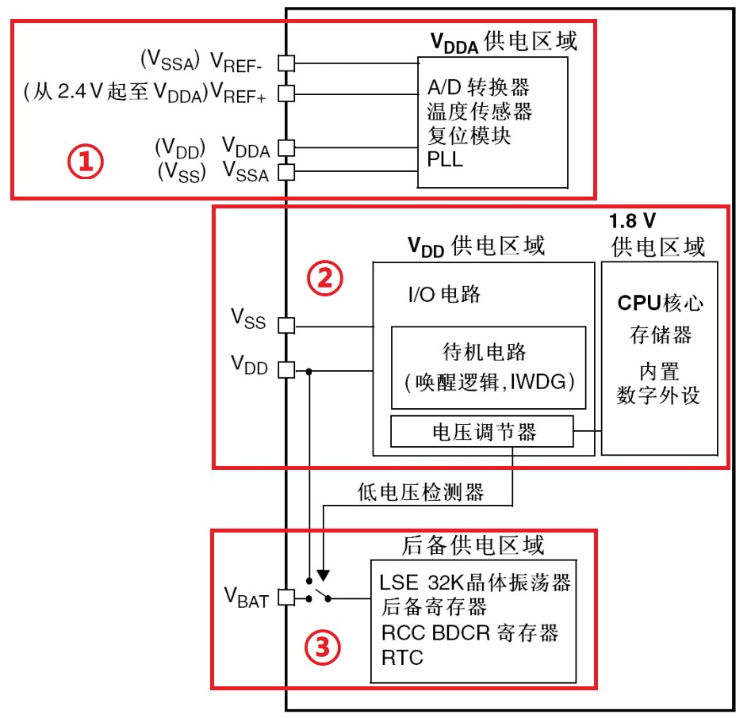

1. 为了提高转换精度，给模拟外设独立供电
2. 电压调节器为1.8V供电区域供电，且1.8V供电区域是电源系统中最主要的部分
3. 两种供电方式：VBAT和VDD。主要电源被切断，该区域还能工作

## 2. 低功耗模式

STM32具有运行、睡眠、停止和待机四种工作模式。

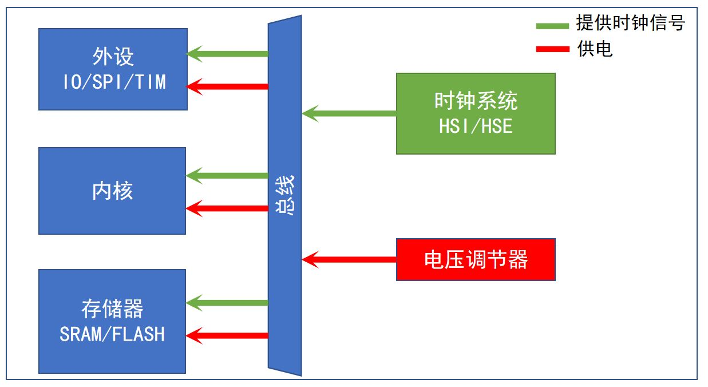

1. 睡眠模式

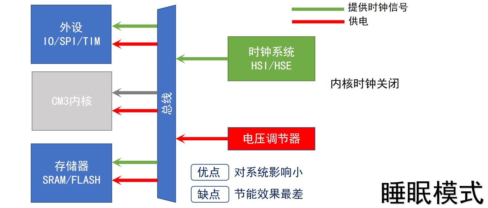

2. 停止模式

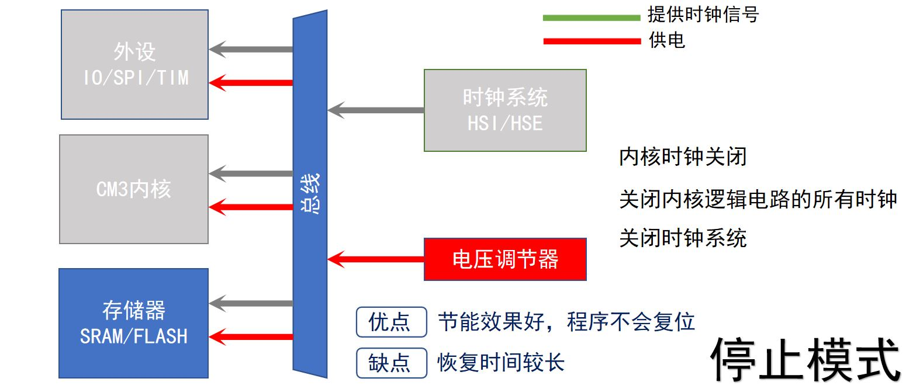

3. 待机模式

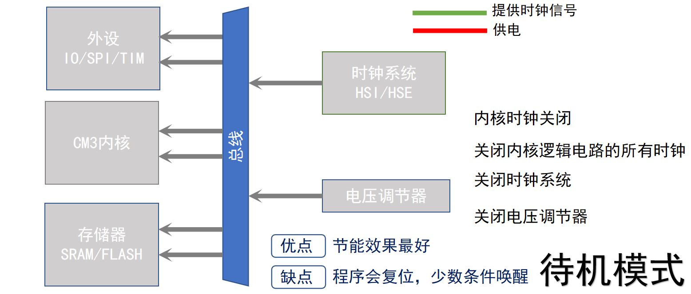

>模式|	进入|	唤醒|	对内核电路时钟影响|	对VDD区域时钟的影响	|电压调节器
>-|-|-|-|-|-
>睡眠(立即休眠或退出时休眠)	|WFI(常用)|任意中断|CPU时钟关，对其他时钟或模拟时钟源无影响|无|开
>||WFE|唤醒事件|	CPU时钟关，对其他时钟或模拟时钟源无影响|	无|	开
>停止	|PDDS和LPDS位+SLEEPDEEP位+WFI或WFE|	任意外部中断（在外部中断寄存器中设置）|	关闭所有内核电路时钟|	HSI和HSE的振荡器关闭|	开启或处于低功耗模式（依据电源控制寄存器PWR_CR的设定）
>待机|	PDDS位+SLEEPDEEP位+WFI或WFE|	WKUP引脚的上升沿、RTC闹钟(唤醒/入侵/时间戳)事件、NRST引脚上的外部复位、IWDG复位|关闭所有内核电路时钟|HSI和HSE的振荡器关闭|	关

- 寄存器描述

1. 系统控制寄存器(SCB_SCR) 
>位段 |名称 |类型 |复位值 |描述
>-|-|-|-|-
>4| SEVONPEND |RW |‐ | 发生异常悬起时请发送事件，用于在一个新的中断悬起时从 WFE 指令处唤醒。不管这个中断的优先级是否比当前的高，都唤醒。如果没有 WFE导致睡眠，则下次使用 WFE 时将立即唤醒
>2| SLEEPDEEP |R/W |0|当进入睡眠模式时，使能外部的SLEEPDEEP信号，以允许停止系统时钟
>1| SLEEPONEXIT| R/W| ‐ | 激活“SleepOnExit”功能

2. 电源控制寄存器(PWR_CR)

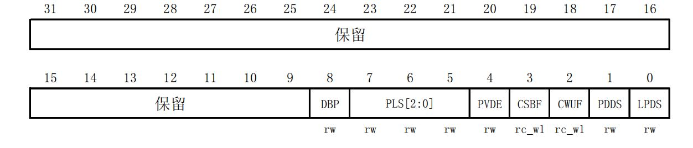

>位|名称|描述
>-|-|-
>8| DBP：取消后备区域的写保护|在复位后，RTC和后备寄存器处于被保护状态以防意外写入。设置这位允许写入这些寄存器。<br />0：禁止写入RTC和后备寄存器<br />1：允许写入RTC和后备寄存器
>7:5| PLS[2:0]：PVD电平选择|这些位用于选择电源电压监测器的电压阀值<br />000：2.2V<br />100：2.6V<br /> 001：2.3V <br />101：2.7V <br />010：2.4V<br /> 110：2.8V <br />011：2.5V<br /> 111：2.9V <br />
>4 |PVDE：电源电压监测器(PVD)使能|0：禁止PVD <br />1：开启PVD
>3 |CSBF：清除待机位|始终读出为0<br /> 0：无功效<br />1：清除SBF待机位(写) 
> 2 |CWUF：清除唤醒位|始终读出为0 <br />0：无功效<br />1：2个系统时钟周期后清除WUF唤醒位(写) 
> 1 |PDDS：掉电深睡眠|与LPDS位协同操作<br />0：当CPU进入深睡眠时进入停机模式，调压器的状态由LPDS位控制。<br />1：CPU进入深睡眠时进入待机模式。
> 0| LPDS：深睡眠下的低功耗|PDDS=0时，与PDDS位协同操作<br />0：在停机模式下电压调压器开启<br />1：在停机模式下电压调压器处于低功耗模式

- 停止模式：PDDS清0，LPDS选调节器模式
- 待机模式：PDDS置1，清除唤醒位 CWUF

3. 电源控制/状态寄存器(PWR_CSR)

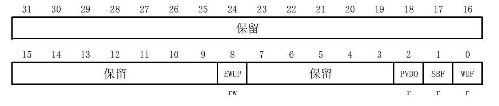

>位|名称|描述
>-|-|-
>8 |EWUP：使能WKUP管脚|0：WKUP管脚为通用I/O。WKUP管脚上的事件不能将CPU从待机模式唤醒<br />1：WKUP管脚用于将CPU从待机模式唤醒，WKUP管脚被强置为输入下拉的配置(WKUP管脚上的上升沿将系统从待机模式唤醒) 
>2 |PVDO：PVD输出|当PVD被PVDE位使能后该位才有效<br />0：VDD/VDDA高于由PLS[2:0]选定的PVD阀值<br />1：VDD/VDDA低于由PLS[2:0]选定的PVD阀值<br />注：在待机模式下PVD被停止。因此，待机模式后或复位后，直到设置PVDE位之前，该位为0。
>1| SBF：待机标志|该位由硬件设置，并只能由POR/PDR(上电/掉电复位)或设置电源控制寄存器(PWR_CR)的CSBF位清除。<br />0：系统不在待机模式<br />1：系统进入待机模式
>0 |WUF：唤醒标志|该位由硬件设置，并只能由POR/PDR(上电/掉电复位)或设置电源控制寄存器(PWR_CR)的CWUF位清除。<br />0：没有发生唤醒事件<br />1：在WKUP管脚上发生唤醒事件或出现RTC闹钟事件。<br />注：当WKUP管脚已经是高电平时，在(通过设置EWUP位)使能WKUP管脚时，会检测到一个额外的事件

- 待机模式下 ，使用WKUP引脚唤醒并需要清除WUF标记位

4. WFI命令和WFE命令
内核指令，使用函数的格式“__WFI()”和“__WFE()”来调用。

5. HAL库函数

>驱动函数	|关联寄存器	|功能描述
>-|-|-
>`HAL_PWR_EnterSLEEPMode()`	|SCB_SCR|	进入睡眠模式
>`HAL_PWR_EnterSTOPMode()`	|PWR_CR/SCB_SCR	|进入停止模式
>`HAL_PWR_EnterSTANDBYMode()`	|PWR_CR/SCB_SCR|	进入待机模式
>`HAL_PWR_EnableWakeUpPin()`	|PWR_CSR|	使能WKUP管脚唤醒功能
>`__HAL_PWR_CLEAR_FLAG()`	|PWR_CR	|清除PWR的相关标记
>`__HAL_RCC_PWR_CLK_ENABLE()`	|RCC_APB1ENR|	使能电源时钟

6. 配置步骤

- 睡眠模式

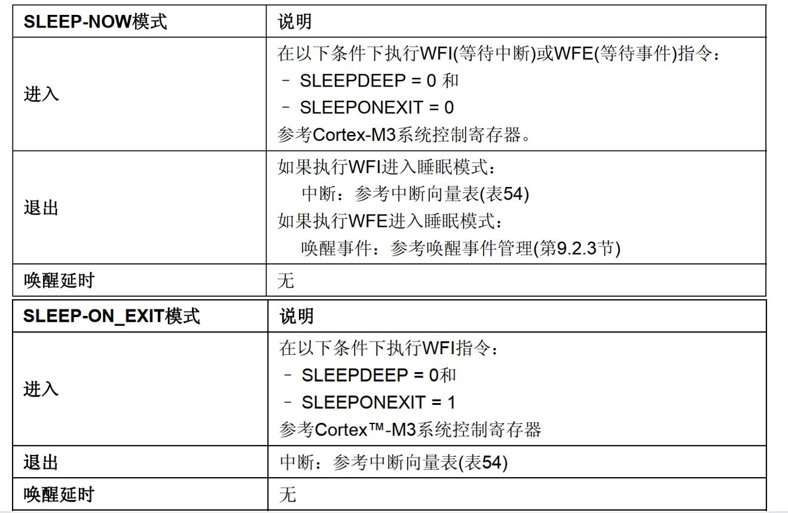

1. 初始化WKUP为中断触发源
2. 进入睡眠模式
3. 等待WKUP外部中断唤醒

- 停止模式

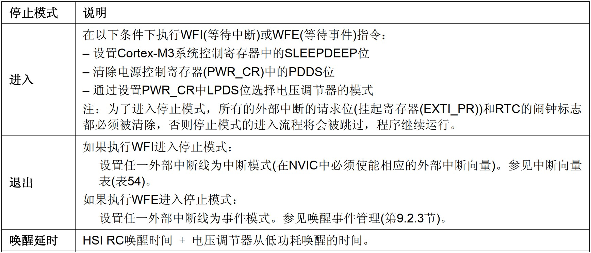

1. 初始化WKUP为中断触发源
2. 进入停止模式`HAL_PWR_EnterSTOPMode`
3. 等待WKUP外部中断唤醒
4. 重新设置时钟、重新选择滴答时钟源、失能systick中断

- 待机模式

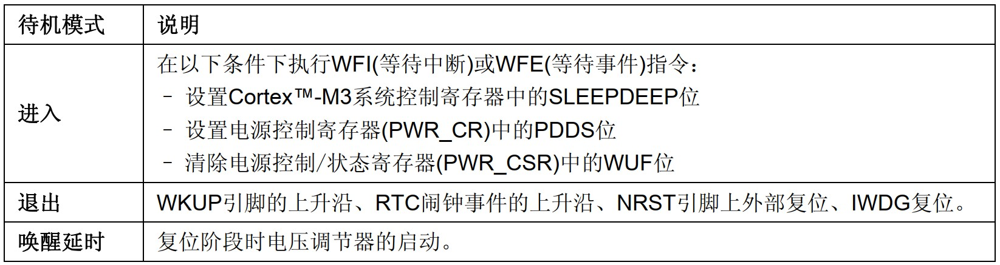

1. 初始化WKUP为中断触发源
2. 使能电源时钟`__HAL_RCC_PWR_CLK_ENABLE`
3. 使能WKUP的唤醒功能`HAL_PWR_EnableWakeUpPin`
4. 清除唤醒标记WUF`__HAL_PWR_CLEAR_FLAG`
5. 进入待机模式`HAL_PWR_EnterSTANDBYMode`

## 3. 电源监控

电源监控即对某些电源电压（$V_{DD}$ / $V_{DDA}$ / $V_{BAT}$）进行监控。

**POR/PDR（power on/down reset）：** 上电/掉电复位<br />
**PVD（programmable voltage detector）：** 监控$V_{DD}$电压<br />
**BOR（brown out reset）：** 欠压复位<br />
**AVD（analog voltage detector）：** 监控$V_{DDA}$电压<br />
**VBAT阈值（battery voltage thresholds）：** 监控$V_{BAT}$电池电压<br />
**温度阈值（temperature thresholds）：** 监控结温

1. 上电/掉电复位POR/PDR

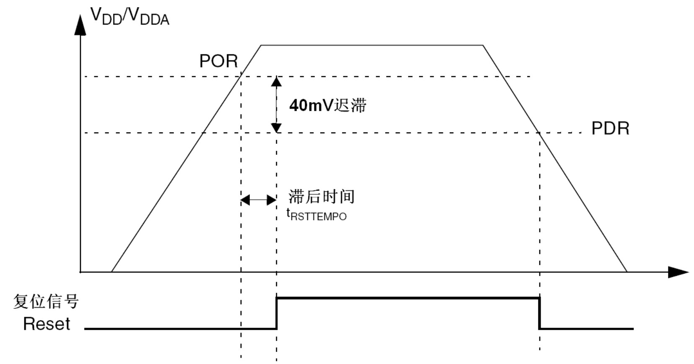

上电时，当$V_{DD} ＜ V_{POR}$阈值时，系统无需外部复位电路便会保持复位状态。<br />
当$V_{DD} ＞ V_{POR}$阈值时，系统便退出复位状态，正常工作。<br />
掉电时，当$V_{DD} ＜ V_{POR}$阈值时，系统就会保持复位状态。

2. 可编程电压检测器(PVD)

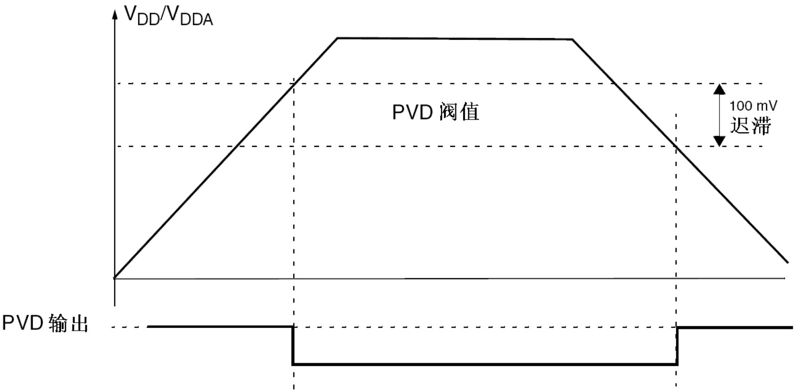

监视供电电压$V_{DD}$。
当电压下降到设定阈值以下时产生中断，通知软件做紧急处理；
当电压恢复到设定阈值以上时产生中断，通知软件供电恢复。

- HAL库函数

>驱动函数	|关联寄存器|	功能描述
>-|-|-
>`__HAL_RCC_PWR_CLK_ENABLE()`	|RCC_APB1ENR|	使能电源时钟
>`HAL_PWR_ConfigPVD()`|	PWR_CR|	配置PVD相关参数
>`HAL_PWR_EnablePVD()`	|PWR_CR	|使能PVD功能

- PVD结构体
```c
typedef struct  
{ 
	uint32_t			PVDLevel; 		/* PVD检测级别 */ 
	uint32_t			Mode; 			/* PVD的EXTI检测模式 */ 
} PWR_PVDTypeDef;
```

- 配置步骤
1. 使能电源时钟`__HAL_RCC_PWR_CLK_ENABLE`
2. 配置PVD通过`HAL_PWR_ConfigPVD`配置电压级别、中断线边沿触发
3. 使能PVD检测`HAL_PWR_EnablePVD`
4. 设置PVD中断优先级`HAL_NVIC_SetPriority`
`HAL_NVIC_EnableIRQ`
5. 编写中断服务函数`PVD_IRQHandler` `HAL_PWR_PVD_IRQHandler` `HAL _PWR_PVDCallback`


