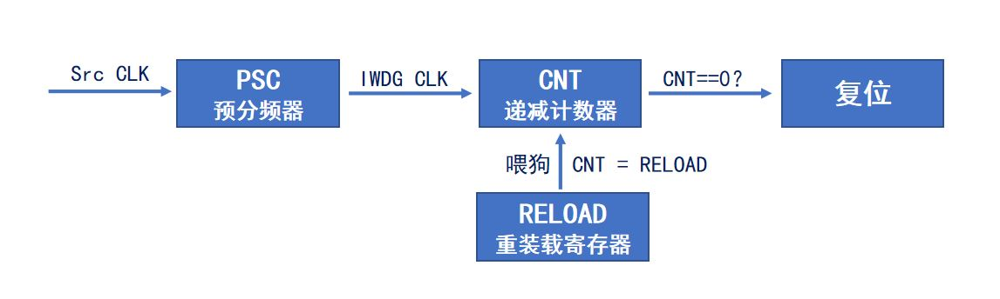
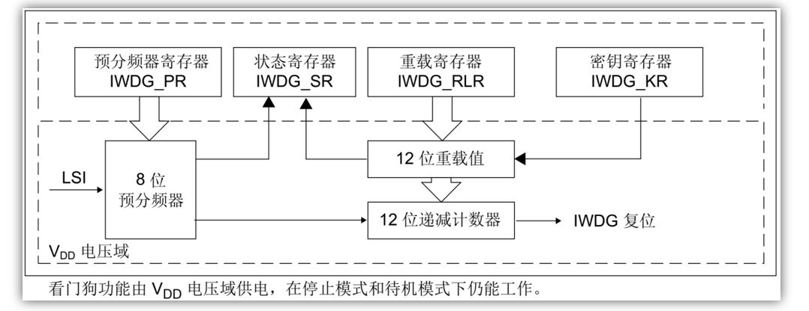
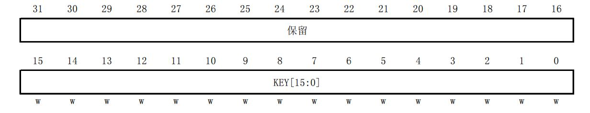
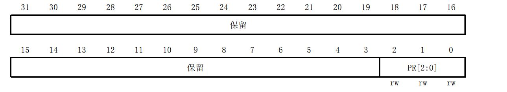
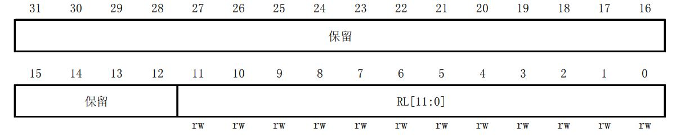
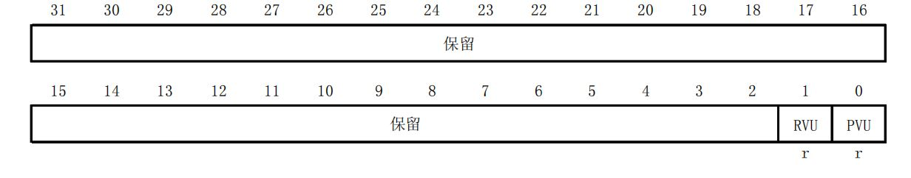

# STM32 8_IWDG

## 1. IWDG
Independent watchdog，即独立看门狗，是能产生系统复位信号的计数器
### 1.1 工作特性及原理
**特点：**

1. 递减的计数器
2. 时钟由独立的RC振荡器提供（可在待机和停止模式下运行）
3. 看门狗被激活后，当递减计数器计数到0x000时产生复位

- 喂狗：在计数器计数到0之前，重装载计数器的值，防止复位

- 复位方式：
1. NRST管脚上的低电平(外部复位) 
2. 窗口看门狗计数终止(WWDG复位) 
3. 独立看门狗计数终止(IWDG复位) 
4. 软件复位(SW复位) 
5. 低功耗管理复位

- 作用
1. 外界电磁干扰或者自身系统（硬件或软件）异常，
造成程序跑飞，如：陷入某个不正常的死循环，打断正常的程序运行
2. 主要用于检测外界电磁干扰，或硬件异常导致的程序跑飞问题

- 应用：
在一些需要高稳定性的产品中，并且对时间精度要求较低的场合

**工作原理：**



- 寄存器框图



1. 启用IWDG后，LSI时钟会自动开启
2. LSI时钟频率并不精确，F1用40kHz

### 1.2 IWDG寄存器

1. 键寄存器(IWDG_KR)



>|位|说明
>|-|-|
>|15:0| KEY[15:0]: 键值(只写寄存器，读出值为0x0000) 。软件必须以一定的间隔写入0xAAAA，否则，当计数器为0时，看门狗会产生复位。写入0x5555表示允许访问IWDG_PR和IWDG_RLR寄存器。写入0xCCCC，启动看门狗工作(若选择了硬件看门狗则不受此命令字限制)。

用于喂狗，解除PR和RLR寄存器写访问保护，以及启动看门狗工作

2. 预分频寄存器(IWDG_PR)


>|位|说明|
>|-|-|
>|2:0| PR[2:0]: 预分频因子。这些位具有写保护设置。通过设置这些位来选择计数器时钟的预分频因子。要改变预分频因子，IWDG_SR寄存器的PVU位必须为0。<br/>000: 预分频因子=4；<br/>100: 预分频因子=64；<br/>001: 预分频因子=8；<br/>101: 预分频因子=128；<br/>010: 预分频因子=16；<br/>110: 预分频因子=256； <br/>011: 预分频因子=32；<br/>111: 预分频因子=256。 <br/>注意：对此寄存器进行读操作，将从VDD电压域返回预分频值。如果写操作正在进行，则读回的值可能是无效的。因此，只有当IWDG_SR寄存器的PVU位为0时，读出的值才有效。 |

3. 重装载寄存器(IWDG_RLR)


>|位|说明
>|-|-|
>|11:0 |RL[11:0]: 看门狗计数器重装载值。这些位具有写保护功能。用于定义看门狗计数器的重装载值，每当向IWDG_KR寄存器写入0xAAAA时，重装载值会被传送到计数器中。随后计数器从这个值开始递减计数。看门狗超时周期可通过此重装载值和时钟预分频值来计算。只有当IWDG_SR寄存器中的RVU位为0时，才能对此寄存器进行修改。<br/>注：对此寄存器进行读操作，将从VDD电压域返回预分频值。如果写操作正在进行，则读回的值可能是无效的。因此，只有当IWDG_SR寄存器的RVU位为0时，读出的值才有效。

4. 状态寄存器(IWDG_SR)


>|位|说明
>|-|-|
>|1 |RVU: 看门狗计数器重装载值更新。此位由硬件置1用来指示重装载值的更新正在进行中。当在VDD域中的重装载更新结束后，此位由硬件清0(最多需5个40kHz的RC周期)。重装载值只有在RVU位被清0后才可更新。
>|0 |PVU: 看门狗预分频值更新。此位由硬件置1用来指示预分频值的更新正在进行中。当在VDD域中的预分频值更新结束后，此位由硬件清0(最多需5个40kHz的RC周期)。预分频值只有在PVU位被清0后才可更新。

- 寄存器操作步骤
1. 通过在键寄存器 (IWDG_KR) 中写入 0xCCCC 来使能 IWDG。
2. 通过在键寄存器 (IWDG_KR) 中写入 0x5555 来使能寄存器访问。
3. 通过将预分频器寄存器 (IWDG_PR) 编程为 0~7 中的数值来配置预分频器。
4. 对重载寄存器 (IWDG_RLR) 进行写操作。
5. 等待寄存器更新 (IWDG_SR = 0x0000 0000)。
6. 刷新计数器值为 IWDG_RLR 的值 (IWDG_KR = 0xAAAA)。

- 溢出时间计算

*IWDG溢出时间计算公式(HAL库)*

$$
T_{out}=psc*rlr/f_{IWDG}
$$
$T_{out}$是看门狗溢出时间；
$f_{IWDG}$是看门狗的时钟源频率；
$psc$是看门狗预分频系数；
$rlr$是看门狗重装载值；

### 1.3 IWDG配置步骤
1. 取消PR/RLR寄存器写保护，设置IWDG预分频系数和重装载值，启动IWDG；`HAL_IWDG_Init()`
2. 及时喂狗，即写入0xAAAA 到IWDG_KR。`HAL_IWDG_Refresh()`

- IWDG初始化结构体
```c
typedef struct
{ 
    uint32_t Prescaler;    /* 预分频系数 */ 
    uint32_t Reload;       /* 重装载值 */ 
} IWDG_InitTypeDef;
```
- IWDG句柄结构体
```c
typedef struct 
{ 
   IWDG_TypeDef *Instance;      /* IWDG 寄存器基地址 */
   IWDG_InitTypeDef Init;       /* IWDG 初始化参数 */
}IWDG_HandleTypeDef;
```

- CubeMX生成的IWDG初始化函数
```c
void MX_IWDG_Init(void)
{

  /* USER CODE BEGIN IWDG_Init 0 */

  /* USER CODE END IWDG_Init 0 */

  /* USER CODE BEGIN IWDG_Init 1 */

  /* USER CODE END IWDG_Init 1 */
  hiwdg.Instance = IWDG;
  hiwdg.Init.Prescaler = IWDG_PRESCALER_32;
  hiwdg.Init.Reload = 1250;
  if (HAL_IWDG_Init(&hiwdg) != HAL_OK)
  {
    Error_Handler();
  }
  /* USER CODE BEGIN IWDG_Init 2 */

  /* USER CODE END IWDG_Init 2 */

}
```
