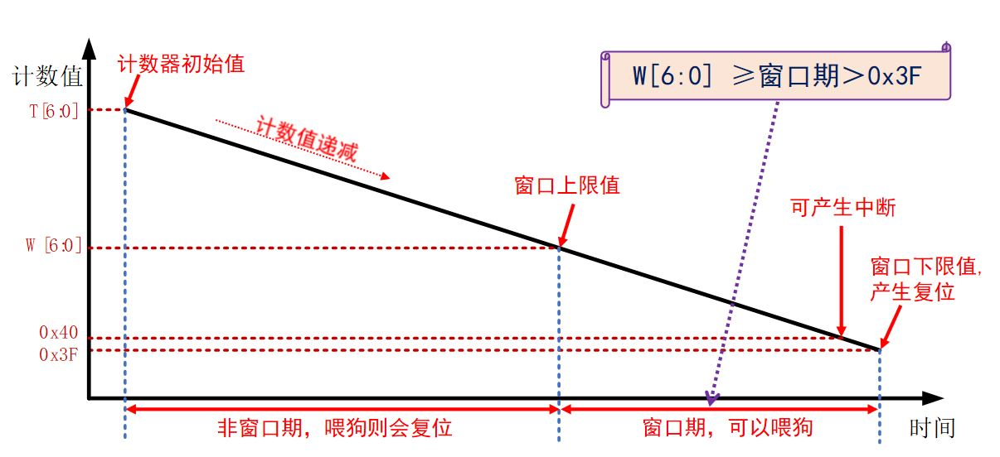
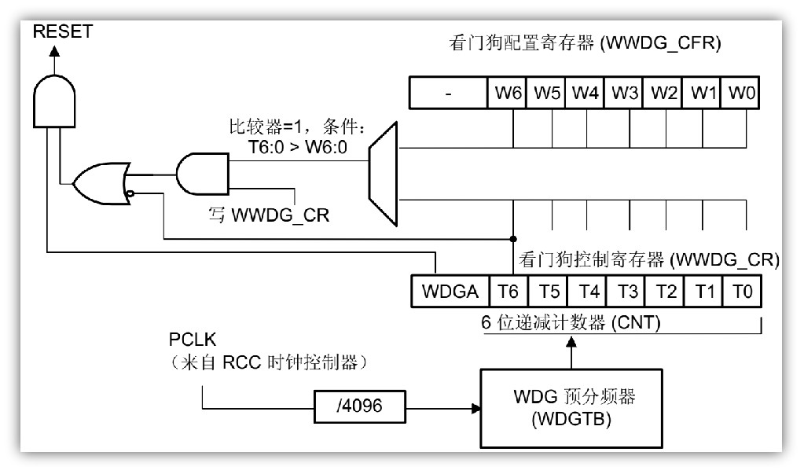
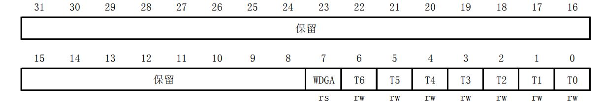
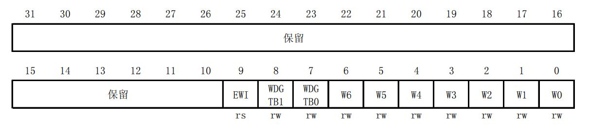
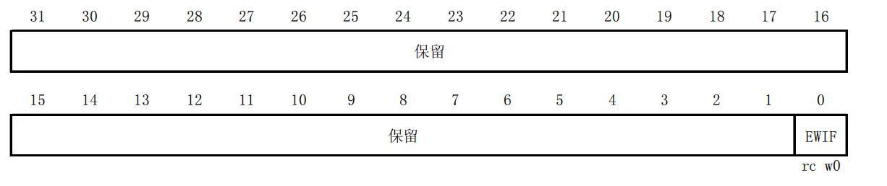

# STM32 9_WWDG
## 1. WWDG
Window watchdog，即窗口看门狗，能产生系统复位信号和**提前唤醒中断**的计数器
### 1.1 WWDG特点
1. 递减的计数器
2. 当递减计数器值从 0x40(64)减到0x3F(63)时复位（即T6位跳变到0）
3. 计数器的值大于W[6:0]值时喂狗会复位
4. 提前唤醒中断 (EWI)：当递减计数器等于 0x40 时可产生

**喂狗：** 在窗口期内重装载计数器的值，防止复位；

### 1.2 WWDG作用
用于监测单片机程序运行时效是否精准，主要检测软件异常

### 1.3 WWDG工作原理



**注：** W[6:0] 必须大于 窗口下限值0x3F，否则无窗口期


- WWDG工作框图



WWDG时钟来源为PCLK1(36Mhz)

### 1.4 WWDG寄存器
1. 控制寄存器(WWDG_CR)



>|位|说明
>|-|-|
>|7 |WDGA: 激活位。此位由软件置1，但仅能由硬件在复位后清0。当WDGA=1时，看门狗可以产生复位。0：禁止看门狗；1：启用看门狗
>|6:0|T[6:0]: 7位计数器(MSB至LSB) 。这些位用来存储看门狗的计数器值。每个PCLK1周期(4096x2WDGTB)减1。当计数器值从40h变为3Fh时(T6被清0)，产生看门狗复位。

用于使能窗口看门狗工作，以及重装载计数器值（即喂狗）

2. 配置寄存器(WWDG_CFR)



>|位|说明
>|-|-|
>|9| EWI: 提前唤醒中断。此位若置1，则当计数器值达到40h，即产生中断。此中断只能由硬件在复位后清除。
>|8:7| WDGTB[1:0]: 时基。预分频器的时基可根据如下修改：00: CK计时器时钟(PCLK1除以4096)除以1 ；01: CK计时器时钟(PCLK1除以4096)除以2 ；10: CK计时器时钟(PCLK1除以4096)除以4 ；11: CK计时器时钟(PCLK1除以4096)除以8 
>|6:0| W[6:0]: 7位窗口值。这些位包含了用来与递减计数器进行比较用的窗口值。

用于使能窗口看门狗提前唤醒中断，设置预分频系数，设置窗口上限值。

3. 状态寄存器(WWDG_SR)



>|位|说明
>|-|-|
>|0| EWIF: 提前唤醒中断标志。当计数器值达到40h时，此位由硬件置1。它必须通过软件写’0’来清除。对此位写’1’无效。若中断未被使能，此位也会被置’1’。

用于判断是否发生了WWDG提前唤醒中断

### 1.5 WWDG超时时间计算

*WWDG超时时间计算公式*
$$
T_{out}=4096*2^{WDGFB}*(T[5:0]+1)/F_{WWDG}
$$

$T_{out}$是WWDG超时时间（没喂狗）;$F_{WWDG}$是WWDG的时钟源频率;4096是WWDG固定的预分频系数;$2^{WDGTB}$是WWDG_CFR寄存器设置的预分频系数值;$T[5:0]$是WWDG计数器低6位

### 1.6 WWDG配置步骤

1. WWDG工作参数初始化 `HAL_WWDG_Init()`
2. WWDG Msp初始化
`HAL_WWDG_MspInit()`
3. 设置优先级，使能中断
`HAL_NVIC_SetPriority()`、 `HAL_NVIC_EnableIRQ()`
4. 编写中断服务函数
`WWDG_IRQHandler()`->`HAL_WWDG_IRQHandler`
5. 重定义提前唤醒回调函数
`HAL_WWDG_EarlyWakeupCallback()`
6. 在窗口期内喂狗
`HAL_WWDG_Refresh()`

- WWDG句柄结构体定义
```c
typedef struct 
{
  WWDG_TypeDef *Instance;     /* WWDG 寄存器基地址 */ 
  WWDG_InitTypeDef Init;      /* WWDG 初始化参数 */
}WWDG_HandleTypeDef;
```

- WWDG初始化结构体定义
```c
typedef struct 
{
  uint32_t Prescaler; /* 预分频系数 */
  uint32_t Window;    /* 窗口值 */
  uint32_t Counter;   /* 计数器值 */
  uint32_t EWIMode;   /* 提前唤醒中断使能 */ 
}WWDG_InitTypeDef;
```