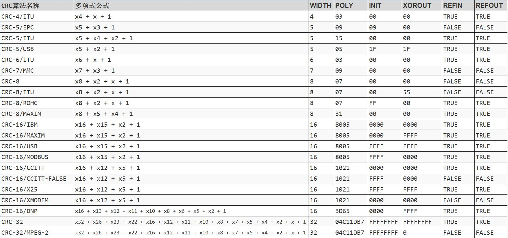

# STM32 HAL 12_CRC校验

## 1. CRC 校验原理

> 参考：[[CRC校验\]手算与直观演示_哔哩哔哩_bilibili](https://www.bilibili.com/video/BV1V4411Z7VA/?spm_id_from=333.1007.top_right_bar_window_history.content.click&vd_source=2d2507d13250e2545de99f3c552af296)

### CRC 简介

**CRC(Cyclic Redundancy Check)**，即循环冗余校验，是一种根据网络数据包或计算机文件等数据产生简短固定位数校验码的一种信道编码技术，主要用来检测或校验数据传输或者保存后可能出现的错误。CRC利用除法及余数的原理来作错误侦测。

> 在数据传输过程中，无论传输系统的设计再怎么完美，差错总会存在，这种差错可能会导致在链路上传输的一个或者多个帧被破坏(出现比特差错，0变为1，或者1变为0)，从而接受方接收到错误的数据。为尽量提高接受方收到数据的正确率，在接收方接收数据之前需要对数据进行差错检测，当且仅当检测的结果为正确时接收方才真正收下数据。
>
> 检测的方式有多种，常见的有**奇偶校验、因特网校验和循环冗余校验**等。循环冗余校验是一种用于校验通信链路上数字传输准确性的计算方法（通过某种数学运算来建立数据位和校验位的约定关系的 ）。发送方计算机使用某公式计算出被传送数据所含信息的一个值，并将此值 附在被传送数据后，接收方计算机则对同一数据进行相同的计算，应该得到相同的结果。如果这两个 CRC 结果不一致，则说明发送中出现了差错，接收方计算机可要求发送方计算机重新发送该数据。

### CRC 算法

1. 选择**生成多项式**

> - `WIDTH`：宽度，即生成的CRC数据位宽，如CRC-8，生成的CRC为8位。
> - `REFIN`：`true`或`false`，如为`true`输入的原始数据的每个字节需要做个逆序的处理，注意：针对的每个字节，而不是整个数据。

生成多项式通式：
$$
(\sum^j_{i=1}C_ix^i)+1
$$
随后取多项式每一项的系数构成**CRC除数**。

2. 在原始数据串末端加0

**根据生成多项式的阶数，在原始数据串的末端加阶数个数的0。**

3. 异或运算/模2除法

得到原数据串和CRC除数后，将**数据串（处理后）中的第一个1**和CRC除数左对齐进行**按位异或运算**。将**未处理的数据串移动至按位异或得到的数据右侧**，重复以上运算。

最后得到的为CRC校验值，**长度为CRC除数长度减一（即多项式的阶数）**。将校验值加到未处理前的数据串末尾。

将含CRC数据发出后，接收端将接收到的数据重新计算CRC值进行检验，如果与接收CRC值不符，则接收出错，反之则成功接收。