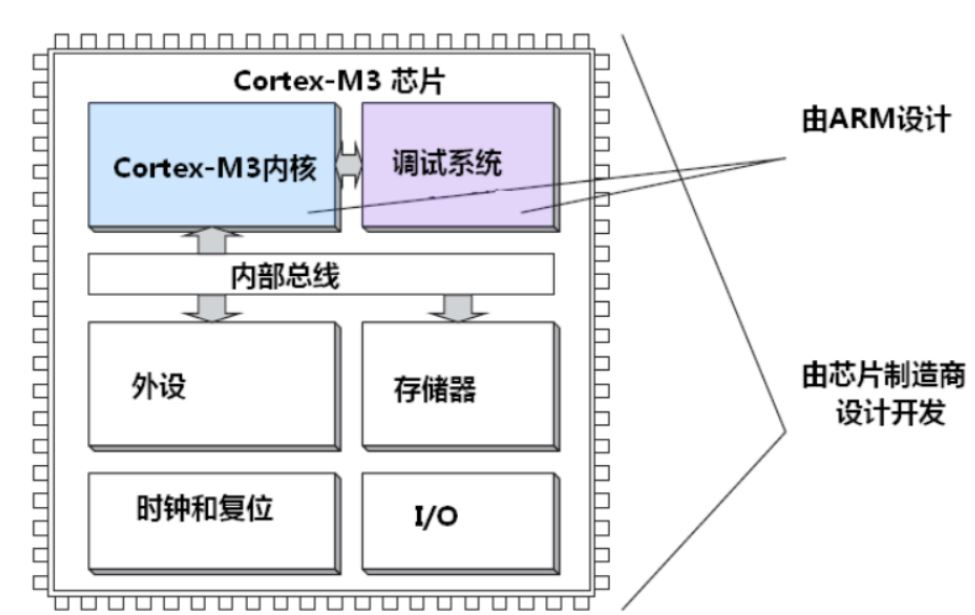
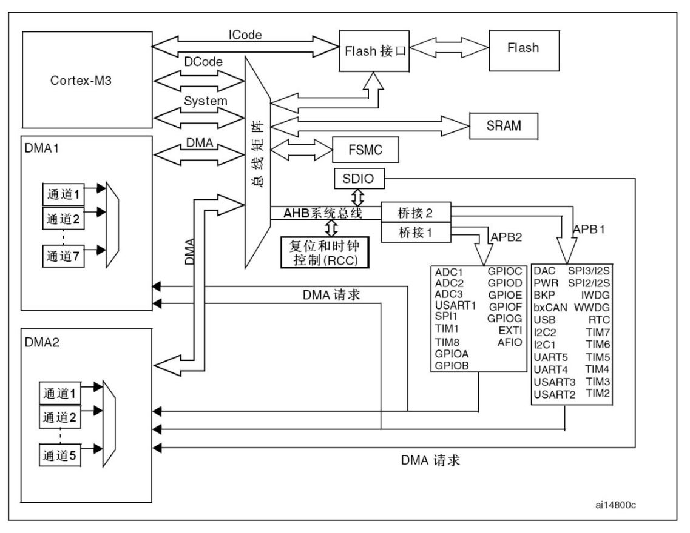
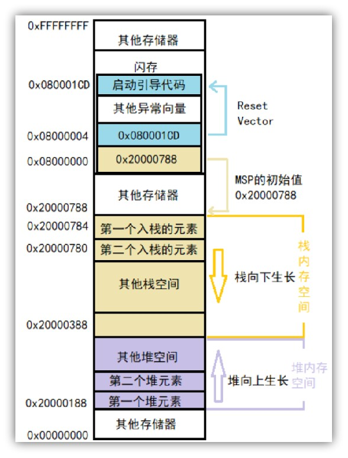

# STM32 HAL 3_STM32 总体架构

## 1. Cortex-M3内核



STM32 芯片是以 Cortex-M3 为内核。

Cortex-M3处理器内核是单片机的中央处理单元（CPU）。完整的基于MCU还需要很多其它组件。在芯片制造商得到CM3处理器内核的使用授权后，它们就可以把CM3内核用在自己的硅片设计中，添加存储器，外设，I/O以及其它功能块。不同厂家设计出的单片机会有不同的配置，包括存储器容量、类型、外设等都各具特色。

> Cortex-M3 针对低功耗微控制器设计的处理器，面积小但是性能强劲，支持可以处理器快速处理复杂任务的丰富指令集。具有硬件除法器和乘加指令（MAC）.并且，M3支持全面的调试和跟踪功能，使软件开发者可以快速的开发他们的应用。
>
> Cortex-M4 不但具备 Cortex-M3的所有功能，并且扩展了面向数字信号处理（DSP）的指令集，比如单指令多数据指令（SMID）和更快的单周期 MAC操作。此外，它还有一个可选的支持 IEEE754浮点标准的单精度浮点运算单元。

## 2. STM32 F1xx 芯片架构



**四个主动单元：**

> Cortex™-M3内核
>
> DCode总线(D-bus)
>
> 系统总线(S-bus) 
>
> 通用DMA1和通用DMA2

**四个被动单元：**

> 内部SRAM 
>
> 内部闪存存储器
>
> FSMC 
>
> AHB(高级高性能总线)到APB(高级外围总线)的桥(AHB2APBx)，它连接所有的APB设备;

**ICode**：将Cortex™-M3内核的指令总线与闪存指令接口相连接。指令预取在此总线上完成。

**AHB/APB桥(APB)**：AHB——72MHz ; APB1——36MHz ; APB2——72MHz。

## 3. STM32 寄存器概述

- 32位单片机有32根地址线(4G)(导通或不导通);(n根地址线内存大小为$2^n$)
- 单片机内存地址访问的存储单元是按照字节编址的;(地址对应的是一个8bit的内存空间)
- STM32寻址范围:0x00000000~0xFFFFFFFF

### 3.1 存储器映射
- 存储器：可以存储数据的设备，本身没有地址信息，对存储器分配地址的过程称为存储器映射。

- STM32的存储器映射
>|存储块|功能|地址范围|
>|------|----|----|
>|Block0|Code(FLASH)|0x0000 0000~0x1FFF FFFF
>|Block1|SRAM|0x2000 0000~0x3FFF FFFF
>|Block2|片上外设|0x4000 0000~0x5FFF FFFF
>|Block3|FSMC Bank1&2|0x6000 0000~0x7FFF FFFF
>|Block4|FSMC Bank3&4|0x8000 0000~0x9FFF FFFF
>|Block5|FSMC寄存器|0xA000 0000~0xBFFF FFFF
>|Block6|备用|0xC000 0000~0xDFFF FFFF
>|Block7|Cortex M3|0xE000 0000~0xFFFF FFFF

1. Block0 FLASH 功能划分
>|存储块|功能|地址范围|
>|------|----|----|
>|Block0|FLASH或系统存储器别名区|0x0000 0000~0x0007 FFFF
>||备用|0x0008 0000~0x07FF FFFF
>||用户FLASH，存储用户代码|0x0800 0000~0x0807 FFFF
>||备用|0x0808 0000~0x1FFF EFFF
>||系统存储器，存储出厂BootLoader|0x1FFF F000~0x1FFF F7FF
>||选项字节，配置读保护|0x1FFF F800~0x1FFF F80F
>||备用|0x1FFF F810~0x1FFF FFFF

2. Block1 SRAM(内存) 功能划分
>|存储块|功能|地址范围|
>|------|----|----|
>|Block1|SRAM|0x2000 0000~0x2000 FFFF
>||备用|0x2001 0000~0x3FFF FFFF

3. Block2 片上外设 功能划分
>|存储块|功能|地址范围|
>|------|----|----|
>|Block2|APB1总线外设|0x4000 0000~0x4000 77FF
>||备用|0x4000 7800~0x4000 FFFF
>||APB2总线外设|0x4001 8000~0x4000 3FFF
>||备用|0x4001 4000~0x4001 7FFF
>||AHB总线外设|0x4001 8000~0x4002 33FF
>||备用|0x4002 3400~0x5FFF FFFF
>

### 3.2 寄存器映射

寄存器是单片机内部的特殊内存，实现对单片机各个功能的控制。

1. 寄存器分类

>||||
>|----|----|----|
>|内核寄存器|内核相关寄存器|R0~R15,特殊功能寄存器|
>||中断控制寄存器|NVIC和SCB相关寄存器(NVIC: ISER,ICER,ISPR,IP)(SCB: VTOR,AIRCR,SCR)|
>||Systick寄存器|CTRL,LOAD,VAL,CALIB|
>||内存保护寄存器|
>||调试系统寄存器|ETM,ITM,DWT,IPIU|
>|外设寄存器||GPIO,UART,IIC,SPI,TIM
>|||DMA,ADC,DAC,PTC,I/WWDG,PWR,CAN,USB|

2. 寄存器映射

- 寄存器映射：给寄存器地址命名。


- 直接操作寄存器地址(以GPIOA_ODR为例)
```c
*(unsigned int *)(0x4001080C) = 0xFFFF;
```
- 宏定义操作寄存器地址
```c
#define GPIOA_ODR *(unsigned int *)(0x4001080C)
GPIOA_ODR = 0xFFFF;
```

3. 寄存器地址计算

寄存器地址分为3部分：

- 总线基地址(`BUS_BASE_ADDR`)
- 外设基于总线基地址的偏移量(`PERIPH_OFFSET`)
- 寄存器相对于相对于外设基地址的偏移量(`REG_OFFSET`)

$寄存器地址 = BUS\_BASE\_ADDR + PERIPH\_OFFSET +REG\_OFFSET$

>|总线|基地址|偏移量|
>|---|---|---|
>|APB1(外设基地址`PERIPH_BASE`)|0x4000 0000|0
>|APB2|0x4001 0000|0x1 0000
>|AHB|0x4001 8000|0x1 8000

4. 使用结构体完成寄存器配置(以GPIOA为例)

```c
typedef struct
{
    __IO uint32_t CRL;
    __IO uint32_t CRH;
    __IO uint32_t IDR;
    __IO uint32_t ODR;
    __IO uint32_t BSRR;
    __IO uint32_t BRR;
    __IO uint32_t LCKR;
}GPIO_TypeDef

GPIOA_BASE = 0x40010800;

#define GPIOA ((*GPIO_TypeDef)GPIOA_BASE) 

```

## 4. STM32 的软件启动过程

### 1. MAP 文件

- MDK编译过程文件

>文件类型|	简介
>|---|---|
>.o|	可重定向对象文件，每个.c/.s文件都对应一个.o文件
>.axf|	可执行对象文件，由.o文件链接生成，仿真的时候需要用到此文件
>.hex|	INTEL Hex格式文件，用于下载到MCU运行，由.axf转换而来
>.map|	连接器生成的列表文件，对分析程序存储占用情况非常有用
>其他|	.crf、.d、.dep、.lnp、.lst、.htm、.build_log、.htm等一般用不到

MAP文件是MDK编译代码后，产生的集程序、数据及IO空间的一种映射列表文件,
包括了各种.c文件、函数、符号等的地址、大小、引用关系等信息

### 2. STM32的启动模式

- 内核复位
- 从地址 0x0000 0000 处取出堆栈指针 MSP 的初始值，该值就是栈顶地址;
- 从地址 0x0000 0004 处取出程序计数器指针 PC 的初始值，该值是复位向量(RESET_Handler);
- 芯片厂商可以会把0x0000 0000和0x0000 0004地址映射到其它的地址.

- 在系统复位后，SYSCLK的第4个上升沿，BOOT引脚的值将被锁存，启动模式确定;
>|BOOT1|BOOT0|启动模式|0x00000000映射地址|0x00000004映射地址
>|--|--|--|--|--|
>x|	0	|主闪存存储器|	0x08000000	|0x08000004
>0|1|系统存储器|0x1FFFF000|0x1FFFF004
>1|1|内置SRAM|0x20000000|0x20000004

注：无法下载程序解决方法：BOOT0接3.3，按复位，然后再下载

### 3. STM32的启动过程

以内部FLASH启动为例：

- 从0x0800 0000获取MSP值；
- 从0x0800 0004获取PC值；
- 调用`Reset_Handler`函数，启动startup_stm32xxx.s文件；
- 调用main函数；

1. 复位中断服务函数(汇编语言)
```c
Reset_Handler   PROC
                EXPORT  Reset_Handler   [WEAK]
                IMPORT  __main
                IMPORT  SystemInit
                LDR   R0, =SystemInit
                BLX   R0               
                LDR   R0, =__main
                BX      R0
                ENDP
//EXPORT：标明全局属性，可被外部调用
//IMPORT：申明来自外部文件，类extern
//PROC：定义子程序
//ENDP：表示子程序结束
//WEAK：弱定义
```

