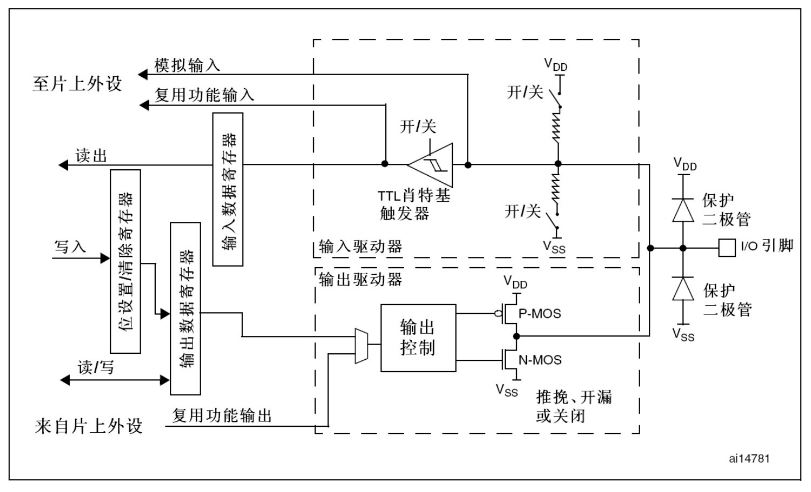
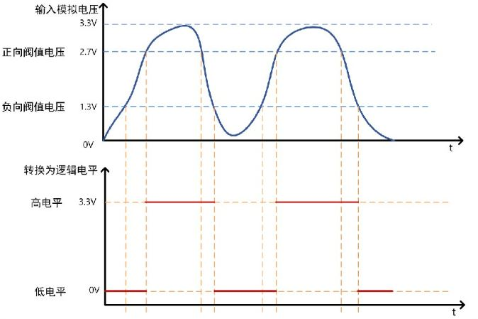
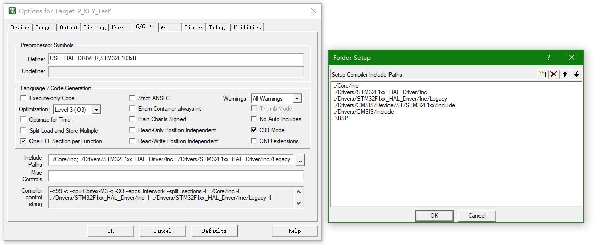

# STM32 HAL 4_GPIO

## 1. 硬件结构

General Purpose Input Output，即**通用输入输出端口**，简称GPIO;

作用：负责采集外部器件的信息或者控制外部器件工作，即输入输出.

- 电气特性

1. STM32工作电压范围：$2 V ≤ VDD ≤ 3.6 V$
2. GPIO识别电压范围：0 : $-0.3V ≤ V_{IL} ≤ 1.164V$，1: $1.833V ≤ V_{IH} ≤ 3.6V$

- 框图



**施密特触发器**

> - 施密特触发器
>
> 施密特触发器是一种整流电路，可以将非标准方波，整流成方波。
>
> **特点：**
>
> 1. 当输入电压高于正向阈值电压，输出为高；
>
> 2. 当输入电压低于负向阈值电压，输出为低；
>
> 3. 当输入在正负向阈值电压之间，输出不改变。
>
>    

### GPIO 工作模式

>| 模式           | 特点及应用                                  |
>| -------------- | ------------------------------------------- |
>| 浮空输入       | 输入用，完全浮空，状态不定                  |
>| 上拉输入       | 输入用，用内部上拉，默认是高电平            |
>| 下拉输入       | 输入用，用内部下拉，默认是低电平            |
>| 模拟功能       | ADC、DAC                                    |
>| 开漏输出       | 软件IIC的SDA、SCL等                         |
>| 推挽输出       | 驱动能力强，25mA（max），通用输出           |
>| 开漏式复用功能 | 片上外设功能（硬件IIC 的SDA、SCL引脚等）    |
>| 推挽式复用功能 | 片上外设功能（SPI 的SCK、MISO、MOSI引脚等） |

- **浮空输入**

  > 1. 上拉电阻关闭
  > 2. 下拉电阻关闭
  > 3. 施密特触发器打开
  > 4. 双MOS管不导通
  >
  > **特点：** 空闲时，IO状态不确定(高阻态)，由外部环境决定

- **上拉输入**

  >1. 上拉电阻打开
  >2. 下拉电阻关闭
  >3. 施密特触发器打开
  >4. 双MOS管不导通
  >
  >**特点：** 空闲时，IO呈现高电平

- **下拉输入**

  > 1. 上拉电阻关闭
  > 2. 下拉电阻打开
  > 3. 施密特触发器打开
  > 4. 双MOS管不导通
  >
  > **特点：** 空闲时，IO呈现低电平

- **模拟功能**

  > 1. 上拉电阻关闭
  > 2. 下拉电阻关闭
  > 3. 施密特触发器关闭
  > 4. 双MOS管不导通
  >
  > **特点：** 专门用于模拟信号输入或输出，如：ADC和DAC

- **开漏输出**

  > 1. 上拉电阻关闭
  > 2. 下拉电阻关闭
  > 3. 施密特触发器打开
  > 4. P-MOS管始终不导通
  > 5. 往ODR对应位写0，N-MOS管导通，写1则N-MOS管不导通
  >
  > **特点：** 不能输出高电平，必须有外部（或内部）上拉才能输出高电平

- **开漏复用功能**

  > 1. 上拉电阻关闭
  > 2. 下拉电阻关闭
  > 3. 施密特触发器打开
  > 4. P-MOS管始终不导通
  >
  > **特点：**
  >
  > 1. 不能输出高电平，必须有外部（或内部）上拉才能输出高电平
  > 2. 由其他外设控制输出

- **推挽输出**

  > 1. 上拉电阻关闭
  > 2. 下拉电阻关闭
  > 3. 施密特触发器打开
  > 4. 往ODR对应位写0，N-MOS管导通，写1则P-MOS管导通
  >
  > **特点：** 可输出高低电平，驱动能力强

- **推挽复用功能**

  > 1. 上拉电阻关闭
  > 2. 下拉电阻关闭
  > 3. 施密特触发器打开
  >
  > **特点：**
  >
  > 1. 可输出高低电平，驱动能力强
  > 2. 由其他外设控制输出

## 2. STM32 HAL库函数

- HAL库函数

  ```c
  /**
    * @brief	GPIO输出函数
    * @param 	GPIOx GPIO通道号，如GPIOA
    * @param	GPIO_Pin	GPIO引脚号，如GPIO_PIN_13
    * @param 	PinState	GPIO引脚状态，为枚举类型（GPIO_PIN_SET,GPIO_PIN_RESET）
    */
  
  void HAL_GPIO_WritePin(GPIO_TypeDef* GPIOx, uint16_t GPIO_Pin, GPIO_PinState PinState);
  
  /**
    * @brief	GPIO电平翻转函数
    * @param 	GPIOx GPIO通道号，如GPIOA
    * @param	GPIO_Pin	GPIO引脚号，如GPIO_PIN_13
    */
  void HAL_GPIO_TogglePin(GPIO_TypeDef* GPIOx, uint16_t GPIO_Pin);
  
  /**
    * @brief	GPIO读取电平函数
    * @param 	GPIOx GPIO通道号，如GPIOA
    * @param	GPIO_Pin	GPIO引脚号，如GPIO_PIN_13
    * @return	引脚状态，高为1，低为0
    */
  GPIO_PinState HAL_GPIO_ReadPin(GPIO_TypeDef* GPIOx, uint16_t GPIO_Pin);
  
  
  /**
    * @brief	毫秒延时函数
    * @param 	Delay 延时毫秒数
    */
  __weak void HAL_Delay(uint32_t Delay)
  ```

  **按键读取实验——以读取电平方式**
  
  按键按下时引脚获得按键另一端的电平（3.3V或GND）。
  
   通常的按键所用开关为机械弹性开关，当机械触点断开、闭合时，由于机械触点的弹性作用，一个按键开关在闭合时不会马上稳定地接通，在断开时也不会一下子断开。因而在闭合及断开的瞬间均伴随有一连串的抖动，为了不产生这种现象而作的措施就是按键消抖。
  
  抖动时间的长短由按键的机械特性决定，一般为5ms～10ms。
  
  按键稳定闭合时间的长短则是由操作人员的按键动作决定的，一般为零点几秒至数秒。**为确保CPU对键的一次闭合仅作一次处理，必须去除键抖动。在键闭合稳定时读取键的状态，并且必须判别到键释放稳定后再作处理。**
  
  可以使用延时的方式进行消抖处理。
  
  ```c
  void Key_Scan(void)
  {
      while (1)
      {
          if (HAL_GPIO_ReadPin(KEY_Port, KEY_Pin) == GPIO_PIN_RESET)				//按键被按下，读取到低电平
          {
              HAL_Delay(20);														//等待20ms用于消除抖动
              if(HAL_GPIO_ReadPin(KEY_GPIO_Port, KEY_Pin) == GPIO_PIN_RESET)		//20ms后仍能读取到低电平，判定为按键按下
              {
                  HAL_GPIO_TogglePin(LED_Port, LED_Pin);							//按键按下后执行的操作
              }
          }
      }
  }
  ```
  
  > **使用宏定义**
  >
  > 宏定义可以用于替换代码的重复部分，在引脚号等发生变化时，仅需修改宏定义而无需大量修改代码
  >
  > ```c
  > #define LED_Port	GPIOC
  > #define LED_Pin		GPIO_PIN_13
  > 
  > HAL_GPIO_WritePin(LED_Port, LED_Pin, GPIO_PIN_RESET);
  > ```
  
  > **使用标志位**
  >
  > 标志位一般有0和1两个值，表示两种不同的状态。
  >
  > 比如按键代码：
  >
  > ```c
  > uint8_t key_flag = 0;
  > 
  > void Key_Scan(void)
  > {
  >     while (1)
  >     {
  >         if (HAL_GPIO_ReadPin(KEY_Port, KEY_Pin) == GPIO_PIN_RESET)				//按键被按下，读取到低电平
  >         {
  >             HAL_Delay(20);														//等待20ms用于消除抖动
  >             if(HAL_GPIO_ReadPin(KEY_GPIO_Port, KEY_Pin) == GPIO_PIN_RESET)		//20ms后仍能读取到低电平，判定为按键按下
  >             {
  >                 key_flag != key_flag;											//按键按下翻转标志位
  >             }
  >         }
  >     }
  > }
  > 
  > int main()
  > {
  >     while(0)
  >     {
  >         if(key_flag == 0)
  >         {
  >             ;						//状态1执行操作
  > 		}
  >         else
  >         {
  >             ;						//状态2执行操作
  >         }
  > 	}
  > }
  > ```

**同时，如果是直接外接的按键，如果无外部上/下拉电阻，务必加上上/下拉电阻避免浮空输入造成电平抖动。**

> **功能包编程方法**
>
> 将一个模块（LED，传感器）通过一个文件封装，向外引出初始化接口和用户使用接口。
>
> 
>
> 