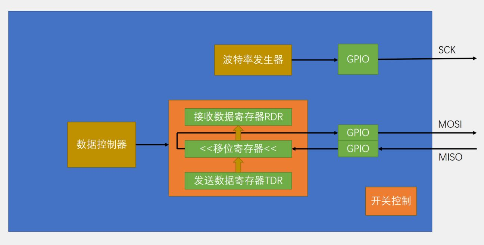

# STM32 HAL 8_SPI

## 1. SPI 物理层

SPI：串行外设设备接口（Serial Peripheral Interface），是一种**高速的，全双工，同步**的通信总线。


**SCK：** 时钟线；用于通信数据同步，由主机产生并决定通信速率。
**MOSI(CMD)：** 主机输出/从机输入（命令线）
**MISO(DAT)：** 主机输入/从机输出（信号线）
**CS：** 片选（设备选择信号线）

> 从机将片选线拉低（片选线空闲时为高电平），表示该从机和主机开始通信。

## 2. SPI 协议层

### SPI时序
**起始信号**：CS由高电平变为低电平，对应设备被选中，通信开始。
**终止信号**：CS由低电平变为高电平，对应设备取消选中，通信结束。
**数据传输**：MISO和MOSI在SCK的每个时钟周期内传输1位数据，输入输出同时进行。

- 输出模式

1. **时钟极性(CPOL)** 定义了时钟空闲状态电平：
   `CPOL=0`，表示当`SCL=0`时处于空闲态。
   `CPOL=1`，表示当`SCL=1`时处于空闲态。

2. **时钟相位(CPHA)** 定义数据的采集时间：
   `CPHA=0`，在时钟的第一个跳变沿（上升沿或下降沿）进行数据采样。在第2个边沿发送数据。
   `CPHA=1`，在时钟的第二个跳变沿（上升沿或下降沿）进行数据采样。在第1个边沿发送数据。


(以上为CPOL = 0，CPHA = 0的情况)

### STM32 SPI框图




## 3. SPI 的使用

### 软件模拟SPI

> 输出引脚 SCL, MOSI, CS设置为高速输出，推挽输出。
>
> 输入引脚 MISO 设置为浮空输入。

```c
/**
  *	@brief 软件SPI发送读取字节函数
  */
uint8_t SPI_TransmitReceive(uint8_t send_byte)
{
    uint8_t i, recv_byte = 0x00;
    CS(0);			//片选信号拉低
    for(i = 0;i < 8;i++)
    {
        //按位输出（高位先行），使用按位与提取每一位的数据
        MOSI(send_byte & (0x80 >> i));
        //第一个时钟跳变沿
        SCL(1);
        //等待大概1us，可以使用for空循环等待
        delay_us(1);
        //按位读取（高位先行），使用按位异或写入每一位数据
        if(MISO() == 1)
        {
            recv_byte |= (0x80 >> i);
        }
        //第二个时钟跳变沿
        SCL(0);
        delay_us(1);
    }
    CS(1);			//片选信号拉高
    return recv_byte;
}
```

### HAL 库函数

```c
/**
  * @brief  SPI发送接收函数（阻塞式）
  * @param  hspi SPI句柄 hspix
  * @param  pTxData 发送的缓冲区指针
  * @param  pRxData 接收的缓冲区指针
  * @param  Size 发送和接收的数据量
  * @param  Timeout 超时时间
  */

HAL_StatusTypeDef HAL_SPI_TransmitReceive(SPI_HandleTypeDef *hspi, uint8_t *pTxData, uint8_t *pRxData, uint16_t Size, uint32_t Timeout);

/**
  * @brief  SPI发送函数（阻塞式）
  * @param  hspi SPI句柄 hspix
  * @param  pTxData 发送的缓冲区指针
  * @param  Size 发送的数据量
  * @param  Timeout 超时时间
  */
HAL_StatusTypeDef HAL_SPI_Transmit(SPI_HandleTypeDef *hspi, uint8_t *pData, uint16_t Size, uint32_t Timeout);

/**
  * @brief  SPI接收函数（阻塞式）
  * @param  hspi SPI句柄 hspix
  * @param  pRxData 接收的缓冲区指针
  * @param  Size 接收的数据量
  * @param  Timeout 超时时间
  */
HAL_StatusTypeDef HAL_SPI_Receive(SPI_HandleTypeDef *hspi, uint8_t *pData, uint16_t Size, uint32_t Timeout);

```

