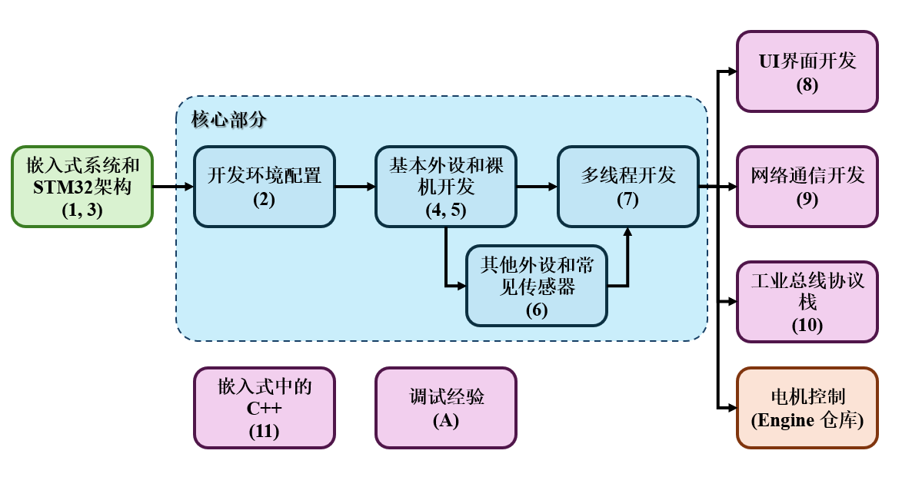
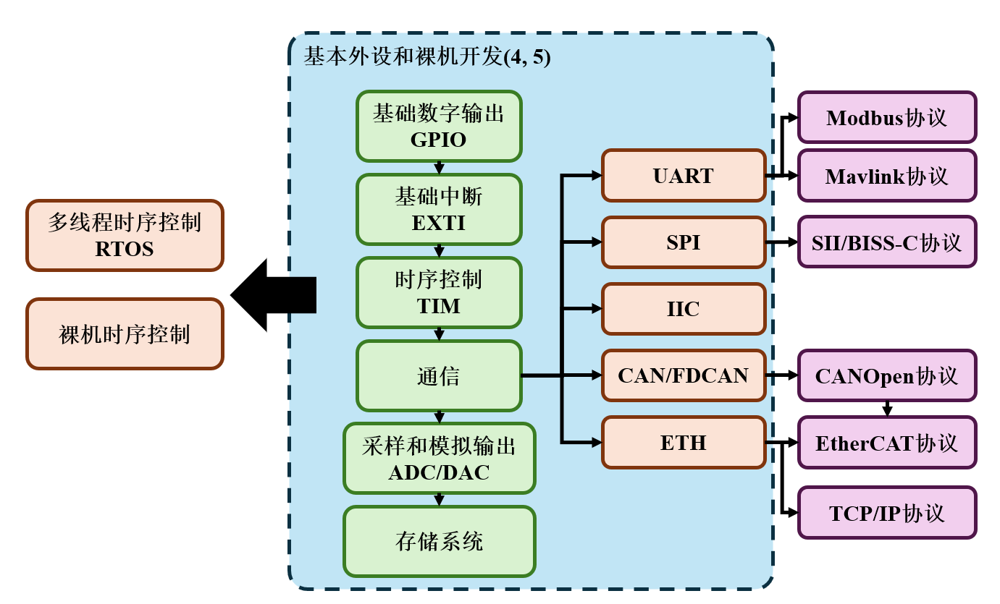

# STM32

本仓库用于记录 STM32 的学习过程，仓库内容如下：

>- `Note`：STM32 的学习笔记 (markdown 文件)；
>- `Code`：STM32 的例程 (代码)；
>- `Library`：传感器库；
>- `Handbook`：手册；

仓库适用于 STM32F1/F4，使用 H7 会额外标注说明。

---

**学习路径：**





---

**下载流程：**

由于仓库内存在一些使用 LFS 管理的软件包，使用 `git clone` 时会比较慢，因此推荐的下载流程如下：

1. 跳过 LFS 管理，`clone` 仓库本体：

    *Powershell：*

    ```shell
    $env:GIT_LFS_SKIP_SMUDGE=1; git clone --depth 1 https://github.com/SSC202/STM32_Basic.git
    ```

    *Windows CMD：*

    ```shell
    set GIT_LFS_SKIP_SMUDGE=1
    git clone --depth 1 https://github.com/SSC202/STM32_Basic.git
    ```

    此时可以正常使用仓库。

2. 如果需要下载 LFS 管理的大文件，使用以下命令 (下载用时较长)：

    ```shell
    git lfs fetch
    git lfs checkout
    ```

    